## MySQL日志

MySQL日志主要包括错误日志，查询日志，二进制日志，事务日志几大类，其中比较重要的还要数二进制日志binlog（归档日志）、事务日志redo log（重做日志）和undo log（回滚日志）

### redo log

**redo log是InnoDB存储引擎特有的，他让MySQL有了崩溃恢复的能力**

比如当MySQL实例挂了或者宕机的时候，重启时，InnoDB存储引擎会使用redo log恢复数据，保证数据的持久性和完整性

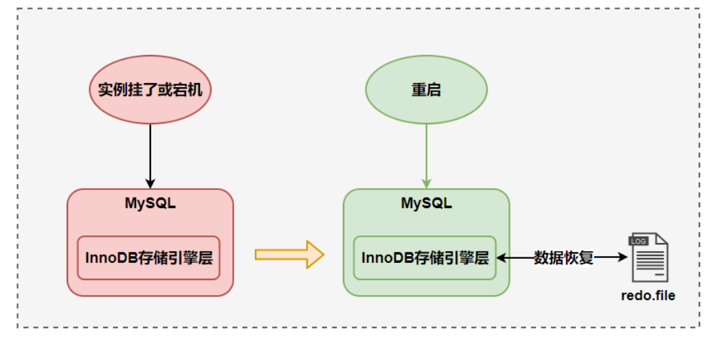

MySQL中数据是以页为单位的，你查询一条记录，会从硬盘把一页的数据加载出来，加载出来的数据叫做数据页，会放入到Buffer Pool中，后续的查询都是先从Buffer pool中查找，如果没能命中再去硬盘加载，减少硬盘IO的次数

更新数据表的时候也是如此，发现Buffer pool中存在要更新的数据，就直接在Buffer pool中更新

然后会把**“在某个数据页上做了哪些修改”**记录到重做日志缓存（redo log buffer）中，接着刷盘到redo log中

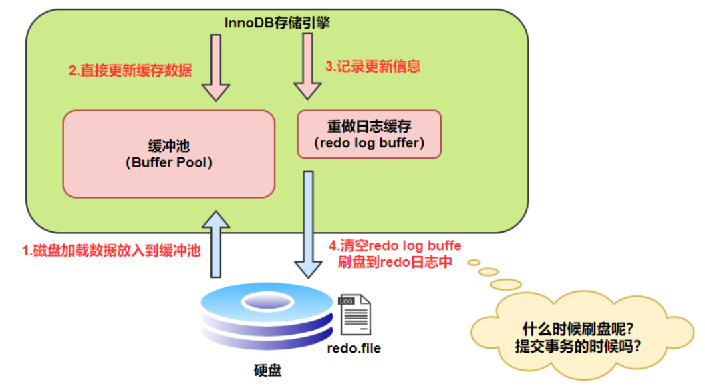

> 每条redo记录都是由“表空间号 + 数据页号 + 偏移量 + 修改数据长度 + 具体修改的数据”组成

#### 刷盘时机

InnoDB存储引擎为redo log的刷盘策略提供了`innodb_flush_log_at_trx_commit`参数，它支持三种策略：

- 0：设置为0的时候，表示每次事务提交之后不进行刷盘操作

- 1：设置为1的时候，表示每次事务提交之后进行刷盘操作（默认值）
- 2：设置为2的时候，表示每次事务提交之后都只把redo log buffer的内容写入到page cache中

`innodb_flush_log_at_trx_commit` 参数默认为 1 ，也就是说当事务提交时会调用`fsync` 对 redo log 进行刷盘

另外，InnoDB中有一个后台线程，**每隔1秒**就会把redo log buffer中内容写入到page cache中，然后调用`fsync`刷盘

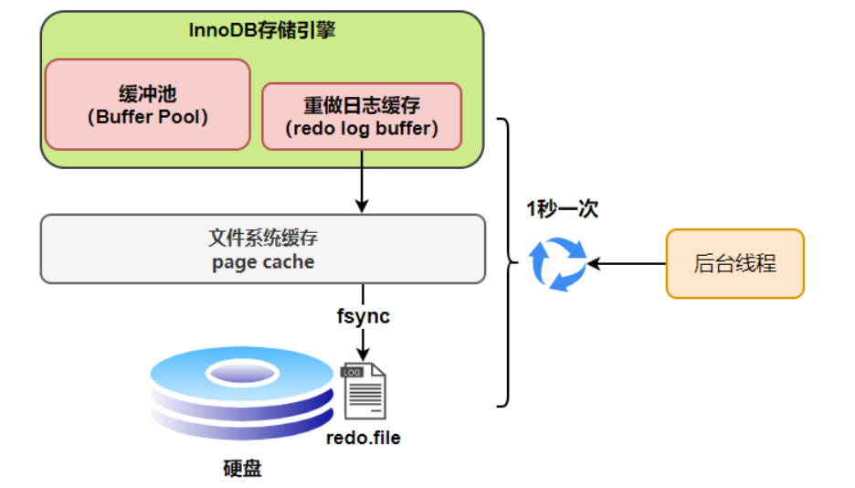

也就是说，**一个没有提交事务的redo log记录，也可能会刷盘，**因为事务执行过程中redo log记录是会写入redo log buffer中，这些redo log会被后台线程刷盘，如下图所示

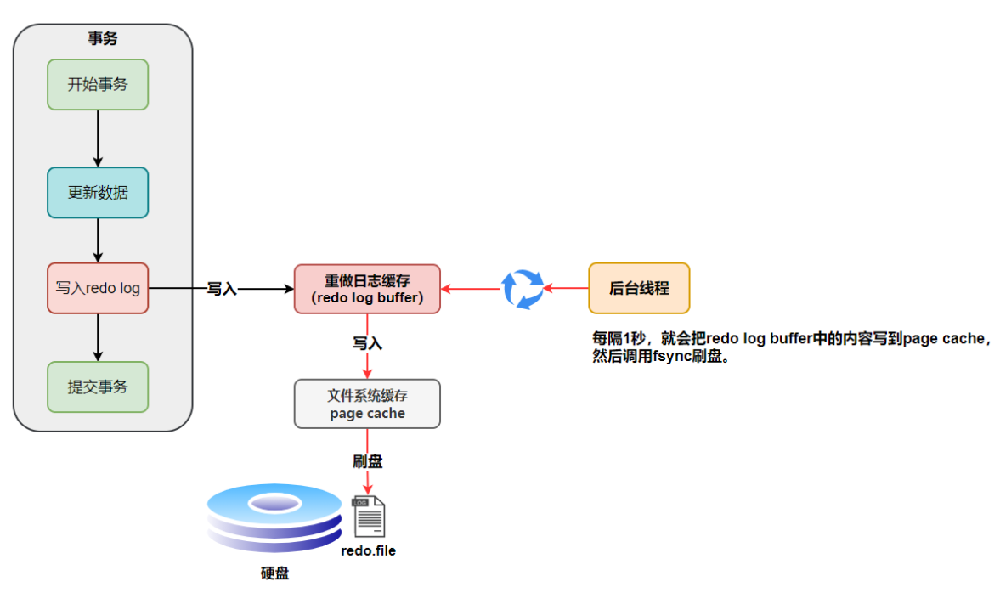

除了后台线程每秒1次的轮询操作以外，还有一种情况，当redo log buffer占用的空间即将达到`innodb_log_buffer_size`一半的时候，后台线程会主动刷盘

因此，不同策略下的刷盘流程分别如下：

- `innodb_flush_log_at_trx_commit=0`，事务提交之后不会刷盘，等待后台线程一秒一次的轮询调用

  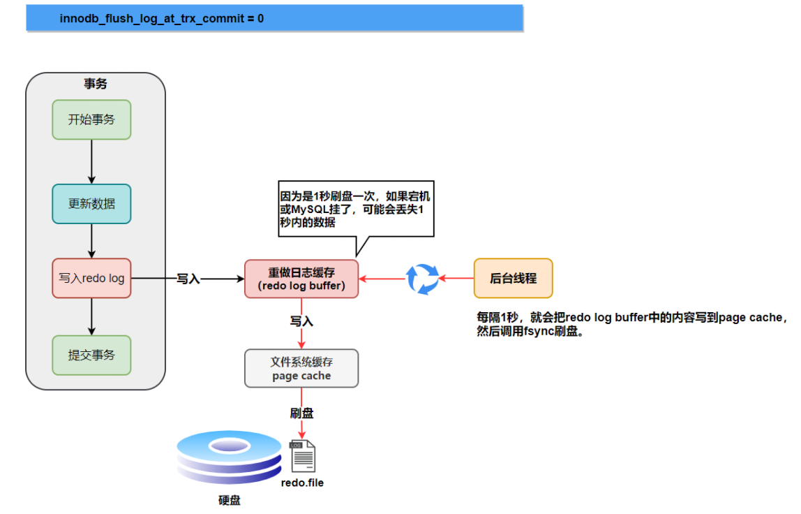

  可以发现，当设置为0的时候，当MySQL挂了或者宕机的时候，有可能会产生1秒数据的丢失

- `innodb_flush_log_at_trx_commit=1`，事务提交之后立刻刷盘

  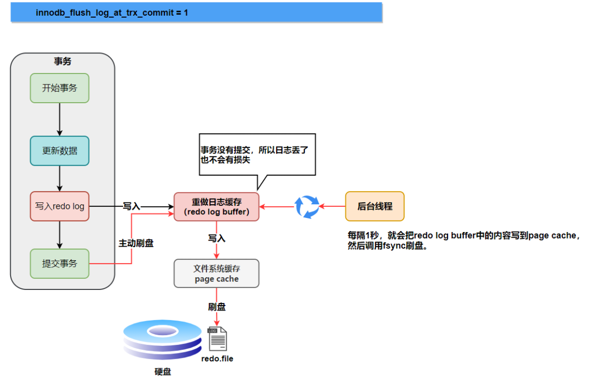

  可以发现，设置为1的时候，只要事务提交成功，redo log记录就一定在硬盘中，不会有任何的数据丢失

  如果在事务执行期间，MySQL挂了或者宕机，这部分的日志会丢失，但是由于事务没有提交，所以即便日志丢失了数据也不会有损失

- `innodb_flush_log_at_commit=2`，事务提交之后，将redo log buffer中的内容写到page cache中

  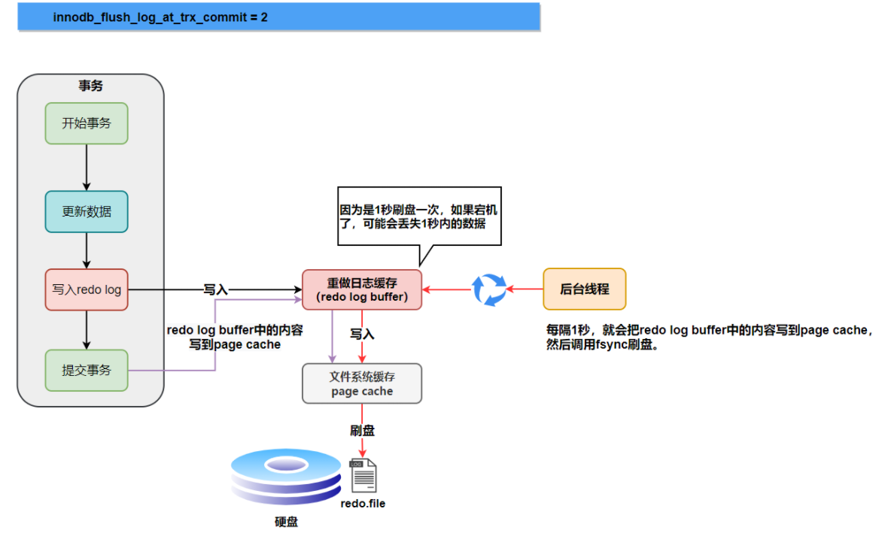

  可以发现，如果仅仅是MySQL挂了，那么不会有任何影响，因为事务提交之后redo log buffer中的内容已经被写入到page buffer中了，但是如果发生了宕机，那么就可能会丢失这1秒内的数据

####  日志文件组

**硬盘上**redo log日志文件不止一个，而是以一个日志文件组的形式出现的，每个redo日志文件的大小是一致的

比如可以配置一组4个文件，将每个redo日志文件大小设置为1GB，整个redo log日志文件组可以记录4GB的内容

它采用的是**环形数组形式**，从头开始写，写到末尾又写到头循环写，如下图所示：

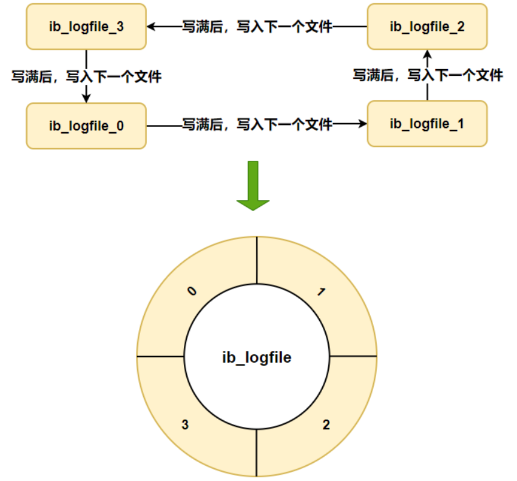

在日志文件组中有两个重要属性，分别是`write pos`和`checkpoint`

- write pos是当前记录的位置，一边写一边往后移
- checkpoint是记录当前要擦除的位置，也是往后移动

每次刷盘`redo log`记录到日志文件组中，`write pos`的位置就会后移更新

每次MySQL加载日志文件组的时候，就会清空加载过的redo log记录，并把checkpoint后移更新。

write pos和checkpoint之间的还空着的部分可以用来写入新的redo log记录

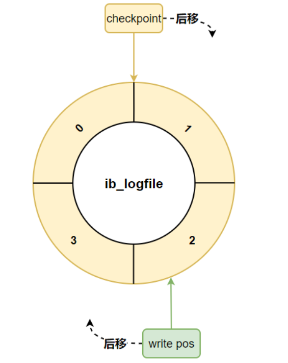

如果write pos追上了checkpoint，那么说明日志文件组满了，这时不能再写入新的redo log记录，MySQL得停下来，清空一些记录，把checkpoint再推进一下

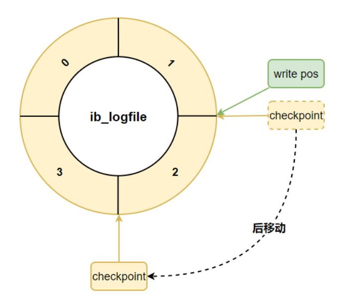

### binlog

redo log是物理日志，记录内容是在某个数据页上做了哪些修改，属于InnoDB存储引擎

binlog是逻辑日志，记录内容是语句的原始逻辑，类似于“给ID=2的这一行的C字段加1”，属于MySQL server层

不管使用什么存储引擎，**只要发生了表数据更新，就会产生binlog文件**

MySQL数据库的**数据备份、主备、主主、主从**都离不开binlog，需要依靠binlog来同步数据，保证数据一致性

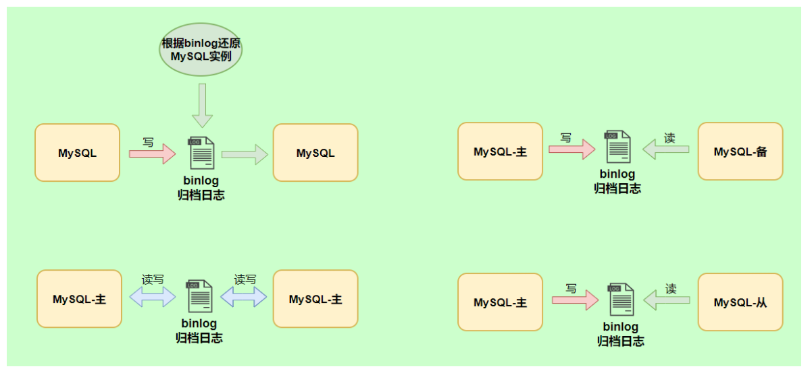

**binlog会记录所有涉及数据更新的逻辑操作，并且是顺序写**

#### 记录格式

binlog日志有三种格式，可以通过`binlog_format`参数指定

- statement
- row
- mix

**指定statement，记录的内容是SQL语句原文，**比如执行了一条`update T set update_time=now() where id=1`，记录的内容如下

同步数据时，会执行记录的SQL语句，但是有个问题，`update_time=now()`这里会获取当前系统时间，直接执行会导致与原库的数据不一致。

> 指定statement时保存的就是这个语句，直接存的就是update_time=now()，再次执行的时候，会再执行一遍now()，第二次执行和第一次执行的系统时间肯定是不相同的，这就造成了数据不一致

为了解决这种问题，我们需要**指定为row，记录的内容不再是简单的SQL语句了，还包含操作的具体数据**，记录内容如下：

通过row格式记录的binlog是直接看不出来的，需要借助mysqlbinlog工具解析出来

`update_time=now()`变成了具体的时间`update_time=1627112756247`，条件后面的@1、@2、@3 都是该行数据第1个~3 个字段的原始值（**假设这张表只有 3 个字段**）。

这样就能够保证数据的一致性，**通常情况下都是指定为row，**这样可以为数据的恢复与同步带来更好的性能损耗

但是这种格式，很明显需要更大的容量来记录，比较占用空间，恢复和同步时会更消耗IO资源，影响执行速度

所以就有了一种折中的方案，**指定为mixed，记录的内容是前两者的混合**

MySQL会判断这条SQL语句是否可能引起数据的不一致，如果是，就使用row，如果不是就使用statement

#### 写入机制

binlog的写入时机也非常简单，在事务执行的过程中，先把日志写到binlog cache中，事务提交的时候，再把`binlog cache`写到binlog文件中

**因为一个事务的binlog不能被拆开，无论这个事务多大，也要确保一次性写入，所以系统会为每个线程分配一个binlog cache**

我们可以通过`binlog_cache_size`参数控制单个线程`binlog cache`的大小，如果存储内容超过了这个参数，那么就暂存到磁盘（Swap）

- 上图的write，是指把日志写入到文件系统的page cache，并没有把数据持久化到磁盘
- 上图的fsync，才是把数据持久化到磁盘的操作

**`write`和`fsync`的时机，可以由参数`sync_binlog`控制**，默认是`1`

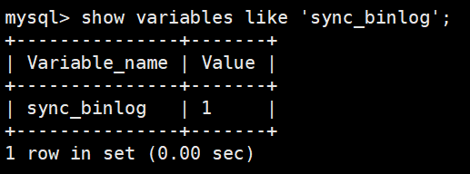

- sync_binlog为0的时候，表示每次提交事务都只write，由系统自行判断什么时候执行fsync，所以发生宕机后，pagecache中的binlog会丢失

  

- sync_binlog为1的时候，每次提交事务都会执行fsync操作，即把page cache中的数据刷到磁盘中

- 还有一种这种方案，那就是将sync_binlog设置成N（N>1），表示每次提交事务都write，但是积累N个事务之后才fsync

  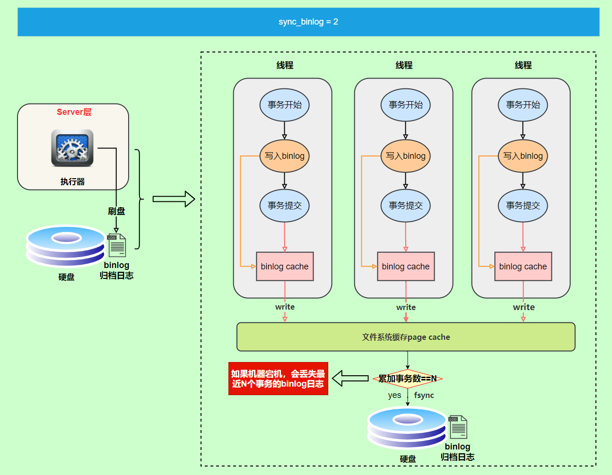

因此，在IO出现瓶颈的时候，可以将`sync_binlog`的值设置成一个较大的N，可以提升性能，但是如果机器发生宕机，会丢失最近N个事务的binlog

### 两阶段提交

- `redo log`让InnoDB存储引擎有了崩溃恢复的能力
- `binlog`保证了MySQL集群架构的数据一致性

虽然它们都属于持久化的保证，但是侧重点不同

在执行更新语句的过程中，会记录redo log和bin log两种日志，以基本的事务为单位，redo log在事务执行的过程中可以不断写入，而bin log只有在提交事务的时候才会写入，所以redo log和bin log的写入时机不一致

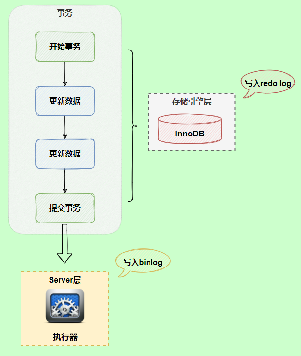

> **如果redo log和bin log的逻辑不一致会出现什么问题？**

我们以`update`语句为例，假设`id=2`的记录，字段`c`值是`0`，把字段`c`值更新成`1`，`SQL`语句为`update T set c=1 where id=2`

假设执行过程中写完redo log日志后，binlog日志写期间发生了异常，会出现什么情况呢？

由于binlog没有写完就异常，这时候binlog里面没有对应的修改记录，因此，之后使用binlog日志恢复数据的时候，就会少这一次更新，回复出来的这一行数据中c的值是0，而原库中因为redo log日志恢复，这一行c的值是1，最终数据不一致

为了解决这两份日志之间由于逻辑不一致导致的数据不一致问题，InnoDB存储引擎使用**两阶段提交**方案

原理很简单，就是**将redo log的写入拆成了两个步骤`prepare`和`commit`，**这就是两阶段提交

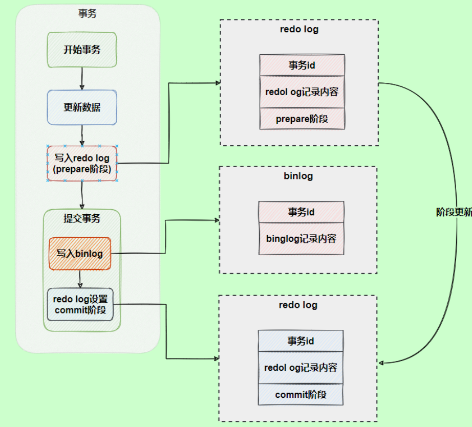

使用两阶段提交之后，即使binlog写入过程中发生了异常，也不会产生数据不一致的现象，**因为MySQL根据redo log日志恢复数据的时候，发现redo log还处于prepare阶段，并且没有对应的bin log文件，就会回滚该事务**

如果redo log在commit阶段发生异常，即redo log仍然处于prepare阶段，但是存在对应的binlog， 那还会不会回滚事务

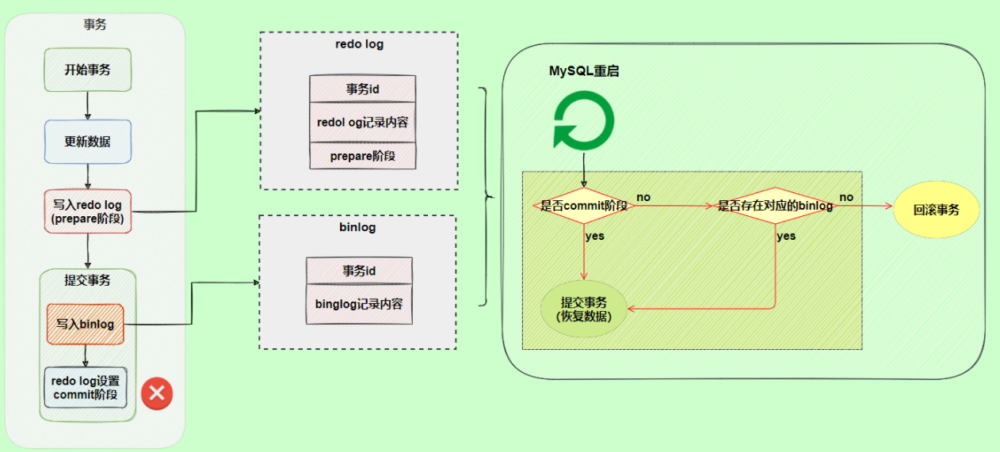

这种情况下就不会回滚事务了，虽然redo log仍处于prepare阶段，但是能够通过事务id找到对应的bin log，所以MySQL会认为日志是完整的，就会提交事务恢复数据

### undo log

我们知道，如果想要保证事务的原子性，就需要在事务发生异常的时候，对已执行的操作进行回滚，在MySQL中，恢复机制是通过回滚日志（undo log）实现的，**所有事务执行的修改都会先记录到这个回滚日志中**，再执行相关操作。如果执行过程中遇到异常的话，我们直接利用回滚日志中的信息将数据回滚到修改之前的样子即可，并且**回滚日志会先持久化到磁盘上**，这样就保证了即使数据库突然宕机等情况，当用户再次启动数据的时候，数据库还能够通过查询回滚日志来回滚之前未完成的事务

> 另外，`MVCC` 的实现依赖于：**隐藏字段、Read View、undo log**。在内部实现中，`InnoDB` 通过数据行的 `DB_TRX_ID` 和 `Read View` 来判断数据的可见性，如不可见，则通过数据行的 `DB_ROLL_PTR` 找到 `undo log` 中的历史版本。每个事务读到的数据版本可能是不一样的，在同一个事务中，用户只能看到该事务创建 `Read View` 之前已经提交的修改和该事务本身做的修改
>
> ==（不太清楚MVCC）==

## redo log和binlog的区别

第一，两者在功能上是不同的，redo log作为异常宕机或者介质故障后的数据恢复使用，binlog用来进行主从搭建等数据一致性方面的数据恢复

第二，两者写入的时机不同，redo log可以在事务执行的过程中不断写入，binlog是在事务提交完成之后被一次性写入

第三，redo log是InnoDB存储引擎特有的，而binlog是属于MySQL的上层server层，任何的存储引擎对数据库进行更改都会产生binlog

第四，两者记录的内容是不同的，redo log是物理操作日志，因此每个事务会对应多个日志条目，而binlog中记录的是对应的SQL语句，他是逻辑日志

第五，两者存储方式不同，binlog不是循环使用，在写满或者重启之后会重新写入一个新的文件，而redo log使用日志文件组能够实现循环使用

## 总结

MySQL InnoDB存储引擎通过redo log来实现数据的持久化，通过undo log保证事务的原子性

MySQL数据库的数据备份、主主、主从、主备都离不开bin log，需要依靠bin log来同步数据，保证数据一致性

