## MVCC

全称Multi-Version Concurrency Control，即多版本并发控制，主要是为了提高数据库的并发性能。**MVCC是“维持一个数据的多个版本，使读写操作没有冲突”的一个抽象概念**

> 数据库的并发场景

- 读-读：不存在任何问题，也不需要并发控制
- 读-写：有线程安全问题，可能会造成事务隔离性问题，可能会遇到脏读、不可重复读、幻读
- 写-写：有线程安全问题，可能会存在更新丢失问题

**MVCC就是用来解决读-写冲突的无锁并发控制，就是为事务分配单项增长的时间戳/版本号，为每个数据修改保存一个版本，版本与事务时间戳相关联**

快照读操作只读取事务开始前的数据库快照

**说到MVCC，就是在InnoDB引擎中，因为MyISAM不支持事务**

### 一致性非锁定读（快照读）

> 对于一致性非锁定读的实现，通常的做法是加一个版本号或者时间戳字段，在更新数据的同时版本号+1或者更新时间戳，查询时，将当前的版本号与对应记录的版本号进行比对，如果记录的版本号小于可见版本，则表示该记录可见

在InnoDB存储引擎中，MVCC就是对一致性非锁定读的实现，如果读取的行正在执行DELETE或者UPDATE操作，这时读取操作不会去等待行上锁的释放，相反地，InnoDB存储引擎会读取行的一个快照数据，**对于这种读取历史数据的方式，我们叫他快照读**

在READ COMMITTD和REPEATABLE READ两个隔离级别下，如果是执行普通的select语句（不包括`select ... lock in share mode`，`select ... for update`）则会使用MVCC，并且在REPEATABLE READ隔离级别下使用MVCC实现了可重复读和**防止部分幻读**

### 锁定读（当前读）

如果执行的是下列语句，就是锁定读（Locking Reads）

- `select ... lock in share mode`
- `select ... for update`
- `insert`、`update`、`delete` 操作

在锁定读下，读取的是数据的最新版本，这种读也被称为当前读，锁定读会对读取到的记录加锁

- `select ... lock in share mode`：对记录加 `S` 锁，其它事务也可以加`S`锁，如果加 `x` 锁则会被阻塞
- `select ... for update`、`insert`、`update`、`delete`：对记录加 `X` 锁，且其它事务不能加任何锁

> S锁指的是共享锁，X锁指的是排他锁

在一致性非锁定读下，即使读取的记录已经被其他事务加上了X锁，这条记录也是可以被读取的，即读取的是快照数据，上面说了，在REPEATABLE READ隔离级别下使用MVCC能够**防止部分幻读**，这里的部分指的是在一致性非锁定读情况下，只能读取到第一次查询之前所插入的数据（根据Read View判断可见性，Read View在第一次查询时生成）但是，如果是锁定读，每次读取的都是最新数据，这时两次查询中间有其他事务插入数据就会产生幻读。所以InnoDB在实现Repeatable Read时，如果执行的是锁定读，则会对读取的记录使用`Next-Key Lock`，来防止其他事务在间隙间插入数据

> 总结以下就是，InnoDB在实现Repeatable read的时候，如果执行的是一致性非锁定读（MVCC），那么就能够避免幻读，而如果执行的是锁定读的时候，需要配合Next-Key Lock来解决幻读

### InnoDB对MVCC的实现

**MVCC的实现依赖于：隐藏字段、Read View、undo log，**在内部实现中，InnoDB通过数据行的`DB_TRX_ID`和`READ View`来判断数据的可见性，如果不可见，则通过数据行的`DB_ROLL_PTR`找到undo log中的历史版本，每个事务读取到的数据版本可能都是不一样的，在同一个事务中，用户只能看见该事务创建Read View之前已经提交的修改和该事务本身做的修改

#### 隐藏字段

InnoDB存储引擎为每行数据添加了三个隐藏字段

- `DB_TRX_ID(6字节)`：表示最后一次插入或者更新该行的事务id，此外，delete操作在内部被视为更新，只不过会在记录头`Record header`中的`delete_flag`字段将其标记为已删除
- `DB_ROLL_PTR(7字节)`：回滚指针，指向该行的undo log，如果该行未被更新，则为空
- `DB_ROW_ID(6字节)`：如果没有设置主键，且表中没有唯一非空索引的时候，InnoDB会使用该id来生成聚簇索引

#### Read View

**Read View主要是用来做可见性判断，里面保存了“当前对本事务不可见的其他活跃事务”**

主要有以下字段

- `m_low_limit_id`：目前出现过的最大的事务ID+1，即下一个将被分配的事务ID，大于等于这个ID的数据版本均不可见
- `m_up_limit_id`：活跃事务列表`m_ids`中最小的事务ID，小于这个ID的数据版本均可见，如果`m_ids`为空，则`m_up_limit_id`等于`m_low_limit_id`
- `m_ids`：Read View创建时其他未提交的活跃**事务ID集合**，创建Read View时，将当前未提交事务ID记录下来，后续即使他们修改了记录行的值，对于当前事务也是不可见的，`m_ids`不包括当前事务自己和已经提交的事务（正在内存中）

- `m_creator_trx_id`：创建该Read View的事务ID

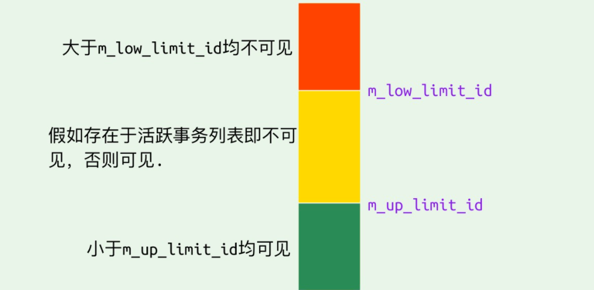

**Read View数据可见性算法**

在InnoDB存储引擎中，创建一个新事务后，执行每个select语句前，都会创建一个快照（Read View），快照中保存了当前数据库中正处于活跃（没有commit）的事务的ID号，其实简单地说保存的是系统中当前不应该被本事务看到的其他事务ID列表（即m_ids）。当用户要在这个事务中读取某个记录行的时候，InnoDB会将该记录行的`DB_TRX_ID`和 `Read View` 中的一些变量及当前事务 ID 进行比较，判断是否满足可见性条件

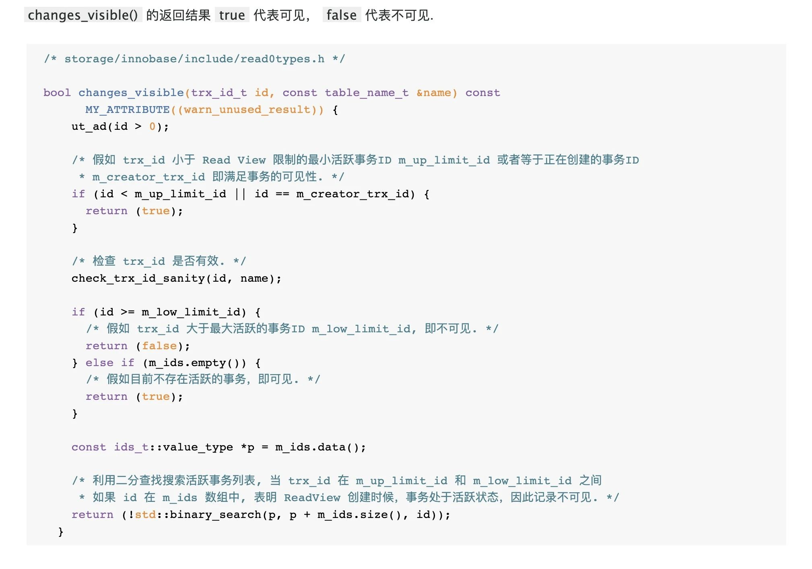

1. 如果记录的`DB_trx_ID < m_up_limit_id`的话，表明最新修改该行的事务在当前事务创建快照前就已经被提交了，所以该记录行的值对事务是可见的，或者是当数据的事务ID等于creator_trx_id ，那么说明这个数据就是当前事务自己生成的，自己生成的数据自己当然能看见，所以这种情况下此数据也是可以显示的。

2. 如果记录的`DB_trx_ID > m_up_limit_id`的话，表明最新修改该行的事务在当前事务创建快照之后才修改该行，所以该记录行的值对当前事务不可见。跳到步骤5

3. 如果`m_ids`为空，则表明在当前事务创建快照之前，修改该行的所有事务都已经提交了，所以该记录行的值对当前事务是可见的

4. 如果 m_up_limit_id <= DB_TRX_ID < m_low_limit_id，表明最新修改该行的事务（DB_TRX_ID）在当前事务创建快照的时候可能处于“活动状态”或者“已提交状态”；所以就要对活跃事务列表 m_ids 进行查找（源码中是用的二分查找，因为是有序的）

   - 如果在活跃事务列表`m_ids`中能找到DB_TRX_ID，则表明：

     - 在当前事务创建快照之前，该记录行的数据已经被事务ID为DB_TRX_ID的事务修改了，但是没有提交
     - 在当前事务创建快照之后，该记录行的数据被事务ID为DB_TRX_ID的事务修改

     这种情况下也需要跳到步骤5

   - 如果在活跃事务列表`m_ids`中找不到DB_TRX_ID，则表明事务id为DB_TRX_ID的事务修改了该记录行的数据，在当前事务创建快照之前就已经提交了，所以记录行对当前事务可见

5. 在该记录行的DB_ROLL_PTR指针所指向的undo log取出快照记录，用快照记录的DB_TRX_ID跳到步骤1中重新开始判断，直到找到满足的快照版本或者返回空

#### undo log

undo log主要有两个作用

- 当事务回滚时用于将数据恢复到修改之前的样子
- 另一个作用就是MVCC，当读取记录的时候，若该记录被其他事务占用或者对当前事务不可见时，则通过undo log读取之前的版本数据，以此来实现非锁定读

每次对数据库记录进行改动，都会记录一条undo日志，**每条undo日志也都有一个roll_pointer属性（INSERT操作对应的undo日志没有该属性，因为该记录并没有更早的版本）**，可以将这些undo日志都连起来，串成一个链表，所以现在的情况就像下图一样：

**在InnoDB存储引擎中，undo log分成了两种：insert undo log和update undo log**

- insert undo log，指在insert操作过程中产生的undo log，因为insert操作的记录只对本事务可见，对其他事务不可见，故该undo log可以在事务提交之后直接删除，不需要进行purge操作

  > insert时的数据初始状态，如下图所示，可以看到DB_ROLL_PTR属性为空，因为insert的undo日志中没有该属性

  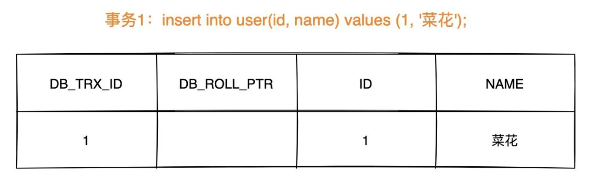

  

- update undo log，指在update或delete操作中产生的undo log，该undo log可能要提供MVCC机制，因此不能在事务提交之后就删除，提交时放入undo log链表中，等待purge线程进行最后的删除

  > 数据第一次被修改时

  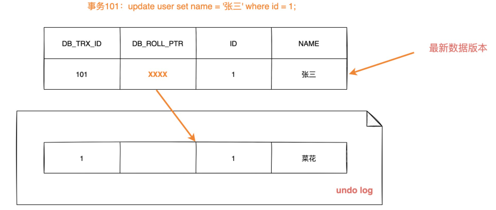

  > 数据第二次被修改时

  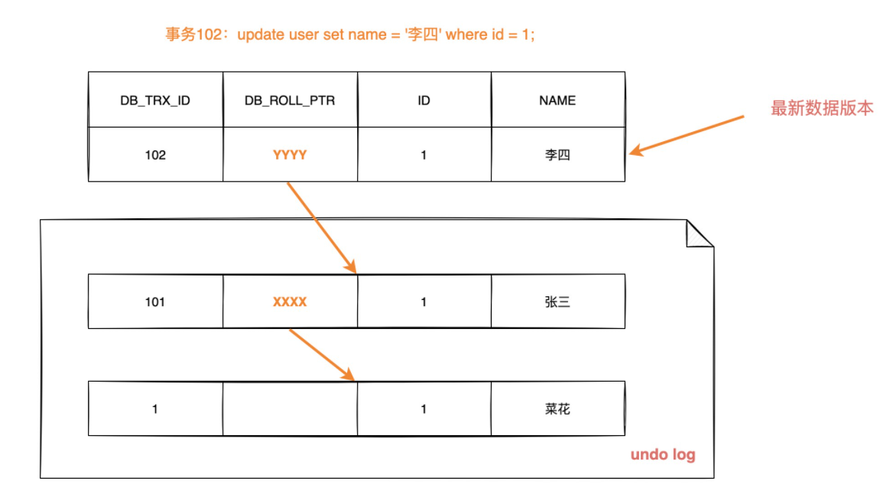

  不同的事务或者相同的事务可能会对同一条记录进行修改，会使该记录行的undo log成为一条链表，链首就是最新的记录，链尾就是最早的旧纪录

### MVCC和事务隔离级别

只有在RC和RR隔离级别下，InnoDB存储引擎才会使用MVCC（一致性非锁定读，快照读），但是他们生成Read View的时机是不同的

- 在RC隔离级别下，每次select查询之前都能够生成一个Read View（m_ids列表）
- 在RR隔离级别下，只在事务开始后第一次select数据前生成一个Read View（m_ids）列表

我们知道在RR隔离级别下，解决了不可重复读的问题，那么MVCC具体是怎么解决这个问题的呢？

> 举个例子

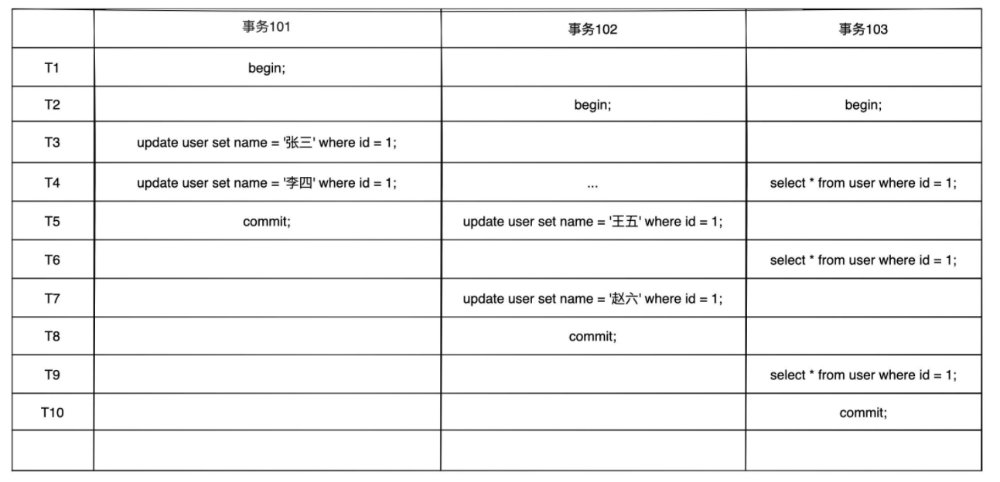

#### 在RC下Read View的生成情况

> 假设时间线来到T4，那么此时数据行id=1的版本链为

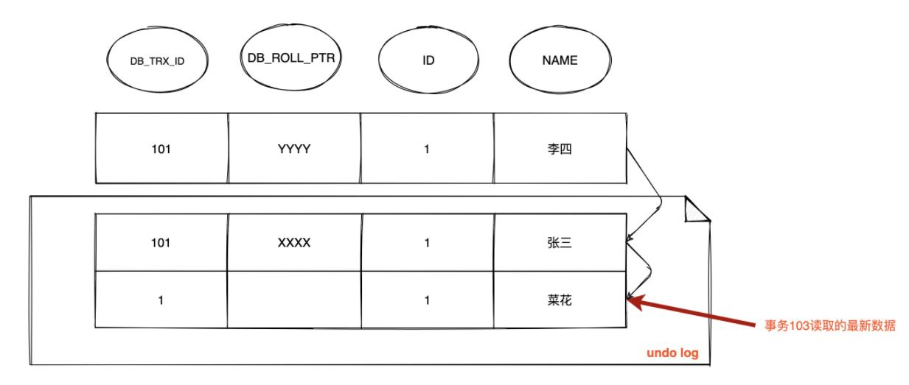

由于RC隔离级别下，每次查询都会生成Read View，并且事务101和102都还没有提交，此时103事务生成的Read View中活跃的事务`m_ids={101,102}`，`m_low_limit_id`为104（即下一个事务id是104），`m_up_limit_id`为101，`m_creator_trx_id`为103

- 此时最新记录的 `DB_TRX_ID` 为 101，m_up_limit_id <= 101 < m_low_limit_id，所以要在 `m_ids` 列表中查找，发现 `DB_TRX_ID` 存在列表中，那么这个记录不可见
- 根据DB_ROLL_PTR找到undo log中的上一版本记录，上一条记录的DB_TRX_ID还是101，仍然不可见
- 继续根据DB_ROLL_PTR找undo log中的上一版本记录，这次找到了DB_TRX_ID为1的记录，满足 1 < m_up_limit_id，可见，所以事务 103 查询到数据为 `name = 菜花`

> 时间线来到t6，数据的版本链为

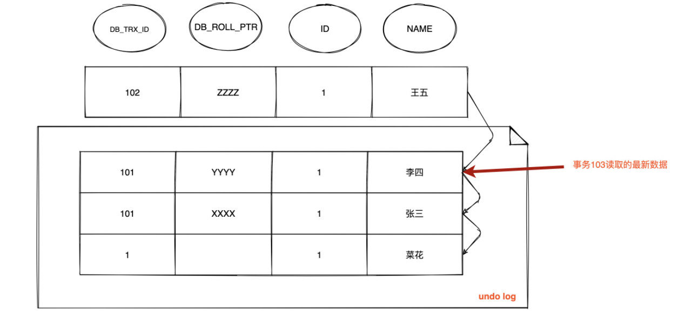

因为在RC级别下，每进行一次select就会重新生成Read View，所以在t6时刻事务103会重新生成一个Read View，这时事务101已经提交，事务102还没有提交，所以此时Read View中活跃的事务`m_ids={102}`，`m_low_limit_id`为：104，`m_up_limit_id`为：102，`m_creator_trx_id`为：103

- 此时最新记录的DB_TRX_ID是102，m_up_limit_id <= 102 < m_low_limit_id，所以要在 `m_ids` 列表中查找，发现 `DB_TRX_ID` 存在列表中，那么这个记录不可见
- 根据 `DB_ROLL_PTR` 找到 `undo log` 中的上一版本记录，上一条记录的 `DB_TRX_ID` 为 101，满足 101 < m_up_limit_id，记录可见，所以在 `T6` 时间点查询到数据为 `name = 李四`，**与时间 T4 查询到的结果不一致，不可重复读！**

> 时间线来到t9，数据的版本链是

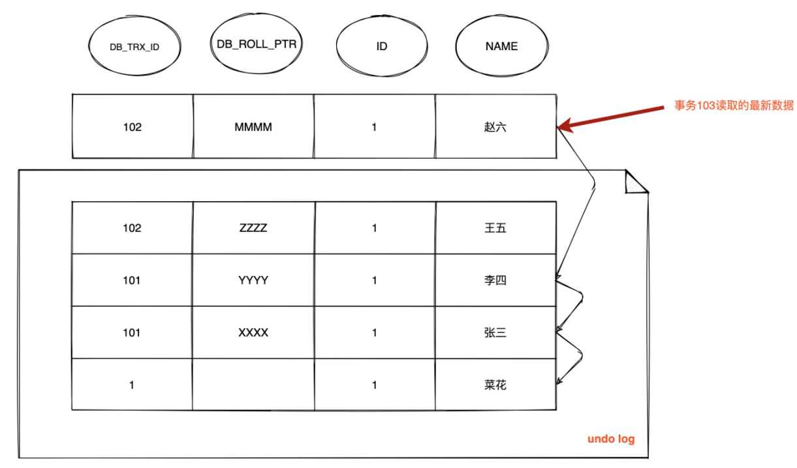

重新生成Read View，这时事务101和102都已经提交，所以`m_ids`为空，则`m_up_limit_id=m_low_limit_id`，最新版本事务ID为102，满足 102 < m_low_limit_id，可见，查询结果为 `name = 赵六`

> **总结一下，由于RC隔离级别下，事务在每次查询开始时都会生成并设置新的Read View，所以导致不可重复读**

#### 在RR下Read View的生成情况

**在可重复读隔离级别下，只会在事务开始后第一次读取数据时生成一个Read View（m_ids列表）**

> 假设时间线来到T4，那么此时数据行id=1的版本链为

同理，此时事务103能够读取到的记录是`name=菜花`

> 时间线来到t6，数据行的版本链为

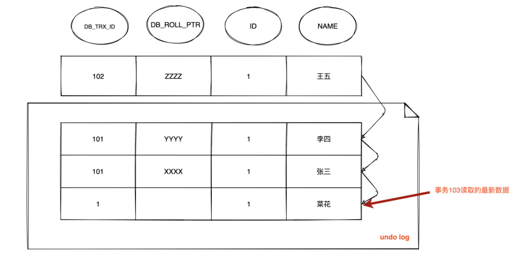

因为在RR隔离级别下，只会在事务开始后生成一次Read View，所以此时仍然沿用`m_ids={101,102}`，`m_low_limit_id`为：104，`m_up_limit_id`为：101，`m_creator_trx_id` 为：103

- 最新记录的DB_TRX_ID为102，因为m_up_limit_id <= 102 < m_low_limit_id，所以要在`m_ids`列表中查找，发现`DB_TRX_ID`存在列表中，那么这个记录不可见
- 根据 `DB_ROLL_PTR` 找到 `undo log` 中的上一版本记录，上一条记录的 `DB_TRX_ID` 为 101，不可见
- 继续根据 `DB_ROLL_PTR` 找到 `undo log` 中的上一版本记录，上一条记录的 `DB_TRX_ID` 还是 101，不可见
- 继续找上一条 `DB_TRX_ID`为 1，满足 1 < m_up_limit_id，可见，所以事务 103 查询到数据为 `name = 菜花`

> 时间线来到t9，数据行的版本链为

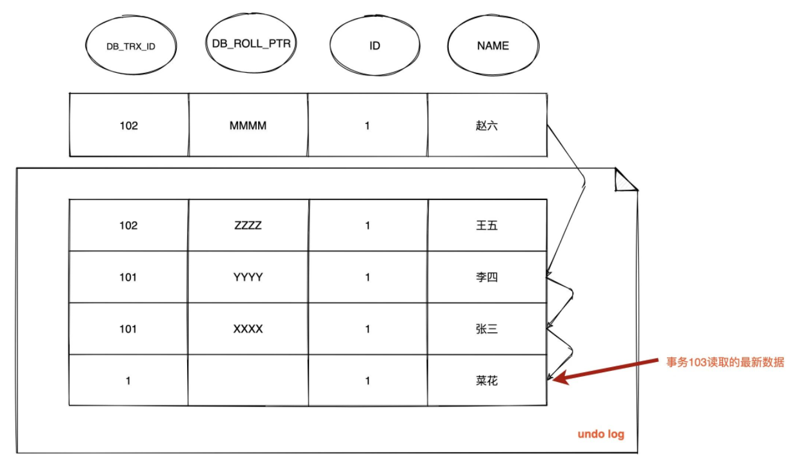

此时情况跟 T6 完全一样，由于已经生成了 `Read View`，此时依然沿用 **`m_ids` ：[101,102]** ，所以查询结果依然是 `name = 菜花`

### MVCC + Next-key Lock防止幻读

**InnoDB存储引擎在RR级别下通过MVCC和Next-key Lock来解决幻读问题：**

1. **执行普通的select，此时会以MVCC快照读的方式读取数据**

   在快照读的情况下，RR隔离级别只会在事务开始后的第一次查询生成一个READ VIEW，并使用至事务提交，所以在生成READ VIEW之后其他事务的更新、插入记录版本对当前事务并不可见，**实现了可重复读和防止了快照读下的幻读**

2. **执行`select... for update/lock in share mode,insert,update,delete`等当前读**

   在当前读下，读取到的都是最新数据，如果其他事务有插入新的记录，并且刚好在当前事务查询范围内，就会产生幻读。

   InnoDB使用Next-key Lock来防止这种情况，**当执行当前读时，会锁定读取到的记录的同时，锁定他们的间隙，防止其他事务在查询范围内插入数据。**只要我不让你插入**，就不会产生幻读了。

### 总结

所谓的MVCC指的就是在使用READ COMMITTD、REPEATABLE READ这两种隔离级别的事务在执行普通的SEELCT操作时访问记录的版本链的过程，这样子可以使不同事务的读-写、写-读操作并发执行，从而提升系统性能。