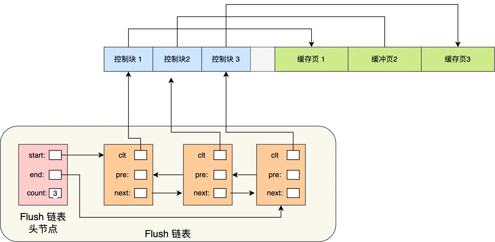

### 为什么要有Buffer Pool

MySQL的数据是存储在磁盘中的，但是不能每次都在磁盘中读取数据，这样性能是极差的。

所以为了提高查询性能，InnoDB存储引擎设计了一个缓冲池（Buffer Pool），来提高数据库的读写性能，当数据从磁盘中取出后，缓存在内存中，下次查询同样的数据的时候，直接从内存中读取

> 注意：Buffer Pool和被删除出去的MySQL查询缓存不是同一个东西。MySQL查询缓存之前在Server层，Buffer Pool是在InnoDB引擎层


- 当读取数据时，如果数据存在于Buffer Pool中，客户端就会直接读取Buffer Pool中的数据，否则再去磁盘中读取
- 当修改数据时，首先是修改Buffer Pool中数据所在的页，然后将其页设置成脏页，最后由后台线程将脏页写入到磁盘中

所以，从IO角度来看，MySQL也是直接IO，因为它的Buffer Pool相当于是从应用程序层面对磁盘文件进行了一次缓存，如果还使用内核缓存（page cache），相当于又多缓存了一次，没必要。

### Buffer Pool的大小

Buffer Pool是在MySQL启动时，向操作系统申请的一片连续的内存空间，默认配置下Buffer Pool只有128M

可以通过调整`innodb_buffer_pool_size`参数来设置Buffer Pool的大小，一般建议设置成物理内存的60%~80%


### Buffer Pool缓存什么

InnoDB会把存储的数据划分成若干个页，以页作为磁盘和内存交互的基本单位，一个页的默认大小为16KB，因此，Buffer Pool同样需要按照页来划分

在MySQL启动时，**InnoDB会为Buffer Pool申请一片连续的内存空间，然后按照默认的16KB大小划分出一个个的页，Buffer Pool中的页就叫缓存页**，此时缓存页都是空闲的，之后随着程序的运行，才会有磁盘上的页被缓存到Buffer Pool中


Buffer Pool中除了会缓存索引页和数据页，还包括undo页，插入缓存，自适应哈希索引，锁信息等

> 开启事务后，InnoDB 层更新记录前，首先要记录相应的 undo log，如果是更新操作，需要把被更新的列的旧值记下来，也就是要生成一条 undo log，undo log 会写入 Buffer Pool 中的 Undo 页面。


为了更好的管理这些在Buffer Pool中的缓存页，InnoDB为每一个缓存页都创建一个控制块，控制块信息包括【缓存页的表空间、页号、缓存页地址、链表节点】

控制块也是占有内存空间的，它是放在Buffer Pool的最前面，接着才是缓存页，如下图：


上图中的控制块和缓存页之间灰色部分成为碎片空间

> 为什么会有碎片空间呢？
>
> 每一个控制块都对应一个缓存页，那么在分配足够多的控制块和缓存页后，可能剩余的那点空间不足以放下一对控制块和缓存页的大小了，那么这个用不到的内存空间就被称为碎片了（缓存页大小应该是16k，但是控制块的大小不能确定了）


当我们查询出一条记录后，并不仅仅是把这一条记录放到缓冲中，而是把整个页的数据都加载到Buffer Pool中，因为**索引只能定位到磁盘中的页**，而不能定位到页中的一条记录，将页加载到Buffer Pool中，再通过页里的**页目录**去定位到某条具体的记录

> 在【基础-数据页的目录】中有说到页目录的格式


### 如何管理Buffer Pool

Buffer Pool是一片连续的内存空间，当MySQL运行一段时间后，这片连续的内存空间中的缓存页既有空闲的，也有被使用的

#### 如何管理空闲页

为了能够快速找到空闲的缓存页，可以使用链表结构，将空闲缓存页的控制块作为链表的节点，这个链表称为**Free链表**（空闲链表）


Free链表上除了有控制块，还有一个头节点，该头节点包含链表的头节点地址，尾节点地址以及当前链表中节点的数量等信息

**Free链表节点是一个一个的控制块，而每个控制块包含着对应缓存页的地址，所以相当于Free链表节点都对应一个空闲的缓存页**

有了Free链表后，每当需要从磁盘中加载一个页到Buffer Pool中时，就从Free 链表中取一个空闲的缓存页，并且把该缓存页对应的控制块的信息填上，然后把该缓存页对应的控制块从Free链表中移除


#### 如何管理脏页

Buffer Pool除了能够提高读性能，还能提高写性能，也就是更新数据的时候不需要每次都要写入磁盘，而是将Buffer Pool对应的缓存页标记为脏页，然后再由后台线程将脏页写入到磁盘

为了能够快速知道哪些缓存页是脏的，于是就设计出了**Flush链表**，它跟Free链表类似，链表的节点也是控制块，区别在于Flush链表的元素都是脏页



有了Flush链表后，后台线程就可以遍历Flush链表，将脏页写入到磁盘


### 脏页什么时候会被刷入磁盘

引入了Buffer Pool后，当修改数据时，首先是要修改Buffer Pool中数据所在的页，然后将其页设置为脏页，但是磁盘中还是原数据

因此，脏页需要被刷入磁盘，保证缓存和磁盘数据一致，但是若每次修改数据都刷入磁盘，则性能会很差，因此一般都会在一定的时机进行批量刷盘。

> 可能大家担心，如果在脏页还没有来得及刷入到磁盘时，MySQL 宕机了，不就丢失数据了吗？
>
> 这个不用担心，InnoDB 的更新操作采用的是 Write Ahead Log 策略，即先写日志，再写入磁盘，通过 redo log 日志让 MySQL 拥有了崩溃恢复能力。

下面的几种情况会触发脏页刷新：

- 当redo log日志满了的情况下，会主动触发脏页刷新到磁盘
- Buffer Pool空间不足时，需要将一部分数据页淘汰掉，如果淘汰的是脏页，需要先将脏页同步到磁盘
- MySQL认为空闲时，后台线程会定时将适量的脏页输入到磁盘
- MySQL正常关闭之前，会把所有的脏页刷入到磁盘中

在我们开启了慢SQL监控后，**如果偶尔会出现一些用时稍长的SQL，这可能是因为脏页在刷新到磁盘时可能会给数据库带来性能开销，导致数据库操作抖动**，如果间断出现这种现象，就需要调大Buffer Pool空间或redo log日志的大小


### 如何提高缓存命中率

Buffer Pool的大小是有限的，对于一些频繁访问的数据我们希望一直留在Buffer Pool中，而一些很少访问的数据希望可以在某些时机淘汰掉，从而保证Buffer Pool不会因为满了而导致无法再缓存新的数据，同时还能保证常用数据留在Buffer Pool中。

要实现这个，最容易想到的就是LRU算法，该算法的思路是，链表头部的节点是最近使用的，而链表末尾的节点是最久没被使用的。那么，当空间不够了，就淘汰最久没被使用的节点，从而腾出空间。

简单的LRU算法的实现思路是这样的：

- 当访问的页在Buffer Pool中，就直接把该页对应的LRU链表节点移动到链表的头部
- 当访问的页不在Buffer Pool中，除了要把该页放到链表头部，如果链表长度达到阈值，还要淘汰掉链表尾部的节点

到这里我们知道，**Buffer Pool中有三种页和链表来管理数据**


- Free Page（空闲页），表示此页未被使用，位于 Free 链表；
- Clean Page（干净页），表示此页已被使用，但是页面未发生修改，位于LRU 链表。
- Dirty Page（脏页），表示此页「已被使用」且「已经被修改」，其数据和磁盘上的数据已经不一致。当脏页上的数据写入磁盘后，内存数据和磁盘数据一致，那么该页就变成了干净页。脏页同时存在于 LRU 链表和 Flush 链表


简单`LRU`中存在**预读失效**和**缓存污染**的问题，下面我们来看看MySQL是如何解决这两个问题的

> **什么是预读失效**

先来说说 MySQL 的预读机制。程序是有空间局部性的，靠近当前被访问数据的数据，在未来很大概率会被访问到。

所以，MySQL 在加载数据页时，会提前把它相邻的数据页一并加载进来，目的是为了减少磁盘 IO。

但是可能这些**被提前加载进来的数据页，并没有被访问**，相当于这个预读是白做了，这个就是**预读失效**。

如果使用简单的 LRU 算法，就会把预读页放到 LRU 链表头部，而当 Buffer Pool空间不够的时候，还需要把末尾的页淘汰掉。

如果这些预读页如果一直不会被访问到，就会出现一个很奇怪的问题，*不会被访问的预读页却占用了 LRU 链表前排的位置，而末尾淘汰的页，可能是频繁访问的页，这样就大大降低了缓存命中率。*

> **MySQL怎么解决预读失效**

要避免预读失效带来的影响，最好就是**让预读的页停留在Buffer Pool中的时间尽可能的短，让真正被访问的页移动到链表的头部，从而保证真正被读取的热数据留在Buffer Pool中的时间尽可能长**

MySQL对LRU做了这样的改进：将LRU链表分成两个部分，young区域和old区域，young区域在LRU链表的前半部分，old区域则是在后半部分，如下图：


old 区域占整个 LRU 链表长度的比例可以通过 `innodb_old_blocks_pct` 参数来设置，默认是 37，代表整个 LRU 链表中 young 区域与 old 区域比例是 63:37。

**划分这两个区域后，预读的页就只需要加入到 old 区域的头部，当页被真正访问的时候，才将页插入 young 区域的头部**。如果预读的页一直没有被访问，就会从 old 区域移除，这样就不会影响 young 区域中的热点数据。


举例：假设有一个长度为 10 的 LRU 链表，其中 young 区域占比 70 %，old 区域占比 30 %。


现在有个编号为 20 的页被预读了，这个页只会被插入到 old 区域头部，而 old 区域末尾的页（10号）会被淘汰掉。


如果 20 号页一直不会被访问，它也没有占用到 young 区域的位置，而且还会比 young 区域的数据更早被淘汰出去。

如果 20 号页被预读后，立刻被访问了，那么就会将它插入到 young 区域的头部，young 区域末尾的页（7号），会被挤到 old 区域，作为 old 区域的头部，这个过程并不会有页被淘汰。


虽然通过划分 old 区域 和 young 区域避免了预读失效带来的影响，但是还有个问题无法解决，那就是 Buffer Pool 污染的问题。


> **什么是缓存污染问题**

当某一个 SQL 语句**扫描了大量的数据**时，在 Buffer Pool 空间比较有限的情况下，可能会将 **Buffer Pool 里的所有页都替换出去，导致大量热数据被淘汰了**，等这些热数据又被再次访问的时候，由于缓存未命中，就会产生大量的磁盘 IO，MySQL 性能就会急剧下降，这个过程被称为 **Buffer Pool 污染**。

注意， Buffer Pool 污染并不只是查询语句查询出了大量的数据才出现的问题，即使查询出来的结果集很小，也会造成 Buffer Pool 污染。

比如，在一个数据量非常大的表，执行了这条语句：

```sql
select * from t_user where name like "%xiaolin%";
```

可能这个查询出来的结果就几条记录，但是由于这条语句会发生索引失效，所以这个查询过程是全表扫描的，接着会发生如下的过程：

- 从磁盘读到的页加入到 LRU 链表的 old 区域头部；
- 当从页里读取行记录时，也就是页被访问的时候，就要将该页放到 young 区域头部；
- 接下来拿行记录的 name 字段和字符串 xiaolin 进行模糊匹配，如果符合条件，就加入到结果集里；
- 如此往复，直到扫描完表中的所有记录。

经过这一番折腾，原本 young 区域的热点数据都会被替换掉。

举个例子，假设需要批量扫描：21，22，23，24，25 这五个页，这些页都会被逐一访问（读取页里的记录）。


在批量访问这些数据的时候，会被逐一插入到 young 区域头部。


可以看到，原本在 young 区域的热点数据 6 和 7 号页都被淘汰了，这就是 Buffer Pool 污染的问题。


> 怎么解决Buffer Pool污染而导致的缓存命中率下降的问题

像前面这种全表扫描的查询，很多缓冲页其实只会被访问一次，但是它却只因为被访问了一次而进入到 young 区域，从而导致热点数据被替换了。

LRU 链表中 young 区域就是热点数据，只要我们提高进入到 young 区域的门槛，就能有效地保证 young 区域里的热点数据不会被替换掉。

MySQL 是这样做的，进入到 young 区域条件增加了一个**停留在 old 区域的时间判断**。

具体是这样做的，在对某个处在 old 区域的缓存页进行第一次访问时，就在它对应的控制块中记录下来这个访问时间：

- 如果后续的访问时间与第一次访问的时间**在某个时间间隔内**，那么**该缓存页就不会被从 old 区域移动到 young 区域的头部**；
- 如果后续的访问时间与第一次访问的时间**不在某个时间间隔内**，那么**该缓存页移动到 young 区域的头部**；

这个间隔时间是由 `innodb_old_blocks_time` 控制的，默认是 1000 ms。

也就说，**只有同时满足「被访问」与「在 old 区域停留时间超过 1 秒」两个条件，才会被插入到 young 区域头部**，这样就解决了 Buffer Pool 污染的问题 。

另外，*MySQL 针对 young 区域其实做了一个优化，为了防止 young 区域节点频繁移动到头部。young 区域前面 1/4 被访问不会移动到链表头部，只有后面的 3/4被访问了才会。*


