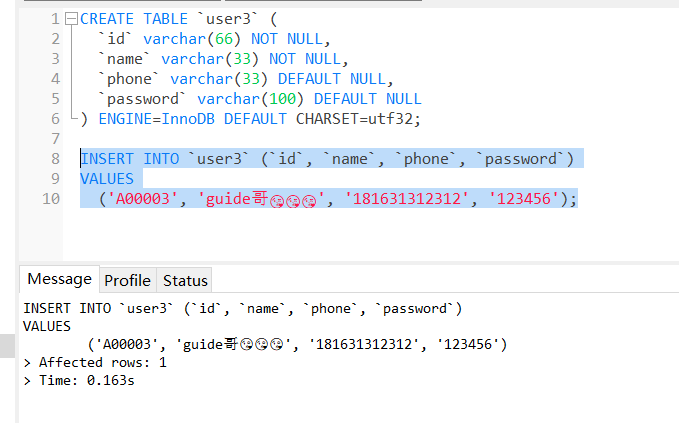
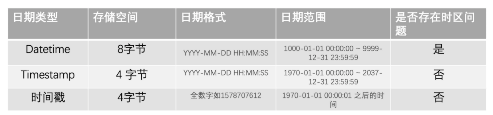

[toc]


## 字符集

字符是各种文字和符号的统称，包括各个国家的文件、标点符号、表情、数字等，**字符集就是一系列字符的集合，**字符集的种类比较多，**每个字符集可以表示的字符范围通常不同，**比如说有些字符集就是不能够表示汉字的

**我们知道计算机只能够存储二进制数据，那么英文、汉字、表情等字符需要怎么存储起来呢？**

我们需要将这些字符和二进制数据对应起来，比如说字符“a”对应“01100001”，反之，“01100001”对应 “a”。我们将字符对应成二进制数据的过程称为**字符编码**，反之，二进制数据解析成字符的过程叫做**字符解码**


### 常见的字符集

不同字符集的主要区别在于：

- 不同字符集能够表示的范围不同
- 不同字符集的编码方式不同

#### ASCII码

ASCII码的全称是American Standard Code Information Interchange，美国信息交换标准代码，是一套用于现代美国英文的字符集，这也是他的缺陷所以，即只能够表示英文

**为什么 ASCII 字符集没有考虑到中文等其他字符呢？** 因为计算机是美国人发明的，当时，计算机的发展还处于比较雏形的时代，还未在其他国家大规模使用。因此，美国发布 ASCII 字符集的时候没有考虑兼容其他国家的语言。

ASCII字符集至今为止共定义了128个字符，其中有33个字符无法显示（比如回车、删除等）

ASCII字符集中通过8位二进制来表示一个字符，比如“a”对应的 ASCII 码是“01100001”。但是最高位仅仅是用来做校验位，因为ASCII字符集中共能表示`2^7=128`个字符

这128个字符实在是太少了，因此又出现了ASCII扩展字符集，ASCII扩展字符集中使用8位来表示一个字符，因此共能表示`2^8=256`个字符


#### GB2312

我们上面知道了ASCII码只针对英文字符，因此很多国家都开发出了适合自己国家语言的字符集

GB2312就是一种对中文比较友好的字符集，它一共收录了大约6700个汉字，基本涵盖了大多数常用的汉字，不过GB2312不支持绝大多数的生僻字和繁体字

对于英文字符，GB2312和ASCII是一样的，都是使用一个字节来表示，对于非英字符，GB2312使用2个字节


#### GBK

GBK可以看成是GB2312的扩展，他兼容了GB2312，一共包含20000多个汉字

GBK 中 K 是汉语拼音 Kuo Zhan（扩展）中的“Kuo”的首字母。


#### GB18030

GB18030 完全兼容 GB2312 和 GBK 字符集，纳入中国国内少数民族的文字，且收录了日韩汉字，是**目前为止最全面的汉字字符集**，共收录汉字 70000 多个。


#### BIG5

主要针对的是繁体中文，收录了13000多个汉字


#### Unicode和UTF-8编码

为了更适合本国语言，诞生了许多的字符集

我们上面也知道了每个字符集可以表示的字符范围以及编码规则存在差异，这就导致了一个非常严重的问题：使用错误的编码方式查看一个包含字符的文件就会产生乱码现象，**乱码的本质其实就是编码和解码时用了不同或者不兼容的字符集**


为了解决这个问题，人们就想：“如果能够有一种字符集将世界上所有的字符都纳入其中就好了”

然后Unicode带着这个使命诞生了。

Unicode字符集中包含了世界上几乎所有已知的字符，不过Unicode字符集并没有规定他们应该怎么样存储（也就是没有规定二进制和这些字符之间的对应关系）

然后就有了UTF-8，全称8-bit Unicode Transform Format，类似的还有UTF-16，UTF-32

- UTF-8使用1到3个字节为每个字符编码，UTF-8可以根据不同的符号自动选择编码的长短，像英文字符只需要1个字节就可以了，这一点和ASCII字符集一样，因此对于英文字符UYF-8和ASCII字符集是一样的
- UTF-16使用2到4个字节为每个字符编码
- UTF-32使用固定的4个字节为每个字符编码，UTF-32的规则最简单，不过缺点也很明显，就是对于一个英文字符他也要使用4个字节来表示，消耗的空间大小是UTF-8的4倍

**UTF-8是目前使用最广的一种字符编码**


### MySQL字符集

MySQL支持很多的字符编码方式，比如UTF-8，GBK，BIG5等

```mysql
mysql> show charset;
+----------+---------------------------------+---------------------+--------+
| Charset  | Description                     | Default collation   | Maxlen |
+----------+---------------------------------+---------------------+--------+
| big5     | Big5 Traditional Chinese        | big5_chinese_ci     |      2 |
| dec8     | DEC West European               | dec8_swedish_ci     |      1 |
| cp850    | DOS West European               | cp850_general_ci    |      1 |
| hp8      | HP West European                | hp8_english_ci      |      1 |
| koi8r    | KOI8-R Relcom Russian           | koi8r_general_ci    |      1 |
| latin1   | cp1252 West European            | latin1_swedish_ci   |      1 |
| latin2   | ISO 8859-2 Central European     | latin2_general_ci   |      1 |
| swe7     | 7bit Swedish                    | swe7_swedish_ci     |      1 |
| ascii    | US ASCII                        | ascii_general_ci    |      1 |
| ujis     | EUC-JP Japanese                 | ujis_japanese_ci    |      3 |
| sjis     | Shift-JIS Japanese              | sjis_japanese_ci    |      2 |
| hebrew   | ISO 8859-8 Hebrew               | hebrew_general_ci   |      1 |
| tis620   | TIS620 Thai                     | tis620_thai_ci      |      1 |
| euckr    | EUC-KR Korean                   | euckr_korean_ci     |      2 |
| koi8u    | KOI8-U Ukrainian                | koi8u_general_ci    |      1 |
| gb2312   | GB2312 Simplified Chinese       | gb2312_chinese_ci   |      2 |
| greek    | ISO 8859-7 Greek                | greek_general_ci    |      1 |
| cp1250   | Windows Central European        | cp1250_general_ci   |      1 |
| gbk      | GBK Simplified Chinese          | gbk_chinese_ci      |      2 |
| latin5   | ISO 8859-9 Turkish              | latin5_turkish_ci   |      1 |
| armscii8 | ARMSCII-8 Armenian              | armscii8_general_ci |      1 |
| utf8     | UTF-8 Unicode                   | utf8_general_ci     |      3 |
| ucs2     | UCS-2 Unicode                   | ucs2_general_ci     |      2 |
| cp866    | DOS Russian                     | cp866_general_ci    |      1 |
| keybcs2  | DOS Kamenicky Czech-Slovak      | keybcs2_general_ci  |      1 |
| macce    | Mac Central European            | macce_general_ci    |      1 |
| macroman | Mac West European               | macroman_general_ci |      1 |
| cp852    | DOS Central European            | cp852_general_ci    |      1 |
| latin7   | ISO 8859-13 Baltic              | latin7_general_ci   |      1 |
| utf8mb4  | UTF-8 Unicode                   | utf8mb4_general_ci  |      4 |
| cp1251   | Windows Cyrillic                | cp1251_general_ci   |      1 |
| utf16    | UTF-16 Unicode                  | utf16_general_ci    |      4 |
| utf16le  | UTF-16LE Unicode                | utf16le_general_ci  |      4 |
| cp1256   | Windows Arabic                  | cp1256_general_ci   |      1 |
| cp1257   | Windows Baltic                  | cp1257_general_ci   |      1 |
| utf32    | UTF-32 Unicode                  | utf32_general_ci    |      4 |
| binary   | Binary pseudo charset           | binary              |      1 |
| geostd8  | GEOSTD8 Georgian                | geostd8_general_ci  |      1 |
| cp932    | SJIS for Windows Japanese       | cp932_japanese_ci   |      2 |
| eucjpms  | UJIS for Windows Japanese       | eucjpms_japanese_ci |      3 |
| gb18030  | China National Standard GB18030 | gb18030_chinese_ci  |      4 |
+----------+---------------------------------+---------------------+--------+
41 rows in set (0.00 sec)
```

通常情况下，**我们建议使用UTF-8作为默认的字符编码方式，**不过这里有一个小坑：

- `utf8`：utf8只支持1-3个字节，在utf8编码中，中文占3个字节，其他数字、英文、符号占一个字节，但是emoji符号占4个字节，一些较复杂的文字、繁体字也是4个字节，一些比较复杂的文字、繁体字也是4个字节

- `utf8mb4`：utf8的完整实现，最多支持4个字节表示字符，因此可以用来存储emoji符号

因此，需**要存储emoji类型的数据或者一些比较复杂的文字、繁体字到MySQL数据库的话，数据库的编码一定要指定为utf8mb4而不是utf8**，要不然存储的时候就会报错了

（用utf-32同样可以，但是不使用utf32的原因是对于英文字符他也要使用4个字节来表示，占用空间太大了）




## 关于数据库如何存储时间的一点思考

**第一点就是千万不要使用字符串来存储时间**

用字符串存储时间主要存在两个问题：

一是字符串占用的空间更大，二是字符串存储的日期效率比较低（逐个字符进行比对），无法用日期相关的API进行计算和比较


**第二就是在Datetime和TimeStamp之间抉择**

MySQL提供了两种比较相似的保存时间的数据类型Datetime和Timestamp，它们两者之间应该怎么选择呢？

通常都会首先TimeStamp，下面来解释一下为什么TimeStamp是首选

- **首先是因为Datetime类型耗费的空间更大**

  Timestamp只需要使用4个字节的存储空间，但是Datetime需要8个字节的存储空间，但是这同样也造成了一个问题，TimeStamp表示的时间范围更小

  - DateTime ：1000-01-01 00:00:00 ~ 9999-12-31 23:59:59
  - Timestamp： 1970-01-01 00:00:01 ~ 2037-12-31 23:59:59

- **第二是因为Datetime类型没有时区信息**

  Datetime类型是没有时区信息的，Datetime类型保存的时间都是当前会话所设置的时区对应的时间，这样会出现什么问题呢？<font color=blue>就是当你的时区发生变化之后，比如服务器更换地址或者更换客户端连接时区设置的话，就会导致从数据库中读出的时间错误。</font>

  而Timestamp和时区有关系，Timestamp类型字段的值会随着服务器时区的变化而变化，自动换算成相应的事件，说简单点，就是在不同时区查询到同一条记录此字段的值会不同

  ```mysql
  # 查看当前会话时区
  SELECT @@session.time_zone;
  # 设置当前会话时区
  SET time_zone = 'Europe/Helsinki';
  SET time_zone = "+00:00";
  # 数据库全局时区设置
  SELECT @@global.time_zone;
  # 设置全局时区
  SET GLOBAL time_zone = '+8:00';
  SET GLOBAL time_zone = 'Europe/Helsinki';
  ```


**第三点是，除了Datetime和Timestamp之后，还可以使用数值型的时间戳**

有的时候，我们还会使用`int`或者`bigint`类型的数值也就是时间戳来表示时间

这种存储方式具有Timestamp存储的一切优点，而且使用它进行日期排序以及对比等操作的效率更高，跨系统也很方便，毕竟存放的只是数值。缺点也很明显，那就是可读性太差了，无法直观的看到具体的时间

时间戳的定义如下：

> 时间戳的定义是从一个基准时间开始算起，这个基准时间是「1970-1-1 00:00:00 +0:00」，从这个时间开始，用整数表示，以秒计时，随着时间的流逝这个时间整数不断增加。这样一来，我只需要一个数值，就可以完美地表示时间了，而且这个数值是一个绝对数值，即无论的身处地球的任何角落，这个表示时间的时间戳，都是一样的，生成的数值都是一样的，并且没有时区的概念，所以在系统的中时间的传输中，都不需要进行额外的转换了，只有在显示给用户的时候，才转换为字符串格式的本地时间。

```mysql
mysql> select UNIX_TIMESTAMP('2020-01-11 09:53:32');
+---------------------------------------+
| UNIX_TIMESTAMP('2020-01-11 09:53:32') |
+---------------------------------------+
|                            1578707612 |
+---------------------------------------+
1 row in set (0.00 sec)

mysql> select FROM_UNIXTIME(1578707612);
+---------------------------+
| FROM_UNIXTIME(1578707612) |
+---------------------------+
| 2020-01-11 09:53:32       |
+---------------------------+
1 row in set (0.01 sec)
```





