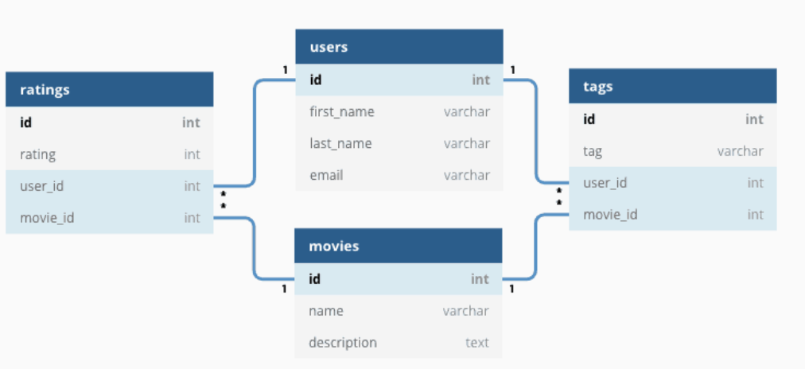
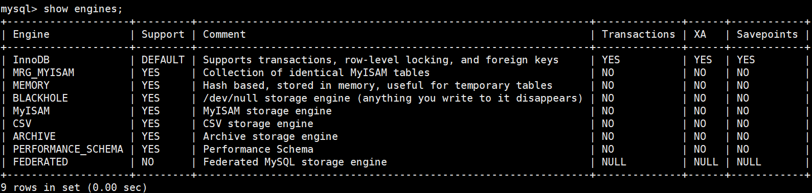
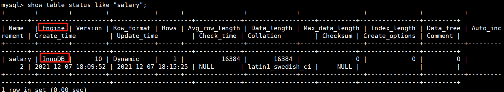
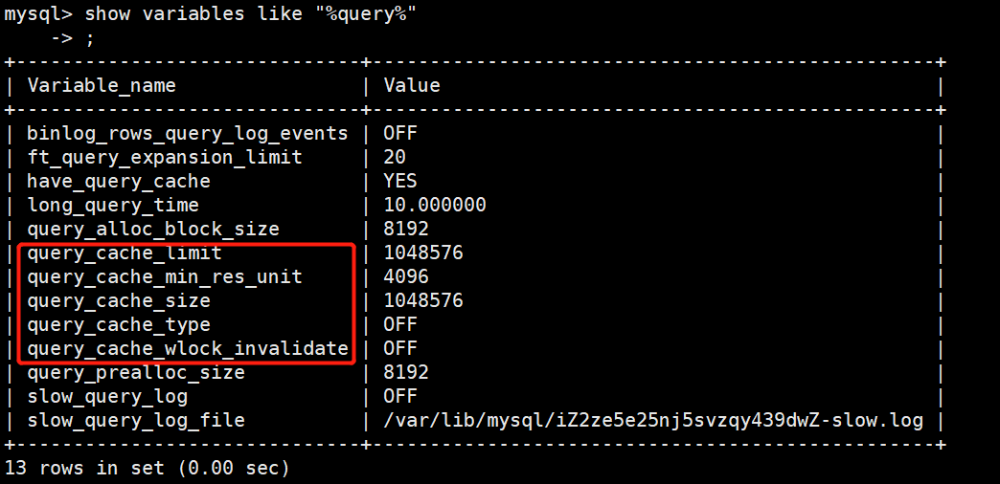
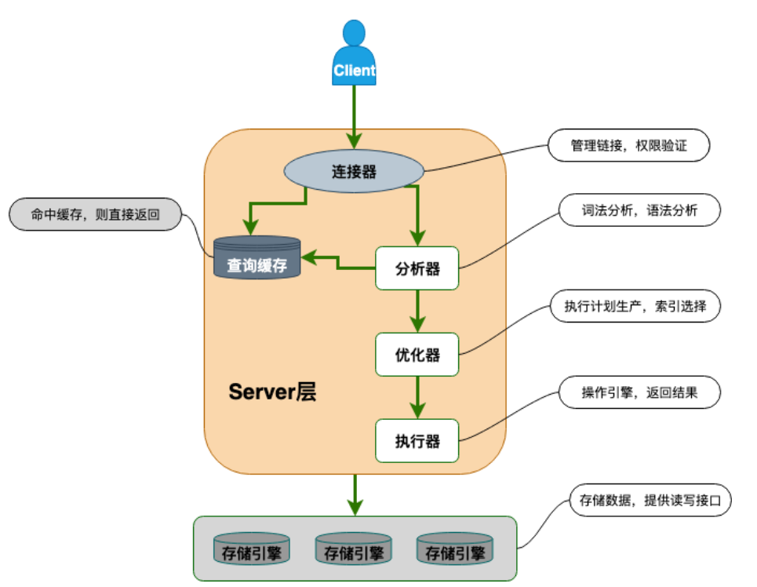

### 关系型数据库介绍

关系型数据库就是建立在关系模型基础上的数据库，关系模型表明了数据库中所存储的数据之间的关系，包括一对一、一对多、多对多



在关系型数据库中，我们的数据被存放在了各种表中，表中的每一行都存放着一条数据

大部分关系型数据库都是用SQL来操作数据库中的数据，并且大多数的关系型数据库都支持事务的ACID特性

**有哪些常见的关系型数据库呢？**

MySQL，PostgreSQL，Oracle，SQL Server，SELite（微信本地的聊天记录的存储就是用的SQLite）

**MySQL介绍**

MySQL是一种**关系型数据库**，主要用于持久化存储我们的系统中的一些数据比如用户信息

由于MySQL是**开源**免费的并且成熟的数据库，因此MySQL被大量使用在各种系统中，任何人都可以在 GPL(General Public License) 的许可下下载并根据个性化的需要对其进行修改。MySQL 的默认端口号是**3306**。


### 存储引擎

查看MySQL提供的全部存储引擎

```mysql
show engines;
```



从上图可以看出，MySQL当前默认的存储引擎是InnoDB，并且在MySQL5.7版本中只有InnoDB是支持事务的


查看MySQL当前默认的存储引擎

```mysql
mysql> show variables like %storage_engine%;
```

查看表的存储引擎

```mysql
show table status like "table_name";
```




### MyISAM和InnoDB的区别

1. **是否支持行级锁**

   MyISAM只有表级锁，而InnoDB既支持行级锁又支持表级锁，默认行级锁，也就是说MyISAM一锁就锁住了整张表，所以在并发写的情况下，InnoDB性能要优越于MyISAM

2. **是否支持事务**

   MyISAM不支持事务，而InnoDB支持事务，所以InnoDB具备提交和回滚事务的能力

3. **是否支持数据库异常崩溃后的安全恢复**

   MyISAM不支持，InnoDB支持

   使用InnoDB的数据库在异常崩溃之后，数据库重新启动的时候会保证数据库恢复到崩溃前的状态，这个恢复过程依赖于`redo log`

   > :rainbow:扩展一下
   >
   > - MySQL InnoDB引擎使用redo log（重做日志）来保证事务的持久性，因为redo log中保存的是对物理页的修改
   > - MySQL InnoDB引擎使用undo log（回滚日志）来保证事务的一致性
   > - MySQL InnoDB引擎通过MVCC，锁机制等手段来保证事务的隔离性（默认的隔离级别是Repeated Read）
   > - 保证了事务的原子性、隔离性、持久性之后才能够保证一致性

4. **是否支持外键**

   MyISAM不支持外键，而InnoDB支持

5. **是否支持MVCC**

   MyISAM不支持，InnoDB支持，因为MyISAM都不支持行级锁，也不支持事务，所以他没法支持MVCC

6. **只有InnoDB里的主键索引才是聚簇索引，MyISAM中的索引（无论是不是主键）都是非聚簇索引**


### 关于 MyISAM 和 InnoDB 的选择问题

大多数时候我们使用的都是 InnoDB 存储引擎，在某些读密集的情况下，使用 MyISAM 也是合适的。不过，前提是你的项目不介意 MyISAM 不支持事务、崩溃恢复等缺点（可是~我们一般都会介意啊！）。

《MySQL 高性能》上面有一句话这样写到:

> 不要轻易相信“MyISAM 比 InnoDB 快”之类的经验之谈，这个结论往往不是绝对的。在很多我们已知场景中，InnoDB 的速度都可以让 MyISAM 望尘莫及，尤其是用到了聚簇索引，或者需要访问的数据都可以放入内存的应用。
>
> x
>
> :rainbow:但是我在看面经的时候发现有一个问题就是问“为什么MyISAM的查询速度要比InnoDB快”
>
> 对于这个问题要从聚簇索引和非聚簇索引的角度来回答
>
> 因为InnoDB中的主键索引是聚簇索引，也就是说索引和数据的位置放在一起，即树的叶节点中有完整的数据记录。但是当查询条件中不是使用的主键索引，而是使用的其他字段作为索引条件，那么就会产生回表现象，也就是说在其他字段作为索引的条件下，**辅助索引搜索需要检索两遍索引：首先检索辅助索引获得主键，然后用主键到主索引中检索获得记录**，这是InnoDB里面的主键索引和辅助索引
>
> 而MyISAM中的主键索引和辅助索引虽然都是非聚簇索引，但是MyISAM索引结构的B+树中的**叶子节点上的data域存放的是相应数据记录的地址**，通过这个地址能够直接读取出数据记录，也就是说在**MyISAM中主键索引和辅助索引没有什么区别**，只需要一次就能够拿到想要的数据

一般情况下我们选择 InnoDB 都是没有问题的，但是某些情况下你并不在乎可扩展能力和并发能力，也不需要事务支持，也不在乎崩溃后的安全恢复问题的话，选择 MyISAM 也是一个不错的选择。但是一般情况下，我们都是需要考虑到这些问题的。

因此，对于咱们日常开发的业务系统来说，你几乎找不到什么理由再使用 MyISAM 作为自己的 MySQL 数据库的存储引擎。


### 锁机制和InnoDB锁算法

MyISAM和InnoDB存储引擎使用的锁：

- MyISAM使用的是表级锁（table-level locking）
- InnoDB可以使用表级锁，也支持行级锁（row-level locking），默认是行级锁

**表级锁和行级锁的对比**

- **表级锁：**MySQL中锁定粒度最大的一种锁，对当前操作的整张表加锁，实现简单，资源消耗也比较少，加锁快，不会出现死锁。其锁定粒度最大，触发锁冲突的概率最高，并发度最低，MyISAM和InnoDB都支持表级锁
- **行级锁：**MySQL中锁定粒度最小的一种锁，只针对当前操作的行进行加锁，行级锁能大大减少数据库操作的冲突，其加锁粒度最小，并发度最高，但是加锁的开销也最大，加锁慢，会出现死锁

InnoDB存储引擎的锁的算法有三种：

- `Record Lock`：记录锁，单个行记录上的锁
- `Gap Lock`：间隔锁，锁定一个范围，不包括记录本身
- `Next-key Lock`：record+gap临键锁，锁定一个范围，包括记录本身


### 查询缓存

在执行查询的时候，会先查询缓存，不过MySQL8.0就把查询缓存给移除了，因为这个功能不太实用

`my.cnf` 加入以下配置，重启 MySQL 开启查询缓存

```mysql
query_cache_type=1
query_cache_size=600000
```

MySQL 执行以下命令也可以开启查询缓存

```mysql
set global  query_cache_type=1;
set global  query_cache_size=600000;
```



**开启缓存后在<font color=red>同样的查询条件以及数据情况下</font>，会直接在缓存中返回结果**，这里的查询条件包括查询本身、当前要查询的数据库、客户端协议版本号等一些可能影响结果的信息。

通过上面，我们就能够发现几种缓存不命中的情况：

- 任何两个查询在任何字符上的不同都会导致缓存不命中
- 如果查询中包含任何用户自定义函数、存储函数、用户变量、临时表、MySQL中的系统表，其查询结果也不会被缓存
- 缓存建立之后，MySQL的查询缓存会跟踪查询中涉及到的每个表，如果这些表（数据或者结构）发生变化，那么和这张表相关的所有缓存数据都将失效

缓存虽然能够提高查询性能，但是他也带来了额外的开销，每次查询之后都需要做一次缓存操作，失效后还需要销毁。因此开启查询缓存需要谨慎，尤其是对写密集的应用来说更应该如此，如果开启了，要注意合理控制缓存空间的大小，一般来说其大小设置为几十MB合适，此外，还可以通过`sql_cache`和`sql_no_cache`来控制某个查询语句是否需要缓存

```sql
select sql_no_cache count(*) from usr;
```


### 事务

**什么事务？**事务是逻辑上的一组操作，要么全执行，要么全不执行

>事务最经典也经常被拿出来说例子就是转账了。假如小明要给小红转账 1000 元，这个转账会涉及到两个关键操作就是：
>
>1. 将小明的余额减少 1000 元
>2. 将小红的余额增加 1000 元。
>
>事务会把这两个操作就可以看成逻辑上的一个整体，这个整体包含的操作要么都成功，要么都要失败。
>
>这样就不会出现小明余额减少而小红的余额却并没有增加的情况。

**什么是数据库事务？**

我们平时如果没有特指**分布式事务**，往往就是指的是**数据库事务**，对于一个单体项目，往往就是数据库事务了

**那么数据库事务有什么作用呢？**

简单来说，数据库事务可以保证多个对数据库的操作（也就是SQL语句）构成一个逻辑上的整体，构成这个逻辑上的整体的这些数据库操作遵循：要么全部执行，要么全不执行

```sql
# 开启一个事务
START TRANSACTION;
# 多条 SQL 语句
SQL1,SQL2...
## 提交事务
COMMIT;
```


另外，在关系型数据中的事务都具有ACID特性

**什么是ACID特性呢？**

- 原子性，事务最小的执行单位，不允许分割，事务的原子性确保了对数据库的操作要么全部执行，要么全都不执行
- 一致性，执行事务前后，数据保持一致，例如在转账业务中，无论事务是否成功，参与转账双方的钱数总额应该是不变得
- 隔离性，并发访问数据库时，一个用户的事务不被其他事务干扰，各并发事务之间数据库是独立的
- 持久性，一个事务被提交之后，他对数据库中数据的改变是持久的，数据库即使发生故障也不应该对其有任何影响


**数据事务的实现原理？**

我们这里以InnoDB存储引擎为例

- MySQL InnoDB引擎通过redo log来保证事务的持久性，通过undo log来实现事务的原子性
- MySQL InnoDB引擎通过MVCC，锁机制等来保证事务的隔离性
- 只有保证了原子性、隔离性和持久性，才能够保证一致性


**并发事务带来了哪些问题？**

- **脏读：**当一个事务正在访问数据并且对数据进行了修改，而这种修改还没有提交到数据库中，这时另外一个事务也访问了这个数据，然后使用了这个数据。因为这个数据是还没有提交的数据，那么另外一个事务读到的这个数据是“脏数据”，依据“脏数据”所做的操作可能是不正确的。
- **丢失修改：**指在一个事务读取一个数据时，另外一个事务也访问了该数据，那么在第一个事务中修改了这个数据后，第二个事务也修改了这个数据。这样第一个事务内的修改结果就被丢失，因此称为丢失修改。 例如：事务 1 读取某表中的数据 A=20，事务 2 也读取 A=20，事务 1 修改 A=A-1，事务 2 也修改 A=A-1，最终结果 A=19，事务 1 的修改被丢失。
- **不可重复读：** 指在一个事务内多次读同一数据。在这个事务还没有结束时，另一个事务也访问该数据。那么，在第一个事务中的两次读数据之间，由于第二个事务的修改导致第一个事务两次读取的数据可能不太一样。这就发生了在一个事务内两次读到的数据是不一样的情况，因此称为不可重复读。
- **幻读：**幻读与不可重复读类似。它发生在一个事务（T1）读取了几行数据，接着另一个并发事务（T2）插入了一些数据时。在随后的查询中，第一个事务（T1）就会发现多了一些原本不存在的记录，就好像发生了幻觉一样，所以称为幻读。


**不可重复读和幻读的区别**

不可重复读强调的是同一行记录中某列字段的修改，即同一事务多次读取到某一行中的结果是不一样的，而幻读强调的是记录的增加或者删除，比如多次读取同一记录发现记录增多或者减少了


**事务的隔离级别**

- READ UNCOMMITED**(读取未提交)：** 最低的隔离级别，允许读取尚未提交的数据变更，**可能会导致脏读、幻读或不可重复读**。
- READ COMMITED**(读取已提交)：** 允许读取并发事务已经提交的数据，**可以阻止脏读，但是幻读或不可重复读仍有可能发生**。
- REPEATED READ**(可重复读)：** 对同一字段的多次读取结果都是一致的，除非数据是被本身事务自己所修改，**可以阻止脏读和不可重复读，但幻读仍有可能发生**。
- SERILIZABLE**(可串行化)：** 最高的隔离级别，完全服从 ACID 的隔离级别。所有的事务依次逐个执行，这样事务之间就完全不可能产生干扰，也就是说，**该级别可以防止脏读、不可重复读以及幻读**。

> 从READ COMMITED开始就是通过MVCC来解决脏读和不可重复读了，在READ COMMITED隔离级别下，`m_ids`中包含了未提交的事务id，即这些事务对当前事务是不可见的，即其相应的操作对当前事务也是不可见的，但是由于在READ COMMITED级别下，每次select都会产生一个READ VIEW，所以仍然会有不可重复读的问题，但是在REPEATED READ隔离级别下，只会在第一次SELECT的时候产生一个Read View，解决了不可重复读问题

需要注意的是，MySQL的默认隔离级别是可重复读（REPEATED READ），在这种隔离级别下，仍然是不能够避免幻读，MySQL的解决方式是通过Next-key Lock来解决

因为隔离级别越低，事务请求的锁越少，所以大部分数据库系统的隔离级别都是 **READ-COMMITTED(读取提交内容)** ，<font color=red>但是你要知道的是 InnoDB 存储引擎默认使用 **REPEATABLE-READ（可重读）** 并不会有任何性能损失。</font>

InnoDB 存储引擎在 **分布式事务** 的情况下一般会用到 **SERIALIZABLE(可串行化)** 隔离级别。

> 分布式事务指的是允许多个独立的事务资源参与到一个全局的事务中，事务资源通常是关系型数据库系统，但是也可以是其他类型的资源，全局事务要求在其中参与的所有事务要么都提交，要么都回滚，这对事务原有的ACID又有了提高，另外，在分布式事务的情况下，必须要将MySQL InnoDB存储引擎的隔离级别设置为SERIALIZABLE


## 一条SQL语句在MySQL中的执行流程

### MySQL的基础架构



从整体上看，MySQL分为了Server层和存储引擎层

- Server层：主要包括连接器、查询缓存、分析器、优化器、执行器等，所有跨存储引擎的功能都在这一层实现，比如存储过程、触发器、视图、函数等，还有一个通用日志模块binlog
- 存储引擎层：主要负责数据的存储和读取，采用可以替换的插件式架构，支持InnoDB、MyISAM、Memory等多个存储引擎，其中InnoDB自带redo log日志模块，现在最常用的存储引擎就是InnoDB。**它从 MySQL 5.5.5 版本开始就被当做默认存储引擎了。**


> **Server层基本组件介绍**

1. **连接器，**主要和客户端进行TCP三次握手以及身份认证、权限相关的功能相关，主要负责用户登录数据库，进行用户的身份认证，包括校验账户密码、权限等操作，如果用户账号密码通过，连接器回到权限表中查询该用户的所有权限，之后在这个连接里的权限逻辑判断都是会依赖此时读取到的权限数据，也就是说，**后续只要这个连接不断开，即使管理员修改了该用户的权限，该用户也是不受影响的**

   *如何查看MySQL服务被多少个客户端连接？*可以执行`show processlist`命令，结果如下所示：

   

   可以看到`id=6`的用户的Command列的状态是sleep，这意味着用户在建立连接之后就没有再执行过任何的命令，也就是说这是一个空闲的连接，而且空闲时长是736秒了，但是空闲的连接不会一直空闲，*MySQL定义了空闲连接的最大空闲时长，是由`wait_timeout`参数控制的，默认是8小时*，如果超过了这个时间，连接器就会将这个空闲连接断开，此外，还可以通过`kill connection +id`的方式来主动断开，*MySQL服务支持的最大连接数由`max_connections`参数控制*，超过了这个值系统就会拒绝接下来的连接请求。

2. **查询缓存（MySQL8.0之后移除），**主要用来缓存我们执行的SELECT语句以及该语句的结果集。

   连接建立之后，执行查询语句的时候会先去查询缓存，MySQL会先校验这个sql是否执行过，以key-value的形式缓存在内存中，key是查询语句，value是结果集，如果缓存 key 被命中，就会直接返回给客户端，如果没有命中，就会执行后续的操作，完成后也会把结果缓存起来，方便下一次调用。**当然在真正执行缓存查询的时候还是会校验用户的权限，是否有该表的查询条件。**

   MySQL查询不建议使用缓存，因为查询缓存失效的场景在实际情况中很常见，比如执行了一个更新整个表的语句，那么查询缓存就要全部被清空，对于不经常更新的表使用缓存还是可以的

   所以，在一般情况下我们是不会使用查询缓存的，**MySQL 8.0 版本后删除了缓存的功能，**官方也是认为该功能在实际的应用场景比较少，所以干脆直接删掉了。

   > 事实上，MySQL5.7中就已经将查询缓存（Query Cache）的默认值设置成了关闭，这是因为MySQL查询缓存的设计初衷是提高完全相同Query语句的响应速度，MySQL官方文档对查询缓存区域的定义是：这是一块比较独特的缓存区域，用来缓存特征Query的整个结果集信息，且共享给所有客户端，MySQL对查询语句进行hash计算后，把得到的hash值和Query查询的结果集对应存放在查询缓存区域中

   Query Cache的引入带来了一些问题，如下：

   - 对Query语句的要求过于严苛，Query语句发生的任何变化都会导致无法命中缓存
   - 查询缓存区域的淘汰策略过于严苛，对于表中的任何修改都会导致缓存失效，因此只有在读远大于写的情况下，Query Cache才能够发挥作用，对于读写平衡以及写多读少的场景下，Query Cache很难发挥作用
   - 当开启Query Cache选项后，如果查询请求没有命中Query Cache的话，MySQL会需要额外的性能开销去处理结果集，也就是将结果集写入到Query Cache中

   ```
   Assuming that scalability could be improved, the limiting factor of the query cache is that since only queries that hit the cache will see improvement; 
   it is unlikely to improve predictability of performance. For user facing systems, reducing the variability of performance is often more important than improving peak throughput.
   假设可扩展性可以得到改善，那么查询缓存的限制因素是，由于只有命中缓存的查询才能得到提高；它不太可能改善性能的可预测性。
   对于面向用户的系统来说，减少性能的可变性（保证性能稳定）往往比提高峰值吞吐量更重要。
   ```

   > **注：**这里说的查询缓存是在server层的，和InnoDB引擎中的buffer pool是不同的概念

3. **分析器，**MySQL语句没能命中缓存就会进入分析器，**分析器的作用就是用来分析这条SQL语句是干什么的**，分析器的执行会分成两个部分：

   - **词法分析**，看看这个SQL语句的目的是什么，一条SQL语句有多个字符串组成，首先要提取关键字，比如select，提出查询的表，提出字段名，提出查询条件等等，做完这些操作之后就会进入语法分析
   - **语法分析，**看看这个SQL语句是否正确，是否符合SQL语法

   > **注：**表不存在或者字符不存在并不是在分析器里做的

4. 解析完SQL就进入到了执行SQL阶段，分成了三个步骤，**`prepare`阶段**、`optimize`阶段、`execute`阶段，在预处理阶段，主要会做两部分的工作，检查SQL查询语句中的表或字段是否存在、将`select *`中的`*`扩展为表上所有的列

5. **优化器，**优化器的作用就是让SQL语句以它认为的最优执行方案就执行（有可能优化器认为的不是最优的），比如多个索引的时候应该如何选择索引，多表查询的时候怎么选择关联顺序等

   经过优化器之后，这条SQL语句怎么执行就已经定下来了

6. **执行器，**当确定了执行方案之后，MySQL就准备开始执行了，首先在执行之前会先校验用户的权限，如果没有权限那么会返回信息，如果有权限，就回去调用引擎的接口，返回接口的执行结果


**MySQL将结果返回给客户端是一个增量、逐步返回的过程，并不一定等到所有的结果集都查出来再返回**

这样做的好处有两个：

- 服务器端无需存储太多的结果，也就不会因为需要返回太多的结果而消耗太多的内存
- 这样的处理也能够让MySQL客户端第一时间获得返回的结果


### 语句分析

了解完MySQL的基础架构之后，那么一条MySQL语句到底是怎么执行的呢？

事实上，**SQL语句的执行要先看看这条SQL语句是查询语句还是更新语句**

#### 查询语句

```sql
select * from tb_student  A where A.age='18' and A.name=' 张三 ';
```

根据上面对基础架构的描述，我们可以知道这条SQL语句的执行流程，如下：

- 首先检查该语句是否有执行权限，如果没有的话直接返回错误信息，如果有的话，先去查询缓存中查询，如果找的话直接返回结果，没有找到的话就继续向下执行

- 通过分析器进行词法分析，提取sql语句的关键元素，比如提交到上面这个查询语句的是select，提取到需要查询的表是tb_student，需要查询所有的列等，然后判断该sql语句语法是否正确，如果不正确的话，返回错误信息，如果正确的话继续向下执行

- 然后就是优化器确定执行方案，上面的sql语句，可以有两种执行方案

  ```
    a.先查询学生表中姓名为“张三”的学生，然后判断是否年龄是 18。
    b.先找出学生中年龄 18 岁的学生，然后再查询姓名为“张三”的学生。
  ```

  那么优化器根据自己的优化算法进行选择执行效率最好的一个方案（优化器认为，有时候不一定最好）。那么确认了执行计划后就准备开始执行了。

- 进行权限校验，如果没有权限就会返回错误消息，如果有权限的话就会调用数据库引擎接口，返回引擎的执行结果


#### 更新语句

```sql
update tb_student A set A.age='19' where A.name=' 张三 ';
```

其实更新语句大致上的执行过程和查询语句差不多，只是执行更新操作肯定就要记录日志，MySQL自带的日志模块是binlog，所有的存储引擎都可以使用，而我们常用的InnoDB引擎还自带了一个日志模块redo log，我们就以InnoDB模式下来探讨这个语句的执行流程

- 先去查询“张三”这条记录，如果有缓存的话，也是会用到缓存
- 然后拿到查询的语句，将`age`改成19，然后调用API引擎接口，写入这一行数据，InnoDB引擎把数据保存在内存中，同时记录redo log，并把redo log标记成prepare状态，然后告诉执行器，执行完成了可以随时提交
- 执行器收到通知之后记录binlog，然后调用引擎接口，提交redo log为提交状态
- 更新完成


> 疑问：用一个日志模块不行吗？

在InnoDB出来之前，存储引擎都只使用binlog这一个日志模块，这样会导致数据库没有crash-safe 的能力(crash-safe 的能力即使数据库发生异常重启，之前提交的记录都不会丢失)，binlog 日志只能用来归档。因为binlog中记录的是逻辑操作，SQL语句，而redo log是物理操作，能够保存事务执行之前的数据库“形状”


为了保证redo log和binlog可能导致的数据不一致现象，MySQL使用的是**两阶段提交**


### explain关键字

explain实际上是用来分析sql语句的一个工具

> 慢查询，其实就是某个查询语句的执行速度慢，这样很容易拖垮整个系统


- `id`：表示select子句的操作顺序，id越大，优先级越高，越先被执行
- `select_type`：主要区分普通查询、联合查询、子查询等
  - `SIMPLE`：普通查询，简单的select查询
  - `UNION`：如果第二个select出现在union之后，则被标记为union
  - `PRIMARY`：查询中包含复杂的子部分，最外层会被标记为primary
  - `SUBQUERY`：在select或者where列表中包含了子查询
  - `DERIVED`：在from列表中包含的自查询衍生表
  - `UNION RESULT`：在union表中获取结果的select
- `table`：这一行数据来源于哪个表
- **`type`：查询使用了哪种类型**
  - `system`：一般是查询系统表时
  - `const`：表示通过索引一次就能找到
  - `eq_ref`：唯一性索引扫描，对于每个索引键，表示只有一条记录与之匹配，常见于主键索引和唯一键索引
  - `ref`：非唯一键索引，返回匹配某个单独值的所有行
  - `range`：只索引给定范围的行，使用一个索引来选择行，一般就是在where语句中出现了between、<、>、in等的查询
  - `index`：表示使用到了索引
  - `all`：全表扫描
- `possible_keys`：可能应用在这张表上的索引，实际上不一定能用得到
- `key`：实际上使用到的索引，如果没用到为null
- `key_len`：表示索引中使用的字节数（可能使用的，不是实际的）
- `ref`：显示索引的哪一列被用到了
- `rows`：大致估算找出所需的记录要读取的行数
- `extra`：不适合在其他列显示，但十分重要的额外信息
  - `Using Index`：表示相应的select操作中使用了覆盖索引，避免访问表的数据行，效率高，如果同时出现了`using where`表明索引被用来执行索引键值查找
  - `Using Where`：表明使用了where进行过滤


## MySQL操作命令

### 数据库操作

```mysql
# 查看全部数据库
SHOW DATABASES;
# 使用某个数据库
use database_name;
# 查看当前数据库
SELECT DATABASE();

# 创建库
CREATE DATABASE [IF NOT EXISTS] 数据库名 数据库选项
	数据库选项：
		CHARACTER SET charset_name         # 设置数据库的字符集
		COLLATE collate_name               # 对于字符类型的列排序需要用到这个字段
```

[MYSQL中的COLLATE(COLLATION)是什么？_云骥行空的博客-CSDN博客_collation](https://blog.csdn.net/weixin_44167712/article/details/89883888)

```mysql
# 查看某个库的信息
SHOW CREATE DATABASE 数据库名
# 修改库的选项信息
ALTER DATABASE 库名 选项信息
# 删除库
DROP DATABASE [IF EXISTS] 数据库名  # 同时删除该数据库的相关的目录及其目录内容
```


### 表的操作

```mysql
# 创建表
CREATE [TEMPORARY] TABLE [IF NOT EXISTS] [库名.]表名 (表的结构定义) [表选项]
		每个字段必须都有数据类型
		最后一个字段后不能有逗号
		TEMPORARY表示临时表，会话结束后自动消失
		对于字段的定义
			字段名 数据类型 [NOT NULL | NULL] [DEFAULT default_value] [AUTO_INCREMENT] [UNIQUE [KEY] | [PRIMARY] KEY] [COMMENT 'string']
	
    	表选项
    		字符集 CHARSET = charset_name，如果表没有设定，则使用数据库字符集
    		存储引擎 ENGINE = engine_name
    		        表在管理数据时采用的不同的数据结构，结构不同会导致处理方式、提供的特性操作等不同
        			常见的引擎：InnoDB MyISAM Memory/Heap BDB Merge Example CSV MaxDB Archive
                    不同的引擎在保存表的结构和数据时采用不同的方式
                    MyISAM表文件含义：.frm表定义，.MYD表数据，.MYI表索引
                    InnoDB表文件含义：.frm表定义，表空间数据和日志文件
                    SHOW ENGINES -- 显示存储引擎的状态信息
                    SHOW ENGINE 引擎名 {LOGS|STATUS} -- 显示存储引擎的日志或状态信息
             自增起始数  AUTO_INCREMENT = 行数
             数据文件目录 DATA DIRECTORY = '目录'
             索引文件目录 INDEX DIRECTORY = '目录'
             表注释 COMMENT ='string'
             分区选项 PARTITION BY...
        
        查看所有表，不可以直接使用下面命令
            mysql> show tables;
            ERROR 1046 (3D000): No database selected  # 很明显，要先use database;
            查看所有表 show tables [like 'pattern'];
            SHOW TABLES FROM DATABASE_NAME
		
		查看表结构
			SHOW CREATE TABLE 表名
			
		修改表
        	修改表本身的选项 ALTER TABLE 表名 [表的选项]
        	eg: ALTER TABLE 表名 ENGINE=MYISAM;
        
        	对表进行重命名
        		RENAME TABLE 原表名 TO 新表名
        		RENAME TABLE 原表名 TO 库名.表名（可以将表移动到另一个数据库中）  # 没有实验成功
        		
        	修改表的字段结构（ALTER TABLE语法）
                ALTER TABLE 表名 操作名
                -- 操作名
                    ADD[COLUMN] 字段定义       -- 增加字段
                        AFTER 字段名          -- 表示增加在该字段名后面
                        FIRST               -- 表示增加在第一个
                    ADD PRIMARY KEY(字段名)   -- 创建主键
                    ADD UNIQUE [索引名] (字段名)-- 创建唯一索引
                    ADD INDEX [索引名] (字段名) -- 创建普通索引
                    DROP[ COLUMN] 字段名      -- 删除字段
                    MODIFY[ COLUMN] 字段名 字段属性     -- 支持对字段属性进行修改，不能修改字段名(所有原有属性也需写上)
                    CHANGE[ COLUMN] 原字段名 新字段名 字段属性      -- 支持对字段名修改
                    DROP PRIMARY KEY    -- 删除主键(删除主键前需删除其AUTO_INCREMENT属性)
                    DROP INDEX 索引名 -- 删除索引
                    DROP FOREIGN KEY 外键    -- 删除外键	
         
         删除表
         	DROP TABLE [IF EXISTS] 表名
         清空表
         	TRUNCATE [TABLE] 表名
         复制表结构
         	CREATE TABLE 表名 LIKE 要复制的表名
         复制表结构和数据
         	CREATE TABLE 表名 [AS] SELECT * FROM 要复制的表名
         检查表是否有错误
         	CHECK TABLE tbl_name[, tbl_name, tbl_name, ...]
         优化表
         	OPTIMIZE [LOCAL | NO_WRITE_TO_BINLOG] TABLE tbl_name [, tbl_name] ...
         修复表
         	REPAIR [LOCAL | NO_WRITE_TO_BINLOG] TABLE tbl_name [, tbl_name] ... [QUICK] [EXTENDED] [USE_FRM]
		 分析表
			ANALYZE [LOCAL | NO_WRITE_TO_BINLOG] TABLE tbl_name [, tbl_name] ...
```


### 数据操作

```mysql
# 增
INSERT [INTO] 表名 ([字段列表]) VALUES (值列表)[, (值列表), (值列表)...]
		-- 如果要插入的值列表包含所有字段并且顺序一致，则可以省略字段列表。
        -- 可同时插入多条数据记录！
# 删
DELETE FROM 表名[ 删除条件子句]
        没有条件子句，则会删除全部
# 改
UPDATE 表名 SET 字段名=新值[,字段名=新值][更新条件]
# 查
SELECT 字段列表 FROM 表名[ 其他子句]
        -- 可来自多个表的多个字段
        -- 其他子句可以不使用
        -- 字段列表可以用*代替，表示所有字段
```


### 字符集编码

```mysql
# MySQL、数据库、表、字段都可以设置字符集编码
SHOW VARIABLES LIKE 'character_set_%';   # 查看所有字符集编码项
    character_set_client        客户端向服务器发送数据时使用的编码
    character_set_results       服务器端将结果返回给客户端所使用的编码
    character_set_connection    连接层编码

SET 变量名 = 变量值
    SET character_set_client = gbk;
    SET character_set_results = gbk;
    SET character_set_connection = gbk;
SET NAMES GBK;  -- 相当于完成以上三个设置

-- 校对集
    校对集用以排序
    SHOW CHARACTER SET [LIKE 'pattern']/SHOW CHARSET [LIKE 'pattern']   查看所有字符集
    SHOW COLLATION [LIKE 'pattern']     查看所有校对集
    CHARSET 字符集编码     设置字符集编码
    COLLATE 校对集编码     设置校对集编码
```


### 数据类型（列类型）

```mysql
1. 数值类型
-- a.整型 --
	类型			字节		范围（有符号位）
	tinyint	  	  1			-128~127	(无符号位)0~255
	smallint	  2			-32768~32767
	mediumint 	  3			-8388608 ~ 8388607
	int			  4
	bigint		  8
	int(M)  M表示总位数
     - 默认存在符号位，unsigned 属性修改
     - 显示宽度，如果某个数不够定义字段时设置的位数，则前面以0补填，zerofill 属性修改
            例：int(5)   插入一个数'123'，补填后为'00123'
     - 在满足要求的情况下，越小越好。
    需要注意的是MySQL中是没有bool型的数据的，1表示bool值真，0表示bool值假。常用tinyint(1)表示布尔型。


-- b.浮点型 --
	类型			字节		范围（有符号位）
	float         4
	double		  8			
	浮点型既支持符号位 unsigned 属性，也支持显示宽度 zerofill 属性。
        不同于整型，前后均会补填0.
    定义浮点型时，需指定总位数和小数位数。
        float(M, D)     double(M, D)
        M表示总位数，D表示小数位数。
        M和D的大小会决定浮点数的范围。不同于整型的固定范围。
        M既表示总位数（不包括小数点和正负号），也表示显示宽度（所有显示符号均包括）。
        支持科学计数法表示。
        浮点数表示近似值。

-- c.定点数 --
	decimal  -- 可变长度
	decimal(M, D)   M也表示总位数，D表示小数位数。
    保存一个精确的数值，不会发生数据的改变，不同于浮点数的四舍五入。
    将浮点数转换为字符串来保存，每9位数字保存为4个字节。

2. 字符串类型
-- a. char  varchar --
	char		定长字符串，速度快，但是浪费时间
    varchar		非定长字符串，速度慢，但是节约空间
    M在这里表示的是最大长度，此长度是字符数，并非字节数
    不同的编码，所占用的空间不同。
    char,最多255个字符，与编码无关。
    varchar,最多65535个字符，与编码有关
    
    一条有效记录最大不能超过65535个字节
    utf8 最大为21844个字符，gbk 最大为32766个字符，latin1 最大为65532个字符
    varchar 是变长的，需要利用存储空间保存 varchar 的长度，如果数据小于255个字节，则采用一个字节来保存长度，反之需要两个字节来保存。
    varchar 的最大有效长度由最大行大小和使用的字符集确定。
    最大有效长度是65532字节，因为在varchar存字符串时，第一个字节是空的，不存在任何数据，然后还需两个字节来存放字符串的长度，所以有效长度是65535-1-2=65532字节。
    例：若一个表定义为 CREATE TABLE tb(c1 int, c2 char(30), c3 varchar(N)) charset=utf8; 问N的最大值是多少？ 答：(65535-1-2-4-30*3)/3   # 因为使用utf-8一个汉字占三个字节
    
    
-- b. blob,text --
	blob		二进制字符串（字节字符串）
    text		非二进制字符串（字符字符串）
    text在定义的时候不可以给定默认值，也不需要定义长度，也不会计算总长度
    
-- c. binary, varbinary ----------
    类似于char和varchar，用于保存二进制字符串，也就是保存字节字符串而非字符字符串。
    char, varchar, text 对应 binary, varbinary, blob.
    
3. 日期时间类型
    一般用整型(bigint)保存时间戳，因为PHP可以很方便的将时间戳进行格式化。
    datetime    8字节    日期及时间     1000-01-01 00:00:00 到 9999-12-31 23:59:59
    date        3字节    日期         1000-01-01 到 9999-12-31
    timestamp   4字节    时间戳        19700101000000 到 2038-01-19 03:14:07
    time        3字节    时间         -838:59:59 到 838:59:59
    year        1字节    年份         1901 - 2155
    
    datetime    YYYY-MM-DD hh:mm:ss
    timestamp   YY-MM-DD hh:mm:ss
                YYYYMMDDhhmmss
                YYMMDDhhmmss
                YYYYMMDDhhmmss
                YYMMDDhhmmss
    date        YYYY-MM-DD
                YY-MM-DD
                YYYYMMDD
                YYMMDD
                YYYYMMDD
                YYMMDD
    time        hh:mm:ss
                hhmmss
                hhmmss
    year        YYYY
                YY
                YYYY
                YY

4. 枚举和集合
-- 枚举(enum) --
enum(val1,val2,val3,...)
	在已知的值中进行单选，最大数量为65535
	枚举值在保存的时候，以2个字节的整型(smallint)保存，每个枚举值按照保存的文职顺序，从1开始逐渐递增
	表现为字符串类型，存储却是整型
	NULL值的索引是NULL
	空字符串错误值的索引是0
-- 集合(set) --
set(val1, val2, val3...)
    create table tab ( gender set('男', '女', '无') );  
    # 这里再创建表的时候必须指定字符集，不然中午没法解析，会爆出ERROR 1291 (HY000): Column 'gender' has duplicated value '?' in SET的错误，因此上面的sql语句是通过不了的，需要在后面加上charset=utf8
    insert into tab values ('男, 女');
    最多可以有64个不同的成员。以bigint存储，共8个字节。采取位运算的形式。
    当创建表时，SET成员值的尾部空格将自动被删除。
    注意：这种情况是可以成功的：
    mysql> insert into testSet values(2,'男,女');
	Query OK, 1 row affected (0.00 sec)
```


### 列属性（列约束）

```mysql
1. PRIMARY KEY 主键
	- 能唯一标识记录的字段，可以作为主键
	- 一个表只能够有一个主键，主键字段的值不能为空，而且主键具有唯一性
	- 声明字段时，用 primary key 标识。
        也可以在字段列表之后声明
            例：create table tab ( id int, stu varchar(10), primary key (id));
    - 主键可以由多个字段共同组成，此时需要在字段列表后声明
    	例：create table tab ( id int, stu varchar(10), age int, primary key (stu, age));
2. UNIQUE KEY 唯一索引，唯一索引字段的值不能重复
3. NULL 约束
	null不是数据类型，是列的一个属性。
    表示当前列是否可以为null，表示什么都没有。
    null, 允许为空。默认。
    not null, 不允许为空。
    insert into tab values (null, 'val');
        -- 此时表示将第一个字段的值设为null, 取决于该字段是否允许为null
4. DEFAULT 默认属性值
	当前字段的默认值
5. AUTO INCREMENT 自动增长约束
	自动增长必须为索引（主键索引或者唯一索引）
	只能存在一个字段自动增长
	默认从1开始自动增长，可以通过表属性auto_increment=x进行设置，或者alter table tbl auto_increment=x;
6. COMMENT 注释
	例：create table tab ( id int ) comment '注释内容';
7.FOREIGN KEY 外键约束
	用于限制主表和从表的数据完整性
	ALTER TABLE T1 ADD CONSTRAINT `t1_t2_fk` foreign key(t1.id) references t2(id)
	将表t1的t1_id外键关联到表2的id字段
	每个外键都有一个名字，可以通过constraint来指定
	存在外键的表。称之为从表（子表），外键指向的表称之为主表（父表）
	作用：保持数据一致性，完整性，主要目的是控制存储在外键表（从表）中的数据。
    MySQL中，可以对InnoDB引擎使用外键约束：
    语法：
    foreign key (外键字段） references 主表名 (关联字段) [主表记录删除时的动作] [主表记录更新时的动作]
    此时需要检测一个从表的外键需要约束为主表的已存在的值。外键在没有关联的情况下，可以设置为null.前提是该外键列，没有not null。
    可以不指定主表记录更改或更新时的动作，那么此时主表的操作被拒绝。
    如果指定了 on update 或 on delete：在删除或更新时，有如下几个操作可以选择：
    1. cascade，级联操作。主表数据被更新（主键值更新），从表也被更新（外键值更新）。主表记录被删除，从表相关记录也被删除。
    2. set null，设置为null。主表数据被更新（主键值更新），从表的外键被设置为null。主表记录被删除，从表相关记录外键被设置成null。但注意，要求该外键列，没有not null属性约束。
    3. restrict，拒绝父表删除和更新。
    注意，外键只被InnoDB存储引擎所支持。其他引擎是不支持的。
```


### 建表规范

```mysql
/* 建表规范 */ ------------------
    -- Normal Format, NF
        - 每个表保存一个实体信息
        - 每个具有一个ID字段作为主键
        - ID主键 + 原子表
    -- 1NF, 第一范式
        字段不能再分，就满足第一范式。
    -- 2NF, 第二范式
        满足第一范式的前提下，不能出现部分依赖。
        消除复合主键就可以避免部分依赖。增加单列关键字。
    -- 3NF, 第三范式
        满足第二范式的前提下，不能出现传递依赖。
        某个字段依赖于主键，而有其他字段依赖于该字段。这就是传递依赖。
        将一个实体信息的数据放在一个表内实现。
```


### ==SELECT== 

```mysql
SELECT [ALL|DISTINCT] select_expr FROM -> WHERE -> GROUP BY [合计函数] -> HAVING -> ORDER BY -> LIMIT
-- a. select_expr --
	- 可以用*来表示全部字段
	- 可以使用表达式（计算公式、函数调用、字段也是个表达式）
		select stu, 29+25, now() from tb;
	- 可以为每个列使用别名，适用于简化列标识，避免多个列标识重复
		可以使用关键字as，也可以不使用，比如select stu+10 as add10 from tb;
-- b. FROM --
	用于表示查询来源
	- 可以为表起别名，使用as关键字
		SELECT * FROM tb1 AS tt, tb2 AS bb;
	- from字句后，可以有多个表名
		多个表会横向叠加到一起，数据会形成一个笛卡尔积
	- 向优化符提示如何选择索引  # 没明白啥意思
        USE INDEX、IGNORE INDEX、FORCE INDEX
        SELECT * FROM table1 USE INDEX (key1,key2) WHERE key1=1 AND key2=2 AND key3=3;
        SELECT * FROM table1 IGNORE INDEX (key3) WHERE key1=1 AND key2=2 AND key3=3;	

--c. WHERE --
	从from获得的数据源中进行筛选
	整型1表示真，0表示假
	表达式由运算符和运算数组成
	-- 运算数：变量（字段）、值、函数返回值
    -- 运算符：
            =, <=>, <>, !=, <=, <, >=, >, !, &&, ||,
            in (not) null, (not) like, (not) in, (not) between and, is (not), and, or, not, xor
            is/is not 加上ture/false/unknown，检验某个值的真假
            <=>与<>功能相同，<=>可用于null比较
            
--d. GROUP BY 子句，分组子句--
	GROUP BY 字段/别名 [排序方式]
	分组后会进行排序，升序AES，降序DESC
	以下合计函数需要配合GROUP BY使用
		count返回不同的非NULL值数目 count(*)，count(字段)
		sum 求和
		avg 求平均值
		max 求最大值
		min 求最小值
		group_concat  返回带有来自一个组的连接的非NULL值的字符串结果，组内字符串连接

--e. HAVING --
	与WHERE功能，用法相同，执行时机不同
	WHERE在开始执行时检测数据，对原数据进行过滤
	having对过滤出来的数据再次进行过滤
	having字段必须是查询出来的，而where字段必须是数据表中存在的
	where不可以使用字段的别名，having可以，因为在where执行的时候还没有确定列值
	where不可以使用合计函数，一般需要合计函数才会用having
	SQL标准要求HAVING必须引用GROUP BY子句中的列或用于合计函数中的列

-- f. ORDER BY 子句，排序子句 --
    order by 排序字段/别名 排序方式 [,排序字段/别名 排序方式]...
    升序：ASC，降序：DESC
    支持多个字段的排序。

-- g. LIMIT 子句，限制结果数量子句 --
    仅对处理好的结果进行数量限制。将处理好的结果的看作是一个集合，按照记录出现的顺序，索引从0开始。
    limit 起始位置, 获取条数
    省略第一个参数，表示从索引0开始。limit 获取条数
-- h. DISTINCT , ALL --
	DISTINCT 去除重复记录
	默认为all，全部记录
```


### UNION

```mysql
/* UNION */ ------------------
    将多个select查询的结果组合成一个结果集合。
    SELECT ... UNION [ALL|DISTINCT] SELECT ...
    默认 DISTINCT 方式，即所有返回的行都是唯一的
    建议，对每个SELECT查询加上小括号包裹。
    ORDER BY 排序时，需加上 LIMIT 进行结合。
    需要各select查询的字段数量一样。
    每个select查询的字段列表(数量、类型)应一致，因为结果中的字段名以第一条select语句为准。
```


### 子查询

```mysql
/* 子查询需要用括号包裹 */
-- from型
	from后要求是一个表，必须给子查询结果取个别名
	- 简化每个查询内的条件
	- from型需要将结果生成一个临时表，可用以原表的锁定的释放（没明白）
	- 子查询返回一个表，表型子查询
	select * from (select * from tb where id > 0) as subfrom where id > 1;

-- where型
	子查询返回一个值，标量子查询
	不需要给子查询取别名
	where子查询内的表，不能直接用以更新
	select * from tb where money = (select max(money) from tb);
		-- 列子查询
			如果子查询返回的结果是一列，使用in或者not in完成查询
        	exists 和 not exists 条件
            如果子查询返回数据，则返回1或0。常用于判断条件。
            select column1 from t1 where exists (select * from t2);
   		 -- 行子查询
            查询条件是一个行。
        	select * from t1 where (id, gender) in (select id, gender from t2);
        	行构造符：(col1, col2, ...) 或 ROW(col1, col2, ...)
        	行构造符通常用于与对能返回两个或两个以上列的子查询进行比较。
    	-- 特殊运算符
            != all()    相当于 not in
            = some()    相当于 in。any 是 some 的别名
            != some()   不等同于 not in，不等于其中某一个。
            all, some 可以配合其他运算符一起使用。
```


### 连接查询（join）

```mysql
/* 连接查询(join) */ ------------------
    将多个表的字段进行连接，可以指定连接条件。
-- 内连接(inner join)
    - 默认就是内连接，可省略inner。
    - 只有数据存在时才能发送连接。即连接结果不能出现空行。
    on 表示连接条件。其条件表达式与where类似。也可以省略条件（表示条件永远为真）
    也可用where表示连接条件。
    还有 using, 但需字段名相同。 using(字段名)
    -- 交叉连接 cross join
        即，没有条件的内连接。
        select * from tb1 cross join tb2;
-- 外连接(outer join)，查询条件只能使用on，不能使用where和using
    - 如果数据不存在，也会出现在连接结果中。
    -- 左外连接 left join
        如果数据不存在，左表记录会出现，而右表为null填充
    -- 右外连接 right join
        如果数据不存在，右表记录会出现，而左表为null填充
-- 自然连接(natural join)
    自动判断连接条件完成连接。
    相当于省略了using，会自动查找相同字段名。
    natural join
    natural left join
    natural right join
select info.id, info.name, info.stu_num, extra_info.hobby, extra_info.sex from info, extra_info where info.stu_num = extra_info.stu_id;
```


### truncate

```mysql
/* TRUNCATE */ ------------------
TRUNCATE [TABLE] tbl_name
清空数据
删除重建表
区别：
1，truncate 是删除表再创建，delete 是逐条删除
2，truncate 重置auto_increment的值。而delete不会
3，truncate 不知道删除了几条，而delete知道。
4，当被用于带分区的表时，truncate 会保留分区
```


### 备份与还原

```mysql
/* 备份与还原 */ ------------------
备份，将数据的结构与表内数据保存起来。
利用 mysqldump 指令完成。
-- 导出
mysqldump [options] db_name [tables]
mysqldump [options] ---database DB1 [DB2 DB3...]
mysqldump [options] --all--database
1. 导出一张表
　　mysqldump -u用户名 -p密码 库名 表名 > 文件名(D:/a.sql)
2. 导出多张表
　　mysqldump -u用户名 -p密码 库名 表1 表2 表3 > 文件名(D:/a.sql)
3. 导出所有表
　　mysqldump -u用户名 -p密码 库名 > 文件名(D:/a.sql)
4. 导出一个库
　　mysqldump -u用户名 -p密码 --lock-all-tables --database 库名 > 文件名(D:/a.sql)
可以-w携带WHERE条件
-- 导入
1. 在登录mysql的情况下：
　　source  备份文件
2. 在不登录的情况下
　　mysql -u用户名 -p密码 库名 < 备份文件
```


### 视图

> 什么是视图？

视图是一个虚拟表，其内容由查询定义，同真实的表一样，视图包含一系列带有名称的列和行数据，但是，视图并不在数据库中以存储的数据值集形式存在。行和列数据来自由定义视图的查询所引用的表，并且在引用视图时动态生成。

视图具有表结构文件，但是不存在数据文件

对其中所引用的基础表来说，视图的作用类似于筛选。定义视图的筛选可以来自当前或其它数据库的一个或多个表，或者其它视图。通过视图进行查询没有任何限制，通过它们进行数据修改时的限制也很少。
视图是存储在数据库中的查询的`sql`语句，它主要出于两种原因：安全原因，视图可以隐藏一些数据，如：社会保险基金表，可以用视图只显示姓名，地址，而不显示社会保险号和工资数等，另一原因是可使复杂的查询易于理解和使用。

```mysql
# 创建视图
CREATE [OR REPLACE] [ALGORITHM = {UNDEFINED | MERGE | TEMPTABLE}] VIEW view_name [(column_list)] AS select_statement
    - 视图名必须唯一，同时不能与表重名。
    - 视图可以使用select语句查询到的列名，也可以自己指定相应的列名。
    - 可以指定视图执行的算法，通过ALGORITHM指定。
    - column_list如果存在，则数目必须等于SELECT语句检索的列数

查看视图结构
	- show create view view_name;
删除视图
	- 删除视图后，数据依然存在
	- 可同时删除多个视图
	DROP VIEW [IF EXISTS] view_name...
修改视图结构
    一般不修改视图，因为不是所有的更新视图都会映射到表上。
    ALTER VIEW view_name [(column_list)] AS select_statement
视图作用
	1. 简化业务逻辑
	2. 对客户端隐藏真实的表结构
视图算法(ALGORITHM)
    MERGE       合并
        将视图的查询语句，与外部查询需要先合并再执行！（视图中更新的数据会更新到数据库表中）
    TEMPTABLE   临时表
        将视图执行完毕后，形成临时表，再做外层查询！
    UNDEFINED   未定义(默认)，指的是MySQL自主去选择相应的算法。	
```


### 事务

事务是指逻辑上的一组操作，组成这组操作的各个单元，要不全成功要不全失败。

- 支持连续SQL的集体成功或集体撤销。
- 事务是数据库在数据完整性方面的一个功能。
- 需要利用 InnoDB 或 BDB 存储引擎，对自动提交的特性支持完成。
- InnoDB被称为事务安全型引擎。

```mysql
事务开启
	START TRANSACTION;或者 BEGIN;
	开启事务后，所有被执行的SQL语句均被认作当前事务内的SQL语句
事务提交
	COMMIT;
事务回滚
	ROLLBACK;
	如果部分操作发生错误，映射到事务开始前
事务的特性
    1. 原子性（Atomicity）
        事务是一个不可分割的工作单位，事务中的操作要么都发生，要么都不发生。
    2. 一致性（Consistency）
        事务前后数据的完整性必须保持一致。
        - 事务开始和结束时，外部数据一致
        - 在整个事务过程中，操作是连续的
    3. 隔离性（Isolation）
        多个用户并发访问数据库时，一个用户的事务不能被其它用户的事务所干扰，多个并发事务之间的数据要相互隔离。
    4. 持久性（Durability）
        一个事务一旦被提交，它对数据库中的数据改变就是永久性的。  

事务的实现
	1.要求是事务支持的表类型
	2.执行一组相关操作前开启事务
	3.整组操作完成后，都成功则提交，如果存在失败，选择回滚，则会回到事务开始前的备份点
事务的原理
	利用InnoDB的自动提交（autocommit）特性完成
	普通的MySQL执行语句后，当前的数据提交操作均可被其他客户端可见
	而事务是暂时关闭的“自动提交”机制，需要commit提交持久化数据操作
注意
	1.数据定义语言（DDL）语句不能被回滚，比如创建或者取消数据库的语句，和创建、取消或更改表或存储的子程序的语句
	2.事务不能被嵌套
保存点
	SAVEPOINT 保存点名称        ---- 设置一个事务保存点
	ROLLBACK TO SAVEPOINT 保存点名称  ---- 回滚到保存点
	RELEASE SAVEPOINT 保存点名称   ---- 删除保存点
	
InnoDB自动提交特性设置
    SET autocommit = 0|1;   0表示关闭自动提交，1表示开启自动提交。
    - 如果关闭了，那普通操作的结果对其他客户端也不可见，需要commit提交后才能持久化数据操作。
    - 也可以关闭自动提交来开启事务。但与 START TRANSACTION不同的是，
        SET autocommit是永久改变服务器的设置，直到下次再次修改该设置。(针对当前连接)
        而 START TRANSACTION记录开启前的状态，而一旦事务提交或回滚后就需要再次开启事务。(针对当前事务)	
```


### 锁表

```mysql
/* 锁表 */
表锁定只用于防止其它客户端进行不正当地读取和写入
MyISAM 支持表锁，InnoDB 支持行锁
-- 锁定
    LOCK TABLES tbl_name [AS alias]
-- 解锁
    UNLOCK TABLES
```


### 触发器

触发程序是与表有关的命名数据库对象，当该表出现特定事件时，将激活该对象

监听：记录的增加、修改、删除

```mysql
# 创建触发器
CREATE TRIGGER trigger_name trigger_time trigger_event ON tbl_name FOR EACH ROW trigger_stmt
	参数：
		trigger_time 是触发程序的动作时间，它可以使 before 或者 after，以指明触发程序是在激活它的语句之前或者之后触发
		trigger_enent 指明了激活触发程序的语句的类型
			INSERT 将新行插入表时激活触发程序
			UPDATE 更改某一行时激活触发程序
			DELETE 从表中删除某一行时激活触发程序
		tbl_name 监听的表，必须是永久性的表，不能将触发器和视图或者临时表关联起来
        trigger_stmt 当触发程序激活时执行的语句，执行多个语句，可以使用 BEGIN ... END 复合语句结构
      
# 删除触发器
DROP TRIGGER [schema_name.] trigger_name
	可以使用old和new替代旧的和新的数据
	更新操作，更新前是old，更新后是new
	删除操作，只有old
	增加操作，只有new

# 注意：对于具有相同触发程序动作时间和事件的给定表，不能有两个触发程序。

# 字符连接函数
concat(str1, str2, ...)
concat_ws(separator, str1, str2,...)

# 分支语句
if 条件 then
	执行语句
elseif 条件 then
	执行语句
else 
	执行条件
end if;

# 修改最外层语句结束符
delimiter 自定义结束符号
	 SQL语句
   自定义结束符号
   delimiter ;     -- 修改回原来的分号

# 语句块包裹
begin 
	语句块
end

# 特殊的执行
1.只要添加记录，就会触发程序
2.Insert into on duplicate key update
	如果没有重复记录，会触发 before insert, after insert
	如果有重复记录并更新，会触发 before insert, before update, after update
	如果有重复记录但是没有发生更新，则触发 before insert, before update
3.Replace语句
	如果有记录，则执行 before insert, before delete, after delete, after insert
```


### SQL编程

```mysql
-- 局部变量 --
    # 变量声明
        declare var_name[,...] type [default value]
        这个语句被用来声明局部变量，要给变量提供一个默认值，请包含一个default子句，值可以被指定为一个表达式，不需要为一个常数，如果没有 default 子句，初始值为null

    # 赋值
        使用 set 和 select into 语句为变量赋值
        注意，在函数内是可以使用全局变量的（用户自定义的变量）
	
-- 全局变量 --
	# 定义、赋值
	set语句可以定义并且赋值变量
	set @val=value;
	也可以使用 select into 语句为变量初始化并赋值，这样要求select语句只能返回一行，但是可以是多个字段，就意味着同时为多个变量进行赋值，变量的数量需要与查询的列数一致，还可以把赋值语句看作一个表达式，通过select 执行完成，此时为了避免=被当作关系运算符看待，使用:=代替（set中可以使用=或者:=）
	select @var := 20;
	select @v1 := id, @v2=name from t1 limit 1;
	select * from tbl_name where @var := 30
	select into 可以将表中查询获得的数据赋给变量。
    -| select max(height) into @max_height from tb;

-- 自定义变量 --
	为了避免 select 语句中，用户自定义的变量与系统标识符（通常是字段名冲突），用户自定义变量在变量名前使用@作为开始符号
	@var=10; # 变量被定义之后，在整个会话周期都有效（登录到退出）
	
-- 控制结构 --
	if 语句
	if search_condition then statement_list
	[elseif search_condition then 
    	statement_list]
    ...
    [else 
    	statement_list]
    end if;

-- case语句
CASE value WHEN [compare-value] THEN result
[WHEN [compare-value] THEN result ...]
[ELSE result]
END

-- while循环 --
[begin_label:] while search_condition do
    statement_list
end while [end_label];
- 如果需要在循环内提前终止 while循环，则需要使用标签；标签需要成对出现。
    -- 退出循环
        退出整个循环 leave
        退出当前循环 iterate
        通过退出的标签决定退出哪个循环
        
-- 内置函数 --
	# 数值函数
		abs(x)  		绝对值 abs(-10.9) = 10
		format(x, d)    格式化千分位数值 format(1234567.456, 2) = 1,234,567.46
		ceil(x)			向上取整	ceil(10.1) = 11
		floor(x)		向下取整  	floor(10.1) = 10
		round(x)		四舍五入取整
		mod(m, n)		m%n	m mod n 取余 10 % 3 = 1
		pi()			获得圆周率
		pow(m, n)		m ^ n
		sqrt(x)			算术平方根
		rand()			随机数
		truncate(x, d)	截取d位小数
		
	# 时间日期函数
    	now(), current_timestamp()		获得当前日期时间
    	current_date()					获得当前日期
    	current_time()					获得当前时间
    	date('yyyy-mm-dd hh:ii:ss');    -- 获取日期部分
        time('yyyy-mm-dd hh:ii:ss');    -- 获取时间部分
        date_format('yyyy-mm-dd hh:ii:ss', '%d %y %a %d %m %b %j'); -- 格式化时间
        unix_timestamp();               -- 获得unix时间戳
        from_unixtime();                -- 从时间戳获得时间
    # 字符串函数
        length(string)          -- string长度，字节
        char_length(string)     -- string的字符个数
        substring(str, position [,length])      -- 从str的position开始,取length个字符
        replace(str ,search_str ,replace_str)   -- 在str中用replace_str替换search_str
        instr(string ,substring)    -- 返回substring首次在string中出现的位置
        concat(string [,...])   -- 连接字串
        charset(str)            -- 返回字串字符集
        lcase(string)           -- 转换成小写
        left(string, length)    -- 从string2中的左边起取length个字符
        load_file(file_name)    -- 从文件读取内容
        locate(substring, string [,start_position]) -- 同instr,但可指定开始位置
        lpad(string, length, pad)   -- 重复用pad加在string开头,直到字串长度为length
        ltrim(string)           -- 去除前端空格
        repeat(string, count)   -- 重复count次
        rpad(string, length, pad)   -- 在str后用pad补充,直到长度为length
        rtrim(string)           -- 去除后端空格
        strcmp(string1 ,string2)    -- 逐字符比较两字串大小
      # 流程函数
        case when [condition] then result [when [condition] then result ...] [else result] end   多分支
        if(expr1,expr2,expr3)  双分支。
	  # 聚合函数
        count()
        sum();
        max();
        min();
        avg();
        group_concat()
	  # 其他常用函数
        md5();
        default();
        
--// 存储函数，自定义函数 ----------
-- 新建
    CREATE FUNCTION function_name (参数列表) RETURNS 返回值类型
        函数体
    - 函数名，应该合法的标识符，并且不应该与已有的关键字冲突。
    - 一个函数应该属于某个数据库，可以使用db_name.funciton_name的形式执行当前函数所属数据库，否则为当前数据库。
    - 参数部分，由"参数名"和"参数类型"组成。多个参数用逗号隔开。
    - 函数体由多条可用的mysql语句，流程控制，变量声明等语句构成。
    - 多条语句应该使用 begin...end 语句块包含。
    - 一定要有 return 返回值语句。
-- 删除
    DROP FUNCTION [IF EXISTS] function_name;
-- 查看
    SHOW FUNCTION STATUS LIKE 'partten'
    SHOW CREATE FUNCTION function_name;
-- 修改
    ALTER FUNCTION function_name 函数选项
--// 存储过程，自定义功能 ----------
-- 定义
存储存储过程 是一段代码（过程），存储在数据库中的sql组成。
一个存储过程通常用于完成一段业务逻辑，例如报名，交班费，订单入库等。
而一个函数通常专注与某个功能，视为其他程序服务的，需要在其他语句中调用函数才可以，而存储过程不能被其他调用，是自己执行 通过call执行。
-- 创建
CREATE PROCEDURE sp_name (参数列表)
    过程体
参数列表：不同于函数的参数列表，需要指明参数类型
IN，表示输入型
OUT，表示输出型
INOUT，表示混合型
注意，没有返回值。    
```


### 存储过程

```mysql
/* 存储过程 */ ------------------
存储过程是一段可执行性代码的集合。相比函数，更偏向于业务逻辑。
调用：CALL 过程名
-- 注意
- 没有返回值。
- 只能单独调用，不可夹杂在其他语句中
-- 参数
IN|OUT|INOUT 参数名 数据类型
IN      输入：在调用过程中，将数据输入到过程体内部的参数
OUT     输出：在调用过程中，将过程体处理完的结果返回到客户端
INOUT   输入输出：既可输入，也可输出
-- 语法
CREATE PROCEDURE 过程名 (参数列表)
BEGIN
    过程体
END
```


### 用户和权限管理

```mysql
/* 用户和权限管理 */ ------------------
-- root密码重置
1. 停止MySQL服务
2.  [Linux] /usr/local/mysql/bin/safe_mysqld --skip-grant-tables &
    [Windows] mysqld --skip-grant-tables
3. use mysql;
4. UPDATE `user` SET PASSWORD=PASSWORD("密码") WHERE `user` = "root";
5. FLUSH PRIVILEGES;
用户信息表：mysql.user
-- 刷新权限
FLUSH PRIVILEGES;
-- 增加用户
CREATE USER 用户名 IDENTIFIED BY [PASSWORD] 密码(字符串)
    - 必须拥有mysql数据库的全局CREATE USER权限，或拥有INSERT权限。
    - 只能创建用户，不能赋予权限。
    - 用户名，注意引号：如 'user_name'@'192.168.1.1'
    - 密码也需引号，纯数字密码也要加引号
    - 要在纯文本中指定密码，需忽略PASSWORD关键词。要把密码指定为由PASSWORD()函数返回的混编值，需包含关键字PASSWORD
-- 重命名用户
RENAME USER old_user TO new_user
-- 设置密码
SET PASSWORD = PASSWORD('密码')  -- 为当前用户设置密码
SET PASSWORD FOR 用户名 = PASSWORD('密码') -- 为指定用户设置密码
-- 删除用户
DROP USER 用户名
-- 分配权限/添加用户
GRANT 权限列表 ON 表名 TO 用户名 [IDENTIFIED BY [PASSWORD] 'password']
    - all privileges 表示所有权限
    - *.* 表示所有库的所有表
    - 库名.表名 表示某库下面的某表
    GRANT ALL PRIVILEGES ON `pms`.* TO 'pms'@'%' IDENTIFIED BY 'pms0817';
-- 查看权限
SHOW GRANTS FOR 用户名
    -- 查看当前用户权限
    SHOW GRANTS; 或 SHOW GRANTS FOR CURRENT_USER; 或 SHOW GRANTS FOR CURRENT_USER();
-- 撤消权限
REVOKE 权限列表 ON 表名 FROM 用户名
REVOKE ALL PRIVILEGES, GRANT OPTION FROM 用户名   -- 撤销所有权限
-- 权限层级
-- 要使用GRANT或REVOKE，您必须拥有GRANT OPTION权限，并且您必须用于您正在授予或撤销的权限。
全局层级：全局权限适用于一个给定服务器中的所有数据库，mysql.user
    GRANT ALL ON *.*和 REVOKE ALL ON *.*只授予和撤销全局权限。
数据库层级：数据库权限适用于一个给定数据库中的所有目标，mysql.db, mysql.host
    GRANT ALL ON db_name.*和REVOKE ALL ON db_name.*只授予和撤销数据库权限。
表层级：表权限适用于一个给定表中的所有列，mysql.talbes_priv
    GRANT ALL ON db_name.tbl_name和REVOKE ALL ON db_name.tbl_name只授予和撤销表权限。
列层级：列权限适用于一个给定表中的单一列，mysql.columns_priv
    当使用REVOKE时，您必须指定与被授权列相同的列。
-- 权限列表
ALL [PRIVILEGES]    -- 设置除GRANT OPTION之外的所有简单权限
ALTER   -- 允许使用ALTER TABLE
ALTER ROUTINE   -- 更改或取消已存储的子程序
CREATE  -- 允许使用CREATE TABLE
CREATE ROUTINE  -- 创建已存储的子程序
CREATE TEMPORARY TABLES     -- 允许使用CREATE TEMPORARY TABLE
CREATE USER     -- 允许使用CREATE USER, DROP USER, RENAME USER和REVOKE ALL PRIVILEGES。
CREATE VIEW     -- 允许使用CREATE VIEW
DELETE  -- 允许使用DELETE
DROP    -- 允许使用DROP TABLE
EXECUTE     -- 允许用户运行已存储的子程序
FILE    -- 允许使用SELECT...INTO OUTFILE和LOAD DATA INFILE
INDEX   -- 允许使用CREATE INDEX和DROP INDEX
INSERT  -- 允许使用INSERT
LOCK TABLES     -- 允许对您拥有SELECT权限的表使用LOCK TABLES
PROCESS     -- 允许使用SHOW FULL PROCESSLIST
REFERENCES  -- 未被实施
RELOAD  -- 允许使用FLUSH
REPLICATION CLIENT  -- 允许用户询问从属服务器或主服务器的地址
REPLICATION SLAVE   -- 用于复制型从属服务器（从主服务器中读取二进制日志事件）
SELECT  -- 允许使用SELECT
SHOW DATABASES  -- 显示所有数据库
SHOW VIEW   -- 允许使用SHOW CREATE VIEW
SHUTDOWN    -- 允许使用mysqladmin shutdown
SUPER   -- 允许使用CHANGE MASTER, KILL, PURGE MASTER LOGS和SET GLOBAL语句，mysqladmin debug命令；允许您连接（一次），即使已达到max_connections。
UPDATE  -- 允许使用UPDATE
USAGE   -- “无权限”的同义词
GRANT OPTION    -- 允许授予权限
```


### 表维护

```mysql
/* 表维护 */
-- 分析和存储表的关键字分布
ANALYZE [LOCAL | NO_WRITE_TO_BINLOG] TABLE 表名 ...
-- 检查一个或多个表是否有错误
CHECK TABLE tbl_name [, tbl_name] ... [option] ...
option = {QUICK | FAST | MEDIUM | EXTENDED | CHANGED}
-- 整理数据文件的碎片
OPTIMIZE [LOCAL | NO_WRITE_TO_BINLOG] TABLE tbl_name [, tbl_name] ...
```


### 杂项

```mysql
/* 杂项 */ ------------------
1. 可用反引号（`）为标识符（库名、表名、字段名、索引、别名）包裹，以避免与关键字重名！中文也可以作为标识符！
2. 每个库目录存在一个保存当前数据库的选项文件db.opt。
3. 注释：
    单行注释 # 注释内容
    多行注释 /* 注释内容 */
    单行注释 -- 注释内容     (标准SQL注释风格，要求双破折号后加一空格符（空格、TAB、换行等）)
4. 模式通配符：
    _   任意单个字符
    %   任意多个字符，甚至包括零字符
    单引号需要进行转义 \'
5. CMD命令行内的语句结束符可以为 ";", "\G", "\g"，仅影响显示结果。其他地方还是用分号结束。delimiter 可修改当前对话的语句结束符。
6. SQL对大小写不敏感
7. 清除已有语句：\c
```


