## MySQL日志

MySQL日志主要包括错误日志，查询日志，二进制日志，事务日志几大类，其中比较重要的还要数二进制日志binlog（归档日志）、事务日志redo log（重做日志）和undo log（回滚日志）

### undo log

我们知道，如果想要保证事务的原子性，就需要在事务发生异常的时候，对已执行的操作进行回滚，在MySQL中，恢复机制是通过回滚日志（undo log）实现的，**所有事务执行的修改都会先记录到这个回滚日志中**，再执行相关操作。如果执行过程中遇到异常的话，我们直接利用回滚日志中的信息将数据回滚到修改之前的样子即可，并且**回滚日志会先持久化到磁盘上**，这样就保证了即使数据库突然宕机等情况，当用户再次启动数据的时候，数据库还能够通过查询回滚日志来回滚之前未完成的事务

每当 InnoDB 引擎对一条记录进行操作（修改、删除、新增）时，要把回滚时需要的信息都记录到 undo log 里，比如：

- 在**插入**一条记录时，要把这条记录的主键值记下来，这样之后回滚时只需要把这个主键值对应的记录**删掉**就好了；
- 在**删除**一条记录时，要把这条记录中的内容都记下来，这样之后回滚时再把由这些内容组成的记录**插入**到表中就好了；
- 在**更新**一条记录时，要把被更新的列的旧值记下来，这样之后回滚时再把这些列**更新为旧值**就好了。

另外，`MVCC` 的实现依赖于：**隐藏字段、Read View、undo log**。在内部实现中，`InnoDB` 通过数据行的 `DB_TRX_ID` 和 `Read View` 来判断数据的可见性，如不可见，则通过数据行的 `DB_ROLL_PTR` 找到 `undo log` 中的历史版本。每个事务读到的数据版本可能是不一样的，在同一个事务中，用户只能看到该事务创建 `Read View` 之前已经提交的修改和该事务本身做的修改

> undo log是如何刷盘（持久化到磁盘中）的
>
> undo log 和数据页的刷盘策略是一样的，都需要通过 redo log 保证持久化。
>
> buffer pool 中有 undo 页，对 undo 页的修改也都会记录到 redo log。redo log 会每秒刷盘，提交事务时也会刷盘，数据页和 undo 页都是靠这个机制保证持久化的。

**需要注意的是undo log也是由InnoDB引擎生成的**

### redo log

Buffer Pool提高了读写效率，但由于Buffer Pool是基于内存的，而内存又总是不可靠的，万一断电重启，还没来得及落盘的脏页数据就会丢失

为了防止断电导致数据丢失的问题，当有一条记录需要更新的时候，InnoDB引擎就会先更新内存（同时标记为脏页），然后将本次对页的修改记录到redo log中，**这时候就算更新完成了**。

后续，InnoDB引擎会在适当的时候由后台线程将缓存在Buffer Pool中的脏页刷新到磁盘中，这就是WAL（Write-Ahead Logging）技术

**WAL技术指的是MySQL的写操作并不是立刻写到磁盘上，而是先写日志，然后在合适的时间再写到磁盘上。**

**redo log是InnoDB存储引擎特有的，他让MySQL有了崩溃恢复的能力，记录了某个数据页做了哪些修改**，在事务提交时，只要先将 redo log 持久化到磁盘即可，可以不需要等到将缓存在 Buffer Pool 里的脏页数据持久化到磁盘。当系统崩溃时，虽然脏页数据没有持久化，但是 redo log 已经持久化，接着 MySQL 重启后，可以根据 redo log 的内容，将所有数据恢复到最新的状态。这种能力叫做`crash-safe`，可以看出来**redo log保证了事务四大特性中的持久性**

比如当MySQL实例挂了或者宕机的时候，重启时，InnoDB存储引擎会使用redo log恢复数据，保证数据的持久性和完整性

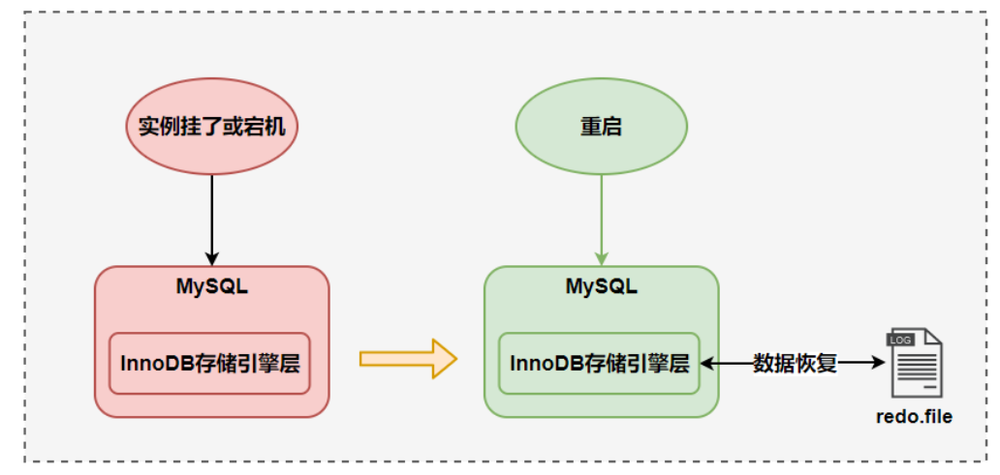

MySQL中数据是以页为单位的，你查询一条记录，会从硬盘把一页的数据加载出来，加载出来的数据叫做数据页，会放入到Buffer Pool中，后续的查询都是先从Buffer pool中查找，如果没能命中再去硬盘加载，减少硬盘IO的次数

更新数据表的时候也是如此，发现Buffer pool中存在要更新的数据，就直接在Buffer pool中更新

然后会把**“在某个数据页上做了哪些修改”**记录到重做日志缓存（redo log buffer）中，接着刷盘到redo log中

> 每条redo记录都是由“表空间号 + 数据页号 + 偏移量 + 修改数据长度 + 具体修改的数据”组成

**redo log要写到磁盘上，数据也要写到磁盘上，为什么还要多此一举，多一个redo log呢？**

根据前面的分析，很明显，我们知道**redo log能够实现事务的持久性，而且让MySQL拥有了crash-safe的能力**，能够保证MySQL在任何时间段突然崩溃，重启之后之前提交的记录都不会丢失。除此之外，还有一个原因，那就是**将写操作从随机写变成顺序写，**提升MySQL写入磁盘的性能。

因为写入redo log的方式使用了追加操作，所以磁盘操作是顺序写，而写入数据需要先找到写入位置，然后才写到磁盘，所以磁盘操作是随机写。磁盘的顺序写比随机写要高效的多，因此redo log写入磁盘的开销更小，因为MySQL的写操作并不是立刻更新到磁盘上，而是先记录在日志上，然后在合适的时间更新到磁盘上，所以WAL技术的另一个优点就是把MySQL的写操作从随机写变成了顺序写

#### 刷盘时机

InnoDB存储引擎为redo log的刷盘策略提供了`innodb_flush_log_at_trx_commit`参数，它支持三种策略：

- 0：设置为0的时候，表示每次事务提交之后不进行刷盘操作

- 1：设置为1的时候，表示每次事务提交之后进行刷盘操作（默认值）
- 2：设置为2的时候，表示每次事务提交之后都只把redo log buffer的内容写入到page cache中

`innodb_flush_log_at_trx_commit` 参数默认为 1 ，也就是说当事务提交时会调用`fsync` 对 redo log 进行刷盘

另外，InnoDB中有一个后台线程，**每隔1秒**就会把redo log buffer中内容写入到page cache中，然后调用`fsync`刷盘

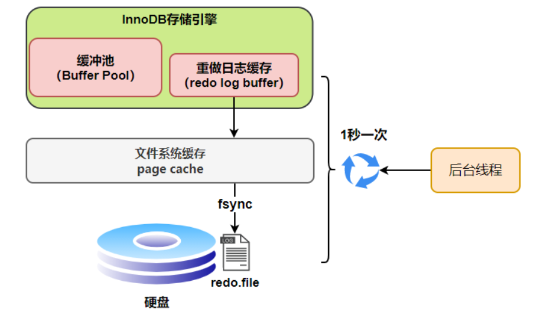

也就是说，**一个没有提交事务的redo log记录，也可能会刷盘，**因为事务执行过程中redo log记录是会写入redo log buffer中，这些redo log会被后台线程刷盘，如下图所示

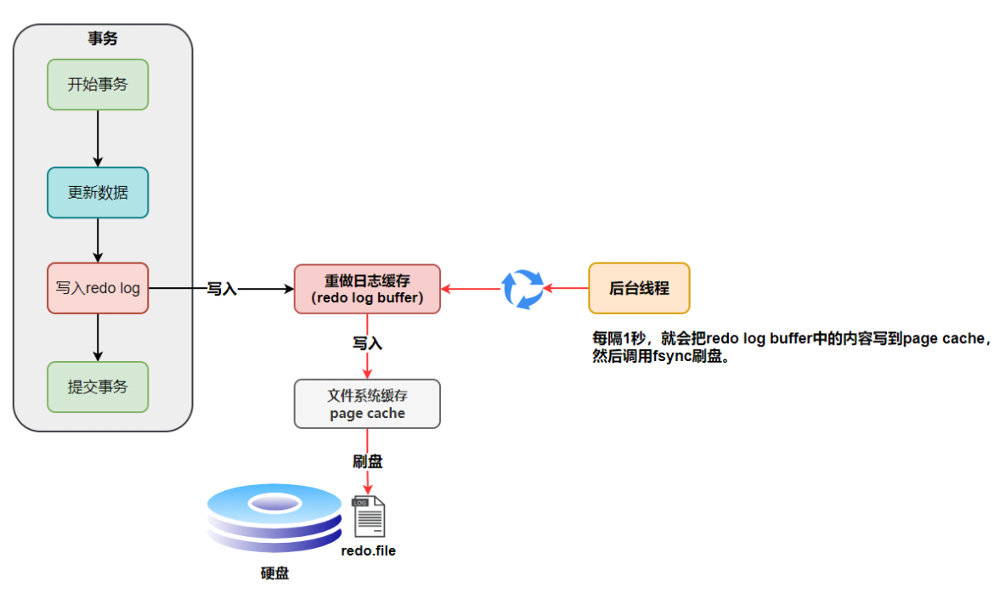

除了后台线程每秒1次的轮询操作以外，还有一种情况，当redo log buffer占用的空间即将达到`innodb_log_buffer_size`一半的时候，后台线程会主动刷盘

因此，不同策略下的刷盘流程分别如下：

- `innodb_flush_log_at_trx_commit=0`，事务提交之后不会刷盘，将redo log留在redo log buffer中，等待后台线程一秒一次的轮询调用

  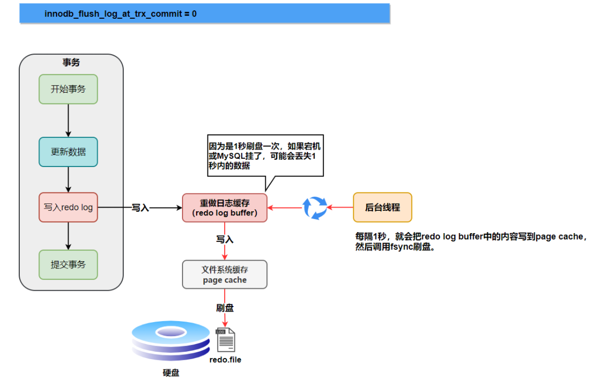

  可以发现，当设置为0的时候，当MySQL挂了或者宕机的时候，有可能会产生1秒数据的丢失

- `innodb_flush_log_at_trx_commit=1`，事务提交之后立刻刷盘

  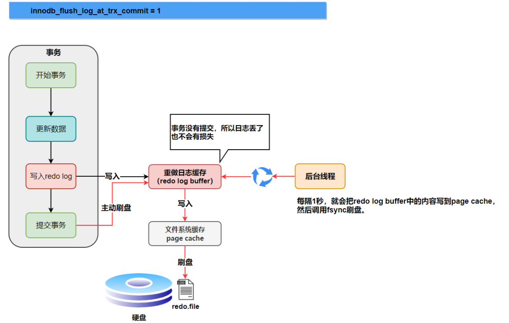

  可以发现，设置为1的时候，只要事务提交成功，redo log记录就一定在硬盘中，不会有任何的数据丢失

  如果在事务执行期间，MySQL挂了或者宕机，这部分的日志会丢失，但是由于事务没有提交，所以即便日志丢失了数据也不会有损失

- `innodb_flush_log_at_commit=2`，事务提交之后，将redo log buffer中的内容写到page cache中

  

  可以发现，如果仅仅是MySQL挂了，那么不会有任何影响，因为事务提交之后redo log buffer中的内容已经被写入到page buffer中了，但是如果发生了宕机，那么就可能会丢失这1秒内的数据

####  日志文件组

**硬盘上**redo log日志文件不止一个，而是以一个日志文件组的形式出现的，每个redo日志文件的大小是一致的，默认情况下是有1个日志文件组，其中包括2个日志文件

比如可以配置一组4个文件，将每个redo日志文件大小设置为1GB，整个redo log日志文件组可以记录4GB的内容

它采用的是**环形数组形式**，从头开始写，写到末尾又写到头循环写，如下图所示：

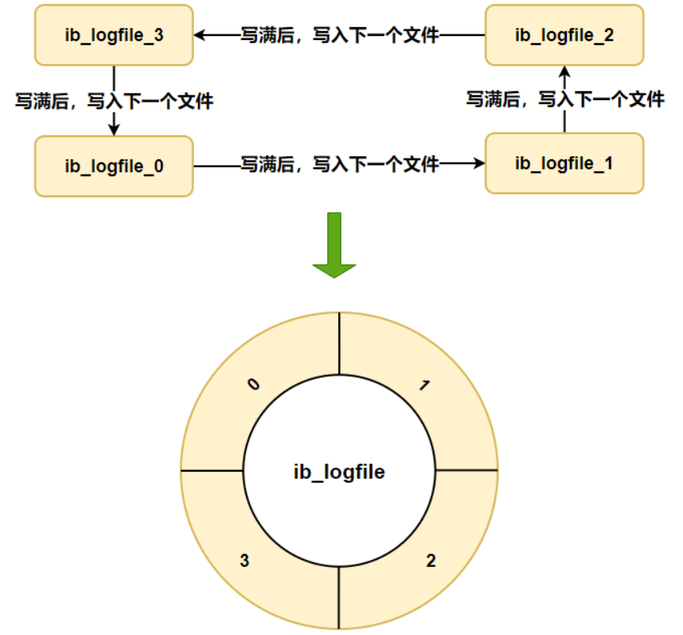

> 为什么采用环形结构
>
>  redo log 是为了防止 Buffer Pool 中的脏页丢失而设计的，那么如果随着系统运行，Buffer Pool 的脏页刷新到了磁盘中，那么 redo log 对应的记录也就没用了，这时候我们擦除这些旧记录，以腾出空间记录新的更新操作。

在日志文件组中有两个重要属性，分别是`write pos`和`checkpoint`

- write pos是当前记录的位置，一边写一边往后移
- checkpoint是记录当前要擦除的位置，也是往后移动

每次刷盘`redo log`记录到日志文件组中，`write pos`的位置就会后移更新

每次MySQL加载日志文件组的时候，就会清空加载过的redo log记录，并把checkpoint后移更新。

write pos和checkpoint之间的还空着的部分可以用来写入新的redo log记录

如果write pos追上了checkpoint，那么说明日志文件组满了，这时不能再写入新的redo log记录，MySQL得停下来，将Buffer Pool中的脏页刷到磁盘中，然后清空redo log上的一些记录，把checkpoint再推进一下

### binlog

redo log是物理日志，记录内容是在某个数据页上做了哪些修改，属于InnoDB存储引擎

binlog是逻辑日志，记录内容是语句的原始逻辑，类似于“给ID=2的这一行的C字段加1”，属于MySQL server层

不管使用什么存储引擎，**只要发生了表数据更新，就会产生binlog文件**

> binlog中包含了一系列变更数据的操作，例如变更表结构、删除数据、更改/添加数据等DML，DDL，这些操作在binlog中统一称为事件（Event）
> binlog 文件是记录了所有数据库表结构变更和表数据修改的日志，不会记录查询类的操作，比如 SELECT 和 SHOW 操作。

MySQL数据库的**数据备份、主从同步**都离不开binlog，需要依靠binlog来同步数据，保证数据一致性

- **主从同步：**在该过程中，binlog用于记录主库的数据变更，然后这些记录被主库内的线程发送至从库，从库的工作线程再把接收到的变更事件放到从库上执行，完成数据同步，主从同步通常会被视为提升数据库吞吐能力的一种方式
- **数据恢复：**在生产环境中，总是会存在数据意外丢失的情况，在一些数据恢复的场景中，binlog是必不可少的，当数据库从备份中恢复的时候，binlog中所记录的信息会在恢复后的数据上执行，补齐备份数据中未备份的记录

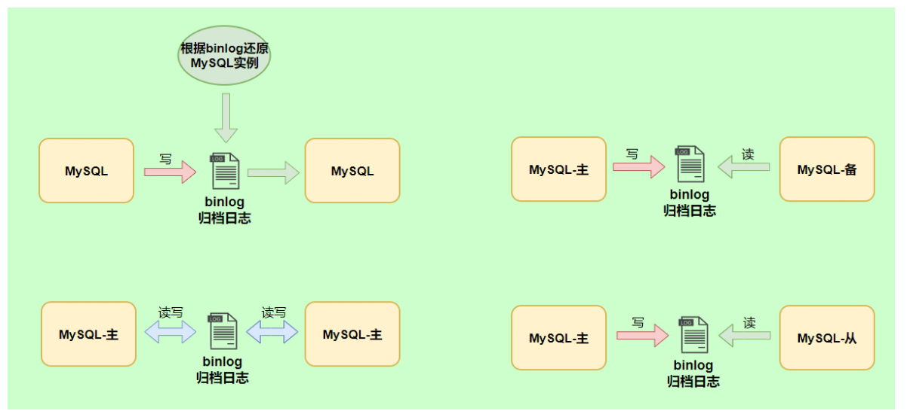

**binlog会记录所有涉及数据更新的逻辑操作，并且是顺序写**

#### 记录格式

binlog日志有三种格式，可以通过`binlog_format`参数指定

- statement（默认）
- row
- mix

**指定statement，记录的内容是SQL语句原文，**比如执行了一条`update T set update_time=now() where id=1`，记录的内容如下

同步数据时，会执行记录的SQL语句，但是有个问题，`update_time=now()`这里会获取当前系统时间，直接执行会导致与原库的数据不一致。

> 指定statement时保存的就是这个语句，直接存的就是update_time=now()，再次执行的时候，会再执行一遍now()，第二次执行和第一次执行的系统时间肯定是不相同的，这就造成了数据不一致

为了解决这种问题，我们需要**指定为row，记录的内容不再是简单的SQL语句了，还包含操作的具体数据**，记录内容如下：

通过row格式记录的binlog是直接看不出来的，需要借助mysqlbinlog工具解析出来

`update_time=now()`变成了具体的时间`update_time=1627112756247`，条件后面的@1、@2、@3 都是该行数据第1个~3 个字段的原始值（**假设这张表只有 3 个字段**）。

这样就能够保证数据的一致性，**通常情况下都是指定为row，**这样可以为数据的恢复与同步带来更好的性能损耗

但是这种格式，很明显需要更大的容量来记录，比较占用空间，恢复和同步时会更消耗IO资源，影响执行速度

> 比如执行批量 update 语句，更新多少行数据就会产生多少条记录，使 binlog 文件过大，而在 STATEMENT 格式下只会记录一个 update 语句而已；

所以就有了一种折中的方案，**指定为mixed，记录的内容是前两者的混合**

MySQL会判断这条SQL语句是否可能引起数据的不一致，如果是，就使用row，如果不是就使用statement

#### 写入机制

binlog的写入时机也非常简单，在事务执行的过程中，先把日志写到binlog cache中，事务提交的时候，再把`binlog cache`写到binlog文件中

**因为一个事务的binlog不能被拆开，无论这个事务多大，也要确保一次性写入，所以系统会为每个线程分配一个binlog cache**

> 一个线程中只能同时有一个事务执行

我们可以通过`binlog_cache_size`参数控制单个线程`binlog cache`的大小，如果存储内容超过了这个参数，那么就暂存到磁盘（Swap）

- 上图的write，是指把日志写入到文件系统的page cache，并没有把数据持久化到磁盘
- 上图的fsync，才是把数据持久化到磁盘的操作

**`write`和`fsync`的时机，可以由参数`sync_binlog`控制**，默认是`0`

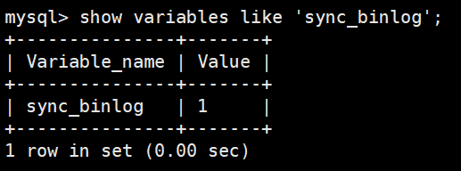

- sync_binlog为0的时候，表示每次提交事务都只write，由系统自行判断什么时候执行fsync，所以发生宕机后，pagecache中的binlog会丢失

  

- sync_binlog为1的时候，每次提交事务都会执行fsync操作，即把page cache中的数据刷到磁盘中

- 还有一种这种方案，那就是将sync_binlog设置成N（N>1），表示每次提交事务都write，但是积累N个事务之后才fsync

  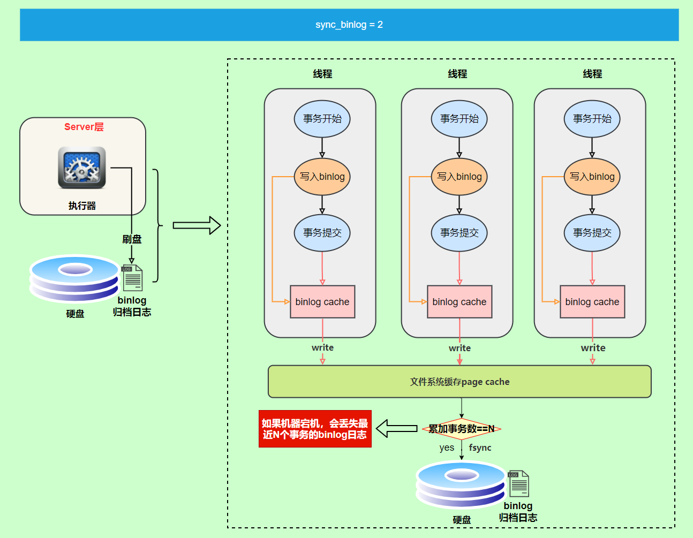

因此，在IO出现瓶颈的时候，可以将`sync_binlog`的值设置成一个较大的N，可以提升性能，但是如果机器发生宕机，会丢失最近N个事务的binlog

> **如果不小心将整个数据库的数据删除了，能使用redo log文件恢复数据吗？**

不可以使用 redo log 文件恢复，只能使用 binlog 文件恢复。

因为 redo log 文件是循环写，是会边写边擦除日志的，**只记录未被刷入磁盘的数据的物理日志**，已经刷入磁盘的数据都会从 redo log 文件里擦除。

binlog 文件保存的是全量的日志，也就是保存了所有数据变更的情况，理论上只要记录在 binlog 上的数据，都可以恢复，所以如果不小心整个数据库的数据被删除了，得用 binlog 文件恢复数据。

### 两阶段提交

- `redo log`让InnoDB存储引擎有了崩溃恢复的能力
- `binlog`保证了MySQL集群架构的数据一致性

虽然它们都属于持久化的保证，但是侧重点不同

在执行更新语句的过程中，会记录redo log和bin log两种日志，以基本的事务为单位，redo log在事务执行的过程中可以不断写入，而bin log只有在提交事务的时候才会写入，所以redo log和bin log的写入时机不一致

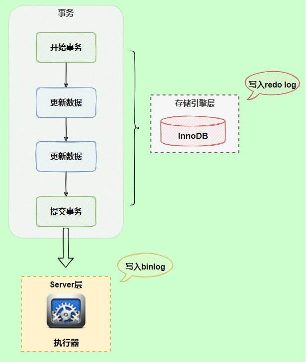

事务提交后，redo log和binlog都要持久化到磁盘上，但是这两个是独立的逻辑，可能出现半成功的状态，这样就造成了两个日志之间的逻辑不一致的情况

> **如果redo log和bin log的逻辑不一致会出现什么问题？**

我们以`update`语句为例，假设`id=2`的记录，字段`c`值是`0`，把字段`c`值更新成`1`，`SQL`语句为`update T set c=1 where id=2`

假设执行过程中写完redo log日志后，binlog日志写期间发生了异常，会出现什么情况呢？

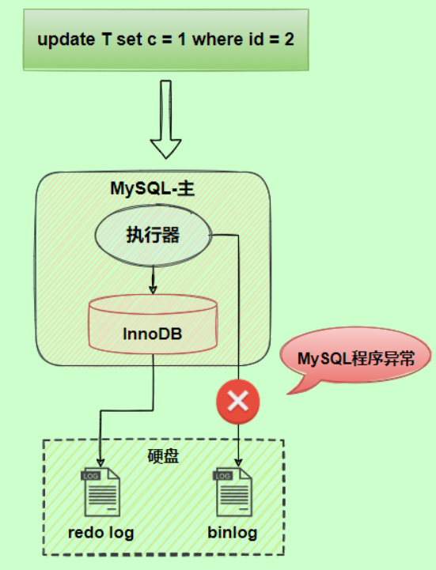

由于binlog没有写完就异常，这时候binlog里面没有对应的修改记录，因此，之后使用binlog日志恢复数据的时候，就会少这一次更新，回复出来的这一行数据中c的值是0，而原库中因为redo log日志恢复，这一行c的值是1，最终数据不一致

而如果将binlog刷入到磁盘之后，MySQL突然宕机了，而redo log还没有来得及写入，由于redo log还没写，崩溃恢复以后这个事务无效，所以id=1这行数据的c字段仍然是旧值，而binlog里面记录了这条更新语句，在主从架构中，binlog会被复制到从库，从库执行了这条更新语句，那么同样会造成最终数据不一致

为了解决这两份日志之间由于逻辑不一致导致的数据不一致问题，InnoDB存储引擎使用**两阶段提交**方案

原理很简单，就是**将redo log的写入拆成了两个步骤`prepare`和`commit`，中间穿插写入bin log，**这就是两阶段提交

使用两阶段提交之后，即使binlog写入过程中发生了异常，也不会产生数据不一致的现象，**因为MySQL根据redo log日志恢复数据的时候，发现redo log还处于prepare阶段，并且没有对应的bin log文件，就会回滚该事务**

如果redo log在commit阶段发生异常，即redo log仍然处于prepare阶段，但是存在对应的binlog， 那还会不会回滚事务

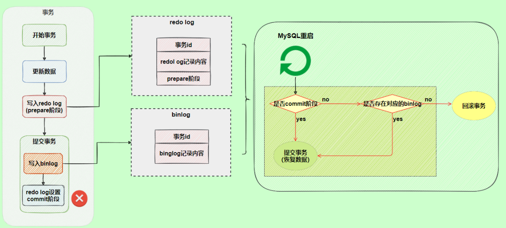

这种情况下就不会回滚事务了，虽然redo log仍处于prepare阶段，但是能够通过事务id找到对应的bin log，所以MySQL会认为日志是完整的，就会提交事务恢复数据

事实上，**两阶段提交是以binlog写成功为事务提交成功的标识的。**

事务没提交的时候，redo log会被持久化到磁盘中，因为redo log的默认写入机制是事务执行中间过程的 redo log 也是直接写在 redo log buffer 中的，这些缓存在 redo log buffer 里的 redo log 也会被「后台线程」每隔一秒一起持久化到磁盘。也就是说，**事务没提交的时候，redo log 也是可能被持久化到磁盘的**。如果 mysql 崩溃了，还没提交事务的 redo log 已经被持久化磁盘了，mysql 重启后，数据不就不一致了？这种情况 mysql 重启会进行回滚操作，因为事务没提交的时候，binlog 是还没持久化到磁盘的。所以， redo log 可以在事务没提交之前持久化到磁盘，但是 **binlog 必须在事务提交之后，才可以持久化到磁盘**

**两阶段提交中存在的问题：**

两阶段提交虽然能够保证两个日志文件的数据一致性，但是性能很差，主要有两个方面的影响：

- **磁盘IO次数高，**binlog和redo log在内存中都有对应的缓存空间，binlog缓存在binlog cache中，redo log会缓存在redo log buffer中，一般情况下为了避免日志丢失，我们会将其控制参数都设置为1，也就是说，在每次事务提交的过程中，至少会有两次的刷盘操作，一次是redo log落盘，一次是binlog落盘，这会成为性能瓶颈
- **锁竞争激烈，**两阶段提交虽然能够保证单事务两个日志的内容一致，但是在多事务的情况下却不能保证两者的提交顺序一致，因此，在两阶段提交的流程基础上，还需要加一个锁来保证提交的原子性，从而保证多事务的情况下，两个日志的提交顺序一致。

**解决方式：组提交**

**MySQL引入了binlog组提交（group commit）机制，当有多个事务提交的时候，会将多个binlog刷盘操作合并成一个，从而减少磁盘IO的次数**，如果说10个事务依次排队刷盘的时间成本是10，那么将这10个事务一次性一起刷盘的时间成本近似为1

引入组提机制后，prepare阶段不变，只针对commit阶段，将commit阶段拆分成三个过程：

- **flush阶段：**多个事务按照进入的顺序将binlog从cache写入文件（不刷盘）
- **sync阶段：**对binlog文件做fsync操作（多个事务的binlog合并一次刷盘）
- **commit阶段：**各个事务按顺序做InnoDB commit 操作

上面的**每个阶段都有一个队列**，每个阶段都有锁进行保护，因此保证了事务写入的顺序，第一个进入队列的事务会变成leader，leader领导所在队列的所有事务，全权负责整队的操作，完成后通知对内其他事务操作结束。

对每个阶段引入队列后，锁就只针对每个队列进行保护，不再锁住提交事务的整个过程，可以看出来，**锁粒度变小了，这样就使得多个阶段可以并发执行了，从而提升效率**。

对于redo log来说，是否有redo log组提交取决于MySQL的版本，在 MySQL 5.6 的组提交逻辑中，每个事务各自执行 prepare 阶段，也就是各自将 redo log 刷盘，这样就没办法对 redo log 进行组提交。在 MySQL 5.7 版本中，做了个改进，在 prepare 阶段不再让事务各自执行 redo log 刷盘操作，而是推迟到组提交的 flush 阶段，也就是说 prepare 阶段融合在了 flush 阶段。

具体如下：

> flush阶段

第一个事务会成为 flush 阶段的 Leader，此时后面到来的事务都是 Follower ：

接着，获取队列中的事务组，由绿色事务组的 Leader 对 redo log 做一次 write + fsync，即一次将同组事务的 redo log 刷盘：

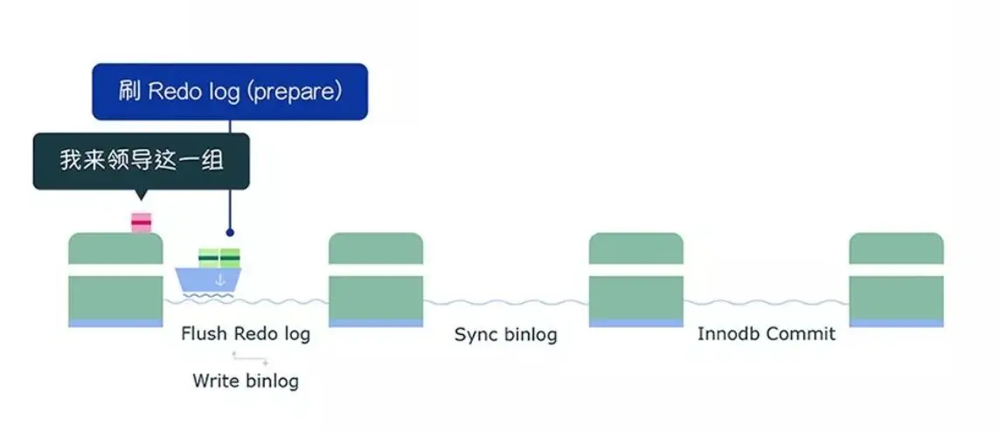

完成了 prepare 阶段后，将绿色这一组事务执行过程中产生的 binlog 写入 binlog 文件（调用 write，不会调用 fsync，所以不会刷盘，binlog 缓存在操作系统的文件系统中）。

从上面这个过程，可以知道 flush 阶段队列的作用是**用于支撑 redo log 的组提交**。

如果在这一步完成后数据库崩溃，由于 binlog 中没有该组事务的记录，所以 MySQL 会在重启后回滚该组事务。

> sync阶段

绿色这一组事务的 binlog 写入到 binlog 文件后，并不会马上执行刷盘的操作，而是**会等待一段时间**，这个等待的时长由 `Binlog_group_commit_sync_delay` 参数控制，**目的是为了组合更多事务的 binlog，然后再一起刷盘**，如下过程：

不过，在等待的过程中，如果事务的数量提前达到了 `Binlog_group_commit_sync_no_delay_count` 参数设置的值，就不用继续等待了，就马上将 binlog 刷盘，如下图：

从上面的过程，可以知道 sync 阶段队列的作用是**用于支持 binlog 的组提交**。

如果在这一步完成后数据库崩溃，由于 binlog 中已经有了事务记录，MySQL会在重启后通过 redo log 刷盘的数据继续进行事务的提交。

>commit阶段

最后进入 commit 阶段，调用引擎的提交事务接口，将 redo log 状态设置为 commit。

**commit 阶段队列的作用是承接 sync 阶段的事务，完成最后的引擎提交**，使得 sync 可以尽早的处理下一组事务，最大化组提交的效率

### redo log和binlog的区别

第一，两者在功能上是不同的，redo log作为异常宕机或者介质故障后的数据恢复使用，binlog用来进行主从搭建等数据一致性方面的数据恢复

第二，两者写入的时机不同，redo log可以在事务执行的过程中不断写入，binlog是在事务提交完成之后被一次性写入

第三，redo log是InnoDB存储引擎特有的，而binlog是属于MySQL的上层server层，任何的存储引擎对数据库进行更改都会产生binlog

第四，两者记录的内容是不同的，redo log是物理操作日志，因此每个事务会对应多个日志条目，而binlog中记录的是对应的SQL语句，他是逻辑日志

第五，两者存储方式不同，binlog不是循环使用，在写满或者重启之后会重新写入一个新的文件，而redo log使用日志文件组能够实现循环使用

### 总结

MySQL InnoDB存储引擎通过redo log来实现数据的持久化，通过undo log保证事务的原子性

MySQL数据库的数据备份、主主、主从、主备都离不开bin log，需要依靠bin log来同步数据，保证数据一致性

## MySQL磁盘IO很高，应该怎么优化

我们知道事务在提交的时候，需要将binlog和redo log持久化到磁盘中，那么如果出现MySQL磁盘IO很高的现象，我们可以从日志的角度来考虑如何降低磁盘IO的频率

- 设置组提交的两个参数：`binlog_group_commit_sync_delay` 和` binlog_group_commit_sync_no_delay_count` 参数，延迟binlog的刷盘时机，从而减少binlog的刷盘次数。这个方法是基于“额外的故意等待”来实现的，因此可能会增加语句的响应时间，但即使MySQL进程中途挂了，也没有数据丢失的风险，因为binlog早就被写到了page cache中，只要是系统没挂，缓存在page cache中的binlog就会被持久化到磁盘中
- 将`sync_binlog`设置为大于1的值（比较常见的是100~1000），每次提交事务都write，但是累计N个事务之后才fsync，相当于延迟了binlog的刷盘时机，这样做的风险时，如果系统宕机会丢失这N个binlog日志
- 将`innodb_flush_log_at_trx_commit`设置为2，表示每次事务提交后，都只是将缓存在redo log buffer里的redo log文件写入到page cache中，并没有写入到磁盘中，什么时候从page cache中写入到磁盘中由操作系统决定，这样做的风险也是系统断电、宕机可能会丢失数据

## MySQL主从复制

主从复制依赖binlog，复制的过程就是将binlog中的数据从主库传输到从库上，这个过程一般是异步的，也就是主库上执行事务操作的线程不会等待复制binlog的线程同步完成

主从复制的过程其实整体上就是三个步骤：

- **写入 Binlog**：主库写 binlog 日志，提交事务，并更新本地存储数据。
- **同步 Binlog**：把 binlog 复制到所有从库上，每个从库把 binlog 写到暂存日志中。
- **回放 Binlog**：回放 binlog，并更新存储引擎中的数据。

MySQL主从复制需要三个线程：master上的binlog dump thread、slave上的I/O thread和SQL thread

- binlog dump线程：主库中有数据更新时，将更新的事件类型写入到主库的binlog文件中，并创建log dump线程通知slave有数据更新。当slave的I/O线程请求日志内容时，将此时的binlog名称和当前更新的位置同时传给slave的I/O线程

- I/O线程：该线程会连接到master，向log dump线程请求一份指定binlog文件位置的副本，并将请求回来的binlog存到本地的relay log中

  > relay 的中文意思是 中继

- SQL线程：该线程检测到relay log有更新后，会读取并在本地做redo操作，将发生在主库的事件在本地重新执行一遍，来保证主从数据同步

过程解析

1. MySQL 主库在收到客户端提交事务的请求之后，会先写入 binlog，再提交事务，更新存储引擎中的数据，事务提交完成后，返回给客户端“操作成功”的响应。
2. 从库会创建一个专门的 I/O 线程，连接主库的 log dump 线程，来接收主库的 binlog 日志，再把 binlog 信息写入 relay log 的中继日志里，再返回给主库“复制成功”的响应。
3. 从库会创建一个用于回放 binlog 的线程，去读 relay log 中继日志，然后回放 binlog 更新存储引擎中的数据，最终实现主从的数据一致性。

需要注意的是**从库不是越多越好**，因为从库数量增加，从库连接上来的IO线程也比较多，主库也要创建同样多的log dump线程来处理复制的请求，对主库资源消耗比较高，同时还受限于主库的网络带宽

所以在实际使用中，一个主库一般跟 2～3 个从库（1 套数据库，1 主 2 从 1 备主），这就是一主多从的 MySQL 集群结构。

主从复制主要有三种模型：

- **同步复制**：MySQL 主库提交事务的线程要等待所有从库的复制成功响应，才返回客户端结果。这种方式在实际项目中，基本上没法用，原因有两个：一是性能很差，因为要复制到所有节点才返回响应；二是可用性也很差，主库和所有从库任何一个数据库出问题，都会影响业务。
- **异步复制**（默认模型）：MySQL 主库提交事务的线程并不会等待 binlog 同步到各从库，就返回客户端结果。这种模式一旦主库宕机，数据就会发生丢失。
- **半同步复制**：MySQL 5.7 版本之后增加的一种复制方式，介于两者之间，事务线程不用等待所有的从库复制成功响应，只要一部分复制成功响应回来就行，比如一主二从的集群，只要数据成功复制到任意一个从库上，主库的事务线程就可以返回给客户端。这种**半同步复制的方式，兼顾了异步复制和同步复制的优点，即使出现主库宕机，至少还有一个从库有最新的数据，不存在数据丢失的风险**。

