[toc]


## MySQL索引

**索引是一种用于快速查询和检索数据的数据结构，形象的来说就是数据的目录，常见的索引结构有B树，B+树和Hash**


### 索引的优缺点

优点

- 使用索引能够大大加快数据的检索速度（大大减少检索的数据量），这也是创建索引的最主要原因
- 通过创建唯一性索引，可以保证数据库表中的每一行数据都是唯一的

缺点

- 创建索引和维护索引需要浪费很多时间，当对表中的数据进行增删改的时候，如果数据有索引，那么索引也需要进行动态的修改，会降低SQL的执行效率
- 索引需要使用物理内存存储，会耗费一定的空间


> 使用索引一定能够提高查询性能吗？
>
> 一般情况下，使用索引会提高查询性能，因为索引查询是要比全表扫描快的，但是如果数据库的数据量不大，建立索引的效果也不一定多明显


### 索引的底层数据结构

#### Hash表

哈希表是键值对的集合，通过键（key）可以快速地取出对应的值（value），因此哈希表可以快速地检索数据（接近O(1)）

> 为什么能够通过key快速地取出value呢？

原因就在于Hash算法（也叫散列算法），通过哈希算法我们可以快速找到value对应的index，找到了index也就找到了对应的value

```c
hash = hashfunc(key);
index = hash % array_size;
```

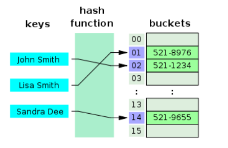

但是Hash算法有一个hash冲突问题，也就是说多个不同的key最后的index是一样的，通常情况下，我们的解决办法是通过**链地址法**，链地址法就是将哈希冲突数据存放在链表中，就比如JDK1.8之前HashMap就是通过链地址法来解决hash冲突的，不过JDK1.8（包含1.8）之后HashMap为了减少链表过长导致搜索时间变长把后面的链表换成了红黑树，源码中是设置了一个阈值（默认为8），当链表长度小于8的时候，通过链表来维护，超过8之后就将这个链表换成红黑树

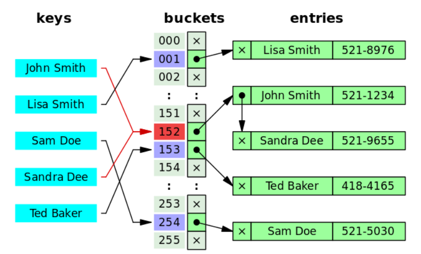

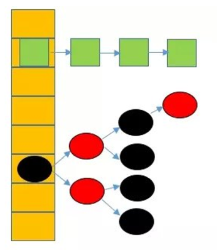

为了减少hash冲突的发生，一个好的hash函数应该均匀地将数据分布到整个可能的哈希值集合中

即然hash表这么快，**为什么MySQL还要使用其他的索引结构呢？**

这是因为hash表存在两个缺点：

- 第一个缺点就是我们上面说到的**hash冲突**，但是这不是最关键的，对于数据库来说这不算是个大缺点

- 第二个缺点就是**Hash索引不支持顺序和范围查询**，这是使用Hash表作为索引最大得缺点，假如我们要对表中的数据进行排序或者范围查询，那Hash索引可就不行了

  >```sql
  >SELECT * FROM tb1 WHERE id < 500;
  >```
  >
  >在这种情况下，如果我们要使用Hash索引的话，我们需要对1~499的id值分别进行一次索引，看看索引表里面有没有


#### B树和B+树

也叫做B-树，全称是多路平衡查找树，B+树和B树种的`B`代表的是balanced意思

目前大多数数据库和文件系统都采用B-树或者B+树来作为其索引结构

B+树是B树的一种变体，两者有什么不同呢？

- B树中的所有节点既存放键，也存放数据（data），而B+树之后叶子节点存放key和data，其他非叶子节点只存放key
- B树的叶子节点都是独立的，B+树的叶子节点有一条双向链表链指向与他相邻的叶子节点，更适合范围查询
- B树的检索过程相当于对范围内的每个节点的关键字做二分查找，可能还没有到达叶子节点，检索就结束了，而B+树的检索效率就稳定了，任何查找都是从根节点到叶子节点的过程，叶子节点的检索顺序很明显

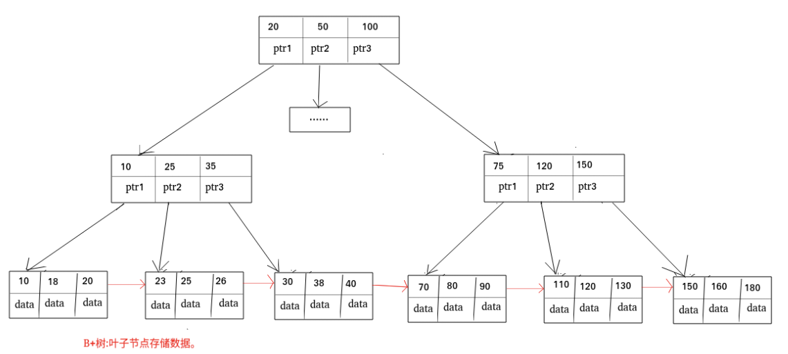


#### MySQL索引为什么使用B+树，不使用其他结构

前面已经提到了为什么不使用哈希表，因为哈希表存在哈希冲突，但这并不是最主要的原因，最主要的原因哈希表没有办法做到顺序查询和范围查询

那为什么不使用二叉树，红黑树，SB树等呢？首先不使用这些树都有一个统一的原因，那就是当数据量比较大的时候，数的高度会变得很高，这会成为一个瓶颈，而对于二叉树有一个致命的缺点，如果我们的目标元素是有规律递增或者递减的，这样出来的二叉树就会失去平衡，变成了一个线性链表结构，比如使用二叉树作为索引，那么我们将数据库主键ID这一列建立索引，得到的索引的数据结构就变成一个链表，这种情况下，查找数据和没有索引是一样的效果，那么索引就起不到作用了。

红黑树能够通过左旋右旋，颜色变化等操作解决二叉树中的不平衡问题，但是由于红黑树中每个父节点只能够有2个子节点，所以数据量大时，树的高度会很高，这样不利于MySQL磁盘寻址

那么为什么不选择使用B树，而是用B+树呢？

- 首先，B树能够完成的工作B+树都能够完成，且能够更好的完成，他们两个都降低了数的高度，增加了节点的存储量
- B+树的扫库和扫表能力更强，如果根据索引去进 行数据表扫描，B树需要遍历整棵树，而B+树之需要遍历叶子节点
- B+树的查询效率更加稳定，每一次都是从根节点到叶节点，所以每次查询的IO次数都是稳定的
- B+树有天然的排序功能
- B+树读写磁盘的能力更强，因为B+树中根节点和支节点不保存数据区，所以在同样大小的情况下，B+树中的根节点和支节点能够保存更多的关键字，所以B+树一次磁盘读写能够加载的关键字更多


#### InnoDB和MyISAM的索引实现

在MySQL中MyISAM和InnoDB都是使用B+树作为索引结构，但是具体的实现方式不同

> MyISAM的索引实现

MyISAM使用B+树作为索引结构，叶节点data存放的是数据记录的地址，在检索的时候首先按照B+树搜索算法搜索引擎，如果指定的key存在，则取出其data域的值，然后以data域的值为地址读取相应的数据记录，这被称为**非聚簇索引**

下图为MyISAM的主键索引，col1为主键

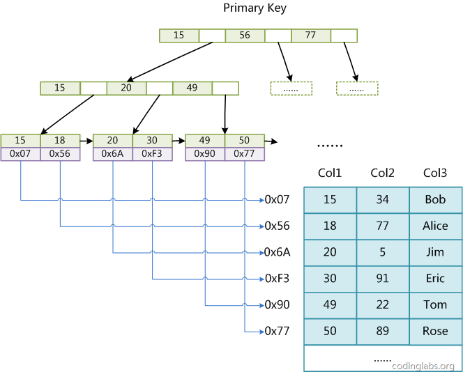

辅助索引（二级索引）跟主键索引在结构上没有什么不同，唯一的一个不同之处在于主键索引要求key是唯一的，辅助索引的key可以重复。为col2创建一个辅助索引，也是一棵B+树，data域保存数据域的值为地址，读取相应的数据记录

**MyISAM的索引结构为非聚簇索引，为了区别InnoDB的聚簇索引**


> InnoDB的索引实现

主键索引也是B+树，实现方式却完全不同，InnoDB表数据文件本身就是一个索引结构，数的叶节点存放了完整的数据记录，这种索引结构叫做**聚簇索引**


因为InnoDB的数据文件本身要按主键聚集，所以**InnoDB要求表必须有主键**（MyISAM可以没有主键），如果没有显式指定主键，则MySQL会自动选择一个可以唯一标识数据记录的列作为主键，如果不存在这种列，则mysql自动为InnoDB表生成一个隐含字段作为主键，这个字段长度为6字节，类型为长整型


**InnoDB中所有的辅助索引都引用主键作为data域，**如下图所示是在col3上的一个辅助索引


因此InnoDB的索引能提供一个非常快捷的主键查找性能，不过，它的辅助索引也会包含主键列，所以如果主键定义比较大，其他索引也将会很大，InnoDB不会压缩索引

**聚集索引这种实现方式使得按主键的搜索十分高效，但是辅助索引搜索需要检索两边索引：首先检索辅助索引获得主键，然后用主键到主索引中检索获得记录**

不同存储引擎的索引实现方式对于正确使用和优化索引都非常有帮助，例如知道了InnoDB的索引实现之后，就很容易明白为什么尽量不要选择过长的字段作为主键，因为所有辅助索引都引用主索引，过长的主索引会令辅助索引变得很大。再例如，使用非单调的字段作为主键在InnoDB中不是一个好主意，因为InnoDB数据文件本身是一颗B+树，非单调主键会造成插入新记录时数据文件为了维护B+树的特性而频繁分裂调整，十分低效，而使用自增字段作为主键则是一个很好的选择


### 索引类型

#### 主键索引

数据表的主键列使用的是主键索引，一张数据表只能够有一个主键，并且主键不能为null，不能重复

在MySQL的InnoDB表中，当没有显示指定主键的时候，InnoDB会先自动检查表中是否有唯一索引的字段，如果有，则选择这个字段作为默认主键，如果没有则自动创建一个6字节的自增主键（隐藏字段，row_id）


#### 二级索引（辅助索引）

二级索引又称为辅助索引，是因为二级索引的data域中存放的是主键，也就是说通过二级索引能够定位到主键的位置

唯一索引，普通索引，前缀索引都属于二级索引

- 唯一索引，唯一索引也是一种约束，**唯一索引的列不能够出现重复值，但是允许数据出现NULL，一张表中允许有多个唯一索引**，建立唯一索引的目的大部分时候都是为了该属性列数据的唯一性，而不是查询效率

- 普通索引，**普通索引的唯一作用就是为了加快查询效率，一张表允许创建多个普通索引，并允许数据重复和NULL**

- 前缀索引，**前缀索引只适用于字符串类型的数据**，前缀索引是对文本的前几个字符创建索引，相比普通索引建立的数据更小，因为他只取前几个字符

  > order by无法使用前缀索引，无法把前缀索引用作覆盖索引

- 全文索引，**全文索引的目的主要是为了检索大文本数据中的关键字信息，**是目前搜索引擎数据库使用的一种技术，MySQL5.6之前只有MyISAM支持全文索引，5.6之后InnoDB也支持全文索引了


### 聚簇索引和非聚簇索引

- 通过前面我们就知道了主键索引就是聚簇索引，也就是索引结构和数据存放在一起的索引，聚簇索引（也叫聚集索引）的优缺点如下：
  - **优点：**聚集索引的查询效率非常高，因为整个B+树本身就是一棵多叉平衡树，叶子节点也都是有序的，定位到索引的节点，就相当于定位到了数据
  - **缺点：**聚集索引的缺点也很明显
    - **依赖于有序的数据，**因为B+树是多路平衡树，如果索引的数据不是有序的，那么就需要在插入时进行排序，如果数据是整型的还好，否则类似于字符串，UUID这种又长又难比较的数据，插入或查找的速度肯定也比较慢
    - **更新代价大**，如果索引列的数据被修改时，那么对应的索引也将会被修改，而且聚集索引的叶子节点中还存放着数据，修改的代价肯定是比较大的，所以对于主键索引来说，主键一般是不会变的

- 通过前面我们知道辅助索引都是非聚簇索引，非聚簇索引的优缺点如下：

  - **优点：**非聚簇索引的更新代价要比聚簇索引小，因为非聚簇索引的叶子节点中是不存放数据的
  - **缺点：**非聚簇索引的缺点同样比较明显
    - 和聚簇索引一样，非聚簇索引**也依赖于有序的数据**
    - **非聚簇索引中存在回表的现象（也就是可能会二次查询）**，这是非聚簇索引最大的缺点了，当查到索引对应的指针或者主键后，可能还需要根据指针或者主键再到数据文件或表中查询

  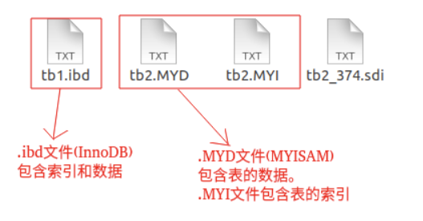


### 覆盖索引

我们知道非聚簇索引的data域中存放的是主键位置，所以非聚簇索引中存在回表现象，那么**非聚簇索引一定存在回表现象吗？**

**不一定，**试想一种情况，用户准备使用 SQL 查询用户名，而用户名字段正好建立了索引。

```sql
select name from table where name="xxx";
```

那么这个索引的key本身就是name，查到对应的name直接返回就行了，无需回表查询，如下图所示

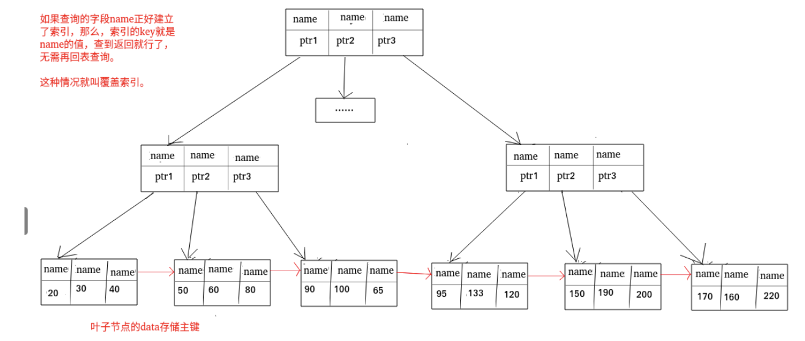

这其实就是覆盖索引，**覆盖索引即需要查询的字段正好是索引的字段，**那么直接根据该索引，就可以查到数据了，而无需回表查询

>如主键索引，如果一条 SQL 需要查询主键，那么正好根据主键索引就可以查到主键。
>
>再如普通索引，如果一条 SQL 需要查询 name，name 字段正好有索引， 那么直接根据这个索引就可以查到数据，也无需回表。


### 索引下推

索引下推是`MySQL 5.6`推出的查询优化策略，索引下推能够减少**二级索引**在查询时的回表操作，提高查询的效率，因为它将 Server 层部分负责的事情，交给存储引擎层去处理了。

举个例子，对于下面这个用户表建立了一个联合索引`(age, reward)`

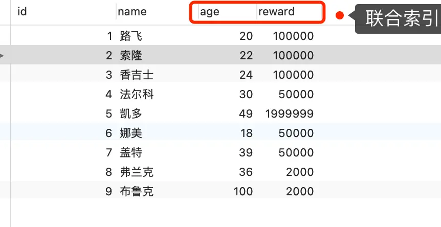

执行下面语句：

```sql
select * from t_user  where age > 20 and reward = 100000;
```

当联合索引遇到`<, >`这种类型的范围查询就会停止匹配，也就是只有age字段能够用到联合索引，但是reward字段则无法利用索引

在MySQL 5.6之前，没有索引下推的时候，执行器与存储引擎的执行流程是这样的：

- Server层首先调用存储引擎的接口定位到满足查询条件的第一条二级索引记录，也就是定位到`age > 20`的第一条记录
- 存储引擎根据二级索引的B+树快速定位到这条记录后，获取主键值，然后进行**回表操作**，将完整的记录返回给Server层
- Server层在判断该记录的reward是否等于100000，如果成立则将其发送给客户端，否则跳过该记录
- 接着，继续向存储引擎索要下一条记录，存储引擎在二级索引定位到记录后，获取主键值，然后回表操作，将完整的记录返回给server层
- 如此往复，直到存储引擎把表中所有的记录读完


在使用索引下推之后，虽然reward字段仍然没有办法使用到联合索引，但是因为它包含在联合索引（age, reward）里，所以直接在引擎层过滤出满足reward=100000的记录后，才去执行回表操作获取整个记录，相对于没有索引下推，节省了很多的回表操作

但发现执行计划里面的`extra`部分显示了`Using Index Condition`，就说明使用了索引下推


### 创建索引的注意事项

1. **选择合适的字段创建索引**
   - **不为NULL的字段，**索引字段的数据应该尽量不为NULL，因为对于数据为NULL的字段，数据库较难优化，如果字段被频繁查询但是有避免不了null，建议使用0，1，true，false等语义较为清晰的短值或者短字符作为替代
   - **被频繁查询的字段，**我们创建索引的字段应该是被频繁查询的字段
   - **被作为条件查询的字段，**被作为where条件查询的字段，应该考虑建立索引
   - **频繁需要排序的字段，**索引已经排序，这样查询可以利用索引的排序，加快排序查询时间
   - 被频繁用于连接的字段，经常用于连接的字段可能是外键列，对于外键列并不一定要建立外键，只是说该列涉及到表与表的关系，对于频繁被连接查询的字段，可以考虑建立索引，提高多表连接查询的效率

2. **被频繁更新的字段要慎重拿来做索引**，索引虽然能够带来查询效率上的提高，但是索引维护的成本也是不小的，如果一个字段不经常被查询，然而经常被修改，那么就更不应该在这种字段上建立索引了

3. **尽可能地考虑建立联合索引而不是单列索引**，因为索引是需要占用磁盘空间的，**<font color=red>每个索引对应着一棵B+树，</font>**，如果一个表的字段过多，索引过多，那么当这个表的数据量达到一个体量之后，首先索引就会占用很大的空间，其次在修改索引时也会耗费大量的时间，如果是联合索引，多个字段在一个索引上，那么将会节约很大的磁盘空间，且修改数据的操作效率也会提升

   > 可以使用联合索引来进行排序，如下：
   >
   > ```sql
   > select * from order where status = 1 order by create_time asc
   > ```
   >
   > 如果只给status创建一个索引，那么这条语句还要对create_time进行排序，这是就用到了文件排序，在`SQL`的执行计划中，Extra列就会出现`Using Filesort`
   >
   > 但是如果给status和create_time创建了一个联合索引，这样根据status筛选后的数据就是按照create_time排好序的，避免在文件排序，提高查询效率

4. **注意避免冗余索引**，冗余索引指的是索引的功能相同，能够命中索引（a,b）就一定能够命中索引（a），那么索引（a）就是冗余索引，**大多数情况下，都应该考虑扩展现有索引而不是创建新索引**

5. **考虑在字符串类型的字段上使用前缀索引来代替普通索引**，前缀索引仅限于字符串类型的字段，相较于普通索引，前缀索引占用的空间更小，所以可以考虑使用前缀索引来代替普通索引


**联合索引的最左匹配原则，在遇到范围查询（如 >、<）的时候，就会停止匹配，也就是范围查询的字段可以用到联合索引，但是在范围查询字段的后面的字段无法用到联合索引。注意，对于 >=、<=、BETWEEN、like 前缀匹配的范围查询，并不会停止匹配**

比如 `select * from t_table where a > 1 and b = 2`，联合索引（a, b），只有a字段用到了联合索引进行索引查询，这是因为在符合`a>1`的二级索引记录的范围里，b字段的值是无序的。

> 联合索引（a,b）是先按照a字段进行排序，因此a字段是全局有序的，而b字段是局部有序的，即当a字段相同时，再按照b字段进行排序

所以，`select * from t_table where a >= 1 and b = 2`，联合索引（a, b），a字段和b字段都使用了联合索引进行索引查询。


### 索引失效的场景

#### 普遍情况

- **对索引使用左或者左右模糊匹配**：这是因为索引B+树是按照索引值有序排列存储的，只能够根据前缀进行比较

  ```sql
  select * from t_user where name like '%林';
  ```

- **对索引使用函数**：这是因为索引中保存的是索引字段的原始值，而不是经过函数计算后的值

  ```sql
  select * from t_user where length(name)=6;
  ```

  但是如果给`length(name)`创建一个索引，那么又可以走到索引了

  ```sql
  alter table t_user add key idx_name_length ((length(name)));
  ```

- **对索引进行表达式计算**：这是因为索引中保存的是索引字段的原始值，而不是经过表达式计算后的值

  ```sql
  select * from t_user where id = 10 - 1;
  ```

- **对索引隐式类型转换**：

  - 如果索引字段是字符串类型，但是在条件查询的时候输入的参数是整数的话，这种场景下会发生全表扫描

    ```sql
    select * from t_user where phone_number=1111111
    ```

  - 但是如果索引字段是整型类型，查询条件中的输入参数即使字符串，是不会导致索引失效，还是可以走索引扫描

    ```sql
    select * from t_user where id = '1';
    ```

  出现上面场景差异的原因是：**MySQL在遇到字符串和数字比较的时候，会自动把字符串转为数字，然后再进行比较**

  因此，`select * from t_user where phone_number=1111111`会变为

  ```sql
  select * from t_user where CAST(phone_number AS signed int) = 1111111;
  ```

  也就是说，将字符串类型的`phone_number`变成int类型，可以看到CAST函数是作用在`phone_number`字段上的，也就是对索引使用了函数，对索引使用函数时会导致索引失效的！

  而`select * from t_user where id = '1';`会变为

  ```sql
  select * from t_user where id = CAST("1" AS signed int);
  ```

  可以看到，索引字段并没有用任何函数，CAST 函数是用在了输入参数，因此是可以走索引扫描的

- **联合索引非最左匹配**：在联合索引的情况下，数据是按照索引第一列排序，第一列数据相同时才会按照第二列排序。但是需要注意的是，如果有一个`(a,b,c)`的联合索引，那么`where b=1 and a=1`这种情况下也是会走索引的，因为优化器会把a字段放到前面的

  > 题外话：说到联合索引就要想到MySQL 5.6之后的功能：索引下推

- **`Where`子句中的`OR`**：在Where子句中，如果OR前面的条件列是索引列，而在OR后的条件列不是索引列，那么索引会失效，**这是因为OR的含义就是两个只要满足一个就可以了，因此只有一个条件列的索引列是没有意义的，只要条件列不是索引列，那么就会进行全表扫描**。

  ```sql
  # id是主键索引，age是普通列
  select * from t_user where id = 1 or age = 18;
  ```

  上面这个例子是全表扫描，不会用到索引，解决方法也很简单，那就是给age字段加上一个索引，然后执行计划就会变为`type=index merge`，`index merge`的意思就是对id和age分别进行扫描，然后将这两个结果进行合并


#### 特殊情况

上面说到了使用`%xxx`这种左模糊匹配会导致索引失效，但是一定会导致索引失效吗？答案是否定的，使用做模糊匹配也有可能是会用得到索引的

比如有一个数据库表，有两个字段，其中id是主键，name是索引字段，那么当我们执行如下sql语句的时候会发生什么呢？

```sql
select * from t_user where name like '%lin';
```

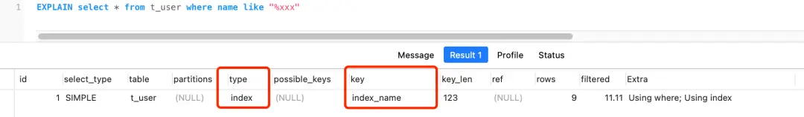

通过上面的执行计划分析可以看到，虽然是左模糊匹配，但是仍然是使用到了索引，可以看到`key=index_name`，也就是说用上了二级索引，而且从 Extra 里的 `Using index` 说明用上了覆盖索引，下面来说明一下原因：

首先，这张表只有两个字段，所以`select *`就相当于`select id, name`，然后这个查询的数据都在二级索引的B+树中，因为二级索引的B+树的叶子节点包含了索引值+主键值，所以查二级索引的B+树就能查到全部结果了，这就是覆盖索引

但是执行计划里面的`type=index`，这代表着是通过**全扫描二级索引的B+树**的方式查询到数据的，也就是遍历了整颗索引树

> 为什么是全扫描二级索引的B+树，而不是全扫描聚簇索引的B+树
>
> 因为二级索引树的记录东西很少，就只有「索引列+主键值」，而聚簇索引记录的东西会更多，比如聚簇索引中的叶子节点则记录了主键值、事务 id、用于事务和 MVCC 的回滚指针以及所有的剩余列。
>
> 再加上，这个 select * 不用执行回表操作。
>
> 所以， MySQL 优化器认为直接遍历二级索引树要比遍历聚簇索引树的成本要小的多，因此 MySQL 选择了「全扫描二级索引树」的方式查询数据。

而如果是右模糊匹配，则`type=range`，表示对索引列进行范围查询，也就是利用上了索引树有序性的特点，通过查询比较的方式，快速定位到了数据行

所以，type=range 的查询效率会比 type=index 的高一些。

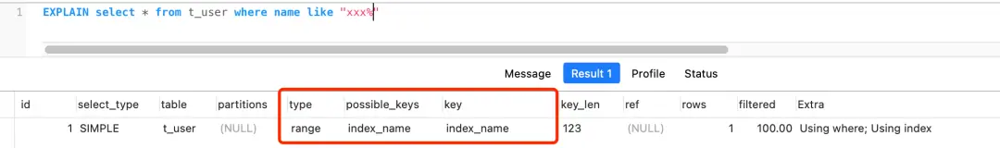


再说一个相似，我们都知道联合索引要遵循最左匹配才能走索引，但是如果数据库表中的字段都是索引的话，即使查询过程中，没有遵循最左匹配原则，也是走全扫描二级索引树(type=index)，比如下图：

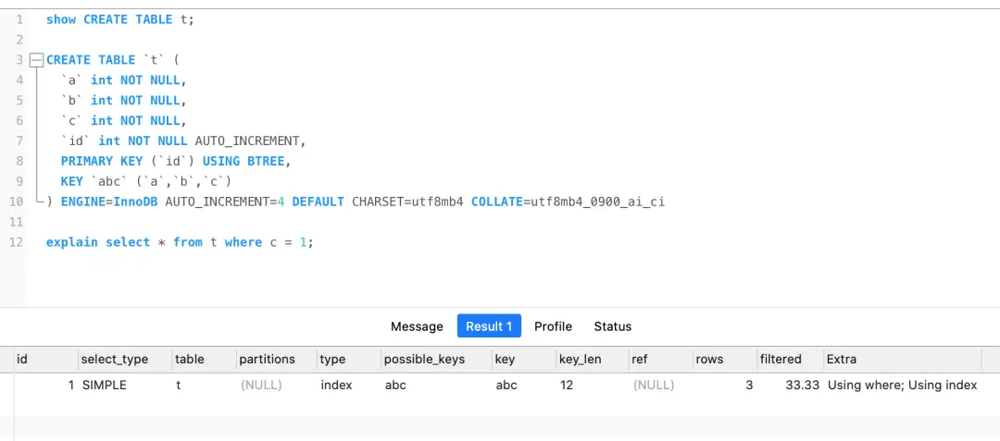


### 使用索引的一些建议

1. 对于中到大型表建立索引是非常有效的，但是特大型表的维护开销会很大，不适合建立索引

2. 避免where子句中对字段施加函数，这会造成无法命中索引

3. 在使用InnoDB时使用与业务无关的自增主键作为主键，即使用逻辑主键，而不要使用业务主键

4. 删除长期未使用的索引，不用的索引的存在会造成不必要的性能损耗

   > MySQL 5.7 可以通过查询 sys 库的 schema_unused_indexes 视图来查询哪些索引从未被使用 

5. 在使用limit，offset查询缓慢的时候，可以借助索引来提高性能


### COUNT函数

#### 概述

`count()`是一个聚合函数，函数的参数不仅是字段名，也可以是任意其他表达式，该函数的作用是统计符合查询条件的记录中，函数指定的参数不为NULL的记录有多少个

假设`count()`函数的参数是字段名，如下：

```sql
select count(name) from t_order;
```

这条语句是统计t_order表中，name字段不为NULL的记录有多少个，也就是说，如果某一条记录中的name字段的值为NULL，则不会被统计进去

再来假设count()函数的参数是数字1这个表达式，如下：

```sql
select count(1) from t_order;
```

这条语句是统计t_order表中，1这个表达式不为NULL的记录有多少个，1这个表达式就是单纯数字，它永远不是NULL，所以上面这条语句实际上是在统计t_order表中有多少条记录


#### COUNT(id)的执行过程

在通过count函数统计有多少记录的时候，`MySQL`的Server层会维护一个名叫count的变量

Server层会循环向`InnoDB`读取一条记录，如果count函数指定的参数不为NULL，那么就将变量加1，直到符合查询的全部记录被读完，就退出循环，最后将count变量的值发送给客户端。

`InnoDB`是通过B+树来保存记录的，根据索引的类型又分成了聚簇索引和二级索引，它们的区别在于，聚簇索引的叶子节点存放的是实际数据，而二级索引的叶子节点存放的是主键值，而不是实际数据

以下面的语句为例

```sql
select count(id) from t_order;
```

- 如果表中只有主键索引，没有二级索引，那么InnoDB将循环遍历聚簇索引，将读取到的记录返回个Server层，然后读取记录中的id值，根据id值判断是否为NULL，如果不为NULL，就将count变量加1

  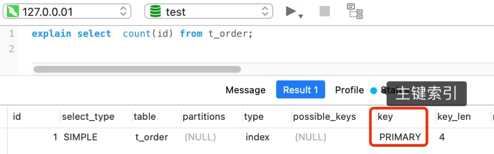

- 如果表里有二级索引时，InnoDB循环遍历的对象就不是聚簇索引了，而是二级索引。这是因为相同数量的二级索引记录可以比主键索引（聚簇索引）记录占用更少的存储空间，所以二级索引树比聚簇索引树要小，这样遍历二级索引的IO成本比遍历聚簇索引的IO成本小，因此，优化器优先选择的是二级索引

  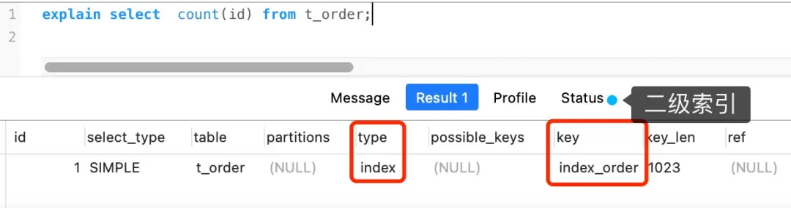


#### COUNT(1)的执行过程

以下面这条语句为例

```sql
SELECT COUNT(1) FROM t_order; 
```

如果表里只有主键索引，没有二级索引时，那么InnoDB循环遍历聚簇索引（主键索引），将读取到的记录返回给Server层，但是**不会读取记录中的任何字段的值**，因为count函数的参数是1，不是字段，所以不需要读取记录中的字段值，参数1明显不是NULL，因此Server层每次InnoDB读取到一条记录，就将count变量加1

可以看到，**count(1)相比count(主键字段)少了一个步骤，就是不需要读取记录中的字段值了**，所以通常会说count(1)的执行效率会比count(主键字段)高一点

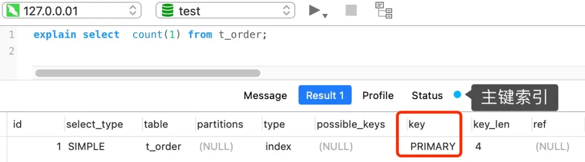

同理，如果表里有二级索引时，InnoDB循环遍历的对象就是二级索引了

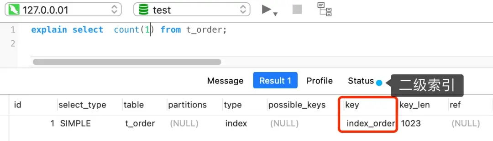


#### COUNT(*)的执行过程

`count(*)`等同于`count(0)`，也就是说当使用`count(*)`时，MySQL会将`*`参数转化为参数0来处理

因此`count(*)`的执行过程与`count(1)`基本上是一样的

而且 MySQL 会对 count(*) 和 count(1) 有个优化，**如果有多个二级索引的时候，优化器会使用key_len 最小的二级索引进行扫描**。只有当没有二级索引的时候，才会采用主键索引来进行统计


#### COUNT(字段)

假设name就是一个普通的字段，不是索引

```sql
SELECT COUNT(name) from t_order;
```

对于这个查询来说，会采用全表扫描的方式来计数，所以它的执行效率是最差的

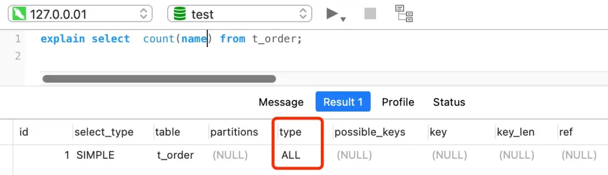


#### COUNT计数一定需要遍历吗？

前面我们说的例子都是在InnoDB引擎中的，但是在MyISAM存储引擎里，执行count函数的方式是不一样的，在没有任何查询条件下的`count(*)`，MyISAM的查询速度要明显快于InnoDB，这是因为**每张MyISAM的数据表都有一个meta信息存储了`row_count`值，**由表级锁保证一致，所以直接读取`row_count`的值就是`count(*)`的执行结果

而InnoDB存储引擎应该是支持事务的，同一时刻的多个查询由于MVCC的原因，InnoDB表应该返回多少行数据也是不确定的，所以InnoDB是无法像MyISAM那样维护一个全局变量的。

但是需要注意的是，**当带上 where 条件语句之后，MyISAM 跟 InnoDB 就没有区别了，**它们都需要**扫描表**来进行记录个数的统计


#### 如何优化COUNT(*)

如果对一张大表经常用 count(*) 来做统计，其实是很不好的。

比如下面我这个案例，表 t_order 共有 1200+ 万条记录，我也创建了二级索引，但是执行一次 `select count(*) from t_order` 要花费差不多 5 秒！

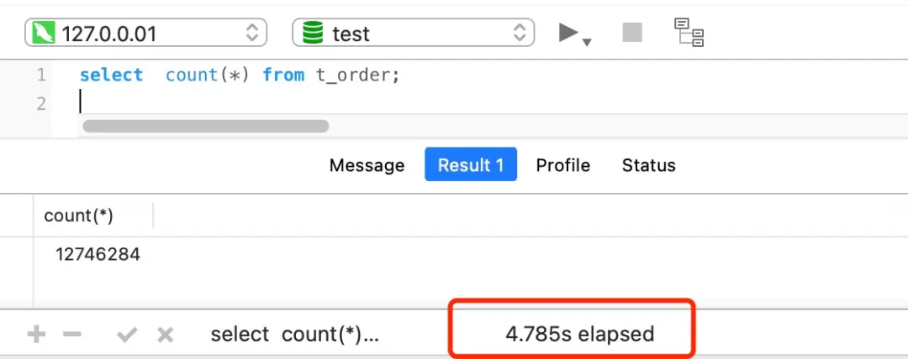

面对大表的记录统计，我们有没有什么其他更好的办法呢？


**第一种方式：采用近似值**

如果业务对统计个数不需要非常精准，比如搜索引擎在搜索关键字时，给出的搜索结果条数是一个大概值

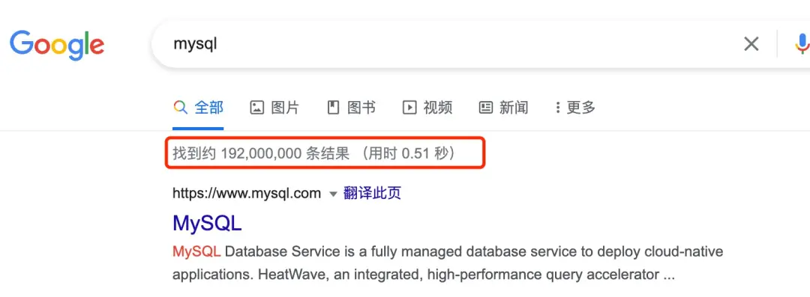

这时，我们就可以使用`show table status`或者`explain`命令来进行估算

执行 explain 命令效率是很高的，因为它并不会真正的去查询，下图中的 rows 字段值就是 explain 命令对表 t_order 记录的估算值

> explain中的rows是MySQL认为需要检测的行数，而不是结果集里面的行数，同时这个字段的值和`SQL`中的limit也是没有直接关系

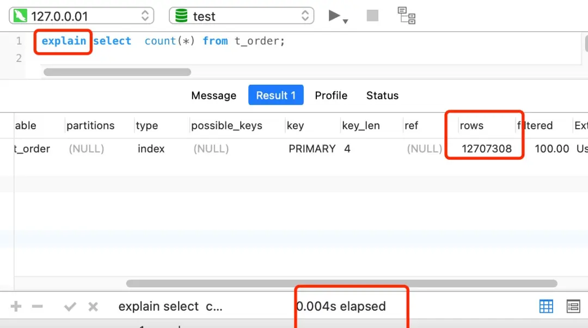


**第二种方式：使用额外表来保存计数值**

如果是想精确的获取表的记录总数，我们可以将这个计数值保存到单独的一张计数表中。

当我们在数据表插入一条记录的同时，将计数表中的计数字段 + 1。也就是说，在新增和删除操作时，我们需要额外维护这个计数表。


### 创建索引的语句

1. 添加主键索引

   ```sql
   ALTER TABLE `table_name` ADD PRIMARY KEY (`column`)
   ```

2. 添加唯一索引

   ```sql
   ALTER TABLE `table_name` ADD UNIQUE (`column`)
   
   CREATE UNIQUE INDEX `index_name` ON table_name(index_column_1, ...)
   ```

3. 添加普通索引

   ```sql
   ALTER TABLE `table_name` ADD INDEX (`column`)
   
   CREATE INDEX `index_name` ON table_name(index_column_1, ...)
   ```

4. 添加全文索引

   ```sql
   ALTER TABLE `table_name` ADD FULLTEXT (`colum`)
   ```

5. 添加多列索引

   ```sql
   ALTER TABLE `table_name` ADD INDEX index_name(`column1`,`column2`,...)
   ```

6. 添加前缀索引

   ```sql
   CREATE INDEX index_name ON table_name(column_name(length)); 
   ```

   


参考链接

> [innodb 与 myisam 索引的区别 - 简书 (jianshu.com)](https://www.jianshu.com/p/9184b21659af)
>
> [Mysql索引为啥用B+树 - Flower2021 - 博客园 (cnblogs.com)](https://www.cnblogs.com/wangflower/p/12237762.html)


