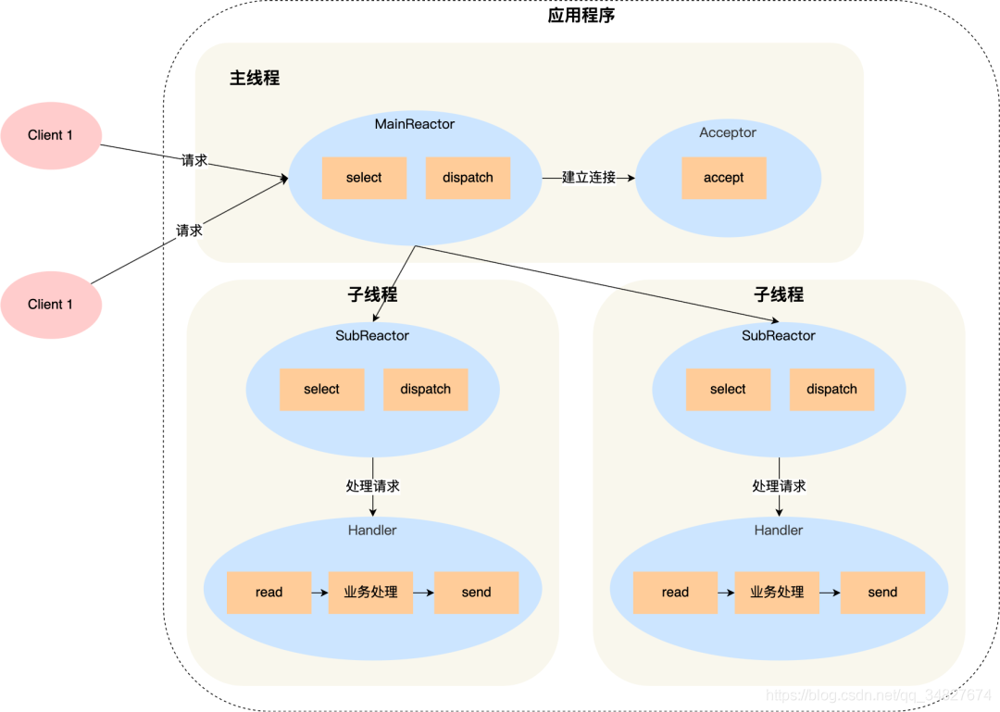
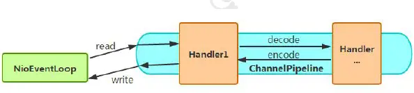

### 什么是Netty

Netty是由JBoss公司提供的一个**Java**开源框架，是一个**异步事件驱动**的网络应用程序，是目前最流行的**NIO**框架，用于快速开发高性能、高可靠性的网络IO程序

> Dubbo，Elasticsearch内部都使用了Netty


### Netty的优势

- 使用简单，对Java原生NIO类库中的API又做了一层包装，使用起来更加高效

- 功能强大，预置多种编码能力，支持多种主流协议，同时通过ChannelHandler可以进行灵活的扩展，支持很强的定制能力

- 高性能，与其他业界主流的NIO框架相比，Netty综合更优，具体体现在吞吐量更高、延迟更低、资源消耗更少以及最小化不必要的内存复制

  > 其他的NIO框架，Apache公司的MINA，SUN公司的Grizzly

- 社区活跃和稳定，版本更新周期短，bug修复速度快


### Netty的特点

- 封装好，封装了很多NIO操作的细节，提供了更加易于使用的API
- 高并发，基于NIO通信方式
- 传输快，使用零拷贝技术减少了不必要的内存拷贝，实现更快的传输速率


### Netty的应用场景

Netty主要是用来做网络通信，比如RPC框架的网络通信工具，实现一个HTTP服务器，实现一个即时通讯系统，实现消息推送系统


### Netty的高性能体现在哪些方面

- **IO线程模型：**NIO（多路复用的同步非阻塞）
- **零拷贝：**减少不必要的内存拷贝
- **内存池设计：**使用直接内存，并可重复利用
- **串行化处理读写：**避免使用锁带来的额外开销
- **高性能的序列化协议：**支持protobuf等高性能序列化协议


### 相较原生NIO的优势

- 易用性，在NIO的基础上又做了一层封装，加入了更加人性化的API，降低学习成本
- 稳定性，修复了NIO中的诸多问题，如select空转导致CPU 100%，TCP断线重连，Keep-alive检测等问题
- 高性能，对象池复用（通过对象复用避免频繁创建和销毁带来的开销）和零拷贝技术


### Netty和Tomcat的区别

**Netty和Tomcat的最大区别在于对通信协议的支持**

- Tomcat是基于HTTP协议的，本质上是一个基于HTTP协议的web容器，而Netty不仅支持HTTP，还能通过编码实现各种自定义的协议，通过codec自定义编码/解码字节流，完成数据传输
- Tomcat需要遵从Servlet规范（HTTP的请求-响应模型），而Netty不需要收到Servlet规范约束，可以发挥NIO的最大特性


### BIO，NIO，AIO

一个IO操作可以分为两个步骤，

- 发起IO请求将数据从磁盘中读出并放入内核缓冲区中
- 将数据从内核缓冲区中拷贝到用户内存

对于BIO来说，同步阻塞IO，需要等到上面的两个过程全部执行完毕之后才能够返回

对于NIO来说，分成了多路复用NIO和原始的NIO，原始的NIO，在发起IO请求之后会返回，然后轮询直到数据准备好了，也就是被放进了内核缓冲区中，然后再通过系统调用将数据拷贝到用户空间，而多路复用的NIO，是基于事件分发的模式，比如SELECT、POLL、EPOLL等系统调用会在发起IO请求之后返回，释放CPU，直到数据准备好（被拷贝到内核缓冲区中），再以事件通知应用程序进行操作，也就是数据准备阶段CPU可以去处理其他任务，而AIO是异步IO，这种方式上面的两个步骤都不会阻塞，进程发起IO请求之后直接返回，直到数据被加载到内存中，会通过事件通知，进程直接进行处理即可

> 通过上面的描述能够看出，BIO是一个连接对应一个线程，而NIO是一个请求对应一个线程，所有的请求都会被注册到多路复用器上，多路复用器轮询到有IO请求时才会启动一个线程进行处理


传统的IO是面向字节流（InputStream和OutputStream）或字符流（Reader和Writer）的，以流式的方式顺序的从一个Stream中读取一个或者多个字节，因此也就不能随意改变读取指针的位置。

在NIO中，抛弃了传统的I/O流，而是引入了Channel和Buffer的概念，在NIO中，数据读写都是通过缓冲区（Buffer）来完成的，而缓冲区的读写操作都是通过Channel来进行的。因此，只能从Channel中读取数据到Buffer中，或将数据从Buffer中写入到Channel中。这种基于缓冲区的方式可以减少对底层I/O设备的访问次数，提高性能。

因此，NIO不是基于传统的字节流或字符流，而是使用通道和缓冲区来进行数据的读取和写入。这种方式可以提供更高的性能和更灵活的I/O操作。


### Reactor模型以及Select、Poll、Epoll

去操作系统的文档里面看


### Netty有哪些核心组件

> [【死磕Netty】-----Netty的核心组件 - 腾讯云开发者社区-腾讯云 (tencent.com)](https://cloud.tencent.com/developer/article/1110061)

1. Channel，网络操作的抽象类，除了包含基本的IO操作（比如bind，connect，read，write等）之外，还包含了Netty框架中相关的一些功能，比如获取该Channel的EventLoop

   > Netty中的Channel提供了一组API，大大简化了直接与Socket进行操作的复杂性

2. EventLoop，定义了在整个连接的生命周期中发生事件时的核心抽象，直白来讲，EventLoop的主要作用就是负责监听网络事件并调用事件处理器进行相关IO操作的处理。EventLoop处理的IO事件都将在它专有的Thread上被处理，Thread和EventLoop是1：1的关系，这样能够保证线程安全

   > Channel和EventLoop的联系：当一个连接到达时，Netty就会注册一个Channel，然后从EventLoopGroup中分配一个EventLoop绑定到这个Channel上，在该Channel的整个生命周期中都是由这个绑定的EventLoop来服务的
   >
   > 总结一下，Channel为Netty网络操作提供一个抽象类，EventLoop负责处理注册到其上的Channel处理IO操作，两者配合参与IO操作

   

3. ChannelFuture，因为Netty是**<font color=red>异步非阻塞的</font>**，即所有的IO操作都是异步的，因此我们不能立刻得知消息是否已经被处理了，所以Netty中提供了ChannelFuture接口，通过该接口的`addListener()`方法注册一个ChannelFutureListener，当操作执行成功或失败时，监听就会自动触发返回该结果。此外，我们还可以通过ChannelFuture的`channel()`方法获取关联的Channel，甚至使用`sync()`让异步操作变成同步的

   > 这里当时有一个疑问，前面明明说了Netty是基于NIO的，NIO是同步非阻塞线程模型，而这里又变成异步非阻塞的，这不互相矛盾吗？
   >
   > 前面我们说到了Netty是一个异步事件驱动的框架，网络IO模型采用的是NIO，异步事件驱动框架体现在所有的IO操作都是异步的，因为所有的IO操作在调用后会立刻返回，但并不保证调用成功与否，因此会返回一个ChannelFuture，Netty通过ChannelFuture来通知用户进程IO操作是否成功
   >
   > 所以，上面说的异步是针对用户而言的，用户使用Channel进行IO操作，会立刻返回，但是这个IO操作具体是提交给了Netty的底层NIO去处理的，所以，Neety的异步事件驱动和底层基于NIO是不矛盾的

4. ChannelHandler，是Netty的最核心组件，他用于存放 所有处理出站和入站数据的用户逻辑，ChannelHandler用来处理各种事件，比如连接、数据接收、异常、数据转换等，其有两个核心子类，ChannelInboundHandler和ChannelOutboundHandler，前者用于接收、处理入站数据和事件，后者相反

5. ChannelPipeline，为ChannelHandler链提供了一个容器并定义了用于沿着链传播入站和出战事件流的API，一个数据或者事件可能会被多个Handler处理，在这个过程中，事件或数据经流ChannelPipeline，由ChannelHandler处理。在这个处理过程中，一个 ChannelHandler 接收数据后处理完成后交给下一个 ChannelHandler，或者什么都不做直接交给下一个 ChannelHandler。

6. Bootstrap和ServerBootStrap，前者是客户端引导类，后者是服务端引导类，其作用是将进程绑定到给定端口。


### Netty的线程模型

Netty是基于NIO线程模型的，具体一点，Netty是通过Reactor模型基于多路复用器接收并处理用户请求，内部实现了两个线程池，**boss线程池和worker线程池**，其中boss线程池中的线程负责处理请求中的accept请求，当收到accept请求时，会把对应的socket放入到NioSocketChannel中，并交给worker线程池，worker线程池负责请求的read、write事件，由对应的Handler处理

具体到Netty的线程模型架构，他是多Reactor多线程模型，其中主线程中的MainReactor对象负责**监控连接建立事件**，收到事件后通过Acceptor对象中的accept获取连接，将新的连接分配给某个子线程；子线程中的SubReactor对象将MainReactor对象分配的连接加入select继续监听，并创建一个Handler用来处理连接的响应事件，如果有新的事件发生，SubReactor对象调用当前连接对应的Handler对象进行响应




### Netty服务端的启动流程

```java
// 1. bossGroup用于接收连接，workerGroup用于处理具体的请求
EventLoopGroup bossGroup = new NioEventLoopGroup();
EventLoopGroup workerGroup = new NioEventLoopGroup();
try {
	// 2. 创建服务端启动引导类
    ServerBootstrap serverBootstrap = new ServerBootstrap();
    // 3. 给引导类配置两大线程组，确定了线程模型
    serverBootstrap.group(bossGroup, workerGroup)
        .channel(NioServerSocketChannel.class)
        .handler(new LoggingHandler(LogLevel.INFO))  // 4. 指定IO模型
        .option(ChannelOption.SO_BACKLOG, 256)
        .option(ChannelOption.SO_KEEPALIVE, true)
        .childOption(ChannelOption.TCP_NODELAY, true)
        .childHandler(new ChannelInitializer<SocketChannel>() {
            // 5. 自定义业务处理逻辑，将ChannelHandler加入到ChannelPipeline中
            @Override
            protected void initChannel(SocketChannel ch) throws Exception {
                ChannelPipeline pipeline = ch.pipeline();
                pipeline.addLast(new CommonEncoder(serializer));
                pipeline.addLast(new CommonDecoder());
                pipeline.addLast(new NettyServerHandler());
            }
        });

    // 6. 绑定到端口，通过sync方法阻塞方法让其直到绑定完成/addListener方法绑定一个ChannelFutureListener来监听绑定是否成功
    ChannelFuture future = serverBootstrap.bind(host, port).sync();
    // 7.阻塞等待直到服务器Channel关闭(closeFuture()方法获取Channel 的CloseFuture对象,然后调用sync()方法) 
    future.channel().closeFuture().sync();

} catch (InterruptedException e) {
    log.error("启动服务器时有错误发生: ", e);
} finally {
    // 8. 关闭相关线程组资源
    bossGroup.shutdownGracefully();
    workerGroup.shutdownGracefully();
}
```

1. 创建线程组：bossGroup用于处理连接请求，workerGroup用于处理具体的业务请求
2. 创建服务端启动引导类对象`ServerBootstrap`
3. 将bossGroup和workerGroup注册到引导类对象中
4. 指定IO模型
5. 自定义业务处理逻辑，往ChannelPipeline中加入ChannelHandler
6. 绑定到端口，因为所有IO操作都是异步的，所以这里返回一个ChannelFuture，可以通过调用sync方法将异步方法转成同步来感知是否绑定成功，也可以通过调用addListener方法为ChannelFuture添加一个监听器来感知是否绑定成功
7. 阻塞等待，直到服务器的channel关闭
8. 关闭相关的线程组资源


### Netty的串行无锁化

Netty采用了串行无锁化的设计，在IO线程内部进行串行设计避免了多线程竞争导致的性能下降，表面上看，串行化设计CPU利用率不高，并发程度不够，但是通过调整NIO线程池的线程参数，可以同时启动多个串行化的线程并行执行，这种局部无锁化的串行设计比一个队列-多个工作线程模型的性能更优



Netty中的这种理念具体体现在：当NioEventLoop读取到消息之后，直接调用ChannelPipeline中的方法（fireChannelRead），只要用户不主动切换线程，一直会由NioEventLoop调用到用户的Handler，期间不进行线程切换，这种串行化方式避免了多线程操作导致的锁的竞争，从性能角度看是最优的


### Netty中是如何解决JDK epoll空轮询的问题

首先这个bug指的是Java的NIO在Linux下进行`selector.select()`时，本来如果轮询的结果为空并且不调用`wakeup`方法的话，这个`selector.select()`过程应该是一直阻塞的，但是Java却会打破阻塞，继续执行，导致程序无限空转，造成CPU的使用率为100%

（这个问题只在Linux下存在，因为Linux下的NIO是基于epoll实现的，Java实现的epoll存在上面这个bug，而windows下的NIO是基于poll实现的，因此不存在这个问题）

Netty是如何解决这个问题的呢？

Netty为Selector的select操作设置了超时时间，同时定义了四种可以跳出阻塞的情况

- 有事件发生
- wakeup
- 超时
- 空轮询bug

前面三个很好理解，当有事件发生或者调用wakeup或者超出预定时间后，跳出阻塞，判断空轮询bug需要一个计数器，每次空轮询计数器+1，如果每次空轮询的次数超过了512次（默认），就认为其触发了空轮询bug

**当触发bug时，Netty直接重建一个Selector，将原来的Channel重新注册到新的Selector上，并将旧的Selector关掉**


### 什么是粘包和拆包

TCP是面向字节流的协议，也就是一串没有边界的数据，TCP底层并不了解上层业务数据的具体含义，它会根据TCP缓冲区的实际情况进行包的划分，所以在业务上认为，可能将一个大包拆分成多个小包发送，也可能将多个小包封装成一个大包发送，这就是所谓的TCP粘包和拆包问题。

> 由此可见，粘包和拆包是 TCP 网络编程中不可避免的，无论是服务端还是客户端，当我们读取或者发送消息的时候，都需要考虑 TCP 底层的粘包/拆包机制。

由于底层的TCP无法理解上层的业务数据，所以在TCP层是无法保证数据包不被拆分和重组的，这个问题只能够在应用层来解决

- 固定消息长度，累计读取到长度和为len的报文后，就认为读取到了一个完整的信息
- 使用特殊符号来作为消息的结束标志，比如回车
- 通过在消息头中定义长度字段来标识消息的总长度

在Netty中可以通过自定义编码器和解码器来解决这个问题，Netty中也提供了几种解码器，核心思想也很上面提到的这三点差不多


### Netty的零拷贝

1. 对于文件传输采用了transferto方法，它可以直接将文件缓冲区中的数据发送到目标channel中，避免了传统通过循环write的方式导致内存拷贝的问题
2. 可以将多个ByteBuf合并成一个逻辑上的ByteBuf，避免了各个ByteBuf之间的拷贝
3. 使用直接内存接受和发送ByteBuf，不需要进行字节缓冲区的二次拷贝

> Netty中的零拷贝完全是在用户态实现的，更多的是数据操作的优化，而OS层面上的零拷贝通常是指避免在用户态和内核态之间来回拷贝数据


Netty 的零拷贝主要包含三个方面：

- Netty 的接收和发送 ByteBuffer 采用 DIRECT BUFFERS，使用堆外直接内存进行 Socket 读写，不需要进行字节缓冲区的二次拷贝。如果使用传统的堆内存（HEAP BUFFERS）进行 Socket 读写，JVM 会将堆内存 Buffer 拷贝一份到直接内存中，然后才写入 Socket 中。相比于堆外直接内存，消息在发送过程中多了一次缓冲区的内存拷贝。
- Netty 提供了组合 Buffer 对象，可以聚合多个 ByteBuffer 对象，用户可以像操作一个 Buffer 那样方便的对组合 Buffer 进行操作，避免了传统通过内存拷贝的方式将几个小 Buffer 合并成一个大的 Buffer。
- Netty 的文件传输采用了 transferTo 方法，它可以直接将文件缓冲区的数据发送到目标 Channel，避免了传统通过循环 write 方式导致的内存拷贝问题。

### 长连接、短连接

短连接说的是server和client建立连接之后，读写完成就关闭掉连接，如果下一次再要互相发送消息，就要重新连接

长连接说的是server和client建立连接之后，读写完成后不关闭掉连接，后续的读写操作都会继续使用这个连接


### Netty长连接、心跳机制

心跳机制的工作原理是: 在 client 与 server 之间在一定时间内没有数据交互（即处于 idle 状态 -- 待机状态）时, 客户端或服务器就会发送一个特殊的数据包给对方, 当接收方收到这个数据报文后, 也立即发送一个特殊的数据报文, 回应发送方, 此即一个 PING-PONG 交互。所以, 当某一端收到心跳消息后, 就知道了对方仍然在线, 这就确保 TCP 连接的有效性。
**TCP 实际上自带的就有长连接选项，本身是也有心跳包机制**，也就是 TCP 的选项：SO_KEEPALIVE。但 TCP 协议层面的长连接灵活性不够（默认要2个多小时才能够判断出一个死亡连接），所以，一般情况下我们都是在应用层协议上实现自定义心跳机制的，也就是在 Netty 层面通过编码实现。通过 Netty 实现心跳机制的话，核心类是 IdleStateHandler 。

> Netty支持哪些心跳类型设置
>
> - readerIdleTime：为读超时时间（即测试端一定时间内未接受到被测试端消息）。
> - writerIdleTime：为写超时时间（即测试端一定时间内向被测试端发送消息）。
> - allIdleTime：所有类型的超时时间。


### Netty的对象池技术

对象池的概念其实类似于线程池，就是缓存一些对象从而避免大量创建同一类型的对象，类似线程池的概念，对象池缓存了一些已经创建好的对象，避免需要时才创建对象，同时限制了实例的个数，**池化技术的目的就是重复使用池内已经创建的对象，**所以，对象池适用的场景包括：

- 创建对象开销大
- 会创建大量的实例
- 限制一些资源的使用

Netty自己实现了一套轻量级的对象池，在Netty中，通常会有多个IO线程独立工作（基于NioEventLoop实现），每个IO线程轮询单独的Selector实例来检索IO事件，最常见的IO操作就是读写，具体到NIO中就是内核缓冲区和用户缓冲区的相互拷贝，这个过程中会创建和回收大量的buffer，Netty对Buffer进行了池化从而降低开销


### 序列化协议有哪些

- JDK自带的序列化 Serializable接口
- XML, JSON, FASTJSON, Thrift, Protobuf, kryo


### NIOEventLoopGroup源码

- NioEventLoopGroup(其实是MultithreadEventExecutorGroup) 内部维护一个类型为 EventExecutor children [], **默认大小是处理器核数 * 2**, 这样就构成了一个线程池，初始化EventExecutor时NioEventLoopGroup重载newChild方法，所以children元素的实际类型为NioEventLoop。

  > 也就是说，默认情况下netty会启动2*cpu处理器个线程，具体是在bind之后启动的

- 线程启动时调用SingleThreadEventExecutor的构造方法，执行NioEventLoop类的run方法，首先会调用hasTasks()方法判断当前taskQueue是否有元素。如果taskQueue中有元素，执行 selectNow() 方法，最终执行selector.selectNow()，该方法会立即返回。如果taskQueue没有元素，执行 select(oldWakenUp) 方法
- select ( oldWakenUp) 方法**解决了 Nio 中的 bug**，selectCnt 用来记录selector.select方法的执行次数和标识是否执行过selector.selectNow()，若触发了epoll的空轮询bug，则会反复执行selector.select(timeoutMillis)，变量selectCnt 会逐渐变大，当selectCnt 达到阈值（默认512），则执行rebuildSelector方法，进行selector重建，解决cpu占用100%的bug。
- rebuildSelector方法先通过openSelector方法创建一个新的selector。然后将old selector的selectionKey执行cancel。最后将old selector的channel重新注册到新的selector中。rebuild后，需要重新执行方法selectNow，检查是否有已ready的selectionKey。
- 接下来调用processSelectedKeys 方法（处理I/O任务），当selectedKeys != null时，调用processSelectedKeysOptimized方法，迭代 selectedKeys 获取就绪的 IO 事件的selectkey存放在数组selectedKeys中, 然后为每个事件都调用 processSelectedKey 来处理它，processSelectedKey 中分别处理OP_READ；OP_WRITE；OP_CONNECT事件。
- 最后调用runAllTasks方法（非IO任务），该方法首先会调用fetchFromScheduledTaskQueue方法，把scheduledTaskQueue中已经超过延迟执行时间的任务移到taskQueue中等待被执行，然后依次从taskQueue中取任务执行，每执行64个任务，进行耗时检查，如果已执行时间超过预先设定的执行时间，则停止执行非IO任务，避免非IO任务太多，影响IO任务的执行。
- 每个NioEventLoop对应一个线程和一个Selector，NioServerSocketChannel会主动注册到某一个NioEventLoop的Selector上，NioEventLoop负责事件轮询。
- Outbound 事件都是请求事件, 发起者是 Channel，处理者是 unsafe，通过 Outbound 事件进行通知，传播方向是 tail到head。Inbound 事件发起者是 unsafe，事件的处理者是 Channel, 是通知事件，传播方向是从头到尾。

内存管理机制，首先会预申请一大块内存Arena，Arena由许多Chunk组成，而每个Chunk默认由2048个page组成。Chunk通过AVL树的形式组织Page，每个叶子节点表示一个Page，而中间节点表示内存区域，节点自己记录它在整个Arena中的偏移地址。当区域被分配出去后，中间节点上的标记位会被标记，这样就表示这个中间节点以下的所有节点都已被分配了。大于8k的内存分配在poolChunkList中，而PoolSubpage用于分配小于8k的内存，它会把一个page分割成多段，进行内存分配。

ByteBuf的特点：支持自动扩容（4M），保证put方法不会抛出异常、通过内置的复合缓冲类型，实现零拷贝（zero-copy）；不需要调用flip()来切换读/写模式，读取和写入索引分开；方法链；引用计数基于AtomicIntegerFieldUpdater用于内存回收；PooledByteBuf采用二叉树来实现一个内存池，集中管理内存的分配和释放，不用每次使用都新建一个缓冲区对象。UnpooledHeapByteBuf每次都会新建一个缓冲区对象。

