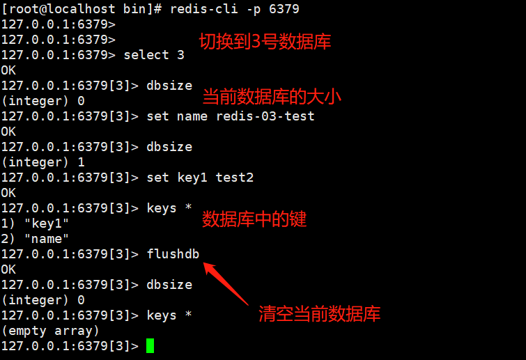
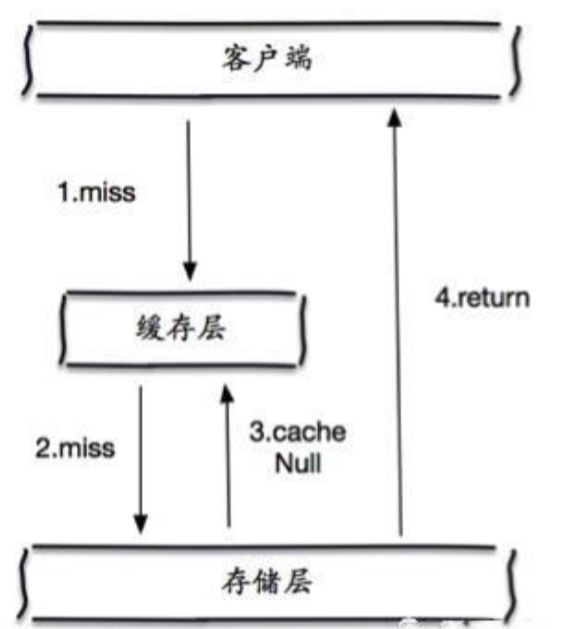
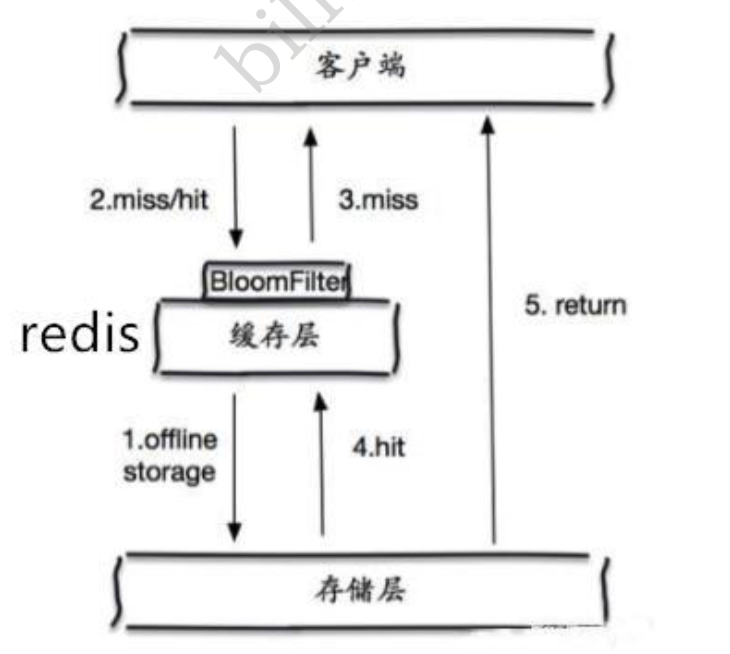

## NoSQL概述

NoSQL全称是Not Only SQL，是一种非关系型数据库管理系统，用于存储和检索大量大量无结构化或半结构化的数据，NoSQL采用不同的数据模型和查询语言，以实现更高的可伸缩性、更高的性能和更灵活的数据模型。

NoSQL数据库可以分为多个类型，包括键值存储（Key-Value Stores）、文档数据库（Document DataBases）、列族数据库（Column-Family Databases）、图数据库（Graph Databases）等


## Redis基础

### 概述

全称是**RE**mote **DI**ctionary **S**erver，远程字典服务


### Redis安装（Linux）

1、下载redis的安装包，并将安装包上传至linux服务器端，随后解压


2、进入到解压后的路径，可以看到redis的配置文件，redis.conf


3、基本的环境安装

```shell
yum install gcc-c++
make 
make install
```


4、redis的默认安装路径在`/usr/local/bin`下


5、将redis的配置文件移动到安装路径下（以后就使用这个配置文件来进行redis启动，保留压缩文件中的配置文件）

```shell
[root@localhost bin]# mkdir redis-conf
[root@localhost bin]# cd redis-conf/
[root@localhost redis-conf]# cp /opt/redis-6.2.5/redis.conf /usr/local/bin/redis-conf/
[root@localhost redis-conf]# ls
redis.conf
```


6、redis默认不是后台启动的，修改配置文件成后台启动  ==（这里需要学习一下vim快速定位）==


7、启动redis服务


8、使用redis-cli进行连接测试


9、查看redis进程


10、退出redis


### 性能测试


```shell
[root@localhost bin]# redis-benchmark -h localhost -p 6379 -c 100 -n 100000
```


- 100000个请求在1.44秒内被完成
- 有100个并行的客户端
- 每次写入3字节
- 只有一个服务器连接，单机测试
- 最后就是毫秒中测试完成度


### 基本知识

#### [基本命令](https://redis.io/commands)

在redis.conf中可以看出redis默认有16个数据库，默认使用的是0号数据库，可以通过`select dbid`来切换




清空当前输据库 `flushdb`

清空全部数据库`flushall`

```shell
127.0.0.1:6379[3]> exists name
(integer) 0    # 0 表示不存在
127.0.0.1:6379[3]> set name redis
OK
127.0.0.1:6379[3]> exists name
(integer) 1    # 1 表示存在
127.0.0.1:6379[3]> move name 1  # 把name这个键值对移动到1号数据库中
127.0.0.1:6379[1]> get name
"redis"
127.0.0.1:6379[1]> expire name 10    # 设置过期时间，10秒
(integer) 1
127.0.0.1:6379[1]> ttl name          # 查看还有多久过期
(integer) 6
127.0.0.1:6379[1]> ttl name
(integer) -2
127.0.0.1:6379[1]> ttl name          # 变成了-2就表示已经过期了
(integer) -2 
127.0.0.1:6379[1]> type name         # 查看当前key的类型
string
```

需要注意的是，set是可以被覆盖的，如下：

```shell
127.0.0.1:6379> set key "hello"
OK
127.0.0.1:6379> get key
"hello"
127.0.0.1:6379> set key "hi"
OK
127.0.0.1:6379> get key
"hi"
```


> **Redis是单线程的！！**

<font color='red'>误区1：</font>高性能的服务器一定是多线程的

<font color='red'>误区2：</font>多线程一定会比单线程快（多线程中存在CPU上下文切换）


#### 为什么Redis是单线程的，还这么快？

Redis是将所有的数据全部放在内存中的，所以说使用单线程去操作效率是最高的，多线程（CPU上下文切换是耗时的操作）对于内存系统来说，如果没有上下文切换效率就是最高的，多次读写都是在一个CPU上的，在内存情况下，这个就是最好的方案

https://blog.csdn.net/tyrroo/article/details/82429801

#### 为什么Redis是单线程的，还支持高并发？

IO模型角度


## Redis数据类型


Redis是一种开源（BSD许可）的，内存中的数据结构存储系统，它可以用作输据库、缓存和消息中间件，Redis支持多种类型的数据结构，比如字符串（strings），散列（hashes），列表（lists），集合（sets），有序集合（sorted sets）与范围查询， bitmaps， [hyperloglogs](http://www.redis.cn/topics/data-types-intro.html#hyperloglogs) 和 [地理空间（geospatial）](http://www.redis.cn/commands/geoadd.html) 索引半径查询。 Redis 内置了 [复制（replication）](http://www.redis.cn/topics/replication.html)，[LUA脚本（Lua scripting）](http://www.redis.cn/commands/eval.html)， [LRU驱动事件（LRU eviction）](http://www.redis.cn/topics/lru-cache.html)，[事务（transactions）](http://www.redis.cn/topics/transactions.html) 和不同级别的 [磁盘持久化（persistence）](http://www.redis.cn/topics/persistence.html)， 并通过 [Redis哨兵（Sentinel）](http://www.redis.cn/topics/sentinel.html)和自动 [分区（Cluster）](http://www.redis.cn/topics/cluster-tutorial.html)提供高可用性（high availability）。


### 5大基本数据类型

#### String（字符串）

```shell
127.0.0.1:6379> set key1 value1    # 设置值
OK
127.0.0.1:6379> get key1           # 获取值
"value1"
127.0.0.1:6379> keys *             # 获得所有key
1) "key1" 
127.0.0.1:6379> EXISTS key1        # key是否存在
(integer) 1
127.0.0.1:6379> append key1 "-hello"   # 追加字符串，如果key不存在，就相当于set key value
(integer) 12
127.0.0.1:6379> get key1
"value1-hello"
127.0.0.1:6379> append key "-hello"
127.0.0.1:6379> get key
"-hello"
127.0.0.1:6379> STRLEN key1          # 获取字符串的长度
(integer) 12
127.0.0.1:6379> APPEND key1 "yang"
(integer) 16
127.0.0.1:6379> strlen key1
(integer) 16

##########################################################################
127.0.0.1:6379> set count 0
OK
127.0.0.1:6379> incr count     # 自增，相当于i++
(integer) 1
127.0.0.1:6379> incr count
(integer) 2
127.0.0.1:6379> get count
"2"
127.0.0.1:6379> decr count     # 自减，相当于i--
(integer) 1
127.0.0.1:6379> decr count
(integer) 0
127.0.0.1:6379> decr count
(integer) -1
127.0.0.1:6379> get count
"-1"
127.0.0.1:6379> INCRBY count 10     # 带有步长的加，相当于 i+=
(integer) 9
127.0.0.1:6379> INCRBY count 5
(integer) 14
127.0.0.1:6379> DECRBY count 8      # 相当于 i-=
(integer) 6
127.0.0.1:6379> get count
"6"

##########################################################################
127.0.0.1:6379> set key2 "hello,redis"
OK
127.0.0.1:6379> get key2
"hello,redis"
127.0.0.1:6379> getrange key2 0 3        # 截取字符串[0,3]
"hell"
127.0.0.1:6379> getrange key2 0 -1       # -1代表全部
"hello,redis"
127.0.0.1:6379> getrange key3 0 3        # 获取不存在的，返回“”
""

##########################################################################
127.0.0.1:6379> set key3 "redis"
OK
127.0.0.1:6379> get key3
"redis"
127.0.0.1:6379> SETRANGE key3 1 "222"       # 1表示开始的位置，从开始的位置开始替换
(integer) 5
127.0.0.1:6379> get key3
"r222s"
127.0.0.1:6379> SETRANGE key3 1 "222333"   # 超出的部分直接用替换的补上
(integer) 7
127.0.0.1:6379> get key3
"r222333"

##########################################################################
# setex --- set with expire     设置过期时间
# setnx --- set if not exist    不存在这个key再设置

127.0.0.1:6379> setex key4 10 "hello,set with expire"    # 创建的同时设置10秒的过期时间
OK
127.0.0.1:6379> get key4
"hello,set with expire"
127.0.0.1:6379> ttl key4
(integer) 2
127.0.0.1:6379> setnx key5 "hello,set if not exist"
(integer) 1
127.0.0.1:6379> get key5
"hello,set if not exist"
127.0.0.1:6379> setnx key5 "hello..."           # 已经存在了key5，因此设置失败，不能够被覆盖
(integer) 0
127.0.0.1:6379> get key5
"hello,set if not exist"

##########################################################################
# mset 批量设置
# mget 批量获得
127.0.0.1:6379> mset k1 v1 k2 v2 k3 v3   # 批量设置
OK
127.0.0.1:6379> keys *
1) "k2"
2) "k3"
3) "k1"
127.0.0.1:6379> mget k1 k2 k3
1) "v1"
2) "v2"
3) "v3"
127.0.0.1:6379> mget k1 k2 k3 k4
1) "v1"
2) "v2"
3) "v3"
4) (nil)   # 没有就返回nil
127.0.0.1:6379> MSETNX k1 v11 k4 v4   # msetnx是一个原子性操作，要么全部成功，要么全部失败
(integer) 0
127.0.0.1:6379> mget k1 k2 k3
1) "v1"
2) "v2"
3) "v3"

##########################################################################
# 设置一个user:1 对象 值为 json字符来保存一个对象！
127.0.0.1:6379> set user:1 {name:"redis",age:3}
Invalid argument(s)   # 这里不能够有引号
127.0.0.1:6379> set user:1 {name:redis,age:3}
OK
127.0.0.1:6379> get user:1
"{name:redis,age:3}"
127.0.0.1:6379> get user:1:name   # 不能够这么获得
(nil)
# 批量添加
127.0.0.1:6379> mset user:2 {name:redis2,age:3} user:3 {name:redis3,age:4}
OK
127.0.0.1:6379> get user:3
"{name:redis3,age:4}"
127.0.0.1:6379> mget user:2 user:3
1) "{name:redis2,age:3}"
2) "{name:redis3,age:4}"
127.0.0.1:6379> mset user:4:name zhangsan user:4:age 11
OK
127.0.0.1:6379> mget user:4
1) (nil)
127.0.0.1:6379> mget user:4:name 
1) "zhangsan"
127.0.0.1:6379> mget user:4:name user:4:age
1) "zhangsan"
2) "11"
# 综上，要注意设置的对象是什么格式的

##########################################################################
# getset  === 先get 再set
127.0.0.1:6379> GETSET key "redis"
(nil)
127.0.0.1:6379> GETSET key "redis"
"redis"
127.0.0.1:6379> GETSET key "redis02"
"redis"
127.0.0.1:6379> get key
"redis02"
```


#### List（列表）

不仅仅在redis中，我们可以把list给改造成栈、队列、阻塞队列等

```shell
127.0.0.1:6379> lpush list one           # 将一个值或者多个值插入到列表左边，插入多个值可以直接 lpush list 3 4 5
(integer) 1
127.0.0.1:6379> lpush list two
(integer) 2
127.0.0.1:6379> lpush list three
(integer) 3
127.0.0.1:6379> lrange list 0 -1       # 获取list中的全部值，注意list中值的顺序
1) "three"
2) "two"
3) "one"
127.0.0.1:6379> rpush list four       # 从list的右边插入值
(integer) 4
127.0.0.1:6379> lrange list 0 -1
1) "three"
2) "two"
3) "one"
4) "four"
127.0.0.1:6379> lrange list 0 2       # 通过区间来获取特定的值，可以有这种语法 lrange list 0 0
1) "three"
2) "two"
3) "one"
##########################################################################

127.0.0.1:6379> LRANGE list 0 -1
1) "5"
2) "4"
3) "3"
4) "1,2"
5) "three"
6) "two"
7) "one"
8) "four"
127.0.0.1:6379> lpop list 1              # 从列表左边删除一个元素，等价于 lpop list
1) "5"
127.0.0.1:6379> LRANGE list 0 -1      
1) "4"
2) "3"
3) "1,2"
4) "three"
5) "two"
6) "one"
7) "four"
127.0.0.1:6379> lpop list 2           # 从列表左边删除2个元素
1) "4"
2) "3"
127.0.0.1:6379> LRANGE list 0 -1
1) "1,2"
2) "three"
3) "two"
4) "one"
5) "four"
127.0.0.1:6379> lpop list         # 删除左边的第一个元素，等价于 lpop list 1
"1,2"
127.0.0.1:6379> rpop list         # 删除右边的第一个元素，等价于 rpop list 1
"four"
127.0.0.1:6379> lrange list 0 -1
1) "three"
2) "two"
3) "one"
127.0.0.1:6379> rpop list 2     # 从右边删除两个元素
1) "one"
2) "two"
127.0.0.1:6379> rpop list 2     # 删除元素的数量可以大于list中元素的个数，不会报错，会将元素全部删除
1) "three"
127.0.0.1:6379> lrange list 0 -1
(empty array)

##########################################################################
127.0.0.1:6379> lpush list 1
(integer) 1
127.0.0.1:6379> lpush list 2
(integer) 2
127.0.0.1:6379> LRANGE list 0 -1
1) "2"
2) "1"
127.0.0.1:6379> LINDEX list 1        # lindex通过下标来获得list中的某个值
"1"
127.0.0.1:6379> LINDEX list 0
"2"
127.0.0.1:6379> LINDEX list 3
(nil)

##########################################################################
127.0.0.1:6379> LLEN list            # 返回列表长度
(integer) 2

##########################################################################
127.0.0.1:6379> lrange list 0 -1
1) "2"
2) "2"
3) "2"
4) "3"
5) "3"
6) "3"
7) "1"
127.0.0.1:6379> lrem list 3 2         # 在list中删除3个2
(integer) 3
127.0.0.1:6379> lrem list 4 3         # 在list中删除4个3，删除的个数可以大于list中value的个数
(integer) 3
127.0.0.1:6379> lrange list 0 -1
1) "1"

##########################################################################
127.0.0.1:6379> LRANGE list 0 -1
1) "five"
2) "four"
3) "three"
4) "two"
5) "one"
127.0.0.1:6379> ltrim list 1 4           # 从左到右，1到4截断list，注意，list的下标是从0开始的
OK                                      # 通过下标截取指定的长度，这个list已经被改变了，截断了只剩下截取的元素！
OK                                      
127.0.0.1:6379> lrange list 0 -1
1) "four"
2) "three"
3) "two"
4) "one"
127.0.0.1:6379> ltrim list 0 2         # 下表是从0开始的
OK
127.0.0.1:6379> lrange list 0 -1
1) "four"
2) "three"
3) "two"
127.0.0.1:6379> ltrim list 0 4       # 即使越界也没有关系，不会报错
OK
127.0.0.1:6379> lrange list 0 -1
1) "four"
2) "three"
3) "two"

##########################################################################
127.0.0.1:6379> lrange list 0 -1
1) "four"
2) "three"
3) "two"
127.0.0.1:6379> rpoplpush list list01   # 移除列表的最后一个元素，将他移动到新的列表中！
"two"
127.0.0.1:6379> lrange list 0 -1
1) "four"
2) "three"
127.0.0.1:6379> lrange list01 0 -1
1) "two"

##########################################################################
# lset 将列表中指定下标的值替换为另外一个值，更新操作
127.0.0.1:6379> lset list 0 4     # 将第0个元素替换成4
OK
127.0.0.1:6379> lrange list 0 -1     
1) "4"
2) "three"
127.0.0.1:6379> lset list 2 5        # 将第2个元素替换成5，这里不能够越界
(error) ERR index out of range

##########################################################################
# linsert 将某个具体的value插入到列表中某个元素的前面或者后面！
127.0.0.1:6379> lrange list 0 -1
1) "4"
2) "three"
127.0.0.1:6379> LINSERT list before 4 xx    # 在元素4之前插入xx
(integer) 3
127.0.0.1:6379> lrange list 0 -1
1) "xx"
2) "4"
3) "three"
127.0.0.1:6379> LINSERT list after 4 xx      # 在元素4的后面插入xx
(integer) 4
```

**总结**

- 在Redis中，list相当于是一个链表，既可以在node左右插入数据，也可以在前后插入数据（从结果来看，左右和前后应该没什么不同）
- 如果使用`LPUSH`时，key不存在，则新建一个key，如果存在了就往里面添加值
- 如果移除了所有值，list就变成了一个空链表，也不代表它不存在
- 在两边插入或者改动值，效率最高，中间元素相对来说效率会低一点


#### Set（集合）

**list中的元素可以重复，set中的元素不能够重复，而且set是无序的**

```shell
127.0.0.1:6379> sadd set 1 2 3         # 向set集合中添加一个或者多个元素
(integer) 3
127.0.0.1:6379> smembers set           # 展示set中的全部元素
1) "1"
2) "2"
3) "3"
127.0.0.1:6379> sismember set 1        # 1是否包含在set中
(integer) 1 
127.0.0.1:6379> sismember set 4
(integer) 0

##########################################################################
127.0.0.1:6379> scard set    # 获取set中元素的个数
(integer) 3

##########################################################################
127.0.0.1:6379> smembers set
 1) "1"
 2) "2"
 3) "3"
 4) "4"
 5) "5"
 6) "6"
 7) "7"
 8) "8"
 9) "9"
10) "10"
127.0.0.1:6379> spop set 1          # 等价于 spop set，随机删除set中的一个数，spop set 2随即删除set中的2个数
1) "8"
127.0.0.1:6379> srem set 1 2        # 删除set中的1和2
(integer) 2
127.0.0.1:6379> smembers set
1) "3"
2) "4"
3) "5"
4) "6"
5) "7"
6) "9"
7) "10"
spop  随机删除
srem  指定删除元素
##########################################################################

127.0.0.1:6379> srandmember set               # 从set中随机选出一个元素
"3"
127.0.0.1:6379> srandmember set
"10"
127.0.0.1:6379> srandmember set 2             # 从set中随机选出两个元素
1) "6"
2) "9"
127.0.0.1:6379> srandmember set 2
1) "9"
2) "10"

##########################################################################

# 将一个指定的值，移动到另外一个set集合
127.0.0.1:6379> smembers set
1) "3"
2) "4"
3) "5"
4) "6"
5) "7"
6) "9"
7) "10"
127.0.0.1:6379> smove set set2 5        # 把set中的5移动到set2中，如果set2不存在则创建
(integer) 1
127.0.0.1:6379> smembers set2
1) "5"

##########################################################################

数字集合类
 - 差集    SDIFF
 - 并集    SUNION
 - 交集    SINTER
127.0.0.1:6379> sadd set1 a
(integer) 1
127.0.0.1:6379> sadd set1 b
(integer) 1
127.0.0.1:6379> sadd set1 c
(integer) 1
127.0.0.1:6379> sadd set2 c
(integer) 1
127.0.0.1:6379> sadd set2 d
(integer) 1
127.0.0.1:6379> sadd set2 e
(integer) 1
127.0.0.1:6379> sdiff set1 set2        # 差集
1) "b"
2) "a"  
127.0.0.1:6379> SINTER set1 set2       # 交集
1) "c"
127.0.0.1:6379> SUNION set1 set2       # 并集
1) "a"
2) "c"
3) "b"
4) "d"
5) "e"
 
```

set的应用场景可以是     微博，A用户将所有关注的人放在一个set集合中！将它的粉丝也放在一个集合中！ 共同关注，共同爱好，二度好友，推荐好友！（六度分割理论）


#### Hash（哈希）

Map集合，本质上和String没有太大的区别，还是一个简单的key-value

```bash
127.0.0.1:6379> hset myhash name yang                     # hset key field value，创建myhash，其中name为字段名，yang是字段值
(integer) 1
127.0.0.1:6379> hget myhash name               # 获取name的字段值
"yang"
127.0.0.1:6379> hmset myhash name1 yang1 name2 yang2        # 批量设置
OK
127.0.0.1:6379> hmget myhash name1 name2 name              # 批量获取
1) "yang1"
2) "yang2"
3) "yang"
127.0.0.1:6379> hgetall myhash                   # 获取全部的key-value值
1) "name"
2) "yang"
3) "name1"
4) "yang1"
5) "name2"
6) "yang2"
127.0.0.1:6379> hdel myhash name1              # 删除指定的field
(integer) 1
127.0.0.1:6379> hgetall myhash
1) "name"
2) "yang"
3) "name2"
4) "yang2"


##########################################################################
127.0.0.1:6379> hset myhash name xu
(integer) 1
127.0.0.1:6379> hset myhash name yang
(integer) 0
127.0.0.1:6379> hgetall myhash         # 会被覆盖，但是为什么覆盖时返回的是0？
1) "name"
2) "yang"

##########################################################################
127.0.0.1:6379> HEXISTS myhash name
(integer) 1
127.0.0.1:6379> HEXISTS myhash name1            # 判断hash中指定的字段是否存在
(integer) 0
127.0.0.1:6379> hlen myhash                # hash的长度（字段个数）
(integer) 1

##########################################################################
127.0.0.1:6379> hkeys myhash            # 只获取hash中的全部fields
1) "name"
2) "name1"
127.0.0.1:6379> hvals myhash           # 只获取hash中的全部values
1) "yang"
2) "xu1"

##########################################################################
127.0.0.1:6379> hset myhash num 5
(integer) 1
127.0.0.1:6379> hincrby myhash num 2          # 自增，步长为2
(integer) 7
127.0.0.1:6379> hdecrby myhash num 1          # hash中没有decr，decrby
(error) ERR unknown command `hdecrby`, with args beginning with: `myhash`, `num`, `1`, 
127.0.0.1:6379> hdecr myhash num 1
(error) ERR unknown command `hdecr`, with args beginning with: `myhash`, `num`, `1`, 
127.0.0.1:6379> hincrby myhash num -3        # 想要实现自减，可以加负数
(integer) 4

```

hash适合用来存储变更的数据 user name age,尤其是是用户信息之类的经常变动的信息！ **hash 更适合于对象的 存储，String更加适合字符串存储！**


#### Zset（有序集合）

在set的基础上，增加了一个score字段

```bash
127.0.0.1:6379> zadd zset 1 a
(integer) 1
127.0.0.1:6379> zadd zset 2 b
(integer) 1
127.0.0.1:6379> zadd zset 3 c 4 d         # 可以看出，zset比set多了一个字段
(integer) 2
127.0.0.1:6379> zrange zset 0 -1 
1) "a"
2) "b"
3) "c"
4) "d"

##########################################################################
zset实现排序
127.0.0.1:6379> zadd salary 100 xiaohong
(integer) 1
127.0.0.1:6379> zadd salary 50 xiaoming
(integer) 1
127.0.0.1:6379> zadd salary 150 xiaoxu
(integer) 1
127.0.0.1:6379> zrange salary 0 -1          # 默认就是按照score升序排列了
1) "xiaoming"
2) "xiaohong"
3) "xiaoxu"
127.0.0.1:6379> ZRANGEBYSCORE salary -inf +inf    # 从负无穷到正无穷按照score升序排列
1) "xiaoming"
2) "xiaohong"
3) "xiaoxu"
127.0.0.1:6379> ZREVRANGE salary -inf +inf       # zrevrange不能够有正负无穷，两头必须是确切的数
(error) ERR value is not an integer or out of range
127.0.0.1:6379> ZREVRANGE salary 0 -1          # 降序排列
1) "xiaoxu"
2) "xiaohong"
3) "xiaoming"
127.0.0.1:6379> ZREVRANGE salary 0 -1 withscores        # 带着score
1) "xiaoxu"
2) "150"
3) "xiaohong"
4) "100"
5) "xiaoming"
6) "50"
127.0.0.1:6379> ZRANGEBYSCORE salary -inf 100 withscores
1) "xiaoming"
2) "50"
3) "xiaohong"
4) "100"

##########################################################################
127.0.0.1:6379> ZREM salary xiaohong         # 删除zset中的指定元素
(integer) 1
127.0.0.1:6379> zcard salary                 # 判断zset中元素的个数
(integer) 2

##########################################################################
127.0.0.1:6379> zcount salary 0 50        # 获取指定区间的元素个数
(integer) 1
127.0.0.1:6379> zcount salary 0 100       # 获取score在[0,100]之间的元素个数
(integer) 1
127.0.0.1:6379> zcount salary 0 200
(integer) 2
```

**应用场景**

- set 排序 存储班级成绩表，工资表排序！ 

- 普通消息，1， 重要消息 2，带权重进行判断！
- 排行榜应用实现，取Top N 测试！


### 3大特殊数据类型


#### Geospatial 地理位置

Geospatial（3.2新增）中共有六个命令


> GEOADD   将指定的地理空间位置（经度、纬度、名称）添加到指定的key中

```bash
# 经纬度这些数据将会存储到sorted set，这样的目的是为了方便使用GEORADIUS或者GEORADIUSBYMEMBER命令对数据进行半径查询等操作。
# 该命令以采用标准格式的参数x,y,所以经度必须在纬度之前。这些坐标的限制是可以被编入索引的，区域面积可以很接近极点但是不能索引。具体的限制，由EPSG:900913 / EPSG:3785 / OSGEO:41001 规定如下：
#        - 有效的经度从-180度到180度。
#        - 有效的纬度从-85.05112878度到85.05112878度。
#        - 当坐标位置超出上述指定范围时，该命令将会返回一个错误。
127.0.0.1:6379> GEOADD china:city 116.40 39.90 beijing
(integer) 1
127.0.0.1:6379> geoadd china:city 121.47 31.23 shanghai
(integer) 1
127.0.0.1:6379> GEOADD china:city 106.50 29.53 chongqing 114.05 22.52 shenzhen 120.16 30.24 hangzhou 108.96 34.26 xian
(integer) 4
```


> GEOPOS     返回地理空间的经纬度

```bash
127.0.0.1:6379> geopos china:city beijing
1) 1) "116.39999896287918091"
   2) "39.90000009167092543"
```


> GEODIST   获取两个地点之间的距离

单位： 

- m 表示单位为米（默认）
- km 表示单位为千米
- mi 表示单位为英里
- ft 表示单位为英尺。

`GEODIST` 命令在计算距离时会假设地球为完美的球形， 在极限情况下， 这一假设最大会造成 0.5% 的误差。

计算出的距离会以双精度浮点数的形式被返回。 如果给定的位置元素不存在， 那么命令返回空值。

```bash
127.0.0.1:6379> geodist china:city beijing shenzhen km
"1945.7881"
```

 

> GEORADIUS      以给定的经纬度为中心， 返回键包含的位置元素当中， 与中心的距离不超过给定最大距离的所有位置元素

范围可以使用以下其中一个单位：

- **m** 表示单位为米。
- **km** 表示单位为千米。
- **mi** 表示单位为英里。
- **ft** 表示单位为英尺。

在给定以下可选项时， 命令会返回额外的信息：

- `WITHDIST`: 在返回位置元素的同时， 将位置元素与中心之间的距离也一并返回。 距离的单位和用户给定的范围单位保持一致。
- `WITHCOORD`: 将位置元素的经度和维度也一并返回。
- `WITHHASH`: 以 52 位有符号整数的形式， 返回位置元素经过原始 geohash 编码的有序集合分值。 这个选项主要用于底层应用或者调试， 实际中的作用并不大。

**命令默认返回未排序的位置元素**。 通过以下两个参数， 用户可以指定被返回位置元素的排序方式：

- `ASC`: 根据中心的位置， 按照从近到远的方式返回位置元素。
- `DESC`: 根据中心的位置， 按照从远到近的方式返回位置元素。

在默认情况下， GEORADIUS 命令会返回所有匹配的位置元素。 虽然用户可以使用 **COUNT `<count>`** 选项去获取前 N 个匹配元素， 但是因为命令在内部可能会需要对所有被匹配的元素进行处理， 所以在对一个非常大的区域进行搜索时， 即使只使用 `COUNT` 选项去获取少量元素， 命令的执行速度也可能会非常慢。 但是从另一方面来说， 使用 `COUNT` 选项去减少需要返回的元素数量， 对于减少带宽来说仍然是非常有用的。

```bash
127.0.0.1:6379> GEORADIUS china:city 110 30 1000 km    # 以经纬度为110，30为中心，1000km范围内
1) "chongqing"
2) "xian"
3) "shenzhen"
4) "hangzhou"         # 看着像是默认升序
127.0.0.1:6379> GEORADIUS china:city 110 30 1000 km DESC       # 降序
1) "hangzhou"
2) "shenzhen"
3) "xian"
4) "chongqing"
127.0.0.1:6379> GEORADIUS china:city 110 30 500 km withcoord   # 携带坐标
1) 1) "chongqing"
   2) 1) "106.49999767541885376"
      2) "29.52999957900659211"
2) 1) "xian"
   2) 1) "108.96000176668167114"
      2) "34.25999964418929977"
127.0.0.1:6379> GEORADIUS china:city 110 30 500 km withcoord withdist   # 携带坐标和距离
1) 1) "chongqing"
   2) "341.9374"
   3) 1) "106.49999767541885376"
      2) "29.52999957900659211"
2) 1) "xian"
   2) "483.8340"
   3) 1) "108.96000176668167114"
      2) "34.25999964418929977"
127.0.0.1:6379> GEORADIUS china:city 110 30 500 km withcoord withdist withhash
1) 1) "chongqing"
   2) "341.9374"
   3) (integer) 4026042091628984
   4) 1) "106.49999767541885376"
      2) "29.52999957900659211"
2) 1) "xian"
   2) "483.8340"
   3) (integer) 4040115445396757
   4) 1) "108.96000176668167114"
      2) "34.25999964418929977"
127.0.0.1:6379> GEORADIUS china:city 110 30 500 km withcoord withdist withhash count 1
1) 1) "chongqing"
   2) "341.9374"
   3) (integer) 4026042091628984
   4) 1) "106.49999767541885376"
      2) "29.52999957900659211"
```


> GEORADIUSBYMEMBER     给定位置元素，以该元素为中心点查找周围的元素

这个命令和 `GEORADIUS`命令一样， 都可以找出位于指定范围内的元素， 但是 `GEORADIUSBYMEMBER` 的中心点是由给定的位置元素决定的， 而不是像` GEORADIUS `那样， 使用输入的经度和纬度来决定中心点指定成员的位置被用作查询的中心。

```bash
127.0.0.1:6379> georadiusbymember china:city beijing 1000 km withdist
1) 1) "beijing"
   2) "0.0000"
2) 1) "xian"
   2) "910.0565"
```


> GEOHASH   返回一个或多个位置元素的 Geohash 表示

```shell
# 将二维的经纬度转换为一维的字符串，如果两个字符串越接近，那么则距离越近！
127.0.0.1:6379> GEOHASH china:city shanghai
1) "wtw3sj5zbj0"
127.0.0.1:6379> GEOHASH china:city beijing xian 
1) "wx4fbxxfke0"
2) "wqj6zky6bn0"
```


`Geospatial`的底层实现数据结构是`Zset`，因此可以使用`Zset`中的命令对`Geospatial`数据进行操作

```shell
127.0.0.1:6379> zrange china:city 0 -1
1) "chongqing"
2) "xian"
3) "shenzhen"
4) "hangzhou"
5) "shanghai"
6) "beijing"
127.0.0.1:6379> zrem china:city xian
(integer) 1
```


#### Hyperloglog 基数统计

比如数据集 {1, 3, 5, 7, 5, 7, 8}， 那么这个数据集的基数集为 {1, 3, 5 ,7, 8}, 基数(不重复元素)为5。 基数估计就是**在误差可接受的范围内**，快速计算基数。

Redis HyperLogLog（2.8新增） 是用来做基数统计的算法，HyperLogLog 这个数据结构的优点是，在输入元素的数量或者体积非常非常大时，**计算基数所需的空间总是固定的、并且是很小的**。

在 Redis 里面，每个 HyperLogLog 键只需要花费 12 KB 内存，就可以计算接近 2^64 个不同元素的基数。这和计算基数时，元素越多耗费内存就越多的集合形成鲜明对比。

但是，因为 HyperLogLog 只会根据输入元素来计算基数，而不会储存输入元素本身，所以 HyperLogLog 不能像集合那样，返回输入的各个元素。

比如需要统计网页的用户访问量 UV （一个人访问一个网站多次，但是还是算作一个人！） 

- 传统的方式， set 保存用户的id，然后就可以统计 set 中的元素数量作为标准判断 ! 这个方式如果保存大量的用户id，就会比较麻烦
- 我们的目的是为了计数，而不是保存用户id；大约有0.81% 错误率！ 统计UV任务，可以忽略不计的！

```bash
# 如果允许容错，那么一定可以使用 Hyperloglog ！ 如果不允许容错，就使用 set 或者自己的数据类型即可！

127.0.0.1:6379> PFADD mykey 1 2 3 4 5 6 7 8 9           # 创建第一组元素
(integer) 1 
127.0.0.1:6379> PFADD mykey2 7 8 9 10 11 12 13 14       # 创建第二组元素
(integer) 1
127.0.0.1:6379> PFCOUNT mykey
(integer) 9
127.0.0.1:6379> PFCOUNT mykey2                           # 统计基数个数
(integer) 8
127.0.0.1:6379> PFMERGE mykey3 mykey mykey2              # 基数合并
OK
127.0.0.1:6379> PFCOUNT mykey3
(integer) 14
```


#### BitMap 位图场景

bitmap（2.2新增）就是通过最小的单位bit来进行0或者1的设置，表示某个元素对应的值或者状态。
一个bit的值，或者是0，或者是1；也就是说一个bit能存储的最多信息是2。

```bash
# 可以用bitmap来表示一周的打卡情况   1表示打卡   0 表示未打卡
127.0.0.1:6379> setbit week 0 1       # 星期一打卡了
(integer) 0
127.0.0.1:6379> setbit week 1 0       # 星期二没打卡
(integer) 0
127.0.0.1:6379> setbit week 2 3
(error) ERR bit is not an integer or out of range
127.0.0.1:6379> setbit week 2 1
(integer) 0
127.0.0.1:6379> setbit week 3 1
(integer) 0
127.0.0.1:6379> setbit week 4 1
(integer) 0
127.0.0.1:6379> setbit week 5 1
(integer) 0
127.0.0.1:6379> setbit week 6 0
(integer) 0
127.0.0.1:6379> getbit week 5              # 查看星期六是否打卡，返回1，说明打卡了
(integer) 1
127.0.0.1:6379> bitcount week              # 获取位图指定范围中位值为1的个数，如果不指定start与end，则取所有
(integer) 5
# 指定范围这里不太对劲？？？！！！
```


#### Stream 消息队列

Stream（5.0 版新增）：消息队列，相比于基于 List 类型实现的消息队列，有这两个特有的特性：自动生成全局唯一消息ID，支持以消费组形式消费数据。

## 事务

<font color='red'>**在Redis中的单条命令是保证原子性的，但是Redis是不保证原子性的**</font>

Redis事务的本质是一组命令的集合，一个事务中的所有命令都会被序列化，在事务执行过程中会按照顺序执行！

Redis事务没有隔离级别的概念，所有的命令在事务中，并没有被直接执行，只有发起执行命令`exec`时才会执行！

Redis事务

- 开启事务（multi）
- 命令入队（...）
- 执行事务（exec）


> **<font color='green'>正常执行事务</font>**

```bash
127.0.0.1:6379> multi
OK
127.0.0.1:6379(TX)> set k1 v1
QUEUED                              # 命令入队
127.0.0.1:6379(TX)> set k2 v2
QUEUED
127.0.0.1:6379(TX)> set k3 v3
QUEUED
127.0.0.1:6379(TX)> get k2
QUEUED
127.0.0.1:6379(TX)> exec
1) OK
2) OK
3) OK
4) "v2"
```


> **<font color='green'>放弃执行事务</font>**

```bash
127.0.0.1:6379> multi
OK
127.0.0.1:6379(TX)> set key1 v1
QUEUED                              
127.0.0.1:6379(TX)> set key2 v2
QUEUED
127.0.0.1:6379(TX)> DISCARD          # 放弃执行命令
OK
127.0.0.1:6379> get key2
(nil)
```


> **<font color='green'>编译型异常（命令出错，代码有问题），这种情况下事务中所有的命令都不会被执行</font>**

```bash
# 在这种错误中，事务中所有的命令都不会被执行
127.0.0.1:6379> MULTI
OK
127.0.0.1:6379(TX)> set k1 v1
QUEUED
127.0.0.1:6379(TX)> getset k2                     # 当命令出错时，会直接提醒
(error) ERR wrong number of arguments for 'getset' command
127.0.0.1:6379(TX)> set k3 v3
QUEUED
127.0.0.1:6379(TX)> get k3
QUEUED
127.0.0.1:6379(TX)> exec
(error) EXECABORT Transaction discarded because of previous errors.
127.0.0.1:6379> get k1
(nil)
```


> **<font color='green'>运行时异常（1/0），如果事务队列中存在语法性错误，那么执行命令的时候，其他命令是可以正常执行，错误的命令将会抛出异常</font>**

```bash
127.0.0.1:6379> set k1 v1
OK
127.0.0.1:6379> MULTI
OK
127.0.0.1:6379(TX)> set k2 v2
QUEUED
127.0.0.1:6379(TX)> incr k1              # string类型的数据不能够进行自增操作
QUEUED
127.0.0.1:6379(TX)> set k3 v3
QUEUED
127.0.0.1:6379(TX)> get k2
QUEUED
127.0.0.1:6379(TX)> exec
1) OK
2) (error) ERR value is not an integer or out of range
3) OK
4) "v2"
127.0.0.1:6379> get k3
"v3"
```


### Redis实现乐观锁

**悲观锁**

很悲观，认为什么时候都会出现问题，无论做什么都要加锁！

**乐观锁**

很乐观，认为什么时候都不会出现问题，所以不会上锁！更新数据的时候去判断一下，在此期间是否有人修改过这个数据。

- 在mysql中是先获取version，然后更新的时候比较这个version


> **<font color='green'>监视正常测试</font>**

```bash
127.0.0.1:6379> set money 100
OK
127.0.0.1:6379> set out 0
OK
127.0.0.1:6379> WATCH money                # 监视money这个对象
OK
127.0.0.1:6379> MULTI
OK
127.0.0.1:6379(TX)> DECRBY money 20
QUEUED
127.0.0.1:6379(TX)> INCRBY out 20
QUEUED
127.0.0.1:6379(TX)> exec                     # 事务正常结束，数据期间没有发生变动，这个时候就正常执行成功！
1) (integer) 80
2) (integer) 20

```


> **<font color='green'>监视异常测试</font>**

```bash
127.0.0.1:6379> set money 100
OK
127.0.0.1:6379> set out 0
OK
127.0.0.1:6379> watch money
OK
127.0.0.1:6379> MULTI
OK
127.0.0.1:6379(TX)> DECRBY money 50
QUEUED
127.0.0.1:6379(TX)> INCRBY money 50
QUEUED                                 # 测试多线程修改值 , 使用 watch 可以当做redis的乐观锁操作！
127.0.0.1:6379(TX)>                    # 在提交事务之前又开启了一个客户端（多线程），在另一个客户端中对money进行了修改
127.0.0.1:6379(TX)>                    # 另一个客户端中的具体命令为 set money 500
127.0.0.1:6379(TX)> exec
(nil)                                  # 事务执行失败

# 修改失败，解决方法
127.0.0.1:6379> UNWATCH                # 当发现事务失败时，先解锁 
OK
127.0.0.1:6379> WATCH money            # 重新加锁监视，获取最新的值
OK
127.0.0.1:6379> MULTI
OK
127.0.0.1:6379(TX)> DECRBY money 50
QUEUED
127.0.0.1:6379(TX)> INCRBY out 50
QUEUED
127.0.0.1:6379(TX)> exec               # 对比监视的值是否发生了变化，如果没有变化，那么可以执行成功，否则就是执行失败
1) (integer) 450
2) (integer) 50
```


## Jedis

Jedis 是 Redis 官方推荐的 java连接开发工具！ 使用Java 操作Redis 的中间件！如果你要使用 java操作redis，那么一定要对Jedis 十分的熟悉！

> **<font color='green'>在idea中测试连接redis</font>**

```xml
<!-- 第一步： 在pom文件中添加两个依赖 -->  
<dependencies>
        <!-- https://mvnrepository.com/artifact/redis.clients/jedis -->
        <dependency>
            <groupId>redis.clients</groupId>
            <artifactId>jedis</artifactId>
            <version>3.6.0</version>
        </dependency>
        
        <!-- https://mvnrepository.com/artifact/com.alibaba/fastjson -->
        <dependency>
            <groupId>com.alibaba</groupId>
            <artifactId>fastjson</artifactId>
            <version>1.2.76</version>
        </dependency>
```


```java
// 第二步，通过实例化jedis对象来进行连接，第一个参数是uri，第二个参数为端口
import redis.clients.jedis.Jedis;

public class LinkTest {

    public static void main(String[] args) {
        Jedis jedis = new Jedis("192.168.145.133",6379);
        System.out.println(jedis.ping());
    }
}
```

在命令行中的`set get lrange`等方法在jedis中都是同名的，如下：


其实Jedis就是将在命令行中的命令转化成java代码调用方法。


> **<font color='red'>过程中出现的问题</font>**

```java
 Jedis jedis = new Jedis("192.168.145.133",6379);
 System.out.println(jedis.ping());
// 连接不上
```


- 首先，这是由于在linux服务器端防火墙未开放6379端口

  ```bash
  # 注意centos7和centos6中关于防火墙的命令不一样
  # 在centos6中是 service iptables status  ...
  # 在centos7中是 firewall-cmd ...
  # 而且centos7的路径 /etc/sysconfig下没有iptables这个文件
  
  # 具体做法如下
  firewall-cmd --zone public --add-port 6379/tcp --permanent   # 像防火墙白名单中添加6379端口
  firewall-cmd --reload   # 重启防火墙
  ```

- 在防火墙中开放6379端口之后，仍然访问不了，还需要对`redis.conf`进行修改

  

  


[linux centos7 防火墙及端口开放相关命令](https://www.cnblogs.com/merely/p/10761792.html)


## SpringBoot整合Redis


- 第一步，项目中添加相关的依赖

  ```xml
  <!--集成redis-->
  <dependency>
      <groupId>org.springframework.boot</groupId>
      <artifactId>spring-boot-starter-data-redis</artifactId>
  </dependency>
  <dependency>
      <groupId>com.alibaba</groupId>
      <artifactId>fastjson</artifactId>
      <version>1.2.3</version>
  </dependency>
  <dependency>
      <groupId>com.fasterxml.jackson.core</groupId>
      <artifactId>jackson-databind</artifactId>
  </dependency>
  ```

  在引入的`spring-boot-starter-data-redis.xml`pom文件中能够看到redis中引入了`lettuce`包，而不是redis官方推荐的`Jedis`，这其实是在`springboot2.x`之后将jedis更换成了lettuce，二者的区别是

  - jedis采用直连，多个线程操作的话是不安全的，如果想要避免这种不安全，需要使用jedis pool连接池，更像BIO模式
  - lettuce底层使用netty，实例可以在多个线程内进行共享，不存在线程不安全的问题，可以减少线程数据，更像NIO模式

  

- 第二步，配置连接

  ```properties
  spring.redis.host=192.168.145.133
  spring.redis.port=6379
  ```

  其实在配置连接之前，需要弄清楚为什么要在`application.properties`中这么配置！

  - 首先，我们直到springboot项目中存在自动配置，想要整合redis，springboot同样也提供了自动配置

    

  - 进入`RedisAutoConfiguration`类中，其内容如下：

    ```java
    @Configuration(
        proxyBeanMethods = false
    )
    @ConditionalOnClass({RedisOperations.class})
    @EnableConfigurationProperties({RedisProperties.class})
    @Import({LettuceConnectionConfiguration.class, JedisConnectionConfiguration.class})
    public class RedisAutoConfiguration {
        public RedisAutoConfiguration() {
        }
    
        @Bean
        @ConditionalOnMissingBean(
            name = {"redisTemplate"}
        )        // 这个注解的意思时当不存在自定义的RedisTemplate时，下面的方法会生效
        @ConditionalOnSingleCandidate(RedisConnectionFactory.class)
        public RedisTemplate<Object, Object> redisTemplate(RedisConnectionFactory redisConnectionFactory) {
            RedisTemplate<Object, Object> template = new RedisTemplate();
            template.setConnectionFactory(redisConnectionFactory);
            return template;
        }
    
        @Bean
        @ConditionalOnMissingBean
        @ConditionalOnSingleCandidate(RedisConnectionFactory.class)
        // 因为在redis中string类型是最常用的，所以这里直接就写好了StringRedisTemplate
        public StringRedisTemplate stringRedisTemplate(RedisConnectionFactory redisConnectionFactory) {
            StringRedisTemplate template = new StringRedisTemplate();
            template.setConnectionFactory(redisConnectionFactory);
            return template;
        }
    }
    ```

    但是需要注意的是，**<font color='blue'>默认的 `RedisTemplate` 没有过多的设置，`redis` 对象都是需要序列化！ 而且可以看出`RedisTemplate<Object, Object>`两个泛型都是 `Object, Object` 的类型，我们后使用需要强制转换，因为绝大多数使用的是` <String, Object>`</font>**

  - 至于上述方法中的连接类`RedisConnectionFactory`，我们进入接口中可以看到她一共有两个实现类

    

    在有的版本中，`JedisConnectionFactory`中的资源都是不全的，因此这时如果在`application.properties`中配置有关`jedis`的一些东西时是失效的，比如

    

    但是这种情况，在springboot2.5.3中是没有出现的。

    默认的还是使用`lettuce`，所以以后尽量就使用`spring.redis.lettuce.xxx`来配置

    


- 第三步，测试连接

  ```java
  package com.example.demo;
  
  import org.junit.jupiter.api.Test;
  import org.springframework.beans.factory.annotation.Autowired;
  import org.springframework.boot.test.context.SpringBootTest;
  import org.springframework.data.redis.connection.RedisConnection;
  import org.springframework.data.redis.connection.RedisConnectionFactory;
  import org.springframework.data.redis.core.RedisTemplate;
  
  @SpringBootTest
  class DemoApplicationTests {
  
  
      @Autowired
      public RedisTemplate redisTemplate;
  
      @Test
      void contextLoads() {
          /**
           * opsForValue()   string类型
           * opsForList()    list类型
           * opsForSet()     set类型
           * opsForZSet()    Zset类型
           * opsForHash      hash类型
           * opsForGeo       地图类型
           * opsForHyperLogLog()
           */
          redisTemplate.opsForValue().set("k1","v1");
          System.out.println(redisTemplate.opsForValue().get("k1"));
  
          // 获取连接对象
  //        RedisConnectionFactory connectionFactory = redisTemplate.getConnectionFactory();
  //        RedisConnection connection = connectionFactory.getConnection();
      }
  
  }
  ```

  

> **<font color='green'>对象序列化</font>**


可以看出，redis对象序列化的默认方式是`Jdk`序列化，这种方式当存储中文的时候有可能会乱码，我们有时会用到`JSON`序列化等其他方式，所以需要自定义`RedisTemplate`


> **<font color='green'>自定义RedisTemplate</font>**

如果对象不经过序列化，那么将会提示错误，因为不经过序列化，对象无法传输


因此，需要对程序作出以下改动

```java
    @Test
    void test() throws JsonProcessingException {
        User user = new User("redis", 1);
        String jsonUser = new ObjectMapper().writeValueAsString(user);    // 将对象转化成json格式
        redisTemplate.opsForValue().set("user",jsonUser);
        System.out.println(redisTemplate.opsForValue().get("user"));
    }
```

序列化后查询到的结果如下


但是我们可以看到在后台查询时，查出的键名有多余的16进制编码部分


为了解决这种问题，我们可以在自定义的`RedisTemplate`中使用Json的序列化方式以及添加其他操作


```java
package com.example.conf;

import com.fasterxml.jackson.annotation.JsonAutoDetect;
import com.fasterxml.jackson.annotation.PropertyAccessor;
import com.fasterxml.jackson.databind.ObjectMapper;
import org.springframework.boot.autoconfigure.condition.ConditionalOnSingleCandidate;
import org.springframework.context.annotation.Bean;
import org.springframework.context.annotation.Configuration;
import org.springframework.data.redis.connection.RedisConnectionFactory;
import org.springframework.data.redis.core.RedisTemplate;
import org.springframework.data.redis.serializer.Jackson2JsonRedisSerializer;
import org.springframework.data.redis.serializer.StringRedisSerializer;


@Configuration
public class RedisConfig {

    @Bean
    @SuppressWarnings("all")
    public RedisTemplate<String, Object> redisTemplate(RedisConnectionFactory factory) { 
        // 我们为了自己开发方便，一般直接使用 <String, Object>
        RedisTemplate<String, Object> template = new RedisTemplate<String, Object>();
        template.setConnectionFactory(factory);
        // Json序列化配置
        Jackson2JsonRedisSerializer jackson2JsonRedisSerializer = new Jackson2JsonRedisSerializer(Object.class);
        ObjectMapper om = new ObjectMapper();
        om.setVisibility(PropertyAccessor.ALL, JsonAutoDetect.Visibility.ANY);
        om.enableDefaultTyping(ObjectMapper.DefaultTyping.NON_FINAL);
        jackson2JsonRedisSerializer.setObjectMapper(om); 
        // String 的序列化
        StringRedisSerializer stringRedisSerializer = new StringRedisSerializer();
        // key采用String的序列化方式
        template.setKeySerializer(stringRedisSerializer);
        // hash的key也采用String的序列化方式
        template.setHashKeySerializer(stringRedisSerializer);
        // value序列化方式采用jackson
        template.setValueSerializer(jackson2JsonRedisSerializer);
        // hash的value序列化方式采用jackson
        template.setHashValueSerializer(jackson2JsonRedisSerializer);
        template.afterPropertiesSet();
        return template;
    }
}
```


不知道为啥用不了自定义的模板，autowired不了


## Redis.conf


> **<font color='green'>单位</font>**


关于单位的注意事项：当需要指定内存大小时，可以用通常的1k 5GB 4M等来进行指定


> **<font color='green'>包含</font>**

在使用`redis-server`启动redis的时候，可以指定多个配置文件


> **<font color='green'>网络network</font>**

```bash
# 可以绑定特定的ip
# bind 192.168.1.100 10.0.0.1     # listens on two specific IPv4 addresses
# bind 127.0.0.1 ::1              # listens on loopback IPv4 and IPv6
# bind * -::*                     # like the default, all available interfaces

protected-mode yes # 保护模式
port 6379          # 端口设置

tcp-backlog 511  # 此参数确定了TCP连接中已完成队列(完成三次握手之后)的长度， 当然此值必须不大于Linux系统定义的/proc/sys/net/core/somaxconn值，默认是511，而Linux的默认参数值是128。当系统并发量大并且客户端速度缓慢的时候，可以将这二个参数一起参考设定。
timeout 0 # 连接超时
...
```


> **<font color='green'>通用general</font>**

```bash
daemonize yes   # 以守护进程的方式运行（后台），默认是no，需要手动修改为yes
pidfile /var/run/redis_6379.pid  # 如果以后台的方式运行，我们就需要指定一个 pid 文件！

# 日志的等级
# Specify the server verbosity level.
# This can be one of:
# debug (a lot of information, useful for development/testing)
# verbose (many rarely useful info, but not a mess like the debug level)
# notice (moderately verbose, what you want in production probably)
# warning (only very important / critical messages are logged)
loglevel notice
# 日志的文件位置名
logfile ""
# 输据库的数量，默认有16个
databases 16
always-show-logo no       # 在运行redis的时候是否显示logo
set-proc-title yes    # 显示运行时的信息

# Template variables are specified in curly brackets. The following variables are
# supported:
#
# {title}           Name of process as executed if parent, or type of child process.
# {listen-addr}     Bind address or '*' followed by TCP or TLS port listening on, or
#                   Unix socket if only that's available.
# {server-mode}     Special mode, i.e. "[sentinel]" or "[cluster]".
# {port}            TCP port listening on, or 0.
# {tls-port}        TLS port listening on, or 0.
# {unixsocket}      Unix domain socket listening on, or "".
# {config-file}     Name of configuration file used.
#
proc-title-template "{title} {listen-addr} {server-mode}"   # 运行时显示的信息内容
```


> **<font color='green'>快照 SNAPSHOTTING</font>**

持久化， 在规定的时间内，执行多少次操作会持久化到文件 `*.rdb , *.aof`

redis 是内存数据库，如果没有持久化，那么数据断电即失！

```bash
# Unless specified otherwise, by default Redis will save the DB:
#   * After 3600 seconds (an hour) if at least 1 key changed
#   * After 300 seconds (5 minutes) if at least 100 keys changed
#   * After 60 seconds if at least 10000 keys changed
#
# You can set these explicitly by uncommenting the three following lines.
#
# save 3600 1            # 3600s内至少有一个key发生变化就将其进行持久化操作
# save 300 100
# save 60 10000

stop-writes-on-bgsave-error yes  # 持久化出错，是否还继续工作
rdbcompression yes               # 是否压缩rdb文件，需要消耗部分cpu资源
rdbchecksum yes                  # 保存rdb文件的时候，是否进行错误的检查校验
dbfilename dump.rdb              # 持久化产生的文件名称
rdb-del-sync-files no            # rdb文件是否删除同步锁
dir ./                           # rdb文件的保存路径
```


> **<font color='green'>复制REPLICATION</font>**


> **<font color='green'>按键追踪KEYS TRACKING</font>**

```bash
tracking-table-max-keys 1000000   # 键跟踪，最大的跟踪数
# 当对客户端设置了案件跟踪，所有的只读查询都会被缓存下来

# 在广播模式下由于服务器端不使用内存，因此此设置无用
```


> **<font color='green'>安全SECURITY</font>**


如果想要设置/修改redis登陆时的密码，可以在上图所示的配置文件位置进行修改，图中所示是没有密码

```bash
# 通过命令行进行修改
[root@localhost bin]# redis-cli -p 6379
127.0.0.1:6379> ping
PONG
127.0.0.1:6379> config get requirepass
1) "requirepass"
2) ""
127.0.0.1:6379> config set requirepass "123"         # 设置密码
OK
127.0.0.1:6379> ping
PONG
127.0.0.1:6379> 
[root@localhost bin]# redis-cli -p 6379             # 重新登入客户端
127.0.0.1:6379> ping
(error) NOAUTH Authentication required.             # ping不通了
127.0.0.1:6379> auth 123456
(error) WRONGPASS invalid username-password pair or user is disabled.
127.0.0.1:6379> auth 123                            # 使用正确的密码来进行校验
OK
127.0.0.1:6379> ping 
PONG                                                # 成功！
```

**<font color='red'>注意：通过命令行修改密码之后是临时修改，重启redis服务器之后密码会被重置（之前有就是之前的密码，没有就是没有）而配置文件中直接修改就是永久修改，重启服务器不会造成影响</font>**


> **<font color='green'>客户端CLIENTS</font>**

```bash
# maxclients 10000   # 设置能连接到redis服务器上的最大客户端数量
# 默认就是10000
```


> **<font color='green'>内存管理MEMORY MANAGEMENT</font>**

```bash
maxmemory <bytes>    # redis配置的最大内存容量
maxmemory-policy noeviction # 内存达到上限之后redis的处理策略
   - volatile-lru -> Evict using approximated LRU, only keys with an expire set.
     # 删除设置了过期时间的key并且使用了近似LRU的key
   - allkeys-lru -> Evict any key using approximated LRU.
     # 删除所有使用了所有LRU算法的key
   - volatile-lfu -> Evict using approximated LFU, only keys with an expire set.
     # 删除设置了过期时间的key并且使用了近似LFU的key
   - allkeys-lfu -> Evict any key using approximated LFU.
     # 删除所有使用了近似LFU算法的key
   - volatile-random -> Remove a random key having an expire set.
     # 随机删除设置了过期时间的key
   - allkeys-random -> Remove a random key, any key.
     # 随机删除任意一个key
   - volatile-ttl -> Remove the key with the nearest expire time (minor TTL)
     # 删除一个最快要过期的key
   - noeviction -> Don't evict anything, just return an error on write operations.
     # 不删除任何的key，只返回一个有关于写操作的错误
     
maxmemory-samples 5
# LRU、LFU 和最小 TTL 算法不是精确算法而是近似算法（为了节省内存），因此您可以对其进行调整以提高速度或准确性。 默认情况下，Redis 将检查五个key并选择最近最少使用的key，您可以使用以下配置指令更改样本大小。 默认值 5 会产生足够好的结果。 10 非常接近真实的 LRU，但花费更多的 CPU。 3 更快，但不是很准确。
maxmemory-eviction-tenacity 10
# 逐出处理旨在在默认设置下正常运行。 如果存在异常大量的写入流量，则可能需要增加该值。 降低此值可能会降低延迟，但存在驱逐处理有效性的风险
  - 0 = 最小延迟，10 = 默认值，100 = 不考虑延迟的过程
replica-ignore-maxmemory yes   # 在备份redis的时候是否忽略maxmemory内存设置，为的是保证主从redis一致
active-expire-effort 1         
# Redis 以两种方式回收过期的密钥：在发现这些密钥过期时访问，以及在后台，在所谓的“活动过期密钥”中。 密钥空间被缓慢且交互地扫描以寻找要回收的过期密钥，这样就可以释放过期密钥的内存，并且在短时间内永远不会再次访问。

# 过期周期的默认努力将尝试避免超过 10% 的过期键仍在内存中，并将尝试避免消耗超过 25% 的总内存并增加系统延迟。 但是，可以将通常设置为“1”的到期“努力”增加到更大的值，直到值“10”。 在其最大值时，系统将使用更多的 CPU、更长的周期（技术上可能会引入更多的延迟），并且将容忍系统中仍然存在的已经过期的密钥更少。 这是内存、CPU 和延迟之间的权衡。。 
```


https://blog.csdn.net/chuanjianhan7675/article/details/101046022


> **<font color='green'>LAZY FREEING</font>**

```bash
# lazyfree就是为了解决redis在使用 DEL 命令删除体积较大的键， 又或者在使用 FLUSHDB 和 FLUSHALL 删除包含大量键的数据库时，造成redis阻塞的情况；另外redis在清理过期数据和淘汰内存超限的数据时，如果碰巧撞到了大体积的键也会造成服务器阻塞

# 设置为 no 就是使用阻塞方式来进行相应的处理，yes时使用非阻塞的方式
lazyfree-lazy-eviction no       # 在不超过内存限制的前提下，给新数据开辟空间
lazyfree-lazy-expire no         # 当有关联时间的key存在于内存中，必须给删除了
lazyfree-lazy-server-del no     # 将数据存储已经存在的key上可能存在副作用，比如使用SET命令到一个已经存在的key上，新内容会覆盖旧内容
replica-lazy-flush no           # 在主从复制期间，当副本与其主服务器执行完全重新同步时，整个数据库的内容将被删除，以便加载刚刚传输的 RDB 文件。

lazyfree-lazy-user-del no       # 修改用户调用DEL时的方式，no是阻塞，yes的时候调用就是非阻塞了，效果类似于UNLINK，因为有使用用户调用UNLINK不方便！？

lazyfree-lazy-user-flush no     # 指示FLUSHxx命令是否异步删除
```


> **<font color='green'>THREADED I/O</font>**

```bash
# Redis is mostly single threaded, however there are certain threaded
# operations such as UNLINK, slow I/O accesses and other things that are
# performed on side threads.
```

当存在性能问题时可以启用`THREADED I/O`，因为Redis实例会占用大部分的CPU时间

现在还可以在不同的` I/O` 线程中处理 `Redis` 客户端套接字读取和写入。 由于写入速度特别慢，`Redis` 用户通常使用流水线来加快每个内核的 Redis 性能，并生成多个实例以进行更大的扩展。 使用 I/O 线程可以轻松地将 Redis 加速两倍，而无需借助管道或实例分片。

`THREADED`线程默认情况下是被禁用的。

```bash
# So for instance if you have a four cores boxes, try to use 2 or 3 I/O
# threads, if you have a 8 cores, try to use 6 threads. In order to
# enable I/O threads use the following configuration directive:
io-threads 4

# 将 io-threads 设置为 1 将像往常一样使用主线程。 当启用 I/O 线程时，我们只使用线程进行写入，即线程化 write(2) 系统调用并将客户端缓冲区传输到套接字。 但是，也可以使用以下配置指令启用读取线程和协议解析，将其设置为 yes：
io-threads-do-reads no
```


> **<font color='green'>KERNEL OOM CONTROL</font>**

`Linux内核OOM机制`

Linux内核根据应用程序的要求分配内存，通常来说应用程序分配了内存但是并没有实际全部使用，为了提高性能，这部分没用的内存可以留作它用，这部分内存是属于每个进程的，内核直接回收利用的话比较麻烦，所以内核采用一种过度分配内存（over-commit memory）的办法来间接利用这部分“空闲”的内存，提高整体内存的使用效率。一般来说这样做没有问题，但当大多数应用程序都消耗完自己的内存的时候麻烦就来了，因为这些应用程序的内存需求加起来超出了物理内存（包括swap）的容量，内核（OOM killer）必须杀掉一些进程才能腾出空间保障系统正常运行。用银行的例子来讲可能更容易懂一些，部分人取钱的时候银行不怕，银行有足够的存款应付，当全国人民（或者绝大多数）都取钱而且每个人都想把自己钱取完的时候银行的麻烦就来了，银行实际上是没有这么多钱给大家取的。


```bash
# 启用此功能使Redis 主动控制其所有进程的oom_score_adj 值，具体取决于它们的角色。 默认分数将尝试在所有其他进程之前杀死后台子进程，并在主进程之前杀死副本。
# no:       Don't make changes to oom-score-adj (default).
# yes:      Alias to "relative" see below.
# absolute: Values in oom-score-adj-values are written as is to the kernel.
# relative: Values are used relative to the initial value of oom_score_adj when
#           the server starts and are then clamped to a range of -1000 to 1000.
#           Because typically the initial value is 0, they will often match the
#           absolute values.
oom-score-adj no

# 当使用 oom-score-adj 时，该指令控制用于主、副本和后台子进程的特定值。 值范围为 -2000 到 2000（更高意味着更有可能被杀死）。
# 非特权进程（不是 root，并且没有 CAP_SYS_RESOURCE 功能）可以自由地增加它们的值，但不能将其降低到其初始设置以下。 这意味着将 oom-score-adj 设置为“relative”并将 oom-score-adj-values 设置为正值将始终成功。
oom-score-adj-values 0 200 800
```


> **<font color='green'>KERNEL transparent hugepage CONTROL</font>**


> **<font color='green'>APPEND ONLY MODE</font>**

```bash
appendonly no # 默认是不开启aof模式的，默认是使用rdb方式持久化的，在大部分所有的情况下，rdb完全够用！ 
appendfilename "appendonly.aof" # 持久化的文件的名字
appendfsync always    # 每次修改都会 sync。消耗性能
appendfsync everysec  # 每秒执行一次 sync，可能会丢失这1s的数据！
appendfsync no        # 不执行 sync，这个时候操作系统自己同步数据，速度最快！
no-appendfsync-on-rewrite no
# 如果该参数设置为no，是最安全的方式，不会丢失数据，但是要忍受阻塞的问题。如果设置为yes呢？这就相当于将appendfsync设置为no，这说明并没有执行磁盘操作，只是写入了缓冲区，因此这样并不会造成阻塞（因为没有竞争磁盘），但是如果这个时候redis挂掉，就会丢失数据。丢失多少数据呢？在linux的操作系统的默认设置下，最多会丢失30s的数据。

auto-aof-rewrite-percentage 100
auto-aof-rewrite-min-size 64mb
aof-load-truncated yes
aof-use-rdb-preamble yes

```


> **<font color='GREEN'>LUA SCRIPTING</font>**


> **<font color='GREEN'>REDIS CLUSTER</font>**


> **<font color='green'>CLUSTER DOCKER/NAT support</font>**


> **<font color='green'>SHOW LOG</font>**


> **<font color='green'>LATENCY MONITOR</font>**


> **<font color='green'>EVENT NOTIFICATION</font>**


> **<font color='green'>GOPHER SERVER</font>**


> **<font color='green'>ADVANCED CONFIG</font>**


> **<font color='green'>ACTIVE DEFRAGMENTATION</font>**


## 持久化

Redis是内存数据库，如果不将内存中的数据库状态及时保存到磁盘，那么一旦服务器退出，服务器中的数据库状态也会消失，所以Redis提供了持久化功能。


### RDB(Redis DataBase)


在指定的时间间隔内将内存中的数据集快照写入磁盘，也就是行话讲的Snapshot快照，它恢复时是将快照文件直接读到内存里。
Redis会单独创建（fork）一个子进程来进行持久化，会先将数据写入到一个临时文件中，待持久化过程都结束了，再用这个临时文件替换上次持久化好的文件。整个过程中，主进程是不进行任何IO操作的。这就确保了极高的性能。如果需要进行大规模数据的恢复，且对于数据恢复的完整性不是非常敏感，那 RDB方式要比AOF方式更加的高效。RDB的缺点是最后一次持久化后的数据可能丢失。我们默认的就是RDB，一般情况下不需要修改这个配置！

使用rdb持久化产生的文件是`dump.rdb`


这个也是在`redis.conf`配置文件中配置的


> **测试**

在配置文件中通过设置

```bash
save 60 5   # 一分钟之后至少有5个键被修改了就持久化以下
```

经过一分钟之后查看，可以发现目录下又出现了`dump.rdb`文件


> **<font color='green'>触发机制</font>**

1. 满足配置文件中`save`的规则会自动触发`rdb`
2. 执行`FLUSHALL`命令也会自动触发`rdb`
3. 退出`redis`也会触发`rdb`

备份就会自动生成一个`dump.rdb`

> 数据恢复

```bash
127.0.0.1:6379> keys *
(empty array)
127.0.0.1:6379> set k1 v1
OK
127.0.0.1:6379> set k2 v2
OK
127.0.0.1:6379> set k3 v3
OK
127.0.0.1:6379> set k4 v4
OK
127.0.0.1:6379> set k5 v5
OK
127.0.0.1:6379> set k6 v6
OK
# 1分钟之后 /usr/local/bin目录下会产生一个dump.rdb文件
127.0.0.1:6379> config get dir
1) "dir"
2) "/usr/local/bin"
127.0.0.1:6379> flushdb        # 清空数据库
OK
127.0.0.1:6379> SHUTDOWN       # 关闭服务也会产生一个dump.rdb文件，用来保存服务器当前的状态
                               # 因为服务器目前已经进行过flushdb操作了，所以当前服务器的状态是空的
                               # 因此，在SHUTDOWN之前先将出发save规则产生的dump.rdb备份一下
                               # 以便后来启动redis-server时，使用的是flushdb之前的备份文件
not connected> exit

```


**优点：** 

1. 适合大规模的数据恢复！ 
2. 对数据的完整性要求不高！

 **缺点：** 

1. 需要一定的时间间隔进程操作！如果redis意外宕机了，这个最后一次修改数据就没有了！
2. fork子进程的时候，会占用一定的内存空间！


### AOF(Append Only File)


以日志的形式来**记录每个写操作**，将Redis执行过的所有指令记录下来（读操作不记录），只许追加命令到文件中，但不可以改写文件，redis启动之初会读取该文件重新构建数据，换言之，redis重启的话就根据日志文件的内容将写指令从前到后执行一次以完成数据的恢复工作。

在配置文件中，`aof`默认是关闭的，所以需要修改为yes，重新启用它即可


可以看到，当我们进行了一次`set k1 v1`命令时，这条命令被写入到了`appendonly.aof`文件中


如果`appendonly.aof`和`dump.rdb`文件有错误，那么redis是启动不起来的，因此，redis也提供了两个修复工具分别用来修复`aof`和`rdb`文件


原理就是检查出错误的命令，将其删除，会造成部分的数据丢失


在配置文件中有说明：当`appendonly.aof`文件大小超过`64MB`时（因为aof默认就是文件无限追加），主进程会fork一个子进程来进行重写操作（Redis服务器可以创建一个新的AOF文件来替代现有的AOF文件，新旧两个文件所保存的数据库状态是相同的，但是新的AOF文件不会包含任何浪费空间的冗余命令，通常体积会较旧AOF文件小很多。）使用一条命令来等价替换多条命令，比如`set k1 v1    set k2 v2`可以替换成`mset k1 v1 k2 v2`

即将启动AOF文件的内容压缩，只保留可以恢复数据的最小指令


### <font color='green'>RDB与AOF的区别</font>

1. RDB 持久化方式能够在指定的时间间隔内对你的数据进行快照存储 

2. AOF 持久化方式记录每次对服务器写的操作，当服务器重启的时候会重新执行这些命令来恢复原始的数据，AOF命令以Redis 协议追加保存每次写的操作到文件末尾，Redis还能对AOF文件进行后台重写，使得AOF文件的体积不至于过大。 

3. **当redis只被用做缓存，如果你只希望你的数据在服务器运行的时候存在，你也可以不使用任何持久化** 

4. 同时开启两种持久化方式 

   - 在这种情况下，当redis重启的时候会优先载入AOF文件来恢复原始的数据，因为在通常情况下AOF 文件保存的数据集要比RDB文件保存的数据集要完整。 
   - RDB 的数据不实时，同时使用两者时服务器重启也只会找AOF文件，那要不要只使用AOF呢？作者 建议不要，因为RDB更适合用于备份数据库（AOF在不断变化不好备份），快速重启，而且不会有 AOF可能潜在的Bug，留着作为一个万一的手段。
5. 性能建议
     - 因为RDB文件只用作后备用途，建议只在Slave上持久化RDB文件，而且只要15分钟备份一次就够 了，只保留 `save 900 1` 这条规则。
     -  如果Enable AOF ，好处是在最恶劣情况下也只会丢失不超过两秒数据，启动脚本较简单只load自己的AOF文件就可以了，代价一是带来了持续的IO，二是AOF rewrite 的最后将 rewrite 过程中产生的新数据写到新文件造成的阻塞几乎是不可避免的。只要硬盘许可，应该尽量减少AOF rewrite 的频率，AOF重写的基础大小默认值64M太小了，可以设到5G以上，默认超过原大小100%大小重写可以改到适当的数值。 如果不Enable AOF ，仅靠 Master-Slave Repllcation 实现高可用性也可以，能省掉一大笔IO，也减少了rewrite时带来的系统波动。代价是如果Master/Slave 同时倒掉，会丢失十几分钟的数据，
       启动脚本也要比较两个 Master/Slave 中的 RDB文件，载入较新的那个，微博就是这种架构。


## Redis订阅发布


Redis发布订阅（pub/sub）是一种消息通信模式：发送者（pub）发送消息，订阅者（sub）接收消息

Redis客户端可以订阅任意数量的频道

**Redis的列表类型键可以用来实现队列，并且支持阻塞式读取，可以很容易的实现一个高性能的优先队列。同时在更高层面上，Redis还支持"发布/订阅"的消息模式，可以基于此构建一个聊天系统。**


> **<font color='green'>测试</font>**

客户端订阅频道

```bash
127.0.0.1:6379> SUBSCRIBE channel-youtube
Reading messages... (press Ctrl-C to quit)
1) "subscribe"
2) "channel-youtube"
3) (integer) 1
# 通过subscribe命令来对频道进行订阅，如果频道发布内容，那么客户端能够自动收到
```


发布者向频道发送消息

```bash
127.0.0.1:6379> PUBLISH channel-youtube "hello,redis"
(integer) 1
# 通过publish向频道中推送消息，订阅该频道的客户端能够自动接收到消息
```


> **<font color='green'>Redis订阅的原理</font>**


通过`SUBSCRIBE`命令订阅了某个频道之后，`redis-server`会维护一个字典，字典的键就是订阅的频道，而字典的值则是一个链表，链表中存储的是所有订阅了这个频道的客户端，如上图。`SUBSCRIBE`这个命令就是将客户端添加到频道后面的链表中。

通过`PUBLISH`命令向订阅者发送消息，`redis-server`会使用给定的频道作为键，在它所维护的 `channel `字典中查找记录了订阅这个频道的所有客户端的链表，遍历这个链表，将消息发布给所有订阅者。


## [Redis 主从复制](https://www.cnblogs.com/kismetv/p/9236731.html)

主从复制，是指将一台redis服务器的数据复制到其他的redis服务器上，前者称为主节点（Master/Leader），后者称为从节点（Slave/Follower）。数据的复制是单向的，只能从主节点复制到从节点，Master以写为主，从节点以读为主，不能够进行写操作


<font color='red'>默认情况下，每台Redis服务器都是主节点</font>，一个主节点可以有多个从节点，但是一个从节点只能有一个主节点


> **<font color='green'>主从复制的作用</font>**

1. 数据冗余，主从复制实现了数据的热备份，是持久化之外的一种数据冗余方式
2. 故障恢复，当主节点出现问题时，可以由从节点来提供服务，实现快速的故障恢复，这其实是一种服务的冗余
3. 负载均衡，在主从复制的基础上，配合**读写分离**，可以由主节点提供写服务，从节点提供读服务，即当写Redis数据时连接到主节点，读Redis数据时连接到从节点，分担服务器负载，尤其是在写少读多的场景下，通过多个从节点分担读负载，可以大大提高从节点的并发量
4. 高可用的基石，主从复制是哨兵和集群能够实施的基础，因此主从复制是redis能够实现高可用的基础


> **<font color='green'>主从复制的使用</font>**

```bash
# 因为每一台redis服务器启动之后都默认是主节点，所以需要通过设置将其变成从节点
   - 方式1 ：修改配置文件，永久有效
            修改 配置文件中的port  pidfile  logfile  dbfilename  replicaof 
            尤其是 replicaof <masterip> <masterport> 指定 主机的ip地址和端口
   - 方式2 ：进入redis客户端后，使用命令 replicaof来指定主机的ip地址和端口
   - 方式3 ：在启动redis-server的命令后加入 --replicaof <masterip> <masterport>
# 需要注意的是，除了修改配置文件是永久有效之外，其他方式都是暂时有效，当从机服务器退出，重新登陆之后，她便不再是从机，而是成了默认的主机了。   

127.0.0.1:6379> INFO replication
# Replication
role:master              # 主机
connected_slaves:2       # 有两个从机，下面是两个从机的信息    
slave0:ip=127.0.0.1,port=6380,state=online,offset=5708,lag=0
slave1:ip=127.0.0.1,port=6381,state=online,offset=5708,lag=0
master_failover_state:no-failover
master_replid:79b34566030b6897c0943cc4c492cd466be21900
master_replid2:0000000000000000000000000000000000000000
master_repl_offset:5708
second_repl_offset:-1
repl_backlog_active:1
repl_backlog_size:1048576
repl_backlog_first_byte_offset:1
repl_backlog_histlen:5708

# 注意，老版本中在redis-cli中可以通过slaveof来指定主机，新版本中使用replicaof
```


- 如果主机断开连接，从机依旧是连接到主机的，可以进行读操作，但是没有写操作，这个时候，主机如果回来了，从机依旧可以直接获取到主机写的信息！
- 如果是使用命令行，来配置的主从，这个时候如果从机重启了，从机就会变回主机！但是只要再次变为之前主机的从机，立马就会从主机中获取值！


> **<font color='green'>主从复制的实现原理</font>**

Redis的主从同步策略是当主从刚刚连接时，进行全量同步，全同步结束后，进行增量同步，当然如果有需要，slave可以随时进行全量同步，redis 策略是，无论如何，首先会尝试进行增量同步，如不成功，要求从机进行全量同步。

主从复制的过程大致上分为三个阶段：连接建立阶段（准备阶段）、数据同步阶段、命令传播阶段

**1、连接建立阶段**

- 保存主节点信息，从节点的服务器内部维护了两个字段，masterhost和masterport，用于存储主节点的ip和port，**slaveof是异步命令，从节点完成主节点ip和port的保存后，向发送slaveof命令的客户端直接返回OK，实际的复制操作在这之后才开始进行。**

  

- 建立socket连接，从节点每秒调用1次复制定时函数`replicationCron()`，如果发现了有主节点可以连接，便会根据主节点的ip和port创建socket连接，如果连接成功，则：
  - 从节点：为该socket建立一个专门处理复制工作的文件事件处理器，负责后续的复制工作，比如接受rdb文件、接受命令传播等
  - 主节点：接收到从节点的socket连接后，为该socket创建响应的客户端状态，并将从节点看作是连接到主节点的一个客户端，后面的步骤会以从节点向主节点发送命令请求的形式进行
- 发送`ping`命令，当从节点成为主节点的客户端之后可以发送以下`ping`命令，目的是检查socket连接是否可用，以及主节点当前是否能够处理请求。从节点发送`ping`命令之后，可能有三种情况：
  - 返回`pong`，说明socket连接正常，且主节点当前可以处理请求，复制过程继续
  - 超时，一定时间后从节点仍未收到主节点的响应，说明socket连接不可用，那么从节点断开socket连接进行重连
  - 返回`pong`以外的结果，如果主节点返回其他结果，如正在处理超时运行的脚本，说明主节点当时无法处理`ping`命令，则从节点断开socket连接，进行重连
- 身份认证（可选）
  - 如果master设置了密码（主机中设置密码是在配置文件的`requirepass`），那么从节点中需要设置masterauth选项，表示从节点向主节点进行身份验证；没有设置该选项，则不需要验证。从节点进行身份验证是通过向主节点发送auth命令进行的，auth命令的参数即为配置文件中的masterauth的值。
- 发送从节点的端口信息，（身份验证之后，）从节点会向主节点发送其监听的端口号，主节点将该信息保存到该从节点对应的客户端的slave_listening_port字段中；该端口信息除了在主节点中执行info Replication时显示以外，没有其他作用。


**2、数据同步阶段**

主从节点连接建立以后，便可以开始进行数据同步，该阶段可以理解为从节点数据的初始化，具体的执行方式是：**从节点向主节点发送`psync`命令，开始同步**

在数据同步阶段之前，从节点是主节点的客户端，主节点不是从节点的客户端，而到了这一阶段以及之后，主从节点互为客户端，因为在数据同步阶段之前，主节点只需要响应从节点的请求，不需要主动向从节点发送请求，而在数据同步阶段和后面的命令传播阶段，主节点需要主动向从节点发送请求（如推送缓冲区中的写命令），才能完成复制。


**3、命令传播阶段**

在这个阶段，主节点将自己执行的写命令发送给从节点，从节点接受命令并执行，保证主从节点的数据一致性

在命令传播阶段，除了发送写命令，主从节点还维持着[心跳机制](https://blog.csdn.net/Rision666/article/details/106526314)：PING和REPLCONF ACK

注意：命令传播是异步过程，即主节点发送写命令后并不会等待从节点的回复，因此实际上主从节点很难保证实时的一致性，延迟在所难免。数据不一致的程度，与主从节点之间的网络状况、主节点写命令的执行频率、以及主节点中的repl-disable-tcp-nodelay配置等有关。


> <font color='red'>全量复制</font>

Redis通过psync命令进行全量复制的过程如下：

（1）从节点判断无法进行部分复制，向主节点发送全量复制的请求；或从节点发送部分复制的请求，但主节点判断无法进行部分复制；

（2）主节点收到全量复制的命令后，执行bgsave，在后台生成RDB文件，并使用一个缓冲区（称为复制缓冲区）记录从现在开始执行的所有写命令

（3）主节点的bgsave执行完成后，将RDB文件发送给从节点；**从节点首先清除自己的旧数据，然后载入接收的RDB文件**，将数据库状态更新至主节点执行bgsave时的数据库状态

（4）主节点将前述复制缓冲区中的所有写命令发送给从节点，从节点执行这些写命令，将数据库状态更新至主节点的最新状态

（5）如果从节点开启了AOF，则会触发bgrewriteaof的执行，从而保证AOF文件更新至主节点的最新状态


从全量复制的过程中可以看出，全量复制是一个十分重型的操作：

（1）主节点通过bgsave命令fork子进程进行RDB持久化操作，该过程是非常消耗CPU、内存（页表复制）、磁盘I/O的

（2）主节点通过网络将RDB文件发送给从节点，对主从节点的带宽都会带来较大影响

（3）从节点清空数据，载入新的RDB文件是阻塞的，无法响应客户端的命令，如果从节点执行bgrewriteaof，也会带来额外的消耗


> <font color='red'>增量复制</font>

由于全量复制在主节点数据量较大时效率太低，因此Redis2.8开始提供增量复制，用于处理网络中断时的数据同步。增量复制的实现，依赖于三个重要的概念：

- 复制偏移量

  **主从节点双方都要维护一个复制偏移量（offset），代表的是主节点向从节点发送的字节数。**主节点每次向从节点传播N个字节数据时，主节点的offset增加N；从节点每次收到主节点传来的N个字节数据时，从节点的offset增加N。**offset用于判断主从节点的数据库状态是否一致**：如果二者offset相同，则一致；如果offset不同，则不一致，此时可以根据两个offset找出从节点缺少的那部分数据。例如，如果主节点的offset是1000，而从节点的offset是500，那么部分复制就需要将offset为501-1000的数据传递给从节点。而501-1000这段的数据位置被保存在了复制积压缓冲区中

  

- 复制积压缓冲区

  **复制积压缓冲区是由主节点创建、维护的，一个具有固定长度的先进先出的队列，默认大小为1MB。**复制积压缓冲区是当主节点有从节点时开始被创建，其作用是备份主节点最近发送给从节点的数据。无论是有一个还是多个从节点，主节点上都是只需要有一个复制积压缓冲区

  **在命令传播阶段，主节点除了将写命令发送给从节点，还会发送一份给复制积压缓冲区，作为写命令的备份；除了存储写命令，复制积压缓冲区中还存储了其中的每个字节对应的复制偏移量（offset）**。由于复制积压缓冲区定长且是先进先出，所以它保存的是主节点最近执行的写命令；**时间较早的写命令会被挤出缓冲区。**

  因为复制积压缓冲区的长度固定且有限，因此可以备份的写命令也是有限的，当主从节点的offset差距超过缓冲区大小时，就无法进行增量复制。为了提高网络中断时部分复制执行的概率，可以根据需要增大复制积压缓冲区的大小(通过配置repl-backlog-size)；

  从节点将offset发送给主节点之后，**主节点根据offset和缓冲区的大小来判断是否进行增量复制**

  - 如果offset之后的偏移量数据仍然都存在复制积压缓冲区中，那么进行增量复制
  - 如果offset偏移量之后的数据已不在复制积压缓冲区中（数据已被挤出），则执行全量复制

  

- 服务器运行ID（runid）

  每个Redis节点（无论主从），在启动时都会自动生成一个随机ID（**每次启动都不一样**），runid由40个十六进制的字符组成，用来唯一标识一个redis节点，可以使用`info server`来查看

  主从节点初次进行复制时，主节点将自己的runid发送给从节点，从节点将这个runid保存起来，当**断线重连（不是客户端重新启动）**时，从节点会把这个runid发送给主机点，由主节点来判断是否进行增量复制

  - 如果从节点保存的runid与主节点现在的runid相同，说明主从节点之前同步过，主节点会继续尝试使用部分复制(到底能不能部分复制还要看offset和复制积压缓冲区的情况)；
  - 如果从节点保存的runid与主节点现在的runid不同，说明从节点在断线前同步的Redis节点并不是当前的主节点，只能进行全量复制。

  


> <font color='red'>心跳机制</font>

- 主节点 `--->`从节点发送`PING`命令，作用主要是为了让从节点进行超时判断，看看主从节点是否还处于连接状态，PING发送的频率由repl-ping-slave-period参数控制，单位是秒，默认值是10s。

- 从节点`--->` 主节点发送`REPLCONF ACK`命令，频率是每秒1次，命令格式为：`REPLCONF ACK {offset}`，其中offset指从节点保存的复制偏移量。REPLCONF ACK命令的作用包括：

  - 实时监测主从节点的网络状态，该命令会被主节点用于判断是否复制超时；使用`info replication`可以查看其从节点的一些信息，比如其中的lag值就是用来说明主节点上次收到`REPLCONF ACK`命令的时间间隔，在正常情况下，这个值应该是0/1

    

  - 检测命令丢失，从节点发送了`offset`，主节点会将这个`offset`与自身的进行对比，如果从节点数据缺失（比如发生网络丢包现象），主节点会利用复制积压缓冲区推送缺失的数据。<font color='blue'>从这里也可以看出，offset和复制积压缓冲区不仅可以用于增量复制，还可以用于处理命令丢失等；区别在于增量复制是发生在断线重连之后进行的，而处理命令丢失则是在主从节点连接状态下进行的</font>

  - 辅助保证从节点的数据和延迟，Redis主节点中使用min-slaves-to-write和min-slaves-max-lag参数，来保证主节点在不安全的情况下不会执行写命令；所谓不安全，是指从节点数量太少，或延迟过高。例如min-slaves-to-write和min-slaves-max-lag分别是3和10，含义是如果从节点数量小于3个，或所有从节点的延迟值都大于10s，则主节点拒绝执行写命令。而这里从节点延迟值的获取，就是通过主节点接收到REPLCONF ACK命令的时间来判断的，即前面所说的info Replication中的lag值。


## 哨兵模式

Sentinel（哨兵）是Redis的高可用解决方案：由一个或多个Sentinel实例组成的哨兵系统可以监视任意多个主服务器以及这些主服务器下属的所有从服务器，并在被监视的主服务器进入下线状态时，自动将下线主服务器属下的某个从服务器升级为主服务器。

使用一个哨兵可能出现问题，因此通常使用多哨兵模式


这里的哨兵有两个作用：

- 通过发送命令让Redis服务器返回监控其运行状态，包括主服务器和从服务器
- 当哨兵检测到master宕机，会自动将slave转换成master，发后**通过发布订阅模式通知其他从服务器**，修改配置文件，让他们切换主机


假设主服务器宕机，哨兵1先检测到这个结果，系统并不会马上进行failover过程，仅仅是哨兵1主观的认为主服务器不可用，这个现象成为**主观下线**。当后面的哨兵也检测到主服务器不可用，并且数量达到一 定值时，那么哨兵之间就会进行一次投票，投票的结果由一个哨兵发起，进行failover[故障转移]操作。 切换成功后，就会通过发布订阅模式，让各个哨兵把自己监控的从服务器实现切换主机，这个过程称为**客观下线**。


```bash
# Example sentinel.conf 

# 哨兵sentinel实例运行的端口 默认26379 
port 26379

# 哨兵sentinel的工作目录 
dir /tmp

# 哨兵sentinel监控的redis主节点的 ip port 
# master-name 可以自定义命名主节点名字 只能由字母A-z、数字0-9 、这三个字符".-_"组成。 
# quorum 配置多少个sentinel哨兵统一认为master主节点失联 那么这时客观上认为主节点失联了 
# sentinel monitor <master-name> <ip> <redis-port> <quorum> 
sentinel monitor mymaster 127.0.0.1 6379 2

# 当在Redis实例中开启了requirepass foobared 授权密码 这样所有连接Redis实例的客户端都要提供密码 
# 设置哨兵sentinel 连接主从的密码 注意必须为主从设置一样的验证密码 
# sentinel auth-pass <master-name> <password> 
sentinel auth-pass mymaster MySUPER--secret-0123passw0rd

# 指定多少毫秒之后 主节点没有应答哨兵sentinel 此时哨兵主观上认为主节点下线 默认30秒 
# sentinel down-after-milliseconds <master-name> <milliseconds> 
sentinel down-after-milliseconds mymaster 30000

# 这个配置项指定了在发生failover主备切换时最多可以有多少个slave同时对新的master进行同步，这个数字越小，完成failover所需的时间就越长， 但是如果这个数字越大，就意味着越多的slave因为replication而不可用。 可以通过将这个值设为 1 来保证每次只有一个slave 处于不能处理命令请求的状态。 
# sentinel parallel-syncs <master-name> <numslaves> 
sentinel parallel-syncs mymaster 1

# 故障转移的超时时间 failover-timeout 可以用在以下这些方面： 
#1. 同一个sentinel对同一个master两次failover之间的间隔时间。 
#2. 当一个slave从一个错误的master那里同步数据开始计算时间。直到slave被纠正为向正确的master那里同步数据时。 
#3.当想要取消一个正在进行的failover所需要的时间。 
#4.当进行failover时，配置所有slaves指向新的master所需的最大时间。不过，即使过了这个超时， slaves依然会被正确配置为指向master，但是就不按parallel-syncs所配置的规则来了 
# 默认三分钟
# sentinel failover-timeout <master-name> <milliseconds>
sentinel failover-timeout mymaster 180000 


# SCRIPTS EXECUTION
#配置当某一事件发生时所需要执行的脚本，可以通过脚本来通知管理员，例如当系统运行不正常时发邮件通知 相关人员。 
#对于脚本的运行结果有以下规则： 
#若脚本执行后返回1，那么该脚本稍后将会被再次执行，重复次数目前默认为10 
#若脚本执行后返回2，或者比2更高的一个返回值，脚本将不会重复执行。 
#如果脚本在执行过程中由于收到系统中断信号被终止了，则同返回值为1时的行为相同。 
#一个脚本的最大执行时间为60s，如果超过这个时间，脚本将会被一个SIGKILL信号终止，之后重新执行。

#通知型脚本:当sentinel有任何警告级别的事件发生时（比如说redis实例的主观失效和客观失效等等）， 将会去调用这个脚本，这时这个脚本应该通过邮件，SMS等方式去通知系统管理员关于系统不正常运行的信息。调用该脚本时，将传给脚本两个参数，一个是事件的类型，一个是事件的描述。如果sentinel.conf配置文件中配置了这个脚本路径，那么必须保证这个脚本存在于这个路径，并且是可执行的，否则sentinel无法正常启动成功。 
#通知脚本 
# shell编程 
# sentinel notification-script <master-name> <script-path> 
sentinel notification-script mymaster /var/redis/notify.sh

# 客户端重新配置主节点参数脚本 
# 当一个master由于failover而发生改变时，这个脚本将会被调用，通知相关的客户端关于master地址已经发生改变的信息。 
# 以下参数将会在调用脚本时传给脚本: 
# <master-name> <role> <state> <from-ip> <from-port> <to-ip> <to-port> 
# 目前<state>总是“failover”, 
# <role>是“leader”或者“observer”中的一个。 
# 参数 from-ip, from-port, to-ip, to-port是用来和旧的master和新的master(即旧的slave)通信的 
# 这个脚本应该是通用的，能被多次调用，不是针对性的。 
# sentinel client-reconfig-script <master-name> <script-path> 
sentinel client-reconfig-script mymaster /var/redis/reconfig.sh 
# 一般都是由运维来配置！
```


> 哨兵测试


```bash
[root@localhost bin]# redis-sentinel redis-sentinel-conf/sentinel-01.conf 
# 通过指定哨兵的配置文件使用redis-sentinel启动哨兵，与redis-server相同
# 下面没有使用后台启动，可以在sentinel-01.conf 指定 daemonsize yes来指定后台启动

4677:X 10 Aug 2021 19:09:54.224 # oO0OoO0OoO0Oo Redis is starting oO0OoO0OoO0Oo
4677:X 10 Aug 2021 19:09:54.224 # Redis version=6.2.5, bits=64, commit=00000000, modified=0, pid=4677, just started
4677:X 10 Aug 2021 19:09:54.224 # Configuration loaded
4677:X 10 Aug 2021 19:09:54.226 * Increased maximum number of open files to 10032 (it was originally set to 1024).
4677:X 10 Aug 2021 19:09:54.226 * monotonic clock: POSIX clock_gettime
                _._                                                  
           _.-``__ ''-._                                             
      _.-``    `.  `_.  ''-._           Redis 6.2.5 (00000000/0) 64 bit
  .-`` .-```.  ```\/    _.,_ ''-._                                  
 (    '      ,       .-`  | `,    )     Running in sentinel mode
 |`-._`-...-` __...-.``-._|'` _.-'|     Port: 26379
 |    `-._   `._    /     _.-'    |     PID: 4677
  `-._    `-._  `-./  _.-'    _.-'                                   
 |`-._`-._    `-.__.-'    _.-'_.-'|                                  
 |    `-._`-._        _.-'_.-'    |           https://redis.io       
  `-._    `-._`-.__.-'_.-'    _.-'                                   
 |`-._`-._    `-.__.-'    _.-'_.-'|                                  
 |    `-._`-._        _.-'_.-'    |                                  
  `-._    `-._`-.__.-'_.-'    _.-'                                   
      `-._    `-.__.-'    _.-'                                       
          `-._        _.-'                                           
              `-.__.-'                                               

4677:X 10 Aug 2021 19:09:54.228 # WARNING: The TCP backlog setting of 511 cannot be enforced because /proc/sys/net/core/somaxconn is set to the lower value of 128.
4677:X 10 Aug 2021 19:09:54.247 # Sentinel ID is 326b3ddb8435d132c7fb4068258916cf4b9b7124
4677:X 10 Aug 2021 19:09:54.247 # +monitor master mymaster 127.0.0.1 6379 quorum 1
4677:X 10 Aug 2021 19:09:54.249 * +slave slave 127.0.0.1:6380 127.0.0.1 6380 @ mymaster 127.0.0.1 6379
4677:X 10 Aug 2021 19:09:54.255 * +slave slave 127.0.0.1:6382 127.0.0.1 6382 @ mymaster 127.0.0.1 6379

# 可以看到，当哨兵刚开始启动时，master是6379，有两个slave分别是6380和6382
# 结束了6379之后，等待30s之后，哨兵会自动选出一个从机来当主机
# 结束了6379之后会有以下信息日志：
4677:X 10 Aug 2021 19:16:36.302 # +sdown master mymaster 127.0.0.1 6379
4677:X 10 Aug 2021 19:16:36.302 # +odown master mymaster 127.0.0.1 6379 #quorum 1/1
4677:X 10 Aug 2021 19:16:36.302 # +new-epoch 1
4677:X 10 Aug 2021 19:16:36.302 # +try-failover master mymaster 127.0.0.1 6379
4677:X 10 Aug 2021 19:16:36.310 # +vote-for-leader 326b3ddb8435d132c7fb4068258916cf4b9b7124 1
4677:X 10 Aug 2021 19:16:36.310 # +elected-leader master mymaster 127.0.0.1 6379
4677:X 10 Aug 2021 19:16:36.310 # +failover-state-select-slave master mymaster 127.0.0.1 6379
4677:X 10 Aug 2021 19:16:36.388 # +selected-slave slave 127.0.0.1:6382 127.0.0.1 6382 @ mymaster 127.0.0.1 6379
4677:X 10 Aug 2021 19:16:36.388 * +failover-state-send-slaveof-noone slave 127.0.0.1:6382 127.0.0.1 6382 @ mymaster 127.0.0.1 6379
4677:X 10 Aug 2021 19:16:36.489 * +failover-state-wait-promotion slave 127.0.0.1:6382 127.0.0.1 6382 @ mymaster 127.0.0.1 6379

4677:X 10 Aug 2021 19:16:36.658 # +promoted-slave slave 127.0.0.1:6382 127.0.0.1 6382 @ mymaster 127.0.0.1 6379   # 将6382晋升成了主机

4677:X 10 Aug 2021 19:16:36.658 # +failover-state-reconf-slaves master mymaster 127.0.0.1 6379
4677:X 10 Aug 2021 19:16:36.743 * +slave-reconf-sent slave 127.0.0.1:6380 127.0.0.1 6380 @ mymaster 127.0.0.1 6379
4677:X 10 Aug 2021 19:16:37.653 * +slave-reconf-inprog slave 127.0.0.1:6380 127.0.0.1 6380 @ mymaster 127.0.0.1 6379
4677:X 10 Aug 2021 19:16:37.653 * +slave-reconf-done slave 127.0.0.1:6380 127.0.0.1 6380 @ mymaster 127.0.0.1 6379
4677:X 10 Aug 2021 19:16:37.725 # +failover-end master mymaster 127.0.0.1 6379
4677:X 10 Aug 2021 19:16:37.725 # +switch-master mymaster 127.0.0.1 6379 127.0.0.1 6382
4677:X 10 Aug 2021 19:16:37.726 * +slave slave 127.0.0.1:6380 127.0.0.1 6380 @ mymaster 127.0.0.1 6382
4677:X 10 Aug 2021 19:16:37.726 * +slave slave 127.0.0.1:6379 127.0.0.1 6379 @ mymaster 127.0.0.1 6382
4677:X 10 Aug 2021 19:17:07.729 # +sdown slave 127.0.0.1:6379 127.0.0.1 6379 @ mymaster 127.0.0.1 6382
```

系统自动选出了`6382`作为主机，`6380`自动重新配置到了`6382`下面，作为其从机，而当`6379`重新连接后，也是会作为`6382`的从机了

```bash
[root@localhost bin]# redis-cli -p 6382 info replication
# Replication
role:master
connected_slaves:1
slave0:ip=127.0.0.1,port=6380,state=online,offset=54268,lag=1
master_failover_state:no-failover
master_replid:a1acca6a47d8cd8064c23b8cacfd58329f90150b
master_replid2:b87e065863f81f8d3b212a1003d7f7de99cc36ec
master_repl_offset:54268
second_repl_offset:24930
repl_backlog_active:1
repl_backlog_size:1048576
repl_backlog_first_byte_offset:43
repl_backlog_histlen:54226
[root@localhost bin]# redis-server redis-conf/redis.conf  # 启动6379
# 等待几秒之后
[root@localhost bin]# redis-cli -p 6382 info replication
# Replication
role:master
connected_slaves:2
slave0:ip=127.0.0.1,port=6380,state=online,offset=56461,lag=1
slave1:ip=127.0.0.1,port=6379,state=online,offset=56461,lag=0
master_failover_state:no-failover
master_replid:a1acca6a47d8cd8064c23b8cacfd58329f90150b
master_replid2:b87e065863f81f8d3b212a1003d7f7de99cc36ec
master_repl_offset:56475
second_repl_offset:24930
repl_backlog_active:1
repl_backlog_size:1048576
repl_backlog_first_byte_offset:43
repl_backlog_histlen:56433

```


## Redis缓存穿透、击穿与雪崩

缓存本质上的作用就是为了保护后端的持久化层，同时提高效率、加快速度，但是缓存带来的最要害的问题是数据一致性问题，严格来讲，这个问题无法解决，如果对数据的一致性要求特别高，那么将无法使用缓存。此外，使用缓存还存在其他问题：缓存穿透、缓存击穿、缓存雪崩

### 缓存穿透（查不到）


客户端查询一个数据，首先是要向缓存中查询，查询无果在向数据库中查找，所以缓存穿透是指查询一个根本不存在的数据，缓存层和持久层都不会命中。在日常工作中出于容错的考虑，如果从持久层查不到数据则不写入缓存层，**缓存穿透将导致不存在的数据每次请求都要到持久层去查询**，失去了缓存保护后端持久的意义，可能会是后端存储负载加大，由于很多后端持久化层不具备高并发性，缓存穿透甚至有可能导致后端存储宕机

造成缓存穿透的基本原因有两个：

- 第一，自身业务代码或者数据出现问题（例如：set 和 get 的key不一致）
- 第二，一些恶意攻击、爬虫等造成大量空命中（爬取线上商城商品数据，超大循环递增商品的ID）


> **<font color='green'>解决方法</font>**

**1、缓存空对象**



即使持久层没有命中，也向缓存层中进行set（key，null）

缓存空对象会有两个问题

- value为null不代表不占用内存空间，空值做了缓存意味着缓存中有很多键，需要更多的内存空间，比较有效的解决方法是设置一个较短的过期时间，过期后自动剔除
- 缓存层和存储层可能会出现一段时间窗口的数据不一致，比如设置了缓存中空值的过期时间为5分钟，在这个时间段内储存层添加了这个数据，那此段时间就会出现缓存层和存储层数据的不一致，此时可以利用消息系统或者其他方式清除掉缓存层中的空对象


**<font color='red'>2、布隆过滤器拦截</font>**



在访问缓存层和存储层之前，先将存在的key用布隆过滤器提前保存起来，做第一层拦截，当收到一个对key请求时先用布隆过滤器验证key是否存在，如果存在在进入缓存层、存储层。可以使用[bitmap](#BitMap 位图场景)来做布隆过滤器。

布隆过滤器实际上是一个很长的二进制向量和一系列随机映射函数，布隆过滤器可以用于检索一个元素是否在一个集合中，它的优点是空间效率和查询时间都远远超过一般的算法，缺点是有一定的误识别率和删除困难。


**算法描述**

- 初始状态时，BloomFilter是一个长度为m的位数组，每一位都置为0。
- 添加元素x时，x使用k个hash函数得到k个hash值，对m取余，对应的bit位设置为1。
- 判断y是否属于这个集合，对y使用k个哈希函数得到k个哈希值，对m取余，所有对应的位置都是1，则认为y属于该集合（哈希冲突，可能存在误判），否则就认为y不属于该集合。可以通过增加哈希函数和增加二进制位数组的长度来降低错报率。


因为一个key对应多个位置，所以删除困难，所以布隆过滤器适用于数据相对固定的场景


**错误原因：** 一个key映射数组上多位，一位会被多个key使用，也就是多对多的关系。如果一个key映射的所有位值为1，就判断为存在。但是可能会出现key1 和  key2 同时映射到下标为100的位，key1不存在，key2存在，这种情况下会发生错误率


### 缓存击穿（量太大）

缓存击穿是指一个key非常热门，在不停地扛着高并发，高并发集中对着一个点进行访问，当这个key在失效的瞬间，持续的大并发就击穿缓存，直接请求数据库，就像是在屏障上凿穿了一个洞

系统中存在以下两个问题时需要引起注意：

- 当前key是一个热点key（例如一个秒杀活动），并发量非常大。
- 重建缓存不能在短时间完成，可能是一个复杂计算，例如复杂的SQL、多次IO、多个依赖等。

在缓存失效的瞬间，有大量线程来重建缓存，造成后端负载加大，甚至可能会让应用崩溃。


> **<font color='green'>解决方法</font>**

**1、永不过期**

- 从缓存层面上看，确实没有设置过期时间，所以不会出现热点key过期后产生的问题，即“物理”不过期
- 从功能层面上看，为每个value设置一个逻辑过期时间，当发现超过逻辑过期时间后，会使用单独的线程去更新缓存


**<font color='red'>2、分布式互斥锁</font>**

使用分布式锁保证对于每个key在同一时间只有一个线程去访问后端服务，其他线程等待获取分布式锁的权限


 只允许一个线程重建缓存，其他线程等待重建缓存的线程执行完，重新从缓存获取数据即可。set(key,value,timeout)


> **两种方式对比**

分布式互斥锁：这种方案思路比较简单，但是存在一定的隐患，如果在查询数据库和重建缓存（key失效后进行了大量的计算）时间过长也可能会存在死锁和线程池阻塞的风险，高并发情况下吞吐量会大大降低，但是这种的方式能够很好的降低后端负载压力，而且在数据一致性方面表现很好

永不过期：这种方案由于没有设置真正的过期时间，实际上已经不存在热点key产生的一系列危害，但是会存在数据不一致的情况，同时代码复杂度会增大。


### 缓存雪崩

我们知道缓存层能够有效地保护存储层，但是如果缓存层由于某种原因不可用（宕机）或者是在某一时间点大量缓存集中过期，大量的请求就会直接到达存储层，存储压力导致雪崩

例如   马上就要到双十二零点，很快就会迎来一波抢购，有一波商品时间比较集中的放入了缓存，假设缓存一个小时。那么到了凌晨一点钟的时候，这批商品的缓存就都过期了。而对这批商品的访问查询，都落到了数据库上，对于数据库而言，就会产生周期性的压力波峰。于是所有的请求都会达到存储层，存储层的调用量会暴增，造成存储层也会挂掉的情况。


> **<font color='green'>解决方案</font>**

- 使用sentinel或者cluster可以把缓存层做成高可用的，即使个别节点、个别机器发生网络中断、宕机等，依然可以提供服务
- 采用多级缓存，本地进程作为一级缓存，redis作为二级缓存，不同级别的缓存设置的超时时间不同，即使某级缓存过期了，也有其他级别的缓存撑着
- 缓存的过期时间使用随机值，尽量让不同的key的过期时间设置成不同值


## [Redis集群](https://www.cnblogs.com/coolops/p/12809893.html)


- redis是一个开源的key value存储系统，受到了广大互联网公司的青睐。redis3.0版本之前只支持单例模式，在3.0版本及以后才支持集群
- **redis集群**采用P2P模式，是完全去中心化的，**不存在中心节点或者代理节点**
- redis集群是没有统一的入口的，客户端（client）连接集群的时候连接集群中的任意节点（node）即可，集群内部的节点是相互通信的（PING-PONG机制），每个节点都是一个redis实例
- 为了实现集群的高可用，即判断节点是否健康（能否正常使用），redis-cluster有这么一个投票容错机制：如果集群中超过半数的节点投票认为某个节点挂了，那么这个节点就挂了（fail）。这是判断节点是否挂了的方法
- 那么如何判断集群是否挂了呢? -> 如果集群中任意一个节点挂了，而且该节点没有从节点（备份节点），那么这个集群就挂了。这是判断集群是否挂了的方法
- 那么为什么**任意一个节点挂了（没有从节点）这个集群就挂了**呢？ -> 因为集群内置了16384个<font color='red'>slot（哈希槽）</font>，并且把所有的物理节点映射到了这16384[0-16383]个slot上，或者说把这些slot均等的分配给了各个节点。当需要在Redis集群存放一个数据（key-value）时，redis会先对这个key进行crc16算法，然后得到一个结果。再把这个结果对16384进行求余，这个余数会对应[0-16383]其中一个槽，进而决定key-value存储到哪个节点中。所以一旦某个节点挂了，该节点对应的slot就无法使用，那么就会导致集群无法正常工作
- 综上所述，**每个Redis集群理论上最多可以有16384个节点。**

Redis集群至少需要3个节点，因为投票容错机制要求超过半数节点认为某个节点挂了该节点才是挂了，所以2个节点无法构成集群。
要保证集群的高可用，需要每个节点都有从节点，也就是备份节点，所以Redis集群至少需要6台服务器。因为我没有那么多服务器，也启动不了那么多虚拟机，所在这里搭建的是伪分布式集群，即一台服务器虚拟运行6个redis实例，修改端口号为（7001-7006），当然实际生产环境的Redis集群搭建和这里是一样的。

> 集群搭建测试

[老版本的集群搭建方式](https://blog.csdn.net/qq_42815754/article/details/82912130)

从Redis5之后我们就可以直接使用`redis-cli --cluster`命令自动部署Redis集群了

```bash
# 首先创建6个redis的配置文件，三注三从，配置文件中的内容

bind 127.0.0.1
port 6381
daemonize yes
pidfile "/var/run/redis6381.pid"
logfile "/usr/local/bin/redis-cluster/redis81/redis_6381.log"      
# 配置好了路径会自动生成log文件
dir "/usr/local/bin/redis-cluster/redis81/data"                   
# 需要手动先mkdir文件夹！！否则启动不起来
cluster-enabled yes                            # 启用集群模式
cluster-node-timeout 15000                     # 设置当前节点连接超时毫秒数
cluster-config-file node_6381.conf             # 设置当前节点集群配置文件路径

```

集群搭建前的准备工作，创建相应的路径


在启动集群之前需要先启动redis服务器


```bash
# 创建集群
redis-cli --cluster create 127.0.0.1:6379 127.0.0.1:6380 127.0.0.1:6381 127.0.0.1:6385 127.0.0.1:6386 127.0.0.1:6387 --cluster-replicas 1

# --cluster-replicas 指定了主机的从机个数
```


```bash
# 可以看到这是一个三主三从的集群，而且在创建集群时指定了主机的从机，而且slot也平均分配给了3台主机
# 集群像是哨兵模式 + 主从复制

# 在启动集群中的某个节点时，需要带上-c参数
[root@localhost bin]# redis-cli -c -p 6380
127.0.0.1:6380> set k1 v1
-> Redirected to slot [12706] located at 127.0.0.1:6381
OK
127.0.0.1:6381> 
```


问题


当关闭集群后，再次启动集群发现启动不起来了，删除dump.rdb和aof文件以及node.conf文件即可


现在基本上都使用docker来搭建redis集群


