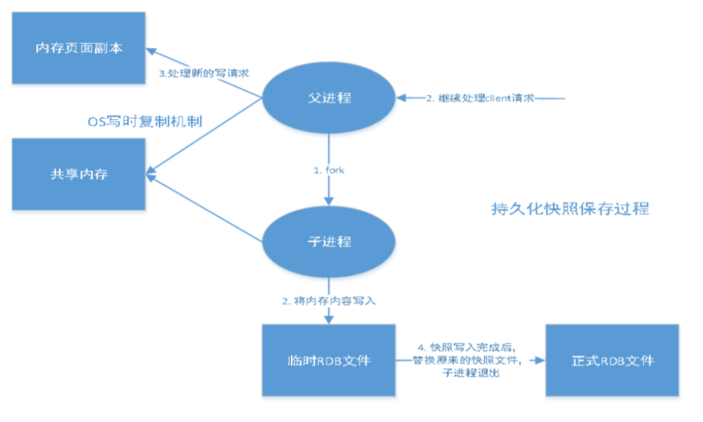

### 简单介绍一下Redis

简单来说，**redis就是一个使用C语言开发的数据库**，不过与传统数据库不同的是**redis的数据是存储在内存中的**，也就是说他是内存数据库，所以读写速度很快，因此redis被广泛应用于缓存方向

另外，**redis除了做缓存以外，也经常用来做分布式锁，甚至是消息队列**

**redis提供了多种数据类型来支持不同的业务场景，redis还支持事务、持久化、Lua脚本，多种集群方案**

> VMware公司开发


### 分布式缓存常见的技术选型方案有哪些？

分布式缓存的话，使用的比较多的主要是Memecached和Redis，不过现在基本没有看过还有项目使用Memecached来做缓存，都是直接用Redis

Memecached是分布式缓存最开始兴起的那会，比较常用的，后来，随着Redis的发展，大家都慢慢转而使用更加强大的Redis了

**分布式缓存主要解决的是单机缓存的容量受到服务器限制，并且无法保存通用信息的问题**，因为本地缓存只在当前服务中有效，比如你如果部署了两个相同的服务，它们两者之间的缓存数据是无法共用的

> **<font color=red>那么redis和memecached的异同点是什么呢？</font>**

两者的共同点：

- 两者都是基于内存的数据库，一般都被当作缓存来使用
- 都有过期策略
- 两者的性能都非常高

两者的不同点：

- **redis支持更丰富的数据类型，这也就意味着redis能够支持更复杂的应用场景**，redis不仅仅支持简单的key/value类型的数据，同时还提供list，set，zset，hash等数据结构的存储，而memecached只支持最简单的k/v类型数据
- **redis支持数据的持久化，可以将内存中的数据保存在磁盘中，重启的时候可以再次加载使用，而memecache把数据全部保存到内存中**
- **redis有灾难恢复机制，因为redis可以把缓存中的数据持久化到磁盘中**

- **redis在服务器内存使用完之后，可以将不用的数据放到磁盘上，而memecache在服务器内存使用完之后，就会直接报异常**
- **memecache没有原生的集群模式，需要依靠客户端来实现往集群中分片写入数据，而redis目前是原生支持cluster模式的**

- **memecache是多线程，非阻塞IO复用的网络模型，redis使用单线程的多路IO复用模型**（redis 6.0中引入了多线程IO）
- **redis支持事务、Lua脚本、订阅模型等功能，但是memecache不支持，并且redis支持更多的编程语言**
- **redis同时使用了惰性删除和定期删除，memecache过期数据的删除策略只用了惰性删除**


### 缓存数据的处理流程


- 当用户发起请求之后，先看缓存中是否有数据
- 如果缓存中有数据的话，就直接返回该数据
- 如果缓存中没有数据，那么就去数据库中查询该数据时候存在
- 如果在数据库中能够找到对应的数据，那么先更新缓存，然后再返回数据，如果数据库中找不到，那么就直接返回空数据


### 为什么要用redis/为什么要用缓存


**简单的来说，使用缓存的目的就是提高用户体验和应对更多的用户**

> 这里设想一个场景，假如用户第一次访问数据库中的某些数据的话，这个过程是比较慢的，毕竟是从硬盘中读取，但是，如果说，用户访问的数据数据高频数据而且不会经常改变的话，那么我们就可以很放心的将该用户访问的数据存放到缓存中

- **高性能**，通过上面那样做，我们能够保证用户下一次访问这些数据的时候可以直接从缓存中获取，操作缓存就是直接操作内存，所以速度是很快的

- **高并发，**一般像MySQL这类的数据库的QPS大概都在1w左右（4核8g），使用redis缓存之后QPS很容易就能够达到10w+，甚至最高能够达到30w+（这是redis单机情况下，集群情况下QPS会更高）

  > QPS(Query pre Second)：服务器每秒执行的查询数量

  由此可见，直接操作缓存能够承受的数据库请求数量是远远大于直接访问数据库的，所以我们可以考虑把数据库中的部分数据转移到缓存中去的，这样用户的一部分请求会直接到缓存中而不需要访问数据库，进而我们也就提高了系统整体的并发

<font color=red>不过，要保持数据库和缓存中的数据的一致性。 如果数据库中的对应数据改变的之后，同步改变缓存中相应的数据即可！</font>


### Redis除了做缓存之外，还能做什么？

- **分布式锁** ： 通过 Redis 来做分布式锁是一种比较常见的方式。通常情况下，我们都是基于 Redisson 来实现分布式锁。相关阅读：[《分布式锁中的王者方案 - Redisson》](https://gitee.com/link?target=https%3A%2F%2Fmp.weixin.qq.com%2Fs%2FCbnPRfvq4m1sqo2uKI6qQw)。
- **限流** ：一般是通过 Redis + Lua 脚本的方式来实现限流。相关阅读：[《我司用了 6 年的 Redis 分布式限流器，可以说是非常厉害了！》](https://gitee.com/link?target=https%3A%2F%2Fmp.weixin.qq.com%2Fs%2FkyFAWH3mVNJvurQDt4vchA)。
- **消息队列** ：Redis 自带的 list 数据结构可以作为一个简单的队列使用。Redis5.0 中增加的 Stream 类型的数据结构更加适合用来做消息队列。它比较类似于 Kafka，有主题和消费组的概念，支持消息持久化以及 ACK 机制。
- **复杂业务场景** ：通过 Redis 以及 Redis 扩展（比如 Redisson）提供的数据结构，我们可以很方便地完成很多复杂的业务场景比如通过 bitmap 统计活跃用户、通过 sorted set 维护排行榜。


### redis常见的数据结构以及应用场景

#### String

1. **介绍：**String数据结构是简单的key-value类型，虽然redis是用c语言写的，但是redis并没有使用C的字符串表示，而是自己构建了一种**简单动态字符串（simple dynamic string，SDS）**，相对于C的原生字符串，redis的SDS不光可以保存文本数据，还可以保存二进制数据，并且获取字符串长度的时间复杂度是O(1)，除此之外，redis的SDS API是安全的，不会造成缓冲区溢出
2. **常用命令：**`set,get,strlen,exists,decr,incr,setex`等
3. **应用场景：**一般常用在需要计数的场景中，比如用户的访问次数，热点文章的点赞转发数量等


> 普通字符串的基本操作

```shell
127.0.0.1:6379> set key value #设置 key-value 类型的值
OK
127.0.0.1:6379> get key # 根据 key 获得对应的 value
"value"
127.0.0.1:6379> exists key  # 判断某个 key 是否存在
(integer) 1
127.0.0.1:6379> strlen key # 返回 key 所储存的字符串值的长度。
(integer) 5
127.0.0.1:6379> del key # 删除某个 key 对应的值
(integer) 1
127.0.0.1:6379> get key
(nil)
```


> 批量操作

```shell
127.0.0.1:6379> mset key1 value1 key2 value2 # 批量设置 key-value 类型的值
OK
127.0.0.1:6379> mget key1 key2 # 批量获取多个 key 对应的 value
1) "value1"
2) "value2"
```


> 计数器（字符串的内容为整数的时候可以使用）

```shell
127.0.0.1:6379> set number 1
OK
127.0.0.1:6379> incr number # 将 key 中储存的数字值增一
(integer) 2
127.0.0.1:6379> get number
"2"
127.0.0.1:6379> decr number # 将 key 中储存的数字值减一
(integer) 1
127.0.0.1:6379> get number
"1"
```


> 过期，默认永不过期

```shell
127.0.0.1:6379> expire key  60 # 数据在 60s 后过期
(integer) 1
127.0.0.1:6379> setex key 60 value # 数据在 60s 后过期 (setex:[set] + [ex]pire)
OK
127.0.0.1:6379> ttl key # 查看数据还有多久过期
(integer) 56
```


#### list

1. **介绍：**list即是链表，链表是一种非常常见的数据结构，特点是易于数据元素的插入和删除，并且可以灵活的调整链表长度，但是链表的随机访问困难，许多编程语言都内置了链表的实现，比如Java中的LinkedList，但是C语言中没有内置链表，所以redis实现了自己的链表数据结构，**redis的list实现为一个双向链表**，可以支持反向查找和遍历，更方便操作，但是带来了部分的额外内存开销
2. **常用命令：**`rpush,lpop,lpush,rpop,lrange,llen`等
3. **应用场景：**发布与订阅或者说是消息队列、慢查询等


> 通过rpush和lpop实现队列

```shell
127.0.0.1:6379> rpush myList value1 # 向 list 的头部（右边）添加元素
(integer) 1
127.0.0.1:6379> rpush myList value2 value3 # 向list的头部（最右边）添加多个元素
(integer) 3
127.0.0.1:6379> lpop myList # 将 list的尾部(最左边)元素取出
"value1"
127.0.0.1:6379> lrange myList 0 1 # 查看对应下标的list列表， 0 为 start,1为 end
1) "value2"
2) "value3"
127.0.0.1:6379> lrange myList 0 -1 # 查看列表中的所有元素，-1表示倒数第一
1) "value2"
2) "value3"
```


> 通过rpush和rpop实现栈

```shell
127.0.0.1:6379> rpush myList2 value1 value2 value3
(integer) 3
127.0.0.1:6379> rpop myList2 # 将 list的头部(最右边)元素取出
"value3"
```


> **通过lrange查看对应下标范围的列表元素**

```shell
127.0.0.1:6379> rpush myList value1 value2 value3
(integer) 3
127.0.0.1:6379> lrange myList 0 1 # 查看对应下标的list列表， 0 为 start,1为 end
1) "value1"
2) "value2"
127.0.0.1:6379> lrange myList 0 -1 # 查看列表中的所有元素，-1表示倒数第一
1) "value1"
2) "value2"
3) "value3"
```

<font color=red>通过lrange命令，可以基于list实现分页查询，性能非常高</font>


>通过llen查看链表长度

```shell
127.0.0.1:6379> llen myList
(integer) 3
```


#### hash

1. **介绍：**hash类似于JDK1.8前的HashMap，内部实现也差不多，都是数组+链表，不过redis对hash做了更多的优化，另外，hash是一个String类型的field和value的映射表，**特别适用用于存储对象**，后续操作的时候，你可以直接仅仅修改这个对象中的某个字段的值，比如我们可以使用hash数据结构来存储用户信息，商品信息等
2. **常用命令：** `hset,hmset,hexists,hget,hgetall,hkeys,hvals` 等。
3. **应用场景：**系统中对象数据的存储等

```shell
127.0.0.1:6379> hmset userInfoKey name "guide" description "dev" age "24"
OK
127.0.0.1:6379> hexists userInfoKey name # 查看 key 对应的 value中指定的字段是否存在。
(integer) 1
127.0.0.1:6379> hget userInfoKey name # 获取存储在哈希表中指定字段的值。
"guide"
127.0.0.1:6379> hget userInfoKey age
"24"
127.0.0.1:6379> hgetall userInfoKey # 获取在哈希表中指定 key 的所有字段和值
1) "name"
2) "guide"
3) "description"
4) "dev"
5) "age"
6) "24"
127.0.0.1:6379> hkeys userInfoKey # 获取 key 列表
1) "name"
2) "description"
3) "age"
127.0.0.1:6379> hvals userInfoKey # 获取 value 列表
1) "guide"
2) "dev"
3) "24"
127.0.0.1:6379> hset userInfoKey name "GuideGeGe" # 修改某个字段对应的值
127.0.0.1:6379> hget userInfoKey name
"GuideGeGe"
```


#### set

1. **介绍：**set类似于Java中的HashSet，redis中的set类型是一种无序集合，集合中的元素没有先后顺序，当你需要存储一个列表数据，又不想要出现重复数据的时候，set是一个比较好的选择，并且set提供了判断一个数据元素是否在set集合中的重要接口，这个也是list所没有提供的，可以基于set轻易实现并集、交集、差集的操作，比如：你可以将一个用户所有的关注人存在一个集合中，将其所有粉丝存在一个集合中，redis可以很方便的实现如共同关注、共同粉丝、共同喜好等功能，这个过程也就是求交集的过程
2. **常用命令：**`sadd,spop,smembers,sismember,scard,sinterstore,sunion` 等。
3. **应用场景：**需要存放的数据不能重复以及需要获取多个数据源交集和并集等场景

```shell
127.0.0.1:6379> sadd mySet value1 value2 # 添加元素进去
(integer) 2
127.0.0.1:6379> sadd mySet value1 # 不允许有重复元素
(integer) 0
127.0.0.1:6379> smembers mySet # 查看 set 中所有的元素
1) "value1"
2) "value2"
127.0.0.1:6379> scard mySet # 查看 set 的长度
(integer) 2
127.0.0.1:6379> sismember mySet value1 # 检查某个元素是否存在set 中，只能接收单个元素
(integer) 1
127.0.0.1:6379> sadd mySet2 value2 value3
(integer) 2
127.0.0.1:6379> sinterstore mySet3 mySet mySet2 # 获取 mySet 和 mySet2 的交集并存放在 mySet3 中
(integer) 1
127.0.0.1:6379> smembers mySet3
1) "value2"
```


#### zset（sorted set）

1. **介绍：**和set相比，zset中增加了一个权重参数score，使得集合中的元素能够按照score进行有序排列，还可以通过score的范围来获取元素列表，有点像是Java中HashMap和TreeSet的结合体
2. **常用命令：**`zadd,zcard,zscore,zrange,zrevrange,zrem` 等。
3. **应用场景：**需要对数据根据某个权重来进行排序的场景，比如在直播系统中，实时排行信息包含直播间在线用户列表，各种礼物排行榜，弹幕消息（可以理解为按消息维度的消息排行榜）等信息

```shell
127.0.0.1:6379> zadd myZset 3.0 value1 # 添加元素到 sorted set 中 3.0 为权重
(integer) 1
127.0.0.1:6379> zadd myZset 2.0 value2 1.0 value3 # 一次添加多个元素
(integer) 2
127.0.0.1:6379> zcard myZset # 查看 sorted set 中的元素数量
(integer) 3
127.0.0.1:6379> zscore myZset value1 # 查看某个 value 的权重
"3"
127.0.0.1:6379> zrange  myZset 0 -1 # 顺序输出某个范围区间的元素，0 -1 表示输出所有元素
1) "value3"
2) "value2"
3) "value1"
127.0.0.1:6379> zrange  myZset 0 1 # 顺序输出某个范围区间的元素，0 为 start  1 为 stop
1) "value3"
2) "value2"
127.0.0.1:6379> zrevrange  myZset 0 1 # 逆序输出某个范围区间的元素，0 为 start  1 为 stop
1) "value1"
2) "value2"
```


==除了上面这5中基本数据类型，redis中还提供了三种特殊数据类型，分别是Geospatial（表示地理位置），Hyperloglog（基数统计），bitmap（位图）==

我们下面说一下位图

#### bitmap

1. 介绍：bitmap存储的是连续的二进制数字（0和1），通过bitmap，只需要一个bit位来表示某个元素的值或者状态，key就是对应元素本身，我们知道8个bit可以组成1个字节，所以bitmap本身会极大的节省存储空间
2. 常用命令： `setbit` 、`getbit` 、`bitcount`、`bitop`
3. 应用场景：适合需要保存状态的信息（比如是否签到，是否登录...）并需要进一步对这些信息进行分析的场景，比如用户签到情况、活跃用户情况、用户行为统计（比如是否点赞过某个视频）

```shell
# SETBIT 会返回之前位的值（默认是 0）这里会生成 7 个位
127.0.0.1:6379> setbit mykey 7 1
(integer) 0
127.0.0.1:6379> setbit mykey 7 0
(integer) 1
127.0.0.1:6379> getbit mykey 7
(integer) 0
127.0.0.1:6379> setbit mykey 6 1
(integer) 0
127.0.0.1:6379> setbit mykey 8 1
(integer) 0
# 通过 bitcount 统计被被设置为 1 的位的数量。
127.0.0.1:6379> bitcount mykey
(integer) 2
```


> **使用场景一：用户行为分析**

很多网站为了分析用户的喜好，通常会研究用户点赞过的东西

```shell
# 记录你喜欢过 001 号小姐姐
setbit beauty_girl_001 uid 1
```


> **使用场景二：统计活跃用户**

使用时间作为 key，然后用户 ID 为 offset，如果当日活跃过就设置为 1

那么我该如何计算某几天/月/年的活跃用户呢(暂且约定，统计时间内只要有一天在线就称为活跃)，有请下一个 redis 的命令

```shell
# 对一个或多个保存二进制位的字符串 key 进行位元操作，并将结果保存到 destkey 上。
# BITOP 命令支持 AND 、 OR 、 NOT 、 XOR 这四种操作中的任意一种参数
BITOP operation destkey key [key ...]
```

初始化数据：

```shell
127.0.0.1:6379> setbit 20210308 1 1
(integer) 0
127.0.0.1:6379> setbit 20210308 2 1
(integer) 0
127.0.0.1:6379> setbit 20210309 1 1
(integer) 0
```

统计 20210308~20210309 这两天都活跃的用户数: 1

```shell
127.0.0.1:6379> bitop and desk1 20210308 20210309
(integer) 1
127.0.0.1:6379> bitcount desk1
(integer) 1
```

统计 20210308~20210309 在线活跃用户数: 2

```shell
127.0.0.1:6379> bitop or desk2 20210308 20210309
(integer) 1
127.0.0.1:6379> bitcount desk2
(integer) 2
```


> **使用场景三：用户在线状态**

对于获取或者统计用户的在线状态，使用bitmap是一个节约空间且效率很高的方法，只需要一个key，然后用户ID为offset，如果在线就设置成1，不在线就设置成0


### redis单线程模型详解

**redis基于Reactor模式来设计开发了自己的网络事件处理器**，这个处理器被称为文件事件处理器（file event handler），文件事件处理器使用**I/O多路复用**程序来同时监听多个套接字，并根据套接字目前执行的任务来为套接字关联不同的事件处理器

当被监听的套接字准备好执行连接应答（accept），读取（read），写入（write），关闭（close）等操作的时候，与操作相对应的文件事件就会产生，这时文件处理器就会调用套接字之前关联好的事件处理器来处理这些事件


因此，虽然redis是单线程模型，但是它能够通过I/O多路复用来同时监听多个socket（或是来自客户端的大量连接），它会将感兴趣的事件及类型（读、写）注册到内核中并监听每个事件是否发生

这样的好处非常明显：**I/O多路复用技术的使用使redis不需要额外创建多余的线程来监听客户端的大量连接，降低了资源的消耗**


### 为什么redis是单线程还这么快，而且还支持高并发

首先，**<font color=red>我们要意识到redis server是多线程的，只是它的请求处理整个流程是单线程处理的，</font>**redis Server本身是多线程的，除了请求处理流程是单线程处理之外，Redis内部还有其他工作线程在后台执行，它负责异步执行某些比较耗时的任务，例如AOF每秒刷盘、AOF文件重写都是在另一个线程中完成的。

redis之所以速度快的主要原因在于它是**纯内存操作，**正如redis官方说的那样，cpu不是redis的瓶颈，redis的瓶颈很可能是机器内存的大小和网络带宽，因为CPU不是瓶颈，而且单线程容易实现和维护的同时又避免了多线程之间的上下文切换带来的时间和资源消耗，所以redis的速度非常快

redis是单线程模型但是支持高并发的原因在于它是基于Reactor这个高性能的网络模式的，更具体一点是Redis中采用了I/O多路复用技术，即使用一个线程能够同时监听多个客户端的请求（或是多个socket），保证在监听多个socket连接的情况下，只针对有活动的socket采取反应。

上面我们说到了redis的瓶颈不是cpu，而是内存和网络带宽，因此在高并发的情况下，很容易就会造成服务器内存不够用和网络延迟等待的情况，当单个redis实例的性能不足以支撑业务的时候，ridis官方推荐的就是部署多个redis节点，创建redis集群来利用多核CPU的能力，而不是在单个实例上使用多线程来实现


>[为什么Redis单线程还这么快？ | Kaito's Blog (kaito-kidd.com)](http://kaito-kidd.com/2020/06/28/why-redis-so-fast/)


### redis6.0之后引入了多线程

**<font color=red>单线程的最大缺点是如果前一个请求发生耗时比较久的操作，那么整个redis就会阻塞住，其他请求也无法进来，直到这个耗时久的操作处理完成并返回，其他请求才能够被处理到</font>**

事实上，在redis4.0之后，redis中便引入了`lazyfree`的机制，提供了`unlink`、`flushall aysc`、`flushdb async`等命令和`lazyfree-lazy-eviction`、`lazyfree-lazy-expire`等机制来异步释放内存，它主要是为了解决在释放大内存数据的时候导致整个redis阻塞的性能问题。在删除大key的时候，释放内存往往是比较耗时的，所以redis提供一部释放内存的方式，让这些耗时的操作放到另一个线程中线程中异步去处理，从而不影响主线程的执行、提高性能

到了redis6.0，redis又引入了多线程来完成请求数据的协议解析，进一步提升性能，他主要是解决在高并发场景下，单线程解析请求数据协议带来的压力，请求数据的协议解析由多线程完成之后，后面的请求处理阶段仍然是由单线程排队来完成

Redis6.0 的多线程默认是禁用的，只使用主线程。如需开启需要修改 redis 配置文件 `redis.conf` ：

```
io-threads-do-reads yes
```

开启多线程后，还需要设置线程数，否则是不生效的。同样需要修改 redis 配置文件 `redis.conf` :

```
io-threads 4 #官网建议4核的机器建议设置为2或3个线程，8核的建议设置为6个线程
```


### redis给缓存数据设置过期时间有啥用

因为内存的空间大小是有限的，如果缓存中的所有数据都是一直保存的话，很容易就会`out of memory`

redis自带了给缓存数据设置过期时间的功能，比如

```shell
127.0.0.1:6379> exp key 60 # 数据在 60s 后过期
(integer) 1
127.0.0.1:6379> setex key 60 value # 数据在 60s 后过期 (setex:[set] + [ex]pire)
OK
127.0.0.1:6379> ttl key # 查看数据还有多久过期
(integer) 56
```

注意，在redis中除了字符串中有`setex`命令设置过期时间之外，其他的类型都必须依靠`expire`命令来设置过期时间，另外，`persist`可以移除一个键的过期时间

> 过期时间除了能够缓解内存的消耗之外，还有什么其他用处吗

很多时候，我们的业务场景就是需要某个数据只在某一个时间段内存在，比如验证码只在3分钟内有效，用户登录的token可能只在1天内有效

如果使用传统的数据库来处理的话，一般都是要自己判断过期，这样更麻烦而且性能要差很多


### redis是如何判断数据是否过期的呢？

redis通过一个叫做**过期字典**（可以看作hash表）来保存数据过期的时间，过期字典的键指向Redis数据库中的某个key（键），过期字典的值是一个long long类型的整数，这个整数保存了key所指向的数据库键的过期时间（毫秒精度的UNIX时间戳）


过期字典是存储在redisDb这个结构中的

```c
typedef struct redisDb {
    ...

    dict *dict;     //数据库键空间,保存着数据库中所有键值对
    dict *expires   // 过期字典,保存着键的过期时间
    ...
} redisDb;
```


### 过期数据的删除策略

常用的过期数据的删除策略就两个

- **惰性删除：**只有取出key的时候才会对数据进行过期检查，这样对CPU最友好，但是可能会造成太多过期的key没有删除
- **定期删除：**每隔一段时间抽取一批key执行删除过期key操作，并且，redis底层会通过限制删除操作的执行的时长和频率来减少删除操作对CPU时间的影响

从上面两个删除方式的不同可以看出，惰性删除对CPU更加友好，定期删除对内存更加友好，两者各有千秋，所以redis采用的是**定期删除+惰性/懒汉式删除**

但是仅仅通过给key设置过期时间还是有问题的，因为还是可能存在定期删除和惰性删除漏掉了很多过期key的情况，这样就会导致大量过期的key堆积在内存中，然后就导致out of memory了

要怎么样解决这个问题呢？答案就是**Redis内存淘汰机制**

> 相关问题：MySQL中有2000W条数据，redis中有20w数据，怎么保证redis数据库中的这20w的数据都是热点数据？

redis中提供了6种数据淘汰策略：

1. **volatile-lru（least recently used）**：从已设置过期时间的数据集中挑选最近最少使用的数据淘汰
2. **volatile-ttl：**从已设置过期时间的数据集中挑选将要过期的数据淘汰
3. **volatile-random：**从已设置过期时间的数据集中任意选择数据淘汰
4. **allkeys-lru：**当内存不足以容纳新写入的数据时，在键空间中，移除最近最少使用的key（这个是最常用的）
5. **allkeys-random：**从数据集中任意选出一个数据淘汰
6. **no-eviction：**禁止驱逐数据，也就是说当内存不足以写入新数据的时候，新写入操作会报错，这种策略应该没人使用

redis4.0之后又新加入了两种策略：

7. **volatile-lfu（least frequent use）**：从已设置过期时间的数据集中挑选出最不经常使用的数据淘汰
8. **allkeys-lfu：**当内存不足以容纳新写入数据时，在键空间中，移除最不经常使用的 key


### redis的持久化机制

所谓的持久化数据就是将内存中的数据持久化到硬盘中，大部分的原因就是为了之后的重用数据（比如重启机器、机器宕机之后恢复数据），或者是为了防止机器故障，将数据备份到一个远程位置

redis不同于memecache的重要一点就是redis支持持久化，而且redis还支持两种持久化的方式：**RDB（快照）和AOF（append-only file）只追加文件。**

#### RDB

redis可以通过**创建快照来获取存储在内存中的数据在某个时间点上的副本**，redis创建快照之后，可以对快照进行备份，可以将快照复制到其他服务器从而创建具有相同数据的数据库副本（redis主从结构，主要用来提高redis性能），还可以将快照留在原地以便重启服务器的时候使用（恢复的时候会直接将快照读取到内存中）

**RDB（快照持久化）是redis的默认持久化方式**，在`redis.conf`配置文件中默认有以下配置

```properties
save 900 1           #在900秒(15分钟)之后，如果至少有1个key发生变化，Redis就会自动触发BGSAVE命令创建快照。

save 300 10          #在300秒(5分钟)之后，如果至少有10个key发生变化，Redis就会自动触发BGSAVE命令创建快照。

save 60 10000        #在60秒(1分钟)之后，如果至少有10000个key发生变化，Redis就会自动触发BGSAVE命令创建快照。
```




从上图中可以看出，**redis会单独fork一个子进程来进行持久化，**会先将数据写入到一个临时文件中，待持久化过程都结束了，在用这个临时文件替换上一次持久化好的文件，**整个过程中主进程是不进行任何IO操作的，**这就确保了redis的高性能。如果需要进行大规模数据的恢复，且对数据恢复的完整性不是特别敏感，那么RDB是要比AOF更加高效的，**RDB的缺点是最后一次持久化后的数据可能丢失。**

> RDB的触发机制

1. 满足配置文件中的save条件
2. 执行FLUSHALL命令
3. 退出redis也会触发rdb


#### AOF

与RDB相比，AOF的实时性更好，默认情况下redis没有开启AOF，我们可以在配置文件中通过`appendonly`参数开启

```properties
appendonly yes
```

开启AOF持久化之后每执行一条会更改Redis中的数据的命令，redis就会将该数据写入内存缓存中`server.aof_buf`中，然后再根据`appendfsync`配置来决定何时将其同步到硬盘中的AOF文件

AOF文件的保存位置和RDB文件的位置相同，都是通过dir参数设置的，默认的文件名是`appendonly.aof`

在redis配置文件中存在三种不同的AOF持久化方式，它们分别是：

```properties
appendfsync always		# 每次有数据修改发生时都会写入AOF文件，但是这样会严重降低redis的性能
appendfsync eveysec		# 每秒同步一次，显示地将多个命令写到硬盘中
appendfsync no			# 让操作系统决定何时同步
```

为了兼顾数据和写入性能，用户可以考虑`appendfsync eveysec`选项，让redis每秒钟同步一次AOF文件，redis性能几乎没有受到影响，而且这样即使出现系统崩溃，用户最多只会丢失一秒之内产生的数据，当硬盘忙于执行写入操作的时候，redis还会优雅的放慢自己速度以适应硬盘的最大写入速度


同时，AOF中还存在重写**（AOF重写）**

AOF重写可以产生一个新的AOF文件，这个新的AOF文件和旧的AOF文件所保存的数据库状态一样，但是体积更小

AOF重写是一个有**歧义**的名字，因为在重写的过程中redis并**不会对现有的AOF文件进行任何的读入、分析或者写入操作，AOF重写这个功能通过读取数据库中的键值对来实现的**，这个新文件中通常不会包含任何浪费空间的冗余命令，比如使用一条命令代替多条命令，比如 `set k1 v1 set k2 v2 `可以替换成` mset k1 v1 k2 v2` 即将启动AOF文件的内容压缩，只保留可以恢复数据的最小指令	


在执行 BGREWRITEAOF 命令时，Redis 服务器会维护一个 **AOF 重写缓冲区，该缓冲区会在子进程创建新 AOF 文件期间，记录服务器执行的所有写命令。**当子进程完成创建新 AOF 文件的工作之后，服务器会将重写缓冲区中的所有内容追加到新 AOF 文件的末尾，使得新的 AOF 文件保存的数据库状态与现有的数据库状态一致。最后，服务器用新的 AOF 文件替换旧的 AOF 文件，以此来完成 AOF 文件重写操作。


> **拓展：Redis 4.0 对于持久化机制的优化**
>
> Redis 4.0 开始支持 RDB 和 AOF 的混合持久化（默认关闭，可以通过配置项 `aof-use-rdb-preamble` 开启）。
>
> 如果把混合持久化打开，AOF 重写的时候就直接把 RDB 的内容写到 AOF 文件开头。这样做的好处是可以结合 RDB 和 AOF 的优点, 快速加载同时避免丢失过多的数据。当然缺点也是有的， AOF 里面的 RDB 部分是压缩格式不再是 AOF 格式，可读性较差。
>
> **拓展2：如果redis仅仅是用来做缓存，只希望数据在服务器运行时存在，那么我们可以不使用持久化**
>
> **拓展3：如果rdb和aof文件都有错误，那么redis是启动不起来的，因此redis提供了两个修复工具来分别修复aof和rdb文件，修复工具的原理就是删除出错的命令，因此也会造成部分数据丢失**
>
> 


#### RDB和AOF的区别

- RDB持久化能够在指定时间间隔内对数据库的数据进行快照存储，因此RDB可能会丢失最后一次修改的数据，而AOF持久化方式可以通过设置参数记录下每条能够改变数据库数据的命令，当服务器重启时，会重新执行这些命令来恢复数据
- 如果同时开启了RDB和AOF两种持久化方式：当redis重启的时候会优先载入AOF文件来恢复数据，因为AOF文件中保存的数据集要比RDB文件保存的数据集更加完整，而且RDB不是实时的。上面的意思并不是建议只使用AOF，因为AOF在不断变化是不好备份的，RDB更适合数据库备份。


### redis事务

redis可以通过`MULTI`,`EXEC`,`DISCARD`,`WATCH`等命令来实现事务的功能

使用`MULTI`命令之后可以输入多个命令，redis不会立即执行这些命令，而是将他们放在队列中，当调用了`EXEC`命令将执行所有的命令，这个过程是这样的：

- 开始事务`MULTI`
- 命令入队（批量操作redis命令，先进先出FIFO的顺序执行）
- 执行事务`EXEC`

```shell
> MULTI
OK
> SET USER "Guide哥"
QUEUED
> GET USER
QUEUED
> EXEC
1) OK
2) "Guide哥"
```

还可以通过`DISCARD`取消一个事务，他会清空事务队列中保存的所有命令

```shell
> MULTI
OK
> SET USER "Guide哥"
QUEUED
> GET USER
QUEUED
> DISCARD
OK
```

`WATCH`命令用于监听指定的键，当调用`EXEC`命令执行事务时，如果一个被`WATCH`命令监听的键被修改的话，整个事务都不会执行，直接返回失败

```shell
> WATCH USER
OK
> MULTI
> SET USER "Guide哥"
OK
> GET USER
Guide哥
> EXEC
ERR EXEC without MULTI
```

但是，Redis 的事务和我们平时理解的关系型数据库的事务不同。我们知道事务具有四大特性： **1. 原子性**，**2. 隔离性**，**3. 持久性**，**4. 一致性**。

1. **原子性（Atomicity）：** 事务是最小的执行单位，不允许分割。事务的原子性确保动作要么全部完成，要么完全不起作用；
2. **隔离性（Isolation）：** 并发访问数据库时，一个用户的事务不被其他事务所干扰，各并发事务之间数据库是独立的；
3. **持久性（Durability）：** 一个事务被提交之后。它对数据库中数据的改变是持久的，即使数据库发生故障也不应该对其有任何影响。
4. **一致性（Consistency）：** 执行事务前后，数据保持一致，多个事务对同一个数据读取的结果是相同的；

**<font color=red>Redis 是不支持 roll back 的，因而不满足原子性的（而且不满足持久性）。</font>**

> 关于redis事务不满足原子性的问题

我们知道，事务发生错误无非就是两个原因：一是语法错误，二是运行时错误

- 当发生语法错误时（命令本身拼写错误，输入了一个不存在的命令也都属于语法错误），

  

  从上图中可以看出，只要事务中的一条命令有语法错误，则执行`exec`后就会直接返回错误，包括语法正确的命令在内的所有命令都不会被执行

- 当发生运行时错误的时候，运行时错误指的是输入的指令格式正确，但是命令执行期间出现的错误，典型场景是输入参数的数据类型不符合命令的参数要求时，就会发生运行时错误，例如下面的例子中，对String类型的key执行list类型的操作

  

  可以看到，当发生运行时错误的时候，除了发生错误的那条指令会报错之外，事务中的其他指令会被执行

**总结一下**

- 当发生语法错误的时候，同一个事务中的其他命令都不会执行
- 当发生运行时错误的时候，只有发生错误的那条命令不会被执行


> 上面我们说到，redis事务不具备原子性，同时他也不支持rollback回滚，redis不支持回滚的原因是？

官方文档中的解释大概如下：

- redis命令失败只会发生在语法错误或者数据类型错误的情况，这一结果都是由编程过程中的错误导致的，这种情况应该在开发环境中检测出来，而不是生产环境
- 回滚的实现很复杂，不使用回滚能让redis内部设计更加简单，速度更快
- 回滚不能避免编程逻辑中的错误，如果想要一个键的值增加2却增加了1，这种情况即使提供了回滚也没办法提供帮助


### 缓存穿透

> 什么是缓存穿透

缓存穿透说简单点就是大量请求的key根本不在缓存中，导致**请求直接到了数据库上，根本没有经过缓存这一层**，举个例子：某个黑客故意制造我们缓存中不存在的key发起大量请求，导致大量请求落在数据库上

> 缓存穿透的处理流程是什么样的呢？


如上图所示，用户的请求最终都要跑到数据库中查询一遍


> 有哪些解决办法？

首先最基本的就是**做好参数校验**，一些不合法的参数请求直接抛出异常信息返回给客户端，比如查询的数据库id不能小于0，传入的邮箱格式不对的时候直接返回错误信息给客户端等

第二就是**缓存无效的key**，如果缓存和数据库中都查不到这个key的话，我们就把这个key写入到redis中并设置一个过期时间，具体命令如下：`SET KEY VALUE EX 10086`，这种方式可以解决key变化不频繁的情况，如果受到黑客攻击，每次构建不同的key，会导致redis中缓存大量的无效key，显然，这种方法无法从根本上解决此问题，如果非要使用这种方式来解决穿透问题的话，尽量将无效的过期时间设置的短一点

第三是使用**布隆过滤器**，通过布隆过滤器我们能够很方便的判断一个给定的数据是否存在海量的数据中，我们判断key是否合法，就是要先在布隆过滤器中找到我们想要找的那个key

具体的做法是这样的：把所有可能存在的请求的值都放在布隆过滤器中，当用户的请求过来，先判断用户发来的请求的值是否在布隆过滤器中，不存在的话，直接返回请求参数错误信息给客户端，存在的话再去走下面的流程


但是需要注意的是，布隆过滤器存在误判的情况，总结来说就是：**布隆过滤器说某个元素存在，那么小概率存在误判，布隆过滤器说某个元素不存在，那么这个元素就一定不存在**

> 为什么会出现误判的情况呢? 我们还要从布隆过滤器的原理来说！

我们先来看一下，**当一个元素加入布隆过滤器中的时候，会进行哪些操作：**

1. 使用布隆过滤器中的哈希函数对元素值进行计算，得到哈希值（有几个哈希函数得到几个哈希值）。
2. 根据得到的哈希值，在位数组中把对应下标的值置为 1。

我们再来看一下，**当我们需要判断一个元素是否存在于布隆过滤器的时候，会进行哪些操作：**

1. 对给定元素再次进行相同的哈希计算；
2. 得到值之后判断位数组中的每个元素是否都为 1，如果值都为 1，那么说明这个值在布隆过滤器中，如果存在一个值不为 1，说明该元素不在布隆过滤器中。

然后，一定会出现这样一种情况：**不同的字符串可能哈希出来的位置相同。** （可以适当增加位数组大小或者调整我们的哈希函数来降低概率）


### 缓存雪崩

缓存雪崩描述的就是这样的一个场景：缓存在同一时间大面积失效，后面的请求直接落在数据库上，造成数据库短时间内承受大量请求

> 缓存雪崩出现的场景可能是：在某一个时刻系统的缓存模块出现问题，比如宕机导致不可用，造成系统的访问都需要经过数据库，还有一种场景：秒杀开始 12 个小时之前，我们统一存放了一批商品到 Redis 中，设置的缓存过期时间也是 12 个小时，那么秒杀开始的时候，这些秒杀的商品的访问直接就失效了。导致的情况就是，相应的请求直接就落到了数据库上，就像雪崩一样可怕。


上面的两个场景分别代表了两个方向，一个是redis服务不可用了，一个是缓存数据过期了，那么怎么样解决缓存雪崩呢？

- **针对redis服务不可用的情况**
  - 采用redis集群，避免单机出现问题导致整个缓存服务都没有办法使用
  - 限流，避免同时处理大量的请求
- **针对热点缓存失效的情况**
  - 缓存永不过期
  - 设置不同的失效时间比如随机设置缓存的失效时间


### 缓存击穿

缓存击穿指的是**高并发集中在一个点上进行访问**，也就是说一个key非常热门，在不停地扛着高并发，当这个key失效的瞬间，持续的大并发就击穿缓存，直接请求数据库，就像是在屏障上凿穿了一个洞

在缓存失效的瞬间，还可能会有大量线程去重建缓存，造成后端负载过大，甚至可能会让应用崩溃


> 解决方法

- **设置缓存永不过期**

  

  从上图中可以看出，虽然在缓存层面没有设置过期时间，但是在功能层面会为每个value设置一个逻辑过期时间，当发现超过逻辑过期时间之后，会使用单独的线程去更新缓存

- **分布式互斥锁**

  

  使用分布式锁保证对于每个key在同一时间只有一个线程去访问后端服务，其他线程等待获取分布式锁的权限，即只允许一个线程去重建缓存，其他线程等待重建缓存的线程完成之后，重新从缓存中获得数据


> 两种方式的对比

- 分布式互斥锁：这种方案思路比较简单，但是存在一定的隐患，如果在查询数据库和重建缓存（key失效 后进行了大量的计算）时间过长也可能会存在死锁和线程池阻塞的风险，高并发情况下吞吐量会大大降低，但是这种的方式能够很好的降低后端负载压力，而且在数据一致性方面表现很好 
- 永不过期：这种方案由于没有设置真正的过期时间，实际上已经不存在热点key产生的一系列危害，但是 会存在数据不一致的情况，同时代码复杂度会增大。


### 如何保证缓存和数据库数据的一致性

旁路缓存模式（Cache Aside Pattern）中遇到写请求是这样的：更新DB，然后直接删除cache

如果更新数据库成功，而删除缓存这一步失败的话，简单说一下这两个解决方案：

- **缓存失效时间变短（不推荐，治标不治本）：**我们让缓存数据的过期时间变短，这样的话缓存就会从数据库中加载数据，另外，这种解决办法对于先操作缓存后操作数据库的场景不适用
- **增加cache更新重试机制（常见）：**如果cache服务当前不可用导致缓存删除失败的话，我们就隔一段时间进行重试，重试的次数可以自己定，如果多次重试还是失败的话，我们可以把当前失败的key存入队列中，等缓存服务可用之后，再将缓存中对应的key删除即可


### Redis中的大key

- 首先Redis中的大key并不是指key的值很大，而是key对应的value很大，一般而言，存在着两种情况下被称为大key
  - String类型的值大于10KB
  - List、Hash、Set、ZSet类型的元素的个数超过5000
- 大key会造成哪些问题呢？
  - 客户端超时阻塞，操作大key时会比较耗时，容易阻塞
  - 引发网络阻塞，获取大key产生的网络流量较大
  - 造成内存分布不均，redis集群在slot分片均匀的情况下，会出现数据和查询倾斜的情况，部分有大key的节点占用内存多
- 如何查找大key呢？
  - `redis-cli --bigkeys`查找大key
  - 使用`SCAN`命令查找大key
  - 使用`RdbTools`工具查找大key
- 如何删除大key？
  - Redis4.0之后，可以使用`UNLINK`命令来安全的删除大key，该命令能够以非阻塞的方式，逐步清理传入的key，该命令与`DEL`的区别就是会将删除操作放到另外一个线程中执行
  - 分批次删除，比如当扫描出大key之后，可以根据类型分批删除


