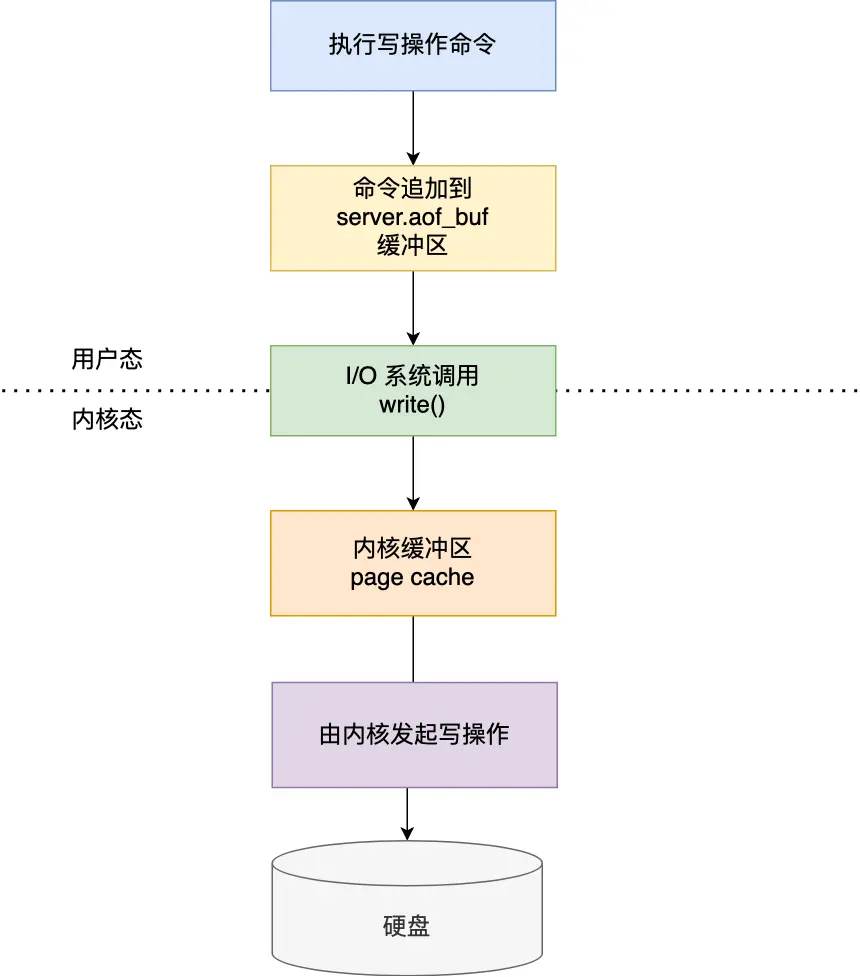

[toc]


### 简单介绍一下Redis

简单来说，**redis就是一个使用C语言开发的数据库**，不过与传统数据库不同的是**redis的数据是存储在内存中的**，也就是说他是内存数据库，所以读写速度很快，因此redis被广泛应用于缓存方向

另外，**redis除了做缓存以外，也经常用来做分布式锁，甚至是消息队列**

**redis提供了多种数据类型来支持不同的业务场景，redis还支持事务、持久化、Lua脚本，多种集群方案**

> VMware公司开发


### 分布式缓存常见的技术选型方案有哪些？

分布式缓存的话，使用的比较多的主要是Memecached和Redis，不过现在基本没有看过还有项目使用Memecached来做缓存，都是直接用Redis

Memecached是分布式缓存最开始兴起的那会，比较常用的，后来，随着Redis的发展，大家都慢慢转而使用更加强大的Redis了

**分布式缓存主要解决的是单机缓存的容量受到服务器限制，并且无法保存通用信息的问题**，因为本地缓存只在当前服务中有效，比如你如果部署了两个相同的服务，它们两者之间的缓存数据是无法共用的

> **<font color=red>那么redis和memecached的异同点是什么呢？</font>**

两者的共同点：

- 两者都是基于内存的数据库，一般都被当作缓存来使用
- 都有过期策略
- 两者的性能都非常高

两者的不同点：

- **redis支持更丰富的数据类型，这也就意味着redis能够支持更复杂的应用场景**，redis不仅仅支持简单的key/value类型的数据，同时还提供list，set，zset，hash等数据结构的存储，而memecached只支持最简单的k/v类型数据
- **redis支持数据的持久化，可以将内存中的数据保存在磁盘中，重启的时候可以再次加载使用，而memecache把数据全部保存到内存中**
- **redis有灾难恢复机制，因为redis可以把缓存中的数据持久化到磁盘中**

- **redis在服务器内存使用完之后，可以将不用的数据放到磁盘上，而memecache在服务器内存使用完之后，就会直接报异常**
- **memecache没有原生的集群模式，需要依靠客户端来实现往集群中分片写入数据，而redis目前是原生支持cluster模式的**

- **memecache是多线程，非阻塞IO复用的网络模型，redis使用单线程的多路IO复用模型**（redis 6.0中引入了多线程IO）
- **redis支持事务、Lua脚本、订阅模型等功能，但是memecache不支持，并且redis支持更多的编程语言**
- **redis同时使用了惰性删除和定期删除，memecache过期数据的删除策略只用了惰性删除**


### 缓存数据的处理流程


- 当用户发起请求之后，先看缓存中是否有数据
- 如果缓存中有数据的话，就直接返回该数据
- 如果缓存中没有数据，那么就去数据库中查询该数据时候存在
- 如果在数据库中能够找到对应的数据，那么先更新缓存，然后再返回数据，如果数据库中找不到，那么就直接返回空数据


### 为什么要用redis/为什么要用缓存


**简单的来说，使用缓存的目的就是提高用户体验和应对更多的用户**

> 这里设想一个场景，假如用户第一次访问数据库中的某些数据的话，这个过程是比较慢的，毕竟是从硬盘中读取，但是，如果说，用户访问的数据数据高频数据而且不会经常改变的话，那么我们就可以很放心的将该用户访问的数据存放到缓存中

- **高性能**，通过上面那样做，我们能够保证用户下一次访问这些数据的时候可以直接从缓存中获取，操作缓存就是直接操作内存，所以速度是很快的

- **高并发，**一般像MySQL这类的数据库的QPS大概都在1w左右（4核8g），使用redis缓存之后QPS很容易就能够达到10w+，甚至最高能够达到30w+（这是redis单机情况下，集群情况下QPS会更高）

  > QPS(Query pre Second)：服务器每秒执行的查询数量

  由此可见，直接操作缓存能够承受的数据库请求数量是远远大于直接访问数据库的，所以我们可以考虑把数据库中的部分数据转移到缓存中去的，这样用户的一部分请求会直接到缓存中而不需要访问数据库，进而我们也就提高了系统整体的并发

<font color=red>不过，要保持数据库和缓存中的数据的一致性。 如果数据库中的对应数据改变的之后，同步改变缓存中相应的数据即可！</font>


### Redis除了做缓存之外，还能做什么？

- **分布式锁** ： 通过 Redis 来做分布式锁是一种比较常见的方式。通常情况下，我们都是基于 Redisson 来实现分布式锁。相关阅读：[《分布式锁中的王者方案 - Redisson》](https://gitee.com/link?target=https%3A%2F%2Fmp.weixin.qq.com%2Fs%2FCbnPRfvq4m1sqo2uKI6qQw)。
- **限流** ：一般是通过 Redis + Lua 脚本的方式来实现限流。相关阅读：[《我司用了 6 年的 Redis 分布式限流器，可以说是非常厉害了！》](https://gitee.com/link?target=https%3A%2F%2Fmp.weixin.qq.com%2Fs%2FkyFAWH3mVNJvurQDt4vchA)。
- **消息队列** ：Redis 自带的 list 数据结构可以作为一个简单的队列使用。Redis5.0 中增加的 Stream 类型的数据结构更加适合用来做消息队列。它比较类似于 Kafka，有主题和消费组的概念，支持消息持久化以及 ACK 机制。
- **复杂业务场景** ：通过 Redis 以及 Redis 扩展（比如 Redisson）提供的数据结构，我们可以很方便地完成很多复杂的业务场景比如通过 bitmap 统计活跃用户、通过 sorted set 维护排行榜。


### redis常见的数据结构以及应用场景

#### String

1. **介绍：**String数据结构是简单的key-value类型，虽然redis是用c语言写的，但是redis并没有使用C的字符串表示，而是自己构建了一种**简单动态字符串（simple dynamic string，SDS）**，相对于C的原生字符串，redis的SDS不光可以保存文本数据，还可以保存二进制数据，并且获取字符串长度的时间复杂度是O(1)，除此之外，redis的SDS API是安全的，不会造成缓冲区溢出

2. **常用命令：**`set,get,strlen,exists,decr,incr,setex`等

3. **应用场景：**

   - **缓存对象**
     - 直接缓存整个对象的 JSON，命令例子： `SET user:1 '{"name":"xiaolin", "age":18}'`。
     - 采用将 key 进行分离为` user:ID:属性`，采用 MSET 存储，用 MGET 获取各属性值，命令例子： `MSET user:1:name xiaolin user:1:age 18 user:2:name xiaomei user:2:age 20`

   - **常规计数：**比如用户的访问次数，热点文章的点赞转发数量等
   - **分布式锁：**`setnx`
   - **分布式服务中共享`session`信息**

> 普通字符串的基本操作

```shell
127.0.0.1:6379> set key value #设置 key-value 类型的值
OK
127.0.0.1:6379> get key # 根据 key 获得对应的 value
"value"
127.0.0.1:6379> exists key  # 判断某个 key 是否存在
(integer) 1
127.0.0.1:6379> strlen key # 返回 key 所储存的字符串值的长度。
(integer) 5
127.0.0.1:6379> del key # 删除某个 key 对应的值
(integer) 1
127.0.0.1:6379> get key
(nil)
```


> 批量操作

```shell
127.0.0.1:6379> mset key1 value1 key2 value2 # 批量设置 key-value 类型的值
OK
127.0.0.1:6379> mget key1 key2 # 批量获取多个 key 对应的 value
1) "value1"
2) "value2"
```


> 计数器（字符串的内容为整数的时候可以使用）

```shell
127.0.0.1:6379> set number 1
OK
127.0.0.1:6379> incr number # 将 key 中储存的数字值增一
(integer) 2
127.0.0.1:6379> get number
"2"
127.0.0.1:6379> decr number # 将 key 中储存的数字值减一
(integer) 1
127.0.0.1:6379> get number
"1"
```


> 过期，默认永不过期

```shell
127.0.0.1:6379> expire key  60 # 数据在 60s 后过期
(integer) 1
127.0.0.1:6379> setex key 60 value # 数据在 60s 后过期 (setex:[set] + [ex]pire)
OK
127.0.0.1:6379> ttl key # 查看数据还有多久过期
(integer) 56
```


#### list

1. **介绍：**list即是链表，链表是一种非常常见的数据结构，特点是易于数据元素的插入和删除，并且可以灵活的调整链表长度，但是链表的随机访问困难，许多编程语言都内置了链表的实现，比如Java中的LinkedList，但是C语言中没有内置链表，所以redis实现了自己的链表数据结构，**redis的list实现为一个双向链表**，可以支持反向查找和遍历，更方便操作，但是带来了部分的额外内存开销

2. **常用命令：**`rpush,lpop,lpush,rpop,lrange,llen`等

3. **应用场景：**发布与订阅或者说是消息队列、慢查询等

   > `list`用作消息队列能够满足存取信息时的三个条件，分别是消息有序、处理重新消息和保证消息的可靠性
   >
   > 但是`list`作为一个消息队列存在一个缺陷：**不支持多个消费者消费同一条信息，**因为一旦消费者拉取一条消息后，这条消息就从list中被删除了，无法被其他消费者再次消费了。要实现一条消息可以被多个消费者消费，那么就要将多个消费者组成一个消费组，使得多个消费者可以消费同一条消息，但是 **List 类型并不支持消费组的实现**。


> 通过rpush和lpop实现队列

```shell
127.0.0.1:6379> rpush myList value1 # 向 list 的头部（右边）添加元素
(integer) 1
127.0.0.1:6379> rpush myList value2 value3 # 向list的头部（最右边）添加多个元素
(integer) 3
127.0.0.1:6379> lpop myList # 将 list的尾部(最左边)元素取出
"value1"
127.0.0.1:6379> lrange myList 0 1 # 查看对应下标的list列表， 0 为 start,1为 end
1) "value2"
2) "value3"
127.0.0.1:6379> lrange myList 0 -1 # 查看列表中的所有元素，-1表示倒数第一
1) "value2"
2) "value3"
```


> 通过rpush和rpop实现栈

```shell
127.0.0.1:6379> rpush myList2 value1 value2 value3
(integer) 3
127.0.0.1:6379> rpop myList2 # 将 list的头部(最右边)元素取出
"value3"
```


> **通过lrange查看对应下标范围的列表元素**

```shell
127.0.0.1:6379> rpush myList value1 value2 value3
(integer) 3
127.0.0.1:6379> lrange myList 0 1 # 查看对应下标的list列表， 0 为 start,1为 end
1) "value1"
2) "value2"
127.0.0.1:6379> lrange myList 0 -1 # 查看列表中的所有元素，-1表示倒数第一
1) "value1"
2) "value2"
3) "value3"
```

<font color=red>通过lrange命令，可以基于list实现分页查询，性能非常高</font>


>通过llen查看链表长度

```shell
127.0.0.1:6379> llen myList
(integer) 3
```


#### hash

1. **介绍：**hash类似于JDK1.8前的HashMap，内部实现也差不多，都是数组+链表，不过redis对hash做了更多的优化，另外，hash是一个String类型的field和value的映射表，**特别适用用于存储对象**，后续操作的时候，你可以直接仅仅修改这个对象中的某个字段的值，比如我们可以使用hash数据结构来存储用户信息，商品信息等

2. **常用命令：** `hset,hmset,hexists,hget,hgetall,hkeys,hvals` 等。

3. **应用场景：**系统中对象数据的存储等

   一般对象用`String+Json`存储，对象中某些频繁变化的属性可以考虑抽取出来用Hash类型存储

   

```shell
127.0.0.1:6379> hmset userInfoKey name "guide" description "dev" age "24"
OK
127.0.0.1:6379> hexists userInfoKey name # 查看 key 对应的 value中指定的字段是否存在。
(integer) 1
127.0.0.1:6379> hget userInfoKey name # 获取存储在哈希表中指定字段的值。
"guide"
127.0.0.1:6379> hget userInfoKey age
"24"
127.0.0.1:6379> hgetall userInfoKey # 获取在哈希表中指定 key 的所有字段和值
1) "name"
2) "guide"
3) "description"
4) "dev"
5) "age"
6) "24"
127.0.0.1:6379> hkeys userInfoKey # 获取 key 列表
1) "name"
2) "description"
3) "age"
127.0.0.1:6379> hvals userInfoKey # 获取 value 列表
1) "guide"
2) "dev"
3) "24"
127.0.0.1:6379> hset userInfoKey name "GuideGeGe" # 修改某个字段对应的值
127.0.0.1:6379> hget userInfoKey name
"GuideGeGe"
```


#### set

1. **介绍：**set类似于Java中的HashSet，redis中的set类型是一种无序集合，集合中的元素没有先后顺序，当你需要存储一个列表数据，又不想要出现重复数据的时候，set是一个比较好的选择，并且set提供了判断一个数据元素是否在set集合中的重要接口，这个也是list所没有提供的，可以基于set轻易实现并集、交集、差集的操作，比如：你可以将一个用户所有的关注人存在一个集合中，将其所有粉丝存在一个集合中，redis可以很方便的实现如共同关注、共同粉丝、共同喜好等功能，这个过程也就是求交集的过程

2. **常用命令：**`sadd,spop,smembers,sismember,scard,sinterstore,sunion` 等。

3. **应用场景：**需要存放的数据不能重复以及需要获取多个数据源交集和并集等场景，比如共同关注、抽奖活动（同一用户不能中奖两次）

   > 但是需要注意的是，Set的差集、并集和交集的计算复杂度较高，在数据量较大的情况下，如果直接执行这些操作会导致Redis实例阻塞
   >
   > 在主从集群中，为了避免主库因为Set做聚合计算（交集、并集、差集）时导致主库被阻塞，我们可以选择一个从库完成聚合统计，或者把数据返回给客户端，由客户端来完成聚合统计

```shell
127.0.0.1:6379> sadd mySet value1 value2 # 添加元素进去
(integer) 2
127.0.0.1:6379> sadd mySet value1 # 不允许有重复元素
(integer) 0
127.0.0.1:6379> smembers mySet # 查看 set 中所有的元素
1) "value1"
2) "value2"
127.0.0.1:6379> scard mySet # 查看 set 的长度
(integer) 2
127.0.0.1:6379> sismember mySet value1 # 检查某个元素是否存在set 中，只能接收单个元素
(integer) 1
127.0.0.1:6379> sadd mySet2 value2 value3
(integer) 2
127.0.0.1:6379> sinterstore mySet3 mySet mySet2 # 获取 mySet 和 mySet2 的交集并存放在 mySet3 中
(integer) 1
127.0.0.1:6379> smembers mySet3
1) "value2"
```


#### zset（sorted set）

1. **介绍：**和set相比，zset中增加了一个权重参数score，使得集合中的元素能够按照score进行有序排列，还可以通过score的范围来获取元素列表，有点像是Java中HashMap和TreeSet的结合体
2. **常用命令：**`zadd,zcard,zscore,zrange,zrevrange,zrem` 等。
3. **应用场景：**需要对数据根据某个权重来进行排序的场景，比如在直播系统中，实时排行信息包含直播间在线用户列表，各种礼物排行榜，弹幕消息（可以理解为按消息维度的消息排行榜）等信息，延时队列

```shell
127.0.0.1:6379> zadd myZset 3.0 value1 # 添加元素到 sorted set 中 3.0 为权重
(integer) 1
127.0.0.1:6379> zadd myZset 2.0 value2 1.0 value3 # 一次添加多个元素
(integer) 2
127.0.0.1:6379> zcard myZset # 查看 sorted set 中的元素数量
(integer) 3
127.0.0.1:6379> zscore myZset value1 # 查看某个 value 的权重
"3"
127.0.0.1:6379> zrange  myZset 0 -1 # 顺序输出某个范围区间的元素，0 -1 表示输出所有元素
1) "value3"
2) "value2"
3) "value1"
127.0.0.1:6379> zrange  myZset 0 1 # 顺序输出某个范围区间的元素，0 为 start  1 为 stop
1) "value3"
2) "value2"
127.0.0.1:6379> zrevrange  myZset 0 1 # 逆序输出某个范围区间的元素，0 为 start  1 为 stop
1) "value1"
2) "value2"
```


== 除了上面这5中基本数据类型，redis中还提供了三种特殊数据类型，分别是Geospatial（表示地理位置），Hyperloglog（基数统计），bitmap（位图）==

我们下面说一下位图

#### bitmap

1. 介绍：bitmap存储的是连续的二进制数字（0和1），通过bitmap，只需要一个bit位来表示某个元素的值或者状态，key就是对应元素本身，我们知道8个bit可以组成1个字节，所以bitmap本身会极大的节省存储空间

   > Bitmap本身是用String类型作为底层数据结构实现的一种统计二值状态的数据类型

2. 常用命令： `setbit` 、`getbit` 、`bitcount`、`bitop`

3. 应用场景：适合需要保存状态的信息（比如是否签到，是否登录...）并需要进一步对这些信息进行分析的场景，比如用户签到情况、活跃用户情况、用户行为统计（比如是否点赞过某个视频）

```shell
# SETBIT 会返回之前位的值（默认是 0）这里会生成 7 个位
127.0.0.1:6379> setbit mykey 7 1
(integer) 0
127.0.0.1:6379> setbit mykey 7 0
(integer) 1
127.0.0.1:6379> getbit mykey 7
(integer) 0
127.0.0.1:6379> setbit mykey 6 1
(integer) 0
127.0.0.1:6379> setbit mykey 8 1
(integer) 0
# 通过 bitcount 统计被被设置为 1 的位的数量。
127.0.0.1:6379> bitcount mykey
(integer) 2
```


> **使用场景一：用户行为分析**

很多网站为了分析用户的喜好，通常会研究用户点赞过的东西

```shell
# 记录你喜欢过 001 号小姐姐
setbit beauty_girl_001 uid 1
```


> **使用场景二：统计活跃用户**

使用时间作为 key，然后用户 ID 为 offset，如果当日活跃过就设置为 1

那么我该如何计算某几天/月/年的活跃用户呢(暂且约定，统计时间内只要有一天在线就称为活跃)，有请下一个 redis 的命令

```shell
# 对一个或多个保存二进制位的字符串 key 进行位元操作，并将结果保存到 destkey 上。
# BITOP 命令支持 AND 、 OR 、 NOT 、 XOR 这四种操作中的任意一种参数
BITOP operation destkey key [key ...]
```

初始化数据：

```shell
127.0.0.1:6379> setbit 20210308 1 1
(integer) 0
127.0.0.1:6379> setbit 20210308 2 1
(integer) 0
127.0.0.1:6379> setbit 20210309 1 1
(integer) 0
```

统计 20210308~20210309 这两天都活跃的用户数: 1

```shell
127.0.0.1:6379> bitop and desk1 20210308 20210309
(integer) 1
127.0.0.1:6379> bitcount desk1
(integer) 1
```

统计 20210308~20210309 在线活跃用户数: 2

```shell
127.0.0.1:6379> bitop or desk2 20210308 20210309
(integer) 1
127.0.0.1:6379> bitcount desk2
(integer) 2
```


> **使用场景三：用户在线状态**

对于获取或者统计用户的在线状态，使用bitmap是一个节约空间且效率很高的方法，只需要一个key，然后用户ID为offset，如果在线就设置成1，不在线就设置成0


#### HyperLogLog

`HyperLogLog`是一种用于统计基数的数据集合类型，*基数统计就是指统计一个集合中不重复的元素个数*，但要注意，`HyperLogLog`的统计规则是基于概率完成的，不是非常准确。

简单来说，**`HyperLogLog`提供的是不精确的去重计数**。

`HyperLogLog`的优点是在输入元素的数量或者体积非常非常大时，计算基数所需的内存空间总是固定的、并且是很小的。

在Redis里面，**每个`HyperLogLog`键只需要花费12KB的内存，就能够计算接近$2^{64}$个不同元素的基数**，和元素越多就越耗费内存的 Set 和 Hash 类型相比，`HyperLogLog` 就非常节省空间。

> 这是一个什么概念，假设有$2^{64}$个long类型的数，这些数所占空间为$2^{64} \times 8 / 1024 k$，这个数是远大于12k的

应用场景：百万计网页UV计数


#### GEO

GEO主要用来存储地理位置信息，并对存储的信息进行操作。

在日常生活中，我们越来越依赖搜索“附近的餐厅”、在打车软件上叫车，这些都离不开基于位置信息服务（Location-Based Service，LBS）的应用，LBS应用访问的数据是和人或物关联的一组经纬度信息，而且要能查询相邻的经纬度范围，GEO就非常适合应用在LBS服务的场景中。

**GEO 本身并没有设计新的底层数据结构，而是直接使用了 Sorted Set 集合类型。**

GEO 类型使用` GeoHash` 编码方法实现了经纬度到 Sorted Set 中元素权重分数的转换，这其中的两个关键机制就是「对二维地图做区间划分」和「对区间进行编码」。一组经纬度落在某个区间后，就用区间的编码值来表示，并把编码值作为 Sorted Set 元素的权重分数。

这样一来，我们就可以把经纬度保存到 Sorted Set 中，利用 Sorted Set 提供的“按权重进行有序范围查找”的特性，实现 LBS 服务中频繁使用的“搜索附近”的需求。


#### Stream

`Redis Stream` 是 Redis 5.0 版本新增加的数据类型，**Redis 专门为消息队列设计的数据类型**。

在 Redis 5.0 Stream 没出来之前，消息队列的实现方式都有着各自的缺陷，例如：

- 发布订阅模式，不能持久化也就无法可靠的保存消息，并且对于离线重连的客户端不能读取历史消息的缺陷；
- List 实现消息队列的方式不能重复消费，一个消息消费完就会被删除，而且生产者需要自行实现全局唯一 ID。

基于以上问题，Redis 5.0 便推出了 Stream 类型也是此版本最重要的功能，用于完美地实现消息队列，它支持消息的持久化、支持自动生成全局唯一 ID、支持 ack 确认消息的模式、支持消费组模式等，让消息队列更加的稳定和可靠。


### redis单线程模型详解

**redis基于Reactor模式来设计开发了自己的网络事件处理器**，这个处理器被称为文件事件处理器（file event handler），文件事件处理器使用**I/O多路复用**程序来同时监听多个套接字，并根据套接字目前执行的任务来为套接字关联不同的事件处理器

当被监听的套接字准备好执行连接应答（accept），读取（read），写入（write），关闭（close）等操作的时候，与操作相对应的文件事件就会产生，这时文件处理器就会调用套接字之前关联好的事件处理器来处理这些事件


因此，虽然redis是单线程模型，但是它能够通过I/O多路复用来同时监听多个socket（或是来自客户端的大量连接），它会将感兴趣的事件及类型（读、写）注册到内核中并监听每个事件是否发生

这样的好处非常明显：**I/O多路复用技术的使用使redis不需要额外创建多余的线程来监听客户端的大量连接，降低了资源的消耗**


### 为什么redis是单线程还这么快，而且还支持高并发

首先，**<font color=red>我们要意识到redis server是多线程的，只是它的请求处理整个流程（接收客户端请求 --> 解析请求 --> 进行数据读写等操作 --> 发送数据给客户端）是单线程处理的，</font>**redis Server本身是多线程的，除了请求处理流程是单线程处理之外，Redis内部还有其他工作线程在后台执行，它负责异步执行某些比较耗时的任务，例如AOF每秒刷盘、AOF文件重写都是在另一个线程中完成的。

具体地：

- Redis在2.6版本会启动两个后台线程，分别处理关闭文件、AOF刷盘这两个任务
- Redis在4.0版本之后，新增一个新的后台线程，用来异步释放Redis内存，也就是lazyfree线程，例如执行 unlink key / flushdb async / flushall async 等命令，会把这些删除操作交给后台线程来执行，好处是不会导致 Redis 主线程卡顿。因此，当我们要删除一个大 key 的时候，不要使用 del 命令删除，因为 del 是在主线程处理的，这样会导致 Redis 主线程卡顿，因此我们应该使用 unlink 命令来异步删除大key。

> Redis之所以为 关闭文件、AOF刷盘、释放内存 这些任务创建单独的线程来处理，是因为这些任务的操作都是很耗时的，如果把这些任务都放在主线程来处理，那么Redis主线程就很容易发生阻塞，这样就无法处理后续的请求了。
>
> 后台线程相当于消费者，生产者把耗时任务丢到任务队列中，消费者不停轮询这个队列（BIO），拿出任务就去执行对应的方法。
>
> 
>
> 关闭文件、AOF刷盘、释放内存这三个都有各自的任务队列
>
> - `BIO_CLOSE_FILE`：关闭文件任务队列，当队列有任务后，后台线程会调用 `close(fd)` ，将文件关闭
> - `BIO_AOF_FSYNC`：AOF刷盘任务队列，当AOF日志配置成`eveysec`选项后，主线程会把AOF写日志操作封装成一个任务，放到队列中，当发现队列有任务后，后台线程会调用`fsync(fd)`，将AOF文件刷盘
> - `BIO_LAZY_FREE`：释放内存任务队列，当队列有任务后，后台线程会 free(obj) 释放对象 / free(dict) 删除数据库所有对象 / free(skiplist) 释放跳表对象

redis之所以速度快的主要原因在于它是**纯内存操作，**正如redis官方说的那样，cpu不是redis的瓶颈，redis的瓶颈很可能是机器内存的大小和网络带宽，因为CPU不是瓶颈，而且**单线程**容易实现和维护的同时又避免了多线程之间的上下文切换带来的时间和资源消耗，所以redis的速度非常快

redis是单线程模型但是支持高并发的原因在于它是基于Reactor这个高性能的网络模式的，更具体一点是Redis中采用了**I/O多路复用**技术，即使用一个线程能够同时监听多个客户端的请求（或是多个socket），保证在监听多个socket连接的情况下，只针对有活动的socket采取反应。

**为什么Redis使用单线程：**官方文档中有这个问题的说明，redis的瓶颈不是cpu，而是内存和网络带宽，因此在高并发的情况下，很容易就会造成服务器内存不够用和网络延迟等待的情况，当单个redis实例的性能不足以支撑业务的时候，ridis官方推荐的就是部署多个redis节点，创建redis集群来利用多核CPU的能力，而不是在单个实例上使用多线程来实现。除此之外，使用多线程增加了系统的复杂度、同时可能存在线程切换、甚至加锁解锁、死锁造成的性能损耗。


>[为什么Redis单线程还这么快？ | Kaito's Blog (kaito-kidd.com)](http://kaito-kidd.com/2020/06/28/why-redis-so-fast/)


### redis6.0之后引入了多线程

**<font color=red>单线程的最大缺点是如果前一个请求发生耗时比较久的操作，那么整个redis就会阻塞住，其他请求也无法进来，直到这个耗时久的操作处理完成并返回，其他请求才能够被处理到</font>**

事实上，在redis4.0之后，redis中便引入了`lazyfree`的机制，提供了`unlink`、`flushall aysc`、`flushdb async`等命令和`lazyfree-lazy-eviction`、`lazyfree-lazy-expire`等机制来异步释放内存，它主要是为了解决在释放大内存数据的时候导致整个redis阻塞的性能问题。在删除大key的时候，释放内存往往是比较耗时的，所以redis提供一部释放内存的方式，让这些耗时的操作放到另一个线程中线程中异步去处理，从而不影响主线程的执行、提高性能

到了redis6.0，redis又引入了多线程来完成请求数据的协议解析，进一步提升性能，他主要是解决在高并发场景下，单线程解析请求数据协议带来的压力，请求数据的协议解析由多线程完成之后，后面的请求处理阶段仍然是由单线程排队来完成，也就是说即使是Redis 6.0引入了多线程，也是采用多个IO线程来处理网络请求，这是因为随着网络硬件的性能提升，Redis的性能瓶颈有时会出现在网络IO的处理上

因此， Redis 6.0 版本之后，Redis 在启动的时候，默认情况下会额外创建 6 个线程（这里的线程数不包括主线程）：

- `Redis-server` ： `Redis`的主线程，主要负责执行命令；
- `bio_close_file`、`bio_aof_fsync`、`bio_lazy_free`：三个后台线程，分别异步处理关闭文件任务、AOF刷盘任务、释放内存任务；
- `io_thd_1`、`io_thd_2`、`io_thd_3`：三个 I/O 线程，io-threads 默认是 4 ，所以会启动 3（4-1）个 I/O 多线程，用来分担 Redis 网络 I/O 的压力。

Redis6.0 的多线程默认请求下是只针对发送响应数据的（write client socket），并不会以多线程的方式处理读请求（read client socket），如果想要开启多线程处理读请求，需要修改 redis 配置文件 `redis.conf` ：

```
io-threads-do-reads yes
```

开启多线程后，还需要设置线程数，否则是不生效的。同样需要修改 redis 配置文件 `redis.conf` :

```
io-threads 4 #官网建议4核的机器建议设置为2或3个线程，8核的建议设置为6个线程
```


### redis给缓存数据设置过期时间有啥用

因为内存的空间大小是有限的，如果缓存中的所有数据都是一直保存的话，很容易就会`out of memory`

redis自带了给缓存数据设置过期时间的功能，比如

```shell
127.0.0.1:6379> exp key 60 # 数据在 60s 后过期
(integer) 1
127.0.0.1:6379> setex key 60 value # 数据在 60s 后过期 (setex:[set] + [ex]pire)
OK
127.0.0.1:6379> ttl key # 查看数据还有多久过期
(integer) 56
```

注意，在redis中除了字符串中有`setex`命令设置过期时间之外，其他的类型都必须依靠`expire`命令来设置过期时间，另外，`persist`可以移除一个键的过期时间

> 过期时间除了能够缓解内存的消耗之外，还有什么其他用处吗

很多时候，我们的业务场景就是需要某个数据只在某一个时间段内存在，比如验证码只在3分钟内有效，用户登录的token可能只在1天内有效

如果使用传统的数据库来处理的话，一般都是要自己判断过期，这样更麻烦而且性能要差很多


### redis是如何判断数据是否过期的呢？

redis通过一个叫做**过期字典**（可以看作hash表）来保存数据过期的时间，过期字典的键指向Redis数据库中的某个key（键），过期字典的值是一个long long类型的整数，这个整数保存了key所指向的数据库键的过期时间（毫秒精度的UNIX时间戳）


过期字典是存储在redisDb这个结构中的

```c
typedef struct redisDb {
    ...

    dict *dict;     //数据库键空间,保存着数据库中所有键值对
    dict *expires   // 过期字典,保存着键的过期时间
    ...
} redisDb;
```


### 过期数据的删除策略以及内存淘汰策略

常用的过期数据的删除策略就两个

- **惰性删除：**只有取出key的时候才会对数据进行过期检查，这样对CPU最友好，但是可能会造成太多过期的key没有删除
- **定期删除：**每隔一段时间抽取一批key执行删除过期key操作，并且，redis底层会通过限制删除操作的执行的时长和频率来减少删除操作对CPU时间的影响

从上面两个删除方式的不同可以看出，惰性删除对CPU更加友好，定期删除对内存更加友好，两者各有千秋，所以redis采用的是**定期删除+惰性/懒汉式删除**

但是仅仅通过给key设置过期时间还是有问题的，因为还是可能存在定期删除和惰性删除漏掉了很多过期key的情况，这样就会导致大量过期的key堆积在内存中，然后就导致out of memory了

> 在配置文件` redis.conf `中，可以通过参数 `maxmemory <bytes>` 来设定最大运行内存，只有在 `Redis` 的运行内存达到了我们设置的最大运行内存，才会触发内存淘汰策略。 

要怎么样解决这个问题呢？答案就是**Redis内存淘汰机制**

> 相关问题：MySQL中有2000W条数据，redis中有20w数据，怎么保证redis数据库中的这20w的数据都是热点数据？
>
> 上面的问题其实想让我们实现两个条件：
>
> - **保留热点数据：**对于保留`Redis`热点数据来说，我们可以使用`Redis`的内存淘汰策略来实现，可以使用`allkeys-lru`淘汰策略，该淘汰策略是从`Redis`的数据中挑选出最近最少使用的数据删除，这样被频繁访问的数据就会被保留下来了。
>
> - **保证`Redis`中只存20W的数据：**通过计算存储这20W条数据需要多少的内存空间，在配置文件中通过参数 `maxmemory <bytes>` 来设定最大运行内存
>
>   假如1条数据有100个中文（1个中文占2个字节），则1条数据占200字节，20w数据 乘以 200字节 等于 4000 字节（大概等于38M）;所以要保证能存20w数据，`Redis` 需要38M的内存。
>
>   https://zhuanlan.zhihu.com/p/260833627

redis中提供了6种数据淘汰策略：

1. **volatile-lru（least recently used）**：从已设置过期时间的数据集中挑选最近最少使用的数据淘汰
2. **volatile-ttl：**从已设置过期时间的数据集中挑选将要过期的数据淘汰
3. **volatile-random：**从已设置过期时间的数据集中任意选择数据淘汰
4. **allkeys-lru：**当内存不足以容纳新写入的数据时，在键空间中，移除最近最少使用的key（这个是最常用的）
5. **allkeys-random：**从数据集中任意选出一个数据淘汰
6. **no-eviction：**禁止驱逐数据，也就是说当内存不足以写入新数据的时候，新写入操作会报错，默认的内存淘汰策略

redis4.0之后又新加入了两种策略：

7. **volatile-lfu（least frequent use）**：从已设置过期时间的数据集中挑选出最不经常使用的数据淘汰
8. **allkeys-lfu：**当内存不足以容纳新写入数据时，在键空间中，移除最不经常使用的 key

> Redis 的缓存淘汰算法则是通过**实现 LFU 算法**来避免「缓存污染」而导致缓存命中率下降的问题（Redis 没有预读机制）。


### 主从复制架构中对于过期数据怎么处理

主节点处理了一个key或者通过淘汰算法淘汰了一个key，这个时间主节点模拟一条del命令发送给从节点，从节点收到该命令后，就进行删除key的操作。


### redis的持久化机制

所谓的持久化数据就是将内存中的数据持久化到硬盘中，大部分的原因就是为了之后的重用数据（比如重启机器、机器宕机之后恢复数据），或者是为了防止机器故障，将数据备份到一个远程位置

redis不同于memecache的重要一点就是redis支持持久化，而且redis还支持两种持久化的方式：**RDB（快照）和AOF（append-only file）只追加文件。**

#### RDB

redis可以通过**创建快照来获取存储在内存中的数据在某个时间点上的副本**，redis创建快照之后，可以对快照进行备份，可以将快照复制到其他服务器从而创建具有相同数据的数据库副本（redis主从结构，主要用来提高redis性能），还可以将快照留在原地以便重启服务器的时候使用（恢复的时候会直接将快照读取到内存中）

**Redis中提供了两个命令来生成RDB文件，分别是`save`和`bgsave`，他们的区别就在于是否在主进程中执行**

- 执行了`save`命令，就会在主近程生成RDB文件，由于和执行操作命令在同一进程，所以如果写入RDB文件的事件过长，会**阻塞主进程**
- 执行了`bgsave`命令，会创建一个子进程来生成RDB文件，这样可以**避免主进程的阻塞**

**RDB（快照持久化）是redis的默认持久化方式**，在`redis.conf`配置文件中默认有以下配置

```properties
save 900 1           #在900秒(15分钟)之后，如果至少有1个key发生变化，Redis就会自动触发BGSAVE命令创建快照。
save 300 10          #在300秒(5分钟)之后，如果至少有10个key发生变化，Redis就会自动触发BGSAVE命令创建快照。
save 60 10000        #在60秒(1分钟)之后，如果至少有10000个key发生变化，Redis就会自动触发BGSAVE命令创建快照。
```


执行 `bgsave` 过程中，由于`Redis`会单独fork一个子进程来构建 RDB 文件，主线程还是可以继续工作的，**在执行`bgsave`过程中主线程可以修改数据，**在此期间，关键的技术就在于**写时复制技术（Copy-On-Write, COW）**

执行 `bgsave` 命令的时候，会通过 `fork()` 创建子进程，此时子进程和父进程是共享同一片内存数据的，因为创建子进程的时候，会复制父进程的页表，但是页表指向的物理内存还是一个。**只有在发生修改内存数据的情况时，物理内存才会被复制一份**。所以，发生写时复制后，**RDB快照中保存的是原本的内存数据**，而主进程在此过程中刚修改的数据是没办法在这一时间写入RDB文件，只能交由下一次的`bgsave`快照。


**RDB的触发机制**

1. 满足配置文件中的save条件
2. 执行FLUSHALL命令
3. 退出redis也会触发rdb


#### AOF

##### AOF概述

与RDB相比，AOF（Append Only File）的实时性更好，默认情况下redis没有开启AOF，我们可以在配置文件中通过`appendonly`参数开启

```properties
appendonly yes
```

开启AOF持久化之后每执行一条会**更改Redis中的数据**的命令，redis就会将该数据写入内存缓存中`server.aof_buf`中，然后再根据`appendfsync`配置来决定何时将其同步到硬盘中的AOF文件

AOF文件的保存位置和RDB文件的位置相同，都是通过dir参数设置的，默认的文件名是`appendonly.aof`

> AOF文件中只会记录写命令，不会记录读命令


可以看到**AOF是先执行命令，在写日志。**这样的做法有利有弊

优点有二：

1. **避免额外的检查开销，**如果先将写命令记录到AOF日志中在执行命令的话，如果当前命令语法有问题，那么在不进行语法检查的情况下，使用AOF恢复数据的时候会出现问题。
2. **不会阻塞当前写操作命令的执行**，因为当写操作命令执行成功后，才会将命令记录到AOF日志中

缺点同样有二：

1. **数据有可能丢失，**这一点很好理解，写命令执行成功之后，还没来及的将日志写入硬盘，服务器就宕机了，这样会造成数据丢失

2. **可能阻塞其他操作**，因为写操作命令执行成功之后才会写入AOF日志，所以不会阻塞当前命令的执行，但是因为*AOF日志也是在主线程中执行的*，所以当 Redis 把日志文件写入磁盘的时候，还是会阻塞后续的操作无法执行。

   > 这里说的写入AOF日志是写入到内核缓存区，所以是在主线程中执行，刷盘操作是像我们上面提到的那样，由后台线程来完成


##### AOF写回策略



- Redis执行完写操作命令之后，会将命令追加到`server.aof_buf`缓存区
- 然后通过`write()`系统调用，将`aof_buf`缓冲区中的数据写入到AOF文件中，此时数据并没有写入磁盘
- 具体内核缓冲区中的数据什么时候写入到磁盘，是由我们定义的AOF持久化方式有关

在redis配置文件`redis.conf`中的`appendfsync`配置项有三种参数可选，它们分别是：

```properties
appendfsync always		# 每次有数据修改发生时都会写入AOF文件，但是这样会严重降低redis的性能
appendfsync eveysec		# 每秒同步一次，显示地将多个命令写到硬盘中
appendfsync no			# 让操作系统决定何时同步
```

可以看到，上面的三种策略都无法完美的解决 主线程阻塞 和 数据丢失 这两个问题，因为这两个问题是互斥的，所以可以根据系统需求来选择策略，如果想要高性能，那就选择`no`；如果想要高可靠，那就选择`always`

> 为了兼顾数据和写入性能，用户可以考虑`appendfsync eveysec`选项，让redis每秒钟同步一次AOF文件，redis性能几乎没有受到影响，而且这样即使出现系统崩溃，用户最多只会丢失一秒之内产生的数据，当硬盘忙于执行写入操作的时候，redis还会优雅的放慢自己速度以适应硬盘的最大写入速度

从源码来看，上面的三种策略只是在**控制 `fsync()` 函数的调用时机**，`Always` 策略就是每次写入 AOF 文件数据后，就执行 `fsync()` 函数；`Everysec` 策略就会创建一个异步任务来执行` fsync() `函数；`No` 策略就是永不执行` fsync() `函数


##### AOF重写

当AOF日志文件过大时，还会触发**AOF文件重写机制。**

AOF日志是一个文件，随着执行的写操作命令越来越多，文件的大小也会越来越大，AOF日志文件过大会带来一定的性能问题，比如重启Redis后，需要读取AOF文件的内容以恢复数据，如果文件过大，整个恢复的过程就会很慢。

所以，为了避免AOF日志文件过大，Redis提供了AOF重写机制，当AOF文件的大小超过所设定的阈值后，Redis就会启用AOF重写机制，来压缩AOF文件。

AOF重写机制是在重写时，读取当前数据库中的所有键值对，然后将每一个键值对用一条命令记录到新的AOF文件中，等到全部记录完成后，就用新的AOF文件替换掉现有的AOF文件。

> 举个例子，在没有使用重写机制前，假设前后执行了「set name xiaolin」和「set name xiaolincoding」这两个命令的话，就会将这两个命令记录到 AOF 文件。
>
> 但是在使用重写机制后，就会读取 name 最新的 value（键值对） ，然后用一条 「set name xiaolincoding」命令记录到新的 AOF 文件，之前的第一个命令就没有必要记录了，因为它属于「历史」命令，没有作用了。这样一来，一个键值对在重写日志中只用一条命令就行了。
>
> 又比如， `set k1 v1 set k2 v2 `可以替换成` mset k1 v1 k2 v2` 

可以看出，AOF重写机制其实就是对AOF文件的压缩，产生的新的AOF文件和旧的AOF文件所保存的数据库状态一样，但是体积更小。


**重写AOF日志的过程是什么样的呢？**

Redis的重写AOF过程是由后台**子<font color=red>进程</font>**`bgrewriteaof`来完成的，这样做有两个好处：

1. 子进程进行 AOF 重写期间，主进程可以继续处理命令请求，从而避免阻塞主进程；
2. 子进程带有主进程的数据副本，这里使用的是子进程而不是线程，因为如果使用线程，多线程之前会共享内存，那么在修改共享内存数据的时候需要加锁来保证数据的安全，而这样就会降低性能。而如果创建了一个子进程，父子进程之前会有一块只读的共享内存，当父子进程任意一方修改了共享内存，就会通过写时复制机制，让父子进程都有自己的数据副本

但是在重写过程中，主进程仍然是能够正常处理命令的，那问题来了，重写 AOF 日志过程中，如果主进程修改了已经存在 key-value，那么会发生写时复制，此时这个 key-value 数据在子进程的内存数据就跟主进程的内存数据不一致了，这时要怎么办呢？

为了解决这个问题，在执行 BGREWRITEAOF 命令时，Redis 服务器会维护一个 **AOF 重写缓冲区，该缓冲区会在子进程创建新 AOF 文件期间，记录服务器执行的所有写命令。**当子进程完成创建新 AOF 文件的工作之后，服务器会将重写缓冲区中的所有内容追加到新 AOF 文件的末尾，使得新的 AOF 文件保存的数据库状态与现有的数据库状态一致。最后，服务器用新的 AOF 文件替换旧的 AOF 文件，以此来完成 AOF 文件重写操作。

也就是说，主进程在重写期间会执行下述的三个任务：

- 执行客户端发送过来的命令
- 将执行后的写命令追加到AOF缓冲区
- 将执行后的写命令追加到AOF重写缓冲区


> **拓展：Redis 4.0 对于持久化机制的优化**
>
> Redis 4.0 开始支持 RDB 和 AOF 的混合持久化（默认关闭，可以通过配置项 `aof-use-rdb-preamble` 开启）。
>
> 如果把混合持久化打开，AOF 重写的时候就直接把 RDB 的内容写到 AOF 文件开头。这样做的好处是可以结合 RDB 和 AOF 的优点, 快速加载同时避免丢失过多的数据。当然缺点也是有的， AOF 里面的 RDB 部分是压缩格式不再是 AOF 格式，可读性较差。
>
> **拓展2：如果redis仅仅是用来做缓存，只希望数据在服务器运行时存在，那么我们可以不使用持久化**
>
> **拓展3：如果rdb和aof文件都有错误，那么redis是启动不起来的，因此redis提供了两个修复工具来分别修复aof和rdb文件，修复工具的原理就是删除出错的命令，因此也会造成部分数据丢失**
>
> 


#### RDB和AOF的区别

- RDB日志中记录的是某一瞬间的内存数据，是实际数据，而AOF中记录的是命令操作的日志，而不是实际的数据

- RDB持久化能够在指定时间间隔内对数据库的数据进行快照存储，因此RDB可能会丢失最后一次修改的数据，而AOF持久化方式可以通过设置参数记录下每条能够改变数据库数据的命令，当服务器重启时，会重新执行这些命令来恢复数据
- 如果同时开启了RDB和AOF两种持久化方式：当redis重启的时候会优先载入AOF文件来恢复数据，因为AOF文件中保存的数据集要比RDB文件保存的数据集更加完整，而且RDB不是实时的。上面的意思并不是建议只使用AOF，因为AOF在不断变化是不好备份的，RDB更适合数据库备份。


#### RDB+AOF

因为RDB和AOF都各有优缺点，所以在Redis 4.0中混合使用AOF日志和内存快照，也叫**混合持久化**

如果想要使用混合持久化，需要在Redis配置文件中进行如下配置

```shell
aof-use-rdb-preamble yes
```

当开启了混合持久化时，在 AOF 重写日志时，`fork` 出来的重写子进程会先将与主线程共享的内存数据以 RDB 方式写入到 AOF 文件，然后主线程处理的操作命令会被记录在重写缓冲区里，重写缓冲区里的增量命令会以 AOF 方式写入到 AOF 文件，写入完成后通知主进程将新的含有 RDB 格式和 AOF 格式的 AOF 文件替换旧的的 AOF 文件。

也就是说，使用混合持久化后，**AOF文件的前半部分是RDB格式的全量数据，后半部分是AOF格式的增量数据**

这样的好处在于，重启`Redis`加载数据的时候，**由于前半部分是RDB内容，这样加载的时候速度会很快**，加载完RDB的内容后，才会加载后半部分的AOF内容，这里的内容是`Redis`后台子进程重写AOF期间主进程处理的操作命令，**可以使得数据更少的丢失**。


### Redis持久化时对过期键是如何处理的

对于RDB来说，分成了两个阶段，RDB文件生成阶段和RDB文件加载阶段

- **RDB文件生成阶段：**从内存持久化成RDB文件时，会对key进行过期检查，过期的键值不会被保存到新的RDB文件中，因此Redis中的过期键是不会对新生成的RDB文件产生任何影响的。

- **RDB文件加载阶段：**对于加载阶段，要看redis服务器是主服务器还是从服务器，分别对应这以下两种情况：

  - 如果是主服务器，在载入RDB文件时，程序会对文件中保存的键进行检查，过期键不会被载入到数据库中，所以过期键不会对载入RDB文件的主服务器造成影响；

  - 如果是从服务器，在载入RDB文件时，不论键是否过期都会被载入到数据库中，但由于主从服务器在进行数据同步时，从服务器的数据会被清空。所以一般来说，过期键对载入 RDB 文件的从服务器也不会造成影响。

    > 而且根据redis过期键的淘汰机制（惰性删除+定期删除），即使读取的时候读取到从服务器上的过期键，也会判断出这是一个过期键，然后删除的
    >
    > 这个存疑，和xiaolin说的不一样
    >
    > 


对于AOF来说，也分成了两个阶段，AOF文件写入阶段和AOF重写阶段

- **AOF文件写入阶段：**当Redis以AOF模式持久化时，如果数据库的某个过期键还没有被删除，那么AOF文件会保留此过期键，当此过期键被删除之后，Redis会向AOF文件中追加一条DEL命令来显示地删除该键值。
- **AOF文件重写阶段：**执行AOF重写时，会对Redis中的键值对进行检查，已过期的键不会被保存到重写后的AOF文件中，因此不会对AOF重写造成任何影响。

> 如果按照小林的说法，那就是会有不一致的情况出现

### Redis中的大Key对持久化有什么影响

**大Key对AOF日志的影响**

我们知道，AOF日志写回磁盘共有三种策略，在不同策略下，大Key的影响是不同的

- 在使用`always`策略的时候，主线程在执行完命令后，会把数据写入到AOF日志文件中，然后会调用`fsync()`函数，将内核缓冲区的数据直接写入到硬盘中，等到硬盘写操作完成后该函数才会返回。因此，**在`always`策略下，如果写入的是一个大Key，主线程执行`fsync()`函数的时候，阻塞时间会比较久，**因为当写入的数据量很大的时候，数据同步到硬盘的这个过程是很耗时的。
- 当使用`everysec`策略的时候，由于异步执行`fsync()`函数，所以大Key持久化的过程（数据同步磁盘）不会影响主线程
- 当使用`no`策略的时候，由于是永不执行`fsync()`函数，所以大Key持久化的过程也不会影响到主线程


当AOF文件写入了很多大Key之后，AOF日志的文件大小会很大，这时候会触发AOF重写机制。

**AOF重写和RDB快照（`bgsave`）的过程都会分别通过`fork()`函数创建一个子进程来处理任务，所以大Key对这两个过程的影响是一样的，可以放在一起来说**。

**首先，`fork`过程可能发生阻塞，**在创建子进程的过程中，操作系统会把父进程的页表复制一份给子进程，`fork()`函数的执行过程不会复制物理地址，也就是说，两者的虚拟空间不同，但其对应的物理空间是同一个。

> 页表记录着虚拟地址和物理地址之间的映射关系


随着Redis中存储的大Key越来越多，占用的内存也会越来越多，对应的页表也会越来越大。在通过 `fork()` 函数创建子进程的时候，虽然不会复制父进程的物理内存，但是**内核会把父进程的页表复制一份给子进程，如果页表很大，那么这个复制过程是会很耗时的，那么在执行 fork 函数的时候就会发生阻塞现象**。

**第二，物理内存复制的时候可能会发生阻塞**，如果父进程对共享内存中的大Key进行了修改，那么内核就会发生写时复制，会把物理内存复制一份，由于大Key占用的物理内存是比较大的，所以复制物理内存这一过程也是比较耗时的，因此父进程（主线程）就会发生阻塞。


### redis事务

redis可以通过`MULTI`,`EXEC`,`DISCARD`,`WATCH`等命令来实现事务的功能

使用`MULTI`命令之后可以输入多个命令，redis不会立即执行这些命令，而是将他们放在队列中，当调用了`EXEC`命令将执行所有的命令，这个过程是这样的：

- 开始事务`MULTI`
- 命令入队（批量操作redis命令，先进先出FIFO的顺序执行）
- 执行事务`EXEC`

```shell
> MULTI
OK
> SET USER "Guide哥"
QUEUED
> GET USER
QUEUED
> EXEC
1) OK
2) "Guide哥"
```

还可以通过`DISCARD`取消一个事务，他会清空事务队列中保存的所有命令

```shell
> MULTI
OK
> SET USER "Guide哥"
QUEUED
> GET USER
QUEUED
> DISCARD
OK
```

`WATCH`命令用于监听指定的键，当调用`EXEC`命令执行事务时，如果一个被`WATCH`命令监听的键被修改的话，整个事务都不会执行，直接返回失败

```shell
> WATCH USER
OK
> MULTI
> SET USER "Guide哥"
OK
> GET USER
Guide哥
> EXEC
ERR EXEC without MULTI
```

但是，Redis 的事务和我们平时理解的关系型数据库的事务不同。我们知道事务具有四大特性： **1. 原子性**，**2. 隔离性**，**3. 持久性**，**4. 一致性**。

1. **原子性（Atomicity）：** 事务是最小的执行单位，不允许分割。事务的原子性确保动作要么全部完成，要么完全不起作用；
2. **隔离性（Isolation）：** 并发访问数据库时，一个用户的事务不被其他事务所干扰，各并发事务之间数据库是独立的；
3. **持久性（Durability）：** 一个事务被提交之后。它对数据库中数据的改变是持久的，即使数据库发生故障也不应该对其有任何影响。
4. **一致性（Consistency）：** 执行事务前后，数据保持一致，多个事务对同一个数据读取的结果是相同的；

**<font color=red>Redis 是不支持 roll back 的，因而不满足原子性的（而且不满足持久性）。</font>**

> 关于redis事务不满足原子性的问题

我们知道，事务发生错误无非就是两个原因：一是语法错误，二是运行时错误

- 当发生语法错误时（命令本身拼写错误，输入了一个不存在的命令也都属于语法错误），

  

  从上图中可以看出，只要事务中的一条命令有语法错误，则执行`exec`后就会直接返回错误，包括语法正确的命令在内的所有命令都不会被执行

- 当发生运行时错误的时候，运行时错误指的是输入的指令格式正确，但是命令执行期间出现的错误，典型场景是输入参数的数据类型不符合命令的参数要求时，就会发生运行时错误，例如下面的例子中，对String类型的key执行list类型的操作

  

  可以看到，当发生运行时错误的时候，除了发生错误的那条指令会报错之外，事务中的其他指令会被执行

**总结一下**

- 当发生语法错误的时候，同一个事务中的其他命令都不会执行
- 当发生运行时错误的时候，只有发生错误的那条命令不会被执行


> 上面我们说到，redis事务不具备原子性，同时他也不支持rollback回滚，redis不支持回滚的原因是？

官方文档中的解释大概如下：

- redis命令失败只会发生在语法错误或者数据类型错误的情况，这一结果都是由编程过程中的错误导致的，这种情况应该在开发环境中检测出来，而不是生产环境
- 回滚的实现很复杂，不使用回滚能让redis内部设计更加简单，速度更快
- 回滚不能避免编程逻辑中的错误，如果想要一个键的值增加2却增加了1，这种情况即使提供了回滚也没办法提供帮助


### 缓存穿透

> 什么是缓存穿透

==*缓存穿透说简单点就是大量请求的key根本不在缓存中，导致**请求直接到了数据库上，根本没有经过缓存这一层**，举个例子：某个黑客故意制造我们缓存中不存在的key发起大量请求，导致大量请求落在数据库上*==

**<font color=red>上述说法是错误的。</font>**

当发生缓存雪崩或击穿时，数据库中还是保存了应用要访问的数据，一旦缓存恢复相对应的数据，就可以减轻数据库的压力，而缓存穿透就不一样了。

当用户访问的数据**即不在缓存，也不在数据库中**，导致请求在访问缓存时发现缓存缺失，再去访问数据库时，发现数据库中也没有要访问的数据，没办法构建缓存数据来服务后续的请求，那么当有大量请求到来时，数据库的压力骤增，这就是**缓存穿透**问题。

> 缓存穿透的处理流程是什么样的呢？


如上图所示，用户的请求最终都要跑到数据库中查询一遍

造成缓存穿透的原因一般有两种：

- 业务误操作，缓存中的数据和数据库中的数据都被误删除了，所以导致缓存和数据库中都没有数据
- 黑客恶意攻击，故意大量访问某些读取不存在数据的业务


> 有哪些解决办法？

首先最基本的就是**做好参数校验**，一些不合法的参数请求直接抛出异常信息返回给客户端，比如查询的数据库id不能小于0，传入的邮箱格式不对的时候直接返回错误信息给客户端等

第二就是**缓存无效的key**，如果缓存和数据库中都查不到这个key的话，我们就把这个key写入到redis中并设置一个过期时间，具体命令如下：`SET KEY VALUE EX 10086`，这种方式可以解决key变化不频繁的情况，如果受到黑客攻击，每次构建不同的key，会导致redis中缓存大量的无效key，显然，这种方法无法从根本上解决此问题，如果非要使用这种方式来解决穿透问题的话，尽量将无效的过期时间设置的短一点

第三是使用**布隆过滤器**，通过布隆过滤器我们能够很方便的判断一个给定的数据是否存在海量的数据中，我们判断key是否合法，就是要先在布隆过滤器中找到我们想要找的那个key

具体的做法是这样的：把所有可能存在的请求的值都放在布隆过滤器中，当用户的请求过来，先判断用户发来的请求的值是否在布隆过滤器中，不存在的话，直接返回请求参数错误信息给客户端，存在的话再去走下面的流程


但是需要注意的是，布隆过滤器存在误判的情况，总结来说就是：**布隆过滤器说某个元素存在，那么小概率存在误判，布隆过滤器说某个元素不存在，那么这个元素就一定不存在**

> 为什么会出现误判的情况呢? 我们还要从布隆过滤器的原理来说！

我们先来看一下，**当一个元素加入布隆过滤器中的时候，会进行哪些操作：**

1. 使用布隆过滤器中的哈希函数对元素值进行计算，得到哈希值（有几个哈希函数得到几个哈希值）。
2. 根据得到的哈希值，在位数组中把对应下标的值置为 1。

我们再来看一下，**当我们需要判断一个元素是否存在于布隆过滤器的时候，会进行哪些操作：**

1. 对给定元素再次进行相同的哈希计算；
2. 得到值之后判断位数组中的每个元素是否都为 1，如果值都为 1，那么说明这个值在布隆过滤器中，如果存在一个值不为 1，说明该元素不在布隆过滤器中。

然后，一定会出现这样一种情况：**不同的字符串可能哈希出来的位置相同。** （可以适当增加位数组大小或者调整我们的哈希函数来降低概率）


### 缓存雪崩

缓存雪崩描述的就是这样的一个场景：缓存在同一时间大面积失效，后面的请求直接落在数据库上，造成数据库短时间内承受大量请求

> 缓存雪崩出现的场景可能是：在某一个时刻系统的缓存模块出现问题，比如宕机导致不可用，造成系统的访问都需要经过数据库，还有一种场景：秒杀开始 12 个小时之前，我们统一存放了一批商品到 Redis 中，设置的缓存过期时间也是 12 个小时，那么秒杀开始的时候，这些秒杀的商品的访问直接就失效了。导致的情况就是，相应的请求直接就落到了数据库上，就像雪崩一样可怕。


上面的两个场景分别代表了两个方向，一个是redis服务不可用了，一个是缓存数据过期了，那么怎么样解决缓存雪崩呢？

- **针对redis服务不可用的情况**
  - 采用redis集群，避免单机出现问题导致整个缓存服务都没有办法使用
  - 限流，避免同时处理大量的请求
- **针对热点缓存失效的情况**
  - 缓存永不过期
  - 设置不同的失效时间比如随机设置缓存的失效时间


### 缓存击穿

缓存击穿指的是**高并发集中在一个点上进行访问**，也就是说一个key非常热门，在不停地扛着高并发，当这个key失效的瞬间，持续的大并发就击穿缓存，直接请求数据库，就像是在屏障上凿穿了一个洞

在缓存失效的瞬间，还可能会有大量线程去重建缓存，造成后端负载过大，甚至可能会让应用崩溃


> 解决方法

- **设置缓存永不过期**

  

  从上图中可以看出，虽然在缓存层面没有设置过期时间，但是在功能层面会为每个value设置一个逻辑过期时间，当发现超过逻辑过期时间之后，会使用单独的线程去更新缓存

- **分布式互斥锁**

  

  使用分布式锁保证对于每个key在同一时间只有一个线程去访问后端服务，其他线程等待获取分布式锁的权限，即只允许一个线程去重建缓存，其他线程等待重建缓存的线程完成之后，重新从缓存中获得数据


> 两种方式的对比

- 分布式互斥锁：这种方案思路比较简单，但是存在一定的隐患，如果在查询数据库和重建缓存（key失效 后进行了大量的计算）时间过长也可能会存在死锁和线程池阻塞的风险，高并发情况下吞吐量会大大降低，但是这种的方式能够很好的降低后端负载压力，而且在数据一致性方面表现很好 
- 永不过期：这种方案由于没有设置真正的过期时间，实际上已经不存在热点key产生的一系列危害，但是 会存在数据不一致的情况，同时代码复杂度会增大。


### 如何设计一个缓存策略，可以动态缓存热点数据

> 由于数据存储有限，系统并不是将所有数据都需要存放到缓存中的，而**只是将其中一部分热点数据缓存起来**，所以我们要设计一个热点数据动态缓存的策略。

热点数据动态缓存的策略总体思路是：**通过数据最新访问时间来做排名，并过滤掉不常访问的数据，只留下经常访问的数据**

以电商平台场景中的例子，现在要求只缓存用户经常访问的Top 1000的商品，具体细节如下：

- 先通过缓存系统做一个排序队列（比如存放1000个商品），系统会根据商品的访问时间，更新队列信息，越是最近访问的商品排名越靠前
- 同时系统会定期过滤掉队列中排名最后的200个商品，然后再从数据库中随机读取出200个商品加入队列中
- 这样当请求每次到达时，会先从队列中获取商品ID，如果命中，就根据ID再从另一个缓存数据结构中读取实际的商品信息，并返回

在Redis中可以用zadd方法和zrange方法来完成排序队列和获取200个商品的操作


### <font color=red>Redis中的大key</font>

- 首先Redis中的大key并不是指key的值很大，而是key对应的value很大，一般而言，存在着两种情况下被称为大key
  - String类型的值大于10KB
  - List、Hash、Set、ZSet类型的元素的个数超过5000
  
- 大key会造成哪些问题呢？
  - 客户端超时阻塞，操作大key时会比较耗时，容易阻塞
  - 引发网络阻塞，获取大key产生的网络流量较大
  - 造成内存分布不均，redis集群在slot分片均匀的情况下，会出现数据和查询倾斜的情况，部分有大key的节点占用内存多
  - 阻塞工作线程，如果使用del删除大key时，会阻塞工作线程，影响后续的命令处理
  
- 如何查找大key呢？
  - **`redis-cli --bigkeys`查找大key**
  
    > ```bash
    > redis-cli -h 127.0.0.1 -p6379 -a "password" -- bigkeys
    > ```
    >
    > 使用该命令查找大key时有两点注意事项
    >
    > 1. 最好选择在从节点执行该命令，因为在主节点上执行时，会阻塞主节点
    > 2. 如果没有从节点，那么可以选择在Redis实例业务压力的低峰阶段进行扫描查询，以免影响到实例的正常运行；或者可以使用`-i`参数控制扫描间隔，避免长时间扫描降低Redis实例的性能
    >
    > 该方式的不足之处
    >
    > 1. 该方法只能返回每种类型中最大的那个bigkey，无法得到大小排在前N位的bigkey
    > 2. 对于集合类型来说，这个方法只统计集合元素个数的多少，而不是实际占用的内存量。但是，一个集合中的元素个数多，并不一定占用的内存就多。因为，有可能每个元素占用的内存很小，这样的话，即使元素个数有很多，总内存的开销也不大
  
  - **使用`SCAN`命令查找大key**
  
    使用SCAN命令对数据库扫描，然后用TYPE命令获取返回的每一个key的类型
  
    > 使用`MEMORY_USAGE`命令，可以直接得到key的大小，不需要知道key的类型
  
    - 对于String类型来说，可以直接使用`STRLEN`命令获取字符串的长度，也就是占用的内存空间字节数
    - 对于集合数据类型来说，有两种方法可以获得它占用的内存大小
      - **如果能够预先从业务层知道集合元素的平均大小**，那么，可以使用下面的命令获取集合元素的个数，然后乘以集合元素的平均大小，这样就能获得集合占用的内存大小了。List 类型：`LLEN` 命令；Hash 类型：`HLEN` 命令；Set 类型：`SCARD` 命令；Sorted Set 类型：`ZCARD` 命令；
      - **如果不能提前知道写入集合的元素大小，**可以使用`MEMORY_USAGE`命令，查询一个键值对占用的内存空间
  
  - **使用`RdbTools`工具查找大key**
  
    `RdbTools`是一个第三方开源工具，可以用来解析Redis快照（RDB）文件，找到其中的大key
  
    ```bash
    # 下面这条命令，将大于10kb的key输出到一个表格文件中
    rdb dump.rdb -c memory --bytes 10240 -f redis.csv
    ```
  
    
  
- 如何删除大key？
  - Redis4.0之后，可以使用`UNLINK`命令来安全的删除大key，该命令能够以非阻塞的方式，逐步清理传入的key，该命令与`DEL`的区别就是会将删除操作放到另外一个线程中执行
  
    除了主动调用`unlink`命令实现异步删除之外，我们还可以通过配置参数，达到某些条件的时候自动进行异步删除
  
    ```properties
    lazyfree-lazy-eviction no
    lazyfree-lazy-expire no
    lazyfree-lazy-server-del
    noslave-lazy-flush no
    ```
  
    - `lazyfree-lazy-eviction`：表示当 Redis 运行内存超过 maxmeory 时，是否开启 lazy free 机制删除；
    - `lazyfree-lazy-expire`：表示设置了过期时间的键值，当过期之后是否开启 lazy free 机制删除；
    - `lazyfree-lazy-server-del`：有些指令在处理已存在的键时，会带有一个隐式的 del 键的操作，比如 rename 命令，当目标键已存在，Redis 会先删除目标键，如果这些目标键是一个 big key，就会造成阻塞删除的问题，此配置表示在这种场景中是否开启 lazy free 机制删除；
    - `slave-lazy-flush`：针对 slave (从节点) 进行全量数据同步，slave 在加载 master 的 RDB 文件前，会运行 flushall 来清理自己的数据，它表示此时是否开启 lazy free 机制删除。
  
  - 分批次删除，比如当扫描出大key之后，可以根据类型分批删除


### Redis管道

**首先需要注意的是，管道技术本质上是客户端提供的功能，而非Redis服务端的功能**

**使用管道技术可以解决多个命令执行时的网络等待，**它是把多个命令整合到一起发送给服务端处理之后统一返回给客户端，这样就免去了每条命令执行后都要等待的情况，从而有效地提高了程序的执行效率。

使用管道技术也要注意避免发送的命令过大，或管道内的数据太多导致网络阻塞

                         


### 为什么要用redis，而不使用map、guava

缓存分为本地缓存和分布式缓存。以 Java 为例，使用自带的 map 或者 guava 实现的是本地缓存，最主要的特点是轻量以及快速，生命周期随着 jvm 的销毁而结束，并且在多实例的情况下，每个实例都需要各自保存一份缓存，缓存不具有一致性。

使用 redis 或 memcached 之类的称为分布式缓存，在多实例的情况下，各实例共用一份缓存数据，缓存具有一致性。缺点是需要保持 redis 或 memcached服务的高可用，整个程序架构上较为复杂。

> 举例场景的话，可以说分布式session的问题，请求首次访问到某台机器上，在这台机器上存储了session，但是下一次的请求可能会打到其他机器上（负载均衡算法选的是随机或者轮询之类的），造成无法找到上次保存的session，这种场景下还是要使用分布式缓存的

使用本地缓存，很难保证各个实例缓存之间的一致性


### 三级缓存

这里的三级缓存指的是本地缓存（可以使用Guava来实现）、redis分布式缓存、MySQL，之所以要使用缓存，是因为**内存的读写速度要远远比数据库的磁盘读写速度快。**

在redis中，我们把**访问频率高的key称为热key**，比如突然有几十万（秒杀场景、大促场景）的请求去访问redis中的某个特定的key，这样会造成redis服务器短时间内流量过于集中，很可能导致redis的服务器宕机，那么接下来对这个key的请求都会直接请求到我们的后端数据库中，数据库性能本来就不高，这样就可能直接压跨数据库，进而导致后端服务不可用。

> 热key产生的原因
>
> - 用户消费的数据远大于生产的数据，如商品秒杀、热点新闻、热点评论等读多写少的场景
> - 请求分片集中，超过单台Redis服务器的性能极限

**针对热key问题，需要预防缓存击穿的问题（使用分布式锁来解决）**

如何解决热key问题呢？

- Redis集群扩容，增加分片副本，分摊客户端发过来的读请求
- 使用二级缓存，即本地缓存，减少Redis的读请求

本地缓存的实现要求能够接收一定的脏数据，本地缓存需要根据一定的过期策略来重新加载缓存的，但是本地缓存如果占用的内存过多，可能会造成频繁GC

本地缓存在分布式场景下容易造成数据不一致的问题，但是其最大特点就是快，因为数据都存储在进程内，所以可以将本地缓存作为集中式缓存的一个补充策略，对于一些需要高频读取且不会经常变更的数据，缓存到本地进行使用


### 缓存和数据库的一致性策略

缓存和数据库缓存一致性的**基本原则是数据以数据库为准**

当数据库中的数据发生变化时，引入redis缓存以后，增加了数据操作的难度，既要操作数据库，又要操作redis，对redis和数据库的操作有两种方案：

1. 先操作redis，再操作数据库
2. 先操作数据库，再操作redis

我们的另一个目标是，无论选择哪种方案，都希望数据操作要么都成功，要么都失败，我们不希望看到一个成功、一个失败的结果，因为这样肯定就会造成数据不一致的问题了。

我们在选择方案时，大多数情况下需要考虑的是一致性与效率之间的一个平衡，大部分情况下，在发生数据更新时，我们会选择直接删除redis的方案，因为在一些业务中，数据更新到redis需要经过很多表的关联查询或者多个接口的调用查询，这种经过大量计算才能得到数据的话，就不要使用更新redis的方案了，代价太大，不如直接删除方便。而且如果先更新redis，更新数据库的话，可能会出现更新redis成功，但是更新数据库失败的情况，这种情况是和我们的原则相悖的，因为我们是以数据库中的数据为准的，因此我们还需要设置一个回滚机制，这需要在业务代码中插入很多的判断，比如判断是insert、update还是delete，所以先更新redis，在更新数据库这种方案是不太合适的。

如果是先删除redis、再更新数据库呢？同样，可能会存在删除redis成功，更新数据库失败的问题，这种情况下，因为redis中的数据已经被删除了，所以我们只需要在执行一遍流程（也就是重试），重新更新数据库就好了，但是这种方式下还存在另一个问题，那就是在我更新数据库的时候，其他的请求查询了数据库，并把读取到的数据缓存到了缓存中，这种情况下，数据库中的元素是更新后的，redis中的元素是更新前的，同样是不符合条件的。


为了解决这个问题，可以使用**延时双删**的策略，也就是说整体流程是：先删除缓存，在更新数据库，当更新完数据之后再休眠一段时间，最后再删除一遍缓存

> 最长情况下会造成休眠时间段内的数据不一致问题


上面说的是先操作redis，再操作数据库的两种情况，下面来说一下先操作数据库，再操作缓存的两种情况

先来看一下先更新数据库，再更新缓存的策略，这种情况下同样会存在数据库更新成功，但是缓存更新失败的问题，对于缓存更新失败的情况，我们可以根据业务的一致性要求级别进行权衡选择。

- 不做任何操作，等待缓存中的数据超时后，会自动从数据库中同步最新的数据
- 如果数据一致性要求比较高，那么redis操作失败之后，我们需要对其进行异步重试更新。

如果是先更新数据库，再删除redis，如果更新数据库成功，删除redis失败，同样导致了数据不一致的情况，我们当然可以向前面的方法一样，重试删除，比如可以把删除动作放到消息队列中，redis作为消息队列的消费者会获取到这个动作，一直尝试删除。但是还有一种更加优雅的方法，那就是使用完全异步的方案，对业务逻辑没有入侵，那就是**通过监听MySQL的binlog日志文件的变化来异步删除/更新缓存**，MySQL中一旦产生了新的写入、更新、删除等操作，就可以把binlog相关的消息推送至Redis，Redis再根据binlog中的记录，对Redis进行更新

[Redis 的数据一致性方案分析 - 知乎 (zhihu.com)](https://zhuanlan.zhihu.com/p/141537171)


### Redis是单线程的，如何提高多核CPU的利用率

- 可以在同一个服务器部署多个Redis的实例，并把他们当作不同的服务器来使用，每个实例独占一个CPU核心

- 实例分片（Instance Sharding）：将数据分散到多个Redis实例中，每个实例运行在不同的CPU核心上


### 为什么要做Redis分区

分区可以让Redis管理更大的内存，Redis将可以使用所有机器的内存。如果没有分区，你最多只能使用一台机器的内存。分区使Redis的计算能力通过简单地增加计算机得到成倍提升，Redis的网络带宽也会随着计算机和网卡的增加而成倍增长。


### 有哪些Redis分区实现方案

- **客户端分区**是在客户端就已经决定了数据会被存储到哪个redis节点或者从哪个redis节点读取，大多数客户端已经实现了客户端分区

- **代理分区**意味着客户端将请求发送给代理，然后由代理决定去哪个节点读数据或写数据，代理根据分区规则决定请求哪些redis实例，然后根据redis的响应结果返回给客户端

- **基于消息队列的分区**（Partitioning with Message Queue）：将请求发送到消息队列中，然后由不同的Redis节点从消息队列中获取请求进行处理。这种方案可以实现异步处理和负载均衡，但是需要考虑消息队列的可靠性和延迟

- **查询路由（query routing）**是一种将请求路由到特定Redis节点的分区方式，它可以根据请求的特征将请求路由到最合适的Redis节点上，从而提高系统的性能和可扩展性

  > 比如基于键名的分区，基于数据类型的分区，基于地理位置的分区等


### 假如Redis里面有1亿个key，其中有10w个key是以某个固定的已知的前缀开头的，如果将它们全部找出来？

**使用keys指令可以扫出指定模式的key列表。**
对方接着追问：如果这个redis正在给线上的业务提供服务，那使用keys指令会有什么问题？

> 这其实就是大key的问题了

这个时候你要回答redis关键的一个特性：redis的单线程的。keys指令会导致线程阻塞一段时间，线上服务会停顿，直到指令执行完毕，服务才能恢复。这个时候可以使用**scan指令**，scan指令可以无阻塞的提取出指定模式的key列表，但是会有一定的重复概率，在客户端做一次去重就可以了，但是整体所花费的时间会比直接用keys指令长。


### Redis如何实现延时队列

Redis可以**通过使用有序集合（Sorted Set）来实现延时队列**。具体实现方法如下：

1. 将需要延迟执行的任务加入有序集合中，其中任务的执行时间（时间戳）作为有序集合的分值（score），任务的内容作为有序集合的成员（member）。

2. 使用定时任务或者轮询方式，定期从有序集合中获取分值最小的任务。

3. 判断任务的执行时间是否已到达，如果已到达，则执行任务；否则，将任务重新加入有序集合中，并继续等待执行。

4. 执行完任务后，从有序集合中删除该任务。

需要注意的是，为了避免任务重复执行，可以在任务执行前将任务从有序集合中删除，并使用一个标记来表示任务是否已经被执行过。如果任务执行失败，则可以将任务重新加入有序集合中，并清除执行标记。

另外，为了避免有序集合中的任务过多，可以定期清理已经执行完毕的任务。可以使用定时任务或者轮询方式，定期从有序集合中删除已经执行完毕的任务。


总之，使用有序集合可以很方便地实现Redis延时队列，可以应用于各种需要延迟执行的场景，如定时任务、消息队列等。

> 延时队列的应用场景：
>
> - 在淘宝、京东等购物平台上下单，超过一定时间未付款，订单会自动取消；
> - 打车的时候，在规定时间没有车主接单，平台会取消你的单并提醒你暂时没有车主接单；
> - 点外卖的时候，如果商家在10分钟还没接单，就会自动取消订单； 
