## Redis底层的数据结构

Redis是由C语言编写的，它支持5中数据类型，以K-V形式进行存储，K是String类型，V可以是String、list、hash、Set、ZSet5种数据结构，每种数据结构都有各自对应的场景


### String

我们知道虽然Redis是使用C语言编写的，但是对于String类型Redis并不是使用的C语言中的字符串，Redis是自己构建了一种名为简单动态字符串**（SDS）**的抽象类型，并将SDS作为Redis的默认字符串表示

SDS的定义如下：

```c
struct sdshdr{
   //记录buf数组中已使用字节的数量
   //等于 SDS 保存字符串的长度
   int len;
   //记录 buf 数组中未使用字节的数量
   int free;
   //字节数组，用于保存字符串
   char buf[];
}
```

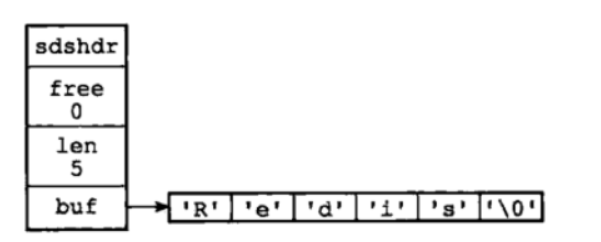

所以不使用C语言中提供的字符串类型，而是自己定义一个SDS的好处如下：

- **常数时间复杂度下（O(1)）就能够获取字符串长度**，对于SDS来说，只需要读取`len`属性就能够得到字符串的长度，但是对于C语言中的字符串来说，获得字符串的长度需要遍历整个字符串

- **杜绝缓冲区溢出**，我们知道在C语言中使用`strcat`函数来进行两个字符串拼接时，一旦没有分配足够长度的内存空间，就会造成缓冲区的溢出，而对于SDS数据类型，在进行字符串修改时首先会根据字符串的`len`属性来检查内存空间是否够用，如果不满足会进行相应的内存扩充，然后再进行修改操作，不会产生内存溢出的现象

  >[Redis底层数据结构解析(BAT大厂必问) - 知乎 (zhihu.com)](https://zhuanlan.zhihu.com/p/334664445#:~:text= Redis底层数据结构有以下数据类型：简单动态字符串（SDS），链表，字典，跳跃表，整数集合，压缩列表，对象。 接下来，就探讨一下Redis是怎么通过这些数据结构来实现value的5种类型的。 简单动态字符串（simple,dynamic string SDS） String的数据类型是由SDS实现的。)

- **减少修改字符串的内存重新分配次数，**C语言由于不记录字符串的长度，所以如果要修改字符串，必须要重新分配内存（先释放再申请），因为如果没有重新分配的话，字符串增大会造成内存溢出，字符串减小会造成内存泄漏

  而对于SDS来说，**由于len和free属性的存在，对于修改字符串SDS实现了空间预分配和惰性空间释放两种策略**

  - 空间预分配：对字符串进行空间扩充的时候，扩展的内存比实际需要的多，这样可以减少连续执行字符串增长操作所需要的内存重分配次数
  - 惰性空间释放：对于字符串进行缩短操作时，程序不立即使用内存重新分配来回收缩短后多余的字节，而是使用free属性将这些字节记录下来，等待后续使用（当然SDS也提供了相应的API，当我们有需要的时候可以手动释放这些未使用的空间）

- **二进制安全，**因为C字符串以空字符作为字符串结束的标识，而对于一些二进制文件（比如图片等），内容可能包含空字符串，所以C字符串无法正确的读取，但是SDS的API都是以处理二进制的方式来处理buf里面的元素，而且SDS不是以空字符串来判断是否结束，而是通过`len`属性表示的长度来判断字符串是否结束

> 值得注意的是，在Redis中，SDS不仅仅是只能够用来保存数据库的字符串值，他还可以**被用作缓冲区（buffer）**：包括AOF模块中的AOF缓冲区以及客户端状态中的输入缓冲区


此外，Redis为了将内存的使用率做到极致，针对字符串对象，提供了三种数据结构，如下所示

```c
REDIS_ENCODING_INT（long 类型的整数）
REDIS_ENCODING_EMBSTR embstr （编码的简单动态字符串）
REDIS_ENCODING_RAW （简单动态字符串）
```

- **如果一个字符串内容可转为 long，那么该字符串会被转化为 long 类型，**对象 ptr直接存储该值，并将 encoding 设置为 int，这样就不需要重新开辟空间，算是长整形的一个优化。

- 如果字符串对象保存的是一个字符串值，并且这个字符串的长度小于等于 44 字节，那么字符串对象将使用 embstr 编码的方式来保存这个字符串。

  > 3.2版本之后是44个字节，之前是39个字节，这也是因为sds结构的版本变化所导致的。

  embstr类型是如何存放字符串的**【重点】**

  **我们知道一般cpu从内存中读取数据会先读取到 cache line（缓存行）， 一个缓存行基本占64个字节，其中redisObject最少占16个字节（根据属性的类型计算得出），所以如果要读取一个 redisObject，会发现只读取了16个字节，剩下的48个字节的空间相当于浪费，所以为了提高性能（主要减少了内存读取的次数），所以在RedisObject空间后又开辟48个字节的连续空间，将ptr指向的值存入其中，注意此处存入的是字符串类型，48个字节对应的是sdshdr8存储结构。而 sdshdr8 在不存入数据的情况下，最少要 4 个字节（其中一个字节是字符串尾部的'\0'）,那么还剩余 44 个字节，所以如果在 44 个字节以内字符串就可以放在缓存行里面，从而减少了内存I/O次数**

  > 类似于预读功能，作用就是减少内存IO的次数

- 如果字符串对象保存的是一个字符串值，并且**这个字符串的长度大于 32 字节，那么字符串对象将使用一个简单动态字符串（SDS）来保存这个字符串值，并将对象的编码设置为 raw**。

>[Redis极致设计-五大数据结构的底层结构原理 - 知乎 (zhihu.com)](https://zhuanlan.zhihu.com/p/349981906)


### List

C语言的内部没有内置这种数据结构，所以Redis自己使用了链表

list的底层数据结构在3.2版本之前有两种，一种是linkedlist（双向链表），另一种是ziplist

在3.2版本之后升级成为了quicklist（双向链表）

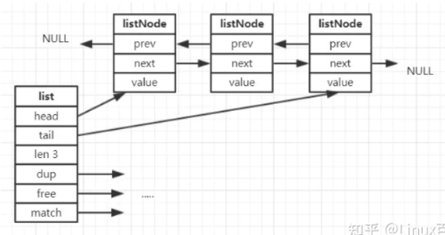

- `dup`：用于复制链表节点所保存的值
- `free`：用于释放链表节点所保存的值
- `match`：用于对比链表节点所保存的值和另一个输入值是否相等

Redis链表的特性是双端、无环、带链表长度计数器、多态

　　①、双端：链表具有前置节点和后置节点的引用，获取这两个节点时间复杂度都为O(1)。

　　②、无环：表头节点的 prev 指针和表尾节点的 next 指针都指向 NULL,对链表的访问都是以 NULL 结束。　　

　　③、带链表长度计数器：通过 len 属性获取链表长度的时间复杂度为 O(1)。

　　④、多态：链表节点使用 void* 指针来保存节点值，可以保存各种不同类型的值。

> 有关ziplist和quicklist的介绍[Redis极致设计-五大数据结构的底层结构原理 - 知乎 (zhihu.com)](https://zhuanlan.zhihu.com/p/349981906)


### Hash

**hash的底层存储有两种数据结构，一种是ziplist，另外一种是hashtable**，当hash对象可以同时满足以下两个条件的时候，哈希对象使用ziplist编码：

- 哈希对象保存的所有键值对的键和值的字符串都小于64字节
- 哈希对象保存的键值对数量小于512个


压缩列表（ziplist）是Redis为了节省内存而开发的，是**由一系列特殊编码的连续内存块组成的顺序型数据结构**，一个压缩列表可以包含任意多个节点（entry），每个节点可以保存一个字节数组或者一个整数值。

**压缩列表的原理：压缩列表并不是对数据利用某种算法进行压缩，而是将数据按照一定规则编码在一块连续的内存区域，目的是节省内存**

**ziplist的存储结构如下：**

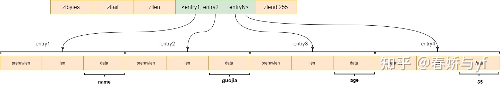

上图可以看到，当数据量比较小的时候，我们会将所有的key和value都当成一个元素，顺序的存入ziplist中，构成有序

更具体一点ziplist的结构是

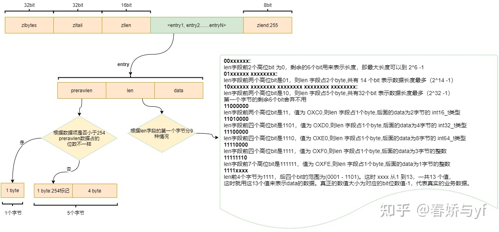

其中黄色区域用来表示列表的特征，绿色区域就是列表中具体的元素了，**ziplist是使用连续的内存块存储的**

- zlbytes：表示整个ziplist占用的字节数，一般用于内存重分配或者计算列表尾端
- zltail：到达列表最后一个节点的偏移量，方便直接找到尾部节点
- zllen：列表节点的数量

> 注意zllen用16个比特位存储，也就是说起长度最大表示65535，所以如果长度超过这个值，只能够通过节点遍历来确定列表元素数量

- entryX：列表中的各节点
- zlend：作用就是用来标记列表尾端，占用一个字节

**ziplist最大的缺点就是连锁更新问题**

前面说过，每个节点的previous_entry length 属性都记录了前一个节点的长度：

- 如果前一节点的长度小于254 字节，那么previ ous* entry_length 属性需要用 1字节长的空间来保存这个长度值。
- 如果前一节点的长度大于等于254 字节，那么previous entry length 属性需要用5 字节长的空间来保存这个长度值。

如果我们将一个长度大于等于 254 字节的新节点 new 设置为压缩列表的表头节点，那么麻烦的事情来了，由于previous entry length大小不够用(1->5B)，**后面所有的节点可能都要重新分配内存大小**。因为连锁更新在最坏情况下需要对压缩列表执行 N 次空间重分配操作， 而每次空间重分配的最坏复杂度为 O(N) ， 所以连锁更新的最坏复杂度为 O(N^2) 。


**hash table哈希表的结构是**

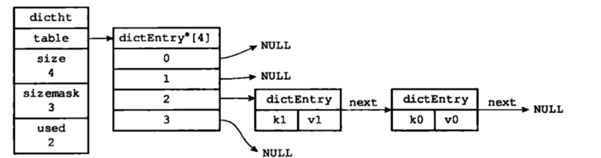

我们知道哈希表最大的问题就是存在哈希冲突，**Redis中是通过链地址法解决的哈希冲突**，即通过next指针将多个哈希值相同的键值对连接在一起，用来解决哈希冲突

> 求索引就是利用计算出来的hash值 % sizemask


**哈希表的扩容和缩容**

当哈希表保存的键值对太多或者太少时，就要通过`rehash`重新散列来对哈希表进行相应的扩展或者收缩，具体步骤如下：

- 如果执行扩展操作，每次的扩展都是根据原哈希表已使用的空间扩大一倍创建另一个哈希表。相反，如果执行的是收缩操作，每次收缩根据已使用空间缩小一倍创建一个新的哈希表
- 然后再重新计算hash值和索引，将键值放到新的哈希表的位置上
- 所有键值对都迁移完毕之后，释放原哈希表的内存空间

**触发扩容的条件：**

- 服务器目前没有执行 BGSAVE 命令或者 BGREWRITEAOF 命令，并且负载因子大于等于1。
- 服务器目前正在执行 BGSAVE 命令或者 BGREWRITEAOF 命令，并且负载因子大于等于5。

> 负载因子 = 哈希表已保存节点数量 / 哈希表大小。

同时Redis中的扩容或者缩容是**渐进式`rehash`**，也就是说扩容和缩容操作不是一次性、集中式完成，而是分多次、渐进式完成的，这其实也不难理解，如果保存在Redis中的键值对只有几十个、上百个，那么`rehash`操作可能瞬间就可以完成，但是如果Redis中的数据有上百万条，几千万甚至更多，如果要进行一次性`rehash`势必会造成Redis一段时间内不能进行别的操作，所以Redis采用渐进式`rehash`，在进行渐进式`rehash`的期间，字典的删除、更新、查找操作可能在两个哈希表上进行，第一个哈希表没有找到，就回去第二个哈希表上找，但是增加操作一定是在新的哈希表上进行的


### Set

**Set底层用两种数据结构存储，一个是hashtable，一个是intset。**

set的底层存储intset和hashtable是存在编码转换的，使用**intset**存储必须满足下面两个条件，否则使用hashtable，条件如下：

- 结合对象保存的所有元素都是整数值
- 集合对象保存的元素数量不超过512个

**整数集合（intset）是Redis用于保存整数值的集合抽象数据类型，它可以保存类型为int16_t、int32_t 或者int64_t 的整数值，并且保证集合中不会出现重复元素。**

```c
typedef struct intset{
     //编码方式
     uint32_t encoding;
     //集合包含的元素数量
     uint32_t length;
     //保存元素的数组
     int8_t contents[];
 
}intset;
// 集合中的每个元素都是contents数组的一个数据项，他们按照从小到大的顺序排列，并且不包含任何的重复项，在intset中查找数据的时候是通过二分来查找的
// 需要注意的是虽然 contents 数组声明为 int8_t 类型，但是实际上contents 数组并不保存任何 int8_t 类型的值，其真正类型由 encoding 来决定。
```


### ZSet

**ZSet的底层实现是字典+跳表，使用skiplist按序保存元素及分值，使用dict来保存元素和分值的映射关系**

当同时满足下面两个条件的时候，ZSet使用的是ziplist来存储的

- 有序集合保存的元素数量小于128个
- 有序集合保存的所有元素的长度小于64字节


首先，跳表是一种有序的数据结构，它通过每个节点中维持多个指向其他节点的指针，从而达到快速访问节点的目的，具有如下性质：

1. 有很多层结构组成
2. 每一层都是一个有序的链表，排列顺序由高层到低层，都至少包含两个链表节点，分别是前面的head节点和后面的nil节点
3. 最底层的链表包含了所有的元素
4. 如果一个元素出现在某一层的链表中，那么该层之下的链表也全都会出现（上一层的元素是当前层元素的子集）
5. 链表中每个节点都包含两个指针，一个指向同一层的下一个链表节点，另一个指向下一层的同一个链表节点

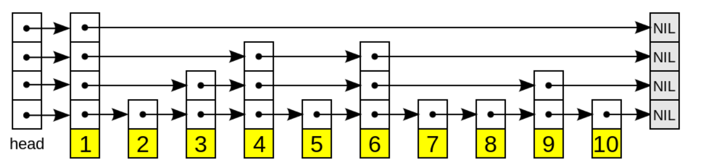


- **搜索：**从最高层的链表节点开始，如果比当前节点要大和比当前层的下一个节点要小，那么则往下找，也就是和当前层的下一层的节点的下一个节点进行比较，以此类推，一直找到最底层的最后一个节点，如果找到则返回，反之则返回空。
- **插入：**首先确定插入的层数，有一种方法是假设**抛一枚硬币（跳表的时间复杂度通过概率能够算出来是..）**，如果是正面就累加，直到遇见反面为止，最后记录正面的次数作为插入的层数。当确定插入的层数k后，则需要将新元素插入到从底层到k层。
- **删除：**在各个层中找到包含指定值的节点，然后将节点从链表中删除即可，如果删除以后只剩下头尾两个节点，则删除这一层。


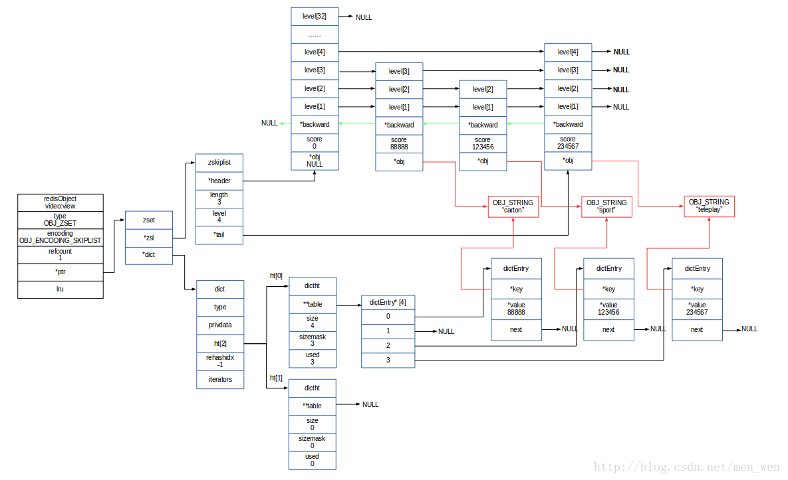


## Redis主从复制

### 主从复制概述

<font color=red>Redis的高可用方案包括：持久化、主从复制（以及读写分离）、哨兵和集群，其中持久化解决的是Redis数据的单机备份问题（从内存到硬盘的备份），而主从复制则侧重解决数据的多机热备份，此外，主从复制还可以实现负载均衡和故障恢复</font>

所谓主从复制，就是将一台Redis服务器上的数据复制到其他Redis服务器上，前者称为主节点（master），后者成为从节点（slave）：**数据的复制是单向的，只能从主节点复制到从节点**

默认情况下，每台Redis服务器都是主节点，且一个主节点可以有多个从节点（或者没有从节点），但是一个从节点只能够有一个主节点

**主从复制的作用**

- **数据冗余**，主从复制实现了数据的热备份，是持久化之外的一种数据冗余方式
- **故障恢复**，当主节点出现问题的时候，可以由从节点提供服务，实现快速的故障恢复，实际上是一种服务的冗余
- **负载均衡**，在主从复制的基础上，搭配上读写分离，可以由主节点提供写服务，从节点提供读服务（即写Redis数据的时候应用连接到主节点，读Redis数据的时候应用连接到从节点），分担服务器负载，尤其是在写少读多的场景下，通常通过多个从节点分担读负载，可以大大提高Redis的并发量
- **高可用基石**，主从复制是哨兵模式和集群能够实施的基础，因此可以说是主从复制是Redis高可用的基石


### 主从复制的实现原理

<font color=red>主从复制的过程大致上可以分成三个部分：连接建立阶段（准备阶段）、数据同步阶段、命令传播阶段</font>

#### 连接建立阶段

该阶段的主要作用是在主从节点之间建立连接，为数据同步做好准备

- **步骤一：保存主节点信息**

  从节点服务器内部维护了两个字段，即masterhost和masterport，用于存储主节点的ip和port信息

  需要注意的是，salveof是异步命令，从节点完成主节点ip和port的保存后，向发送salveof命令的客户端直接返回OK，实际的复制操作在这之后才开始进行

- **步骤二：建立socket连接**

  从节点每秒1次调用复制定时函数`replicationCron()`，如果发现了有主节点可以连接，便会根据主节点的ip和port，创建socket连接，如果连接成功，则：

  - 从节点：为该socket创建一个专门处理复制工作的文件事件处理器，负责后续的复制工作，如接收RDB文件、接收命令传播等
  - 主节点：接收到从节点的socket连接后（即accept之后），为该socket创建相应的客户端状态，并将从节点看做是连接到主节点的一个客户端，后面的步骤会以从节点向主节点发送命令请求的方式来进行

- **步骤三：发送ping命令**

  从节点称为主节点的客户端之后，发送ping命令进行首次请求，目的是检查socket连接是否可用，以及主节点当前是否能够处理请求

  从节点发送ping命令之后，可能会有三种情况：

  - 发送pong，说明socket连接正常，且主节点当前可以处理请求，复制过程继续
  - 超时，一定时间后从节点仍未收到主节点的回复，说明socket连接不可用，则从节点断开socket连接，并重连
  - 返回pong以外的结果，如果主节点返回其他结果，如正在处理超时运行的脚本，说明主节点当前无法处理命令，则从节点断开socket连接，并重连

- **步骤四：身份验证**

  如果从节点中设置了masterauth选项，则从节点需要向主节点进行身份验证；没有设置该选项，则不需要验证。从节点进行身份验证是通过向主节点发送auth命令进行的，auth命令的参数即为配置文件中的masterauth的值。

  如果主节点设置密码的状态，与从节点masterauth的状态一致（一致是指都存在，且密码相同，或者都不存在），则身份验证通过，复制过程继续；如果不一致，则从节点断开socket连接，并重连。

- **步骤五：发送从节点端口信息**

  身份验证之后，从节点会向主节点发送其监听的端口号，主节点将该信息保存到该从节点对应的客户端的`slave_listening_port`字段中，该端口信息除了在主节点中执行`info replication`时显示之外，没有其他任何作用


#### 数据同步阶段

数据同步阶段是主从复制最核心的阶段，主从节点之间的连接建立之后，便可以开始进行数据同步，该阶段可以理解为从节点数据的初始化，具体执行的方式是从节点向主节点发送`psync`命令，开始进行同步。

**根据主从节点当前状态的不同，可以分成全量复制和增量复制**

> 需要注意的是，在数据同步阶段之前：从节点是主节点的客户端，主节点不是从节点的客户端，而到了数据同步节点以及后面的命令传播阶段：主从节点互为客户端，原因在于：在连接建立阶段，主节点只需要响应从节点的请求，不需要向从节点发送请求，而在后面的两个阶段，**主节点需要主动向从节点发送请求（如推送缓冲区中的写命令），才能完成复制。**


#### 命令传播阶段

在这个阶段主节点将自己执行的写命令发送给从节点，从节点接受命令并执行，从而保证主从节点数据的一致性

在命令传播阶段，除了发送写命令，主从节点还维持着**心跳机制**

但是需要注意的是，命令传播是一个异步的过程，即主节点发送写命令后并不会等待从节点的回复，因此事实上主从节点之间很难保持实时的数据一致性，延迟在所难免，数据不一致的程度和主从节点之间的网络状况、主节点写命令的执行频率以及主节点中的repl-disable-tcp-nodelay配置等有关。

`repl-disable-tcp-nodelay`：该配置作用于命令传播阶段，控制主节点是否禁止与从节点的TCP_NODELAY；默认no，即不禁止TCP_NODELAY。当设置为yes时，TCP会对包进行合并从而减少带宽，但是发送的频率会降低，从节点数据延迟增加，一致性变差；具体发送频率与Linux内核的配置有关，默认配置为40ms。当设置为no时，TCP会立马将主节点的数据发送给从节点，带宽增加但延迟变小。

一般来说，只有当应用对Redis数据不一致的容忍度较高，且主从节点之间网络状态不好的时候，才会设置为yes，多数情况下使用默认值no


### 全量复制和增量复制

全量复制用于初次复制或其他无法进行增量复制（又称为部分复制）的情况，将主节点中的所有数据都发送给从节点，是一个非常重型的操作

增量复制又称部分复制，用于网络中断等情况后的复制，只将中断期间主节点执行的写命令发送给从节点，比全量复制更加高效。

> 值得注意的是，如果网络中断时间过长，导致主节点没有能够完整地保存中断期间执行的写命令，则无法进行部分复制，还是需要进行全量复制


在Redis2.8版本之前，从节点向主节点发送sync命令请求同步数据，此时的同步方式是全量复制，在Redis2.8及以后，从节点向主节点发送psync命令请求同步数据，此时根据主从节点当前状态的不同，同步方式可能是全量复制或者增量复制

**全量复制的过程**

Redis通过psync命令进行全量复制的过程如下：

- 从节点判断无法进行增量复制，向主节点发送进行全量复制的请求，或者从节点发送部分复制的请求，但是主节点判断无法进行部分复制。
- 主节点受到全量复制的请求之后，执行`bgsave`，在后台生成RDB文件，并使用一个缓冲区（称为复制缓冲区）记录从现在开始执行所有写命令
- 主节点的bgsave执行完成后，将RDB文件发送给从节点，从节点首先清除自己的旧数据，然后载入接收的RDB文件，将数据库状态更新至主节点执行bgsave前的数据库的状态
- 主节点将前面所说的复制缓冲区中的所有写命令发送给从节点，从节点执行完这些命令之后，将数据库状态更新至最新状态

- 如果从节点开启了AOF，则会触发`bgrewriteaof`的执行，从而保证AOF文件更新至主节点的最新状态

> 我们知道在进行RDB持久化的时候，主节点是通过bgsave命令**fork一个子进程进行RDB持久化操作**，这个过程是非常消耗CPU、内存、磁盘I/O的，同时主节点将这个RDB文件发送给从节点，会对主从节点的网络带宽也带来一定的影响，此外，从节点清除数据，载入新的RDB文件是一个阻塞过程，这个期间从节点不能够响应任何请求，而且如果从节点开启了aof，那么也会带来额外的消耗
>
> 综上，可以看出，**全量复制是一个非常重型的操作**


**增量复制**

**增量复制的实现依赖于三个重要的概念：复制偏移量、复制积压缓冲区、服务器运行ID**

- 首先是**复制偏移量**，主节点和从节点分别维护一个复制偏移量（offset），代表的是主节点向从节点传递的字节数，主节点每次向从节点传播N个字节数据时，主节点的offset增加N，从节点每次收到主节点传来的N个字节数据时，从节点的offset增加N。

  > **offset用来判断主从节点的数据库状态是否一致，**如果二者offset相同，则一致，如果offset不同，则不一致，此时可以根据两个offset找出从节点缺少的那部分数据，例如主节点的offset是1000，而从节点的offset是500，那么部分复制就需要将offset为501-1000的数据传给从节点，而offset为501-1000的数据存储的位置就是下面要说的复制积压缓冲区

- 第二是**复制积压缓冲区**，**复制积压缓冲区是由主节点维护的、固定长度的、先进先出（FIFO）队列，默认大小为1MB**，当主节点开始有从节点时创建，其作用是备份主节点最近发送给从节点的数据，注意：无论主节点有一个还是多个从节点，**主节点都只需要维护一个复制积压缓冲区**

  在命令传播阶段，主节点除了要将写命令发送给从节点，还要讲这个命令发送一份给复制积压缓冲区，作为写命令的备份，除了存储写命令，复制积压缓冲区中还存储了其中的每个字节对应的复制偏移量，由于复制积压缓冲区是一个先进先出的队列，所以他保存的是主节点最近执行的写命令，**时间较早的写命令会被挤出缓冲区**

  由于缓冲区的长度固定且有限，因此可以备份的写命令也是有限的，**当主从节点offset差距过大超过缓冲区长度时，将无法进行部分复制，这时候只能够进行全量复制**

  从节点将offset发送给主节点之后，主节点根据offset和复制积压缓冲区的大小来决定是否进行增量复制

  - 如果offset偏移量之后的数据仍然在复制积压缓冲区中，那么将进行部分复制
  - 如果offset偏移量之后的数据已经被挤出了缓冲区，那么只能够进行全量复制

  > 从上面我们也可以看出，如果想要提高部分复制的概率，我们可以增大复制积压缓冲区的长度（通过配置repl-backlog-size）
  >
  > 例如如果网络中断的平均时间是60s，而主节点平均每秒产生的写命令(特定协议格式)所占的字节数为100KB，则复制积压缓冲区的平均需求为6MB，保险起见，可以设置为12MB，来保证绝大多数断线情况都可以使用部分复制。

- 第三是**服务器运行ID**，每个Redis节点，无论主从，**都会在启动时自动生成一个随机ID（每次启动都不一样）**，由40个随机的十六进制字符组成，runid用来唯一识别一个Redis节点，通过Info Server命令，来查看节点的runid

  主从节点初次复制时，主节点将自己的runid发送给从节点，从节点将这个runid保存起来，当断线重连时，从节点会将这个runid发送给主节点，主节点也会参考这个runid来判断是否进行部分复制

  - 如果从节点保存的runid和主节点的runid不同的话，说明从节点在断线前同步的Redis节点并不是当前的主节点，只能进行全量复制
  - 如果从节点保存的runid和主节点的runid相同的话，说明主从节点之前同步过，但是能不能够进行部分复制还需要检查offset和复制积压缓冲区的大小


综上，当从节点向主节点发送psync命令之后，数据同步的流程如下：

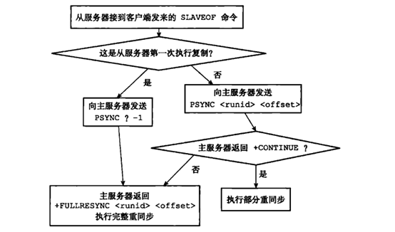


> 参考链接 [深入学习Redis（3）：主从复制 - 编程迷思 - 博客园 (cnblogs.com)](https://www.cnblogs.com/kismetv/p/9236731.html)


### 心跳机制

我们知道，主从复制分成了三个部分：连接建立阶段、数据同步阶段、命令传播阶段，在命令传播阶段，主节点除了需要向从节点发送写命令，还维持着**心跳机制：PING和REPLCONF ACK**，心跳机制对于主从复制的超时判断、数据安全等有作用

#### 主节点向从节点发送PING命令

PING发送的频率由repl-ping-slave-period参数控制，单位是秒，默认值是10s。

这个命令的作用就是为了让主节点进行超时判断，如果在规定时间内没有从节点返回值，那么连接就会被断开


#### 从节点向主节点发送REPLCONF ACK命令

在命令传播阶段，从节点会向主节点发送REPLCONF ACK命令，频率是每秒1次，命令格式为REPLCONF ACK{offset}，其中offset指从节点保存的复制偏移量，REPLCONF ACK命令的作用包括：

- **实时监测主从节点的网络状态：**该命令会被主节点用于复制超时的判断。此外，在主节点中使用info Replication，可以看到其从节点的状态中的lag值，代表的是主节点上次收到该REPLCONF ACK命令的时间间隔，在正常情况下，该值应该是0或1，如下图所示：

  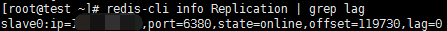

- **检测命令丢失：**从节点会发送自身的offset，主节点会与自己的offset对比，如果从节点数据缺失（如网络丢包），主节点会推送缺失的数据（这里也会利用复制积压缓冲区）。offset和复制积压缓冲区不仅可以用于部分复制，还可以用于处理命令丢失等情形，区别在于前者是在断线重连之后进行的，而后者是在主从节点没有断线的情况下进行的

- **辅助保证从节点的数量和延迟：**Redis主节点中使用min-slaves-to-write和min-slaves-max-lag参数，来保证主节点在不安全的情况下不会执行写命令；

  > 所谓的不安全指的是从节点数量太少，或者延迟过高，例如min-slaves-to-write=3,min-slaves-max-lag=10，含义是如果从节点数量小于3，或者所有从节点的延迟都大于10s，则主节点拒绝执行写命令

  而这里，从节点延迟值得获取就是通过主节点接收到REPLCONF ACK命令的时间来判断的，即前面所说的info Replication中的lag值


### 主从复制的使用

**<font color=red>主从复制的开启，完全是由从节点发起的，不需要我们在主节点做任何事情</font>**

从节点开启主从复制，有以下三种方式：

- **配置文件**

  永久有效，在从服务器配置文件中加入`slaveof/replicaof <masterip> <masterport>`，指定主机的ip地址和端口

- **启动命令**

  redis-server启动命令后加入`--salveof <masterip> <masterport>`

- **客户端命令**

  Redis服务器启动之后，直接通过客户端执行命令：`slaveof <masterip> <masterport>`，则该redis实例成为从节点


## Redis哨兵

我们知道，Redis实现高可用的技术包括持久化、主从复制、哨兵以及集群，他们分别的作用是

- **持久化：**持久化是最简单的高可用手段（有时甚至都不被当作是高可用技术），起主要作用就是数据备份，即将内存中的数据持久化到磁盘中，因此数据不会因为进程退出而消失，持久化针对的是数据的单机备份

- **主从复制：**主从复制是高可用的基石，哨兵和集群都要在主从复制的基础上进行，主从复制主要实现了数据的多机备份以及对于读操作的负载均衡和简单的故障恢复，缺陷是故障恢复没法做到自动化进行，存储能够受到单机的限制，写操作无法做到负载均衡

  > 后两个缺点都是因为在主从复制中，写操作只能够作用于主节点，而其余的从节点可以做到读操作的负载均衡，从节点上的数据都是对主节点上数据的重复，因此整个系统的数据量受到主节点的限制

- **哨兵模式：**在主从复制的基础上，加入了故障的自动化修复，但是仍然存在写操作无法做到负载均衡、存储收到单机限制的缺点

- **集群：**通过集群，Redis解决了写操作的负载均衡，以及存储能力受到单机限制的问题，实现了较为完善的高可用方案


### 哨兵模式的概述

Redis sentinel，即Redis哨兵，是在Redis2.8之后才引入的，**其核心功能就是实现了主节点的自动故障转移**，具体来说：Redis sentinel就是由一个或者多个Sentinel实例组成的哨兵系统可以监视任意多个主节点以及这些主节点下的从节点，并在监视的主节点发生故障下线时，自动将下线主节点属下的某个从节点升级成主节点

> 哨兵节点是特殊的Redis节点，不会存储数据

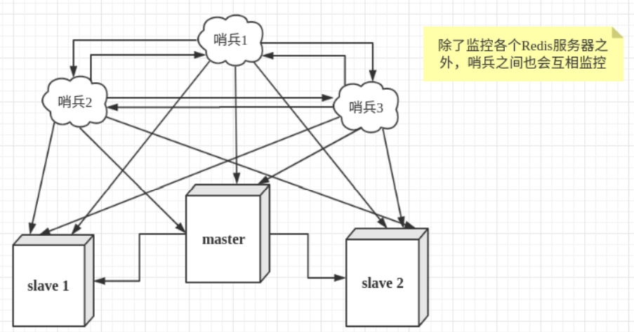


**哨兵系统在搭建过程中有以下几点需要注意：**

- 哨兵系统中的主从节点与普通节点之间并没有什么区别，故障发现和转移由哨兵来控制和完成的
- 哨兵节点本质上是Redis节点
- <font color=red>每个哨兵节点，只需要配置监控主节点，并可以自动发现其他的哨兵节点和从节点</font>
- 在哨兵节点启动和故障转移阶段，各个节点的配置文件都会被重写（config rewrite）
- 一个哨兵节点可以监听多个主节点，配置多条sentinel monitor即可


从上面的描述，我们能够知道哨兵节点有2个作用：一个是监听主节点，另一个是自动故障转移，事实上，哨兵节点还有另外两个作用：一个是哨兵节点是配置提供者，另一个是哨兵节点具有通知的作用

- **监听：**哨兵会不断的检查主节点和从节点是否运行正常
- **自动故障转移：**当主节点不能够正常工作时，哨兵会开始自动故障转移工作，它会将失效的主节点属下的从节点升级成为一个新的主节点，并让其他的从节点该为复制新的主节点
- **配置提供者：**客户端在初始化的时候，通过连接哨兵来获得当前Redis服务的主节点地址
- **通知：**哨兵可以将故障转移结果发送给客户端

其中，监控和自动故障转移功能，使得哨兵可以及时发现主节点故障并完成转移；而配置提供者和通知功能，则需要在与客户端的交互中才能体现。

**这里需要注意的是Redis是配置提供者的角色，而不是代理**

> 这是什么意思呢？
>
> 我们知道当系统中有一个从节点需要进行连接时，他不是通过指定主节点host和ip来直接去连接主节点的，而是通过连接哨兵来获得当前Redis服务的主节点地址，即通过遍历哨兵节点，获取节点信息，通过其中一个哨兵节点+masterName获得主节点的信息；该功能是通过调用哨兵节点的sentinel get-master-addr-by-name命令实现，该命令示例如下：
>
> 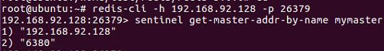
>
> 那么配置提供者和代理的区别在哪里呢？
>
> 如果是配置提供者，客户端通过哨兵获得了主节点的信息之后，会连接到主节点上，后续的命令，请求等都会直接发送到主节点上，而如果是代理的话，这些命令和请求都是需要先发送给代理，然后由代理再发送给主节点处理请求


### 哨兵实现的基本原理

关于哨兵的原理，主要是要搞清楚下面的这些概念

1. **定时任务：**每个哨兵节点都维护了三个定时任务，定时任务的功能分别如下：通过向主从节点发送info命令获取最新的主从结构；通过发布订阅功能获得其他哨兵节点的信息；通过向其他节点发送ping命令进行心跳检测，判断是否下线

2. **主观下线：**如果在心跳检测的定时任务中，有节点在一定时间内没有返回响应，那么哨兵节点就会将其主观下线，所谓的主观下线就是<font color=red>一个</font>哨兵节点主观地判断下线。

3. **客观下线：**哨兵节点在对主节点进行主观下线之后，会通过sentinel is-master-down-by-addr命令向其他哨兵节点询问这个主节点的状态；如果判断该主节点下线的哨兵数量达到阈值之后，该主节点就会被客户端下线

   > 注意：客观下线是主节点才有的概念，对于从节点和哨兵节点，当发生主观下线之后，就不会有后面的客观下线和故障转移操作了，也就是说对于从节点和哨兵节点，他们在主观下线之后就真的下线了

4. **选举 领导者哨兵节点：**当某个主节点被客观下线之后，各个哨兵节点之后会通过协商，选举出一个领导者哨兵节点，由这个领导者哨兵节点对其进行故障转移操作

   监视该主节点的哨兵都有可能成为领导者哨兵节点，选举的方式是通过Raft算法，该算法的基本思路是先到先得，即在一轮选举中，哨兵A向B发送成为领导者的申请，如果B没有同意过其他哨兵，则会同意A成为领导者。

   一般情况下，领导者哨兵节点的选举过程会很快

5. **故障转移：**选举出来的领导者哨兵节点会进行故障转移工作，大致分成了三个步骤：

   - <font color=red>在从节点中选出新的主节点</font>

     > 选择的原则是：首先过滤掉不健康的从节点，（不健康的节点指的是比如主观下线、断线的从节点、五秒内没有回复过哨兵节点ping命令的节点、与主节点失联的从节点），然后选择优先级最高的从节点，如果优先级无法区分，那么选择复制偏移量最大的从节点，如果仍然无法区分，则选择runid最小的从节点

   - <font color=red>更新主从状态</font>

     通过`slaveof no one`命令让选出来的从节点成为主节点，并通过`slaveof`命令改变其他从节点的主节点

   - 将已经下线的主节点设置为新的主节点的从节点，等到它重新上线后，他会成为新的主节点的从节点


### 哨兵模式的实践建议

- 哨兵节点的数量应不止一个，一方面增加哨兵节点的冗余，避免哨兵本身成为高可用的瓶颈；另一方面减少对下线的误判。此外，这些不同的哨兵节点应部署在不同的物理机上
- 哨兵节点的数量应该是奇数，便于哨兵通过投票做出“决策”：领导者选举的决策、客观下线的决策等。
- 各个哨兵节点的配置应一致，包括硬件、参数等；此外，所有节点都应该使用ntp或类似服务，保证时间准确、一致。
- 哨兵的配置提供者和通知客户端功能，需要客户端的支持才能实现，如前文所说的Jedis；如果开发者使用的库未提供相应支持，则可能需要开发者自己实现。
- 当哨兵系统中的节点在docker（或其他可能进行端口映射的软件）中部署时，应特别注意端口映射可能会导致哨兵系统无法正常工作，因为哨兵的工作基于与其他节点的通信，而docker的端口映射可能导致哨兵无法连接到其他节点。例如，哨兵之间互相发现，依赖于它们对外宣称的IP和port，如果某个哨兵A部署在做了端口映射的docker中，那么其他哨兵使用A宣称的port无法连接到A。


>[深入学习Redis（4）：哨兵 - 编程迷思 - 博客园 (cnblogs.com)](https://www.cnblogs.com/kismetv/p/9609938.html)


## Redis集群

上面我们说过，Redis集群能够解决写操作的负载均衡以及存储能力受到单机限制的缺陷，这是因为Redis集群中不仅仅是一个主节点了，而是多个主节点和多个从节点，即集群由多个节点(Node)组成，Redis的数据分布在这些节点中。集群中的节点分为主节点和从节点：只有主节点负责读写请求和集群信息的维护；从节点只进行主节点数据和状态信息的复制。**也就是说在集群中，所有的活都是由主节点来干，从节点不会进行读写操作，它的作用就是作为主节点的备用，当主节点下线之后，由主节点的从节点来顶替，以及集群状态信息的维护**

集群的作用，可以有以下两点：

- **<font color=red>数据分区：这是Redis集群最核心的功能</font>**

  集群将数据分散到多个节点，一方面突破了Redis单机内存大小的限制，存储容量大大增加，另一方面每个主节点都可以对外提供读写服务，大大提高了集群的响应能力

- **高可用：**Redis集群支持主从复制和主节点的自动故障转移（与哨兵类似，但不是哨兵模式，集群中没有用到哨兵），当任意节点发生故障时，集群仍然可以对外提供服务


### 集群原理


#### 数据分区

我们上面说了，集群最核心的功能就是实现了数据分区，数据分区有顺序分区、哈希分区等，其中哈希分区由于天然的随机性，使用广泛，Redis集群中便是采用的哈希分区中的一种，哈希分区的基本思路是：对数据的特征值（如key）进行哈希，然后根据哈希值决定数据落在哪个节点。常见的哈希分区包括：哈希取余分区、一致性哈希分区、带虚拟节点的一致性哈希分区等。

衡量数据分区方法好坏的标准有很多，其中比较重要的两个标准是：数据分布是否均匀，增加和删除节点对数据分布的影响是否较大

由于哈希的随机性，哈希分区基本可以保证数据分布均匀，因此在比较哈希分区方案时，重点要看增减节点对数据分布的影响

##### 哈希取余分区

哈希取余分区的方法非常简单：计算key的hash值，然后使用hash值 % 节点的数量，从而决定这个key应该存放到哪个节点上，该方案的最大问题是，当新增或者删减节点时，节点数量发生变化，所有的key都需要重新计算映射关系，从而引发大规模的数据迁移


##### 一致性哈希分区

一致性哈希算法是将整个空间组织成一个虚拟的圆环，如下图所示，范围是`0-2^32`，对于每个数据根据key计算hash值，确定数据在环上的位置，然后从此位置沿着环顺时针走，在行走的过程中碰到的第一个节点就是该数据应该在的节点

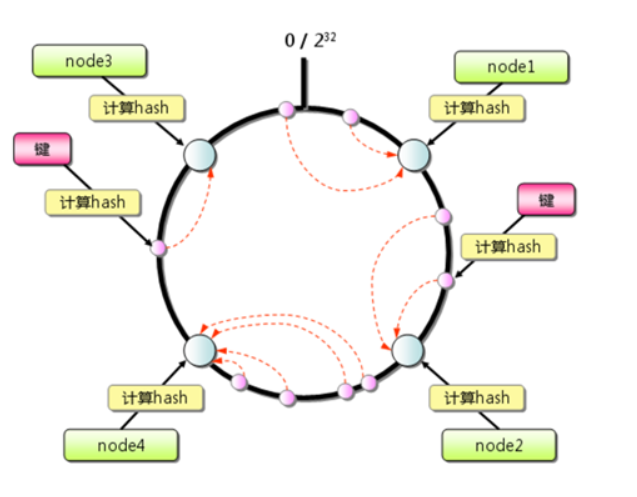

与哈希取余分区相比，一致性哈希分区将增减节点的影响限制在相邻节点。以上图为例，如果在node1和node2之间增加node5，则只有node2中的一部分数据会迁移到node5；如果去掉node2，则原node2中的数据只会迁移到node4中，只有node4会受影响。

但是一致性哈希的主要问题在于它会造成严重的不平衡，特别是当节点数量少的时候，节点在环上的位置也不一定是等分环的，增加或者删除节点对单个节点的影响比较大，造成数据的严重不平衡，还是以上图为例，如果去掉node2，node4中的数据由总数据的1/4左右变为1/2左右，与其他节点相比负载过高。


##### 虚拟节点哈希分区

虚拟节点哈希分区在一致性哈希的基础上加入了虚拟节点的概念，**Redis集群中便是使用的这种方案，其中的虚拟节点成为槽（slot），**在Redis集群中，每个实际的节点里面包含了一定数量的槽，每个槽包含哈希值在一定范围内的数据，引入槽之后，数据的映射关系由数据hash-->实际节点，变成了数据hash --> slot --> 实际节点

**在使用了槽的一致性哈希分区中，槽是数据管理和迁移的基本单位，<font color=red>槽解耦了数据和实际节点之间的关系，</font>增加或者删除节点对系统的影响很小，**仍以上图为例，系统中有4个实际节点，假设为其分配16个槽(0-15)； 槽0-3位于node1，4-7位于node2，以此类推。如果此时删除node2，只需要将槽4-7重新分配即可，例如槽4-5分配给node1，槽6分配给node3，槽7分配给node4；可以看出删除node2后，数据在其他节点的分布仍然较为均衡。

槽的数量一般远小于2^32，但是远大于实际节点的数量，在Redis集群中，槽的个数为16384个，当这16384个槽都分配了节点时，集群处于上线状态（ok），如果有任意一个槽没有分配节点，则集群处于下线状态（fail）

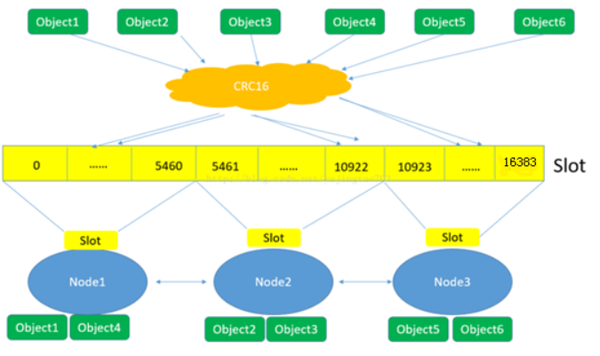

（1）Redis对数据的特征值（一般是key）计算哈希值，使用的算法是CRC16。

（2）根据哈希值，计算数据属于哪个槽。

（3）根据槽与节点的映射关系，计算数据属于哪个节点。


#### 节点通信机制

集群作为一个整体，离不开节点之间的通信

##### 两个端口

在哨兵系统中，节点分为哨兵节点和数据节点，后者用于存放数据，前者是先监听等功能，在集群中，没有数据节点和非数据节点之分，所有的节点会存储数据，也都会参与到集群状态的维护中，为此，集群中的每个节点都提供了两个TCP端口

- 普通端口：主要用于为客户端提供服务，但是在节点之间进行数据迁移的时候也会使用
- 集群端口：端口号是普通端口+10000（这个10000是一个固定值），集群端口只用于节点之间的通信，如集群搭建、增减节点、故障转移等操作时节点间的通信，不要使用客户端连接集群端口，

为了保证集群能够正常工作，在配置防火墙时，要同时开启普通端口和集群端口


##### 通信方式

节点间的通信按照通信协议可以分成几个类型：单播、广播、Gossip协议等。

单播不用多说，就是一个节点和另一个节点之间一对一进行通信

广播是向集群内所有节点都发送消息，优点是集群的收敛速度快（这里的收敛指的是集群内所有节点获得的集群信息是一致的），缺点是每条信息都要发送给所有节点，CPU、带宽等消耗大

Gossip协议的特点是在节点数量有限的网络中，每个节点都随机的与部分节点进行通信（并不是真正的随机，而是按照某个特定的规则去选择通信节点），经过一番杂乱无章的通信之后，每个节点的状态也很快能够达到一致，Gossip协议的优点有负载(比广播)低、去中心化、容错性高(因为通信有冗余)等；缺点主要是集群的收敛速度慢。


##### 消息类型

集群中的节点采用固定频率（每秒10次）的定时任务进行通信相关的工作：判断是否需要发送消息以及消息类型，确定接收节点，发送消息等。如果集群状态发生了变化，如增减节点、槽状态变更等，通过节点间的通信，所有节点很快得知整个集群的状态，使集群收敛

节点间发送的消息主要有5种：meet消息、ping消息、pong消息、fail消息、publish消息，不同的消息类型，通信协议、发送的频率和时机、接收节点的选择等都是不同的

- MEET消息：在节点握手阶段，当节点收到客户端的CLUSTER MEET命令时，会向新加入的节点发送MEET消息，请求新节点加入到当前集群；新节点收到MEET消息后会回复一个PONG消息。
- PING消息：集群里每个节点每秒钟会选择部分节点发送PING消息，接收者收到消息后会回复一个PONG消息。PING消息的内容是自身节点和部分其他节点的状态信息；作用是彼此交换信息，以及检测节点是否在线。PING消息使用Gossip协议发送，接收节点的选择兼顾了收敛速度和带宽成本，具体规则如下：
  - 随机找5个节点，在其中选择最久没有通信的1个节点
  - 扫描节点列表，选择最近一次收到PONG消息时间大于cluster_node_timeout/2的所有节点，防止这些节点长时间未更新。
- PONG消息：PONG消息封装了自身状态数据。可以分为两种：第一种是在接到MEET/PING消息后回复的PONG消息；第二种是指节点向集群广播PONG消息，这样其他节点可以获知该节点的最新信息，例如故障恢复后新的主节点会广播PONG消息。
- FAIL消息：当一个主节点判断另一个主节点进入FAIL状态时，会向集群广播这一FAIL消息；接收节点会将这一FAIL消息保存起来，便于后续的判断。
- PUBLISH消息：节点收到PUBLISH命令后，会先执行该命令，然后向集群广播这一消息，接收节点也会执行该PUBLISH命令。


### 集群方案设计

设计集群方案时，至少要考虑以下因素：

（1）高可用要求：根据故障转移的原理，至少需要3个主节点才能完成故障转移，且3个主节点不应在同一台物理机上；每个主节点至少需要1个从节点，且主从节点不应在一台物理机上；因此高可用集群至少包含6个节点。

（2）数据量和访问量：估算应用需要的数据量和总访问量(考虑业务发展，留有冗余)，结合每个主节点的容量和能承受的访问量(可以通过benchmark得到较准确估计)，计算需要的主节点数量。

（3）节点数量限制：Redis官方给出的节点数量限制为1000，主要是考虑节点间通信带来的消耗。在实际应用中应尽量避免大集群；如果节点数量不足以满足应用对Redis数据量和访问量的要求，可以考虑：(1)业务分割，大集群分为多个小集群；(2)减少不必要的数据；(3)调整数据过期策略等。

（4）适度冗余：Redis可以在不影响集群服务的情况下增加节点，因此节点数量适当冗余即可，不用太大。


>[深入学习Redis（5）：集群 - 编程迷思 - 博客园 (cnblogs.com)](https://www.cnblogs.com/kismetv/p/9853040.html)


