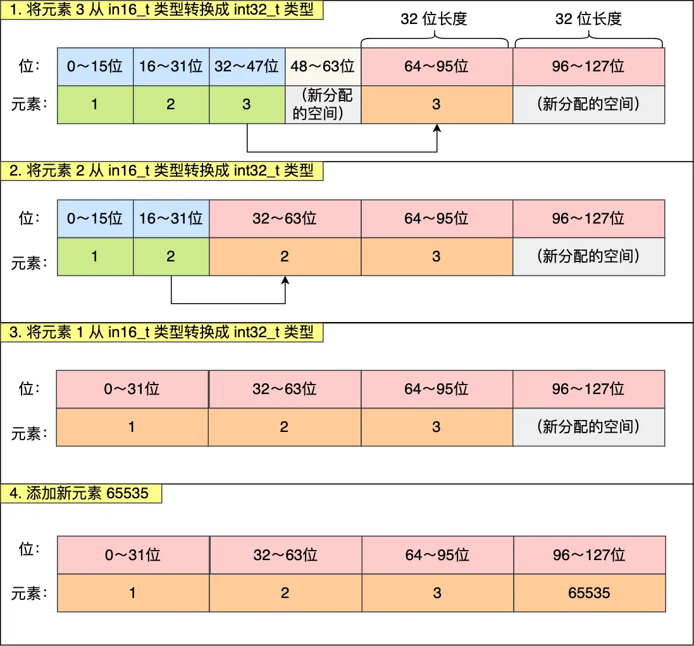

[toc]


## Redis底层的数据结构

Redis是由C语言编写的，它支持5种数据类型，以K-V形式进行存储，K是String类型，V可以是String、list、hash、Set、ZSet5种数据结构，每种数据结构都有各自对应的场景

**Redis中的每个对象都由RedisObject结构表示**，其中：

- `type`表示该对象是什么类型的对象（String对象、List对象、Hash对象、Set对象和ZSet对象）
- `encoding`表示该对象使用了哪种底层的数据结构
- `ptr`是指向底层数据结构的指针


Redis中的键值对是如何存储在Redis中的呢？

Redis实际上是使用了一个哈希表来保存所有的键值对，哈希表的最大好处就是让我们可以用 O(1) 的时间复杂度来快速查找到键值对。哈希表其实就是一个数组，数组中的元素叫做哈希桶。

- redisDb 结构，表示 Redis 数据库的结构，结构体里存放了指向了 dict 结构的指针；

- dict 结构，结构体里存放了 2 个哈希表，正常情况下都是用「哈希表1」，「哈希表2」只有在 rehash 的时候才用

- ditctht 结构，表示哈希表的结构，结构里存放了哈希表数组，数组中的每个元素都是指向一个哈希表节点结构（dictEntry）的指针；

- dictEntry 结构，表示哈希表节点的结构，结构里存放了 **void * key 和 void * value 指针， *key 指向的是 String 对象，而 \*value 则可以指向 String 对象，也可以指向集合类型的对象，比如 List 对象、Hash 对象、Set 对象和 Zset 对象**。

  > Redis 的键值对中的 **key 就是字符串对象**，而 **value 可以是字符串对象，也可以是集合数据类型的对象**，比如 List 对象、Hash 对象、Set 对象和 Zset 对象。
  >
  > > 不管是key，还是value，即使key只能是字符串对象，那他也是redis中的对象，所以key和value都是redisObject结构
  >
  > 举个例子说明一下
  >
  > ```shell
  > HSET person name "xiaolincoding" age 18
  > ```
  >
  > `person`是一个哈希表键，这是因为键的**值是一个包含两个键值对的哈希表对象**


### String

我们知道虽然Redis是使用C语言编写的，但是对于String类型Redis并不是使用的C语言中的字符串，Redis是自己构建了一种名为简单动态字符串**（simple dynamic string, SDS）**的抽象类型，并将SDS作为Redis的默认字符串表示

SDS的定义如下：

```c
struct sdshdr{
   //记录buf数组中已使用字节的数量
   //等于 SDS 保存字符串的长度
   int len;
   //记录 buf 数组中未使用字节的数量
   int free;
   //字节数组，用于保存字符串
   char buf[];
}
```

一个字符串类型的值最多能够存储512MB的数据，这是因为SDS中的buf数组的容量最大是512MB，当字符串对象的长度超过512MB时，Redis会返回错误信息"ERR value is too long"。


上述说的`SDS`结构是在Redis 5.0以前的形式，而Redis 5.0中SDS的结构发生了一些变更，如下：

```c
// sds header的缩写
struct sdshdr {
    int len;        // 字符串的长度
    int alloc;      // 分配的内存空间大小
    unsigned char flags; // 标志位，用于表示不同类型的sds
    char buf[];     // 字符串的实际内容
}
```


Redis一共设计了5种SDS，分别是`sdshdr5`、`sdshdr8`、`sdshdr16`、`sdshdr32`、`sdshdr64`

这五种类型的主要区别就在于，他们的数据结构中的`len`和`alloc`成员变量的数据类型不同

比如`sdshdr16`和`sdshdr32`这两种类型，他们的定义分别如下：

```c
struct __attribute__ ((__packed__)) sdshdr16 {
    uint16_t len;
    uint16_t alloc; 
    unsigned char flags; 
    char buf[];
};


struct __attribute__ ((__packed__)) sdshdr32 {
    uint32_t len;
    uint32_t alloc; 
    unsigned char flags;
    char buf[];
};
```

可以看到

- `sdshdr16` 类型的 len 和 alloc 的数据类型都是 uint16_t，表示字符数组长度和分配空间大小不能超过 2 的 16 次方。
- `sdshdr32` 则都是 uint32_t，表示表示字符数组长度和分配空间大小不能超过 2 的 32 次方。

**SDS之所以设计不同类型的结构体，是为了能够灵活保存不同大小的字符串，从而有效节省内存空间。**最直观的感受就是在保存小字符串时，结构头占用的空间也比较少


更重要的一点，除了设计不同类型的结构体，Redis在编程上还使用了专门的编译优化来节省内存空间，即在`struct`声明了`__attribute__ ((packed))`，它的作用是**告诉编译器取消结构体在编译过程中的优化对齐，按照实际占用字节数进行对齐**

比如针对如下结构体

```c
struct test1 {
    char a;
    int b;
 } t
```

如果使用字节对齐的方式来分配内存，那么会需要8字节的内存空间，**默认情况下，编译器是使用「字节对齐」的方式分配内存，**这样会造成空间浪费


如果按照实际占用的字节数分配内存空间的话，那就是结构体实际占用了多少空间，编译器就分配多少空间


所以不使用C语言中提供的字符串类型，而是自己定义一个SDS的好处如下：

- **常数时间复杂度下（O(1)）就能够获取字符串长度**，对于SDS来说，只需要读取`len`属性就能够得到字符串的长度，但是对于C语言中的字符串来说，获得字符串的长度需要遍历整个字符串

- **杜绝缓冲区溢出**，我们知道在C语言中使用`strcat`函数来进行两个字符串拼接时，一旦没有分配足够长度的内存空间，就会造成缓冲区的溢出，而对于SDS数据类型，在进行字符串修改时首先会根据字符串的`len`属性来检查内存空间是否够用，如果不满足会进行相应的内存扩充，然后再进行修改操作，不会产生内存溢出的现象

  >[Redis底层数据结构解析(BAT大厂必问) - 知乎 (zhihu.com)](https://zhuanlan.zhihu.com/p/334664445#:~:text= Redis底层数据结构有以下数据类型：简单动态字符串（SDS），链表，字典，跳跃表，整数集合，压缩列表，对象。 接下来，就探讨一下Redis是怎么通过这些数据结构来实现value的5种类型的。 简单动态字符串（simple,dynamic string SDS） String的数据类型是由SDS实现的。)

- **减少修改字符串的内存重新分配次数，**C语言由于不记录字符串的长度，所以如果要修改字符串，必须要重新分配内存（先释放再申请），因为如果没有重新分配的话，字符串增大会造成内存溢出，字符串减小会造成内存泄漏

  而对于SDS来说，**由于len和free属性的存在，对于修改字符串SDS实现了空间预分配和惰性空间释放两种策略**

  - 空间预分配：对字符串进行空间扩充的时候，扩展的内存比实际需要的多，这样可以减少连续执行字符串增长操作所需要的内存重分配次数
  - 惰性空间释放：对于字符串进行缩短操作时，程序不立即使用内存重新分配来回收缩短后多余的字节，而是使用free属性将这些字节记录下来，等待后续使用（当然SDS也提供了相应的API，当我们有需要的时候可以手动释放这些未使用的空间）

- **二进制安全，**因为C字符串以空字符作为字符串结束的标识，而对于一些二进制文件（比如图片等），内容可能包含空字符串，所以C字符串无法正确的读取，但是SDS的API都是以处理二进制的方式来处理buf里面的元素，而且SDS不是以空字符串来判断是否结束，而是通过`len`属性表示的长度来判断字符串是否结束

> 值得注意的是，在Redis中，SDS不仅仅是只能够用来保存数据库的字符串值，他还可以**被用作缓冲区（buffer）**：包括AOF模块中的AOF缓冲区以及客户端状态中的输入缓冲区


此外，Redis为了将内存的使用率做到极致，针对字符串对象，提供了三种内部编码方式，如下所示

```c
REDIS_ENCODING_INT（long 类型的整数）
REDIS_ENCODING_EMBSTR embstr （编码的简单动态字符串）
REDIS_ENCODING_RAW （简单动态字符串）
```

- **如果一个字符串内容可转为 long，那么该字符串会被转化为 long 类型，**对象 ptr直接存储该值，并**将 encoding 设置为 int**，这样就不需要重新开辟空间，算是长整形的一个优化。

  

- 如果字符串对象保存的是一个字符串值，并且这个**字符串的长度小于等于 44 字节**，那么字符串对象将使用 **embstr 编码**的方式来保存这个字符串。

  > 3.2版本之后是44个字节，之前是39个字节，这也是因为sds结构的版本变化所导致的。

  embstr类型是如何存放字符串的**【重点】**

  **我们知道一般cpu从内存中读取数据会先读取到 cache line（缓存行）， 一个缓存行基本占64个字节，其中redisObject最少占16个字节（根据属性的类型计算得出），所以如果要读取一个 redisObject，会发现只读取了16个字节，剩下的48个字节的空间相当于浪费，所以为了提高性能（主要减少了内存读取的次数），所以在RedisObject空间后又开辟48个字节的连续空间，将ptr指向的值存入其中，注意此处存入的是字符串类型，48个字节对应的是sds存储结构。而 sds 在不存入数据的情况下，最少要 4 个字节（其中一个字节是字符串尾部的'\0'）,那么还剩余 44 个字节，所以如果在 44 个字节以内字符串就可以放在缓存行里面，从而减少了内存I/O次数**

  > 类似于预读功能，作用就是减少内存IO的次数

  

- 如果字符串对象保存的是一个字符串值，并且**这个字符串的长度大于 44 字节，那么字符串对象将使用一个简单动态字符串（SDS）来保存这个字符串值，并将对象的编码设置为 raw**。

  

可以看到，`embstr`和`raw`编码都会使用`SDS`来保存值，但是不同之处在于**`embstr`会通过一次内存分配函数来分配一块*连续*的内存空间**来保存`redisObject`和`SDS`，而**`raw`编码会通过调用两次内存分配函数来分别分配两块空间来保存`redisObject`和`SDS`**

这样做的优点是：

- `embstr`的内存分配次数由两次变成了一次，同样地，释放内存的次数也从两次变成了一次
- `embstr`编码的字符串对象中的所有数据都保存在一块连续的内存区域中，可以更好地利用CPU缓存提升性能

缺点是：如果字符串的长度增加需要重新分配内存时，整个`redisObject`和`SDS`都需要重新分配内存空间，所以**`embstr`编码的字符串对象实际上是只读的，**`redis`没有为`embstr`编码的字符串对象编写任何相关的修改程序。所以当我们对`embstr`编码的字符串执行任何修改命令时（例如append），程序会先将对象的编码从`embstr`转换成`raw`，然后再执行命令。


>[Redis极致设计-五大数据结构的底层结构原理 - 知乎 (zhihu.com)](https://zhuanlan.zhihu.com/p/349981906)


### List

C语言的内部没有内置这种数据结构，所以Redis自己实现了链表

```c
typedef struct listNode {
    //前置节点
    struct listNode *prev;
    //后置节点
    struct listNode *next;
    //节点的值
    void *value;
} listNode;

typedef struct list {
    //链表头节点
    listNode *head;
    //链表尾节点
    listNode *tail;
    //节点值复制函数
    void *(*dup)(void *ptr);
    //节点值释放函数
    void (*free)(void *ptr);
    //节点值比较函数
    int (*match)(void *ptr, void *key);
    //链表节点数量
    unsigned long len;
} list;
```


> - listNode 链表节点的结构里带有 prev 和 next 指针，**获取某个节点的前置节点或后置节点的时间复杂度只需O(1)；**
> - list 结构因为提供了表头指针 head 和表尾节点 tail，所以**获取链表的表头节点和表尾节点的时间复杂度只需O(1)**；
> - 头节点的`prev`和尾节点的`next`都是指向的`NULL`，所以Redis中实现的链表是**无环**的
> - list 结构因为提供了链表节点数量 len，所以**获取链表中的节点数量的时间复杂度只需O(1)**；
> - listNode 链表节使用 void* 指针保存节点值，并且可以通过 list 结构的 dup、free、match 函数指针为节点设置该节点类型特定的函数，因此**链表节点可以保存各种不同类型的值**；

list的底层数据结构在**3.2版本之前**有两种，一种是linkedlist（双向链表），另一种是ziplist（压缩列表）

- 如果列表的元素个数小于512（默认值，可由 list-max-ziplist-entries 配置），列表中每个元素的值都小于64字节（默认值，可由 list-max-ziplist-value 配置），redis会使用压缩列表作为list类型的底层数据结构
- 如果不满足上述条件，redis使用双向链表作为list类型的底层数据结构

不过，**压缩列表存在性能问题**，所以 Redis 在 **3.2 版本**设计了新的数据结构 **quicklist**，并将 List 对象的底层数据结构改由 quicklist 实现。然后在 **Redis 5.0 设计了新的数据结构 listpack**，沿用了压缩列表紧凑型的内存布局，最终在最新的 Redis 版本，**将 Hash 对象和 Zset 对象的底层数据结构实现之一的压缩列表，替换成由 listpack 实现**


**<font color=red>先来说一下压缩列表</font>**

**压缩列表的最大特点就是被设计成了一种内存紧凑型的数据结构，由连续内存块组成的顺序型数据结构，占用一块连续的内存空间**，不仅可以利用CPU缓存，而且会针对不同长度的数据，进行相应的编码，这种方法可以有效地节省内存开销


- ***zlbytes***，记录整个压缩列表占用对内存字节数；
- ***zltail***，记录压缩列表「尾部」节点距离起始地址由多少字节，也就是列表尾的偏移量；
- ***zllen***，记录压缩列表包含的节点数量；
- ***zlend***，标记压缩列表的结束点，固定值 0xFF（十进制255）。

因此，在压缩列表中，可以通过表头三个字段（zllen）的长度来定位第一个元素，根据zltail定位最后一个元素，也就是定位第一个元素和最后一个元素的时间复杂度是$O(1)$，而在查找其他元素时，就没有这么高效了，只能逐个查找，此时的复杂度就是$O(n)$，因此，**压缩列表中不适合保存过多的元素。**

上图中，`entry`的结构如下：


- ***prevlen***，记录了「前一个节点」的长度，目的是为了实现从后向前遍历；
- ***encoding***，记录了当前节点实际数据的「类型和长度」，类型主要有两种：字符串和整数。
- ***data***，记录了当前节点的实际数据，类型和长度都由 `encoding` 决定；

当往压缩列表中插入数据的时候，**压缩列表就会根据数据类型是字符串还是整数以及数据的大小，使用不同空间大小的`prevlen`和`encoding`这两个元素里保存的信息，**这种根据数据大小和类型进行不同的空间大小分配的设计思想正式Redis为了节省空间所采用的。

- 如果**前一个节点的长度小于254字节**，那么`prevlen`属性需要使用**1字节**的空间来保存这个长度值
- 如果**前一个节点的长度大于等于254字节**，那么`prevlen`属性需要使用**5字节**的空间来保存这个长度值

encoding 属性的空间大小跟数据是字符串还是整数，以及字符串的长度有关

- 如果当前节点的数据是整数，则`encoding`会使用1字节的空间进行编码，也就是encoding的长度为1字节
- 如果**当前节点的数据是字符串，根据字符串的长度大小**，encoding 会使用 **1 字节/2字节/5字节的空间**进行编码，encoding 编码的前两个 bit 表示数据的类型，后续的其他 bit 标识字符串数据的实际长度，即 data 的长度


**<font color=red>压缩列表的连锁更新问题</font>**

**压缩列表新增某个元素或修改某个元素时，如果空间不够，压缩列表占用的内存空间就需要重新分配。而当新插入的元素较大时，可能会导致后续元素的 prevlen 占用空间都发生变化，从而引起「连锁更新」问题，导致每个元素的空间都要重新分配，造成访问压缩列表性能的下降**。

前面说了，`prevlen`会根据前一个节点的长度进行不同的空间大小分配，假设下图中的`e1,e2,...,en`的长度都在`250~253`之间，也就是说目前这些节点中的`prevlen`都只是用1字节来保存，当新插入的节点长度超过254字节时，就会引发连锁反应。


综上，压缩列表的缺陷除了**查找复杂度高**以外，更重要的是某些情况下可能会出现**连锁更新**的问题

> 空间扩展操作也就是重新分配内存，因此**连锁更新一旦发生，就会导致压缩列表占用的内存空间要多次重新分配，这就会直接影响到压缩列表的访问性能**。

所以说，**虽然压缩列表紧凑型的内存布局能节省内存开销，但是如果保存的元素数量增加了，或是元素变大了，会导致内存重新分配，最糟糕的是会有「连锁更新」的问题**。

因此，**压缩列表只会用于保存的节点数量不多的场景**，只要节点数量足够小，即使发生连锁更新，也是能接受的。

虽说如此，Redis 针对压缩列表在设计上的不足，在后来的版本中，新增设计了两种数据结构：quicklist（Redis 3.2 引入） 和 listpack（Redis 5.0 引入）。这两种数据结构的设计目标，就是*尽可能地保持压缩列表节省内存的优势，同时解决压缩列表的「连锁更新」的问题。*


> 有关ziplist和quicklist的介绍[Redis极致设计-五大数据结构的底层结构原理 - 知乎 (zhihu.com)](https://zhuanlan.zhihu.com/p/349981906)


**<font color=red>再来说一下quicklist</font>**

`quicklist`其实是双向链表+压缩列表的组合，因为`quicklist`是一个链表，而链表中的每个元素又是一个压缩列表

> 前面我们说到了压缩列表的缺点，会有连锁更新的风险

`quicklist`解决这个问题的办法：**通过控制每个链表节点中的压缩列表的大小或者元素个数，**来规避连锁更新的问题，因为压缩列表元素越少或者越小，连锁更新带来的影响就越小，从而提供了更好的访问性能。

可以看到，`quicklist`通过控制压缩列表中的元素个数，**并未从根本上解决连锁更新的问题**

> 在向`quicklist`添加一个元素的时候，不会像普通的链表那样，直接新建一个链表节点。而是会检查插入位置的压缩列表能否容纳该元素，如果能容纳就直接保存到对应压缩列表的对应位置，如果不能，那就新建一个压缩列表结构


<font color=red>**最后说一下listpack**</font>

`quicklist`并没有从根本上解决连锁更新的问题，所以需要重新设计一个数据结构才能够从根本上解决这个问题，`listpack`就是Redis 5.0中设计出来的数据结构来解决这个问题，目的是代替压缩列表，它最大特点是**`listpack`中每个节点不再包含前一个节点的长度了**

> 压缩列表每个节点正因为需要保存前一个节点的长度字段，才会有连锁更新的隐患。


`listpack`头包含了两个属性，分别记录了`listpack`总字节数和元素数量，然后结尾还有一个`listpack`结尾标识，图中的`listpack entry`就是`listpack`节点了

`listpack entry`主要包含了三个方面的内容：

- `encoding`定义该元素的编码类型，会对不同长度的整数和字符串进行编码
- `data`实际存放的数据
- `len`表示的是`encoding + data`的总长度

可以看到，**`listpack`没有压缩列表中记录前一个节点长度的字段了，`listpack`只记录了当前节点的长度，当我们向`listpack`加入一个新元素的时候，不会影响其他节点的长度字段的变化，从而避免了压缩列表的连续更新问题。**


### Hash

**hash的底层存储有两种数据结构，一种是ziplist（最新代码中已经替换成了listpack），另外一种是hashtable**，当hash对象可以同时满足以下两个条件的时候，哈希对象使用ziplist编码：

- 哈希对象保存的所有键值对的键和值的字符串都小于64字节
- 哈希对象保存的键值对数量小于512个


**hash table哈希表的结构是**


我们知道哈希表最大的问题就是存在哈希冲突，**Redis中是通过链地址法解决的哈希冲突**，即通过next指针将多个哈希值相同的键值对连接在一起，用来解决哈希冲突

> 求索引就是利用计算出来的hash值 % sizemask


**哈希表的扩容和缩容**

当哈希表保存的键值对太多或者太少时，就要通过`rehash`重新散列来对哈希表进行相应的扩展或者收缩，具体步骤如下：

- 如果执行扩展操作，每次的扩展都是根据原哈希表已使用的空间扩大一倍创建另一个哈希表。相反，如果执行的是收缩操作，每次收缩根据已使用空间缩小一倍创建一个新的哈希表
- 然后再重新计算hash值和索引，将键值放到新的哈希表的位置上
- 所有键值对都迁移完毕之后，释放原哈希表的内存空间

**触发扩容（或rehash）的条件：**

- 当负载因子大于等于 1 ，并且 Redis 没有在执行 bgsave 命令或者 bgrewiteaof 命令，也就是没有执行 RDB 快照或没有进行 AOF 重写的时候，就会进行 rehash 操作。
- 当负载因子大于等于 5 时，此时说明哈希冲突非常严重了，不管有没有有在执行 RDB 快照或 AOF 重写，都会强制进行 rehash 操作

> 负载因子 = 哈希表已保存节点数量 / 哈希表大小。

同时Redis中的扩容或者缩容是**渐进式`rehash`**，也就是说扩容和缩容操作不是一次性、集中式完成，而是分多次、渐进式完成的，这其实也不难理解，如果保存在Redis中的键值对只有几十个、上百个，那么`rehash`操作可能瞬间就可以完成，但是如果Redis中的数据有上百万条，几千万甚至更多，如果要进行一次性`rehash`势必会造成Redis一段时间内不能进行别的操作，所以Redis采用渐进式`rehash`，在进行渐进式`rehash`的期间，字典的删除、更新、查找操作可能在两个哈希表上进行，第一个哈希表没有找到，就回去第二个哈希表上找，但是增加操作一定是在新的哈希表上进行的


### Set

**Set底层用两种数据结构存储，一个是hashtable，一个是intset。**

set的底层存储intset和hashtable是存在编码转换的，使用**intset**存储必须满足下面两个条件，否则使用hashtable，条件如下：

- 结合对象保存的所有元素都是整数值
- 集合对象保存的元素数量不超过512个

**整数集合（intset）是Redis用于保存整数值的集合抽象数据类型，它可以保存类型为int16_t、int32_t 或者int64_t 的整数值，并且保证集合中不会出现重复元素。**

```c
typedef struct intset{
     //编码方式
     uint32_t encoding;
     //集合包含的元素数量
     uint32_t length;
     //保存元素的数组
     int8_t contents[];
 
}intset;
// 集合中的每个元素都是contents数组的一个数据项，他们按照从小到大的顺序排列，并且不包含任何的重复项，在intset中查找数据的时候是通过二分来查找的
```

整数集合本质上是一块连续内存空间，虽然 contents 数组声明为 int8_t 类型，但是实际上contents 数组并不保存任何 int8_t 类型的值，其真正类型由 encoding 来决定。比如：

- 如果 `encoding` 属性值为` INTSET_ENC_INT16`，那么 `contents` 就是一个 `int16_t `类型的数组，数组中每一个元素的类型都是 `int16_t`；
- 如果 `encoding` 属性值为` INTSET_ENC_INT32`，那么 `contents` 就是一个 `int32_t `类型的数组，数组中每一个元素的类型都是 `int32_t`；
- 如果 `encoding` 属性值为` INTSET_ENC_INT64`，那么 `contents` 就是一个` int64_t `类型的数组，数组中每一个元素的类型都是 `int64_t`；


整数集合中存在一个**升级规则**，就是当我们将一个新元素加入到整数集合中，如果新元素的类型（比如`int32_t`）比整数集合现有所有元素的类型（比如`int16_t`）都要长时，整数集合需要先进行升级，也就是按照新元素的类型（`int32_t`）扩展`contents`数组的空间大小，然后才能将新元素加入到整数集合里面。

假设有一个整数集合里有 3 个类型为 int16_t 的元素。现在，往这个整数集合中加入一个新元素 65535，这个新元素需要用 int32_t 类型来保存，所以整数集合要进行升级操作，首先需要为 contents 数组扩容，**在原本空间的大小之上再扩容多 80 位（4x32-3x16=80），这样就能保存下 4 个类型为 int32_t 的元素**。



需要注意的是，整数集合中不支持降级操作，也就是说，即使把上面这个例子中的65535删除，整数数组也是`int32_t`类型的了，不会因此降级为`int16_t`类型的了

还有，可以看出，整数集合升级的目的其实就是为了节省内存资源，因为如果要让一个数组同时保存 int16_t、int32_t、int64_t 类型的元素，最简单做法就是直接使用 int64_t 类型的数组。不过这样的话，当如果元素都是 int16_t 类型的，就会造成内存浪费的情况。


### ZSet

**ZSet的底层实现是哈希表 + 跳表，使用skiplist按序保存元素及分值，使用哈希表来保存元素和分值的映射关系，这样的好处是既能进行高效的范围查询，也能进行高效单点查询。**哈希表的作用只是通过常数时间复杂度获取元素权重，大部分的操作都是通过跳表来实现的

```c
typedef struct zset {
    dict *dict;
    zskiplist *zsl;
} zset;
```


当同时满足下面两个条件的时候，ZSet使用的是ziplist来存储的

- 有序集合保存的元素数量小于128个
- 有序集合保存的所有元素的长度小于64字节


首先，跳表是一种有序的数据结构，它通过每个节点中维持多个指向其他节点的指针，从而达到快速访问节点的目的，具有如下性质：

1. 有很多层结构组成
2. 每一层都是一个有序的链表，排列顺序由高层到低层，都至少包含两个链表节点，分别是前面的head节点和后面的nil节点
3. 最底层的链表包含了所有的元素
4. 如果一个元素出现在某一层的链表中，那么该层之下的链表也全都会出现（上一层的元素是当前层元素的子集）
5. 链表中每个节点都包含两个指针，一个指向同一层的下一个链表节点，另一个指向下一层的同一个链表节点


- **搜索：**从最高层的链表节点开始，如果比当前节点要大和比当前层的下一个节点要小，那么则往下找，也就是和当前层的下一层的节点的下一个节点进行比较，以此类推，一直找到最底层的最后一个节点，如果找到则返回，反之则返回空。
- **插入：**首先确定插入的层数，有一种方法是假设**抛一枚硬币（跳表的时间复杂度通过概率能够算出来是$log n$**，如果是正面就累加，直到遇见反面为止，最后记录正面的次数作为插入的层数。当确定插入的层数k后，则需要将新元素插入到从底层到k层。
- **删除：**在各个层中找到包含指定值的节点，然后将节点从链表中删除即可，如果删除以后只剩下头尾两个节点，则删除这一层。


**ZSet底层为什么使用跳表，而不是用平衡树（AVL树、红黑树等）**

- **从内存占用上来比较，跳表比平衡树更灵活一些，**平衡树每个节点包含2个指针（左右子树），而跳表每个节点包含的指针数目平均为`1/(1-p)`，具体取决于参数p的大小。如果像 Redis里的实现一样，取 p=1/4，那么平均每个节点包含 1.33 个指针，比平衡树更有优势。
- **在做范围查找时，跳表比AVL树操作要简单。**在平衡树上，我们找到指定范围的小值之后，还需要以中序遍历的顺序继续寻找其它不超过大值的节点。如果不对平衡树进行一定的改造，这里的中序遍历并不容易实现。而在跳表上进行范围查找就非常简单，只需要在找到小值之后，对第 1 层链表进行若干步的遍历就可以实现。
- **从算法实现难度上来比较，跳表比平衡树要简单得多，**平衡树的插入和删除操作可能引发子树的调整，逻辑复杂，而跳表的插入和删除只需要修改相邻节点的指针，操作简单又快速。


## Redis主从复制

### 主从复制概述

<font color=red>Redis的高可用方案包括：持久化、主从复制（以及读写分离）、哨兵和集群，其中持久化解决的是Redis数据的单机备份问题（从内存到硬盘的备份），而主从复制则侧重解决数据的多机热备份，此外，主从复制还可以实现负载均衡和故障恢复</font>

所谓主从复制，就是将一台Redis服务器上的数据复制到其他Redis服务器上，前者称为主节点（master），后者成为从节点（slave）：**数据的复制是单向的，只能从主节点复制到从节点**

默认情况下，每台Redis服务器都是主节点，且一个主节点可以有多个从节点（或者没有从节点），但是一个从节点只能够有一个主节点

**主从复制的作用**

- **数据冗余**，主从复制实现了数据的热备份，是持久化之外的一种数据冗余方式
- **故障恢复**，当主节点出现问题的时候，可以由从节点提供服务，实现快速的故障恢复，实际上是一种服务的冗余
- **负载均衡**，在主从复制的基础上，搭配上读写分离，可以由主节点提供写服务，从节点提供读服务（即写Redis数据的时候应用连接到主节点，读Redis数据的时候应用连接到从节点），分担服务器负载，尤其是在写少读多的场景下，通常通过多个从节点分担读负载，可以大大提高Redis的并发量
- **高可用基石**，主从复制是哨兵模式和集群能够实施的基础，因此可以说是主从复制是Redis高可用的基石


### 主从复制的实现原理

<font color=red>主从复制的过程大致上可以分成三个部分：连接建立阶段（准备阶段）、数据同步阶段、命令传播阶段</font>


#### 连接建立阶段

该阶段的主要作用是在主从节点之间建立连接，为数据同步做好准备

从节点执行`replicaof`命令后，*从服务器就会给主服务器发送`psync`命令*，表示要进行数据同步

**`psync`主要包含了两个参数，分别是主服务器的`runId`和复制进度`offset`**

- `runID`，每个 Redis 服务器在启动时都会自动生产一个随机的 ID 来唯一标识自己。当从服务器和主服务器第一次同步时，因为不知道主服务器的 run ID，所以将其设置为 "?"。
- offset，表示复制的进度，第一次同步时，其值为 -1。

主节点收到`psync`命令后，会用`FULLRESYNC`作为响应命令返回给对象，并且这个命令会带上两个参数：主服务器的`runID`和主服务器目前的复制进度`offset`，从服务器收到响应后，会记录这两个值

> `FULLRESYNC` 响应命令的意图是采用**全量复制**的方式，也就是主服务器会把所有的数据都同步给从服务器。


#### 数据同步阶段

数据同步阶段是主从复制最核心的阶段，主从节点之间的连接建立之后，便可以开始进行数据同步，该阶段可以理解为从节点数据的初始化。

在这个阶段，主服务器会首先执行`bgsave`命令来生成RDB文件，然后把文件发送给从服务器。从服务器收到RDB文件后，会先清空自身数据，然后载入RDB文件。

因为使用`bgsave`不会阻塞主服务器上的线程，因此主服务器在此过程能够继续执行写操作，但是这个阶段的写操作不会被记录到RDB文件中，所以会造成**主从数据不一致**

为了解决这个问题，`Redis`中规定了主服务器会在下面的三个时间间隔中将收到的写操作命令写入到`replication buffer`缓冲区内

- 主服务器生成RDB文件期间
- 主服务器发送RDB文件给从服务器期间
- 从服务器加载RDB文件期间


**根据主从节点当前状态的不同，可以分成全量复制和增量复制**

> 需要注意的是，在数据同步阶段之前：从节点是主节点的客户端，主节点不是从节点的客户端，而到了数据同步节点以及后面的命令传播阶段：主从节点互为客户端，原因在于：在连接建立阶段，主节点只需要响应从节点的请求，不需要向从节点发送请求，而在后面的两个阶段，**主节点需要主动向从节点发送请求（如推送缓冲区中的写命令），才能完成复制。**


#### 命令传播阶段

在这个阶段主节点将上述三个时间间隔内执行的写命令发送给从节点，从节点接受命令并执行，从而保证主从节点数据的一致性

在命令传播阶段，除了发送写命令，主从节点还维持着**心跳机制**

但是需要注意的是，命令传播是一个异步的过程，即主节点发送写命令后并不会等待从节点的回复，因此事实上主从节点之间很难保持实时的数据一致性，延迟在所难免，数据不一致的程度和主从节点之间的网络状况、主节点写命令的执行频率以及主节点中的repl-disable-tcp-nodelay配置等有关。

> `repl-disable-tcp-nodelay`：该配置作用于命令传播阶段，控制主节点是否禁止与从节点的TCP_NODELAY；默认no，即不禁止TCP_NODELAY。当设置为yes时，TCP会对包进行合并从而减少带宽，但是发送的频率会降低，从节点数据延迟增加，一致性变差；具体发送频率与Linux内核的配置有关，默认配置为40ms。当设置为no时，TCP会立马将主节点的数据发送给从节点，带宽增加但延迟变小。

一般来说，只有当应用对Redis数据不一致的容忍度较高，且主从节点之间网络状态不好的时候，才会设置为yes，多数情况下使用默认值no


其实从命令传播阶段的描述也能够看出，**Redis主从节点之间的连接是TCP长连接**

第一次同步中需要生成RDB文件和传输RDB文件，这个过程是同步的，但是传输缓冲区中存放的写命令这一过程是异步的

> Redis 主节点每次收到写命令之后，先写到内部的缓冲区，然后**异步**发送给从节点。这也是**主从不一致的关键所在**。


### 全量复制和增量复制

全量复制用于初次复制（第一次同步）或其他无法进行增量复制（又称为部分复制）的情况，将主节点中的所有数据都发送给从节点，是一个非常重型的操作

增量复制又称部分复制，用于网络中断等情况后的复制，只将中断期间主节点执行的写命令发送给从节点，比全量复制更加高效。


在Redis2.8版本之前，从节点向主节点发送sync命令请求同步数据，此时的同步方式是全量复制，在Redis2.8及以后，从节点向主节点发送psync命令请求同步数据，此时根据主从节点当前状态的不同，同步方式可能是全量复制或者增量复制

**全量复制的过程**

Redis通过psync命令进行全量复制的过程如下：

- 从节点判断无法进行增量复制，向主节点发送进行全量复制的请求，或者从节点发送部分复制的请求，但是主节点判断无法进行部分复制。
- 主节点受到全量复制的请求之后，执行`bgsave`，在后台生成RDB文件，并使用一个缓冲区（称为复制缓冲区）记录从现在开始执行所有写命令
- 主节点的bgsave执行完成后，将RDB文件发送给从节点，从节点首先清除自己的旧数据，然后载入接收的RDB文件，将数据库状态更新至主节点执行bgsave前的数据库的状态
- 主节点将前面所说的复制缓冲区中的所有写命令发送给从节点，从节点执行完这些命令之后，将数据库状态更新至最新状态

- 如果从节点开启了AOF，则会触发`bgrewriteaof`的执行，从而保证AOF文件更新至主节点的最新状态

> 我们知道在进行RDB持久化的时候，主节点是通过bgsave命令**fork一个子进程进行RDB持久化操作**，这个过程是非常消耗CPU、内存、磁盘I/O的，同时主节点将这个RDB文件发送给从节点，会对主从节点的网络带宽也带来一定的影响，此外，从节点清除数据，载入新的RDB文件是一个阻塞过程，这个期间从节点不能够响应任何请求，而且如果从节点开启了aof，那么也会带来额外的消耗
>
> 综上，可以看出，**全量复制是一个非常重型的操作**


**增量复制**

**增量复制的实现依赖于三个重要的概念：复制偏移量、复制积压缓冲区、服务器运行ID**

- 首先是**复制偏移量**，主节点和从节点分别维护一个复制偏移量（offset），代表的是主节点向从节点传递的字节数，主节点每次向从节点传播N个字节数据时，主节点的offset增加N，从节点每次收到主节点传来的N个字节数据时，从节点的offset增加N。

  > **offset用来判断主从节点的数据库状态是否一致，**如果二者offset相同，则一致，如果offset不同，则不一致，此时可以根据两个offset找出从节点缺少的那部分数据，例如主节点的offset是1000，而从节点的offset是500，那么部分复制就需要将offset为501-1000的数据传给从节点，而offset为501-1000的数据存储的位置就是下面要说的复制积压缓冲区

- 第二是**复制积压缓冲区（不是在命令传播阶段那里提到的`replication buffer`，而是`repl backlog buffer`）**，**复制积压缓冲区是由主节点维护的、固定长度的<font color=blue>环形</font>缓冲区，默认大小为1MB**，当主节点开始有从节点时创建，其作用是备份主节点最近发送给从节点的数据，注意：无论主节点有一个还是多个从节点，**主节点都只需要维护一个复制积压缓冲区**

  在命令传播阶段，主节点除了要将写命令发送给从节点，还要将这个命令发送一份给复制积压缓冲区，作为写命令的备份。由于复制积压缓冲区是一个具有固定大小的环形缓冲区，所以当缓冲区写满之后，主服务器继续写入的话，**时间较早的写命令会被挤出缓冲区**

  由于缓冲区的长度固定且有限，因此可以备份的写命令也是有限的，**当主从节点offset差距过大超过缓冲区长度时，将无法进行部分复制，这时候只能够进行全量复制**

  从节点将offset发送给主节点之后，主节点根据offset和复制积压缓冲区的大小来决定是否进行增量复制

  - 如果offset偏移量之后的数据仍然在复制积压缓冲区中，那么将进行部分复制
  - 如果offset偏移量之后的数据已经被挤出了缓冲区，那么只能够进行全量复制

  > 从上面我们也可以看出，如果想要提高部分复制的概率，我们可以增大复制积压缓冲区的长度（通过配置repl-backlog-size）
  >
  > 例如如果网络中断的平均时间是60s，而主节点平均每秒产生的写命令(特定协议格式)所占的字节数为100KB，则复制积压缓冲区的平均需求为6MB，保险起见，可以设置为12MB，来保证绝大多数断线情况都可以使用部分复制。

- 第三是**服务器运行ID**，每个Redis节点，无论主从，**都会在启动时自动生成一个随机ID（每次启动都不一样）**，由40个随机的十六进制字符组成，runid用来唯一识别一个Redis节点，通过Info Server命令，来查看节点的runid

  主从节点初次复制时，主节点将自己的runid发送给从节点，从节点将这个runid保存起来，当断线重连时，从节点会将这个runid发送给主节点，主节点也会参考这个runid来判断是否进行部分复制

  - 如果从节点保存的runid和主节点的runid不同的话，说明从节点在断线前同步的Redis节点并不是当前的主节点，只能进行全量复制
  - 如果从节点保存的runid和主节点的runid相同的话，说明主从节点之前同步过，但是能不能够进行部分复制还需要检查offset和复制积压缓冲区的大小


> 参考链接 [深入学习Redis（3）：主从复制 - 编程迷思 - 博客园 (cnblogs.com)](https://www.cnblogs.com/kismetv/p/9236731.html)


#### `replication buffer `、`repl backlog buffer` 区别如下：

- 出现的阶段不一样：
  - repl backlog buffer 是在增量复制阶段出现，**一个主节点只分配一个 repl backlog buffer**；
  - replication buffer 是在全量复制阶段和增量复制阶段都会出现，**主节点会给每个新连接的从节点，分配一个 replication buffer**；
- 这两个 Buffer 都有大小限制的，当缓冲区满了之后，发生的事情不一样：
  - 当 repl backlog buffer 满了，因为是环形结构，会直接**覆盖起始位置数据**;
  - 当 replication buffer 满了，会导致连接断开，删除缓存，从节点重新连接，**重新开始全量复制**。


### 心跳机制

我们知道，主从复制分成了三个部分：连接建立阶段、数据同步阶段、命令传播阶段，在命令传播阶段，主节点除了需要向从节点发送写命令，还维持着**心跳机制：PING和REPLCONF ACK**，心跳机制对于主从复制的超时判断、数据安全等有作用

#### 主节点向从节点发送PING命令

PING发送的频率由repl-ping-slave-period参数控制，单位是秒，默认值是10s。

这个命令的作用就是为了让主节点进行超时判断，如果在规定时间内没有从节点返回值，那么连接就会被断开


#### 从节点向主节点发送REPLCONF ACK命令

在命令传播阶段，从节点会向主节点发送REPLCONF ACK命令，频率是每秒1次，命令格式为REPLCONF ACK{offset}，其中offset指从节点保存的复制偏移量，REPLCONF ACK命令的作用包括：

- **实时监测主从节点的网络状态：**该命令会被主节点用于复制超时的判断。此外，在主节点中使用info Replication，可以看到其从节点的状态中的lag值，代表的是主节点上次收到该REPLCONF ACK命令的时间间隔，在正常情况下，该值应该是0或1，如下图所示：

  

- **检测命令丢失：**从节点会发送自身的offset，主节点会与自己的offset对比，如果从节点数据缺失（如网络丢包），主节点会推送缺失的数据（这里也会利用复制积压缓冲区）。offset和复制积压缓冲区不仅可以用于部分复制，还可以用于处理命令丢失等情形，区别在于前者是在断线重连之后进行的，而后者是在主从节点没有断线的情况下进行的

- **辅助保证从节点的数量和延迟：**Redis主节点中使用min-slaves-to-write和min-slaves-max-lag参数，来保证主节点在不安全的情况下不会执行写命令；

  > 所谓的不安全指的是从节点数量太少，或者延迟过高，例如min-slaves-to-write=3,min-slaves-max-lag=10，含义是如果从节点数量小于3，或者所有从节点的延迟都大于10s，则主节点拒绝执行写命令

  而这里，从节点延迟值得获取就是通过主节点接收到REPLCONF ACK命令的时间来判断的，即前面所说的info Replication中的lag值


### 主从复制的使用

**<font color=red>主从复制的开启，完全是由从节点发起的，不需要我们在主节点做任何事情</font>**

从节点开启主从复制，有以下三种方式：

- **配置文件**

  永久有效，在从服务器配置文件中加入`slaveof/replicaof <masterip> <masterport>`，指定主机的ip地址和端口

- **启动命令**

  redis-server启动命令后加入`--salveof <masterip> <masterport>`

- **客户端命令**

  Redis服务器启动之后，直接通过客户端执行命令：`slaveof <masterip> <masterport>`，则该redis实例成为从节点


## Redis哨兵

我们知道，Redis实现高可用的技术包括持久化、主从复制、哨兵以及集群，他们分别的作用是

- **持久化：**持久化是最简单的高可用手段（有时甚至都不被当作是高可用技术），起主要作用就是数据备份，即将内存中的数据持久化到磁盘中，因此数据不会因为进程退出而消失，持久化针对的是数据的单机备份

- **主从复制：**主从复制是高可用的基石，哨兵和集群都要在主从复制的基础上进行，主从复制主要实现了数据的多机备份以及对于读操作的负载均衡和简单的故障恢复，缺陷是故障恢复没法做到自动化进行，存储能够受到单机的限制，写操作无法做到负载均衡

  > 后两个缺点都是因为在主从复制中，写操作只能够作用于主节点，而其余的从节点可以做到读操作的负载均衡，从节点上的数据都是对主节点上数据的重复，因此整个系统的数据量受到主节点的限制

- **哨兵模式：**在主从复制的基础上，加入了故障的自动化修复，但是仍然存在写操作无法做到负载均衡、存储收到单机限制的缺点

- **集群：**通过集群，Redis解决了写操作的负载均衡，以及存储能力受到单机限制的问题，实现了较为完善的高可用方案


### 哨兵模式的概述

Redis sentinel，即Redis哨兵，是在Redis2.8之后才引入的，**其核心功能就是实现了主节点的自动故障转移**，具体来说：Redis sentinel就是由一个或者多个Sentinel实例组成的哨兵系统可以监视任意多个主节点以及这些主节点下的从节点，并在监视的主节点发生故障下线时，自动将下线主节点属下的某个从节点升级成主节点

> 哨兵节点是特殊的Redis节点，不会存储数据


**哨兵系统在搭建过程中有以下几点需要注意：**

- 哨兵系统中的主从节点与普通节点之间并没有什么区别，故障发现和转移由哨兵来控制和完成的

- 哨兵节点本质上是Redis节点

- <font color=red>每个哨兵节点，只需要配置监控主节点，并可以自动发现其他的哨兵节点和从节点</font>

  > 自动发现其他哨兵是通过Redis的发布者/订阅者机制来完成
  >
  > 自动发现其他从节点是通过`INFO`命令来完成的，主节点知道所有「从节点」的信息，所以哨兵会每 10 秒一次的频率向主节点发送 INFO 命令来获取所有「从节点」的信息。主节点接受到这个命令后，就会把从节点列表返回给哨兵。接着，哨兵就可以根据从节点列表中的连接信息，和每个从节点建立连接，并在这个连接上持续地对从节点进行监控。

- 在哨兵节点启动和故障转移阶段，各个节点的配置文件都会被重写（config rewrite）

- 一个哨兵节点可以监听多个主节点，配置多条sentinel monitor即可


从上面的描述，我们能够知道哨兵节点有2个作用：一个是监听主节点，另一个是自动故障转移，事实上，哨兵节点还有另外两个作用：一个是哨兵节点是配置提供者，另一个是哨兵节点具有通知的作用

- **监听：**哨兵会不断的检查主节点和从节点是否运行正常
- **自动故障转移：**当主节点不能够正常工作时，哨兵会开始自动故障转移工作，它会将失效的主节点属下的从节点升级成为一个新的主节点，并让其他的从节点该为复制新的主节点
- **配置提供者：**客户端在初始化的时候，通过连接哨兵来获得当前Redis服务的主节点地址
- **通知：**哨兵可以将故障转移结果发送给客户端

其中，监控和自动故障转移功能，使得哨兵可以及时发现主节点故障并完成转移；而配置提供者和通知功能，则需要在与客户端的交互中才能体现。

**这里需要注意的是Redis是配置提供者的角色，而不是代理**

> 这是什么意思呢？
>
> 我们知道当系统中有一个从节点需要进行连接时，他不是通过指定主节点host和ip来直接去连接主节点的，而是通过连接哨兵来获得当前Redis服务的主节点地址，即通过遍历哨兵节点，获取节点信息，通过其中一个哨兵节点+masterName获得主节点的信息；该功能是通过调用哨兵节点的sentinel get-master-addr-by-name命令实现，该命令示例如下：
>
> 
>
> 那么配置提供者和代理的区别在哪里呢？
>
> 如果是配置提供者，客户端通过哨兵获得了主节点的信息之后，会连接到主节点上，后续的命令，请求等都会直接发送到主节点上，而如果是代理的话，这些命令和请求都是需要先发送给代理，然后由代理再发送给主节点处理请求


### 哨兵实现的基本原理

关于哨兵的原理，主要是要搞清楚下面的这些概念

1. **定时任务：**每个哨兵节点都维护了三个定时任务，定时任务的功能分别如下：通过向主从节点发送info命令获取最新的主从结构；通过发布订阅功能获得其他哨兵节点的信息；通过向其他节点发送ping命令进行心跳检测，判断是否下线

2. **主观下线：**如果在心跳检测的定时任务中，有节点在一定时间内没有返回响应，那么哨兵节点就会将其主观下线，所谓的主观下线就是<font color=red>一个</font>哨兵节点主观地判断下线。

3. **客观下线：**哨兵节点在对主节点进行主观下线之后，会通过sentinel is-master-down-by-addr命令向其他哨兵节点询问这个主节点的状态；如果判断该主节点下线的哨兵数量达到阈值之后，该主节点就会被客户端下线

   > 注意：客观下线是主节点才有的概念，对于从节点和哨兵节点，当发生主观下线之后，就不会有后面的客观下线和故障转移操作了，也就是说对于从节点和哨兵节点，他们在主观下线之后就真的下线了

4. **选举 领导者哨兵节点：**当某个主节点被客观下线之后，各个哨兵节点之后会通过协商，选举出一个领导者哨兵节点，由这个领导者哨兵节点对其进行故障转移操作

   监视该主节点的哨兵都有可能成为领导者哨兵节点，选举的方式是通过Raft算法，该算法的基本思路是先到先得，即在一轮选举中，哨兵A向B发送成为领导者的申请，如果B没有同意过其他哨兵，则会同意A成为领导者。

   一般情况下，领导者哨兵节点的选举过程会很快

5. **故障转移：**选举出来的领导者哨兵节点会进行故障转移工作，大致分成了三个步骤：

   - <font color=red>在从节点中选出新的主节点</font>

     > 选择的原则是：首先过滤掉不健康的从节点，（不健康的节点指的是比如主观下线、断线的从节点、五秒内没有回复过哨兵节点ping命令的节点、与主节点失联的从节点），然后选择优先级最高的从节点，如果优先级无法区分，那么选择复制偏移量最大的从节点，如果仍然无法区分，则选择runid最小的从节点

   - <font color=red>更新主从状态</font>

     通过`slaveof no one`命令让选出来的从节点成为主节点，并通过`slaveof`命令改变其他从节点的主节点

   - 将已经下线的主节点设置为新的主节点的从节点，等到它重新上线后，他会成为新的主节点的从节点


### 哨兵集群是如何组成的

哨兵集群是基于**Redis的发布者/订阅者机制**组成的，在搭建哨兵集群的时候，**创建哨兵是只需要设置主节点名字（不是哨兵leader，就是需要监控的主节点）**、主节点的 IP 地址和端口号以及 quorum 值。那么哨兵之间是如何感知的呢？

**哨兵节点之间是通过Redis的发布者/订阅者机制来相互发现的，在主从集群中，主节点上有一个名为`__sentinel_:hello`的频道，不同哨兵就是通过它来相互发现，实现互相通信的。**

举例：我创建了三个哨兵A，B，C，哨兵 A 把自己的 IP 地址和端口的信息发布到`__sentinel__:hello` 频道上，哨兵 B 和 C 订阅了该频道。那么此时，哨兵 B 和 C 就可以从这个频道直接获取哨兵 A 的 IP 地址和端口号。然后，哨兵 B、C 可以和哨兵 A 建立网络连接


### 哨兵模式的实践建议

- **哨兵节点的数量应不止一个，**一方面增加哨兵节点的冗余，避免哨兵本身成为高可用的瓶颈；另一方面减少对下线的误判。此外，这些不同的哨兵节点应部署在不同的物理机上

  > 哨兵是以哨兵集群的方式存在

- 哨兵节点的数量应该是奇数，便于哨兵通过投票做出“决策”：领导者选举的决策、客观下线的决策等。

- 各个哨兵节点的配置应一致，包括硬件、参数等；此外，所有节点都应该使用ntp或类似服务，保证时间准确、一致。

- 哨兵的配置提供者和通知客户端功能，需要客户端的支持才能实现，如前文所说的Jedis；如果开发者使用的库未提供相应支持，则可能需要开发者自己实现。

- 当哨兵系统中的节点在docker（或其他可能进行端口映射的软件）中部署时，应特别注意端口映射可能会导致哨兵系统无法正常工作，因为哨兵的工作基于与其他节点的通信，而docker的端口映射可能导致哨兵无法连接到其他节点。例如，哨兵之间互相发现，依赖于它们对外宣称的IP和port，如果某个哨兵A部署在做了端口映射的docker中，那么其他哨兵使用A宣称的port无法连接到A。


可以看看，更详细[为什么要有哨兵？ | 小林coding (xiaolincoding.com)](https://xiaolincoding.com/redis/cluster/sentinel.html)

>[深入学习Redis（4）：哨兵 - 编程迷思 - 博客园 (cnblogs.com)](https://www.cnblogs.com/kismetv/p/9609938.html)


## Redis集群

上面我们说过，Redis集群能够解决写操作的负载均衡以及存储能力受到单机限制的缺陷，这是因为Redis集群中不仅仅是一个主节点了，而是多个主节点和多个从节点，即集群由多个节点(Node)组成，Redis的数据分布在这些节点中。集群中的节点分为主节点和从节点：只有主节点负责读写请求和集群信息的维护；从节点只进行主节点数据和状态信息的复制。**也就是说在集群中，所有的活都是由主节点来干，从节点不会进行读写操作，它的作用就是作为主节点的备用，当主节点下线之后，由主节点的从节点来顶替，以及集群状态信息的维护**

集群的作用，可以有以下两点：

- **<font color=red>数据分区：这是Redis集群最核心的功能</font>**

  集群将数据分散到多个节点，一方面突破了Redis单机内存大小的限制，存储容量大大增加，另一方面每个主节点都可以对外提供读写服务，大大提高了集群的响应能力

- **高可用：**Redis集群支持主从复制和主节点的自动故障转移（与哨兵类似，但不是哨兵模式，集群中没有用到哨兵），当任意节点发生故障时，集群仍然可以对外提供服务


### 集群原理


#### 数据分区

我们上面说了，集群最核心的功能就是实现了数据分区，数据分区有顺序分区、哈希分区等，其中哈希分区由于天然的随机性，使用广泛，Redis集群中便是采用的哈希分区中的一种，哈希分区的基本思路是：对数据的特征值（如key）进行哈希，然后根据哈希值决定数据落在哪个节点。常见的哈希分区包括：哈希取余分区、一致性哈希分区、带虚拟节点的一致性哈希分区等。

衡量数据分区方法好坏的标准有很多，其中比较重要的两个标准是：数据分布是否均匀，增加和删除节点对数据分布的影响是否较大

由于哈希的随机性，哈希分区基本可以保证数据分布均匀，因此在比较哈希分区方案时，重点要看增减节点对数据分布的影响

##### 哈希取余分区

哈希取余分区的方法非常简单：计算key的hash值，然后使用hash值 % 节点的数量，从而决定这个key应该存放到哪个节点上，该方案的最大问题是，当新增或者删减节点时，节点数量发生变化，所有的key都需要重新计算映射关系，从而引发大规模的数据迁移


##### 一致性哈希分区

一致性哈希算法是将整个空间组织成一个虚拟的圆环，如下图所示，范围是`0-2^32`，对于每个数据根据key计算hash值，确定数据在环上的位置，然后从此位置沿着环顺时针走，在行走的过程中碰到的第一个节点就是该数据应该在的节点


与哈希取余分区相比，一致性哈希分区将增减节点的影响限制在相邻节点。以上图为例，如果在node1和node2之间增加node5，则只有node2中的一部分数据会迁移到node5；如果去掉node2，则原node2中的数据只会迁移到node4中，只有node4会受影响。

但是一致性哈希的主要问题在于它会造成严重的不平衡，特别是当节点数量少的时候，节点在环上的位置也不一定是等分环的，增加或者删除节点对单个节点的影响比较大，造成数据的严重不平衡，还是以上图为例，如果去掉node2，node4中的数据由总数据的1/4左右变为1/2左右，与其他节点相比负载过高。


##### 虚拟节点哈希分区

虚拟节点哈希分区在一致性哈希的基础上加入了虚拟节点的概念，**Redis集群中便是使用的这种方案，其中的虚拟节点成为槽（slot），**在Redis集群中，每个实际的节点里面包含了一定数量的槽，每个槽包含哈希值在一定范围内的数据，引入槽之后，数据的映射关系由数据hash-->实际节点，变成了数据hash --> slot --> 实际节点

**在使用了槽的一致性哈希分区中，槽是数据管理和迁移的基本单位，<font color=red>槽解耦了数据和实际节点之间的关系，</font>增加或者删除节点对系统的影响很小，**仍以上图为例，系统中有4个实际节点，假设为其分配16个槽(0-15)； 槽0-3位于node1，4-7位于node2，以此类推。如果此时删除node2，只需要将槽4-7重新分配即可，例如槽4-5分配给node1，槽6分配给node3，槽7分配给node4；可以看出删除node2后，数据在其他节点的分布仍然较为均衡。

槽的数量一般远小于2^32，但是远大于实际节点的数量，在Redis集群中，槽的个数为16384个，当这16384个槽都分配了节点时，集群处于上线状态（ok），如果有任意一个槽没有分配节点，则集群处于下线状态（fail）


（1）Redis对数据的特征值（一般是key）计算哈希值，使用的算法是CRC16。

（2）根据哈希值，计算数据属于哪个槽。

（3）根据槽与节点的映射关系，计算数据属于哪个节点。


#### 节点通信机制

集群作为一个整体，离不开节点之间的通信

##### 两个端口

在哨兵系统中，节点分为哨兵节点和数据节点，后者用于存放数据，前者是先监听等功能，在集群中，没有数据节点和非数据节点之分，所有的节点会存储数据，也都会参与到集群状态的维护中，为此，集群中的每个节点都提供了两个TCP端口

- 普通端口：主要用于为客户端提供服务，但是在节点之间进行数据迁移的时候也会使用
- 集群端口：端口号是普通端口+10000（这个10000是一个固定值），集群端口只用于节点之间的通信，如集群搭建、增减节点、故障转移等操作时节点间的通信，不要使用客户端连接集群端口，

为了保证集群能够正常工作，在配置防火墙时，要同时开启普通端口和集群端口


##### 通信方式

节点间的通信按照通信协议可以分成几个类型：单播、广播、Gossip协议等。

单播不用多说，就是一个节点和另一个节点之间一对一进行通信

广播是向集群内所有节点都发送消息，优点是集群的收敛速度快（这里的收敛指的是集群内所有节点获得的集群信息是一致的），缺点是每条信息都要发送给所有节点，CPU、带宽等消耗大

Gossip协议的特点是在节点数量有限的网络中，每个节点都随机的与部分节点进行通信（并不是真正的随机，而是按照某个特定的规则去选择通信节点），经过一番杂乱无章的通信之后，每个节点的状态也很快能够达到一致，Gossip协议的优点有负载(比广播)低、去中心化、容错性高(因为通信有冗余)等；缺点主要是集群的收敛速度慢。


##### 消息类型

集群中的节点采用固定频率（每秒10次）的定时任务进行通信相关的工作：判断是否需要发送消息以及消息类型，确定接收节点，发送消息等。如果集群状态发生了变化，如增减节点、槽状态变更等，通过节点间的通信，所有节点很快得知整个集群的状态，使集群收敛

节点间发送的消息主要有5种：meet消息、ping消息、pong消息、fail消息、publish消息，不同的消息类型，通信协议、发送的频率和时机、接收节点的选择等都是不同的

- MEET消息：在节点握手阶段，当节点收到客户端的CLUSTER MEET命令时，会向新加入的节点发送MEET消息，请求新节点加入到当前集群；新节点收到MEET消息后会回复一个PONG消息。
- PING消息：集群里每个节点每秒钟会选择部分节点发送PING消息，接收者收到消息后会回复一个PONG消息。PING消息的内容是自身节点和部分其他节点的状态信息；作用是彼此交换信息，以及检测节点是否在线。PING消息使用Gossip协议发送，接收节点的选择兼顾了收敛速度和带宽成本，具体规则如下：
  - 随机找5个节点，在其中选择最久没有通信的1个节点
  - 扫描节点列表，选择最近一次收到PONG消息时间大于cluster_node_timeout/2的所有节点，防止这些节点长时间未更新。
- PONG消息：PONG消息封装了自身状态数据。可以分为两种：第一种是在接到MEET/PING消息后回复的PONG消息；第二种是指节点向集群广播PONG消息，这样其他节点可以获知该节点的最新信息，例如故障恢复后新的主节点会广播PONG消息。
- FAIL消息：当一个主节点判断另一个主节点进入FAIL状态时，会向集群广播这一FAIL消息；接收节点会将这一FAIL消息保存起来，便于后续的判断。
- PUBLISH消息：节点收到PUBLISH命令后，会先执行该命令，然后向集群广播这一消息，接收节点也会执行该PUBLISH命令。


### 集群方案设计

设计集群方案时，至少要考虑以下因素：

（1）高可用要求：根据故障转移的原理，至少需要3个主节点才能完成故障转移，且3个主节点不应在同一台物理机上；每个主节点至少需要1个从节点，且主从节点不应在一台物理机上；因此高可用集群至少包含6个节点。

（2）数据量和访问量：估算应用需要的数据量和总访问量(考虑业务发展，留有冗余)，结合每个主节点的容量和能承受的访问量(可以通过benchmark得到较准确估计)，计算需要的主节点数量。

（3）节点数量限制：Redis官方给出的节点数量限制为1000，主要是考虑节点间通信带来的消耗。在实际应用中应尽量避免大集群；如果节点数量不足以满足应用对Redis数据量和访问量的要求，可以考虑：(1)业务分割，大集群分为多个小集群；(2)减少不必要的数据；(3)调整数据过期策略等。

（4）适度冗余：Redis可以在不影响集群服务的情况下增加节点，因此节点数量适当冗余即可，不用太大。


>[深入学习Redis（5）：集群 - 编程迷思 - 博客园 (cnblogs.com)](https://www.cnblogs.com/kismetv/p/9853040.html)


### 集群脑裂导致数据丢失

> 脑裂问题（Split-Brain）是指在分布式系统中，由于网络分区或节点故障等原因，导致系统中的不同节点之间失去了联系，形成了多个独立的子系统，每个子系统都认为子集是唯一的合法节点，从而导致数据不一致或数据丢失等问题。

Redis中集群脑裂产生数据丢失的现象是怎样的呢？

在Redis的主从架构中，部署方式一般是一主多从，主节点提供写操作，从节点提供读操作，如果主节点的网络突然发生了问题，它与所有从节点都失联了，但是此时的主节点和客户端之间的网络是正常的，这个客户端并不知道Redis内部出现了问题，还是会照样向这个主节点（A），此时这些数据被旧主节点缓存到缓冲区中，因为主从节点之间的网络问题，这些数据是无法同步给从节点的。

这时，哨兵发现了这个问题，它会认为主节点挂了（实际上主节点A是在正常运行的，只是出现了网络问题），于是哨兵会在从节点中选举出一个leader作为主节点，这时**集群中就出现了两个主节点，脑裂出现了**。

然后，网络突然好了，哨兵因为之前已经选举出了一个主节点，所以它就会把旧主节点（A）降级为从节点，然后从节点A会像新主节点请求数据同步，**因为第一次同步是全量同步的方式，此时的从节点A会清空掉自己本地的数据，然后再做全量同步，所以，之前客户端在网络出现问题到出现新的主节点这个过程中写入的数据会丢失，这也就是集群脑裂造成的数据丢失问题。**

> 总结一句话就是：由于网络问题，集群节点之间失去联系。主从数据不同步；重新平衡选举，产生两个主服务。等网络恢复，旧主节点会降级为从节点，再与新主节点进行同步复制的时候，由于从节点会清空自己的缓冲区，所以导致之前客户端写入的数据丢失了


**提供一个解决方案来解决上述的脑裂问题**

在Redis的配置文件中有两个参数，我们可以用来解决脑裂问题

1. `min-slaves-to-write x`：主节点必须有x个从节点连接，如果小于这个数，主节点会禁止写数据
2. `min-slaves-max-lag x`：主从数据复制和同步的延迟不能超过x秒，如果超过，主节点会禁止写数据

为了解决脑裂问题，我们可以将上面的两个参数搭配使用，比如分别给他们设置一个阈值`N`和`T`，组合之后的要求是，主库连接的从库中至少有N个，和主库进行数据复制时的ACK消息延迟不能超过T秒，否则主库就不会再接收客户端的写请求了。

即使主库是假故障，他在假故障期间也无法响应哨兵心跳，也不能和从库进行同步，自然也就无法和从库进行ACK确认了。这样一来，**原主库就会被限制接收客户端的请求，客户端也就不能在原主库中写入新数据了。**

等到新主库上线时，就只有新主库能解收和处理客户端请求，此时，新写的数据会被直接写到新主库中，而原主库会被哨兵降为从库，即使它的数据被清空，也不会有数据丢失的情况出现。


## Redis分布式锁

我们知道使用redis做缓存存在缓存穿透、缓存雪崩、缓存击穿等问题，解决缓存穿透我们可以使用布隆过滤器（允许一定的误判率）或者缓存一些创建异常key，解决缓存雪崩可以给key设置一个随机的过期时间，解决缓存击穿我们可以使用分布式锁的方式

再说分布式锁之前，我们先来说一下本地锁，因为在Spring中所有的组件在容器中都是单例的，所以我们可以使用`synchronized(this){}`来实现本地锁，但是本地锁存在一个缺陷，那就是当前都是微服务，同一个服务有很多的实例，每个实例中都会实现一个本地锁，比方说对于1000万个请求会负载均衡到100个实例上，需要加100把锁，这样的话会有100个请求打到数据库上。


如果我们想要所有的请求中只有一个请求能够穿过缓存到达数据库，这是就需要分布式锁，我们可以**借助缓存来实现分布式锁**，其核心想法就是对整个缓存加锁，其中最最核心的要求就是 加锁和解锁操作都得是原子操作。

redis中实现分布式锁可以借助redission，实现分布式锁的过程中还是存在一些坑的，如下


- 如果某个请求获取到锁之后异常退出，那么这个锁就会一直存在，其他的请求也都进不来了，造成了死锁

所以为了解决这个问题，需要给锁加上一个超时时间，超时之后，锁自动释放，但是这样的话又会出现一个问题，如果当前获取到锁的请求业务执行较慢，锁自动超时释放，后面的请求进来上锁，但是前一个请求这时候执行完毕了，他又会把现在已经不属于他的锁再给删除


所以在加锁和删除锁的时候我们还得加上一个UUID，每个请求只能够删除自己的锁。

为了避免业务执行时间大于超时时间，所以超时时间会设置的较长，但只这样还是会存在两个问题：第一个问题，很明显是超时时间设置的太长了，业务效率不够高，第二个问题，即使这样做了，通过前面我们知道了删除锁的时候，我们其实是分成了两步，首先是判断uuid是否匹配，然后再删除锁，也就是说，目前删除锁的操作不满足原子性。

第二个问题是一个致命伤，解决方式是删除锁的操作使用Lua脚本来定义。

但是上面的过程还有一个问题，那就是业务执行时间过长，锁自动过期，导致其他请求获得锁，如果每个业务都执行的时间比较慢，后面业务执行的时候缓存上的锁都不是自己的了，也会造成严重的事故，为了解决这个问题可以使用**redission中的<font color=red>看门狗机制</font>，也就是能够自动为锁续期。**

> 那业务的机器万一宕机了呢?宕机了定时任务跑不了,就续不了期,那自然30秒之后锁就解开了.
>
> 开启了看门狗机制，一定要把锁释放的逻辑放到finally里，出现异常的时候也能够把锁释放了，不然看门狗会一直给锁续期

其实**目的就是为了让加锁和删锁操作都是原子性的**，可以结合lua脚本

> 为什么Lua脚本具有原子性，因为**所有的Lua脚本在Redis实例中共用同一个Lua解释器**，某一个Lua脚本在被执行的时候，其他Lua脚本是无法执行的，因此对于一个Lua脚本来说，一个Lua脚本要么是不可见的，要么就是已经执行完了的

```java
public List<CategoryEntity> listTreeCategoryWithDistributedLock() {
    while (true) {
        // 1. 抢占分布式锁，加上过期时间，避免由于程序崩溃等原因导致没有将锁删除掉造成的死锁问题
        // 而且这里需要注意抢占锁和设置过期时间要使用原子操作，而不能分开，分开就有可能出于外部原因导致锁抢占到了，但是没有设置过期时间
        String token = UUID.randomUUID().toString();  // 为了避免由于业务代码超时，导致请求误删锁
        Boolean lock = stringRedisTemplate.opsForValue().setIfAbsent("LOCK", token, 30, TimeUnit.SECONDS);
        if (lock) {
            // 加锁成功
            List<CategoryEntity> result;
            try {
                result = listTree();
            } finally {
                // 解锁
                //                if (Objects.equals(stringRedisTemplate.opsForValue().get("LOCK"), token)) {
                //                    stringRedisTemplate.delete("LOCK");
                //                }
                String scripts = "if redis.call('get',KEYS[1]) == ARGV[1] then return redis.call('del',KEYS[1]) else return 0 end";
                stringRedisTemplate.execute(new DefaultRedisScript<Long>(scripts, Long.class), Collections.singletonList("LOCK"), token);
            }
            return result;
        } else {
            try {
                Thread.sleep(300);
            } catch (InterruptedException e) {
                e.printStackTrace();
            }
            // return listTreeCategoryWithDistributedLock();  // 加锁失败，自旋，使用循环实现，递归实现消耗的内存比较多
        }
    }
}
```


**上面说的是单机Redis的分布式锁，对于集群分布式锁情况则更加复杂。**

首先看一下一个redis集群（该集群是由5个主从结构[一主三从]的节点组成）加分布式锁的流程

1. **选择一个用于加锁的主节点：**首先，从5个主节点中选择一个作为加锁操作的目标节点。可以通过负载均衡、哈希算法或其他选择策略来决定选择哪个主节点。
2. **客户端向选定的主节点发送加锁请求：**客户端将加锁请求发送给选定的主节点。
3. **主节点执行加锁操作：**选定的主节点在自身上执行加锁操作，具体过程如下：
   - 使用SET命令在主节点上创建一个特定的键，并设置一个唯一的标识符作为该键的值。可以使用NX（如果不存在则设置）或类似的原子操作确保只有一个客户端能够成功创建该键。
   - 主节点将加锁请求转发给其对应的从节点。
4. **从节点执行加锁操作：**接收到加锁请求的从节点在自身上执行与主节点相同的加锁操作，具体过程如下：
   - 从节点使用SET命令在自身上创建与主节点相同的特定键，并设置相同的唯一标识符作为键的值。同样使用NX或类似的原子操作来确保只有一个客户端能够成功创建该键。
5. **锁状态同步：**每个从节点在执行加锁操作后，将其加锁状态（键及其值）同步回主节点。可以通过发布订阅（pub/sub）机制、消息队列或其他方式实现从节点向主节点的状态同步。
6. **客户端获取锁：**客户端在成功创建键的主节点或从节点上获取到了分布式锁。这意味着该客户端获得了对共享资源的独占访问权限。


> 从上面的过程中我们可以看出来，与单机Redis不同的也就是多了个主从数据同步的流程，并不是集群中的所有节点都有锁，因为加锁请求都到了一个主节点上了

**因为在Redis集群中主节点和从节点之间是异步方式进行数据同步的。这样其实就有一个问题**，举个例子：

1. 客户端A在Master节点拿到了锁；
2. 这时候Master需要将锁的信息异步方式同步给Slave从节点，但是这个时候，还没同步完成【把客户端A创建的key写入Slave时】，Master节点挂了，锁没同步成功，这时候Redis会触发Master选举；
3. 此时Slave从节点升级成为新的Master主节点，注意此时新的master上面没有客户端A设置的key值，新master并不知道其实客户端A现在已经获取了锁；
4. 其他客户端，如客户端B判断到新Master上面没有那个key，直接set成功，客户端B也获取到和客户端A持有相同的key的锁；
5. 这样就违反了分布式锁互斥性了，同一个时刻，两个客户端持有相同的一把锁，想一下，要是这个执行逻辑是扣减库存操作，那么库存是不是可能导致超卖了；

这也就是**集群情况下分布式锁的不可靠性**

**Redis 是如何解决集群情况下分布式锁的可靠性的呢？**答案是通过**RedLock（红锁）**

它是基于**多个 Redis 节点**的分布式锁，即使有节点发生了故障，锁变量仍然是存在的，客户端还是可以完成锁操作。官方推荐是至少部署 5 个 Redis 节点，而且都是主节点，它们之间没有任何关系，都是一个个孤立的节点。


**RedLock分布式锁的基本思路是：让客户端和多个独立的Redis节点依次请求申请加锁，如果客户端能够和<font color=red>至少半数</font>的节点成功地完成加锁操作，那么我们就认为客户端成功地获得分布式锁，否则加锁失败。**

这样一来，即使有某个Redis节点发生故障，因为锁的数据在其他节点上也有保存，所以客户端仍然可以正常地进行锁操作，锁的数据也不会丢失。

**Redlock 算法加锁三个过程：**

- 第一步是，客户端获取当前时间（t1）。
- 第二步是，客户端按顺序依次向 N 个 Redis 节点执行加锁操作：
  - 加锁操作使用 SET 命令，带上 NX，EX/PX 选项，以及带上客户端的唯一标识。
  - 如果某个 Redis 节点发生故障了，为了保证在这种情况下，Redlock 算法能够继续运行，我们需要给「加锁操作」设置一个超时时间（不是对「锁」设置超时时间，而是对「加锁操作」设置超时时间），加锁操作的超时时间需要远远地小于锁的过期时间，一般也就是设置为几十毫秒。
- 第三步是，一旦客户端从超过半数（大于等于 N/2+1）的 Redis 节点上成功获取到了锁，就再次获取当前时间（t2），然后计算计算整个加锁过程的总耗时（t2-t1）。如果 t2-t1 < 锁的过期时间，此时，认为客户端加锁成功，否则认为加锁失败。

从上面的加锁过程中可以看出，RedLock加锁成功需要同时满足两个条件：**有超过半数的Redis节点成功的获取到了锁，并且客户端从大多数节点获取锁的总耗时没有超过锁的有效时间**。

> 为什么超过半数加锁成功，才认为加锁成功？这是**分布式系统的容错问题**，这个问题的结论是，如果只存在故障节点，只要大多数的节点正常，那么整个系统依旧是可以提供正常服务的

加锁成功之后，客户端需要重新计算这把锁的有效时间，计算的结果是`锁最初设置的有效时间 - 客户端从大多数节点获取锁的总耗时`，如果计算出来的结果已经来不及完成共享数据的操作了，我们可以释放锁，以免出现还没完成数据操作，锁就过期了的情况

加锁失败之后，**客户端会向所有Redis节点发起释放锁的操作，**释放锁的操作和在单节点上释放锁的操作一样，只要执行释放锁的Lua脚本就可以了

> 为什么要向所有节点发起释放锁的操作？这是因为在某一个Redis节点加锁时，可能因为网络原因导致加锁失败，例如客户端在一个Redis实例上加锁成功，但在读取响应结果时，网络问题导致读取失败，那么这把锁其实已经在Redis上加锁成功了。
>
> 所以释放锁时，不管之前有没有加锁成功，需要释放所有节点的锁，以保证清理节点上残留的锁


