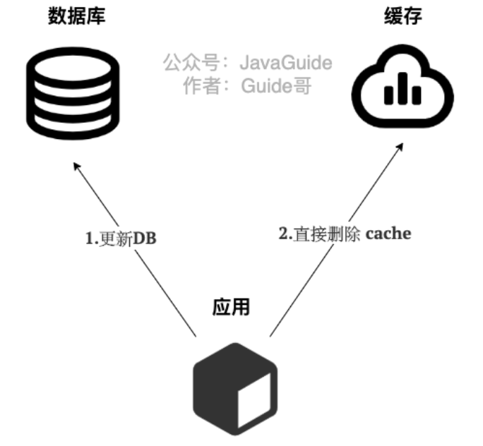
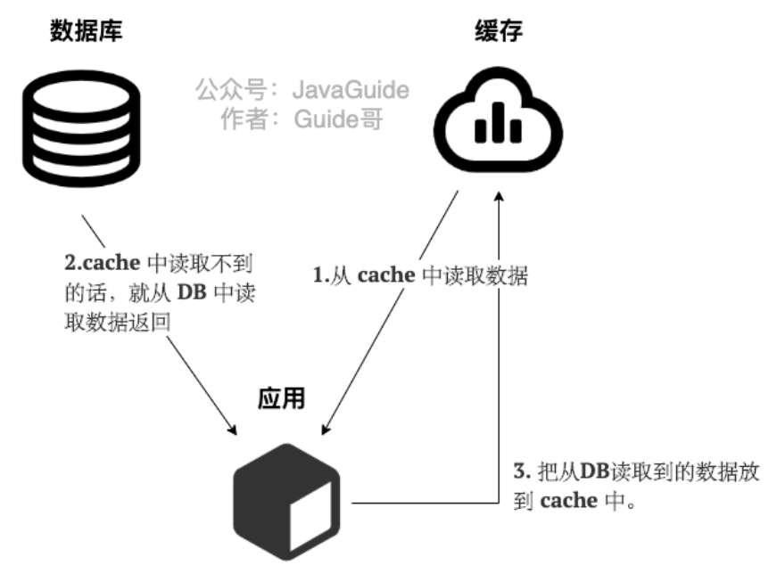
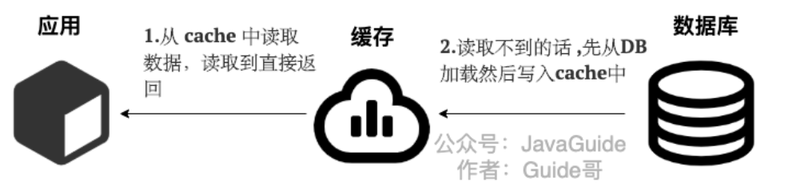

### Cache Aside Pattern（旁路缓存模式）

<font color=red>旁路缓存模式是我们平时使用的比较多的缓存读写模式，他主要适用于读请求比较多的场景</font>

旁路缓存模式中服务端需要同时维系DB和Cache，并且是以DB的结果为准

旁路缓存模式的读写策略是

- **对于写请求**

  - 先更新DB
  - 然后直接删除缓存

  

- **对于读请求**

  - 从cache中读取数据，如果能够读到，那么直接返回
  - cache中读取不到的话，就去数据库中读取数据返回
  - 再把数据放到cache中

  

  > 在写数据的过程中，可以先删除cache，再更新DB吗？

  答案是否定的，因为**这样会造成缓存和数据库数据不一致问题**，为什么呢？比如请求1先写数据A，请求2随后读数据A的话就很有可能产生数据不一致的问题，这个过程可以被简述成

  ```java
  请求1先把cache中的数据A的缓存删除 -> 请求2从DB中读取数据 -> 请求1修改DB中的A数据 -> 请求2将数据写入缓存
  // 从而导致了数据库和缓存中的数据是不一致的    
  ```

  如果使用先更新数据库DB，再删除Cache就不会产生数据不一致问题吗？

  答案是理论上也是会产生的数据不一致现象，不过概率非常小，因为缓存的写入速度是比数据库的写入速度快很多

  比如请求1先读数据 A，请求2随后写数据A，并且数据A不在缓存中的话也有可能产生数据不一致性的问题。这个过程可以简单描述为

  ```java
  请求1从DB中读取数据A -> 请求2更新数据A到数据库并删除cache中的A数据 -> 请求1将数据A写入到cache中
  // 上面这种情况下也会产生数据不一致现象    
  // 因为数据库的写入速度要远小于缓存的写入速度，所以通常顺序是
  //    请求1从DB中读取数据A -> 请求1将数据A写入到cache中 -> 请求2更新A到数据库中并删除cache中的A数据
  // 假设数据A在缓存中的话，更不会产生数据库和缓存数据不一致的问题了
  // 读请求直接在缓存中返回了，写请求更新完DB之后，然后才回去删除缓存，然后再通过之后的读请求将数据A写入到缓存中    
  ```


**旁路缓存模式（Cache Aside Pattern）的缺点**

- **缺陷1：首次请求的数据不一定在cache中**

  解决办法：可以将热点数据提前放在cache中

- **缺陷2：写操作比较频繁的话会导致cache中的数据被频繁的删除，这样会影响缓存的命中率**

  解决办法：

  - 数据库和缓存中数据强一致场景：更新DB的同时更新cache，不过我们需要加一个分布式锁/锁来保证更新cache的时候不存在线程安全问题
  - 可以短暂允许数据库和缓存中数据不一致的场景：更新DB的时候同样更新缓存，但是给缓存加一个比较短的过期时间，这样的话就可以保证即使数据不一致的话影响也比较小


### Read/Write Through Pattern（读写穿透模式）

读写穿透模式中是把cache当作了主要数据存储，cache负责数据读取和写入DB，从而减轻应用程序的职责

这种策略在平时开发的时候比较少见，抛去性能方面的影响，大概率是我们经常使用的分布式缓存redis并没有提供cache将数据写入DB的功能

读写穿透模式的读写策略是：

- **对于写请求**

  - 先查cache，cache中没有的话直接直接写入DB
  - cache中存在的话，先更新cache，然后cache服务自己去更新DB（同步更新cache和DB）

  

- **对于读请求**

  - 从cache中读取数据，读取到就直接返回
  - 读取不到的话，先从DB加载，写入到cache后返回响应

  


读写穿透模式实际上是在旁路缓存模式上加了一层封装，在旁路缓存模式中，发生读请求的时候，如果cache中不存在对应的数据，那么就去DB中读取，然后由客户端自己负责将数据保存到缓存中，而读写穿透模式则是cache服务自己将数据写入到缓存中的，这对客户端来说是透明的

和旁路缓存模式一样，读写穿透模式也存在第一次访问数据不在缓存中的问题，对于热点数据可以提前放入缓存中


### Write Behind Pattern（异步缓存写入）

Write Behind Pattern和Read/Write Through Pattern很相似，都是由cache服务来负责cache和DB的读写

但是这两个又有很大的不同，读写穿透模式中是同步更新cache和DB的，而**异步缓存写入模式则是只更新缓存，不直接DB，而是改为异步批量的方式来更新DB**

很明显，这种方式对数据的一致性带来了更大的挑战，比如cache数据还没有异步更新DB之前，cache服务就先挂掉了

> 这种策略在我们平时开发过程中也非常非常少见，但是不代表它的应用场景少，比如消息队列中消息的异步写入磁盘、MySQL 的 InnoDB Buffer Pool 机制都用到了这种策略。 

**异步缓存写入下DB的写性能非常高，非常适合一些数据经常变化但是对于数据一致性要求没有那么高的场景，比如浏览量、点赞量**

