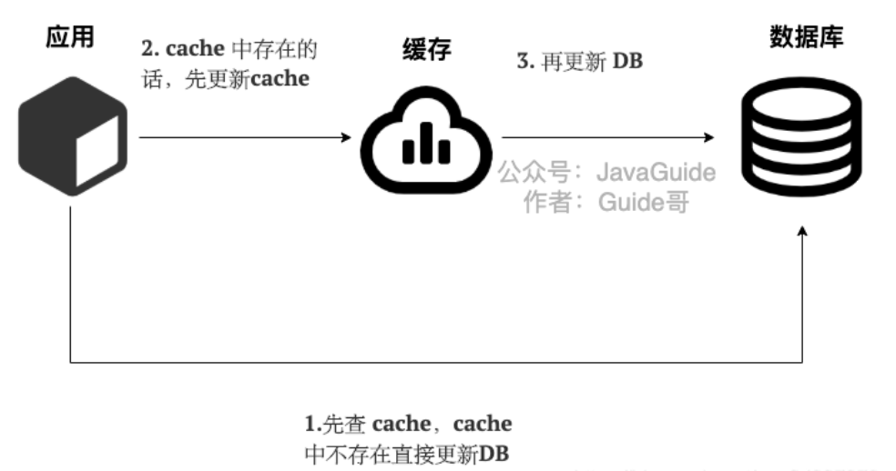

### Cache Aside Pattern（旁路缓存模式）

<font color=red>旁路缓存模式是我们平时使用的比较多的缓存读写模式，他主要适用于读请求比较多的场景</font>

旁路缓存模式中服务端需要同时维系DB和Cache，并且是以DB的结果为准

旁路缓存模式的读写策略是

- **对于写请求**

  - 先更新DB
  - 然后直接删除缓存

  

- **对于读请求**

  - 从cache中读取数据，如果能够读到，那么直接返回
  - cache中读取不到的话，就去数据库中读取数据返回
  - 再把数据放到cache中

  

  > 在写数据的过程中，可以先删除cache，再更新DB吗？

  答案是否定的，因为**这样会造成缓存和数据库数据不一致问题**，为什么呢？比如请求1先写数据A，请求2随后读数据A的话就很有可能产生数据不一致的问题，这个过程可以被简述成

  ```java
  请求1先把cache中的数据A的缓存删除 -> 请求2从DB中读取数据 -> 请求1修改DB中的A数据 -> 请求2将数据写入缓存
  // 从而导致了数据库和缓存中的数据是不一致的    
  ```

  如果使用先更新数据库DB，再删除Cache就不会产生数据不一致问题吗？

  答案是理论上也是会产生的数据不一致现象，不过概率非常小，因为缓存的写入速度是比数据库的写入速度快很多

  比如请求1先读数据 A，请求2随后写数据A，并且数据A不在缓存中的话也有可能产生数据不一致性的问题。这个过程可以简单描述为

  ```java
  请求1从DB中读取数据A -> 请求2更新数据A到数据库并删除cache中的A数据 -> 请求1将数据A写入到cache中
  // 上面这种情况下也会产生数据不一致现象    
  // 因为数据库的写入速度要远小于缓存的写入速度，所以通常顺序是
  //    请求1从DB中读取数据A -> 请求1将数据A写入到cache中 -> 请求2更新A到数据库中并删除cache中的A数据
  // 假设数据A在缓存中的话，更不会产生数据库和缓存数据不一致的问题了
  // 读请求直接在缓存中返回了，写请求更新完DB之后，然后才回去删除缓存，然后再通过之后的读请求将数据A写入到缓存中    
  ```


**旁路缓存模式（Cache Aside Pattern）的缺点**

- **缺陷1：首次请求的数据不一定在cache中**

  解决办法：可以将热点数据提前放在cache中

- **缺陷2：写操作比较频繁的话会导致cache中的数据被频繁的删除，这样会影响缓存的命中率**

  解决办法：

  - 数据库和缓存中数据强一致场景：更新DB的同时更新cache，不过我们需要加一个分布式锁/锁来保证更新cache的时候不存在线程安全问题
  - 可以短暂允许数据库和缓存中数据不一致的场景：更新DB的时候同样更新缓存，但是给缓存加一个比较短的过期时间，这样的话就可以保证即使数据不一致的话影响也比较小


### Read/Write Through Pattern（读写穿透模式）

读写穿透模式中是把cache当作了主要数据存储，cache负责数据读取和写入DB，从而减轻应用程序的职责

这种策略在平时开发的时候比较少见，抛去性能方面的影响，大概率是我们经常使用的分布式缓存redis并没有提供cache将数据写入DB的功能

读写穿透模式的读写策略是：

- **对于写请求**

  - 先查cache，cache中没有的话直接写入DB
  - cache中存在的话，先更新cache，再更新DB

  

- **对于读请求**

  - 从cache中读取数据，读取到就直接返回
  - 读取不到的话，先从DB加载，写入到cache后返回响应

  


读写穿透模式实际上是在旁路缓存模式上加了一层封装，在旁路缓存模式中，发生读请求的时候，如果cache中不存在对应的数据，那么就去DB中读取，然后由客户端自己负责将数据保存到缓存中，而读写穿透模式则是cache服务自己将数据写入到缓存中的，这对客户端来说是透明的

和旁路缓存模式一样，读写穿透模式也存在第一次访问数据不在缓存中的问题，对于热点数据可以提前放入缓存中


### Write Behind Pattern（异步缓存写入）

Write Behind Pattern和Read/Write Through Pattern很相似，都是由cache服务来负责cache和DB的读写

但是这两个又有很大的不同，读写穿透模式中是同步更新cache和DB的，而**异步缓存写入模式则是只更新缓存，不直接DB，而是改为异步批量的方式来更新DB**

很明显，这种方式对数据的一致性带来了更大的挑战，比如cache数据还没有异步更新DB之前，cache服务就先挂掉了

> 这种策略在我们平时开发过程中也非常非常少见，但是不代表它的应用场景少，比如消息队列中消息的异步写入磁盘、MySQL 的 InnoDB Buffer Pool 机制都用到了这种策略。 

**异步缓存写入下DB的写性能非常高，非常适合一些数据经常变化但是对于数据一致性要求没有那么高的场景，比如浏览量、点赞量**


### 如何保证缓存与数据库双写时的数据一致性

正如上面的旁路缓存模式那样，先写数据库，在删除缓存，但是这样会出现短暂的数据不一致问题

| 问题场景                                       | 描述                                                         | 解决                                                         |
| ---------------------------------------------- | ------------------------------------------------------------ | ------------------------------------------------------------ |
| 先写缓存，再写数据库，缓存写成功，数据库写失败 | 缓存写成功，但写数据库失败或者响应延迟，则下次读取（并发读）缓存时，就出现脏读？？ | 这个写缓存的方式，本身就是错误的，需要改为先写数据库，把旧缓存置为失效；读取数据的时候，如果缓存不存在，则读取数据库再写缓存 |
| 先写数据库，再写缓存，数据库写成功，缓存写失败 | 写数据库成功，但写缓存失败，则下次读取（并发读）缓存时，则读不到数据 | 缓存使用时，假如读缓存失败，先读数据库，再回写缓存的方式实现 |
| 需要缓存异步刷新                               | 指数据库操作和写缓存不在一个操作步骤中，比如在分布式场景下，无法做到同时写缓存或需要异步刷新（补救措施）时候 | 确定哪些数据适合此类场景，根据经验值确定合理的数据不一致时间，用户数据刷新的时间间隔 |


### 如何保证强一致性

保证缓存和数据库强一致性的方法有以下几种：

1. 采用两阶段提交（Two-Phase Commit，2PC）协议：2PC是一种分布式事务协议，可以保证缓存和数据库的强一致性。在写入数据时，先将数据写入缓存，然后开启事务写入数据库，最后使用2PC协议来提交事务。如果写入数据库失败，则回滚缓存中的数据。

2. 使用缓存锁：在写入数据时，使用缓存锁来保证同一时间只有一个线程可以写入数据，避免多个线程同时写入数据导致数据不一致。可以使用**分布式锁**来实现。

3. 使用数据库锁：在写入数据时，使用数据库锁来保证同一时间只有一个线程可以写入数据，避免多个线程同时写入数据导致数据不一致。可以使用数据库的行级锁或表级锁来实现。

4. 使用消息队列：在写入数据时，将数据写入消息队列中，然后由消费者将数据写入缓存和数据库中。可以使用消息队列来保证缓存和数据库的强一致性。

5. 使用数据库的触发器：在写入数据库时，使用数据库的触发器来将数据写入缓存中。当数据库中的数据发生变化时，触发器会将数据写入缓存中，从而保证缓存和数据库的强一致性。

总之，在保证缓存和数据库强一致性的场景下，需要采取多种措施来保证数据的一致性。需要根据实际情况选择最合适的措施，并进行细致的设计和实现。


### 为什么是删除缓存，而不是更新缓存呢

删除一个数据，相比更新一个数据更加轻量级，出问题的概率更小。在实际业务中，**缓存的数据可能不是直接来自数据库表，也许来自多张底层数据表的聚合**。

比如商品详情信息，在底层可能会关联商品表、价格表、库存表等，如果更新了一个价格字段，那么就要更新整个数据库，还要关联的去查询和汇总各个周边业务系统的数据，这个操作会非常耗时。 从另外一个角度，不是所有的缓存数据都是频繁访问的，更新后的缓存可能会长时间不被访问，所以说，从计算资源和整体性能的考虑，更新的时候删除缓存，等到下次查询命中再填充缓存，是一个更好的方案。

系统设计中有一个思想叫 **Lazy Loading**，适用于那些加载代价大的操作，删除缓存而不是更新缓存，就是懒加载思想的一个应用。


 
