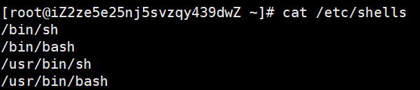
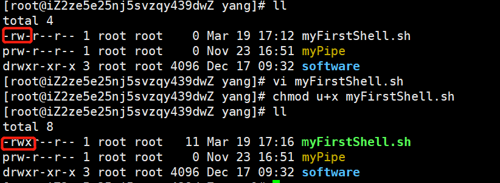
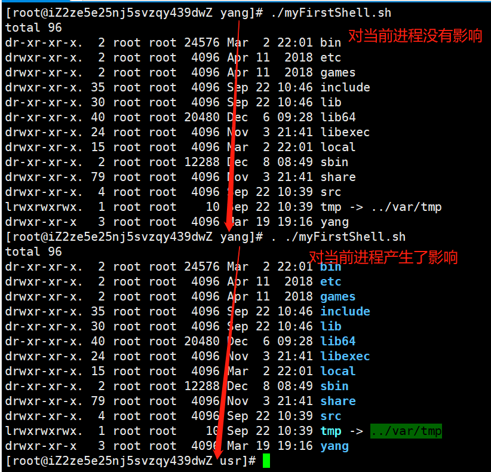
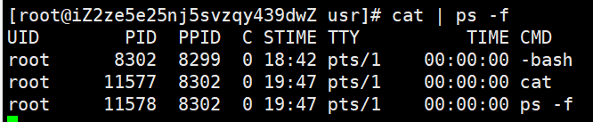
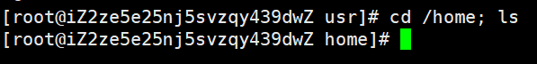

### 什么是shell

shell是命令解释器，用于解释用户对操作系统的操作，简单的理解就是shell会把用户所执行的命令，翻译给Linux内核，Linux内核再根据命令执行的结果返回给shell，然后shell在显示给用户看

可以通过`cat /etc/shells`来查看Linux系统支持的shell



一般常用的就是`/bin/bash`


### 入门简单的shell编写

编写Python、PHP脚本都需要掌握特定的语言函数，而编写shell脚本只需要掌握Linux命令，因为shell脚本就是由多个Linux命令组成的，通过将多个Linux命令合并保存成一个脚本文件，可直接给其他人使用

> 需要注意的是，Linux中可以使用组合命令，比如`cd /bin; ls`，通过`;`来分割，也就是先执行`cd /bin`，再执行`ls`


#### 编写shell脚本的流程

如果某些命令经常会被其他人使用，那么我们可以把这些命令通过shell脚本来保存起来

- **建立shell脚本文件，使用`bash`的shell通常是以`.sh`作为后缀**

  ```shell
  [root@iZ2ze5e25nj5svzqy439dwZ yang]# touch myFirstShell.sh
  ```

- **编写shell脚本，通过`vi`命令来编辑脚本文件**

  ```shell
  cd /usr/
  ls -l  # 如果直接写ll的话，会识别不出这条命令
  ```

  需要注意的是shell脚本里面的每条语句之间不需要加分号`;`，每条命令采用换行的方式，执行shell脚本的时候就会顺序执行

- **给予shell脚本执行权限**，因为建立文件时默认是没有执行权限的，所以我们需要给予脚本执行权限，脚本才能够运行

  ```shell
  chmod u+x myFirstShell.sh
  ```

  

  

- **执行shell脚本，用bash执行shell脚本**，执行的结果就和在外边单行执行命令的结果是一样的


#### 声明Shell解释器

假设要把这个Shell脚本在与不同的系统下运行的时候就会有问题，如果系统默认的Shell不是bash，执行这个Shell脚本可能会失败，因为可能会有bash的一些Shell特性在里边。

所以我们可以在shell脚本文件的第一行声明他是使用的哪个shell，书写的格式如下

```shell
#!/bin/bash
```

这样写的好处是，执行shell脚本的时候，**会自动告诉系统用bash解释器的Shell来执行脚本**

当我们的文件变成了

```shell
#!/bin/bash
cd /usr
ls 
```

之后，再次执行这个shell脚本文件，就容易多了，直接使用命令`./myFirstShell.sh`即可


#### <a id = 'link1'>不同的脚本执行方式</a>

执行Shell脚本通常有以下四种方法：

- 方式一：`bash ./test.sh`
- 方式二：`./test.sh`
- 方式三：`source ./test.sh`
- 方式四：`../test.sh`

> 需要注意的是`./`表示的是当前文件夹下

**执行方式的区别**

方式一和方式二都会在当前终端下面产生一个子进程来运行脚本，也就是说对当前环境是没有影响的，比如`bash ./test.sh`就会在当前进程下产生一个`bash`子进程来运行脚本，如果方式二的第一行是`#!/bin/sh`，那么在当前终端下面就会产生一个`sh`子进程

方式三和方式四是通过当前终端来执行脚本的，不会产生子进程，所以是对当前进程有影响的




#### 管道符

管道实际上就是进程之间的通信工具，那么用在Linux命令中主要是方便两条命令之间可以通信

Shell编程中通常用到的是匿名管道，匿名管道符是`|`，主要是把两个应用程序连接在一起，然后把第一个应用程序的输出来作为第二个应用程序的输入。如果还有第三个应用程序的话，可以把第二个程序的输出，作为第三个应用程序的输入，以此类推。

```shell
[root@iZ2ze5e25nj5svzqy439dwZ usr]# ls | grep yang
yang
```


#### 管道符与分号符

- 在使用管道符的时候，会为两条命令分别产生子进程，因此也不会影响到当前环境

  

  > 可以看到，bash、cat、ps -f的进程ID都是不同的，这就表示着产生了不同的进程，不会影响当前环境

  

- 分号的作用就是连接两条命令，这样的话会影响到当前环境的命令

  


#### 输入输出重定向

一个进程默认会打开标准输入、标准输出、错误输出三个文件描述符

重定向可以让我们的程序的标准输出、错误输出的信息重定向到文件中，那么这里还可以将文件的内容代替键盘作为一种标准输入的方式

```shell
# 重定向符号
   - 输入重定向 <
   - 输出重定向 >, >>, 2>, &> 
```

**输入重定向符`<`会把文件的内容当做参数输入到进程**，如下例子：

```shell
[root@omp120 home]# cat file.txt 
hello
shell
[root@omp120 home]# read a < file.txt 
[root@omp120 home]# echo $a
hello
```


file.txt文件的内容是hello，上述的例子就是把file.txt的内容的第一行重定向到a这个变量，并把a变量打印出来。

**输出重定向符`>`会先把文件内容清空，然后再输出内容重定向到指定文件中，如果文件不存在则创建**，如下例子

```shell
[root@iZ2ze5e25nj5svzqy439dwZ yang]# ls
myFirstShell.sh  myPipe  software  test.file
[root@iZ2ze5e25nj5svzqy439dwZ yang]# echo "hello,shell" > test2.file
[root@iZ2ze5e25nj5svzqy439dwZ yang]# cat test2.file
hello,shell
```

**输出重定向符`>>`会把输出内容<font color=red>追加</font>到文件中**，该文件不会被清空，并且如果文件不存在的话也会创建文件，如下例子

```shell
[root@iZ2ze5e25nj5svzqy439dwZ yang]# echo "bye,shell" >> test2.file
[root@iZ2ze5e25nj5svzqy439dwZ yang]# cat test2.file 
hello,shell
bye,shell
```

**输出重定向符`2>`是把进程错误输出的内容重定向到指定的文件里，也会清空文件内容**，如下例子

```shell
[root@iZ2ze5e25nj5svzqy439dwZ yang]# abs
-bash: abs: command not found
[root@iZ2ze5e25nj5svzqy439dwZ yang]# abs 2> test2.file
[root@iZ2ze5e25nj5svzqy439dwZ yang]# cat test2.file 
-bash: abs: command not found
```

**输出重定向符`&>`的作用是无论进程输出的信息是正确的还是错误的，都会重定向到指定的文件里，也会清空文件**，如下例子

```shell
[root@lincoding home]# abc &> file.txt
[root@lincoding home]# cat file.txt 
-bash: abc: command not found
[root@lincoding home]# free -m &> file.txt
[root@lincoding home]# cat file.txt 
             total       used       free     shared    buffers     cached
Mem:           980        918         62          0         71        547
-/+ buffers/cache:        299        681
Swap:         1983          0       1983
```

> 所以，可以看出来，除了`>>`是追加写，其余的都是覆盖写


**输入和输出重定向的组合使用主要应用于在Shell脚本当中产生新的配置文件的场景**，如下Shell脚本例子：

```shell
#!/bin/bash
cat > /usr/yang/myThirdShell.sh << EOF
echo "hello, bash shell"
EOF
```

上面这段脚本的含义是：把cat命令的输出重定向到`/root/myThirdShell.sh`脚本文件中，并且用输入重定向把`EOF`作为脚本结尾，那么通过执行这个脚本，就会产生一个内容为`echo "hello, bash shell"`文件名为`myThirdShell.sh`的脚本文件

```shell
[root@iZ2ze5e25nj5svzqy439dwZ yang]# vi test.sh
[root@iZ2ze5e25nj5svzqy439dwZ yang]# chmod u+x test.sh
[root@iZ2ze5e25nj5svzqy439dwZ yang]# ll
total 20
-rwxr--r-- 1 root root   26 Mar 19 19:16 myFirstShell.sh
prw-r--r-- 1 root root    0 Nov 23 16:51 myPipe
drwxr-xr-x 3 root root 4096 Dec 17 09:32 software
-rw-r--r-- 1 root root  204 Mar 19 20:24 test2.file
-rw-r--r-- 1 root root   12 Mar 19 20:08 test.file
-rwxr--r-- 1 root root   64 Mar 19 20:32 test.sh
[root@iZ2ze5e25nj5svzqy439dwZ yang]# ./test.sh 
[root@iZ2ze5e25nj5svzqy439dwZ yang]# ll
total 24
-rwxr--r-- 1 root root   26 Mar 19 19:16 myFirstShell.sh
prw-r--r-- 1 root root    0 Nov 23 16:51 myPipe
-rw-r--r-- 1 root root   20 Mar 19 20:32 myThirdShell.sh
drwxr-xr-x 3 root root 4096 Dec 17 09:32 software
-rw-r--r-- 1 root root  204 Mar 19 20:24 test2.file
-rw-r--r-- 1 root root   12 Mar 19 20:08 test.file
-rwxr--r-- 1 root root   64 Mar 19 20:32 test.sh
[root@iZ2ze5e25nj5svzqy439dwZ yang]# chmod u+x myThirdShell.sh 
[root@iZ2ze5e25nj5svzqy439dwZ yang]# ./myThirdShell.sh 
hello, shell
```


#### 变量赋值

我们在使用Linux命令或者脚本的时候，会有一些输出，那么这些输出的信息可以用变量临时存储，以备我们下一条命令或脚本使用

变量的定义和其他语言一样，建议用一个有意义的英文单词来代表变量，而不是使用简单的字母`a`,`b`这类的变量来定义，因为我们写好shell脚本实际上也是要给人看的，所以我们定义好的变量，是希望变量有具体的含义，能让阅读shell脚本的人能够轻松的明白

变量的命名规则：可以含有字母、数字、下划线，但是不能以数字开头

**在shell脚本里面的变量是不区分变量类型的**，**变量的赋值规则是：变量名=变量值，等号两边都不能有空格**，因为出现空格shell会认为前面的是命令而不是变量

- **使用`let`为变量赋值**

  ```shell
  [root@iZ2ze5e25nj5svzqy439dwZ ~]# let num=10+10
  [root@iZ2ze5e25nj5svzqy439dwZ ~]# echo ${num}
  20
  ```

- **将命令赋值给变量**

  ```shell
  [root@iZ2ze5e25nj5svzqy439dwZ ~]# ls_command=ls
  [root@iZ2ze5e25nj5svzqy439dwZ ~]# ${ls_command}
  Line2.pcap  Line.pcap  PacketsForWebex.pcap  ssr.sh  test.sql
  ```

- **将命令结果赋值给变量，使用`$()`或者``**

  ```shell
  [root@iZ2ze5e25nj5svzqy439dwZ ~]# file_list=$(ls /root)
  [root@iZ2ze5e25nj5svzqy439dwZ ~]# echo ${file_list}
  Line2.pcap Line.pcap PacketsForWebex.pcap ssr.sh test.sql
  ```

  使用这种方式的好处避免重复执行相同的指令，增加服务器开销，因为当shell执行外部命令的时候，会创建一个新的进程来执行命令，如果把命令执行的结果放到变量中，只需要执行一次命令

  ```shell
  [root@iZ2ze5e25nj5svzqy439dwZ ~]# touch test.aaa
  [root@iZ2ze5e25nj5svzqy439dwZ ~]# ls
  Line2.pcap  Line.pcap  PacketsForWebex.pcap  ssr.sh  test.aaa  test.sql
  [root@iZ2ze5e25nj5svzqy439dwZ ~]# echo ${file_list}
  Line2.pcap Line.pcap PacketsForWebex.pcap ssr.sh test.sql    # 能够看到，这种方式仅仅是把当前命令的执行结果放入到变量中，其实也很好理解，变量中存储的是上一次命令执行的结果
  ```

- **变量值有空格等特殊字符可以包含在双引号和单引号中**

  ```shell
  [root@iZ2ze5e25nj5svzqy439dwZ ~]# var=1 2 3       # 有空格，把2当成了命令
  -bash: 2: command not found
  [root@iZ2ze5e25nj5svzqy439dwZ ~]# var="1 2 3"
  [root@iZ2ze5e25nj5svzqy439dwZ ~]# echo ${var}
  1 2 3
  [root@iZ2ze5e25nj5svzqy439dwZ ~]# var='1 2 3 4 '
  [root@iZ2ze5e25nj5svzqy439dwZ ~]# echo ${var}
  1 2 3 4
  ```

- **当字符串中需要有单引号的时候，需要使用双引号来定义字符串**

  **当字符串中需要有双引号的时候，需要使用单引号来定义字符串**

  ```shell
  [root@lincoding ~]# var='"a" "b" "c"'
  [root@lincoding ~]# echo $var
  "a" "b" "c"
  [root@lincoding ~]# var="'a' 'b' 'c'"
  [root@lincoding ~]# echo $var
  'a' 'b' 'c'
  ```

- 双引号和单引号的区别就是：**单引号里面的字符串不管是不是特殊字符都会被解释成普通的字符串**

  ```shell
  [root@iZ2ze5e25nj5svzqy439dwZ ~]# var="hello"
  [root@iZ2ze5e25nj5svzqy439dwZ ~]# string="$var, shell"
  [root@iZ2ze5e25nj5svzqy439dwZ ~]# echo $string
  hello, shell
  [root@iZ2ze5e25nj5svzqy439dwZ ~]# string2='$var, shell'
  [root@iZ2ze5e25nj5svzqy439dwZ ~]# echo $string2
  $var, shell
  ```


#### 变量引用

- `${变量名}`称作为对变量的引用，在某些情况下也可以省略成`$变量名`

- `echo ${变量名}`查看变量的值

  > `${变量名}`和`$变量名`的区别
  >
  > ```shell
  > [root@lincoding ~]# echo $string9
  > 
  > [root@lincoding ~]# echo ${string}9
  > hello Shell9
  > ```
  >
  > 如果没有花括号的话，Shell会把string9当作一个变量名；有花括号的引用，则在打印`string`变量之后，尾部多增加一个9

  

#### 变量的作用范围

我们定义的**变量只会在当前Shell环境下生效**，当切换成另外一个Shell的时候，之前定义好的变量是不生效的

```shell
[root@iZ2ze5e25nj5svzqy439dwZ yang]# cat test2.sh
#!/bin/bash
str="hello, shell"
echo $str
[root@iZ2ze5e25nj5svzqy439dwZ yang]# ./test2.sh
hello, shell
[root@iZ2ze5e25nj5svzqy439dwZ yang]# echo $str    # 在当前终端引用shell脚本中定义的变量，输出空值

```

从上面可以看出，变量`str`的作用范围只在Shell脚本里

如果在终端中定义一个变量，Shell脚本中引用该变量会生效吗

```shell
[root@lincoding ~]# mystr="abc"
[root@lincoding ~]# cat test.sh
#!/bin/bash

echo ${mystr}
[root@lincoding ~]# ./test.sh

[root@lincoding ~]# bash test.sh

[root@lincoding ~]# . test.sh
abc
[root@lincoding ~]# source test.sh
abc
```

在<a href='#link1'>脚本执行方式那一部分</a>就说到了，后两种方式不会产生子进程，会直接在当前终端下面执行脚本，所以也在变量的作用范围内，所以引用变量是生效了的

**export导出变量：**假设想让<font color='blue'>父进程定义的变量在子进程或者子Shell中也同时生效的话</font>，那么需要用`export`将变量导出，使用的具体例子如下：

```shell
[root@lincoding ~]# mystr="abc"
[root@lincoding ~]# bash test.sh

[root@lincoding ~]# export mystr
[root@lincoding ~]# bash test.sh
abc
[root@lincoding ~]# ./test.sh
abc
```

可见在使用`export`后，终端定义的变量，`test.sh`脚本里引用了该变量是生效的，也就是说子进程可以获取父进程定义的变量的值

如果用完了该变量，想把**变量清空，则可以使用`unset`**

```shell
[root@lincoding ~]# unset mystr
[root@lincoding ~]# echo ${mystr}

```


#### 环境变量

我们从上面知道了可以通过`export`使得子进程能够读取父进程的变量的值，那么怎么样才能够让每一个进程都能够读到变量的值呢？答案就是通过环境变量，系统有一些默认的配置文件，把变量嵌入到配置文件就可以了。

我们可以通过`env`这个命令来查看系统中内置的环境变量

```shell
[root@lincoding ~]# env
HOSTNAME=lincoding
SHELL=/bin/bash
……
SSH_TTY=/dev/pts/0
USER=root
……
PATH=/usr/local/sbin:/usr/local/bin:/sbin:/bin:/usr/sbin:/usr/bin:/root/bin
LANG=en_US.UTF-8
SHLVL=1
HOME=/root
LOGNAME=root
……

# 可以通过变量的引用查看某个单独的环境变量的值，环境变量都是大写
[root@iZ2ze5e25nj5svzqy439dwZ yang]# echo $HOSTNAME
iZ2ze5e25nj5svzqy439dwZ
```

环境变量主要保存在以下四个文件和一个目录中

- `/etc/profile`
- `/etc/profile.d/`
- `~/.bash_profile`
- `~/.bashrc`
- `/etc/bashrc`

保存在`/etc`目录下的配置文件，都是所有用户通用的配置，不管是root用户还是普通用户

保存在`~/`目录下的配置文件，是保存特定用户的配置，例如在某些环境下只有root用户才能使用

我们知道，**在重新打开一个终端或者切换不同用户时，环境变量都会被重新初始化完成**

那么在重新打开新的终端或切换不同用户时，上述配置文件的**加载顺序**是如何的呢？

- 在使用`su - root`切换用户时，加载的配置文件

  ```shell
  [root@lincoding ~]# su - root
  /ect/profile
  ~/.bash_profile
  ~/.bashrc
  /ect/bashrc
  ```

- 在使用`su root`切换用户时，加载的配置文件

  ```shell
  [root@lincoding ~]# su root
  ~/.bashrc
  /ect/bashrc
  ```

可见`su`和`su -`切换用户加载配置文件是不同的，最好使用`su -`的方式切换用户，因为这相当于重新登录Shell，就会把所有配置重新加载一次


#### PATH环境变量

`PATH`系统环境变量是定义了命令的搜索路径，意思就是**我们输入的Linux命令，都会在`PATH`变量定义的路径里寻找**，若存在则执行命令，若不存在则报错命令不存在，其实所谓的不存在，就是在搜索路径里没有找到对应的命令

```shell
[root@iZ2ze5e25nj5svzqy439dwZ yang]# echo $PATH
/usr/local/sbin:/usr/local/bin:/usr/sbin:/usr/bin:/root/bin

# 添加自定义搜索路径
[root@iZ2ze5e25nj5svzqy439dwZ yang]# PATH=$PATH:/home
[root@iZ2ze5e25nj5svzqy439dwZ yang]# echo $PATH
/usr/local/sbin:/usr/local/bin:/usr/sbin:/usr/bin:/root/bin:/home
```

不过上面这种的方式新增的自定义路径是PATH变量，只在当前终端作用范围内生效，其他进程是不生效的


#### 预定义变量

- **`$?`表示的是上一条命令执行的状态码，0代表正常，非0代表出错**

  ```shell
  [root@iZ2ze5e25nj5svzqy439dwZ yang]# echo $?
  0
  [root@iZ2ze5e25nj5svzqy439dwZ yang]# cd /file
  -bash: cd: /file: No such file or directory
  [root@iZ2ze5e25nj5svzqy439dwZ yang]# echo $?
  1
  ```

- **`$$`表示查看当前进程的pid，`$0`表示查看当前进程的名称**

  ```shell
  [root@iZ2ze5e25nj5svzqy439dwZ yang]# cat myShell4.sh 
  #!/bin/bash
  
  echo $$  # 当前进程的pid
  echo $0  # 当前进程名称
  [root@iZ2ze5e25nj5svzqy439dwZ yang]# ./myShell4.sh 
  3517
  ./myShell4.sh
  [root@iZ2ze5e25nj5svzqy439dwZ yang]# . ./myShell4.sh 
  30881
  -bash
  [root@iZ2ze5e25nj5svzqy439dwZ yang]# ps -f |grep bash
  root      3534 30881  0 14:36 pts/0    00:00:00 grep --color=auto bash
  root     30881 30878  0 12:56 pts/0    00:00:00 -bash
  ```

  可以看到，不同的执行方式，`$$,$0`的结果也都不一样

- **位置参数用于读取执行shell脚本时传入的参数的值**

  ```shell
  [root@iZ2ze5e25nj5svzqy439dwZ yang]# cat myShell5.sh
  #!/bin/bash
  
  echo $1   # 传入的第一个参数
  echo $2   # 传入的第二个参数
  echo $#   # 获得传入参数的个数
  [root@iZ2ze5e25nj5svzqy439dwZ yang]# ./myShell5.sh 12 "hello,shell"
  12
  hello,shell
  2
  [root@iZ2ze5e25nj5svzqy439dwZ yang]# ./myShell5.sh aa
  aa
  
  1
  [root@iZ2ze5e25nj5svzqy439dwZ yang]# ./myShell5.sh aa bb cc
  aa
  bb
  3
  ```

  


