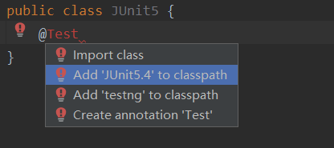
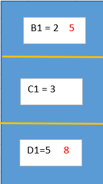

### Spring框架概述

1. `Spring`是轻量级的开源的`JavaEE`框架，这里的轻量级指的是使用`Spring`框架不需要引入大量的其他的`jar包`、依赖等，而且`Spring`本身也很小
2. `Spring`有两个核心部分：`IOC`和`AOP`
   1. `IOC`：控制反转，把创建对象和对象之间的调用的过程交给`Spring`来管理，也就是说不需要在程序中使用`new`来创建对象了，使用的是`spring`的方式
   2. `AOP`：面向切面，不需要修改源代码便可以增强功能
3. Spring 特点 （1）方便解耦，简化开发 （2）`Aop` 编程支持 （3）方便程序测试 （4）方便和其他框架进行整合 （5）方便进行事务操作 （6）降低 `API` 开发难度

`Spring`官方网址：`spring.io`

### `IOC`底层原理

- `xml`解析
- 工厂模式
- 反射

`IOC`控制反转指的是把创建对象和对象之间的调用的过程交给`Spring`来管理，不使用`Spring`管理的方式如下：


很显然，这种方式的耦合度太高了，`UserDao`一旦发生变化（无论是代码逻辑还是文件位置），都会对`UserService`造成一定影响。而在`Spring`中，**控制反转采用了工厂模式来降低`UserDao和UserService`之间的耦合度**，如下：


#### `IOC`过程

1. **在`XML`配置文件中，配置想要创建的对象**

​      `<bean id = "dao" class = "com.atguigu.UserDao"></bean>`

​      `id`表示`UserDao`对象的一个标识，在解析`xml`文件时，获取`UserDao`对象就需要使用这个`id`

​      `class`表示对象类，值要为对象类所在的路径

2. **通过创建工厂类来进一步解耦**

   ```java
   class UserFactory {
       public static UserDao getDao(){
           String classValue = class的属性值   // xml文件解析,得到的是class属性的值
           Class clazz = Class.forName(classValue);  // 通过反射创建对象
           return (UserDao)class.newInstance();
       } 
   }
   ```

   虽然经过上述的过程，`UserService`和`UserDao`仍然存在耦合，但是已经明显降低了，比如更改了`UserDao`的位置，只需要在配置文件中更改即可，而不需要变动`UserFactory`和`UserDao`中的代码

   下面是`test`代码中对配置文件的读取测试

   ```java
   package com.atguigu.spring.test;
   
   import com.atguigu.spring.User;
   import org.junit.Test;
   import org.springframework.context.ApplicationContext;
   import org.springframework.context.support.ClassPathXmlApplicationContext;
   
   public class testUser {
   
       @Test
       public void testAdd() {
           // 加载Spring配置文件
           ApplicationContext applicationContext = new ClassPathXmlApplicationContext("bean.xml");
           // 获取配置文件中的对象
           User user = applicationContext.getBean("user", User.class);
           user.add();
       }
   }
   ```

   

#### `IOC`接口

- `IOC`的思想是基于==容器==实现的，而容器的底层就是对象工厂
- `Spring`提供了`IOC`容器的实现的两种方式（两个接口）
  - `BeanFactory`：`IOC`容器的基本实现，是`Spring`内部的使用接口，一般不提倡开发人员使用
  - `ApplicationContext`：`BeanFactory`接口的子接口，提供了更加强大的功能，一般提供给开发人员使用
  - **两个接口的区别**：使用`BeanFactory`来加载配置文件创建`IOC`容器的时候，不会创建对象，而是在对象使用的时候才创建出来，也就是常说的延时加载；而使用`ApplicationContext`来加载配置文件创建`IOC`容器的时候，便可以创建出全部的对象，也就是预加载。在项目开发时，通常使用的是`ApplicationContext`，因为在一个`web`项目开发过程中，我们看重的是某些操作的速率，至于对象加载这些事情在服务器启动时加载完成是更好的。

#### `IOC`操作 （Bean管理）

##### `Bean`属性注入

`Bean`管理包括两个方面：

- **对象的创建**

  - 基于`XML`配置文件创建，如下：

  `<bean id="user" class="com.atguigu.spring.User"></bean>`

  在 `spring `配置文件中，使用 `bean` 标签，标签里面添加对应属性，就可以实现对象创建，其中，`id`属性表示唯一标识 ，` class` 属性表示类全路径（包类路径）

  这里需要注意的是在创建`User`对象的时候，**默认的是执行`User`中的无参构造函数**

- **对象属性的注入，依赖注入`DI,Dependency Injection`**

  - **方法 1** ：使用`set`方法进行注入

    - 首先创建类，定义属性和相应的`set`方法，如下：

      ```java
      package com.atguigu.spring;
      
      public class Order {
          private int id;
          private String name;
      
          public void setId(int id) {
              this.id = id;
          }
      
          public void setName(String name) {
              this.name = name;
          }
      }
      ```

    - 在`spring`配置文件中配置对象的创建，并进行属性的注入，如下：

      ```xml
          <bean id="order" class="com.atguigu.spring.Order">
              <!--使用 property 完成属性注入
                  name：类里面属性名称
                  value：向属性注入的值
              -->
              <property name="id" value="1"></property>
              <property name="name" value="tom"></property>
          </bean>
      ```

  - **方法2** ： 使用有参构造函数进行注入

    - 创建类，定义属性以及对应参数的构造函数，如下

      ```java
      package com.atguigu.spring;
      
      public class Book {
          private String name;
          private String author;
          public Book(String name,String author) {
              this.name = name;
              this.author = author;
          }
      }
      ```

    - 在`spring`配置文件中进行配置

      ```xml
          <!--有参构造函数注入属性-->
          <bean id="book" class="com.atguigu.spring.Book">
              <constructor-arg name="name" value="西游记"></constructor-arg>
              <constructor-arg name="author" value="吴承恩"></constructor-arg>
          </bean>
      ```

      在这里需要注意的是，当存在有参的构造函数时，在编写配置文件时，当属性没有写全时会报错，因为默认的是使用无参的构造函数，如下：

      

      

  - **方法 3** ：`p`名称空间注入，本质上还是使用的`set`方法，但是他其实是对方法1的一种简化

    - 在配置文件头部添加`p`名称空间

      

    - 进行属性注入，**在`bean`标签内部进行操作**

      `<bean id="order2" class="com.atguigu.spring.Order" p:id="2" p:name="jenny"></bean>`

- 使用`xml`注入其他类型的属性

1. 向字面量中注入`null`

   ```xml
           <property name="name">
               <null></null>        <!--name属性的value为null-->
           </property>
   ```

2. 向字面量中注入特殊符号

   1. 对特殊符号进行转义 `&lt;&gt;`，这两个分别表示`<`和`>`

      ```xml
      <property name="name" value="&lt;mercy&gt;"></property>
      <!--输出的是<mercy>-->
      ```

   2. 把带有特殊符号的字符串写入`CDATA`中

   ```XML
           <property name="name">
               <value><![CDATA[<<MERCY12*&>>]]></value>
           </property>
   ```


- **注入属性 --- 外部`bean`**

  - 创建两个类`service`和`dao`
  - 在`service`中调用`dao`里面的方法
  - 在`spring`配置文件中进行配置

  ```java
  public class UserService {
      // 创建 UserDao类型的属性
      private UserDao userDao;
  
      public void setUserDao(UserDao userDao) {
          this.userDao = userDao;
      }
  
      public void add () {
          System.out.println("service add.....");
          userDao.add();
      }
  }
  ```

  可以看出，`userDao`是`UserService`的一个属性，因此在使用外部注入的时候使用的是利用`set`方法进行注入，具体的在配置文件中的代码是（利用`ref`标签）：

  ```xml
      <bean id="userService" class="com.atguigu.spring.service.UserService">
          <property name="userDao" ref="userDaoImpl"></property>   <!-- ref 的值必须和要引用bean的id对应-->
      </bean>
      <bean id="userDaoImpl" class="com.atguigu.spring.dao.impl.UserDaoImpl"></bean>
  ```

  ​	

- **注入属性 --- 内部`bean`**

  这里使用一个一对多的关系来演示内部`bean`的注入属性，比如：一个员工对应一个部门，一个部门可以有多个员工

  - 创建一个部门类

  - 创建一个员工实体类，在这个实体类中加入部门类型的属性，如下：

    ```java
    public class Employee {
        private String name;
        private int id;
        private Department department;
    
        public void setName(String name) {
            this.name = name;
        }
    
        public void setId(int id) {
            this.id = id;
        }
    
        public void setDepartment(Department department) {
            this.department = department;
        }
    
        public void show() {
            System.out.println(name + "::" + id + "::" + department);
        }
    }
    ```

  - 在`spring`配置文件中配置

    ```xml
        <bean id="employee" class="com.atguigu.spring.bean.Employee">
            <property name="name" value="tony"></property>
            <property name="id" value="1"></property>
            <property name="department">
                <bean id="dept" class="com.atguigu.spring.bean.Department">
                    <property name="name" value="财务"></property>
                </bean>
            </property>
        </bean>
    ```

当然，对内部类进行属性注入也能够使用外部`Bean`注入时的标签属性`ref`

- **注入属性 --- 级联赋值**

级联赋值指的是在向一个类进行赋值的时候，也会对与这个类有关系的其他类的属性方法进行赋值，其实和内部类注入属性差不多，可以算是另一种方式

**级联赋值的第一种写法**

```xml
    <bean id="employee" class="com.atguigu.spring.bean.Employee">
        <property name="name" value="lucy"></property>
        <property name="id" value="2"></property>
        <property name="department" ref="dept"></property>
    </bean>

    <bean id="dept" class="com.atguigu.spring.bean.Department">
        <property name="name" value="技术部"></property>
    </bean>
```

**级联赋值的第二种写法**

```XML
    <bean id="employee" class="com.atguigu.spring.bean.Employee">
        <property name="name" value="lucy"></property>
        <property name="id" value="2"></property>
<!--        <property name="department" ref="dept"></property>-->
        <property name="department.name" value="信息部"></property>
    </bean>

<!--    <bean id="dept" class="com.atguigu.spring.bean.Department">-->
<!--        <property name="name" value="技术部"></property>-->
<!--    </bean>-->
```

这种写法需要注意的是，要在`Employee`这个类中有得到`department`这个属性的方法，即生成`get`方法。

而如果将注释全部打开，那么输出结果将还是`信息部`，而不是`技术部`，这也可以看出，第二种写法的优先级要高

- **注入集合类型的属性**

  - 数组类型
  - `list`类型
  - `map`类型
  - `set`类型

  ```xml
  <?xml version="1.0" encoding="UTF-8"?>
  <beans xmlns="http://www.springframework.org/schema/beans"
         xmlns:xsi="http://www.w3.org/2001/XMLSchema-instance"
         xsi:schemaLocation="http://www.springframework.org/schema/beans http://www.springframework.org/schema/beans/spring-beans.xsd">
  
      <bean id="student" class="com.atguigu.spring.collectiontype.Student">
          <!--array类型的数据注入-->
          <property name="array">
              <array> <!--和其他不同的是，数组类型的属性也可以使用list标签来进行注入-->
                  <value>java</value>
                  <value>golang</value>
              </array>
          </property>
          <!--list类型的数据注入-->
          <property name="list">
              <list>
                  <value>tony</value>
                  <value>jenny</value>
              </list>
          </property>
          <!--map类型的数据注入-->
          <property name="map">
              <map>
                  <entry key="张三" value="小三子"></entry>
                  <entry key="李四" value="小四子"></entry>
              </map>
          </property>
          <!--set类型的数据注入-->
          <property name="set">
              <set>
                  <value>set类型数据注入1</value>
                  <value>set类型数据注入2</value>
              </set>
          </property>
  
      </bean>
  </beans>
  ```

  提取公共部分。。。。
  
- **把集合注入的公共部分提取出来**

  - 首先在`Spring`配置文件中引入名称空间`util`

    

  - 然后使用`util`标签完成`list`集合的提取注入

    ```xml
        <util:list id="scorelist">
            <value>100</value>
            <value>99</value>
            <value>66</value>
        </util:list>
    
        <bean id="score" class="com.atguigu.spring.collectiontype.Score">
            <property name="score" ref="scorelist"></property>
        </bean>
    ```

  

- **在集合里面设置对象类型值**

  比如`Student`类中有一个属性为`private List<Course> courseList;`，那么使用`Spring`进行注入的具体操作为

  ```XML
  <!--list 对象类型属性的注入-->
          <property name="courseList">
              <list>
                  <ref bean="course1"></ref>
                  <ref bean="course2"></ref>
              </list>
          </property>
  
      </bean>
      <bean id="course1" class="com.atguigu.spring.collectiontype.Course">
          <property name="name" value="spring5"></property>
      </bean>
      <bean id="course2" class="com.atguigu.spring.collectiontype.Course">
          <property name="name" value="数据结构"></property>
      </bean>
  ```

- `Bean`管理中的`FactoryBean`

  `Spring`中有两种类型的`Bean`，一种是普通的`Bean`，也就是我们上面的全部`Bean`，另一种就是`FactoryBean`

  两种`Bean`的区别是：普通`Bean`在配置文件中定义` bean `类型就是返回类型，而工厂 `bean`在配置文件定义` bean` 类型可以和返回类型不一样

  `FactoryBean`的具体做法就是另一个普通`Bean`实现`FactoryBean`这个接口，如下：

  ```JAVA
  public class MyBean implements FactoryBean<Course> {
      @Override
      public Course getObject() throws Exception {
          Course course = new Course();
          course.setName("aaa");
          return course;
      }
  
      @Override
      public Class<?> getObjectType() {
          return null;
      }
  }
  ```

  ```XML
  <bean id="mybean" class="com.atguigu.spring.factorybean.MyBean"></bean>
  <!--虽然这里是MyBean类型，但是返回的却是Course类型-->
  ```

#####  `Bean`的作用域

在`Spring`中可以将`Bean`设置为单实例或者是多实例，默认情况下是单实例，如下图


设置成多实例是通过`<bean>`标签下的`scope`属性来设置（将`scope`属性设置为`prototype`，默认为`singleton`即为单实例，可以不写），如下：


**`singleton` 和 `prototype` 区别** 

-  `singleton` 单实例，`prototype `多实例 
- 设置 `scope` 值是 `singleton` 时候，加载 `spring `配置文件时候就会创建单实例对象 ,单实例是`IOC`容器启动时就会去实例化`bean`并添加到容器当中去，每次获取都是从容器中获取同一个对象
- 设置 `scope `值是 `prototype` 时候，不是在加载` spring `配置文件时候创建对象，在调用 `getBean` 方法时候创建多实例对象，即多实例是去获取对象的时候才回去实例化`bean`，每次获取都会去实例化`bean`

##### `Bean`的生命周期

==如果不配置**后置处理器**，`Bean`的生命周期有5个过程，如果配置了后置处理器，`Bean`的生命周期有7个过程==

- **没有配置后置处理器**

  - 通过构造器创建 `bean` 实例（默认调用的是无参数的构造方法）

  - 通过调用`set`方法来进行属性的注入和对其他`bean`的引用

  - 调用`bean`的初始化方法（需要在配置文件中配置）

  - 获取创建的`bean`对象，进行一系列操作

  - 当容器关闭的时候，调用`bean`的销毁方法（需要在配置文件中配置）

    对于初始化方法和销毁方法的配置如下

    ```xml
        <bean id="order" class="com.atguigu.spring.bean.Order" init-method="initMethod" destroy-method="destroyMethod">
            <property name="name" value="手机订单"></property>
        </bean>
    ```

  经过`test`方法后的测试结果如下：

  

  

- 设置了后置处理器

  - 通过构造器创建 `bean` 实例（默认调用的是无参数的构造方法）
  - 通过调用`set`方法来进行属性的注入和对其他`bean`的引用
  - ==把 `bean`实例传递` bean` 后置处理器的方法 `postProcessBeforeInitialization`==
  - 调用`bean`的初始化方法（需要在配置文件中配置）
  - ==把 `bean`实例传递` bean` 后置处理器的方法 `postProcessAfterInitialization`==
  - 获取创建的`bean`对象，进行一系列操作
  - 当容器关闭的时候，调用`bean`的销毁方法（需要在配置文件中配置）

  后置处理器的具体实现是创建一个类，实现`BeanPostProcessor`这个接口，并重写里面的两个方法，如下

  ```java
  public class BeanPost implements BeanPostProcessor {
      @Override
      public Object postProcessBeforeInitialization(Object bean, String beanName) throws BeansException {
          System.out.println("在初始化方法之前执行");
          return bean;
      }
  
      @Override
      public Object postProcessAfterInitialization(Object bean, String beanName) throws BeansException {
          System.out.println("在初始化方法之后执行");
          return bean;
      }
  }
  ```

  实现接口之后，在配置文件中创建这个实现了`BeanPostProcessor`接口的类的对象，在加载配置文件的时候，**会对配置文件中的所有`bean`都添加后置处理器**，即配置文件中有多个`bean`的话，这些`bean`都会被人添加上后置处理器，也就是生命周期有7个过程了。

  ```xml
      <bean id="order" class="com.atguigu.spring.bean.Order" init-method="initMethod" destroy-method="destroyMethod">
          <property name="name" value="手机订单"></property>
      </bean>
  
      <!--创建后置处理器-->
      <bean id="beanPost" class="com.atguigu.spring.bean.BeanPost"></bean>
  ```

  


##### `xml`自动装配

`xml`自动装配共有两种方式，通过`autowire`标签的两个值：`byName`和`byType `实现

下面的`xml`配置文件实现的是不需要手动输入（借助`ref`标签）来注入`Emp`类中的属性`Dept dept`

```xml
    <bean id="emp" class="com.atguigu.spring.autowire.Emp" autowire="byName"></bean>
    <bean id="dept" class="com.atguigu.spring.autowire.Dept">
        <property name="name" value="信息部"></property>
    </bean>
```

- 使用`byName`时，要注意自动注入属性的值要跟`Emp`中的属性`Dept dept`的名字一致

- 使用`byType`时，相同类型的`bean`只能有一个，否则会报错，如下：

  


##### 外部属性文件

- 直接配置数据库信息

  - 配置德鲁伊连接池（需要引入`druid-1.1.9.jar`）这个`jar`包

    ```xml
        <bean id="dataSource" class="com.alibaba.druid.pool.DruidDataSource">
            <property name="driverClassName" value="com.mysql.jdbc.Driver"></property>
            <property name="url" value="jdbc:mysql://localhost:3306/testDb"></property>
            <property name="username" value="root"></property>
            <property name="password" value="kyrie123"></property>
        </bean>
    ```

- 引入外部属性文件来配置数据库连接池

  - 创建外部属性文件，`properties`格式文件，其中写入数据库信息

    ```properties
    prop.driverClass=com.mysql.jdbc.Driver
    prop.url=jdbc:mysql://localhost:3306/testDb
    prop.userName=root
    prop.password=123456
    ```

  - 在`spring`配置文件中通过标签引入外部属性文件

    ```xml
        <context:property-placeholder location="classpath*:jdbc.properties"></context:property-placeholder>
        
        <bean id="dataSource" class="com.alibaba.druid.pool.DruidDataSource">
            <property name="driverClassName" value="${prop.driverClass}"></property>
            <property name="url" value="${prop.url}"></property>
            <property name="username" value="${prop.userName}"></property>
            <property name="password" value="${prop.password}"></property>
        </bean>
    ```

  

  

##### 以上都是通过`xml`方式来进行对象创建和属性注入
##### 以下通过`注解`方式来进行对象创建和属性注入

- **注解是代码特殊标记**，格式：@注解名称(属性名称=属性值, 属性名称=属性值..) 
- 使用注解，注解可以作用在类上面，方法上面，属性上面 
- 使用注解目的：简化 `xml` 配置，使代码更加优雅

`Spring`针对`Bean`管理中的创建提供了4种注解：`@Component, @Service, @Controller, @Resposity`

==需要注意的是：虽然这四个注解一般情况下会被用在不同的位置，但是这四个注解的功能都是一样的，都能够用来创建`bean`实例==

 ###### 基于注解方式实现对象创建

- 引入依赖`spring-aop-5.2.6.RELEASE.jar`

- **在`spring`的配置文件中开启组件扫描**

  ```xml
  <context:component-scan base-package="com.atguigu"></context:component-scan>
  <!--这样写直接就把com.atguigu这个路径下的所有的类都扫描到了，如果只扫描特定的文件夹，可以下
  com.atguigu.service...-->
  ```

  

- 创建类，在类上添加创建对象的注解

  ```java
  @Component(value = "erdan")   // 等价于 <bean id = "erdan" class = "com.atguigu.service.UserService">
  public class UserService {
      public void print() {
          System.out.println("print~~~");
      }
  }
  ```

  上面的`@Component`可以换成上面四个中的任意一个，而且后面的`value`可以不写，如果不写的话，这个类的`id`将默认为`userService`，在实际开发时，`value`不要瞎写，这里主要是为了讲解

- 测试

  ```java
  public class UserServiceTest {
  
      ApplicationContext applicationContext = new ClassPathXmlApplicationContext("bean1.xml");
      UserService userService = applicationContext.getBean("erdan",UserService.class);  // 这里要对应注解的value
  
      @Test
      public void testMethod() {
          userService.print();
      }
  }
  ```


**进行组件扫描的其他问题**

```xml
    <context:component-scan base-package="com.atguigu" use-default-filters="false">
        <context:include-filter type="annotation" expression="org.springframework.stereotype.Controller"/>
    </context:component-scan>
```

我们知道`<context:component-scan base-package="com.atguigu"></context>`是扫描出`com.atguigu`路径下的全部类，而`use-default-filters`标志着是否使用默认的过滤器，配合下面的`<context:include-filter type="annotation" expression="org.springframework.stereotype.Component"/>`，可知这一整段的代码表示的意思为**只扫描出**`com.atguigu`路径下通过`@Controller`创建的类

```xml
    <context:component-scan base-package="com.atguigu">
        <context:exclude-filter type="annotation" expression="org.springframework.stereotype.Service"/>
    </context:component-scan>
```

这点代码的意思就是**不扫描**出`com.atguigu`路径下通过`@Service`创建的类


###### 基于注解方式实现属性注入

- 对象属性的注入

  - `@AutoWired`：根据属性类型进行自动装配

    - 把`Service`和`Dao`对象进行创建，在 `Service` 和 `Dao` 类添加创建对象注解（是在`UserDao`的实现类`UserDaoImpl`上添加创建对象的注解）

    - 在 `Service` 注入 `Dao` 对象，在 `Service` 类添加 `Dao` 类型属性，在属性上面使用注解

      ```JAVA
      @Service
      public class UserService {
      
          @Autowired
          UserDao userDao;   // 不需要有set方法
          
          public void print() {
              System.out.println("print~~~");
              userDao.add();
          }
      }
      ```

  - `@Qualifier`：根据名称进行注入

    - **`@Qualifier` 注解的使用，和上面`@Autowired` 一起使用**

      `UserDaoImpl`的`id`定义为`userDaoImpl11`，如果要使用`Qualifier`这个注解的话，那么它后面的`value = userDaoImpl11`

      ```JAVA
      @Repository(value = "userDaoImpl11")
      public class UserDaoImpl implements UserDao {
          @Override
          public void add() {
              System.out.println("dao add...");
          }
      }
      
      
      @Service
      public class UserService {
      
          @Autowired
          @Qualifier(value = "userDaoImpl11")
          UserDao userDao;
      
          public void print() {
              System.out.println("print~~~");
              userDao.add();
          }
      }
      ```

    - 使用这个`Qualifier`注解的原因是一个接口可以有多个实现类，如果只使用`Autowired`的话可能会造成不知道生成的是哪个实现类

  - `@Resource`：可以根据类型进行注入，也可以根据名称进行注入

    ```java
        @Resource   // 这种用法和AutoWired一样，根据类型进行注入
        private UserDao userDao;
    ```

    ```java
        @Resource(name = "userDaoImpl2" )   // 根据名称进行注入
        private UserDao userDao;
    ```

  `@Resource`这个注解和`@AutoWired`、`@Qualifer`这两个注解的一个不同之处在于`@Resource`这个注解他是位于`import javax.annotation.Resource`中，并不是`spring`官方提供的。

  ```java
  import org.springframework.beans.factory.annotation.Autowired;
  import org.springframework.beans.factory.annotation.Qualifier;
  import javax.annotation.Resource`
  ```

- 普通属性的注入

  - `@Value`：注入普通类型属性

    ```java
        @Value(value = "aaa")
        private String name;
    ```


##### 完全注解开发

- 创建配置类，代替`xml`配置文件，对照着`xml`配置文件写

  ```java
  @Configuration
  @ComponentScan(basePackages = {"com.atguigu"})
  public class SpringConfig {
  }
  ```

- 编写测试类（这里不是加载`xml`配置文件了，而是加载配置类）

  ```java
      ApplicationContext applicationContext1 = new AnnotationConfigApplicationContext(SpringConfig.class);
      UserService userService1 = applicationContext1.getBean("userService",UserService.class);
  ```


### `AOP`

##### `AOP`的概念

面向切面（方面）编程，利用 `AOP` 可以对业务逻辑的各个部分进行隔离，从而使得业务逻辑各部分之间的耦合度降低，提高程序的可重用性，同时提高了开发的效率。 

**通俗描述：不通过修改源代码方式，在主干功能里面添加新功能**


##### `AOP`的底层原理

`AOP`的底层使用==动态代理==，而动态代理有两种情况

- 有接口的情况，使用`JDK`动态代理

  - **创建接口实现类的代理对象，增强类的方法**

    

    

- 没有接口的情况，使用`CGLIB`动态代理

  - **创建子类的代理对象，增强类的方法**

    


**使用`jdk`动态代理的实现**

使用 `JDK`动态代理，使用 `Proxy` 类里面的方法`newProxyInstance`创建代理对象


这个方法的三个参数的含义为：

- `ClassLoader` 为类的装载器

- `Class<?>[]`为类的数组

- `InvocationHandler`是一个接口

  

因此，这个方法的调用可以这样写

```java
        Proxy.newProxyInstance(JdkProxy.class.getClassLoader(), interfaces, new InvocationHandler() {
            @Override
            public Object invoke(Object proxy, Method method, Object[] args) throws Throwable {
                // invoke函数里面实现对dao中函数的增强
                return null;
            }
        });
```

根据课上老师的实例是这么写的

```java
public class JdkProxy {
    public static void main(String[] args) {
        Class[] interfaces = {UserDao.class};
        UserDaoImpl userDaoImpl = new UserDaoImpl();
        UserDao userDao = (UserDao) Proxy.newProxyInstance(JdkProxy.class.getClassLoader(), interfaces, new UserDaoProxy(userDaoImpl));
        int result = userDao.add(1,2);
        System.out.println(result);
    }
}

class UserDaoProxy implements InvocationHandler {

    private Object object;
    public UserDaoProxy(Object object) {
        this.object = object;
    }

    @Override
    public Object invoke(Object proxy, Method method, Object[] args) throws Throwable {
        System.out.println("方法执行之前执行，执行的方法名字是" + method.getName() + "传递的参数是" + Arrays.toString(args));
        
        
        System.out.println("方法执行之后。。。" + object);
        return result;
    }
}
```


##### `AOP`中的术语

```java
class User {
    add();
    delete();
    update();
    search();
}
```

1. 连接点，类中的哪些方法可以被增强，就被称作连接点，上面类中的四个方法都可以叫做连接点
2. 切入点，实际被真正增加的方法叫做切入点
3. 通知（增强），实际增强的逻辑部分称为通知（增强），而且通知有很多种类型
   1. 前置通知
   2. 后置通知
   3. 环绕通知
   4. 异常通知
   5. 最终通知
4. 切面，是一种动作，把通知应用到切入点的过程

##### `AOP`操作

**`Spring`框架一般是基于`AspectJ`实现`AOP`操作**，`AspectJ`不是`Spring`的组成部分，它是一个独立的`AOP`框架，一般把`Spring`和`AspectJ`一起使用，进行`AOP`操作

基于`AspectJ`实现`AOP`操作的两种方式

- 基于注解方式实现（常用）
- 基于`xml`配置文件实现

想要在项目中实现`AOP`操作，需要引入一些依赖，如下：


###### 使用注解方式进行`AOP`操作

在进行操作前，要先掌握**切入点表达式**的写法

- 切入点表达式作用：知道对哪个类里面的哪个方法进行增强
- 语法结构：`execution([权限修饰符][返回类型][类全路径][方法名称]([参数列表])`

**举例 1：**对 `com.atguigu.dao.BookDao` 类里面的 `add `进行增强` execution(* com.atguigu.dao.BookDao.add(..)) `

**举例 2：**对` com.atguigu.dao.BookDao` 类里面的所有的方法进行增强 `execution(* com.atguigu.dao.BookDao.* (..))`

**举例 3：**对 `com.atguigu.dao` 包里面所有类，类里面所有方法进行增强 `execution(* com.atguigu.dao.*.* (..))`

权限修饰符包括：`public,protected,private...`可以使用`*`代替，上面的返回类型可以省略

**步骤**

1. 创建类，在类里面定义方法

   ```java
   // 被增强类
   @Repository
   public class User {
       public int add(int a, int b) {
           System.out.println("add方法的第一条语句");
           System.out.println("add方法的第二条语句");
           return a + b;
       }
   
       public void delete() throws Exception {
           System.out.println("执行delete方法");
           throw new Exception();
       }
   }
   ```

2. 创建增强类（编写增强逻辑）

   在增强类里面，创建方法，让不同的方法代表不同的通知类型

   ```java
   // 增强类
   @Component
   @Aspect   // 要在增强类中生成代理对象，在读取配置文件的时候知道这是一个增强类
   public class UserProxy {
       @Before(value = "execution(* com.atguigu.aop.*.add(..))")
       public void before() {
           System.out.println("前置通知");
       }
       @After(value = "execution(* com.atguigu.aop.*.add(..))")
       public void after() {
           System.out.println("后置通知");
       }
       @AfterReturning(value = "execution(* com.atguigu.aop.*.add(..))")
       public void afterReturning() {
           System.out.println("后置通知，等待add函数返回后在输出");
       }
       @Around(value = "execution(* com.atguigu.aop.*.add(..))")
       public int around(ProceedingJoinPoint proceedingJoinPoint) throws Throwable {
           System.out.println("环绕通知之前");
           Object[] a = proceedingJoinPoint.getArgs();
           int result = (int) proceedingJoinPoint.proceed(a); // 这条语句就是执行add函数，需要抛出异常
           System.out.println("环绕通知之后");
           return result;
       }
   
       @AfterThrowing(value = "execution(* com.atguigu.aop.*.delete(..))")
       public void throwException() {
           System.out.println("异常通知");
       }
   }
   ```

3. 进行通知的配置

   ```xml
   <?xml version="1.0" encoding="UTF-8"?>
   <beans xmlns="http://www.springframework.org/schema/beans"
          xmlns:xsi="http://www.w3.org/2001/XMLSchema-instance"
          xmlns:context="http://www.springframework.org/schema/context"
          xmlns:aop="http://www.springframework.org/schema/aop"
          xsi:schemaLocation="http://www.springframework.org/schema/beans http://www.springframework.org/schema/beans/spring-beans.xsd
                              http://www.springframework.org/schema/context https://www.springframework.org/schema/context/spring-context.xsd
                              http://www.springframework.org/schema/aop https://www.springframework.org/schema/aop/spring-aop.xsd">
   
       <!--开启注解扫描-->
       <context:component-scan base-package="com.atguigu.aop"></context:component-scan>
   
       <!-- 自动生成代理对象 -->
       <aop:aspectj-autoproxy></aop:aspectj-autoproxy>
   </beans>
   ```

   这里要注意要在被增强类和增强类上都添加注解，创建对象，而且增强类的上面还要加上`@Aspect`，增强类中的通知方法上面也要对应不同的注解

**相同切入点的抽取**

在上面的增强类代码中我们可以看到，增强类中的方法都是对`add()`方法进行增强，因此，函数上方注解的值的切入点表达式都是一样的，因此，可以将这个抽取出来，具体地，（使用`Pointcut`注解进行相同切入点的抽取）

```java
    @Pointcut(value = "execution(* com.atguigu.aop.*.add(..))")
    public void methodExtraction() {

    }
    @Before(value = "methodExtraction()")
    public void before() {
        System.out.println("前置通知");
    }
```

**在有多个增强类对同一个方法进行增强的时候，设置增强类的优先级**

在增强类上面添加注解 `@Order`(数字类型值)，数字类型值越小优先级越高

```java
// 增强类
@Component
@Aspect   // 要在增强类中生成代理对象
@Order(3)
public class UserProxy {

    @Pointcut(value = "execution(* com.atguigu.aop.*.add(..))")
    public void methodExtraction() {

    }
    @Before(value = "methodExtraction()")
    public void before() {
        System.out.println("前置通知UserProxy");
    }
}


@Component
@Aspect
@Order(1)
public class UserProxy2 {

    @Before(value = "execution(* com.atguigu.aop.User.add(..))")
    public void before() {
        System.out.println("前置通知UserProxy2");
    }
}
```

测试类中的输出结果为


###### 使用`xml`进行`AOP`操作

1. 创建两个类，增强类和被增强类，创建方法
2. 在`spring`配置文件中创建两个类的对象
3. 在`spring`配置文件中配置切入点

```xml
<bean id="book" class="com.atguigu.aopxml.Book"></bean>
    <bean id="bookProxy" class="com.atguigu.aopxml.BookAspect"></bean>
    <aop:config>
        <!--切入点-->
        <aop:pointcut id="beforeMethod" expression="execution(* com.atguigu.aopxml.Book.buy(..))"/>
        <!--配置切面-->
        <aop:aspect ref="bookProxy">
            <!--增强作用在具体的方法上-->
            <aop:before method="beforeDo" pointcut-ref="beforeMethod"></aop:before>
        </aop:aspect>
    </aop:config>
```


### `JdbcTemplate`

`Spring`对`jdbc`进行了封装，使用`JdbcTemplate`会简化对数据库的操作，而在`Spring`中使用`JdbcTemplate`对数据库进行操作需要引入如下的`jar`包


#### `CURD`

步骤

- 首先要做的就是在配置文件中建立`druid`连接池

  ```xml
      <!--配置数据库连接池-->
      <bean id="druidDataSource" class="com.alibaba.druid.pool.DruidDataSource" destroy-method="close">
          <property name="url" value="jdbc:mysql://localhost:3306/spring?serverTimezone=UTC"></property>
          <property name="username" value="root"></property>
          <property name="password" value="kyrie123"></property>
          <property name="driverClassName" value="com.mysql.cj.jdbc.Driver"></property>
      </bean>
  ```

  这里需要注意，驱动器的名字是`com.mysql.cj.jdbc.Driver`，而对应的`jar`包不能是上图中的`5.xx`版本的，在实际操作中我用的是`8.0.20`

- 配置`JdbcTemplate`对象，注入`DataSource`

  ```xml
      <!--配置jdbcTemplate对象-->
      <bean id="jdbcTemplate" class="org.springframework.jdbc.core.JdbcTemplate">
          <!--注入dataSource对象-->
          <property name="dataSource" ref="druidDataSource"></property>
      </bean>
  ```

- 在配置文件中开启组件扫描

  ```xml
  <!--组件扫描-->
      <context:component-scan base-package="com.atguigu"></context:component-scan>
  ```

- 创建一个实体类，用于映射数据库表中的各个字段

  ```java
  package com.atguigu.entity;
  
  public class User {
      private int id;
      private String name;
      private String status;
  
      public User(int id, String name, String status) {
          this.id = id;
          this.name = name;
          this.status = status;
      }
  
      public int getId() {
          return id;
      }
  
      public void setId(int id) {
          this.id = id;
      }
  
      public String getName() {
          return name;
      }
  
      public void setName(String name) {
          this.name = name;
      }
  
      public String getStatus() {
          return status;
      }
  
      public void setStatus(String status) {
          this.status = status;
      }
  }
  
  ```

- 创建`service`类和`dao`类，在`dao`的实现类中注入`jdbcTemplate`对象，`dao`提供接口，`dao`的实现类具体的实现接口功能，`service`调用接口

  ```java
  // dao
  public interface UserDao {
      public void add(User user);
  }
  
  // daoImpl
  @Repository
  public class UserDaoImpl implements UserDao {
      @Autowired
      private JdbcTemplate jdbcTemplate;
  
      @Override
      public void add(User user) {
          String sql = "insert into t_user values(?,?,?)";
          Object[] args = {user.getId(),user.getName(),user.getStatus()};
          int update = jdbcTemplate.update(sql, args);
          System.out.println(update);
      }
  }
  
  // service
  @Service
  public class UserService {
      @Autowired
      private UserDao userDao;
      
      public void add(User user) {
          userDao.add(user);
      }
  }
  ```

  注意：`jdbcTemplate.update()`需要两个参数

  

  - 第一个参数是一个`sql`语句
  - 第二个参数是不定参数，也就是`sql`语句中需要的值

  数据库的增加和更新操作也都是使用`update`这个方法，变换一下`sql`语句就可以了

  ```java
  String sql = "delete from t_user where id = ?";
  String sql = "update t_user set name = ?, status = ? where id = ?";
  ```

**查询操作**

- 返回某个值

  使用`queryForObject`这个方法，源代码如下:

  ```java
      @Nullable
      public <T> T queryForObject(String sql, Class<T> requiredType) throws DataAccessException {
          return this.queryForObject(sql, this.getSingleColumnRowMapper(requiredType));
      }
  ```

  - 第一个参数是sql语句
  - 参数是返回值的类型

  因此，具体的程序代码为

  ```java
      public void selectCount() {
          String sql = "select count(*) from t_user";
          Integer count = jdbcTemplate.queryForObject(sql, Integer.class);
          System.out.println(count);
      }
  ```

- 返回对象

  使用`queryForObject`这个方法，源码如下

  ```java
  @Nullable
  public <T> T queryForObject(String sql, RowMapper<T> rowMapper, @Nullable Object... args) throws DataAccessException {
      List<T> results = (List)this.query((String)sql, (Object[])args, (ResultSetExtractor)(new RowMapperResultSetExtractor(rowMapper, 1)));
      return DataAccessUtils.nullableSingleResult(results);
  }
  ```

  - 第二个参数的意思是返回的类型，具体代码如下

  ```java
      @Override
      public User findUserInfo(String id) {
          String sql = "select * from t_user where id = ?";
          User user = jdbcTemplate.queryForObject(sql, new BeanPropertyRowMapper<User>(User.class), id);
          // 注意，这里需要在User类中有一个无参构造器
          return user;
      }
  ```

- 返回集合

  使用`query`这个方法，方法的源代码为

  ```java
      public <T> List<T> query(String sql, RowMapper<T> rowMapper) throws DataAccessException {
          return (List)result(this.query((String)sql, (ResultSetExtractor)(new RowMapperResultSetExtractor(rowMapper))));
      }
  ```

  具体的程序代码是

  ```java
      @Override
      public List<User> findAllUser() {
          String sql = "select * from t_user";
          List<User> userList = jdbcTemplate.query(sql, new BeanPropertyRowMapper<User>(User.class));
          return userList;
      }
  ```


#### 批量操作

批量操作在`JdbcTemplate`中都有封装函数`batchUpdate`

```java
    @Override
    public void batchAdd(List<Object[]> batchArgs) {
        String sql = "insert into t_user values(?,?,?)";
        int[] ints = jdbcTemplate.batchUpdate(sql, batchArgs);
        System.out.println(Arrays.toString(ints));
    }

    @Override
    public void deleteBatch(List<Object[]> batchArgs) {
        String sql = "delete from t_user where id = ?";
        int[] ints = jdbcTemplate.batchUpdate(sql, batchArgs);
        System.out.println(Arrays.toString(ints));
    }

    @Override
    public void batchUpdate(List<Object[]> batchArgs) {
        String sql = "update t_user set name = ?, status = ? where id = ?";
        int[] ints = jdbcTemplate.batchUpdate(sql, batchArgs);
        System.out.println(Arrays.toString(ints));
    }
```


### 事务

事务是数据库操作的最基本单元，逻辑上的一组操作要么都成功，要么都不成功，如果有一个失败，所有操作都失败

事务的特性：`ACID`  原子性，一致性，隔离性，持久性

有关事务的一个经典场景就是银行转账

- `luck`给`tom`转账300块
- `luck`少300块钱，`tom`多300块钱


#### **搭建事务操作环境的步骤**

1. 创建数据库表，添加记录
2. 创建`service`，搭建`dao`，完成对象的创建和注入关系
   1. `service`中注入`dao`，在`dao`中注入`JdbcTemplate`，在`JdbcTemplate`中注入` DataSource`
3. 在 `dao`中 创建两个方法：多钱和少钱的方法，在 `service` 创建转账的方法（转账的方法调用`dao`中的方法）

```java
@Service
public class UserService {
    @Autowired
    private UserDao userDao;

    public void account() {
        // lucy 少100
        userDao.reduceMoney();
        // tom 多100
        userDao.addMoney();
    }
}
```

上面的代码如果按照步骤执行是没有问题的，但是如果出现了异常，比如

```java
@Service
public class UserService {
    @Autowired
    private UserDao userDao;

    public void account() {
        // lucy 少100
        userDao.reduceMoney();
        
        int i = 100 / 0;
        
        // tom 多100
        userDao.addMoney();
    }
}
```

那么将会出现`lucy`少了100块钱，而`tom`没有多100块钱。

解决上面的问题就需要加入事务，如下：

```java
public void account() {
    try{
        // 1.开启事务

        // 2.业务操作
        // lucy 少100
        userDao.reduceMoney();
        // tom 多100
        userDao.addMoney();

        // 3.1 没有异常的话提交事务

    } catch (Exception e) {
        // 3.2 有异常的话进行事务回滚
    }
}
```

#### `Spring`事务管理介绍

- 事务添加到 `JavaEE` 三层结构里面 `Service` 层（业务逻辑层） 
- 在 `Spring` 进行事务管理操作有两种方式
  - 编程式事务管理
  - 声明式事务管理（使用多）
    - 基于注解方式（使用多） 
    - 基于`xml `配置文件方式 
- **在 Spring 进行声明式事务管理，底层使用 `AOP` 原理**

- `Spring`事务管理`API`，`PlatformTransactionManager`事务管理器针对不同的框架提供了不同的实现类


##### (注解)声明式事务管理

1. 在`spring`配置文件中配置事务管理器，因为使用的是`JdbcTemplte`，所以管理器使用`DataSourceTranctionManger`

   ```xml
       <!--配置事务管理器-->
       <bean id="dataSourceTransactionManager" class="org.springframework.jdbc.datasource.DataSourceTransactionManager">
           <!--注入数据源-->
           <property name="dataSource" ref="druidDataSource"></property>
       </bean>
   ```

2. 在`spring`文件中开启事务注解

   - 在`spring`配置文件中引入`tx`命名空间
   - 开启事务注解

   ```xml
   <!--开启事务注解-->
       <tx:annotation-driven transaction-manager="dataSourceTransactionManager"></tx:annotation-driven>
   ```

3. 在 `service`类上面（或者 `service `类中的方法上面）添加事务注解 

   - `@Transactional`，这个注解添加到类上面，也可以添加方法上面 
   - 如果把这个注解添加类上面，这个类里面所有的方法都添加事务 
   - 如果把这个注解添加方法上面，为这个方法添加事务

   ```java
   @Transactional
       public void account() {
           //try{
               // 1.开启事务
   
               // 2.业务操作
               // lucy 少100
               userDao.reduceMoney();
   
               // 模拟异常
               int i = 10 / 0;
               
               // tom 多100
               userDao.addMoney();
   
               // 3.1 没有异常的话提交事务
   
           //} catch (Exception e) {
               // 3.2 有异常的话进行事务回滚
           //}
       }
   ```


###### 声明式事务管理器参数


1. **`propagation` 事务传播行为，**多事务方法直接进行调用，这个过程中事务是如何进行管理的？

   **事务方法就是对数据库表中数据进行变化的操作**，比如增加、删除、更新操作，但是查询操作不是事务方法

   多事务操作的方法进行互相调用过程中这些事务应该怎么进行处理这一过程就叫做事务的传播行为

   

   比如上图所示，`add`方法中加入了事务，但是`update`方法中没有加入事务，而`add`方法调用了`update`，那么在执行`add`方法时，`update`是否也加入了事务

   下图展示的是`propagation`的值

   

`REQUIRED`表示如果`add`方法本身有事务，调用`update`方法之后，`update`使用当前`add`方法里面的事务；如果`add`方法没有事务，调用`update`方法之后，`update`创建新的事务

`REQUIRED_NEW`表示`add`方法调用`update`方法之后，无论`add`是不是有事务，`update`都会新创建一个事务


```java
@Transactional(propagation = Propagation.REQUIRED)
    public void account() {
```

2. **`isolation` 事务隔离级别**

   提出隔离级别是由于事务的“隔离性”这个特性，即多事务操作之间不会产生影响，而如果不考虑这一特性将会差生很多问题

   **Read Uncommitted（读取未提交内容）**

   在该隔离级别，所有事务都可以看到其他未提交事务的执行结果。本隔离级别很少用于实际应用，因为它的性能也不比其他级别好多少。读取未提交的数据，也被称之为**脏读（`Dirty Read`）**

   **Read Committed（读取提交内容）**

   ==这是大多数数据库系统的默认隔离级别（但不是`MySQL`默认的）==。它满足了隔离的简单定义：一个事务只能看见已经提交事务所做的改变。这种隔离级别也支持所谓的不可重复读（`Nonrepeatable Read`），因为同一事务的其他实例在该实例处理其间可能会有新的`commit`，所以同一select可能返回不同结果。

   **Repeatable Read（可重读）**

   ==这是`MySQL`的默认事务隔离级别==，**它确保同一事务的多个实例在并发读取数据时，会看到同样的数据行。**不过理论上，这会导致另一个棘手的问题：幻读 （`Phantom Read`）。简单的说，幻读指当用户读取某一范围的数据行时，另一个事务又在该范围内插入了新行，当用户再读取该范围的数据行时，会发现有新的“幻影” 行。`InnoDB`和`Falcon`存储引擎通过多版本并发控制（`MVCC，Multiversion Concurrency Control`）机制解决了该问题。

   **Serializable（可串行化）**

   这是最高的隔离级别，它通过强制事务排序，使之不可能相互冲突，从而解决幻读问题。简言之，它是在每个读的数据行上加上共享锁。在这个级别，可能导致大量的超时现象和锁竞争。

   ```java
       @Transactional(propagation = Propagation.REQUIRED,isolation = Isolation.READ_COMMITTED)
       public void account() {
   ```

3. `timeout`   超时时间 

   事务需要在一定时间内进行提交，如果不提交进行回滚 ，默认值是 -1 ，设置时间以秒单位进行计算 

4. `readOnly`   是否只读 （1）读：查询操作，写：添加修改删除操作

    `readOnly` 默认值 `false`，表示可以查询，可以添加修改删除操作 

   设置 `readOnly` 值是` true`，设置成` true` 之后，只能查询 

5. `rollbackFor`   回滚 

   设置出现哪些异常进行事务回滚 

6.  `noRollbackFor`    不回滚 

   设置出现哪些异常不进行事务回滚


##### (`XML`)声明式事务管理

```xml
    <!--配置事务管理器-->
    <bean id="dataSourceTransactionManager" class="org.springframework.jdbc.datasource.DataSourceTransactionManager">
        <property name="dataSource" ref="druidDataSource"></property>
    </bean>

<!--    &lt;!&ndash;开启事务注解&ndash;&gt;-->
<!--    <tx:annotation-driven transaction-manager="dataSourceTransactionManager"></tx:annotation-driven>-->

    <!-- 配置通知 -->
    <tx:advice id="txadvice">
        <!--配置事务参数-->
        <tx:attributes>
            <!--指定那种规则的上面添加事务-->
            <tx:method name="account" isolation="REPEATABLE_READ" propagation="REQUIRED"/>
<!--            <tx:method name="account*"></tx:method>-->
        </tx:attributes>
    </tx:advice>

    <!--配置切入点和切面-->
    <aop:config>
        <!--配置切入点-->
        <aop:pointcut id="pointcut" expression="execution(* com.atguigu.service.UserService.*(..))"/>
        <!--配置切面-->
        <aop:advisor advice-ref="txadvice" pointcut-ref="pointcut"></aop:advisor>  <!--将通知应用到pointcut这个切入点上-->
    </aop:config>
```


##### (完全注解开发)声明式事务管理

```java
Configuration   // 表示自己是配置类
@ComponentScan("com.atguigu")   // 开启组件扫描

public class TXConfig {

    // 创建数据库连接池
    @Bean  // 一定要有，对应<bean>标签
    public DruidDataSource getDruidDataSource() {
        DruidDataSource druidDataSource = new DruidDataSource();
        druidDataSource.setDriverClassName("com.mysql.cj.jdbc.Driver");
        druidDataSource.setUrl("jdbc:mysql://localhost:3306/spring?serverTimezone=UTC");
        druidDataSource.setUsername("root");
        druidDataSource.setPassword("kyrie123");
        return druidDataSource;
    }

    // 创建jdbcTemplate对象
    @Bean
    public JdbcTemplate getJdbcTemplate(DataSource dataSource) {
        JdbcTemplate jdbcTemplate = new JdbcTemplate();
        jdbcTemplate.setDataSource(dataSource);
        // 或者是这么写
        // jdbcTemplate.setDataSource(getDruidDataSource());  // getJdbcTemplate就不用带参数了
        // 但是因为getDruidDataSource()会先执行，所以说ioc容器中有DataSource这个对象，再次执行浪费资源
        return jdbcTemplate;
    }

    // 创建事务管理器
    @Bean
    public DataSourceTransactionManager getDataSourceTransactionManager(DataSource dataSource) {
        DataSourceTransactionManager dataSourceTransactionManager = new DataSourceTransactionManager();
        dataSourceTransactionManager.setDataSource(dataSource);
        return dataSourceTransactionManager;
    }
}
```

**写配置类的使用要对应着相应的`xml`文件来写**，比如上面的这个配置类就对应着下面的配置文件

```xml
<?xml version="1.0" encoding="UTF-8"?>
<beans xmlns="http://www.springframework.org/schema/beans"
       xmlns:xsi="http://www.w3.org/2001/XMLSchema-instance"
       xmlns:context="http://www.springframework.org/schema/context"
       xmlns:tx="http://www.springframework.org/schema/tx"
       xsi:schemaLocation="http://www.springframework.org/schema/beans http://www.springframework.org/schema/beans/spring-beans.xsd
                           http://www.springframework.org/schema/context  http://www.springframework.org/schema/context/spring-context.xsd
                           http://www.springframework.org/schema/tx  http://www.springframework.org/schema/tx/spring-tx.xsd">

    <!--组件扫描-->
    <context:component-scan base-package="com.atguigu"></context:component-scan>

    <!--配置数据库连接池-->
    <bean id="druidDataSource" class="com.alibaba.druid.pool.DruidDataSource" destroy-method="close">
        <property name="url" value="jdbc:mysql://localhost:3306/spring?serverTimezone=UTC"></property>
        <property name="username" value="root"></property>
        <property name="password" value="kyrie123"></property>
        <property name="driverClassName" value="com.mysql.cj.jdbc.Driver"></property>
    </bean>

    <!--配置jdbcTemplate对象-->
    <bean id="jdbcTemplate" class="org.springframework.jdbc.core.JdbcTemplate">
        <!--注入dataSource对象-->
        <property name="dataSource" ref="druidDataSource"></property>
    </bean>

    <!--配置事务管理器-->
    <bean id="dataSourceTransactionManager" class="org.springframework.jdbc.datasource.DataSourceTransactionManager">
        <property name="dataSource" ref="druidDataSource"></property>
    </bean>

    <!--开启事务注解-->
    <tx:annotation-driven transaction-manager="dataSourceTransactionManager"></tx:annotation-driven>
</beans>
```


### `Spring5`新功能

1. 整个`spring5`框架的代码基于`java 8`，运行时兼容`jdk 9`

2. `Spring 5.0` 框架自带了通用的日志封装 

- `Spring5` 已经移除 `Log4jConfigListener`，官方建议使用 `Log4j2` 

- `Spring5` 框架整合 `Log4j2`

  - 引入相应的jar包

    

  - 创建`log4j.xml`配置文件

    ```xml
    <?xml version="1.0" encoding="UTF-8"?>
    <!--日志级别以及优先级排序: OFF > FATAL > ERROR > WARN > INFO > DEBUG > TRACE > ALL -->
    <!--Configuration后面的status用于设置log4j2自身内部的信息输出，可以不设置，当设置成trace时，可以看到log4j2内部各种详细输出-->
    <configuration status="INFO">
        <!--先定义所有的appender-->
        <appenders>
            <!--输出日志信息到控制台-->
            <console name="Console" target="SYSTEM_OUT">
                <!--控制日志输出的格式-->
                <PatternLayout pattern="%d{yyyy-MM-dd HH:mm:ss.SSS} [%t] %-5level %logger{36} - %msg%n"/>
            </console>
        </appenders>
        <!--然后定义logger，只有定义了logger并引入的appender，appender才会生效-->
        <!--root：用于指定项目的根日志，如果没有单独指定Logger，则会使用root作为默认的日志输出-->
        <loggers>
            <root level="info">
                <appender-ref ref="Console"/>
            </root>
        </loggers>
    </configuration>
    ```

  - 也可以在程序中打印日志，如下：

    ```java
    import org.slf4j.Logger;
    import org.slf4j.LoggerFactory;
    
    public class LogTest {
        private static final Logger logger = LoggerFactory.getLogger(LogTest.class);
    
        public static void main(String[] args) {
            logger.info("info");
            logger.error("error");
        }
    }
    ```


3. `Spring5` 框架核心容器支持`@Nullable`注解

   `@Nullable`注解可以用在方法上面、属性上面、参数上面，表示方法返回可以为空，属性可以为空，参数可以为空

   

4. `Spring5` 核心容器支持函数式风格 `GenericApplicationContext`

   ```java
       @Test
       public void testGenericApplicationContext() {
           // 创建GenericApplicationContext对象
           GenericApplicationContext genericApplicationContext = new GenericApplicationContext();
           // 调用 GenericApplicationContext 对象的方法进行对象注册
           genericApplicationContext.refresh();
           genericApplicationContext.registerBean("user1",User.class,() -> new User());
           /**
            * 如果这里没有user1，那么下面获取对象要把类路径写上
            * genericApplicationContext.getBean("com.atguigu.entity.User)
            * */
           // 获取在spring中注册过的User对象
           User user1 = genericApplicationContext.getBean("user1", User.class);
           System.out.println(user1);
       }
   ```

   

5. `Spring5`支持`JUnit`

   - 整合`JUnit4`

     - 引入`Spring`相关针对测试依赖

       

     - 创建测试类，使用注解方式完成

       ```java
       import com.atguigu.service.UserService;
       import org.junit.Test;
       import org.junit.runner.RunWith;
       import org.springframework.beans.factory.annotation.Autowired;
       import org.springframework.test.context.ContextConfiguration;
       import org.springframework.test.context.junit4.SpringJUnit4ClassRunner;
       
       @RunWith(SpringJUnit4ClassRunner.class)
       @ContextConfiguration("classpath:bean1.xml")
       public class JUnit4 {
           @Autowired
           private UserService userService;
       
           @Test
           public void testAccount() {
               userService.account();
           }
       }
       ```

   - 整合`junit5`

     - 引入相关依赖

       

       

     - 创建测试类，使用注解方式完成
     
       ```java
       package com.atguigu.test;
       
       import com.atguigu.service.UserService;
       import org.junit.jupiter.api.DynamicTest;
       import org.junit.jupiter.api.Test;
       import org.junit.jupiter.api.extension.ExtendWith;
       import org.springframework.beans.factory.annotation.Autowired;
       import org.springframework.test.context.ContextConfiguration;
       import org.springframework.test.context.junit.jupiter.SpringExtension;
       
       @ExtendWith(SpringExtension.class)
       @ContextConfiguration("classpath:bean1.xml")
       public class JUnit5 {
       
           @Autowired
           private UserService userService;
           @Test
           public void testAccount() {
               userService.account();
           }
       }
       ```
   
   **要注意`junit4`和`junit5`整合过程中不同的`jar`包以及注解等**
   
   - 还可以使用复合注解
   
     ```java
     //@ExtendWith(SpringExtension.class)
     //@ContextConfiguration("classpath:bean1.xml")
     @SpringJUnitConfig(locations = "classpath:bean1.xml")
     ```
   
6. `Webflux`

   - `Spring Webflux`是`spring5`新增的一个模块，用于`web`开发，功能和`springMVC`类似，是一种响应式编程框架

   - 传统的` web` 框架，比如 `SpringMVC`，这些是基于 `Servlet` 容器，`Webflux` 是一种异步非阻塞的框架，异步非阻塞的框架在 `Servlet3.1` 以后才支持，核心是基于 `Reactor `的相关 `API `实现的

   - **异步非阻塞**

     - **异步和同步是针对调用者**，调用者发送请求，如果等着对方回应之后才去做其他事情就是同步，如果发送请求者不等着对方回应就去做其他事情就是异步
     - **阻塞和非阻塞是针对被调用者，**被调用者收到请求之后，做完请求的任务才给出反馈就是阻塞，受到请求之后马上给出反馈然后再去做事情就是非阻塞

   - `Webflux`的特点（与`springMVC`比较）

     - `webflux`是非阻塞式，优势就是能够在资源有限的情况下，提高系统的吞吐量和伸缩性，即在有限的资源下尽量处理请求
     - 函数式编程，`Spring5` 框架基于`java8`，`Webflux `使用 `Java8` 函数式编程方式实现路由请求

     

     1. 两个框架都可以使用注解方式，都可以运行在`tomcat`等容器上
     2. `SpringMVC`采用的是命令式编程（一行行的执行），`Webflux`采用的是响应式编程

   - 响应式编程

     响应式编程是一种**面向数据流和变化传播**的编程范式。这意味着可以在编程语言中很方便地表达静态或动态的数据流，而相关的计算模型会**自动**将变化的值通过数据流进行传播。如下图

     

     `D1=SUM(B1+C1)`，当`B1`的值由`2`变成了`5`，那么`D1`的值将自动变成`8`，这种就叫响应式编程

   - 响应式编程（`Reactor`实现）

     `Reator`中有两个核心类：`Mono`和`Flux`，这两个类都实现接口`Pulisher`，提供了丰富的操作符。`Flux`对象实现发布者，返回`N`个元素，`Mono`对象实现发布者，返回`0`或`1`个元素

     **`Mono`和`Flux`都是数据流的发布者**，使用`Mono`和`Flux`都可以发送**三种数据信号：元素值、错误信号、完成信号，**错误信号和完成信号都代表终止信号，终止信号用于告诉订阅者数据流结束了，终止信号终止数据流同时把错误信息传递给订阅者

     

     **三种信号的特点**

     - 错误信号和完成信号都是终止信号，不能共存
     - 如果没有发送任何元素值，而是直接发送错误信号或者完成信号表示发送的是空数据流
     - 如果没有错误信号，没有完成信号，表示发送的是无线数据流

     ```xml
             <dependency>
                 <groupId>io.projectreactor</groupId>
                 <artifactId>reactor-core</artifactId>
                 <version>3.3.6.RELEASE</version>
             </dependency>
     ```

     

     ```java
         public static void main(String[] args) {
             // 用Just方法直接声明
             Flux.just(1,2,3,4);
             Mono.just(1);
     
             //其他的方法
             Integer[] array = {1,2,3,4};
             Flux.fromArray(array);
     
             List<Integer> list = Arrays.asList(array);
             Flux.fromIterable(list);
             Stream<Integer> stream = list.stream();
             Flux.fromStream(stream);
         }
     ```

     **调用 `just()` 或者其他方法只是声明数据流，数据流并没有发出，只有进行订阅之后才会触发数据流，不订阅什么都不会发生的**

     ```java
             Flux.just(1,2,3,4).subscribe();
             Mono.just(1).subscribe();
     ```

     操作符（`map`和`flatmap`）

     对数据流进行一道道操作，成为操作符，比如工厂流水线

     - `map`将元素映射成`flatmap`

       

     - `flatmap`将元素映射成数据流，先把每个元素转换流，然后把转换之后多个流合并大的流

       

     

    

   - `SpringWebflux`执行流程和核心`API`
   
     `SpringWebflux`基于`Reactor`，默认使用容器`Netty`，`Netty`是高性能的`NIO`框架，是一个异步非阻塞的框架
   
     `BIO`   `Block I/O`阻塞式的`I/O`，当有大量请求的时候会造成资源的浪费与等待
   
     
   
     `NIO`   `Non-Block I/O`非阻塞的`I/O`，
   
     
   
     通道在选择器`Selector`中进行注册，比如`Channel`中有`read`操作，那么通过`Selector`注册后就会关注`read`这个操作，实现多路复用的功能
   
     `SpringWebflux `执行过程和` SpringMVC` 相似的 ` SpringWebflux `核心控制器 `DispatchHandler`，实现接口 `WebHandler` 接口 `WebHandler` 有一个方法
   
     
   
     
   
     `SpringWebflux `里面 `DispatcherHandler`，负责请求的处理
   
      `HandlerMapping`：请求查询到处理的方法 
   
     ` HandlerAdapter`：真正负责请求处理  
   
     `HandlerResultHandler`响应结果处理 
   
     `SpringWebflux` 实现函数式编程，两个接口：`RouterFunction`（路由处理） 和 `HandlerFunction`（处理函数）


DI和IOC的区别

