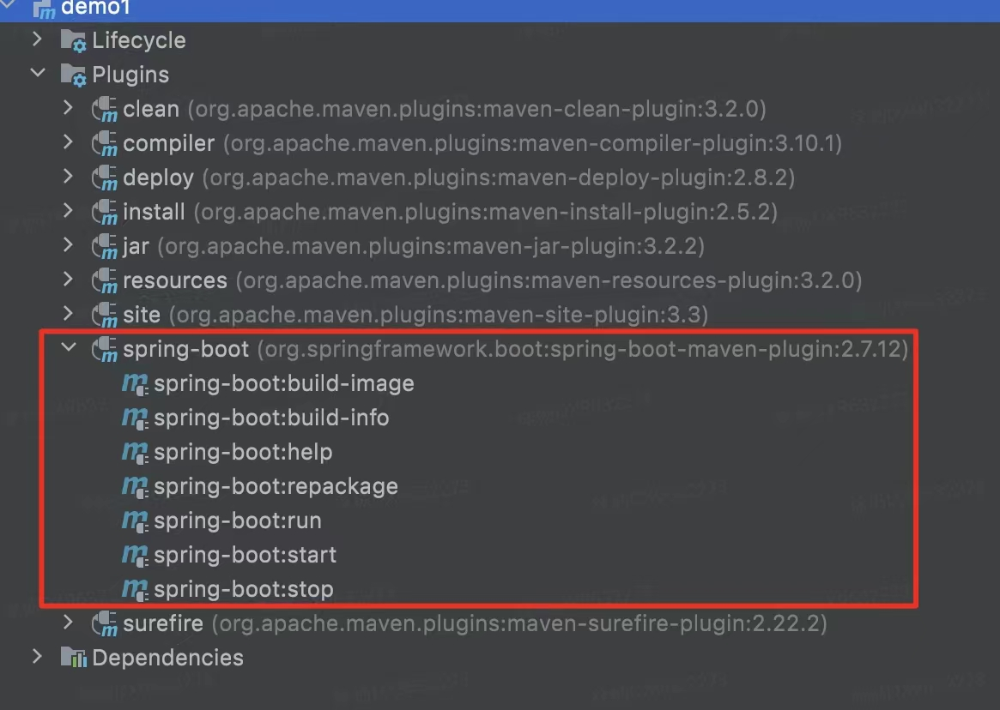
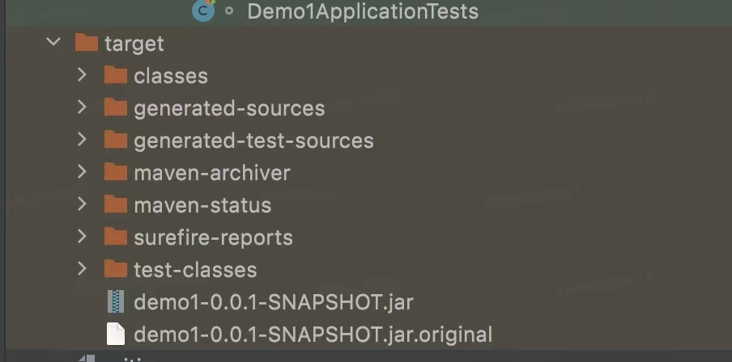
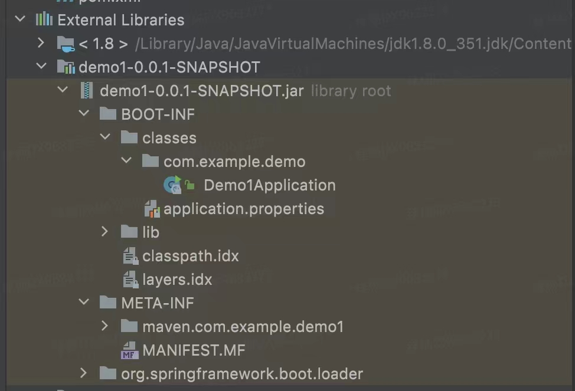
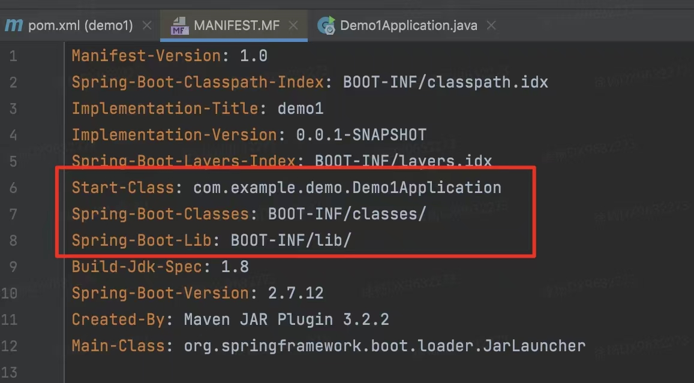
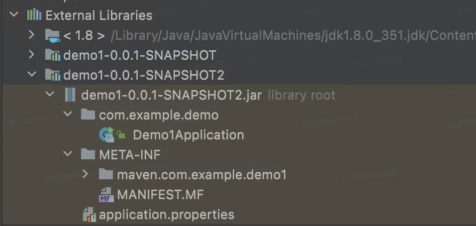
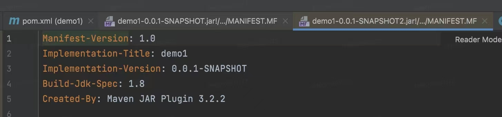
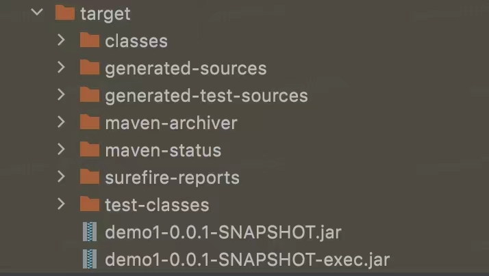

### Spring中的问题

1. 说一下`@RestController`和`Controller`的区别

   `@RestController `等于`@Controller + @ResponseBody`，`Controller`返回的是一个页面，单独使用`Controller`不加`ResponseBody`的话一般使用在要返回一个视图的情况下，这种情况属于比较传统的Spring MVC项目，对应于前后端不分离的应用
   
   `RestController`只返回对象，对象数据直接以JSON或者XML形式写入HTTP响应（Response）中，这种情况下属于Restful Web服务，对应前后端分离的应用
   
   在Spring4之前，如果开发Restful Web服务的话，需要使用`@Controller`并结合`@ResponseBody`注解，`@ResponseBody`的作用就是将`Controller`的方法返回的对象通过适当的转换器转换为指定格式之后，写入到HTTP响应（Response），通常用来返回JSON或者XML格式的数据
   
   
   
1. `@RequestMapping`和`@GetMapping`的区别

   - `@RequestMapping`只能够用于类和方法上，`@GetMapping`只能够用于方法上
   - `@RequestMapping`可以进行GET,POST,PUT,DELETE等请求方法，`@GetMapping`是`@RequestMapping`的GET请求方法的特例
   
   
   
1. `@RequestParam`和`@PathVariable`两个注解的区别

   两个注解都用于方法参数，获取参数值的方式不同，`@RequestParam`注解的参数从请求携带的参数中获取，`@PathVariable`注解从请求的URI中获取
   
   
   
1. 怎么理解REST API

   REST是一套架构规范，代表着抽象状态转移，他是根据HTTP协议从客户端发送数据到服务器端，REST接口是通过HTTP方法来完成操作的，比如GET、HEAD和PUT具有幂等性，这两个方法是安全的，而POST,DELETE都是不安全的。而且RESTful风格的API接口都是无状态的，因为他是基于HTTP协议的，REST API中的请求应该包含处理它所需的所有细节，他不应该依赖于以前或者下一个请求或服务器维护的一些数据，包括会话，
   
   
   
5. 谈一谈对前后端分离的理解

   首先，我认为前后端分离这一概念提出的初衷就是为了让前端也像后端那样，使用工程化、项目化的思维来做，所以前后端分离我感觉并不是一个技术问题，而是一个工程化考量和项目管理的问题，至于前端的VUE，React都只是实现技术，后端的Spring框架也是如此。所以我所理解的前后端分离就是两者之间都是透明的，前后端都是独立设计，独立部署，后台只负责提供功能接口，前端则通过访问接口来展示效果

   

6. **谈谈对Spring IoC和AOP的理解**

   **IoC控制反转**是一种设计思想，**将原本在程序中手动创建对象的控制权交由Spring框架来管理**，IoC容器是Spring用来实现IoC的载体，IoC容器实际上就是个Map，Map中存放的是各种对象

   IoC容器就像一个工厂一样，当我们需要创建一个对象的时候，只需要配置好配置文件或者注解即可，完全不用去考虑对象是如何被创建出来的。Spring时代一般是通过XML文件来配置Bean，SpringBoot中通过注解配置Bean

   **AOP面向切面编程**能够将那些与业务无关，却为业务模块所共同调用的逻辑或责任封装起来（比如事务模块、日志管理、权限管理等），便于减少系统的重复代码，降低模块之间耦合度，有利于扩展性和可维护性，通俗一点描述就是**不通过修改源代码的方式，在主干功能里面添加新功能，即增强类的功能**

   **Spring AOP就是基于动态代理的**，如果要代理的对象实现了某个接口，那么Spring AOP会使用JDK Proxy，去创建接口实现类的代理对象，而对于没有实现接口的对象，就无法使用JDK Proxy去进行代理了，这时候Spring AOP就会使用Cglib生成一个被代理对象的子类来作为代理

   

7. AOP中的一些术语

   ```java
   class User {
       add();
       delete();
       update();
       search();
   }
   ```

   - 连接点，类中的哪些方法可以被增强，就被称作连接点，上面类中的四个方法都可以叫做连接点
   - 切入点，实际被真正增加的方法叫做切入点
   - 通知（增强），实际增强的逻辑部分称为通知（增强），而且通知有很多种类型
     - 前置通知
     - 后置通知
     - 环绕通知
     - 异常通知
     - 最终通知

   - 切面，是一种动作，把通知应用到切入点的过程

   

8. **什么是依赖注入，有几种方式能够完成依赖注入？**

   在依赖注入中，不许创建对象，但是需要描述如何创建他们，我们不是直接在代码中将组件和服务连接在一起，而是描述配置文件中哪些组件需要哪些服务，由IoC容器将他们装配在一起

   通常，有三种方式完成依赖注入，分别是：通过构造函数注入，setter注入，接口注入

   > 控制反转是一种设计思想，是能够解决问题的一种可能的结果；依赖注入是典型的实现方法

   

9. 构造函数注入和setter注入的区别？（Spring Framework中只有这两种注入方式）

   - 通过构造函数没有部分注入，而setter能够部分注入
   - 使用构造函数不会覆盖setter属性，而setter注入会覆盖setter属性
   - 通过构造函数注入任意的修改都会创建一个实例，而对于setter注入，任意的修改都不会创建一个新实例
   - 通过构造函数注入适用于一次性设置很多属性，而setter注入适用于设置少量属性

   

10. **Spring AOP和Aspect AOP有什么区别？**

    **Spring AOP属于运行时增强，Aspect AOP属于编译时增强，Spring AOP是基于代理的，而AspectJ是基于字节码操作的**，Spring框架中已经包含了AspectJ，他比Spring AOP的功能更加强大，但是Spring AOP相对来说更简单。

    当切面较少时，两者的性能差异不大，但是当切面比较多的时候，最好选择Aspect J，他比Spring AOP快很多

   

11. AspectJ定义的通知类型有哪些？

    - Before（前置通知）：目标对象的方法调用之前被触发
    - After（后置通知）：目标对象的方法调用之后被触发
    - AfterReturning（返回通知）：目标对象的方法调用完成，在返回结果值之后触发
    - Afterthrowing（异常通知）：目标对象的方法运行中抛出异常后触发，AfteReturning和AfterThrowing是互斥的
    - Around（环绕通知）：编程式控制目标对象的方法调用，环绕通知是所有通知类型中可操作范围最大的一种，因为它可以直接拿到目标对象和将要执行的方法，所有环绕通知可以在任意的目标对象的方法前后做事情，甚至不调用目标对象的方法。

    > 多个切面的执行顺序能够使用`@Order`注解来指定，@Order注解的值越小，优先级越高；第二个方法是实现`Ordered`接口，重写getOrder方法，返回值越小，优先级越高

    

12. Spring 中Bean的作用域（Scope）

    - singleton，唯一bean实例，Spring中的bean默认都是单例的
    - prototype，每次请求都会创建一个新的bean实例
    - request，每一次HTTP请求都会产生一个新的bean，该bean仅在当前HTTP request内有效
    - session，每一次HTTP请求都会产生一个新的bean，该bean仅在当前HTTP session内有效
    - global-session，全局session作用域，仅仅在基于portlet的web应用中才有意义。

    

13. Spring中单例Bean的线程安全问题

    单例Bean中存在的线程安全问题就是当多个线程操作同一个对象的时候，对这个对象的**非静态成员变量**的写操作会存在线程安全问题，解决方法主要有两种：

    第一种是Bean中尽量不要定义可变的成员变量，这种方法不太牢靠

    第二种是在Bean中定义一个ThreadLocal成员变量，将需要的可变成员变量保存到ThreadLocal中

    

14. `@Component`和`@Bean`的区别是什么？

    - 首先，作用对象不同，`@Component`注解作用于类，`@Bean`注解作用于方法

    - 第二，`@Component`通常是通过类路径扫描来自动侦测以及自动装配到Spring容器中（我们还可以使用`@ComponentScan`注解定义要扫描的路径从中找出标识了需要装配的类自动装配到Spring的Bean容器中），`@Bean`注解通常是我们在标有这个注解的方法中定义产生这个bean，`@Bean`告诉了Spring这是某个类的实例，当我需要用的使用把他还给我

    - 第三，`@Bean`比`@Component`注解的自定义性更强，而且很多地方我们只能通过`@Bean`注解来注册bean，比如当我们引用第三方库中的类需要装配到Spring容器中时，则只能通过`@Bean`来实现

      

15. 将一个类声明为Spring的bean的注解有哪些？

    我们一般使用`@Autowired`来自动装配bean，要想把类标识成可用于`@Autowired`注解自动装配的类，可以用以下注解实现：

    - `@Component`：通用的注解，可标注任意类为Spring组件，如果一个Bean不知道属于哪一层，可用`@Component`来进行标注
    - `@Repository`：对应持久层即DAO层，主要用于数据库相关操作
    - `@Service`：对应服务层，主要负责一些复杂的逻辑，需要用到Dao层
    - `@Controller`：对应于Spring MVC的控制层，主要用于接收用户请求并调用Service层返回数据给前端页面

    


15. 注入Bean的注解有哪些？

    Spring内置的`@AutoWired`以及JDK内置的`@Resource`和`@Inject`都可以用于注入Bean

    `@AutoWired`和`@Resource`用的比较多一些，他们两个的区别是什么呢？

    - `@AutoWired`属于Spring内置的注解，默认的注入方式是byType，也就是说会优先根据接口类型去匹配并注入Bean（接口的实现类），**这会存在这样的问题：**如果一个接口存在多个实现类的话，`byType`这种方式就无法正确注入对象了，因为这个时候Spring会同时找到多个满足条件的选择，默认情况下他不知道自己应该选择哪一个。

      在这种情况下，注入方式会变成`byName`（根据名称进行匹配），这个名称通常就是类名（首字母小写）

      ```java
      // 报错，byName 和 byType 都无法匹配到 bean
      @Autowired
      private SmsService smsService;
      // 正确注入 SmsServiceImpl1 对象对应的 bean
      @Autowired
      private SmsService smsServiceImpl1;
      // 正确注入  SmsServiceImpl1 对象对应的 bean
      // smsServiceImpl1 就是我们上面所说的名称
      @Autowired
      @Qualifier(value = "smsServiceImpl1")  // 建议使用@Qualifier注解来显式指定名称，而不是以来变量的变成
      private SmsService smsService;
      ```

    - `@Resource`有两个比较重要且日常开发常用的属性：name（名称）、type（类型），如果仅仅指定`name`，那么注入方式就是`byName`，同理，如果仅仅是指定`type`，那么注入方式就是`byType`，如果两者同时指定了，那么就是`byType+byName`，不建议这么做

      ```java
      // 报错，byName 和 byType 都无法匹配到 bean
      @Resource
      private SmsService smsService;
      // 正确注入 SmsServiceImpl1 对象对应的 bean
      @Resource
      private SmsService smsServiceImpl1;
      // 正确注入 SmsServiceImpl1 对象对应的 bean（比较推荐这种方式）
      @Resource(name = "smsServiceImpl1")
      private SmsService smsService;
      ```

      

16. **Spring 中 Bean的生命周期**

    

    Bean的生命周期主要分成了创建和销毁两个大的过程

    在创建过程中：首先实例化bean，并设置bean的属性，根据其实现的Aware接口设置依赖信息，接下来调用BeanPostProcessor中的postProcessorBeforeInitialization方法，完成init之前的自定义操作；afterPropertiesSet方法做一些属性被设定后的自定义的事情，调用Bean自身定义的init方法，去做一些初始化相关的工作，然后再调用postProcessorAfterInitialization去做一些bean初始化之后的自定义工作。到此，Bean的创建过程就已经结束了

    对于销毁过程，如果实现了DisposableBean的destory方法，则调用它，如果实现了自定义的destory方法，则调用它

    >- 通过构造器创建 `bean` 实例（默认调用的是无参数的构造方法）
    >- 根据其实现的aware接口设置依赖信息，具体地，通过调用`set`方法来进行属性的注入和对其他`bean`的引用
    >- ==把 `bean`实例传递` bean` 后置处理器的方法 `postProcessBeforeInitialization`==
    >- 调用`bean`的初始化方法（需要在配置文件中配置）
    >- ==把 `bean`实例传递` bean` 后置处理器的方法 `postProcessAfterInitialization`==
    >- 获取创建的`bean`对象，进行一系列操作
    >- 当容器关闭的时候，调用`bean`的销毁方法（需要在配置文件中配置），如果实现了DisposableBean中的destory方法，则调用它，如果实现了自定义的销毁方法，则调用自定义的

    

17. 什么是Spring的内部bean

    只有将bean作用于另一个bean的属性时，才能够将bean声明为内部bean

    内部bean总是匿名的

    ```xml
    <bean id = "StudentBean" class = "com.demo.Student">
        <property name = "person">
            <bean class = "com.demo.Person">
                <property name = "name" value = "xiaoming"></property>
            </bean>
        </property>
    </bean>
    ```

    

18. 什么是Spring装配

    当bean在Spring容器中组合在一起时，它被称作bean装配，Spring容器需要知道需要什么bean以及容器应该如何使用依赖注入来讲bean绑定在一起，同时装配bean

    Spring容器能够自动装配Bean，自动装配的不同模式有：

    - no，默认模式，表示没有自动装配，应该使用显式bean引用进行装配
    - byName，根据bean的名称注入对象依赖项
    - byType，根据bean的类型注入对象依赖项
    - 构造函数
    - autodetect

    

19. Spring中出现了同名Bean怎么办

    - 同一个配置文件中出现了同名Bean，以最上面的定义为准
    - 不同配置文件中存在同名Bean，后解析的配置文件会覆盖先解析的配置文件
    - 同文件中的`@ComponentScan`和`@Bean`出现同名Bean，同文件下的`@Bean`会生效，`@ComponentScan`扫描进来不会生效，通过`@ComponentScan`扫描进来的优先级是最低的，原因就是他扫描进来的Bean定义是最先被注册的

    

20. 说一下对Spring MVC的了解

    MVC是一种设计模式，Spring MVC可以帮助我们进行更加简洁的WEB开发，并且他天生与Spring框架集成，Spring MVC下我们一般可以把后端项目分成Service层（处理业务）、Dao层（数据库操作）、Entity层（实体类）、Controller层（控制层，接受请求、响应结果）

    **SpringMVC的核心组件（了解了核心组件，也就了解了流程）：**

    - `DispatcherServlet`：核心的中央处理器，负责接收请求、分发，并给予客户端响应
    - `HandlerMapping`：处理器映射器，根据uri去匹配查找能处理的Handler，并会将请求涉及到的拦截器和Handler一起封装
    - `HandlerAdapter`：处理器适配器，根据HandlerMapping找到的Handler，适配执行对应的Handler
    - `Handler`：请求处理器，处理实际请求的处理器
    - `ViewResolver`：视图解析器，根据Handler返回的逻辑视图，解析并渲染真正的视图，并传递给DispatcherServlet响应给客户端

    **Spring MVC的流程**

    - 客户端（浏览器）发送请求，直接请求到`DispatcherServlet`

    - `DispatcherServlet`接收到请求之后调用`HandlerMapping`，解析请求对应的Handler

    - 解析到对应的Handler之后（也就是我们常说的Controller），开始由Handler适配器处理

    - `HandlerAdapter`会根据Handler来调用真正的处理器开始处理请求，并处理相应的业务逻辑

    - 处理器处理完业务后，会返回一个`ModelAndView`对象，Model返回的是数据对象，View是个逻辑上的View

    - `ViewResolver`会根据逻辑View查找实际的View

    - `DispatcherServlet`把返回的Model传给View（视图渲染）

    - 把View返回给请求者

      

21. Spring管理事务的方式

    Spring共有两种管理事务的方式，分别是编程式事务，即在代码中硬编码，第二个是声明式事务，即在配置文件中配置

    声明式事务又分成了两种：基于XML的声明式事务和基于注解的声明式事务

    

22. Spring事务有哪几种事务传播行为？

    多事务操作的方法进行相互调用的过程中这些事务应该怎么进行处理这一过程就叫做事务的传播行为

    >比如下图所示，`add`方法中加入了事务，但是`update`方法中没有加入事务，而`add`方法调用了`update`，那么在执行`add`方法时，`update`是否也加入了事务
    >
    >

    枚举对象`propagation`中共有7种事务传播行为，这7种事务传播行为分成了3种情况：

    - 支持当前事务的情况

      - REQUIRED：如果当前存在事务，则加入该事务，如果当前没有事务，那么创建一个新事务

        > `REQUIRED`表示如果`add`方法本身有事务，调用`update`方法之后，`update`使用当前`add`方法里面的事务；如果`add`方法没有事务，调用`update`方法之后，`update`创建新的事务

      - SUPPORTS：如果当前存在事务，则加入该事务，如果当前没有事务，那么继续以非事务的方式运行

      - MANDATORY：如果当前存在事务，则加入该事务，如果当前没有事务，那么抛出异常（mandatory:强制的）

    - 不支持当前事务的情况

      - REQUIRES_NEW：创建一个新事务，如果当前存在事务，则把当前事务挂起
      - NOT_SUPPORTED：以非事务的方式运行，如果当前存在事务，则把当前事务挂起
      - NEVER：以非事务的方式运行，如果当前存在事务，则抛出异常

    - 其他情况

      - NESTED：如果当前存在事务，则创建一个事务作为当前事务的嵌套事务来运行；如果当前不存在事务，那么该取值等价于REQUIRED（nested:嵌套的）

    

23. `@Transactional(rollbackFor=Exception.class)`注解了解吗？

    我们知道Exception分为运行时异常和非运行时异常，事务管理对于企业应用来说是至关重要的，即使出现异常情况，他也可以保证数据的一致性

    当`@Transactional`注解作用于类上时，该类的所有public方法将都具有该类型的事务属性，同时我们也可以在方法级别使用该注解来覆盖类级别的定义。如果类或者方法加了这个注解，那么这个类里面的方法抛出异常就会回滚，数据库里面的数据也会回滚

    如果`@Transactional`里面不配置`rollbackFor`属性，那么事务只会在遇到`RunTimeException`的时候才会回滚，加上`rollbackFor=Exception.class`，可以让事务再遇到非运行时异常也回滚

    

24. 事务的隔离级别

    还是那四个

    读未提交，读已提交，可重复读，串行化

    

25. 如何使用JPA在数据库中非持久化一个字段？

    ```java
    Entity(name="USER")
    public class User {
             @Id
             @GeneratedValue(strategy = GenerationType.AUTO)
             @Column(name = "ID")
             private Long id;
    
             @Column(name="USER_NAME")
             private String userName;
    
             @Column(name="PASSWORD")
             private String password;
    
             private String secrect;
     
    }
    ```

    如果我们不想让`secrect`字段被持久化，也就是不被数据库存储，我们可以采用以下几个方法：

    ```java
    static String secrect;  // 使用static修饰
    final String secrect = "xxx";   // 使用final修饰
    transient String secrect;       // 使用transient修饰
    @Transient
    String secrect;                // 使用@Transient注解
    ```

    当面试官问，对于不想被序列化的变量应该怎么处理时，怎么办，也可以说用transient修饰

    

26. 为什么使用SpringBoot？

    使用Spring需要进行大量的配置工作，而SpringBoot能够简化这些操作，提供默认配置。SpringBoot的优点如下：

    - 在开发web应用程序时，SpringBoot中默认内置Tomcat服务器，以便SpringBoot项目能够作为独立的应用程序运行

    - 自动配置，使用基于类路径和应用程序上下文的智能默认值，当然也可以根据需要重写他们以满足开发人员的需求

    - 创建SpringBoot starter项目时，可以选择需要的功能，SpringBoot将自动管理依赖关系

    - SpringBoot项目可以打包成jar文件，可以使用java-jar从命令行将应用程序作为独立的Java应用程序运行

      

27. SpringBoot中如何实现对不同环境的属性配置文件的支持

    SpringBoot支持不同环境的属性配置文件切换，通过创建`application-{profile}.properties`文件，其中`{profile}`是具体的环境标识名称，例如`application-dev.properties`用于开发环境，`application-test.properties`用于测试环境，如果想要切换环境，只需要在`application.properties`中添加`spring.profiles.active=dev`即可

    

28. 说一下SpringBoot的核心注解

    启动类上面的注解是`@SpringBootApplication`，他是SpringBoot的核心注解，组合了以下三个注解：

    - `@SpringBootConfiguration`：组合了`@Configuration`注解，实现配置文件的功能
    - `@EnableAutoConfiguration`：打开自动配置的功能，也可以关闭某个自动配置的选项，如关闭数据源自动配置功能`@SpringBootApplication(exclude={DataSourceAutoConfiguration.class})`
    - `@ComponentScan`：Spring组件扫描

    

29. 如何理解SpringBoot中的Starters？

    Starters可以理解为启动器，它包含了一系列可以集成到应用里面的依赖包，你可以一站式集成Spring及其他技术，而不需要到处找示例代码和依赖包。如你想使用Spring JPA访问数据库，只需要加入`spring-boot-starter-data-jpa`启动器依赖就能使用了

    Starters包含了许多项目中需要用到的依赖，他们能快速持续的运行，都是一系列得到支持的管理传递性依赖

    

30. SpringBoot Starter的工作原理是什么？

    SpringBoot在启动的时候，按照约定去读取SpringBoot Starter的配置信息，再根据配置信息对资源进行初始化，并注入到Spring容器中，这样Spring Boot启动完毕后，就已经准备好了一切资源，使用过程中注入对应Bean资源即可

    

31. 什么是SpringBoot的自动装配？

    自动装配其实就是把别人写好了的config配置类加载到spring容器中，然后根据这个配置类生成一些项目需要bean对象。

    本质上，SpringBoot是通过SPI的方式实现的自动装配，也就是SpringBoot定义了一套接口规范，这套规范规定：SpringBoot在启动时会扫描外部引用jar包中的`META-INF/spring.factories`文件，将文件中配置的类型信息加载到Spring容器中，并执行类中的各种操作，对于外部jar来说，只需要按照SpringBoot定义的标准，就能够把自己的功能装配进SpringBoot中。

    所以说，比如现在需要整合一个redis，那么直接在项目的pom文件中引入redis对应的starter即可。

    > 从最外层，实现自动装配的其实是组成`@SpringBootApplication`的三个注解中的一个：`@EnableConfiguration`（另外两个是`@Configration`和`@ComponentScan`）,`@EnableConfiguration`只是一个简单的注解，自动装配的核心是通过`AutoConfigrationImportSelector`类实现的，这个自动配置类的主要工作是通过`@Conditional`注解**按需加载**配置类

    

32. 静态代理和动态代理的区别

    首先，代理使得客户端不需要知道实现类是什么，怎么做的，客户端只需要知道代理即可，因此这样就实现了解耦合

    但是对于静态代理来说，一个代理类只能够服务于一种类型的对象，而且在静态代理中代理类和委托类实现了相同的接口，这样如果接口中的方法发生了变化，委托类和代理类都需要做出相应变化，而且存在大量重复代码。静态代理实际上是由程序员创建或者由特定工具自动生成源代码再对其编译。在程序运行前代理类的.class文件就已经存在了。

    而动态代理就是为了解决静态代理存在的上述问题，动态代理类是在程序运行期间通过反射机制的动态创建而成，能够代理各种类型的对象，需要实现InnvocationHandler接口，以及Proxy类的支持

    

33. Spring IoC容器加载全过程

    Spring IoC容器的设计主要是基于两个接口：

    - 实现BeanFactory接口的简单容器
    - 实现ApplicationContext接口的高级容器

    事实上，ApplicationContext是BeanFactory的一个子接口，BeanFactory是Spring IoC容器的最底层接口，他只提供了IoC容器最基本的功能，比如对单个Bean的获取，对Bean作用域的判断，获取Bean的类型等，而ApplicationContext在扩展BeanFactory的基础上，又实现了MessageSources、ListableBeanFactory等接口，所以又被称作高级容器。除了前面说的功能不同以外，BeanFactory是通过延迟加载的形式来注入Bean的，而ApplicationContext是在容器启动时一次性创建所有的Bean

    一般情况下不使用BeanFactory，通常建议优先使用ApplicationContext。

    > Spring中有一个类DefaultListableBeanFactory实现了ApplicationContext，所以Spring实际上是把这个类的对象当成IoC容器了，XmlBeanFactory是DefaultListableBeanFactory的一个子类

    IoC容器的初始化包括三个过程：**Resource定位过程、BeanDefinition的载入、BeanDefinition的注册**

    - **Resource定位过程**：**Resource定位指的是BeanDefinition的资源定位，就是对开发者的配置文件（XML）进行资源的定位，并将其封装成Resource对象**，它由ResourceLoader统一的Resource接口来完成，这个Resource对各种形式的BeanDefinition的使用都提供了统一接口，比如在文件系统中的Bean定义信息可以使用FileSystemResource来进行抽象，在类路径中的Bean定义信息可以使用ClassPathResource来进行抽象等等，这个定位的过程类似于容器寻找数据的过程。
    - **BeanDefinition的载入**：载入过程就是将Resource定位到的信息表示成IoC容器内部的数据结构，这个数据结构就是BeanDifinition
    - **BeanDefinition的注册**：注册过程就是把上面得到的BeanDifinition向IoC容器中进行注册，注册过程是通过调用BeanDefinitionRegistry接口的实现来完成的，在IoC容器内部将BeanDefinition注入到一个HashMap中，IoC容器就是通过这个HashMap来持有这些BeanDefinition数据的

    经过上面三个过程之后，IoC容器初始化完成，此时IoC容器中已经有了Bean的定义，但是Bean没有被初始化，更没有完成依赖注入，也就是说此时IoC容器中还没有Bean实例

    > BeanDefinition在Spring中是用来描述Bean对象的，它本身并不是一个Bean实例，而是包含了Bean实例的所有信息，比如类名、属性值、构造器参数、scope、依赖的bean、是否为单例类、是否懒加载以及其他信息，其实就是将Bean实例定义的信息存储到这个BeanDefinition相应的属性中，后面Bean对象的创建是根据BeanDefinition中描述的信息来创建的，例如拿到这个BeanDefinition之后，可以根据里面的类型、构造函数、构造函数参数，使用反射进行对象创建，也就是说IoC容器中可以有多个BeanDefinition，并且一个BeanDefinition对象对应一个`<bean>`标签中的信息
    >
    > BeanDefinition的作用也不仅仅是用来存储Bean实例的所有信息，而是为了可以方便的进行修改属性值和其他元信息，比如通过BeanFactoryPostProcessor进行修改一些信息，然后在创建Bean对象的时候就可以结合原始信息和修改后的信息创建对象了

    

    

34. Spring中的循环依赖指的是两个或两个以上的对象相互引用，最终行程闭环，这里不是值的函数调用，而是对象的相互依赖关系，**这种场景下应该是先实例化哪个对象呢？**Spring中循环依赖的场景有：

    - 构造器的循环依赖
    - field属性的循环依赖

    Spring为了解决单例的循环依赖问题，使用了**三级缓存**，

    - Spring首先从一级缓存`singletonObjects`中获取
    - 如果获取不到，并且对象正在创建中，就在从二级缓存`earlySingletonObjects`中获取
    - 如果还是获取不到，且允许`singletonFactory`通过`getObject()`获取，就从三级缓存`singletonFactory.getObject()`获取
    - 如果从三级缓存中获取到就从singletonFactories中移除，并放入earlySingletonObjects中。其实也就是从三级缓存移动到了二级缓存

    Spring解决循环依赖的诀窍就在`singletonFactory`通过`getObject()`在三级缓存中获取对象，实际上，再发起调用时，单例对象此时已经是被创建出来了，虽然还没有经过属性注入和init方法，但已经都能够通过对象引用找到在堆上的位置了，所以Spring这时使用三级缓存让这个对象曝光，以供大家使用。

    比如存在这样的情况：“A的某个field或者setter依赖了B的实例对象，同时B的某个field或者setter依赖了A的实例对象”这种循环依赖的情况

    - A首先完成了初始化的第一步，并且将自己提前曝光到singletonFactory中，此时进行初始化的第二步，发现自己依赖B，此时就会尝试去get(B)，发现B还没有被创建，那么就回去走create流程

    - B在初始化的时候发现自己依赖A，于是尝试get(A)，但是一级缓存和二级缓存中都没有，会尝试在三级缓存中获取，由于A自己已经提前曝光了，所以B能够通过`getObject`方法在三级缓存中拿到A对象，即使这个A对象还没有初始化好，B拿到A对象之后顺利完成后续的初始化，完成之后将自己放入到一级缓存中

    - B对象进入了一级缓存之后，此时返回A中，A对象也能够顺利的完成初始化了

      

35. Spring、SpringMVC，SpringBoot三者之间的关系有哪些？

    Spring是一款开源的轻量级Java框架，包含了多个功能模块，目的是提高开发人员的开发效率以及系统的可维护性，SpringMVC也是Spring中一个很重要的模块，主要赋予了Spring快速构建MVC架构的web程序的能力，MVC是模型（Model）、视图（View）、控制器（Controller）的缩写，SpringMVC的核心思想是通过将业务逻辑、数据、显示分离来组织代码。使用Spring进行开发需要进行大量的配置工作，十分繁琐，所以SpringBoot就出现了，也就是说SpringBoot的目的就是简化Spring开发，真正做到了开箱即用。


35. 单例Bean的线程安全了解吗？

    大部分bean实际上都是无状态的，即没有实例变量，比如Dao层，这种情况下Bean是线程安全的。

    但是单例Bean是存在线程安全问题的，主要是因为当多个线程操作同一个对象的时候是存在资源竞争的。

    常见的有两种解决方式：

    - 在Bean中尽量避免定义可变的成员变量
    - 在类中定义一个`ThreadLocal`成员变量，将需要的可变成员变量都保存在ThreadLocal中


36. BeanFactory和ApplicationContext的区别

    


37. SpringBoot打成的jar包和普通的jar包有什么区别吗

    SpringBoot中默认打包成的jar叫做可执行jar，这种jar不同于普通的jar，普通的jar不可以通过`java -jar xxx.jar`命令执行，普通jar的主要作用是被其他应用依赖，而SpringBoot打成的jar可以执行，但不能被依赖，如果强制依赖，也无法获取里面的类。

    > 需要注意的是，可执行 jar 并不是 Spring Boot 独有的，Java 工程本身就可以打包成可执行 jar 。
    >
    > 对于一个普通的项目，可以使用Maven或者手动打包的方式将其打包成可执行的jar文件，先来看一下手动打包的步骤：
    >
    > 1. 编写Main类，该类包含main方法，作为程序的入口点。
    >
    > 2. 在命令行中使用`javac Main.java`命令编译Main类
    >
    > 3. 在命令行中使用jar命令创建可执行的jar文件 `jar cfe app.jar Main 8.class`
    >
    >    其中，app.jar是您要创建的可执行的jar文件的名称，Main是程序的入口点，*.class是所有编译后的class文件。
    >
    > 4. 可以使用`java -jar app.jar`来运行程序
    >
    > 
    >
    > 如果这是一个Maven项目，泽可以使用Maven插件来打包可执行的jar文件。在pom.xml文件中添加以下插件：
    >
    > ```xml
    > <build>
    >     <plugins>
    >         <plugin>
    >             <groupId>org.apache.maven.plugins</groupId>
    >             <artifactId>maven-jar-plugin</artifactId>
    >             <version>3.2.0</version>
    >             <configuration>
    >                 <archive>
    >                     <manifest>
    >                         <addClasspath>true</addClasspath>
    >                         <mainClass>com.example.Main</mainClass>
    >                     </manifest>
    >                 </archive>
    >             </configuration>
    >         </plugin>
    >     </plugins>
    > </build>
    > ```
    >
    > 其中，com.example.Main是您的程序的入口点。然后，在命令行中运行以下Maven命令：`mvn clean package`Maven将在target目录中生成一个可执行的jar文件，可以使用以下命令运行它`java -jar target/app.jar`
    
    可以看到，既然同样是执行 mvn package 命令进行项目打包，为什么 Spring Boot 项目就打成了可执行 jar ，而普通项目则打包成了不可执行 jar 呢？
    
    这是因为SpringBoot项目中有一个默认的插件配置`spring-boot-maven-plugin`
    
    
    
    其中`repackage`功能的作用是在打包的时候多做一些额外的事情：

    - 首先`mvn package`命令对项目进行打包，打成一个普通的jar包，可以被其他项目依赖，但不可以被执行
    - `repackage`则是对第一步中打包产生的jar包再次进行打包，将之打成一个可执行jar，然后再将第一步打成的jar重命名为`*.original`文件
    
    
    
    需要注意的是，`demo1-0.0.1-SNAPSHOT.jar`表示打包成的可执行的文件，而`demo1-0.0.1-SNAPSHOT.jar.original`则是在打包过程中被重命名的jar，这是一个不可执行的jar，但是可以被其他项目所依赖。
    
    > 通过`jar xvf xxx.jar`可以解压jar包
    
    
    
    首先解压可执行文件`demo1-0.0.1-SNAPSHOT.jar`，可以发现，我们自己的代码是存在 于 BOOT-INF/classes/ 目录下
    
    
    
    另外，还有一个 META-INF 的目录，该目录下有一个 MANIFEST.MF 文件，打开该文件，内容如下：
    
    
    
    可以看到，这里定义了一个 Start-Class，这就是可执行 jar 的入口类，Spring-Boot-Classes 表示我们自己代码编译后的位置，Spring-Boot-Lib 则表示项目依赖的 jar 的位置。
    
    
    
    接着，我们再来看一下不可执行jar包的结构（将默认的后缀 .original 除去，然后给文件重命名，重命名完成，导入idea中查看目录结构）
    
    
    
    解压后可以看到，不可执行 jar 根目录就相当于我们的 classpath，解压之后，直接就能看到我们的代码，它也有 META-INF/MANIFEST.MF 文件，但是文件中没有定义启动类等。
    
    
    
    而且能够发现，不可执行的jar包中也没有讲项目的依赖打包进行
    
    **综上，如果自己要打一个可执行 jar 包的话，除了添加相关依赖之外，还需要配置 META-INF/MANIFEST.MF 文件。**
    
    那么如何一次性打包两个jar呢？一个可执行，一个可被引用
    
    一般来说，SpringBoot 直接打包成可执行 jar 就可以了，不建议将 SpringBoot 作为普通的 jar 被其他的项目所依赖。如果有这种需求，建议将被依赖的部分，单独抽出来做一个普通的 Maven 项目，然后在 Spring Boot 中引用这个 Maven 项目。
    
    如果非要将 Spring Boot 打包成一个普通 jar 被其他项目依赖，技术上来说，也是可以的，给 spring-boot-maven-plugin 插件添加如下配置：
    
    ```xml
    <build>
        <plugins>
            <plugin>
                <groupId>org.springframework.boot</groupId>
                <artifactId>spring-boot-maven-plugin</artifactId>
                <configuration>
                    <classifier>exec</classifier>
                </configuration>
            </plugin>
        </plugins>
    </build>
    ```
    
    配置的 classifier 表示可执行 jar 的名字，配置了这个之后，在插件执行 repackage 命令时，就不会给 mvn package 所打成的 jar 重命名了，所以，打包后的 jar 如下：
    
    
    
    第一个 jar 表示可以被其他项目依赖的 jar ，第二个 jar 则表示一个可执行 jar。


### MyBatis中的问题

1. `#{}`和`${}`的区别是什么

   首先，她们两个都能够获取pojo对象的属性值和map中的值

   - `${}`是`properties`文件中的变量占位符，它可以用于标签属性值和sql内部，属于静态文本替换，比如`${driver}`会被静态替换为`com.mysql.jdbc.Driver`，说白了就是字符串替换，直接拼接字符串，会有sql注入的风险
   - `#{}`是sql参数占位符，MyBatis会将sql中的`#{}`替换为`?`号，在sql执行前会使用`PreparedStatement`的参数设置方法，按序给sql的`?`占位符设置参数值，比如`ps.setInt(0, parameterValue)`，`#{item.name}`的取值方式为使用反射从参数对象中获取`item`对象的name属性值，相当于`param.getItem().getValue()`

   >具体地，比如这个`sql`语句，`select * from tbl_employee where id=${id} and last_name=#{lastName}`，经过执行后返回的是`select * from tbl_employee where id=2 and last_name=?`，很显然，使用`${}`的地方被具体值给替代了，而使用`#{}`的地方是一个占位符
   >
   >大多情况下，我们去参数的值都应该去使用`#{}`
   >
   >原生`jdbc`不支持占位符的地方我们就可以使用`${}`进行取值，比如分表、排序、按照年份拆表等，比如
   >
   >```sql
   >select * from ${year}_salary where xxx;
   >select * from tbl_employee order by ${f_name} ${order}
   >```

   如果具体的业务要求需要使用字符串拼接，那么不一定非要使用`${}`，还可以使用`<bind>`标签，如下

   >可以将`OGNL`表达式的值绑定到一个变量中，方便后来引用这个变量的值。
   >
   >```xml
   >    <select id="getEmpTestBind" resultType="entity.Employee">
   >    <bind name="_lastName" value="'%' + lastName + '%'"/>
   >        select * from tb_employee where last_name like #{_lastName}
   >    </select>
   >```
   >
   >不用使用`${}`取值便可以完成`sql`中字符串的拼接

   

2. 在xml映射文件中，除了常见的`select|insert|update|delete`标签之外，还有哪些标签？

   还有很多其他标签，比如resultMap、parameterMap、sql、include、selectKey等，通过include标签引入sql片段，selectKey为不支持自增的主键生成策略标签，又比如动态sql的9个标签，比如trim、where、set、foreach、if、choose、when、otherwise、bind等

   

3. 通常一个xml映射文件，都会写一个Dao接口与之对应，请问，这个Dao接口的工作原理是什么？Dao接口里的方法，参数不同时，方法能重载吗

   Dao接口，就是我们常说的Mapper接口，接口的全限定名（全类名）就是映射文件中的namespace值，接口的方法名就是映射文件中的`MappedStatement`的id值，接口方法内的参数，就是传递给sql的参数。Mapper接口是没有实现类的，当调用接口方法时，接口全类名+方法名拼接字符串作为key可唯一定位一个`MappedStatement`，例如`com.demo.mybatis.StudentDao.findStudentById`可以唯一找到namespace为`com.demo.mybatis.StudentDao`下面`id=findStudentById`的`MappedStatement`。在MyBatis中，每一个`select、insert、update、delete`标签都会被解析成为一个MappedStatement对象

   **Dao接口里面的方法参数不同时，方法不能够重载，因为方法是通过全类名+方法名来作为查找策略的**

   Dao接口的工作原理是JDK动态代理，MyBatis运行时会使用JDK动态代理为Dao接口生成代理proxy对象，代理对象proxy会拦截接口方法，转而执行`MappedStatement`所代表的sql，然后将sql执行结果返回

   

4. MyBatis是如何进行分页的，分页插件的原理是什么？

   MyBatis使用RowBounds对象进行分页，它是针对ResultSet结果集执行的内存分页，而非物理分页，可以在sql内直接书写带有物理分页的参数来完成物理分页功能，也可以使用分页插件来完成物理分页

   分页插件的基本原理是使用MyBatis提供的插件接口，实现自定义插件，在插件的拦截方法内拦截待执行的sql，然后重写sql，根据dialect方言，添加对应的物理分页语句和物理分页参数

   ```mysql
   例如：
   select _ from student ，拦截 sql 后重写为： select t._ from （select \* from student）t limit 0,10
   ```

   

4. MyBatis中的四大对象

   - StatementHandler：处理sql语句预编译，设置参数等相关工作
   - ParameterHandler：设置预编译参数用的
   - ResultHandler：处理结果集
   - Executor：它是一个执行器，真正进行`java`与数据库交互的对象
   
   
   
5. 简述MyBatis插件的运行原理，以及如何编写一个插件

   MyBatis仅可编写针对`ParameterHandler`，`ResultSetHandler`，`StatementHandler`，`Executor`这4种接口的插件，MyBatis使用JDK的动态代理，为需要拦截的接口生成代理对象以实现接口方法拦截功能，每当执行这4种接口对象的方法时，就会进入拦截方法，具体就是`InvocationHandler`的`invoke()`方法，当然，只会拦截那些你指定需要拦截的方法

   实现MyBatis的Interceptor接口并复写`intercept()`方法，然后再给插件编写注解，指定要拦截哪一个接口的哪些方法即可，还有不能忘记在配置文件中配置自己编写的插件

   

6. MyBatis动态sql是做什么的？简述一下动态SQL的执行原理？

   MyBatis动态sql可以让我们在xml映射文件中，以标签形式编写动态sql，完成逻辑判断和动态拼接sql的功能，MyBatis提供了9种动态sql标签`trim|if|set|where|foreach|choose|when|otherwise|bind`

   其执行原理为，使用`OGNL`从sql参数对象中计算表达式的值，根据表达式的值动态拼接sql，以此来完成动态sql的功能

   

7. MyBatis是如何将sql执行结果封装成目标对象并返回的，都有哪些映射形式？

   第一种是使用`resultMap`标签，逐一定义列名和对象属性名之间的映射关系，第二种是使用sql列的别名功能，将列别名书写为对象属性名，比如`T_NAME AS NAME`，对象属性名一般是name，列名是不区分大小写的，MyBatis会忽略列名大小写，只能找到与之对应对象属性名

   有了列名和属性名的映射关系后，MyBatis通过反射创建对象，同时使用反射给对象的属性逐一赋值并返回，那些找不到映射关系的属性，是无法完成赋值的

   

8. MyBatis是否支持延迟加载，如果支持，它的实现原理是什么？

   Mybatis仅支持association关联对象和collection关联对象的延迟加载，association指的是一对一，collection指的是一对多查询，在MyBatis配置文件中，可以配置是否启用延迟加载`lazyLoadingEnabled=true|false`

   它的原理是，使用`cglib`创建目标对象的代理对象，当调用目标方法时，进入拦截器方法，比如调用`a.getB().getName()`，拦截器`invoke()`方法发现`a.getB()`是null值，那么就会单独发送事先保存好的查询管理B对象的sql，把B查询上来，然后调用`a.setB(b)`，于是a对象的b属性就有值了，接着完成`a.getB().getName()`方法的调用，这就是延迟加载的基本原理

   

9. MyBatis中，不同的XML映射文件中，id是否可以重复？

   不同的 Xml 映射⽂件，如果配置了 namespace，那么 id 可以重复；如果没有配置 namespace， 那么 id 不能重复；

   毕竟 namespace 不是必须的，只是最佳实践⽽已。 原因就是 namespace+id 是作为 Map 的 key 使用的，如果没有 namespace，就剩下 id，那么，id 重复会导致数据互相覆盖。有了 namespace，⾃然 id 就可以重复，namespace 不同，namespace+id 自然也就不同。

   

11. MyBatis中如何执行批处理？

    使用`BatchExcutor`完成批处理

    >==使用`Batch`执行器进行批量操作时，执行预编译`sql`1次，设置参数10000次，执行1次==
    >
    >==不适用批量执行器时，预编译`sql`、设置参数、执行`sql`均10000次==
    >
    >因此，使用批量执行器的效率要高

    

11. MyBatis都有哪些Excutor执行器，他们之间的区别是什么？

    MyBatis中共有三种基本的Excutor执行器，分别是SimpleExcutor、ReuseExcutor、BatchExcutor

    - SimpleExcutor：每执行一次update或select，就开启一个Statement对象，用完立刻关闭Statement对象
    - ReuseExcutor：会重复使用Statement，执行update或select，以sql作为key查找Statement对象，存在就使用，不使用就创建，用完后，不关闭Statement对象，而是放在Map<String, Statement>中，供下一次使用
    - BatchExcutor：执行update（没有select，JDBC批处理不支持select），将所有sql都添加到批处理中（addBatch()），等待统一执行（executeBatch()），它缓存了多个Statement对象，每个Statement对象都是addBatch完毕后，等待逐一执行`executeBatch()`批处理，与JDBC相同

    Excutor的这些特点，都严格限制在SqlSession生命周期范围内

    

12. MyBatis中如何指定使用哪一种Executor执行器？

    在MyBatis配置文件中，可以指定默认的ExecutorType执行器类型，也可以手动给`DefaultSqlSessionFactory`的创建SqlSession的方法传递ExcutorType类型参数

    

13. MyBatis是否可以映射Enum枚举类？

    MyBatis可以映射枚举类，不单可以映射枚举类，MyBatis可以映射任何对象到表的一列上，映射方式为自定义一个TypeHandler，TypeHandler的作用就是实现JavaType和jdbcType之间的相互转换，具体方式就是实现TypeHandler的setParameter()和getResult()接口方法，分别代表设置sql问号占位符参数和获取列查询结果

    

14. MyBatis映射文件中，如果A标签通过include引用了B标签的内容，请问，B标签能否定义在A标签的后面，还是说必须定义在A标签的前面？

    虽然MyBatis解析XML文件是按照顺序解析的，但是被引用的B标签可以出现在任何地方，原理如下：

    MyBatis解析A标签，发现A标签引用了B标签，但是此时B标签尚未被解析，暂不存在，此时，MyBatis会将A标签标记为未解析状态，然后继续解析余下的标签，包含B标签，待所有标签解析完毕，MyBatis会重新解析那些被标记为未解析的标签，此时再解析A标签时，B标签已经存在了，A标签也就可以正常完成解析了

    

15. 简述MyBatis的XML映射文件和MyBatis内部数据结构之间的映射关系？

    MyBatis将XML中所有的配置（标签）信息都封装到All-In-One重量级对象Configuration内部，在XML映射文件中，`<parameterMap>`标签会被解析成`parameterMap`对象，其中的每个子元素会被解析成`parameterMapping`对象。`<resultMap>`标签会被解析成`resultMap`对象，其中的每个子元素会被解析成`resultMapping`对象。每一个`<select>,<insert>,<update>,<delete>`标签均会被解析成`MappedStatement`对象，标签内的sql会被解析成BoundSql对象

    

16. 为什么说MyBatis是半自动ORM映射工具，它与全自动的区别在哪里？

    Hibernate属于全自动ORM映射工具，使用Hibernate查询关联对象或关联集合对象的时候，可以根据对象关系模型直接获取，所以他是全自动的
    
    MyBatis在查询关联对象或关联集合对象的时候，需要手动编写sql来完成，所以称之为半自动ORM框架
    
    
    
17. Hibernate和MyBatis的区别

    相同点：都是对jdbc的封装，都是持久化层框架，都是用于Dao层开发

    不同点：

    - MyBatis是一个半自动的ORM框架，配置Java对象与sql语句执行结果的对应关系，多表关联关系配置简单

      Hibernate是一个全自动的ORM框架，配置Java对象与数据库表的对应关系，多表关联关系配置复杂

    - MyBatis需要手动编写sql语句，支持动态sql、处理列表、存储过程等，开发工作量相对较大，但是更加灵活，更易优化sql语句

      Hibernate对sql实现了封装，提供了日志、级联、缓存等特性，此外还提供了HQL操作数据库，代码量较小，但是sql语句不易优化

    - 总的来说，Hibernate是一个重量级框架，数据库无关性好，适用于需求稳定的中小型项目，而MyBatis是一个轻量级框架，适用于需求变化频繁的大型项目

      

18. MyBatis是如何解决JDBC中的不足之处的？

    - JDBC编程不足之处一：数据库连接创建、释放频繁造成系统资源浪费从而影响系统性能

      MyBatis解决的方法：在SqlMapConfig.xml中配置数据库连接池，使用连接池管理数据库连接

    - JDBC编程不足之处二：sql语句在代码中不易维护，实际应用sql语句变化的可能性比较大，sql变动需要改变Java代码

      MyBatis解决的方法：将sql语句在xxxmapper.xml中编写，与Java代码分离

    - JDBC编程不足之处三：向sql语句传参数麻烦，因为sql语句的where条件不一定，可能多也可能少，占位符需要和参数一一对应

      MyBatis解决的方法：MyBatis自动将Java对象映射至sql语句

    - JDBC编程不足之处四：对结果集解析麻烦，sql变化导致解析代码变化，且解析前需要遍历，如果能将数据库记录封装成pojo对象解析比较方便

      MyBatis解决的方法：MyBatis自动将sql执行结果映射至Java对象

      

19. MyBatis的编程步骤

    - 创建SqlSessionFactory
    - 通过SqlSessionFactory创建sqlSession，执行器会在这一步被创建
    - 获取接口的代理对象MapperProxy，执行数据库操作
    - 调用session.commit()提交事务
    - 调用session.close()关闭会话

    

21. 在Mapper中如何传递多个参数？

    - 将多个参数封装成HashMap，以HashMap的形式传递到Mapper中
    - 若Dao层函数有多个参数，那么其对应的XML中，`#{param0}`代表第一个参数，`#{param1}`代表第二个参数，依此类推
    - 使用`@Param`注解，在Dao层参数前加上`@Param`注解，注解内的参数名为传递到Mapper中的参数名

    > 源码如下：

    ```java
     public Object getNamedParams(Object[] args) {
            // names 是在构造器中已经确定好了，比如在这里names:{0=id,1=lastName}
            /**
             * 构造器中 names 的构造流程
             * 1、获取每个标了param注解的参数的@Param的值：比如id，lastName；赋值给name;
             * 2、每次解析一个参数，放入map中保存信息，map的key是参数索引，value是name
             *    name 的值： 
             *     （1） 如果有param注解，那么就是注解的值
             *     （2） 没有注解
             *          (i)  全局配置：useActualParamName（jdk1.8）：name=参数名
             *          (ii) name=map.size()；相当于当前元素的索引
             *
             * 通过上面的步骤，就能够得到names:{0=id,1=lastName}
             * 比如说还有一个参数没有param注解，那么names就变成了{0=id,1=lastName,2=2}
             */
            int paramCount = this.names.size();
            if (args != null && paramCount != 0) { 
                // 如果只有一个元素并且这个元素没有param注解，直接就返回args[0]，即单个参数直接返回
                if (!this.hasParamAnnotation && paramCount == 1) { 
                    return args[(Integer)this.names.firstKey()];
                } else {  // 多个元素或者有Param标注
                    Map<String, Object> param = new ParamMap();
                    int i = 0;
    
                    // 遍历 names：{0=id,1=lastName}，args:{1,"tom"}
                    for(Iterator i$ = this.names.entrySet().iterator(); i$.hasNext(); ++i) { 
                        Entry<Integer, String> entry = (Entry)i$.next();
                        // names集合的value作为key; names集合的key又作为args取值的参考
                        param.put(entry.getValue(), args[(Integer)entry.getKey()]);
                        // 额外的将每一个参数也保存到map中，使用新的key：param1...paramN
                        // 效果：有Param注解可以#{指定的key}，或者#{parami}
                        String genericParamName = "param" + String.valueOf(i + 1);
                        if (!this.names.containsValue(genericParamName)) {
                            param.put(genericParamName, args[(Integer)entry.getKey()]);
                        }
                    }
    
                    return param;
                }
            } else { // 参数为null，直接返回null
                return null;
            }
        }
    ```

    

21. MyBatis实现一对一有几种方式，具体是怎么操作的

    一共有联合查询和嵌套查询两种方式

    联合查询是几个表联合查询，通过在`resultMap`里面配置的`association`节点配置一对一的类就可以完成

    嵌套查询是先查一个表，根据这个表里面的结果的外键id，再去另一个表中查询数据，也是通过`association`配置，但是另一个表的查询是通过select配置的

    

22. MyBatis实现一对多有几种方式，具体是怎么操作的

    一共有联合查询和嵌套查询两种方式

    联合查询是几个表联合查询，通过在`resultMap`里面配置的`collection`节点配置一对一的类就可以完成

    嵌套查询是先查一个表，根据这个表里面的结果的外键id，再去另一个表中查询数据，也是通过`collection`配置，但是另一个表的查询是通过select配置的

    

23. MyBatis的一级、二级缓存

    一级缓存：基于PerpetualCache的HashMap本地缓存，其存储作用域为session，当session flush或close之后，该session中的所有Cache都被清空，默认打开一级缓存

    二级缓存与一级缓存的机制相同，默认也是使用PerpetualCache的HashMap本地缓存，不同之处在于二级缓存的作用域是namespace，而且二级缓存默认是不打开的，要开启二级缓存，不仅要在配置文件中开启，还要让pojo对象类实现Serializable序列化接口，而且只有当一级缓存失效时，MyBatis才会将查询结果放到二级缓存中

    > 一级缓存失效的四种情况：sqlSession不同，sqlSession相同但是查询条件不同，sqlSession相同但是两次查询之间进行了增删改操作，sqlSession相同但是两次查询之间进行了clear操作

    

24. 使用MyBatis的Mapper接口调用时有哪些要求

    - Mapper接口的方法名要与mapper.xml文件中定义的每个sql的id相同
    - Mapper接口方法的输入参数类型和mapper.xml中定义的每个sql的parameterType类型相同
    - Mapper接口方法的输出参数类型和mapper.xml中定义的每个sql的resultType类型相同
    - mapper.xml文件中的namespace即是mapper接口的类路径

    
    
26. `MyBatis`默认两个内置参数

    - `_parameter`：代表整个参数
      - 单个参数：`_parameter`就是这个参数
      - 多个参数：参数会被封装成一个`map`，`_parameter`就是这个`map`
    - `databaseId`：如果配置了`databaseIdProvider`这个标签，`_databaseId`就是代表当前数据库的别名

    

27. MyBatis中的四大对象

    - StatementHandler：处理sql语句预编译，设置参数等相关工作
    - ParameterHandler：设置预编译参数用的
    - ResultHandler：处理结果集
    - Executor：它是一个执行器，真正进行`java`与数据库交互的对象


