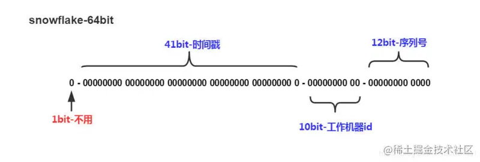
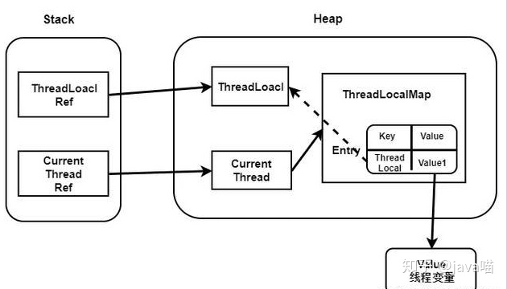
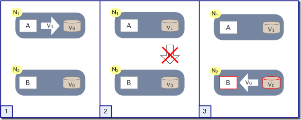

[toc]


## 操作系统

操作系统的五大功能：资源管理（包括内存、CPU等）、进程管理、文件管理、设备管理、用户界面


### 1. Linux有哪些常用命令

Linux中的命令主要分成了文件管理命令、权限管理命令、网络通信命令、进程管理命令等，比如cd、rm、mkdir、mv、cp、find、pwd等文件管理命令，chmod、chown权限管理命令，ping、netstat/ss、ifconfig、service等网络通信命令，ps、kill、pstree等进程管理命令

```shell
lsof -i | grep 8080 # 查看占用8080端口的进程，使用netstat -tunlp | grep 8080也可以

ps -ef | grep 进程名字 # 得到进程id
top -p pid # 动态实时的看到cpu和内存占用率

ps -aux | grep 进程名字 # 直接查看cpu和内存占用率

ps aux|sort -k4,4nr|head -n 10  # 查看内存占用前10名的程序 

wc -l xxx.log # 查看xxx.log文件有多少行，统计PV

# awk命令是文本处理利器
awk '{print $4}' xxx.log # 将xxx.log中的第4列打印出来

awk '{print substr($4, 2, 11)}' xxx.log # 截取第4列的字符串，[2,11)

awk '{print substr{$4, 2, 11}}' access.log | sort | uniq -c # 使用sort|uniq -c对第四列的字符串进行排序和统计数量，uniq其实是去重

awk '{print $12}' access.log | sort | uniq -c | sort -rn # 使用sort对结果进行排序，r表示逆向排序，n表示按照数值排序

awk '{print $7}' access.log | sort | uniq -c | sort -rn | head -n 3 # 筛选出top3
```


### 2. 进程和线程的区别

进程是系统资源分配的基本单位，线程是系统进行任务调度的基本单位，同一个进程内的线程能够共享进程内的资源，比如全局变量、堆空间等，因此线程相较于进程切换的开销比较小，线程也通常被称作轻量级的进程，而进程可以看作是程序的一次动态执行。两者都可以并发执行，但是如果同一个进程的线程有一个出现了故障，整个进程都会崩溃，而某个进程出现故障，那么不会影响到其他进程

更进一步，可以再说一下协程，协程是一种基于线程之上，更轻量级的一种存在，完全是在用户空间进行管理，对内核是不可见的，因此协程切换的代价更小，在这里可以延伸一下对goroutine的理解

> 进程中的资源：地址空间、全局变量、文件打开表、信号量、通信的一些资源，比如本地socket等
>
> 线程中的资源：栈空间、寄存器、程序计数器


事实上，从日常使用的角度出来，对于进程我们的关注重点是在进程之间的通信，而对于线程我们的关注重点是在多线程对共享内存的访问


### 3. 进程的通信方式

首先最简单的通信方式是**管道**，管道分成了具名管道和匿名管道，匿名管道就是我们Linux中的那个`|`，不管是匿名管道还是具名管道，使用管道传输的数据都会被放在内存中，匿名管道只能够用在具有亲缘关系的进程之间，（Linux中的进程都是由0号进程fork出来的），具名管道打破了这种限制，具名管道会作为一个文件被持久化到磁盘中，具体方式是通过`mkfifo`命令来创建，通过这个命令我们可以看出来管道其实就是一个先进先出的队列。管道的缺点就是通信效率很低，所以进程之间通信的方式又出现了**消息队列**，消息队列其实就相当于发邮件，发送方进程可以持续不断的发送消息，但是发送的消息的大小有限制，接收方进程会根据自身需要来读取消息，消息队列其实是存放在内核中的消息链表，因此，除了通信不及时和消息大小存在限制以外，使用*消息队列还会频繁地发生内核态和用户态之间的数据拷贝过程*，为了解决这个问题，又出现了**共享内存**，我们知道操作系统中会为每个进程分配一个虚拟内存地址，需要通信的每个进程都会拿出自己地址中的某一部分映射到到物理地址的相同部分，这样进程都之需要读取这块物理地址就能够实现通信的目的了，但是由于涉及到了共享资源，所以通常需要搭配信号量来使用，**信号量**本质上是一个计数器，其中的PV操作能够实现资源的互斥访问和同步访问，此外，对于进程中的异常情况，使用**信号**来进行通信，比如中断信号等，我们前面说的管道、消息队列、共享内存、信号量、信号都是在同一台主机上的进程之间的通信，对于不同主机上进程的通信，使用的是**socket**，socket总共有三种类型，基于TCP的网络通信模型，基于UDP的网络通信模型，本地网络通信模型，网络socket和本地socket最大的不同在于前者需要绑定IP地址和端口号，而后者只需要绑定一个本地文件。


### 4. 线程间同步的方式

线程同步是两个或多个共享关键资源的线程的并发执行，应该同步线程以避免关键的资源使用冲突，操作系统一般有下面三种线程同步的方式：

   - 互斥量：采用互斥对象机制，只有拥有互斥对象的线程才有访问公共资源的权限，因为互斥对象只有一个，所以可以保证公共资源不会被多个线程同时访问，比如Java中的synchronized关键字和各种lock都是这种机制
   - 信号量：它允许同一时刻多个线程访问同一资源，但是需要控制同一时刻访问此资源的最大线程数量
   - 事件：通过通知操作的方式来保持多线程同步，还可以方便的实现多线程优先级的比较操作


### 5. fork函数

在Linux中创建一个新进程的~~唯一方法~~是某个已存在的进程调用fork函数，fork函数的是指是一个系统调用，其作用就是复制当前进程（包括进程在内存里的堆栈数据），对于只读的数据，通常是使用共享内存的方式进行访问。然后新进程和旧进程同时执行下去，并且这两个进程互不影响。在实际应用中，单纯让程序“分叉”意义不大，我们新增一个子程序，很可能是为了让子进程单独执行一段代码，实现与主进程不同的功能，父子进程最开始使用的是同一块共享内存，只有当发生写行为的时候，才会通过写时复制的方式copy出一份内存，此时父子进程就不会再共享内存了。fork函数实际上有返回值，调用一次返回两次，在父进程中返回的是子进程id，子进程返回的是0，如果fork函数执行出错了，那么返回的是一个负数。

> fork函数的性质：一次调用、两次返回


### 6. 用户态和内核态是如何切换的？系统调用？

有三种方式能够进行切换：系统调用、中断信号、发生异常

**说一下系统调用**

> 根据进程访问资源的特点，我们可以把进程在系统上的运行分为两个级别
>
> - 用户态：用户态运行的进程可以直接读取用户程序的数据
> - 系统态：系统态运行的进程可以访问计算机上的任何资源，不受限制
>
> 我认为分成用户态和内核态的目的就是为了安全，限制程序的访问能力，阻止他们获得别的程序的内存数据以及做一些危险的操作，比如直接对内存的管理等

我们运行的程序基本上都在用户态，凡是与系统态级别的资源有关的操作，都必须**通过系统调用的方式向操作系统提出服务请求，并由操作系统代为完成**，比如文件管理、设备管理、进程管理、内存管理等


### 7. 我们一直在说用户态和内核态切换会有较大的性能代价，那么这些代价具体体现在哪里？

- 首先，需要明确的一点是，一个CPU在同一时刻要么在用户态工作，要么在内核态工作，因此，发生用户态和内核态切换时，首先会发生的就是进程**上下文的切换**，操作系统首先需要保存当前进程的上下文信息，包括：程序计数器、堆栈指针、通用寄存器和其他相关寄存器等信息，并加载新进程的上下文信息。
- 内核态和用户态的切换，还会带来**权限的切换**，这个过程需要进行一些额外的安全检查和权限级别切换。
- 此外，用户态和内核态的切换，**操作系统还需要切换进程的操作空间和数据空间**，这可能涉及到物理内存的映射、内存页表的更新和虚拟内存管理等操作，这些操作需要进行大量地址映射和内存访问操作，也会导致一定的执行时间开销。


### 8. 说一下局部性原理

局部性原理主要体现在两个方面，时间局部性和空间局部性

时间局部性指的是如果程序中的某条指令一旦执行，不久以后该指令可能会再次被执行，如果每数据被访问过，不久以后该数据可能会再次被访问。产生时间局部性的典型原因是因为程序中存在着大量的循环操作

空间局部性指的是一旦程序访问了某个存储单元，在不久之后，其附近的存储单元也将被访问到，这是因为指令通常是顺序存放的


### 9. 讲讲虚拟内存

虚拟内存是基于**局部性原理**对物理内存的逻辑性扩充，在操作系统的管理下，每个进程都拥有一个虚拟地址空间，他们实际上是对于物理内存地址的划分，因此各个进程之间互不干扰，而且并发性会提高。对于虚拟内存的管理通常有三种方式：分段、分页、段页式

> 因为时间局部性和空间局部性，所以4G的物理内存能够运行10G的软件程序，因为他不是一次性地将整个程序都加载到内存中，而是用到哪些将那些加载进去，如果内存中没有，那么就会产生缺页中断，将需要的页换入内存


**<font color=red>为什么需要虚拟内存</font>**

如果没有虚拟地址，那么程序将直接操作和访问物理地址，这样做主要会出现两个问题：

- 用户可以访问任意内存，寻址内存的每个字节，这样用户可能在无意中导致系统数据遭到损坏
- 直接操作物理地址，同时运行多个程序将变得异常困难，加入程序A向地址x写入了数据，程序B也向地址x写入了数据，这样就会造成数据混乱，程序崩溃
- 4G的内存不能够运行8G的程序，无法使用分段/分页方式来管理内存，没有办法利用局部性原理，也就是不能达到让进程认为自己独占这台机器的目的


### 10. 内存管理机制

操作系统的内存管理主要负责内存的分配与回收，此外，逻辑地址和物理地址的映射也是内存管理的职责，这项内容是由CPU中的内存管理单元（MMU）来完成的

事实上，现代处理器使用的是一种称为**虚拟寻址**的寻址方式，使用虚拟寻址，CPU需要将虚拟地址翻译成物理地址，这样才能够访问到真实的物理内存。实际上完成虚拟地址转换为物理地址的硬件是CPU中的MMU（内存管理单元）

**内存管理的方法**

从大的方面上操作系统大的内存管理机制分成了连续分配管理和非连续分配管理这两种方式，连续分配管理是指为一个用户程序分配一个连续的存储空间，比如块式管理。同理，非连续分配管理就是允许程序使用不连续的内存空间，比如段式和页式管理

块式管理：将内存分成大小固定的几块，每个块中只包含一个进程，如果程序运行需要内存的话，则分配给这个进程一个块，如果进程只需要很小的空间，那么这个块中的大部分就被浪费了，我们把这个浪费的空间叫做碎片

段式管理：段式管理是把程序分成一段段具有特定意义的逻辑分段，大小不一，比如数据段、主程序段、子程序段等，而内存仍然是连续的，段式管理通过段表来映射逻辑地址和物理地址

页式管理：是把内存分成一个个大小相等的页，每个页并无实际意义，相较于块式管理的粒度更小，提高了空间利用率，通过页表来进行逻辑地址和物理地址的映射

段页式内存管理：结合了段式和页式的优点，简单的来说就是把主存先分成若干个段，然后每个段分成若干个页，先通过段表，再通过页表来完成地址映射

> 看看快表和多级页表
>
> 快表TLB，全称是Translation Lookaside Buffer，位于MMU中，是一种用于加速地址映射的缓存，在没有TLB的情况下，每次虚拟地址被引用都需要进行一次内存访问（去页表/段表中找物理地址）


**分段和分页的异同点**

共同点：分页机制和分段机制都是为了提高内存利用率，较少内存碎片；而且两者都是离散型 内存管理方式

不同点：每个页的大小是固定的，由操作系统决定，而每个段的大小是不固定的，取决于我们当前正在运行的程序；分页仅仅是为了满足内存管理的需求，每个页没有实际意义，而分段是逻辑信息的单位，能够更好的满足用户需求


### 11. 说一下缺页中断，与一般中断的区别

缺页中断作为中断，同样需要经历保护CPU现场、分析中断原因、转缺页中断处理程序进行处理、恢复CPU现场等步骤，但是缺页中断又是一种特殊的中断，它与一般中断的主要区别是：

- 缺页中断是在指令执行期间产生和处理信号。通常CPU都是在一条指令执行完后去检查是否有中断请求到达，若有，便去响应中断，否则继续执行下一条指令，而缺页中断是在指令执行期间发现所要访问的指令或数据不在内存时产生和处理的

  > 当中断处理程序处理完中断之后，缺页中断会返回到该指令的开始，重新执行这个指令；而一般中断返回到下一条指令的位置

- 一条指令执行期间可能会产生多次缺页中断，例如对于一条读取数据的多字节指令，指令本身跨越两个页面，假定指令后一部分所在页面和数据所在页面均不在内存中，则该指令的执行至少产生两次缺页中断


当操作系统收到缺页中断信号以后，CPU就会调用中断处理函数来对处理中断，也就是将所缺少的页从磁盘调入到内存中，这是需要看一下内存中有没有空闲页（管理空闲页的三种方式：空闲表法、空闲链表、位图法），如果没有的话，那么还需要使用页面置换算法（最佳页面置换算法，先进先出页面置换算法，最近最久未使用页面置换算法，时钟页面置换算法，最不常使用算法）将某个页面换出到磁盘，需要的页面换入到内存中

> Linux中/proc/interrupts中是硬件中断，/proc/softirqs中是软件中断


### 12. 介绍一下文件系统

首先，文件系统的作用就是用来将数据持久化的保存下来，计算机断电之后数据不会丢失，而是会被保存到硬盘中。

Linux中有一句很经典的话“一切皆文件”，对于任意一个文件，文件系统都会分配给他两个数据结构，分别是**inode**和**目录项**，inode也就是索引节点中主要存放的是文件的元信息，包括文件大小、创建时间、在磁盘中的位置、inode编号等，inode是文件的唯一标识，会被存到磁盘中。而目录项中有三个信息，分别是文件的名称、inode指针、以及与其他目录项的层级关系，由多个目录项组成的就是目录，目录同样也是一种文件，当进程搜索目录打开文件的时候，会发生多次磁盘IO，因此，文件系统目录项会被放到内存中，以减少磁盘IO

因此，进程查找一个文件**本质**上的流程是：通过目录项中inode指针找到磁盘中的inode节点，然后通过inode节点找到磁盘中的数据块。但是实际上进程打开一个文件可能会出现目录项不在内存中等问题，[这一点在后面的文件打开流程中说](#16. 文件打开的流程)

> 磁盘在初始化的时候，会被分成三个部分，分别是超级块、inode区以及数据块区
>
> 超级块通常存储在文件系统的开头部分，并记录了文件系统的大小、空闲块的个数等元信息

目录项是一个数据结构，存在内存中，目录是一个文件，放在磁盘中


   ###  13. 文件系统的结构 

我们知道，操作系统读写文件的基本单位是**数据块**，它是8个扇区的大小，共4k，此外，**文件系统使用位图法来管理空闲空间**，所以这4k的数据块来作为位图数据块的话，总共能管理`4 * 2^10 * 8 = 2^15`个空闲块，这些空闲块总共是`2^15 * 4k=128M`大小，很显然，如果对于大文件128M是不够的，因此这128M被称作一个**块组**，文件系统就是由一个引导块，后面多个块组构成的


### 14. 文件的存储过程

- 通过检查索引节点的位图，找到一个空闲的索引节点块，并将位图中的对应位置设置成1
- 把对应的文件属性写入到找到的索引节点中
- 在写入文件数据之前，先通过数据节点的位图找到空闲的数据节点，并将位图中的对应位置设置成1
- 写入数据，并把这个数据节点的地址写入到索引节点中
- 最后，把文件名和inode地址之间的映射关系写入到目录文件中


### 15. 说一下虚拟文件系统（VFS）

首先，根据存储位置，文件系统大致上能够分成磁盘的文件系统、内存的文件系统和网络的文件系统，为了屏蔽掉这些不同文件系统之间的差异，操作系统在用户层和文件系统之间加了一层中间层，也就是虚拟文件系统，用来提供统一的接口


### 16. 文件打开的流程


当进程通过系统调用想要打开某个文件的时候，操作系统首先会通过文件名称在系统文件打开表中查找

- 如果存在于系统文件打开表中，则表示这个文件已经被打开过了，这种情况下进程会先在他自己的文件打开表中为该文件添加一个表项，该表项指针指向系统文件打开表中该文件的表项，然后在PCB中为该文件分配一个文件描述符fd，指向进程文件打开表的相应表项
- 如果不存在于系统的文件打开表中，首先会通过文件名查找内存中的目录项，如果还没有，那么只能够去磁盘中的目录中进行查找，找到之后加载到内存中，根据该目录项中的索引节点指针，找到磁盘中inode的相应位置，然后将这个inode加载进内存的Active inode中，然后再系统文件打开表中添加表项，将该表项的指针指向Active Inode中的inode，然后在进程打开表中添加表项，将该表项的指针指向系统文件打开表中的相应位置，最后在PCB中为该文件分配一个文件描述符，指向进程打开表中的相应表项

> 从上面的过程中，也可以看出，当进程关闭文件的时候，会删除进程文件打开表中的对应表项，但是只有当所有打开该文件的进程都关闭这个文件，系统文件打开表才会把它给删除了


### 17. 文件的存储方式

文件的存储方式从大方向上分成了两种：连续存储和非连续存储，非连续存储又分成了链式存储和索引存储

连续存储就是将文件的数据都存放到一段连续的磁盘空间中，这种模式下，文件的数据是紧密相连的，因此文件的读写效率较高，文件头中也只需要给出文件数据的起始位置和长度，但是这种方式也存在缺点：比如容易产生内存碎片，文件大小不易扩展

针对这上述缺点，又出现了链式存储，也就是每个节点中开辟出一小部分内存来存放指向下一个节点的指针，这样文件头中只需要给出文件数据的起始位置和结束位置即可，但是对于文件的读写必须要从头开始，而且稳定性较差，如果某个节点上的指针损坏，后面的文件数据将无法读取

最后，是索引存储方式，实现方式是为每个文件创建一个索引数据块，里面存放的是指向文件数据块的指针，那么文件头中只需要存放这个索引数据块的地址即可，如果文件很大，一个索引数据块放不下，我们还可以使用多级索引，即通过一个索引数据块来存放多个索引数据块的地址

Unix就是使用的是索引存储方式，对于每个文件的文件头他会分配13个指针，前十个直接指向数据块，也就是对于小文件来说，能够通过直接查找的方式来减少开销。剩下的三个指针分别指向一级索引数据块、二级索引数据块和三级索引数据块


### 18. 文件系统对于（空闲）空间的管理

大致上有三种方式，分别是空闲表法、空闲链表法以及**位图法**

空闲表法和空闲链表法不适合大型文件系统，因为会使他们变得很大，因此现在一般是使用位图法

也就是利用二进制的一个位来表示一个盘块的使用情况，1表示用过了，0表示空闲


### 19. 软链接和硬链接

- 软链接是创建了一个新文件，但是新文件的内容确是另一个文件的地址，因此软链接可以跨文件系统

  

- 硬链接指的是多个目录项中的索引节点指向同一个文件（inode），因为inode不能跨文件系统，所以，硬链接不能跨文件系统，由于是多个目录项同时指向一个inode，因此只有删除了全部的硬链接和源文件，才算是彻底删除


### 20. 说一下文件IO

文件IO能够分为直接IO和非直接IO，缓冲IO和非缓冲IO，阻塞IO和非阻塞IO，同步IO和异步IO

- 直接IO和非直接IO指的是**是否使用内核缓冲区**，也就是说直接IO就是文件系统直接和磁盘进行交互，不会将目录项等数据结构存入到内核缓冲区
- 缓冲IO和非缓冲IO指的是**是否使用标准库实现的缓存**，也就是说缓冲IO的数据流向路径是应用 -> 流缓冲区 -> 内核缓冲区 -> 磁盘
- 阻塞IO和非阻塞IO也就是我们常说的BIO和NIO
  - 阻塞IO指的是当应用程序执行操作之后，如果没有收到响应，那么应用程序将会进入阻塞状态，自然也就不能够执行其他任务，阻塞过程主要是等待两个过程的完成，分别是数据准备好，和数据从内核缓冲区拷贝到了应用程序缓冲区，等这两个过程都完成之后，结束阻塞，系统调用返回，应用程序处理数据
  - 非阻塞IO，主要是当进程等待数据准备和数据拷贝两个过程的时候，不会阻塞当前进程，可以去执行其他任务，随后通过轮询或者事件通知的方式来获取系统调用的结果，轮询的时候会一直占用CPU，不断询问内核数据是否准备好，目前常用的NIO模型是基于事件通知的，当数据准备好之后，内核会通知应用程序，随后应用程序会通过系统调用将数据从内核缓冲区复制到自己的应用程序缓冲区，在数据准备的过程中，也就是内核通知之前，CPU可以被其他进程占用，去执行其他任务，比如多路复用的非阻塞IO，select、poll、epoll


- 上面所说的都是同步IO，异步IO也就是AIO，数据准备和数据拷贝这两个过程都是不用等待的，应用程序发起系统调用之后，CPU可以让给其他进程使用，直到这两个过程都完成了，内核才会通知应用程序，这时应用程序直接处理数据即可


### 21. 说一下select、poll、epoll

select和poll没有本质区别，内部都是使用**线性结构**来存储进程关注的socket集合，select使用的是位图，poll使用的是链表，在使用的时候，首先需要通过select/poll系统调用将进程关注的socket集合从用户态拷贝到内核态，**然后由内核检测事件**，当有事件发生时，内核需要遍历这个socket集合，找到对应的socket，将其标记为可读/可写状态。之后再将整个的socket集合从内核态拷贝到用户态，应用程序再去遍历这个socket集合找到发生事件的socket，做进一步处理。可以看出，select和poll都会发生两次的集合拷贝和遍历，客户端越多，socket集合就越大，复制和遍历的代价就越大， 应付不了C10K问题。

而epoll底层使用的是红黑树和链表，通过红黑树来保存全部的socket集合，遍历红黑树的时间复杂度是O(logN)，链表中保存的是就绪事件，当有事件发生时，内核会找到这个socket，并将其复制到链表中，然后通过将这个链表从内核态复制到用户态即可，而不必复制全部的socket集合并遍历他


### 22. 说一下ET和LT

[chatgpt](https://chat.openai.com/c/360db8af-dc38-416a-96d9-ea8558216e16)

ET指的是边缘触发，LT指的是水平触发，select和poll只支持LT，epoll同时支持ET和LT

- 如果使用边缘触发模式，当被监控的socket集合中有事件发生时，服务端只会从epoll_wait中苏醒一次，如果此后一直没有新事件发生，那么将不会苏醒，也就是说只有当socket文件描述符状态发生变化时，才会触发通知，因此在这种模式下，要尽可能的一次性多读取数据
- 如果使用水平触发模式，当被监控的socket集合中有事件发生时，服务端会从epoll_wait中苏醒多次，直到内核缓冲区中的数据被读完

> 你的快递被放到了一个快递箱里，如果快递箱只会通过短信通知你一次，即使你一直没有去取，它也不会再发送第二条短信提醒你，这个方式就是边缘触发；如果快递箱发现你的快递没有被取出，它就会不停地发短信通知你，直到你取出了快递，它才消停，这个就是水平触发的方式。


**LT的优缺点以及应用场景**

- LT的优点：简单易用（只需关注文件描述符是否就绪，无需关注时间状态变化的瞬间）、容错性强（允许程序在处理事件期间出现短暂的延迟或阻塞，能够保证不会错过事件）
- LT的缺点：**惊群效应**、性能较差、实时性较差

因此，在低并发的场景下，使用LT没有明显的性能问题，而且如果对性能没有那么高的要求的话，使用LT也是不错的选择，因为其简单性和易用性

> 惊群效应（Thundering Herd）是指多个线程或进程等待同一个事件（如套接字可读）时，当该事件就绪时，所有等待的线程或进程都被唤醒，即使只有一个线程或进程实际上处理这个事件


**ET的优缺点以及应用场景**

- ET的优点：更高的性能、实施感知*边缘事件*、**避免惊群效应**
- ET的缺点：容易造成事件丢失（如果程序没有及时处理完数据，下次轮询将不会再次触发通知）、需要更高的处理能力（理由同上）

因此，ET模式适用于高并发场景以及边缘事件，因为它只有在状态变化时触发通知，减少了不必要的事件处理开销，因此在高并发的网络编程中使用ET能够提升性能；而边缘事件通常与ET相关联，目的是实时感知和处理事件状态变化，它能够提供更高的精度和实时性，适用于需要对事件状态变化立即做出响应的应用场景，比如实时传输、流媒体等

> **边缘事件（Edge Event）**是指在I/O多路复用机制中，文件描述符的状态从未就绪变为就绪时触发的事件。它与文件描述符的当前状态无关，而是**关注状态变化的瞬间。**
>
> 具体来说，边缘事件在以下情况下触发：
>
> 1. 文件描述符由不可读变为可读状态（例如套接字接收缓冲区中有数据可读）。
> 2. 文件描述符由不可写变为可写状态（例如套接字发送缓冲区可接受数据）。


### 23. `++i,i++`这种操作是不是线程安全的

这其实需要分情况来看，要看变量i所处的位置

- 如果变量`i`在方法中被定义和操作，那么他是线程安全的，因为每个方法栈都是线程私有的
- 如果是类的静态成员变量，那么i++则不是线程安全的，因为类成员变量位于方法区中，而方法区是线程共享的

不安全的原因本质上是因为`i++`不是原子操作，它实际上分成了三个步骤：

- 读值，将变量的值从内存读取到寄存器中
- +1，寄存器自增
- 将值写回到内存中

上面的这三个步骤中，任何一个阶段发生CPU调度，造成变量的值被修改都有可能导致脏读、脏写


如果想让`i++`线程安全，那么可以使用`synchronzied`关键字和`AtomicInteger`关键字来保证这条命令的原子性，使用volatile不管用，因为volatile这个关键字是用来保证可见性的

> 在多线程环境下，一个线程修改了用volatile修饰的变量后，其他线程能够立刻读取到该变量的最新值。但是，volatile并不能保证各个线程是串行去访问同一变量的，在机器是多核的情况下，两个或多个线程同时对同一共享变量做修改，依旧会出现线程安全问题。例如：机器是多核的情况下，i == 0，两个线程同时操作 i++，最终的结果就有可能出现错误的结果“ i == 1”。


### 24. 分别说一下kill、kill -9、kill -2

kill命令用于终止Linux进程，默认情况下，如果不指定信号，kill等价于kill -15，kill -15执行的时候，系统会向对应的程序发送SIGTERM信号，该信号是可以被执行、阻塞和忽略的，所以应用程序接收到信号后，可以选择立即停止程序、释放相应资源之后停止程序、忽略掉这个信号继续执行该程序，因此**kill -15只是来通知进程“安全、干净的”退出**。

> kill -15失效的情况
>
> - 进程已经崩溃或者挂起
> - 信号被忽略或阻塞，比如捕获到信号后，执行自定义的信号处理函数
> - 权限问题，没有权限执行kill命令

而kill -9就比较强硬了，系统会发出SIGKILL信号，他要求接收到该信号程序应该立即结束运行，不能被阻塞或者忽略，所以相较于kill -15，kill -9在执行时，应用程序是没有时间进行“准备工作”的，所以这通常会带来一些副作用，比如数据丢失或者进程无法恢复到之前的状态等

kill -2系统会发出SIGINT其实就相当于CTRL C，即结束前台进程

除此之外，还有一个kill -19，系统会发送SIGSTOP信号，相当于ctrl z，挂起进程

> 有两个信号是应用进程无法捕捉和忽略的，那就是 SIGKILL,SIGSTOP ，它们用于在任何时候中断或者结束某一进程


### 25. 死锁是否会导致CPU占用率过高

互斥条件、请求并保持条件、不可剥夺条件、环路等待条件

> 排查死锁的工具：jstack能够用来查看线程的堆栈信息，VisualVM是一个非常强大的排查Java程序问题的一个工具，可以监控程序的性能，查看JVM的配置信息、堆快照、线程堆栈信息等。
>
> 这两个都是jdk自带的

**死锁是否会导致CPU占用率过高取决于锁的实现，大致上能够分为两种情况：**

- 如果是自旋锁，在拿不到锁的时候会忙等待，反复探测锁的状态，直到进入临界区，这个过程中会一直占用CPU，会导致CPU占用率过高
- 如果是休眠锁，在拿不到锁的时候会放弃CPU，进入阻塞队列或者被挂起，这种情况下是不会消耗CPU的，只是出现了死锁之后，这个线程在没有外界干预的情况下永远不会被唤醒，由AQS实现的锁发生了死锁，也不会导致CPU升高，在JDK1.6之后，由于synchronized存在一个锁升级的过程，轻量级锁的实现方式中包含了自旋锁，但是在自旋一段时间后如果仍然没能获取到锁，就会升级成重量级锁，这时候获取不到就会被挂起了，因此synchronized死锁也不会导致CPU升高


## 网络

### 1. TCP和UDP的区别

- TCP传输控制协议（Transmission Control Protocol），UDP用户数据报协议（User Datagram Protocol）

- TCP是面向连接的协议，UDP是无连接的协议，所以TCP必须是一对一的协议，而UDP支持一对一、一对多、多对多

- TCP中通过确认序列号、三次握手等机制来保证数据的有序可靠传输，同时TCP中还有流量控制和阻塞控制让发送方根据接收方和网络的能力来发送数据，而UDP中没有这些机制，UDP协议会尽自己最大的努力去尽可能多的发送包，不管接收方的能力以及网络是否拥堵
- TCP是基于字节流的传输层协议，而UDP是基于数据报的传输层协议
- TCP中有自己特有的分片机制，当TCP报文超过MSS时，需要进行分片，当TCP中的分片丢失之后，只需要重传这个丢失的分片即可，而UDP则是根据数据链路的MTU进行分片，当某个分片丢失之后，需要重传整个报文
- TCP的包头长度至少要20字节，UDP包头长度是固定的8字节

> 通常，TCP的应用主要使用的是它的可靠性，比如http/https，FTP文件传输，UDP的应用主要是使用它发送快，对可靠性要求不高的特性，比如视频、音频等媒体传输，广播通信，DNS等包总量较少的通信


### 2. TCP三次握手的过程，两次有什么问题

假设客户端是发起连接方，服务器是被动连接方

- 客户端向服务器发送SYN请求连接报文，假设报文中的序列号seq=x，此时客户端处于SYN_SENT状态
- 服务端收到这个SYN报文之后，会向客户端返回一个SYN+ACK报文，其中序列号seq=y，确认序列号ack=x+1，表示已经收到了客户端的SYN请求报文，此时服务器处于SYN_RECV状态
- 客户端收到来自服务器的SYN+ACK报文之后，会处于Established状态，然后会向服务器响应一个ACK报文，其中确认序列号ack=y+1，表示已经收到了服务器发送过来的报文，服务器收到之后，变为Established状态

> SEQ全称Sequence Number，序列号
>
> SYN全称Synchronize Sequence Number，同步序列号
>
> ACK全称Acknowledgement Character，确认应答号

**连接的本质其实是连接双方共同维护的一部分信息，包括socket、窗口大小和序列号**

因为TCP是**全双工**的通信协议，如果只有两次握手，那么就不能够保证TCP的可靠连接，因为无法确定服务器发送的SYN请求报文是否被客户端接收到，也就是两次握手无法保证序列号被同步，而且两次握手也不能够阻止历史连接

至于为什么不使用四次握手，那就是可以但没必要了，四次握手也就是把SYN+ACK这个报文分成两次发送，没有必要，多发送一次就会造成更多的资源浪费

> 单工指的是单向通信，半双工指的是两边都能通信，但是不能同时通信；全双工则是两边可以同时通信，也就是可以一边发送一边接受；所以说HTTP/1.1是半双工的，HTTP/2才是全双工的


### 3. TCP四次挥手的过程，为什么要四次，为什么要有TIME_WAIT状态

假设客户端是主动断开方，服务器是被动断开方

- 客户端向服务器发送FIN报文，表示想要断开连接，此时客户端处于FIN_WAIT1状态
- 服务器收到客户端的FIN报文之后，向客户端响应ACK报文，表示同意断开连接，进入CLOSE_WAIT状态
- 服务器同意断开连接之后，他可能还有数据没有发送完，所以当数据发送完了之后，才会给客户端发送FIN报文，表示服务器没有数据要发送了，随后服务端进入LAST_ACK状态
- 客户端收到这个FIN报文之后，向服务器回复ACK报文，表示同意断开连接，随后客户端进入TIME_WAIT状态，经过2MSL之后连接关闭，服务器收到ACK之后关闭连接。

有TIME_WAIT状态的原因有两个：一个是为了让被动断开方的连接能够正常关闭（比如最后一次的ACK丢失了，那么FIN报文会重发），第二个原因是为了让所有旧连接的数据包都过期，也就是能够避免旧连接上的数据包被新连接接收到

> TIME_WAIT的数值是2MSL（Maximum Segment Lifetime，最大报文段生存时间），MSL的默认值通常是30秒，这个值是被硬编码到内核中的，除非重新编译内核，否则无法修改，也就是TIME_WAIT的值是60秒


### 4. 服务器中存在大量TIME_WAIT状态的连接的危害是什么

遇到这个问题的时候，首先需要明确的是因为是服务端中存在TIME_WAIT状态，因此服务器是主动断开方，而且存在大量的TIME_WAIT状态说明服务器处于高并发、短连接的场景下。

服务器中存在大量的TIME_WAIT状态的连接就表示这连接还未完全断开，连接所占用的资源比如文件描述符等还没有释放，所以会造成服务器的资源紧张，具体表现在：当时高并发的场景时，会导致**服务器的大量端口被占用**，新的连接请求失败，而且服务器上是使用线程池来处理连接请求的，这也会导致**线程池的资源释放不出来，同样不能处理其他的连接请求**，第三，连接所维护文件（比如socket）得不到释放


### 5. 如何优化TIME_WAIT状态

- 第一种方式可以通过调整内核参数`net.ipv4.tcp_max_tw_buckets`来减少处于TIME_WAIT状态的最大连接数，一旦超过这个值，连接会被立刻重置
- 第二种方式通过使用内核参数`net.ipv4.tcp_tw_reuse`和`tcp_timestamps`来复用处于TIME_WAIT状态下的连接，使用timestamp的原因是给数据包一个时间戳，用来判断是新的数据包还是历史连接上的数据包
- 第三种方式直接通过socket选项跳过四次挥手，比较危险


### 6. 如何优雅的关闭TCP连接？

**这个问题的本质其实就是shutdown和close的区别**

   - close是立即双方向强制关闭socket并释放相关资源，马上发送FIN信号，所有未完成发送或者接收的数据都将被丢弃
   - shutdown是一种优雅的单方向或者双方向关闭socket的方法，可以分别关闭读写或者同时关闭读写
     - 如果关闭读，则接收缓冲区中未读出的所有数据都将丢失，以后不再接受任何数据
     - 如果**关闭写**，则输出缓冲区内中的数据，则所有数据发送出去之后**将发送一个FIN信号**


值得注意的是，使用close函数关闭的连接，又被称作**孤儿连接**，如果在`tcp_fin_timeout`秒内没有收到对方的FIN报文，连接就会直接关闭，为了应对孤儿连接占用太多的资源，`tcp_max_orphans`定义了孤儿连接的数量，超过时连接就会直接释放，直接从`FIN_WAIT2`转入`CLOSED`状态

> 其实对孤儿连接有这个设定也比较好理解，因为close是把读写两个方向上的通道都关闭了，也就是说即使在FIN_WAIT2阶段被动断开方还有信息需要发送，一是他根本发不过来了，二是主动断开方的接收缓冲区也是关闭了的，这个状态在这里纯属是浪费时间、资源的


对于慢速网络应该先进行shutdown，然后一定的时间延迟后，在close该socket

> 如果多个进程共用一个socket，shutdown会影响所有的进程，而close只影响本进程


### 7. 短连接和长连接的定义、区别、应用场景

短连接又叫做非持久连接（HTTP/1.0默认连接方式），长连接又叫做持久连接（HTTP/1.1默认连接方式），因此，两者的区别在于连接的生命周期，短连接在每次请求结束后都会关闭连接，而长连接可以在多次请求和响应之间保持打开状态。

两者的优缺点都是相对的，比如长连接能够避免多次建立连接和断开连接的开销，降低服务器的负担，但是缺点是占用服务器资源，因为长连接需要在服务器上维持一定时间的连接状态，而且如果长连接上的空闲时间会导致服务器资源的浪费。对于短连接而言，它能够减少服务器的负担，因为短连接能够避免长时间维护连接状态，而且短连接具有更好的安全性，因为一个持久的连接意味着攻击者有更长的时间窗口来进行攻击行为。

长连接主要应用于实时通信等客户端和服务器频繁通信的场景，比如在线聊天室等；短连接主要应用于简单的数据交互，比如网页浏览这种刷新频度较低的场景，或者是对于安全性要求较高的场景，比如支付、登录等操作。


### 8. HTTP的状态码有哪几类

- 1xx，表示的是中间状态，很少使用，表示还没有处理完，需要继续进行处理

- 2xx，表示成功状态，200表示的是ok，返回的响应信息中包含了包体的数据，204表示返回的响应信息中只有头部信息，206表示返回的响应信息中有部分的包体数据

- 3xx，表示重定向，比如301表示的是永久重定向，302表示的是临时重定向，304表示缓存重定向

- 4xx，表示客户端出现错误，400表示的是bad request，是一个比较笼统的错误，401`（Unauthoried）`一般是需要用户登录，即用户没有提供有效的身份凭证，403`（Forbidden）`表示的是客户端权限不够，服务器禁止访问，404表示资源找不到了

- 5xx，表示服务器出现错误，500也是一个比较笼统的错误，501 表示请求的功能尚未提供，有点敬请期待的意思，502 Bad Gateway，发生这个错误时表示的是服务器本身没有问题，而是后台程序出现了问题，503 service unavailable，表示服务器繁忙，暂时不能提供服务

  > 502是这样的：当我们的web浏览器访问某个网站时，如果该网站充当了代理服务器或者网关的角色，它需要从其他服务器获取数据并将其传递给你的浏览器，当上游服务器响应超时或响应无效时，浏览器就会收到状态码为502的错误

  

### 9. 访问url的过程

1. 首先，用户在浏览器中输入url，会先对url进行地址解析，获得协议、主机名、端口、路径等参数
2. 解析成功之后，客户端会生成请求信息，即HTTP请求报文
3. 在数据包发送之前，根据域名去寻找ip地址，这里依次向浏览器缓存、操作系统缓存、HOSTS文件、本地DNS服务器缓存中查找，如果都没有，才会使用DNS协议依次访问根域名服务器、顶级域名服务器、权威域名服务器，从而得到IP地址
4. 得到IP地址之后，会向服务器发起连接，即TCP三次握手
5. 连接成功之后，发送请求数据，服务器响应请求，客户端收到响应数据之后，在浏览器中将数据渲染出来
6. 通过四次挥手关闭连接


### 10. HTTP/1.1和HTTP/2的区别

HTTP/1.0中默认是短连接，而且头部没有host字段，HTTP/1.1中引入host字段，可以指定请求的主机，避免在一个服务器托管多个服务时造成混淆

HTTP/1.1的特点就是默认了长连接，以及使用管道网络传输，因此这也使得HTTP/1.1存在队头阻塞的问题，当前一个请求需要的时间比较长，那么后面的请求就迟迟得不到响应，此外，HTTP/1.1还有以下缺点，比如头部存在大量的冗余字段，没有对头部进行压缩，然后HTTP/1.1中的请求只能从客户端发起，服务器被动响应，HTTP/1.1中请求是文本格式，由ASCII字符组成

上面的这些问题在HTTP/2中均得到了解决，HTTP/2中将HTTP数据包分成了头信息帧和数据帧，也就是将数据通过二进制帧的形式来进行传输，这样更有利于提高计算机的处理效率，而且HTTP/2中引入了Stream，通过并发不同的Stream来解决HTTP/1.1中的队头阻塞问题，请求不是按照顺序进行发送的了；此外，HTTP/2中使用HPACK算法来对头部信息进行压缩，具体是使用静态表、动态表和哈发曼编码来进行压缩；最后HTTP/2中添加了服务器主动推送功能，比如当客户端请求HTML页面的时候，服务器可能会把css、js文件一并发送过去


### 11. cookie和session

- 首先从定义上看，Cookie是服务器发送到客户端浏览器并会保存到客户端本地的一小块数据，在多数情况下，其中存放的是用户的一些信息，比如登陆状态，浏览器类型等，而Session表示的是服务端和客户端的一次会话过程，Session对象中存储的是特定用户会话所需的属性和配置信息。

- 第二，cookie存储在客户端，session存储在服务端，因此cookie的安全性是不如session的，而且cookie可以设置较长的过期时间，session的过期时间通常较短，cookie只能够保存ASCII码，session可以保存任意类型的信息，cookie存储的信息不能超过4K，session可存储的数据要远高于cookie

- 第三，cookie和session其实是有关联的，sessionID就是两者的桥梁，当用户第一次请求服务器时，服务器会根据请求返回相应的信息，然后创建下session，请求返回时会将session的唯一标识sessionID也同时返回给客户端，客户端会将sessionID存储到cookie中，当用户第二次发送请求时，服务端会在跟随请求而来的cookie中找到sessionID，查找相应的session信息，如果用户仍处于登陆状态，那么就直接操作

- 第四，如果浏览器禁止了cookie，我们仍然可以通过将sessionID拼接到url后面或post提交的方式来向服务端查找session；此外，还可以启用token机制，将sessionID放到token中

- 第五，通常一个服务会部署到多台服务器上，所以容易出现请求达到服务器A上的时候不用登陆，但是达到B上还是得登录得情况，针对这种问题可以使用一个缓存中间件将session保存或者是按照IP进行hash计算，来自同一个IP的请求会打到同一台机器上

- 跨域问题：[你真的了解 Cookie 和 Session 吗? - 纯洁的微笑 - 博客园 (cnblogs.com)](https://www.cnblogs.com/ityouknow/p/10856177.html)

   

### 12. URL和URI的区别

URI叫做统一资源标识符，可以唯一标识一个资源 `Uniform Resource Identifier`

URL叫做统一资源定位符，可以提供该资源的路径，它是一种具体的URI，即URL可以用来标识一种资源，还指明了如何定位这个资源

URI更像是身份证号，而URL像是家庭住址。URL是一种具体的URI，因为它不仅可以标识资源，还能够定位资源


### 13. Put和Post的区别

put是幂等的，而post不是，两次相同的Put请求，后一次的请求会将前一次的请求覆盖掉，而两次相同的post请求不会产生覆盖行为，因此put请求通常是用来修改数据，post请求通常是用来新增数据


## 数据库

### 1. 事务是什么

事务是逻辑上的一组操作，要么不做，要么全做，最经典的一个案例就是银行转账了，小明给小红转账300块，如果成功，小明账户上要减少300，小红账户上要增加300，如果失败，那么不能出现小明账户减少而小红增加等其他情况，也就是要么全成功，要么全失败


### 2. MySQL中的事务隔离级别，默认是哪个

共有四个隔离级别，分别是：Read Uncommited（读未提交）、Read Commited（读已提交）、Repeated Read（可重复读）、Serialiable（串行化），默认隔离级别是可重复读

在可重复读级别下，快照读不会出现幻读的问题，能够通过加上**Next-Key Lock**来解决**当前读**的幻读问题


### 3. 说一下MVCC

首先，MVCC的全称是Multi-Version Concurrent Control，多版本并发控制，MVCC就是用来**解决读-写冲突的<font color=red>无锁</font>并发控制**，本质上是维持一个数据的多个版本，使读写操作没有冲突的一个抽象概念。

第二，MVCC的使用是需要在InnoDB引擎中的，而不能在MyISAM，因为MyISAM这个引擎是不支持事务的，因为**MVCC是为事务分配单项增长的时间戳，这个时间戳也被称作版本号，为数据的每次修改（增、删、改）都保存一个版本**

第三，MVCC的实现依赖于**隐藏字段、Read View、undo log**

隐藏字段：

- `DB_TRX_ID(6字节)`：表示最后一次插入或者更新该行的事务id，此外，delete操作在内部被视为更新，只不过会在记录头`Record header`中的`delete_flag`字段将其标记为已删除
- `DB_ROLL_PTR(7字节)`：回滚指针，指向该行的undo log，如果该行未被更新，则为空
- `DB_ROW_ID(6字节)`：如果没有设置主键，且表中没有唯一非空索引的时候，InnoDB会使用该id来生成聚簇索引

Read View：主要是用来做可见性判断，里面保存了“当前对本事务不可见的其他活跃事务”，其中的数据可见性算法主要依赖于Read View中的四个变量、当前的记录行的`DB_TRX_ID(6字节)`以及当前事务ID

- `m_low_limit_id`：目前出现过的最大的事务ID+1，即下一个将被分配的事务ID，大于等于这个ID的数据版本均不可见
- `m_up_limit_id`：活跃事务列表`m_ids`中最小的事务ID，小于这个ID的数据版本均可见，如果`m_ids`为空，则`m_up_limit_id`等于`m_low_limit_id`
- `m_ids`：Read View创建时其他未提交的活跃**事务ID集合**，创建Read View时，将当前未提交事务ID记录下来，后续即使他们修改了记录行的值，对于当前事务也是不可见的，`m_ids`不包括当前事务自己和已经提交的事务（正在内存中）

- `m_creator_trx_id`：创建该Read View的事务ID

undo log有两个作用，一是当事务回滚时用于将数据恢复到修改之前的样子，第二就是作用域MVCC，当读取记录的时候，若该记录被其他事务占用或者对当前事务不可见时，则通过undo log读取之前的版本数据，以此来实现非锁定读，这里其实是通过隐藏字段中的`DB_ROLL_PTR(7字节)`指向一个undo log链，链首是最新的记录，链尾是最早的旧纪录

第四，在RC和RR隔离级别下，Read View的生成时机是不同的，在RC隔离级别下，每次select查询之前都能够生成一个Read View（m_ids列表）；在RR隔离级别下，只在事务开始后第一次select数据前生成一个Read View（m_ids）列表。可以看出，RR隔离级别下解决了部分的幻读问题，也就是快照读（普通的select操作），但是对于当前读，比如`select...for update`这种操作就不能防止幻读，这种场景下通常需要配合锁，一般是Next-Key Lock这种行级锁来解决幻读问题。


### 4. MySQL中的锁

根据加锁范围，MySQL中的锁可以分成全局锁、表锁和行级锁三种

- **全局锁的应用场景主要在全库逻辑备份**，通过`flush table with read lock`来使用全局锁，执行之后，整个数据库处于只读状态，可以看出全局锁存在一个缺点，那就是加上全局锁后所有的写操作都会被阻塞，会造成业务停滞。其实对于支持事务的引擎来说，可以通过MVCC来来实现全库逻辑备份，也就是说如果数据库的引擎支持可重复读的隔离级别，在备份数据之前先开启事务，也就是备份数据始终是使用的备份开始前的那个Read View，因此备份期间可以继续执行写操作

  > 这样对于备份后的数据会存在一些写操作丢失，这一部分我的想法是通过binlog进行重放

- 表级锁主要有表锁、元数据锁（MDL）、意向锁和AUTO-INC锁

  - **表锁：**也就是我们常说的读锁和写锁，分别是表级别的共享锁和表级别的独占锁，这里需要注意的是表锁除了会限制其他线程的读写操作之外，也会限制本线程接下来的读写操作

  - **元数据锁的作用是为了避免CRUD和表结构更改两种操作之间相互影响，**具体是当执行CRUD操作时会自动加上MDL读锁，此时如果有线程想要更改表结构，那么这个线程会被阻塞住；当执行表结构更改操作时会自动加上MDL写锁，此时如果有线程想要执行CRUD操作，同样会被阻塞，**MDL锁是会被自动加上和自动释放的**，也就是说在事务执行期间会一直持有

    > 这里需要注意一个问题，以场景说明：
    >
    > - 事务A启用了事务，但一直没提交，然后执行了select方法，这时会对表加上MDL读锁
    > - 然后线程B也执行了同样的select语句，此时并不会阻塞，因为读读不冲突
    > - 接着，线程C想要修改表结构，那么由于MDL读锁一直没有被释放，这个线程无法申请到MDL写锁，因此会被阻塞住
    >
    > 这时候，问题就来了，**线程C阻塞之后，后续所有对表的select操作都会被阻塞住**，此时如果有大量针对该表的select操作到来，就会有大量的线程被阻塞住，数据库的线程池很快就会被占满
    >
    > **为什么线程C阻塞之后，后续所有对表的select操作都会被阻塞住呢？**这是因为所有申请MDL锁的线程会形成一个队列，队列中写锁的优先级要高于读锁，一旦出现MDL写锁等待，就会阻塞后续所有的CRUD操作

  - **意向锁的作用是为了快速判断表里是否有记录被加锁，**机制是当想要对某些记录加共享锁时，会先加上一个表级别的意向共享锁，想要对某些记录加独占锁时，会先加上一个表级别的意向独占锁，意向锁之间不会产生冲突，意向锁和行级锁也不会冲突，但是会和共享表锁和独占表锁冲突

  - **AUTO-INC锁，**是一种特殊的表锁机制，机制是在插入数据时，会加上一个表级别的AUTO-INC锁，然后为被`AUTO-INCREMENT`修饰的字段赋递增值，等插入语句执行完毕之后，才会把AUTO-INC锁释放掉

    > 这里涉及到了一个问题：主键是否一定是连续的

- 行级锁分成了三种：record lock、gap lock和next-key lock，分别是记录锁、间隙锁和临键锁，`InnoDB`引擎厉害的一个点就在于实现了更细粒度的行级锁，对于一般的select操作并不会加锁，而是使用MVCC实现，除了update和delete操作会加行锁之外，`select for update`和`select in share mode`也会被加入行锁，间隙锁是一个开区间，临键锁是一个前开后闭的区间，也就是说临键锁其实相当于`record lock + gap lock`


### 5. 数据库中的自增主键一定是连续自增的吗？

首先先说结论，按照现在的机制自增主键不一定是连续的，常见的两种情况有：

- 唯一键冲突导致自增主键不连续
- InnoDB放弃了自增主键回退的设计，因此当事务回滚时，自增主键没有回滚，导致自增主键不连续

字段的自增依赖于AUTO-INC这个特殊的表锁，在MySQL5.1.22之前，AUTO-INC锁会在记录插入之后才被释放掉，因此这种情况下主键会连续自增，而在MySQL5.1.22之后，AUTO-INC锁的释放时机发生了变化，在被AUTO-INCREMENT修饰的字段自增之后，锁就会被释放掉，此时，如果执行插入操作时，发生了错误，自增主键的值也不会回退

**为什么InnoDB放弃了自增主键设计的回退设计？**

针对这个问题，我们先假设它有自增主键回退的设计，那么应该怎么做呢？

如果有两个并行执行的事务，在申请内存中的自增值的时候，为了避免两个事务申请到相同的自增id，肯定要先加锁，然后顺序申请

- 假设事务A申请到了id=2，事务B申请到了id=3，那么这时候表的自增值是4，继续执行
- 事务B正确提交了，但是事务A发生了错误，回滚了
- 如果InnoDB允许自增值回滚，那么自增值又会回到2，此时就出现了这样的情况：表中已经有id=3的数据了，但是当前自增值确是2
- 接下来，继续执行的事务就会申请到id=2，然后再申请到id=3，这时候就会出现主键重复的错误

为了解决上面的问题，我们可以有两种方式

1. 每次申请到主键id之后，去判断表中是否已经存在了这个id，如果已经存在就跳过，但是这个方法代价是很大的，本来申请一个id很快，但申请完了还需要去遍历表判断一下这个id是否存在
2. 把自增id锁的范围扩大，只有当一个事务完成之后才能提交，下一个事务才能够申请自增id，这个方法的问题是锁的粒度太大，系统并发能力大大下降

> [MySQL浅析之自增主键是连续的吗(6)_连续自增怎么看_ZeroWdd的博客-CSDN博客](https://blog.csdn.net/ZeroWdd/article/details/107142532)


### 6. 说一下说一下数据库的索引

首先，从总体上说索引分成了主键索引和辅助索引，而对于这两种索引是不是聚簇索引还需要看看是不是InnoDB引擎，在InnoDB引擎中，主键索引就是聚簇索引，所谓的聚簇索引就是key和记录放在了一起，即B+树的叶子节点中存放的是整条记录，因此InnoDB中的主键索引很快，但是InnoDB中的辅助索引叶子节点中存放的是主键，因此需要再次进行查询，这也就是我们说的回表，因此在InnoDB引擎中我们需要看看能不能使用覆盖索引。至于MyISAM引擎，主键索引和辅助索引并没有什么特别大的不同，唯一的不同之处就是主键索引必须是唯一且不能为null，他们都是非聚簇索引，也就是说叶子节点中存放的是记录的地址，而不是记录本身


### 7. InnoDB的索引结构为什么使用B+树，不使用其他的数据结构

首先，对于哈希表，能够利用哈希函数的特性将key随机散列到表中，这样就能够保证在O(1)的时间复杂度下找到相应的key，但是由于hash函数存在hash冲突，我们还需要使用开放地址法、链地址法等来解决这个问题，但是这还不是MySQL不使用哈希表作为索引的最主要原因，最主要原因是因为哈希表中无法做到顺序和范围查询

然后，对于二叉搜索树、红黑树、SB树等二叉树结构，不使用他们的最重要原因是当数据量很大时，树的高度也会变得很高，这也直接导致了搜索效率的下降，因为IO次数会变多，不利于MySQL的磁盘寻址，而且对于BST这种类型，当数据是顺序递增或者递减的时候，二叉树还会退化成一个链表，这样的效率更低了

第三，为什么不向redis中zset的设计那样使用跳表，这一点的原因其实还是考虑到磁盘IO的问题，B+树三层节点就能够存储2kw条数据，而跳表则需要20多层，那为什么redis中可以使用跳表呢，因为redis是在内存中进行操作的，并不会涉及到磁盘IO，而且跳表相较于B+树好的一点是维护起来更加方便，添加、删除元素就类似于链表，不需要向B+树那样考虑页分裂等问题。

最后，为什么不使用B树，对于这个问题我们需要知道B树和B+树的区别是什么？首先B树能够完成的工作，B+树能够更好更快的完成，第二B+树的扫表、扫库能力更加强，如果根据索引进行全表扫描，B树需要遍历整棵树上的全部节点，B+树只需要遍历树中的叶子节点，第三B+树的查询效率更加稳定，因为B+树中只有叶子节点才有数据，所以每次查询的IO次数都是稳定的，同样是由于只有叶子节点有数据这个特性，我们能够知道B+树读写磁盘的能力更强，所以B+树一次磁盘读写能够加载的数据更多，最后B+树天然上还具有排序功能


### 8. 一颗B+树能够存放多少行的数据

首先，InnoDB引擎中最小的存储单元是页，大小为16K

> 磁盘最小的存储单元是扇区，大小为512B
>
> 文件系统最小的存储单元是块，大小为4K

第二，假设主键索引为bigint，长度为8字节，指针大小在InnoDB中被指定为6字节，也就是一共14字节，那么16K的页能够存放`16K / 14B = 1170`个这样的单元

第三，假设一行数据为1K，也就是一页上能够存放16条记录，所以两层的一颗B+树能够存放的记录数为`16 * 1170 = 18720`，三层的B+树能够存放的记录数为`16 * 1170 * 1170 = 21902400`，大约2kw条数据


### 9. 联合索引底层原理+最左匹配原则？为什么会有最左匹配原则

我们知道如果创建的是单列索引，MySQL底层会创建一棵B+树，B+树的叶子节点中的数据是按照该列排序的

而如果我们创建的是联合索引，MySQL底层仍然是只创建一棵B+树，由于构建一颗B+树只能根据一个值来确定索引关系，所以数据库依赖联合索引最左的字段来构建。比如说我在某个表上对A字段和B字段加上了索引，A在前B在后，那么叶子节点中数据的排序会先按照A排序，如果A相同，那么就按照B排序，比如（1,1） （2,2） （2,1） （1,2），那在索引中的叶子节点的数据顺序就是（1,1）（1,2）（2,1）（2,2），但是如果单看B这一列的顺序，他其实是无序的，这也是最左匹配原则能讲的通原理。

> MySQL 创建联合索引的规则是首先会对联合索引的最左边第一个字段排序，在第一个字段的排序基础上，然后在对第二个字段进行排序。所以 B=2 这种查询条件没有办法利用索引。

**补充：**MySQL8.0版本中增加了**索引跳跃扫描**的功能，能够打破最左匹配原则，这指的是当第一列索引的值较少时，即使where条件没有第一列索引，查询的时候也可以用到联合索引，比如我们使用的联合索引是`bcd`，但是b中的字段比较少，我们在使用联合索引的时候没有使用b，但是依然可以使用联合索引。

假设有一个表，我们对于这个表建立了一个联合索引`idx_u1(rank1,rank2)`，数据如下：

```sql
rank1, rank2
1   100
1   200
1   300
1   400
1   500
1   600
1   700
5   100
5   200
5   300
5   400
5   500
```

如果我们给出的SQL是这样的：

```sql
SELECT * FROM t WHERE rank2 > 400;
```

在MySQL 8.0以前，因为没有满足最左匹配原则，所以这条sql语句会进行全表扫描，但是在MySQL 8.0之后，由于存在索引跳跃的功能，所以不会扫全表，而是能够使用到这个联合索引，具体是，优化器会将上面的sql语句转化成：

```sql
select * from t1 where rank1=1 and rank2 > 400
union all
select * from t1 where rank1 = 5 and rank2 > 400;
```

可以看出，相当于对rank1做了一次`DISTINCT`

> 详细参考：https://www.cnblogs.com/lynn919/p/10875121.html

联合索引叶子节点中放的也是主键值（再根据主键值去主键索引的B+树中找到对应的完整的数据行---回表）


### 10. MySQL索引失效的场景

- 联合索引不满足最左匹配原则（注意索引跳跃扫描）

- 使用OR导致索引失效在WHERE子句中，如果在OR前的条件列是索引列，OR后的条件列不是索引列，那么索引就会失效

  > 这种情况下，优化方式就是OR两边的条件都加上索引，这样就会使用索引来避免全表扫描

- ~~在联合索引下，尽量使用明确的查询列来趋向于走覆盖索引，而不是使用`select *`~~

  > select *会走索引，select * 不是造成索引失效的直接原因，大部分原因是where后面条件的问题

- 索引列参与了运算，会导致全表扫描，索引失效

  > 因为索引保存的是索引字段的原始值，而不是经过函数计算后的值

- 索引列参数使用了函数处理，会导致全表扫描，索引失效

  > 和上面一条的原因一样，言而总之，只要是影响到索引列的值，索引就会失效

- 使用模糊查询时，模糊匹配的占位符位于条件的首部，比如`%abc, %abc%`都不会用到索引，而`abc%`则能够用到索引

  > 对于like关键字，后面的条件如果没有使用通配符效果和`=`是一样的
  >
  > - `%`通配符，表示任何字符出现任何次数
  > - `_`通配符，只能匹配单个字符，不能多不能少，只能是这一个

- WHERE条件中发生了隐式类型转换，比如id的类型是varchar，但是在where条件中并没有并没有给id字段的值加引号，这会导致索引失效

- 使用Order By有可能会导致索引失效，这主要是MySQL自身优化的问题，我们都知道Order By是排序，那就代表我们需要对数据进行排序，如果我走索引，索引是排好序的，但是我需要回表，消耗时间，另一种方式是直接全表扫描，不需要回表，如果MySQL认为全表扫描的速度更快，那它就不会再去走索引了

> 范围查询（IN和NOT IN）不一定会使索引失效，这和范围的大小有关系，范围比较小就会走索引，范围大的时候就会全表扫描

**补充：**MySQL5.6版本提供了一个**ICP**特性，全称是Index Condition PushDown，中文可以翻译成**索引下推**，主要的作用就是用来**减少数据查询回表的次数**，但是前提是**需要和联合索引共同使用**才能够发挥其功效。具体如下：

```sql
-- 前提是存在一个联合索引bcd，假设我们有一个sql语句
SELECT * FROM table1 WHERE b like '3%' and c=3
```

在MySQL5.6之前，这条语句的执行过程会是这样的：

- 先通过联合索引查询到开头为3的数据，然后拿到主键
- 然后通过主键去主键索引里面去回表查询（在联合索引（二级索引）中查询出来几个3开头的数据，就回表几次）

在MySQL5.6之后，这条语句的执行过程是这样的：

- 现在二级索引中查询到开头为3的数据，然后再根据`c=3`的数据进行过滤之后拿到主键
- 然后根据这些主键进行回表查询

可以看出，ICP机制是通过联合索引进行了数据过滤，也就是减少了回表的次数，这也是为什么ICP必须在联合索引中才能生效。


### 11. Char和Varchar有哪些区别

- **从功能角度来看：**char类型用于存储固定长度字符串，varchar用于存储可变长度字符串，从这方面来看，varchar是比char更加节省空间的，因为它仅使用必要的空间，而char值则会根据需要使用空格进行剩余空格的填充

- **从存储效率角度来看：**char类型适合存储很短或长度近似的字符串，例如char非常适合存储密码的MD5值，因为他是一个定长的值，而varchar需要使用1-2个额外字节来存储字符串的长度，如果列的长度小于等于255，那么只需要1个字节，否则使用2字节。从存储效率的角度来说，char是要比varchar好的，因为对于char类型数据库系统可以直接定位到每个char列的起始位置并读取固定数量的字节，而对于varchar类型数据库系统则需要根据存储的长度信息来定位和提取数据

- **从存储容量角度来看：**char类型最多能够存储255个字符，与编码无关，任何编码的最大容量都是255；对于varchar来说，因为在MySQL中一行数据的默认最大值是65535字符，也就是所有列的长度加起来不能超过65535，因此varchar的最大值会受到这个值的限制，*在表中只有单列数据的情况下，*varchar一般最多能够存放（65535-3）个字符，varchar的最大有效长度通过最大行数据长度和使用的字符集来确定，通常的最大长度是65532个字符（当字符串中的字符都只占1个字节时，能达到65532个字符），计算方式如下：`最大长度(字符数) = （行存储最大字节数 - NULL标识列占用字节数 - 长度标识字节数） / 字符集单字符最大字节数`

  - NULL标识列占用字节数：允许NULL时，占一字节
  - 长度标识字节数：记录长度的标识，长度小于等于255$(2^8)$时，占1字节；小于65535时$(2^{16})$，占2字节

  > - 4.0版本及以下，MySQL中varchar长度是按`字节`展示，如varchar(20)，指的是20`字节`；
  > - 5.0版本及以上，MySQL中varchar长度是按`字符`展示。如varchar(20)，指的是20`字符`。
  >
  > 而且从MySQL4.1开始，每个字符串列可以定义自己的字符级和排列顺序
  >
  > 字符和字节是两个不同的概念，比如一个中文字符在不同的编码集下可能对应着不同的字节数，可能是2字节，也可能是3字节

- char类型的字符串保存时，会默认切掉**字符串末尾**的空格（前面的不会切掉），如果需要保留空格，使用varchar类型


**问题一：通过上面的描述我们知道了`varchar(5)`和`varchar(200)`对于一个只有3字节的字段所占用的实际存储空间是相同的，那我们能够直接把varchar定义成最大？**

不行，虽然他们的磁盘开销是一样的，但是使用更长的列会带来更多的内存消耗，**因为MySQL通常会提前分配固定大小的内存块来保存内部值，**因为在没拿到存储引擎存储的数据之前，并不会知道我这一行拿出来的数据到底有多长，可能长度只有1，可能长度是500，那怎么办呢？那就只能先把最大空间分配好了，避免放不下的问题发生，这样实际上对于真实数据较短的varchar确实会造成空间的浪费。


### 12. [Mysql的row_format - jiangxiaobo - 博客园 (cnblogs.com)](https://www.cnblogs.com/jiangxiaobo/p/10846694.html)

- 在mysql中， 若一张表里面不存在varchar、text以及其变形、blob以及其变形的字段的话，那么张这个表其实也叫静态表，即该表的row_format是fixed，就是说每条记录所占用的字节一样。其优点读取快，缺点浪费额外一部分空间。
- 若一张表里面存在varchar、text以及其变形、blob以及其变形的字段的话，那么张这个表其实也叫动态表，即该表的row_format是dynamic，就是说每条记录所占用的字节是动态的。其优点节省空间，缺点增加读取的时间开销。

> 所以，做搜索查询量大的表一般都以空间来换取时间，设计成静态表


### 13. 什么是WAL技术，好处是什么？

WAL中文全称是Write-Ahead Logging，他的关键点就是**先写日志，再写磁盘**。先记录日志，再将这些操作应用到数据库中，目的是确保即使在发生故障或崩溃的情况下，数据库也能够进行恢复并保持数据的一致性。

好处就是不用每一次操作都实时把数据写盘，就算crash后也可以通过redo log恢复。总的来说，WAL是一种持久化技术，用于确保数据库的事务操作能够被持久化到磁盘上


### 14. 介绍一下redo log，为什么需要redo log

redo log是重做日志，**记录的是在某个数据页上的修改**，是一种物理日志，redo log的写入时机是在事务的执行过程，它的作用就是当数据库服务器发生宕机、或者脏页未写入磁盘时，可以通过redo log恢复，需要注意的是redo log是InnoDB存储引擎所特有的

使用redo log的目的就是为了配合MySQL的WAL机制。因为MySQL进行更新操作，为了能够快速响应，所以采用了异步写入磁盘技术，写入内存后返回。但是这样，会存在crash后内存数据丢失的隐患，而redo log具有crash safe的能力

> 为什么redo log可以保证crash safe机制
>
> 因为InnoDB引擎中对于redo log的默认写入机制是实时写，实时刷，即每当事务提交之后，MySQL就会把redo log buffer写入到redo log file中，也就是说，每次完成操作之后，在redo log file中肯定有记录，如果写入失败，则表示此次操作失败，事务也不可能提交；此外，由于redo log内部结构是基于页的，记录了这个页的字段值变化，只要crash后读取redo log进行重放，就可以恢复机制


### 15. redo log的写入方式

redo log包括两部分内存，分别是内存中的日志缓冲（redo log buffer）和磁盘上的日志文件（redo log file）

MySQL每执行一个DML语句，会先把记录写入到redo log buffer，后续某个时间点再一次性将多条操作记录写入到redo log file中，这种先写日志，再写磁盘的技术，就是WAL

在计算机操作系统中**，用户空间下（user space）的缓冲区数据，一般是无法直接写入磁盘的**，必须经过操作系统内核空间缓冲区（即OS Buffer）

- 日志最开始会写入存储引擎InnoDB的redo log buffer，这个是在用户空间内完成的
- 然后再将日志保存到操作系统内核空间的缓冲区（OS Buffer）中
- 最后，通过系统调用`fsync`，从OS buffer写入磁盘上的redo log file中，完成写入操作，这个写入磁盘的操作，就叫做刷盘

从上面的过程中我们可以发现，redo log buffer写入到redo log file，是需要经过OS buffer中转的，其实是可以通过参数`innodb_flush_log_at_trx_commit`进行配置，参数值的含义如下：

- 0：称为延迟写，事务提交时不会将redo log buffer中的内容写入到OS buffer中，而是等待后台线程一秒一次的轮询使用（也就是每隔一秒将redo log buffer中的内容写入到OS buffer中，然后调用fsync进行刷盘），所以这种刷盘机制下，如果在此期间数据库失效或者宕机，有可能导致丢失这一秒内的操作
- 1：称为“实时写，实时刷”，事务每次提交都会将redo log buffer中的日志写入到OS buffer并刷盘，即保存到redo log file中（默认），这种情况下即使发生数据库失效或者宕机，也不会丢失事务，因为redo log中没有的就是没有执行过/完的事务
- 2：称为“实时写，延迟刷”，事务每次提交都会将redo log buffer中的日志写入到OS buffer，然后等待1秒1次的刷盘操作；这种情况下如果宕机，则会丢失掉多次事务


### 16. redo log的执行流程

- MySQL客户端将请求语句`update T set a = 1 where id = 666`发送到MySQL Server层
- MySQL Server收到请求之后，会对SQL语句进行分析、优化、执行等处理工作，将生成的SQL执行计划发到InnoDB存储引擎层执行
- InnoDB存储引擎层将 a修改为1 这个操作记录到内存中
- 记录到内存以后会修改redo log的记录，会在添加一行记录，其内容是需要在哪个数据页上做什么修改
- 此后，将事务的状态设置为prepare状态，说明已经准备好提交事务了
- 等到MySQL Server层处理完事务之后，会将事务的状态设置为commit，也就是提交该事务
- 在收到事务提交的请求之后，redo log会把刚才写入内存中的操作记录写入到磁盘中，从而完成整个日志的记录过程


### 17. 说一下binlog，binlog能否实现crash safe机制

与redo log这种物理日志不同的是，binlog是逻辑日志，也叫做归档日志，属于MySQL Server层的日志，所以任何的数据引擎，只要发生了表数据更新，都会产生binlog，它的主要应用场景是主从复制和数据恢复，当需要恢复数据时，可以取出某个时间段的binlog 进行重放恢复，binlog的记录方式有三种：

- statement，基于SQL语句的复制，每一条会修改数据的sql语句都会被记录到log中，但是这种存在一个问题，比如`update_time=now() `，再次执行这条sql语句的时候，`now()`所代表的时间肯定是不同的，这样就造成了数据不一致问题，为了解决这个问题，我们需要将binlog的格式设置成row
- row，通常情况下都是指定为row，这种情况下，保存的就不是简单的SQL语句了，还包含操作的具体数据，所以这种情况下就不会在产生数据不一致的问题，但是确定也很明显，那就是需要更大的容量来记录，比较占用空间
- mixed，就是前两者的混合，MySQL会判断这条语句是否会引起数据的不一致性，如果不会那么就使用statement，如果会产生数据不一致，那么就使用row

**binlog不能实现crash safe机制，**这是因为binlog虽然拥有全量的日志，但是没有一个标志让InnoDB判断哪些数据已经刷盘，哪些数据还没有，但 redo log 不一样，只要刷入磁盘的数据，都会从 redo log 中抹掉，数据库重启后，直接把 redo log 中的数据都恢复至内存就可以了。这就是为什么 redo log 具有 crash-safe 的能力，而 binlog 不具备。

> 之所以使用两阶段提交，则是为了数据的一致性。

> [(4条消息) 为什么 redo log 具有 crash-safe 的能力，是 binlog 无法替代的？_Zzz-_-ch的博客-CSDN博客](https://blog.csdn.net/weixin_43698257/article/details/110676515)

之所以binlog不能判断哪些数据已经刷盘，是和它的写入方式有关，举个例子，binlog中存在如下的两条记录：

1. 给 ID=2 这一行的 c 字段加1
2. 给 ID=2 这一行的 c 字段加1

在记录1成功提交并刷盘之后，记录2成功提交并刷盘，只是在执行期间数据库宕机，导致数据库表中没有执行第二条语句，那么数据库重启之后，是没有办法判断这两条记录哪一条没有写入到磁盘中的，而redo log不同，他记录的是数据页上的修改，即使有多次修改，redo log中保存的也是多次修改中的最新的那一次。


### 18. binlog的刷盘时机

所有未提交的事务产生的binlog，都会被先记录到binlog的缓存中，等该事务提交时，再将缓存中的数据写入binlog日志文件中，缓存的大小由参数`binlog_cached_size`控制，

binlog什么时候刷盘到磁盘中呢？binlog的写入也分成了两个部分，write是把日志写入到OS cache中，fsync是把cache中的内容刷盘到磁盘中

- 当`sync_binlog`为0时，每次提交事务都只是把binlog cache中的内容写入到OS cache中，也就是只执行write，fsync的执行则会由系统自行判断
- 当`sync_binlog`为1时，每次提交事务都会执行write和fsync两个部分，也就是每次一提交，就会执行刷盘
- 当`sync_binlog`为N时，每提交N个事务，才会执行刷盘操作


### 19. 如果数据库误操作，如何执行数据恢复

数据库在某个时间点误操作，就可以找到距离误操作最近的时间节点的binlog，重放到临时数据库中，然后选择误删的数据节点，恢复到线上数据库


### 20. binlog和redo log的区别

- 首先两者的作用不同，redo log主要用于容灾恢复和系统崩溃后恢复，binlog主要用于主从复制和数据恢复，redo log实现了crash-safe机制，binlog没有实现crash safe机制
- 第二两者的内容不同，redo log中存储的是某个数据页上的修改，又称作物理日志，binlog中存储的是逻辑操作，比如SQL语句等，又称作逻辑日志
- 第三两者的实现方式不同，redo log只有在InnoDB引擎中才会产生，而binlog是在MySQL Server层实现的，只要是数据表发生变化，就会产生binlog，与引擎无关
- 第四两者的存储方式不同，redo log的存储空间是固定的，可以循环使用的，使用日志文件组来存储，新的日志内容会覆盖掉旧的日志内容，binlog就是持久化到磁盘中的一个文件，它的记录方式是追加到新的文件上，即redo log是循环写，binlog是追加写


### 21. MySQL的两阶段提交，为什么要使用两阶段提交


两阶段主要指的是prepare阶段和commit阶段，两阶段主要有三个步骤：redo log在写入后，进入prepare阶段；第二步是执行器写入binlog；第三步是进入commit阶段，事务可以提交

为什么要使用两阶段提交？

**使用两阶段提交的原因就是保证binlog和redo log中数据的一致性**，只有这两个日志文件逻辑上高度一致了，才能够使用redo log将数据库恢复到crash之前的状态，使用binlog实现主从复制、数据恢复等，具体的：当redo log处于prepare状态但是binlog中却没有相应记录时，数据恢复使会回滚这个事务；当redo log处于prepare状态，但是binlog中有相应记录，这两个日志能够正常使用；当redo log处于commit状态，binlog中的记录肯定是完整的，也能够正常使用

如果不使用两阶段提交，可能会遇到的问题：

- 先写redo log，但是binlog在刷盘前发生了crash，这导致binlog中少了一条记录，在进行主从复制的时候，会导致其他从数据库和当前数据库中的内容不一致
- 先写binlog，crash后，由于redo log未写入，事务无效，所以后续binlog备份恢复时，数据不一致


### 22. 介绍一下undo log

undo log叫做回滚日志，用于记录数据被修改前的信息

他跟redo log重做日志记录的内容恰好相反，重做日志记录数据被修改后的信息，undo log主要记录的是数据的逻辑变化，为了在发生错误时回滚之前的操作，需要将之前的操作记录下来，这样发生错误时才可能回滚


### 23. MySQL怎么防止并发请求时的数据安全问题？

for update可以为数据库的行上上一个排他锁，当一个事务的操作未完成的时候，其他事务可以读取但是不能写入或更新

> InnoDB中提供了三种行锁：
>
> - Record Lock，单行记录上的锁
> - Gap Lock：间隙锁，锁定一个范围，不包含记录本身
> - Next-Key Lock：锁定一个范围，包含记录本身
>
> InnoDB行锁是通过给索引项加锁来实现的，（Oracle是通过给对应的数据行加锁实现的），InnoDB这种行锁实现特点意味着：只有通过索引条件检索数据，InnoDB才使用行级锁，否则，InnoDB将使用表锁；也正是由于InnoDB是针对索引加的锁，不是针对记录加的锁，所以虽然访问的是不同行的记录，但如果使用的是相同的索引键，还是会出现锁冲突的
>
> ```sql
> # 普通索引的值可以不是唯一的
> select from tab_with_index where id = 1 and name = ‘1’ for update;
> # 下面这条语句的执行就得阻塞住了
> select from tab_with_index where id = 1 and name = ‘4’ for update;
> ```
>
> 但是，当表有多个索引的时候，如果不同的事务可以使用不同的索引锁定不同的行，另外，无论是使用主键索引还是辅助索引，InnoDB都会使用行锁
>
> InnoDB加间隙锁的条件：
>
> - **通过范围条件查询加锁**
>
>   ```sql
>   Select * from emp where empid > 100 for update; # 会给id=101及以后的记录加上锁
>   ```
>
> - **如果使用想等条件去请求一个不存在的记录也会加锁**
>
>   ```sql
>   # 加入emp表中只有101条记录
>   select * from emp where empid = 102 for update;
>   # Empty set (0.00 sec)
>   # 这时其实已经加了间隙锁了，如果我再执行下面的插入操作
>   insert into emp(empid,…) values(102,…);
>   # 这时候这个操作会被阻塞住，只有当第一个操作回滚了，当前操作才会执行
>   ```
>
> 
>
> [mysql-行锁的实现_mysql 中使用行锁的方法_alexdamiao的博客-CSDN博客](https://blog.csdn.net/alexdamiao/article/details/52049993)


### 24. 在使用left join时，on和where条件的区别是什么？

- on条件是在生成临时表时使用的条件，它不管on中的条件是否为真，都会返回左边表中的记录
- where是在临时表生成好后，再对临时表进行过滤的条件，这时候就已经没有left join的含义了（必须返回左边表的记录），条件不为真就全部过滤掉


### 25. SQL是如何实现分页的？

- 物理分页：依赖的是数据库，比如我们的sql语句中提供了limit关键字，数据库返回的就是这个分页结果
- 逻辑分页：数据库返回的不是分页结果，而是全部数据，全部数据都会加载到内存中，程序员在应用中根据偏移量等参数对这些数据进行处理

物理分页每次都访问数据库，逻辑分页只访问一次数据库，物理分页对数据库造成的负担大。

> [物理分页与逻辑分页 - tonghun - 博客园 (cnblogs.com)](https://www.cnblogs.com/tonghun/p/7122801.html)


### 26. 为什么不推荐使用`SELECT *`

- 不必要的数据传输，select *会将数据库表中的所有列都返回，如果列很多，而客户端并不需要这么多，那么就会造成大量不必要的数据传输
- 内存占用过多，查询返回的每一行数据都需要在内存中保存，如果返回的数据量过大，将会导致内存占用过多，影响数据库的性能
- 如果查询涉及到多个表，select * 可能会导致优化器无法正确选择最优的执行计划，从而导致索引失效，影响查询性能


### 27. 说一下explain关键字

explain关键字能够拿到一个sql语句的执行计划，从而帮助开发人员分析查询语句中的性能问题，它包含以下几个重要的列：

- `id`：查询的唯一标识符
- `select_type`：查询的类型，包括简单查询（SIMPLE）、联合查询（UNION）、子查询（SUBQUERY）等
- `table`：涉及到的表名
- `partitions`：查询涉及到的分区
- `type`：访问表的方式，包括全表扫描（ALL）、索引扫描（INDEX, REF）、范围扫描（RANGE）等
- `possible_keys`：可能使用的索引
- `key`：实际使用的索引
- `key_len`：使用的索引长度
- `ref`：连接条件，取值条件有`const, ref(非相等操作符), range`等
- `rows`：扫描的行数
- `filtered`：过滤的行数
- `extra`：额外的信息，如是否使用临时表、排序方式等

```sql
EXPLAIN
SELECT *
FROM customers
WHERE age BETWEEN 18 AND 30
  AND gender = 'F'
ORDER BY registration_date DESC
LIMIT 10;

+----+-------------+-----------+------+---------------+------+---------+------+------+-------------+
| id | select_type | table     | type | possible_keys | key  | key_len | ref  | rows | Extra       |
+----+-------------+-----------+------+---------------+------+---------+------+------+-------------+
|  1 | SIMPLE      | customers | ref  | age_gender    | age_gender | 18      | const | 1000 | Using where |
+----+-------------+-----------+------+---------------+------+---------+------+------+-------------+
```


### 28. 联合唯一索引的特殊情况

**联合唯一索引中的某一列在包含NULL值的情况下会导致索引失效。**也就是说，只要索引中的某一列的值为空（NULL）时，即使其他字段完全相同，也不会引起唯一索引冲突。

唯一索引对NULL值不适用，MySQL对此的解释是：比如我们有一个单列的唯一索引，既然实际会有空置的情况，如果唯一约束对空置也起作用，这就会导致仅有一行数据可以为空，这可能会和实际的业务需求冲突，所以在联合唯一索引的情况下，只要某一列为空，其他列即使完全相同也不会报唯一键冲突的问题。

解决办法

- 用特殊值来代替可能为空的值，比如数字用0来代替，字符串类型用空字符串等
- 不要将可能为null的值设置为联合索引的一部分

[MySql索引失效-联合唯一索引含null值_联合唯一索引 null_senbo.y的博客-CSDN博客](https://blog.csdn.net/Dkangel/article/details/118688335)

​	


### 29. 分布式ID算法

#### 什么是分布式ID

在我们业务量不大的时候，单库单表完全可以支撑起现有业务，数据再大一点，也可以通过数据库主从复制-读写分离来应对，但是随着数据的日渐增长，主从同步也扛不住了，就需要对数据库进行分库分表，但是分库分表后需要有一个唯一ID来标识一条数据，数据库的自增ID显然不能满足需求，此时需要一个全局唯一的ID，这个全局唯一ID就叫做分布式ID

#### 实现方案

##### UUID

UUID能够用作分布式ID，在Java中它的生成十分简单：

```java
String uuid = UUID.randomUUID().toString();
```

UUID保证对同一时空的所有机器都是唯一的，它是当前日期和时间、时钟序列、机器识别号（比如网卡MAC地址）组成的，它的优势在于生成足够简单且全局唯一，但是UUID是一个没有具体业务含义的字符串，而且是无序的，使用UUID作为MySQL的主键一是太长，对MySQL的性能消耗较大，二是使用无序字符串会导致数据位置频繁变大，发生较多次数的页分裂等行为。


##### 基于数据库的自增ID

因为数据库的自增ID的生成过程中会加一个表锁，所以在实现时可以使用一个单独的MySQL实例来生成ID，当我们需要一个ID的时候，向表中插入一条记录返回主键ID，但是这种方式存在一个严重的问题，那就是数据库单点存在宕机风险，当访问量激增时，该MySQL实例会变成系统的瓶颈，无法用于高并发的场景。


##### 基于数据库集群模式

前面说到了单台数据库方式不可取，那么就是用数据库集群来做一些高可用的优化，换成主从集群模式，因为存在一个主节点挂掉会造成业务停滞的情况，采用多主节点的方式，也就是多个MySQL实例都能够单独的生产自增ID。

这里其实就有了一个问题了，多个MySQL实例的自增ID都从1开始，**会生成重复的ID怎么办？**

解决方案是通过设置起始值和自增步长来解决，比如：第一台机器从1开始，步长为2，第二台机器从2开始，步长为2，那么这两台机器产生的ID分别是`1,3,5,7...`和`2,4,6,8...`

但是这种模式下会存在一个问题，当我们想要水平拓展数据库集群的时候，增加第三台`MySQL`实例需要人工修改一、二两台`MySQL实例`的起始值和步长，把`第三台机器的ID`起始生成位置设定在比现有`最大自增ID`的位置远一些，但必须在一、二两台`MySQL实例`ID还没有增长到`第三台MySQL实例`的`起始ID`值的时候，否则`自增ID`就要出现重复了，**必要时可能还需要停机修改**。

> 这个其实跟步长有关系，比如步长设置成5，那么添加第三台机器的时候就不需要修改第一台和第二台的配置了，但总起来说，还是不方便扩容


##### 数据库号段模式

号段模式是当下分布式ID生成器的主流实现方式之一，号段模式可以理解为从数据库批量的获取自增ID，每次从数据库取出一个号段范围，例如 (1,1000] 代表1000个ID，具体的业务服务将本号段，生成1~1000的自增ID并加载到内存。表结构如下：

```sql
CREATE TABLE id_generator (
  id int(10) NOT NULL,
  max_id bigint(20) NOT NULL COMMENT '当前最大id',
  step int(20) NOT NULL COMMENT '号段的布长',
  biz_type    int(20) NOT NULL COMMENT '业务类型',
  version int(20) NOT NULL COMMENT '版本号',
  PRIMARY KEY (`id`)
) 
```

biz_type ：代表不同业务类型

max_id ：当前最大的可用id

step ：代表号段的长度

version ：是一个乐观锁，每次都更新version，保证并发时数据的正确性

等这批号段ID用完，再次向数据库申请新号段，对`max_id`字段做一次`update`操作，`update max_id= max_id + step`，update成功则说明新号段获取成功，新的号段范围是`(max_id ,max_id +step]`。

> update会加行锁，所以多请求过来修改同一行会被阻塞住

由于多业务端可能同时操作，所以采用版本号`version`乐观锁方式更新，这种`分布式ID`生成方式不强依赖于数据库，不会频繁的访问数据库，对数据库的压力小很多。


##### 基于Redis模式

`Redis`也同样可以实现，原理就是利用`redis`的 `incr`命令实现ID的原子性自增

这个方案还可以，就是每次都需要向Redis发起请求，但是Redis能抗住很大的并发量


##### 雪花算法

Snowflake生成的是Long类型的ID，一个Long类型占8个字节，每个字节占8比特，也就是说一个Long类型占64个比特。

Snowflake ID组成结构：正数位（占1比特）+ 时间戳（占41比特）+ 机器ID（占5比特）+ 数据中心（占5比特）+ 自增值（占12比特），总共64比特组成的一个Long类型。

- 第一个bit位（1bit）：Java中long的最高位是符号位代表正负，正数是0，负数是1，一般生成ID都为正数，所以默认为0。
- 时间戳部分（41bit）：毫秒级的时间，不建议存当前时间戳，而是用（当前时间戳 - 固定开始时间戳）的差值，可以使产生的ID从更小的值开始；41位的时间戳可以使用69年，(1L << 41) / (1000L 60 60 24 365) = 69年
- 工作机器id（10bit）：也被叫做workId，这个可以灵活配置，机房或者机器号组合都可以。
- 序列号部分（12bit），自增值支持同一毫秒内同一个节点可以生成4096个ID



雪花算法的最大缺点是时钟敏感，因为我们需要生成的是单调递增的ID，而雪花算法利用到了时间递增的单调性，所以雪花算法是强依赖于系统时间的，而如果系统时间出现了回拨，那么生成的ID就可能会重复，而“时间回拨”这个现象是很可能会出现的。

如何解决？正常来说，只要不是人为故意的干扰，系统的时间飘逸是一个在毫秒级别的极短时间，所以可以在获取ID的时候，记录一下当前的时间戳，然后在下一次请求过来获取ID的时候对比一下当前时间戳和上次记录的时间戳，如果发现当前时间戳小于上次记录的时间戳，就表示出现了始终回拨现象，对外抛出异常，本次ID获取失败。理论上当前时间戳会很快的追赶上上次记录的时间戳。

但是，能够看到，在当前时间戳追赶上上次记录的时间戳的这段时间范围内，ID生成器服务不可用，这明显是不太优雅的。

第二种方案：因为我们知道发生了时间回拨就是通过当前时间和上一次最后的时间进行的比较，所以一旦发现了时间回拨，我们可以采用上次最大的序列号之后的序号来继续使用，从而保证了唯一性。


### 30. Limit子句的底层原理

MySQL中的limit m n的工作原理是先读取前面的m+n条记录，然后抛弃前m条，将后面的n条记录返回给客户端，所以m越大，偏移量越大，性能就越差。也就是说MySQL是在server层准备向客户端发送记录的时候才会去处理limit子句中的内容，如下语句

```sql
select * from demo_info order by key1 limit 10000, 1;
```

MySQL是在server向客户端发送记录时才回去判断limit子句是否符合要求，所以如果使用二级索引查询的话，需要进行100001次的回表操作，server层在进行执行计划分析的时候会觉得执行这么多次回表的成本太大了，还不如直接进行全表扫描+`filesort`快，全表扫描+`filesort`就是把聚集索引中的记录都依次与给定的搜索条件进行比较，把符合搜索条件的记录再进行排序。

所以如果使用explain来查看上面这条语句的执行计划，会发现使用的是全表索引

怎么解决这个问题呢？

可以通过子查询法来解决这个问题：

```sql
SELECT * FROM table WHERE id>=
(
    SELECT id FROM table LIMIT 10000,1
)
LIMIT 10;
```

或者是通过连接查询

```sql
select * from demo_info d
join 
(select id from demo_info order by key1 limit 10000, 1) t
on d.id = t.id;
```

`select id from demo_info order by key1 limit 10000, 1`作为一个子查询单独存在，由于该子查询的查询列表只有一个id列，MySQL可以通过仅扫描二级索引idx_key1的叶子结点不用回表，然后再根据子查询中获得到的主键值去表demo_info中进行查找。这样就省去了前10000条记录的回表操作，从而大大提升了查询效率！


### 31. OLTP和OLAP

- 基本含义不同：OLTP的全称是Online Transaction Processing，联机事务处理是传统关系型数据库的主要应用，主要是基本的、日常的事务处理，记录即时的增、删、改、查，比如在银行存取一笔款，就是一个事务交易。OLAP的全称是Online Analytical Processing，联机分析处理是数据仓库的核心部分，支持复杂的分析操作，侧重决策支持，并且提供直观易懂的查询结果。
- 实时性要求不同，OLTP的实时性要求高，OLTP数据库旨在使事务应用程序仅写入所需的数据，以便尽快处理单个事务。OLAP的实时性要求不是很高，很多应用顶多是每天更新一下数据
- 数据量不同，OLTP数据量不是很大，一般只读/只写数十条记录，处理简单的事务，OLAP的数据量大，因为OLAP支持的是动态查询，所以用户需要通过将很多数据的统计后才能得到自己想知道的答案，例如时间序列分析等，所以处理的数据量很大
- 用户和系统的面向性不同，OLTP是面向顾客的，用于事务和查询处理，OLAP是面向市场的，用于数据分析
- 数据库设计不同，OLTP采用实体-联系ER模型和面向应用的数据库设计，OLAP采用的是星型或雪花模型和面向主题的数据库设计


## Java基础

### 1. 说一下什么是反射

反射就是在运行状态中，对于任意一个类都能够知道这个类的所有属性和方法；对于任意一个对象，都能够调用它的任意属性和方法；并且能改变它的属性，而这也是Java被视为动态语言的一个关键性质

反射机制允许程序在运行的时候取得任意一个已知名称的class的内部信息，但是反射使用不当会造成很高的性能损耗

```java
// 在运行期间，一个类只能有一个Class对象产生，获取class对象的三种方式
Class class1 = Class.forName("package_name.className");
Object o1 = class1.newInstance();   // 通过反射创建一个实例

// 除此之外，还有其余两种用于获取class对象的方法
Person p1 = new Person();
Class c1 = p1.getClass();
// 第三种方法
Class c2 = Person.class;
```

**反射功能通常用于检查或修改Java虚拟机运行中（runtime）的应用程序的行为**，当我们不知道在实际运行时，将要处理的对象是谁，它的类型信息是怎么样的的时候，我们就会使用反射来访问这个对象或者是为这个对象创建一个实例，反射是运行时先拿到对象，根据对象得到方法区中的类型信息后，再根据属性、方法来操作该对象

> 从方法区拿到class对象，然后对class对象进行反编译，从而能够知道这个class对象中的属性、方法、变量等内容


### 2. 说一下JDK动态代理

不管是动态代理，还是静态代理，目的都是在不改变原来目标方法功能的前提下，在代理中增强自己的功能。**静态代理和动态代理的分类标准是代理关系是否在编译期确定，动态代理的代理关系是在运行时确定的，静态代理则是在编译期就确定了。**

JDK动态代理是**面向接口**的实现模式，通过反射机制得到一个动态代理类，随后得到它的构造函数，通过这个构造函数实例化出来一个动态代理对象，构造函数的唯一参数就是代理对象逻辑的处理器，也就是`InvocationHandler`的实现类（h）

cglib动态代理是面向字节码的，将代理对象类的class文件加载进来，通过修改其字节码文件生成子类来进行代理，具体是在子类中重写父类中同名的方法，实现功能修改

**为什么动态代理不能生成类的代理对象？**因为生成的代理类继承了Proxy，Java是单继承的，所以只能实现接口，通过接口实现

> [java动态代理为什么需要基于接口 - 掘金 (juejin.cn)](https://juejin.cn/post/6874916520179269639)

> 动态代理和静态代理的区别
>
> - 静态代理相当于是多写了一个代理类，在调用时调用的是代理类，代理类中的处理还是原生的逻辑，不过可以在前后添加上需要添加的代码，缺点是要为每一个需要代理的对象创建一个代理类
> - 动态代理是在运行期间为需要代理的对象创建一个代理类，JDK动态代理...，cglib动态代理...


### 3. 如何解决hash冲突的

解决hash冲突主要有四种方法，分别是开放地址法、单独链表法、再散列、建立公共溢出区

开放地址法主要就是对计算出来冲突的hash值在进行计算，开放地址法会根据当前的位置计算出下一个位置，将这个冲突的元素挪进来。如果这下一个位置也被占用了，那么就再计算下一个位置，直到找到一个空的位置。而对于探测函数又分为线性探测、二次探测和伪随机数探测

> Java中的ThreadLocal就是使用的开放地址法，很简单的一个时间，就是当前位置冲突了，然后就去看当前位置的下一个位置是否空余，源码如下：
>
> ```java
> private void set(ThreadLocal<?> key, Object value) {
> 
>  // We don't use a fast path as with get() because it is at
>  // least as common to use set() to create new entries as
>  // it is to replace existing ones, in which case, a fast
>  // path would fail more often than not.
> 
>  Entry[] tab = table;
>  int len = tab.length;
>  int i = key.threadLocalHashCode & (len-1);
> 
>  for (Entry e = tab[i]; // 开放地址法就在这个for循环里面体现了
>       e != null;
>       e = tab[i = nextIndex(i, len)]) {
>      ThreadLocal<?> k = e.get();
> 
>      if (k == key) {
>          e.value = value;
>          return;
>      }
> 
>      if (k == null) {
>          replaceStaleEntry(key, value, i);
>          return;
>      }
>  }
> 
>  tab[i] = new Entry(key, value);
>  int sz = ++size;
>  if (!cleanSomeSlots(i, sz) && sz >= threshold)
>      rehash();
> }
> 
> private static int nextIndex(int i, int len) {
>  return ((i + 1 < len) ? i + 1 : 0);
> }
> ```
>

单独链表法就是对于相同hash值的key使用链表来存储，**Java中的`HashMap`就是使用这种方式**，但是在JAVA8之后，当链表长度达到阈值的时候链表就会树化成一棵红黑树

> 这里的阈值有两个，进行树化操作的第一个判断就是判断一下当前hashmap中数组的容量是否大于了`MIN_TREEIFY_CAPACITY`（默认64）,如果没有，那么进行扩容，大于了之后采取判断链表的长度是否超过了8`TREEIFY_THRESHOLD`
>
> [java集合HashMap中链表树化的条件_hashmap树化条件_ddou_pan的博客-CSDN博客](https://blog.csdn.net/ddou_pan/article/details/98514764)
>
> 至于为什么HashMap使用红黑树，而不使用其他的AVL树，答案如下：
>
> 我认为最主要的原因就是红黑树相较于其他的AVL树，红黑树需要较少的旋转次数就能够正确地重新平衡数据结构，红黑树最多需要两次旋转就能够平衡，而AVL树可能需要log N次
>
> 而且如果使用B+树的话，B+树是“矮胖”的，当节点比较少的时候，B+树也是会退化成一个链表的

再散列指的是提供了多个函数，冲突时使用其他hash函数再次运算

建立公共溢出区指的是建立一个溢出表，当hash冲突时，把这个key放入到溢出表中


### 4. 为什么HashMap的长度要是2的幂次方呢？

首先我们知道`HashMap`首先需要对key计算一次hash，然后将这个hash值映射到桶的相应位置，最容易想到的方法是`hash%size`，但是这样计算的效率是比较慢的，所以在源码中使用的方式是位运算，`(n-1) & hash`，只有当n等于2的幂次方的时候，这两个等式才是相等的

> HashMap的扩容，当HashMap中的数组容量/总长度大于loadfactor时，哈希表会发起扩容，将底层数组扩容成当前容量的2倍，然后对其中的元素rehash，这两个过程在resize函数中
>
> 其中，对元素rehash的开销是最大的，因此如果在哈希表实例化之前能够直到元素数量的话，可以在实例化时给哈希表一个初始长度，尽可能地避免发生rehash，比如有1000个元素，因为loadfactor地默认值是0.75，所以0.75*size > 1000，因为size可以取2048（2的n次幂）
>
> 如果没有指定hashmap的容量，默认情况下这个值是16

还有一点是resize函数中，在扩容完成之后，rehash的过程中2的n次方能够更快的运算，因为2的n次方的二进制表示只有一个地方是1，比如将16扩成32，oldCap是在第五位上为1，newCap在第六位上为1，因此，在rehash的计算中，通过与计算，能够知道最终的结果只与第6位有关系，因此对于新来的元素，计算方法是hash&oldCap，如果这个值为0，那么还是能够放到前16位，如果这个值为1，那么就对计算出来的数字+16，相当于通过与计算把链表分成了两部分了


### 5. 既然红黑树效率这么高，为什么还非要等到链表长度到达8的时候才树化呢？为什么不直接就维护一颗红黑树

这是**基于时间和空间的综合考虑**，在hashmap的源码中有一段注释，单个TreeNode需要占用的空间大约是普通node的两倍，所以只有当包含了足够多的Nodes时才会转换成TreeNode，而当节点数变少时，红黑树还会转变成普通的链表。

> [阿里P7岗位面试，面试官问我：为什么HashMap底层树化标准的元素个数是8 - 鄙人薛某 - 博客园 (cnblogs.com)](https://www.cnblogs.com/yeya/p/13247070.html)


### 6. **<font color=red>ConcurrentHashMap</font>**

ConcurrentHashMap本质上是一个线程安全且高效的HashMap实现

> ConsurrentHashMap不允许key和value为null

> JDK7中的HashMap是线程不安全的，当HashMap在put的时候，插入的元素超过了容量的范围就会引发扩容操作，因此会重新将原数组的内容hash到新的扩容数组中，在多线程的环境下，存在同时其他的元素也在进行put操作，如果hash值相同，可能出现同时在同一数组下用链表表示，因为JDK7中的HashMap插入元素使用的是头插法，所以可能造成闭环，在get的时候会出现死循环，所以HashMap是线程不安全的
>
> 关于hashmap扩容时造成闭环的讲解：[JDK7的HashMap头插法循环的问题，这么难理解吗？_哔哩哔哩_bilibili](https://www.bilibili.com/video/BV1n541177Ea/?spm_id_from=333.337.search-card.all.click&vd_source=a1e2c70ef5d0daa4d236df0d7d742588)
>
> 
>
> JDK8中的HashMap不再使用头插法，而是使用尾插法，虽然解决了头插法带来的环状链表问题，但在多线程下仍然会存在数据覆盖的问题

此外，HashTable的实现和HashMap几乎完全相似，不同之处有两点：一是HashTable中不允许key和value为null，二是HashTable是线程安全的，但是他保证线程安全的代价太大了，他就是把put、get等操作加上了synchronized关键字，这相当于给整个的哈希表加上了一把大锁，只要有一个线程访问这个哈希表，其他的线程都会进入阻塞状态，也就是操作串行化，所以HashTable的性能很差，现在基本上不会使用到了，与HashTable相似的还有`Collections.synchronizedMap()`，不同于HashTable给方法名上加上synchronized关键字，它是在方法内部的代码块上加上synchronized关键字

可以看到HashTable性能差的原因就是所有的线程都去竞争同一把锁，而如果容器中有多把锁，每一把锁锁一段数据，这样在多线程访问不同段数据时就不会存在锁竞争了，这种**“分段锁”的思想就被用在了JDK7中的ConcurrentHashMap中了**。ConcurrentHashMap的主干是一个Segment数组，每一个Segment了类似于一个HashMap，对于不同Segment的操作无需考虑线程同步，因为他们锁住的是不同的数据，对于同一个Segment进行操作才需要考虑线程同步问题。因为一个Segment里面包含了一个HashEntry数组，每当需要对HashEntry数组中的数据进行修改时，必须首先获得对应Segment的锁

> Segment分段锁继承自ReentrantLock

**ConcurrentHashMap中的get方法不需要加锁，因为其中涉及到的共享变量都是用volatile修饰，volatile可以保证内存的可见性，所以不会读取到过期的数据；**ConcurrentHashMap中的put方法需要加锁了，只是加锁的力度变小了，put方法的主要逻辑也就两步：一是定位Segment并确保定位的Segment已经初始化了，二是调用Segment的put方法

**而在JDK8中抛弃了上一个版本中的Segment分段锁，而是使用Node+CAS+Synchronized来保证并发安全性**，这是一种以偏向锁的思想来保证并发安全性的做法，具体如下：

- 当计算出当前节点在数组中的位置时，如果该位置为空，直接使用CAS操作插入，这种情况下是不需要上锁的

- 如果数组中的位置已经存在节点了，说明发生了哈希冲突，这时才会**使用Synchronized对该节点加锁（synchronized是被优化了的）**，进入锁之后会先判断这是链表结构还是树结构，如果是树结构，直接调用插入方法插入，如果是链表，则遍历到最后插入，此外，ConcurrentHashMap还会判断插入之后的节点数是否大于等于8，如果是，则链表树化

  > 在1.8中使用synchronized替换ReentrantLock的原因：官方对synchronized进行了优化；锁粒度降低了；在大数据量的情况下，对ReentrantLock进行操作会有更大的内存开销

> [为什么HashMap线程不安全？以及实现HashMap线程安全的解决方案_gougege0514的博客-CSDN博客](https://blog.csdn.net/qq_46074155/article/details/120072178)
>
> [了解ConcurrentHashMap_concurrenthashmap在哪个包下_卑微小小羊的博客-CSDN博客](https://blog.csdn.net/a531878891/article/details/119792852)


ConcurrentHashMap是支持并发扩容的，实现原理是将tabNode数组进行拆分，默认拆分的纬度值是16，通过轮询的方式对每个线程迁移的槽范围进行分配，随后线程依次对分配的槽进行处理，处理完当前槽节点后，通过i--的方式（倒序）继续处理其他槽节点，也就是说，并发扩容时的线程数与数组有关系，如果数组的长度小于16，那么只需要一个线程，如果数组的长度为32，那么需要两个线程，依次类推

> 在ConcurrentHashMap的putVal方法中，插入顺序是先判断当前位置是否为空，如果是的话，直接cas插入，如果不是的话，会进行一下判断，看看当前是否正处于扩容(MOVED标志位)，如果是的话，则当前线程调用`helpTransfer`方法来协助resize的过程，


### 7. int和Integer的区别

- Integer是int的包装类，int是基本数据类型
- Integer变量必须经过实例化后才能够使用，而int变量不需要
- Integer实际上是对象的引用，当new一个Integer时，实际上是生成一个指针指向此对象，而int则是直接存储数据值
- Integer的默认值是null，int的默认值是0

> 所谓的装箱就是自动将基本数据类型转化成包装器类型，拆箱就是自动将包装器类型转换为基本数据类型
>
> 装箱的基本过程就是通过包装器的valueOf()方法实现的，而拆箱过程是通过调用包装器类型的xxxValue()方法实现的
>
> Integer a = 200; // 这其实就是一个装箱过程，即Integer a = new Integer(200);
>
> int b = a;             // 这是一个拆箱过程，即int b = Integer.intValue(a);
>
> 需要注意的是，在Integer、Character、Short、Byte中都有缓存机制，Double、Float中没有，浮点类型都是直接返回对象
>
> 对于Integer类型，其缓存范围是[-128,127]，也就是说在这个范围内进行赋值，变量的引用都是一样的
>
> ```java
> Integer a = 100;
> Integer b = 100;
> sout(a == b);   // true,a和b指向的都是缓存中的对象
> Integer c = 200;
> Integer d = 200;
> sout(c == d);   // false，因为new Integer(200)分别执行两次，这两个对象在堆内存中间中有不同的地址
> 				// Integer中已经重写过equals了，所以可以使用equals来比较两者的大小
> ```


### 8. 单例模式

```java
// 饿汉式，类加载的时候，instance对象就会被实例化，因此饿汉式天然上就是线程安全的
public class Singleton {
    private static Singleton instance = new Singleton();
    private Singleton(){}
    
    public static Singleton getInstance() {
        return instance;
    }
}
// 饿汉式这种方式很容易产生垃圾对象，当instance对象没有被使用到的时候，他仍然会被实例化出来


// 懒汉式，所谓懒汉，就是延迟加载，当对象被使用到的时候才开始加载，但是他是线程不安全的
public class Singleton {
    private static Singleton instance;
    private Singleton(){}
    
    public static Singleton getInstance() {
        if (instance == null) {
            instance = new Singleton();
        }
        return instance;
    }
}

// 饿汉式会产生垃圾对象，而简单的饿汉式是线程不安全的，因此为了改进懒汉式，使之变成线程安全的，主要有两种方法，第一种方法就是给getInstance方法加上synchronized关键字
// 第二种方法是双重校验，如下
public class Singleton {
    private static volatile Singleton instance;  // 使用volatile的作用就是为了避免指令重排，不然双检锁可能失效，因为使用new关键字初始化能够分成三个步骤：在堆内存上找到一块空间，从栈上创建一个对象引用，将对象引用指向内存空间
    private Singleton(){}
    // 程序运行时创建一个静态只读的进程辅助对象
    private static final Object lock = new Object();  
    
    public static Singleton getInstance() {
        if (instance == null) {
            // 确保只有一个线程能够进入
            synchronized(lock) {
                if (instance == null) {
                    instance = new Singleton();
                }
            }
        }
        return instance;
    }
}
// volatile关键字的作用是禁止指令重排序，这里使用这个关键字的作用是：
// 线程A和线程B举例。线程A执行到new Singleton()，开始初始化实例对象，由于存在指令重排序，这次new操作，先把引用赋值了，还没有执行构造函数。这时时间片结束了，切换到线程B执行，线程B调用new Singleton()方法，发现引用不等于null，就直接返回引用地址了，然后线程B执行了一些操作，就可能导致线程B使用了还没有被初始化的变量。


// 第三种实现方式，通过静态内部类来实现
// 内部类是要迟于当前类的加载的，用到的时候才会加载
public class Singleton {
    public Singleton() {}
    private static class innerSingleton {
        private static final Singleton instance = new Singleton();
    }
    
    public static Singleton getInstance() {
        return innerSingleton.instance;
    }
}
```


### 9. 工厂模式

```java
public interface Food {
    public void desc();
}

public class Meet implements Food {
    @Override
    public void desc(){
        sout("我是肉");
    }
}

public class Fish implements Food {
    @Override
    public void desc(){
        sout("我是🐟");
    }
}

public class FoodFactory {
    public static Food createMeet() {
        return new Meet();
    }
    
    pubic static Food createFish() {
        return new Fish();
    }
}
```

如果被问到知道哪些设计模式，可以回答：代理模式、适配器模式、观察者模式（RxJava）、单例模式、工厂模式


### 10. 虚拟机是如何判断一个对象是否死亡的？

虚拟机判断一个对象是否死亡共有两种方法：一种是**引用计数法**，给对象添加一个引用计数器，每当增加一个地方引用这个数据，计数器就加1，当引用失效，计数器减1，任何时候计数器为0的对象就是不可能再被使用的对象；第二种方法是**可达性分析算法**，这个算法的大致思路就是通过一系列被称作GC Root的对象为起点，从这些节点开始向下搜索，节点所走过的路径叫做引用链，当一个对象到GC Roots没有引用链的时候，就称作这个对象是不可达的，不可达的对象可以被GC掉

> 引用计数法中存在一个严重缺陷：循环引用问题，由于这个原因，Java的垃圾回收器中没有使用这类算法。这里提供一个思路，为了解决引用计数法中的循环引用问题，我们可以考虑引用的强弱


### 11. 简单地介绍一下引用

首先，无论我们使用引用计数法还是可达性分析算法来判断对象是否死亡，都用到了引用的概念，传统意义上，引用就是指的reference中存储的数值代表另一块内存的地址，这被叫做一个引用；而现在引用通常是分成了四类：强引用、软引用、弱引用、虚引用。

如果一个对象具有强引用，那么垃圾回收器绝对不会回收这个对象，他可以类比成“生活中必不可少的生活用品”，当内存空间不足时，虚拟机宁愿抛出OutOfMemoryError的错误，使得程序异常中止，也不会随意回收有强引用的对象来释放空间

如果一个对象具有软引用，有软引用的对象相当于可有可无的生活用品，当内存不足时，垃圾收集器可以回收具有软引用的对象来释放空间，但是只要垃圾收集器没有回收他，该对象就能够被程序继续使用，软引用可用来实现内存敏感的高速缓存

弱引用也可以类比成可有可无的生活用品，他和软引用的区别在于只有弱引用的对象具有更短的生命周期，因为只要是垃圾收集器扫描到了只具有弱引用的对象，不管内存空间充足与否，都会把它回收掉。但是由于垃圾收集器具有较低的优先级，所以只具有弱引用的对象不一定很快就会被清理掉

如果一个对象只有虚引用，那么它就相当于没有引用，虚引用主要用来跟踪对象被垃圾回收的活动，与软引用和弱引用不同的是，虚引用必须要和引用队列（ReferenceQueue）联合使用，当垃圾收集器准备回收一个对象的时候，如果发现他还有虚引用，那么就会在垃圾回收之前，把这个对象放到与之关联的引用队列中，程序如果发现某个虚引用在引用队列中，就可以在垃圾回收之前采取必要的行动


### 12. Java中可以作为GC Roots的有哪些？

- **虚拟机栈中引用的对象**

  ```java
  public class Test {
      public static void main(String[] args) {
          Test a = new Test();
          a = null;
      }
  }
  ```

  a是栈中的本地变量，当a=null时，由于此时a充当了GC ROOT的作用，a与原来指向的实例new Test()断开了连接，所以对象会被回收

  > 一些局部变量、基本数据类型的变量等
  >
  > **额外补充：Java中的八大数据类型**
  >
  > 数值型：int、float、double、byte、short、long
  >
  > 布尔型：boolean
  >
  > 字符型：char

- **方法区中类变量引用的对象**

  ```java
  public class Test {
      public static Test s;
      public static  void main(String[] args) {
          Test a = new Test();
          Test.s = new Test();
          a = null;
      }
  }
  ```

  当栈帧中的本地变量 a = null 时，由于 a 原来指向的对象与 GC Root (变量 a) 断开了连接，所以 a 原来指向的对象会被回收，而由于我们给 s 赋值了变量的引用，s 在此时是类静态属性引用，充当了 GC Root 的作用，它指向的对象依然存活!

  

- **方法区中常量引用的对象**

  ```java
  public class Test {
      public static final Test s = new Test();
      public static  void main(String[] args) {
          Test a = new Test();
          a = null;
      }
  }
  ```

  常量s指向的对象并不会因为a指向的对象被回收而回收

- **本地方法栈中JNI引用的对象（即一般说的Native方法）**

  当调用Java方法时，虚拟机会创建一个栈帧并将方法压入Java栈，而当它调用的是本地方法时，虚拟机会保持Java栈不变，不会在Java栈帧中压入新的帧，虚拟机只是简单地动态连接并直接调用指定的本地方法

  

  > 所谓本地方法就是一个Java调用非Java代码的接口，该方法并非Java实现，可以是由C或者Python等其它语言实现的，**Java是通过JNI调用本地方法**，而本地方法是以库文件的形式存放的（在Windows平台中是DLL文件的形式，Unix平台上是SO文件形式）。通过调用本地的库文件的内部方法，使Java可以实现和本地机器的紧密联系，调用系统级的各接口方法
  >
  > JNI全称是Java Native Interface，JNI的对象引用指向的是本地方法，JNI实际上是一种机制，它允许Java代码调用本地代码，提供了一种在Java虚拟机和本地代码之间交互的方式


### **<font color=red>13. 说一下JMM</font>**

JMM全称是Java内存模型（Java Memory Model），JMM是一种虚拟机规范，**规定了Java虚拟机和计算机内存之间如何协同工作，**JMM能够屏蔽掉各种硬件和操作系统的内存访问差异，以实现让Java程序在各种平台下都能够达到一致的并发效果。其实我们可以这样理解，Java虚拟机是一个完整的计算机系统，在这个系统中的内存管理就是JMM。**JMM内存模型分成了主内存和工作内存，**主内存就是硬件内存，JMM规定了所有变量（除了局部变量和方法参数）都存储到主内存中，工作内存本质上是线程内部对于主内存的一个缓存，即**线程的工作内存中保存的是线程使用到的变量的主内存副本拷贝，线程不可以直接读写主内存中的变量**，线程对变量的所有操作都是在工作内存中进行的，不同线程之间也无法访问对方工作内存的变量，**线程之间的通信是通过主内存来完成的**。


**JMM定义了什么？**JMM的实现就是为了保证在并发情况下保证线程的原子性、可见性和有序性，JMM提供了一系列的关键字来保证这三种特性，比如synchronized，volatile，final等

- **原子性**指的是操作要么全执行，要么全不执行，JMM只能够保证基本的原子性，比如赋值操作（x=1），（对于运算y=x+1这就不是原子操作，因为分成了三步：获取x的值，计算值，将计算值赋给y）如果要保证一个代码块的原子性，提供了`monitorenter`和`monitorexit`两个字节码指令，也就是synchronized关键字，因此通过synchronized关键字能够实现原子性

- **可见性**指的是线程能够感知到其他线程对共享变量的修改，synchronzied、volatile、final都能够实现可见性

  - Java中是通过volatile关键字来实现可见性的，该关键字的作用是将当线程中的变量的值修改，会立刻将修改写回到主内存中，这样其他变量也能够感知到这个变量的修改，而且volatile还会禁止指令重排
  - synchronized也能够实现可见性，因为他相当于对一个代码块进行lock操作，进行lock的时候会先把工作内存中的值清空，然后去主内存中读取，在unlock之前，会把变量的值更新会主内存中
  - final的作用就是一旦变量实例化之后，他将进入常量池，不会再变化了，因此对所有线程都是可见的，能够实现可见性

- **有序性**指的是一个线程中指令的执行是串行的，而多线程情况下，JVM的重排策略会导致指令的执行无序，volatile关键字有禁止重排策略的含义，synchronized指的是在同步块中只有获得锁的线程才能够执行，也就是保证线程的串行化执行，因此他们两个都能保证有序性（一个是保证指令的有序性，一个是保证线程执行的有序性）

  > 在单线程下，无论指令怎么重排，最终结果都是一致的


**happens-before规则**

首先，想要了解happens-before我们需要考虑下面的两种实际情况：

- 对于程序员来说，要求内存模型易于理解、易于编程，所以我们需要依赖一个强内存模型来编码，也就是说需要定义一套规则，我们遵守这个规则来写代码就好了
- 对于编译器和处理器来说，他们希望约束少一点，毕竟限制会影响他们的执行效率，不能让他们尽己所能的优化，所以他们需要一个弱内存模型

因此，这里就出现了两个冲突，程序员希望JMM能够提供一个强内存模型来简化代码开发，编译器和处理器希望有一个弱内存模型来提高自己的性能

所以，JMM在设计的时候就有了happens-before规则，策略如下：

1. 对于会改变执行结果的重排序，JMM要求编译器和处理器必须禁止这种重排序
2. 对于不会改变执行结果的重排序，JMM对编译器和处理器不做限制

也就是说，只要是不改变执行结果，编译器和执行器想怎么优化就怎么优化

如果从字面意思来描述happens-before规则，比如A happens-before B，表示的是A指令先于B指令执行，这种说法不是特别的准确，更加准确的是：**前一个操作的结果对于后续的操作是可见的**

对于happens-before规则的具体定义共有六种，分别是：

1. 程序顺序规则：一个线程中，按照程序顺序，前面的操作happens-before于后续的任意操作
2. 监控器锁规则：对于一个锁的解锁，happens-before于随后对这个锁的加锁
3. volatile变量规则：对于一个volatile域的写，happens-before于任意后续对这个volatile域的读
4. 传递性：如果A happens before B，且B happens-before C，那么A happens-before C
5. start规则：这条规则是关于线程启动的，它是指主线程A启动子线程B后，子线程B能够看到主线程在启动子线程B前的操作
6. join规则：如果线程A执行操作Thread.join()并成功返回，那么线程B中的任意操作happens-before于线程A从Thread.join操作成功返回


### **<font color=red>14. 详解volatile关键字</font>**

volatile关键字主要有两个作用，一是保证线程间变量的可见性，二是禁止CPU进行指令重排序

> volatile可见性的原理是**基于总线嗅探的缓存一致性协议**（类似于OS中的MESI协议）以及**内存屏障**保证的，基于总线嗅探的缓存一致性协议保证所有线程工作内存中数据的一致性，内存屏障确保对volatile变量的读写操作是在正确的顺序下进行的

当一个线程改变了由volatile修饰的变量的值，对其他线程都是立即可见的，普通变量则需要重新读取才能够获取到新的值

但是需要注意的是**volatile关键字并不能够保证线程安全**，这是因为**volatile关键字并不能保证原子性**，比如即使一个变量count被volatile修饰，但多线程执行`count++`时的结果很可能不符合预期

> 比如线程A在想把+1操作之后的count写入内存中时发生了中断，线程B完整执行了这个流程，最后切换会A，将count写入，最终的count是+1，而不是+2

禁止指令重排序实际上指的是在指令优化时，被volatile修饰的变量的执行位置不能改变，但他不能保证前面的指令是否发生重排，也不能保证后面的指令是否发生重排

```java
private static int a;//非volatile修饰变量
private static int b;//非volatile修饰变量
private static volatile int k;//volatile修饰变量

private void hello() {
    a = 1;  //语句1
    b = 2;  //语句2
    k = 3;  //语句3
    a = 4;  //语句4
    b = 5;  //语句5
    //以下省略...
}

// k被volatile关键字修饰，所以语句3不能放在语句1，2之前，也不能放在语句4，5之后，但是语句1和语句2的顺序可能会被重排序，同理语句4语句5的顺序也可能会被重排序
```

禁止指令重排的原理是基于**内存屏障**，内存屏障可以分为4类：

- **LoadLoad屏障：**比如有一个语句：load1，loadload，load2，在load2以及其后续的操作要读取的数据之前，需要保证load1要读取的数据被读取完毕
- **StoreStore屏障：**比如有一个语句：store1，storestore，store2，在store2及后续写入执行之前，需要保证store1的写入操作对其他处理器可见
- **LoadStore屏障：**比如有一个语句：load1，loadstore，store2，在store2及后续写入操作执行之前，需要保证load1要读取的数据被读取完毕
- **StoreLoad屏障：**比如有一个语句：store1，storeload，load2，在load2及后续读取操作执行之前，需要先保证store1的写入操作对所有处理器可见

所以对于volatile读操作，需要在该操作后面加上LoadLoad和LoadStore；


对于volatile写操作，需要在该操作之前加上StoreStore，在该操作之后加入StoreLoad


### 15. synchronized和volatile的区别

- volatile只能用于变量，而synchronized可以用于修饰方法、代码块和变量，所以volatile的性能是要比synchronized要好的
- 多线程访问volatile不会发生阻塞，而synchronized关键字可能会产生阻塞
- volatile关键字能够保证线程的可见性，但是保证不了线程的原子性，synchronized能够保证线程的原子性和可见性
- volatile关键字主要用于解决变量在多个线程之间的可见性，而synchronized关键字主要用于解决多个线程对于变量的同步访问

> volatile的作用
>
> 1. 多线程下的可见性保证
> 2. 避免指令重排

**synchronized修饰静态变量/方法是类锁，修饰普通方法/变量是对象锁**


### 16. 说一下Java内存区域

JVM在Java程序执行的过程中会把它管理的内存划分成几个数据区域，其中**线程私有的是程序计数器，虚拟机栈和本地方法栈**，**线程共享的有直接内存，方法区和堆，其中常量池在方法区中，方法区在Java1.8及之后变成了元空间，也使用直接内存**

其中，程序计数器有两个作用：一个是用来标记线程下一条将要执行的指令，第二个是用来保存线程的执行状态

我们所说的Java内存可以粗糙的被分成堆内存和栈内存，其中的栈就是指的虚拟机栈，其中存放的是编译器已知的数据类型（8大基本数据类型），对象引用类型等，虚拟机栈会发生两个错误，分别是StackOverFlowError和OutOfMemeoryError，实际上Java虚拟机栈可以类比成数据结构中的栈，Java虚拟机栈中保存的内容是栈帧，每一次函数调用都会有一个对应的栈帧被压入Java栈，每一个函数调用结束后，都会有一个栈帧被弹出，我们知道Java方法总共有两种返回方式，一种是return，另一种是抛出异常，不管是哪种返回方式都会导致栈帧被弹出

> StackOverFlowError和OutOfMemoryError的区别
>
> 当虚拟机的内存大小不允许动态扩展的时候，当线程请求栈的深度超过Java虚拟机栈的最大深度的时候，就会抛出StackOverFlowError异常
>
> 当Java虚拟机的内存大小允许动态扩展，且当线程请求栈时内存用完了，无法再动态扩展了，此时会抛出OutOfMemoryError异常

本地方法栈和虚拟机栈的不同之处在于虚拟机栈是为虚拟机执行Java方法（字节码）服务，本地方法栈则是为虚拟机执行Native方法服务，在HotPot虚拟机中将虚拟机栈和本地方法栈合二为一了

接着就是线程共享的三个部分了，分别是堆、直接内存、方法区

堆的作用就是用来存放对象的实例，我们所说的垃圾回收就是来回收这部分的内存空间，因此这部分又叫做GC堆，现在的收集器基本上都是使用分代垃圾收集算法，因为堆被分成了新生代和老年代，新生代又细化成了Eden区，From Survivor，To Survivor空间，对堆进一步划分的目的就是为了能够更好的回收内存。一般情况下，对象都会首先进入Eden区域分配，在一次新生代垃圾回收之后，如果对象仍然存活，则他会进入s0或者s1区域，并且对象的年龄会加1，当达到阈值之后，对象进入老年代。此外，大对象和长期存活的对象直接进入老年代

> 新生代的三个区域Eden，From Survivor，To Survivor的内存比例是8：1：1
>
> 堆空间分代的原因是：优化垃圾回收机制的效率，因为不同的Java对象有着不同的生命周期，因此如果将他们都放入到一个空间内，那么每次GC都需要遍历整个堆空间

方法区和堆一样，都是线程共享的一个内存空间，方法区中存储的是已被虚拟机加载的类信息、常量、静态变量、即时编译器编译后的代码等数据，它的另一个名字叫做Non-heap，目的就是为了和堆区分开，方法区中存放的是类的元信息，包括类名、父类、接口、构造方法、属性、访问修饰符、静态变量、常量等

> 方法区也被称作永久代，其实二者的关系是永久代是Hotspot虚拟机对方法区的一种实现方式，因为方法区是Java虚拟机规范中的一种定义，一种规范，而永久代是一种实现

在Java1.7以及之前版本中，常量池被放在方法区中（HotSpot的永久代）,常量池中存放的是编译器生成的各种字面量和符号引用，但在Java1.8中将方法区移除，取而代之的是元空间，常量池也被移动到堆空间中，也就是在堆空间中开辟了一块区域用来存放运行时常量池

直接内存不受Java堆的限制，因为他是硬件内存，不是虚拟机规范中定义的内存区域，但是这部分内存也被频繁的使用，在Java1.4之后新引入了NIO机制（New Input/Output），它是一种基于通道与缓冲区的新I/O方式，可以直接从操作系统中分配内存，即在堆外分配内存，这样能够在一些场景中提高性能，因此避免了在Java堆和Native堆中来回复制数据

> 直接内存的应用场景通常为需要快速、高效地访问大量数据的场景，如网络IO、数据库操作等
>
> 直接内存不受Java堆内存的限制，而是直接使用本地内存，这是直接内存的一个优点，除此之外，使用直接内存带拉了更少的内存复制，直接内存中的数据可以直接传输至IO设备，不需要将数据拷贝至Java堆中，但是用直接内存需要比较谨慎，因为直接内存不受JVM约束，所以需要手动释放内存，避免内存泄漏


### 17. 堆内存中对象常见的分配策略

对象优先在Eden区分配，当Eden区没有足够的空间的时候，虚拟机将发起一次Minor GC，一次Minor GC之后，如果对象仍然存活，那么Eden区中的对象将进入Survivor区，但是如果Survivor区的空间不足呢？这时候虚拟机会通过分配担保机制将对象转移到老年区，如果老年区的空间足够存放这些对象，那么就不会发生Full GC

除此之外，大对象和长期存活的对象将进入老年代，大对象直接进入老年代的原因也是为了避免大对象分配内存时由于分配担保机制带来的复制而降低效率

> 分配担保机制就是为了确保Full GC之前老年代本身还有容纳*新生代所有对象*的剩余空间，尽可能减少Full GC的次数
>
> 分配担保机制是一种内存优化策略，它的目标是避免由于频繁的小对象分配而导致大量的GC行为，具体地，当新对象无法在Eden区分配时，JVM会先检查之前的垃圾回收是否有过一次Minor GC，如果还没有则进行一次Minor GC，如果进行过了，则判断Survivor空间是否足够，如果不够，则将对象移入老年代，如果老年代空间还不够，那就必须要进行依次Full GC了


### 18.  如何判断一个常量是废弃常量

没有任何对象引用这个常量，这个常量就变成了废弃常量


### 19. 如何判断一个类是无用类

第一个条件是：该类所有的实例都被回收了，也就是说Java堆中不存在该类的任何实例

第二个条件是：该类的加载器（classLoader）已经被回收了

第三个条件是：该类对应的`java.lang.Class`对象在任何地方都没有被引用了，无法在任何地方通过反射访问该类的方法

只有满足了上述的三个条件，类才能叫作一个无用的类，才有可能被回收


### 20. 有哪些垃圾回收算法

第一个算法是**标记清除**算法，首先标记出所有需要回收的对象，在标记完成后统一回收所有被标记的对象，这个算法是最基础的算法，后续的算法都是对其不足进行改进得到的，首先这个算法的效率存在问题，而且标记清除之后会产生大量不连续的碎片

第二个算法是**复制**算法，将内存分成大小相同的两块，每次使用其中的一块，当这一块的内存使用完后，就将还存活的对象复制到另一块去，然后再把使用的空间一次清理掉，这样就使每次的内存回收都会对内存区间的一半进行回收

第三个算法是**标记整理**算法，标记过程仍然和标记清除算法一样，但是后续的步骤不是直接对可回收对象回收，而是让所有可存活的对象向一端移动，然后直接清理掉端边界以外的内存

第四个算法是**分代收集**算法，目前虚拟机的垃圾收集算法都是分代收集算法，这个算法就是根据各个年代的特点选择合适的垃圾收集算法，比如在新生代中，每次收集都会有大量的对象死去，所以可以选择复制算法，只需要付出少量对象的复制成本就可以完成每次垃圾收集，而老年代的对象存活几率是比较大的，而且没有额外的空间对他进行分配担保，所以我们必须选择“标记清除”或“标记整理”算法进行垃圾收集


### 21. 常见的垃圾收集器

如果说收集算法是内存回收的方法论，那么垃圾收集器就是对内存回收的具体实现

首先第一个就是Serial（串行）收集器，这个收集器是最基本的，单线程的意义意味着他只会使用一条垃圾收集线程去完成垃圾收集工作，更重要的是他在进行垃圾收集工作的时候必须暂停其他所有的工作线程（Stop The World，STW），直到他收集结束。在Serial收集器中，对于新生代使用复制算法，对于老年代使用标记-整理算法。

> Serial收集器对于运行在Client模式下的虚拟机来说是一个不错的选择

第二个是Parallerl Scavenge收集器，这个收集器其实就是Serial的多线程版本，Serial收集器中是单线程来进行垃圾回收，Parallel收集器是多线程来进行垃圾回收，所以Parallel的效率肯定是比Serial要高的。除了多线程进行垃圾收集之外，其余行为和Serial收集器完全一致，使用复制算法

第三个是ParNew收集器，ParNew收集流程和Parallel Scavenge一样 ,同样是先停止应用程序线程，再进行多线程同时收集，整个收集过程都会暂停用户线程(Stop the Word)，直到垃圾收集完毕，而且他们两个的收集算法都是复制算法，二者的主要区别在于使用场景、目标的侧重点以及与其他收集器的配合方式，ParNew收集器的目标是提高吞吐量，即最大化应用程序的执行时间和垃圾收集的时间比例，而Parallel Scavenge收集器的目标则是提高系统的整体吞吐量，而不是追求最短的暂停时间；ParNew收集器通常与CMS搭配使用，Parallel Scavenge收集器通常与Parallel Old收集器搭配使用。

> ParNew之所以出名，还是因为他能够和CMS搭配使用，他是新生代中唯一一个能够和CMS搭配使用的

第四个是CMS收集器，它最大的特点就是使用了全新的策略使得在垃圾回收过程中的某些阶段用户线程和垃圾回收线程共同工作，这样做的好处就是用户体验变好了，因为垃圾回收过程和用户过程可以同时执行了，但是也会使得垃圾回收过程变长了

第五个是G1收集器，该收集器在后台维护了一个优先列表，每次根据允许的收集时间，优先选择回收价值最大的Region


**新生代收集器：**Serial、ParNew、Parallel Scavenge；

**老年代收集器：**Serial Old、CMS、Parallel Old；

**通用收集器：** G1；

**常用组合：**Serial+Serial Old， Parallel Scavenge+Parallel Old，ParNew+CMS，G1（不需要组合其他收集器）。

> JDK8及其之前默认使用Parallel Scavenge + Parallel Old
>
> JDK9默认使用G1收集器


### 21. 虚拟机的种类

Java虚拟机（Java Virtual Machine，JVM）是Java编程语言的核心组件之一，它负责将Java字节码转换为机器码并执行。以下是一些常见的Java虚拟机的列表：

1. Oracle HotSpot JVM：Oracle HotSpot是Java开发人员最常用的虚拟机之一，它是Oracle公司的官方实现，并且在大多数Java开发环境中默认使用。

2. OpenJDK JVM：OpenJDK（Open Java Development Kit）是一个开源的Java开发工具包，其中包含了Java编译器、运行时库以及OpenJDK JVM。

3. IBM J9 JVM：IBM J9是IBM公司开发的Java虚拟机，它在一些特定的环境中具有高性能和可扩展性，并且广泛应用于企业级Java应用程序。

4. Azul Zing JVM：Azul Zing是一种为高性能和实时Java应用程序设计的虚拟机。它专注于提供可预测的低延迟和高吞吐量。

5. GraalVM：GraalVM是一种通用的虚拟机，支持多种编程语言，包括Java、JavaScript、Python等。它具有即时编译、高性能和低内存占用等特点。

6. Android Runtime (ART)：ART是专为Android操作系统设计的Java虚拟机，用于执行Android应用程序。它在Android 5.0（Lollipop）及以后的版本中取代了Dalvik虚拟机。

这只是一些常见的Java虚拟机的例子，还有其他一些特定于某些应用场景或特定厂商的虚拟机。每个虚拟机可能具有不同的优化策略、垃圾回收算法和性能特点，选择适合特定需求的虚拟机是根据具体情况而定的。

> 之前了解到的`JRockit`也是一种Java虚拟机，最初由BEA Systems开发，后来**被Oracle收购**。JRockit虚拟机专注于提供高性能和可扩展性，特别适用于企业级Java应用程序和大规模系统。
>
> JRockit虚拟机在垃圾回收、即时编译、内存管理和线程调度等方面进行了优化，以提供更好的性能和可靠性。它支持大内存模型、可预测的低停顿垃圾回收、动态编译和优化等功能。
>
> **在Oracle收购BEA Systems后，JRockit虚拟机逐渐与Oracle HotSpot虚拟机合并**。自Java SE 7以后，Oracle将两者的技术合并到了Oracle HotSpot虚拟机中，成为统一的JVM实现。因此，从Java SE 7开始，**JRockit虚拟机不再作为独立的产品存在**。
>
> 尽管如此，JRockit的一些特性和优化仍然存在于当前的Oracle HotSpot虚拟机中，为Java应用程序提供更好的性能和可靠性。


### 22. 说一下CMS垃圾收集器

CMS全称是Concurrent Mark Sweep，其诞生的初衷就是为了解决Serial、ParaNew等垃圾收集器垃圾回收过程中需要暂停用户线程的弊端，注重的是用户体验，这也是**第一个真正意义上的并发垃圾收集器**，它实现了让垃圾收集器线程与用户线程基本上同时工作。因此，CMS也是按照这个逻辑把垃圾收集过程划分成了四个部分，分别是初始标记、并发标记、重新标记、并发清理四个阶段，然后CMS会根据每个阶段不同的特性来决定是否停顿用户线程

- 初始阶段的目的就是将所有GC Root直接引用的对象进行标记，为了避免在这个过程中程序继续产生GC Root对象，所以**这一阶段需要停止用户线程**，但是这个阶段只是去找到GC Root直接引用的对象，所以这个阶段的速度是非常快的
- 并发标记这一阶段的目的就是对初始阶段找到的GC Root对象进行深度遍历，找到所有与GC Root关联的对象并进行标记，这个阶段使用多线程进行标记，这个阶段是最耗时的，但是不会停止用户线程
- 重新标记阶段是为了找到并发标记阶段中新产生的垃圾，因为在第二阶段并不会停止用户线程，当然为了避免这一阶段在产生新的垃圾，所以会停止用户线程，而由于第二阶段中产生的新的垃圾是比较少的，所以速度也是很快的
- 并发清理阶段就是清理前三个阶段中被标记成可回收的对象，一般情况下使用的清理算法是标记-清除法，由于这个阶段是不停止用户线程的，所以会产生浮动垃圾。

除了会产生浮动垃圾这一缺点之外，由于使用的垃圾回收算法是标记清除法，所以CMS垃圾收集器的第二个缺点就是会产生空间碎片


### 23. 说一下G1垃圾收集器

G1（Garbage-first）收集器主要针对配备多颗处理器以及大容量内存的机器，以极高概率满足GC停顿时间要求的同时，还具备高吞吐量性能特征，他是一个通用收集器，也就是G1不需要搭配其他收集器就能独立管理整个GC堆，但是G1还是保留了分代的概念，除此之外，G1收集器还有以下特点：并行与并发，即G1收集器能够充分利用CPU，多核环境来缩短Stop the world的时间，G1收集器能够通过并行和并发的方式让Java程序继续执行；第三与CMS收集器不同的是，G1收集器使用了标记-整理算法，因此不会产生空间碎片，最后，G1相较于CMS，还有一个明显的优势，就是G1收集器能够实现**可预测的停顿模型**，让使用者能够明确一个时间片段

> G1仅仅是保留了分代的概念，实际上他是把内存划分成了一块块的逻辑区域，叫Region，可以认为Region可以随时扮演任何一个分代区域的内存


G1收集器的运作大致上分成了下面的四个步骤：初始标记、并发标记、最终标记、筛选回收、并发清理（不stw）

> 在最终标记完成后，G1会对堆中的区域进行评估，将垃圾较多的区域（即garbage-first）首先作为回收目标，并将这些区域中的存活对象复制到其他空闲区域中

G1收集器可以针对性地选择一部份区域进行垃圾回收，而不需要全局扫描整个堆


### 24. GC的分类

***问这个问题基本上就是在问minor gc和full gc***

针对HotSpot VM的实现，它里面的GC其实准确分类只有两大种：

**部分收集（Partial GC）**

- 新生代收集（Young GC/Minor GC）：只对新生代进行垃圾收集
- 老年代收集（Old GC/Major GC）：只对老年代进行垃圾收集，需要注意的是Major GC在某些语境下，还可能指的是Full GC
- 混合收集（Mix GC）：对整个新生代和部分老年代进行垃圾收集

**整堆收集（Full GC）**：收集整个Java堆内存和方法区


执行`System.gc`或者是`Runtime.getRunTime().gc()`会显示的触发Full GC，也就是同时对老年代和新生代进行回收，会尝试释放掉不可达对象占用的空间，但是`System.gc`的作用只是提醒虚拟机程序员想要进行一次垃圾回收，把这次请求记录下来，并不能保证垃圾回收一定会进行，具体的执行取决于虚拟机。

在网上查了一下，发现只有虚拟机只有在`runFinalization=true`的时候才会去执行GC，所以如果想要保证`System.gc()`一定执行，可以和`runtime.runFinalizationSync();`同时使用，但是实际场景下，尽量不要自行调用`Ststem.gc()`，因为虚拟机有自己的策略，作为用户侧的我们尽可能的还是少干预

> `System.gc()`再往下追一层就是`Runtime.getRunTime().gc()`


### **<font color=red>25. ThreadLocal的简单描述</font>**

```java
static class Entry extends WeakReference<ThreadLocal<?>> {
    /** The value associated with this ThreadLocal. */
    Object value;
    Entry(ThreadLocal<?> k, Object v) {
        super(k);
        value = v;
    }
}
// 可以看到ThreadLocalMap中的存储单位是Entry，Entry的key是一个ThreadLocal对象（弱引用），value是一个Object对象
```

ThreadLocal类的目的就是想让每一个线程都可以拥有自己的专属本地变量，如果创建了一个ThreadLocal变量，那么访问这个变量的每个线程都会保存有这个变量的本地副本，每个线程内部都会有一个ThreadLocalMap来存储ThreadLocal对象，该map的key是这个ThreadLocal对象，value是这个对象的值。他们可以使用get和set方法来获取默认值或将其值更改为当前线程所存的副本的值，从而避免了线程安全问题。

> 总结一下，ThreadLocal的实现原理是：每一个Thread维护一个ThreadLocalMap，key为使用弱引用的ThreadLocal实例，value为线程变量的副本
>
> 

从上图中可以看出，如果一个ThreadLocal对象不存在外部强引用的话，key势必会被GC回收，这样就会导致ThreadLocalMap中的key为null，而value还存在着强引用，只有thread线程退出以后，value的强引用链条才会断掉，但是如果当前线程一直不结束的话（比如服务被部署到了tomcat中，tomcat的工作线程），这些key为null的Entry的value就会一直存在一条强引用链：`Thread Ref -> Thread -> ThreadLocalMap -> Entry -> Value`

但是由于ThreadLocalMap中使用的key为ThreadLocal的弱引用，而value是强引用，所以ThreadLocal在没有外部强引用的情况下，在垃圾回收的时候key会被清理掉，而value不会被清理掉，这样一来ThreadLocalMap中就会出现key为null的Entry，如果没有任何措施，那么value将永远不会被GC掉，所以也就产生了内存泄漏。ThreadLocalMap实现中已经考虑了这种情况，在调用 set() 、 get() ，会清理掉 key 为 null 的记录，也就是把value清除掉。但最好还是在使用完 ThreadLocal 方法后手动调用 remove() 方法

ThreadLocalMap的生命周期和Thread一样长，如果在没有手动删除的情况下，无论key是强引用还是弱引用，都会导致内存泄漏，但是使用弱引用相当于多一层保障：弱引用的key，也就是ThreadLocal对象在没有其他引用的情况下会被删除掉，不会产生内存泄露，对应的value在下一次ThreadLocalMap调用set、get、remove的时候会被清除。

> 简单来说，线程访问使用ThreadLocal修饰的变量后，会在每个线程的内部创建一个ThreadLocalMap对象。
>
> ```java
> public static void main(String[] args) {
>  ThreadLocal<String> tl = new ThreadLocal<>();
>  // ThreadLocal<String> tl = new InheritableThreadLocal();
>  System.out.printf("当前的线程名称是：%s \n", Thread.currentThread().getName());
> 
>  tl.set("test");
> 
>  Thread thread = new Thread(() -> {
>      System.out.println("当前线程的名称是：" + Thread.currentThread().getName() + "ThreadLocal变量的值是：" + tl.get());
>  });
>  thread.start();
> }
> 
> // 子线程中获取不到threadlocal变量的值，如果想要获取到，可以使用InheritableThreadLocal类，之所以使用这个类能够获取到变量值，是因为在new Thread的时候会维护两个ThreadLocalMap类型的变量：threadLocals和inheritableThreadLocals，inheritableThreadLocals会把父进程中的那个ThreadLocalMap复制过来，所以就能够访问到
> ```

**为什么ThreadLocalMap中的key是弱引用，而value却是强引用呢？**

首先，需要明确的是ThreadLocalMap是线程的成员变量，也就是只要线程还没有结束，则会一直被Thread强引用着，假设将一个Entry对象放到ThreadLocalMap中，那么ThreadLocalMap中的一个单元持有该Entry对象的强引用。

- *如果ThreadLocalMap中的key是强引用*，那么Entry又持有了这个ThreadLocal对象（Key）和value对象的强引用，如果在其他地方没有对这个ThreadLocal对象的引用了，然后使用过程中又没能正确的使用ThreadLocalMap的remove方法，那么就会出现这个ThreadLocal对象和value对象一直存在于线程中，从而造成**内存泄漏**。
- *如果ThreadLocalMap中的value是弱引用*，假如key这个ThreadLocal对象仍然被其它对象强引用着，当发生GC时，value就会被清理掉，即使后面再通过key来查找这个value，所能够获取到的值也只能是null，我们ThreadLocal的目的就是为了保存value值，value都没了，ThreadLocal也就没有意义了。所以value不能是弱引用。


### 26. 面向对象的几大特性，在Java语言下多态怎么实现

面向对象的三个基本特征是：封装、继承、多态

封装和继承的目的都是为了代码重用，多态的目的是为了实现接口重用

- 封装是指把客观事物抽象成类，并且类可以让自己的属性和方法只让可信的类和对象操作，对不可信的类和对象进行信息隐藏

  在Java中类中成员的属性有public（无限制），protected（本类、本包、非本包的子类），default（本类、本包），private（仅本类），访问权限依次降低

  > 将对象的状态和行为封装到一起，同时对外提供访问的接口，隐藏对象内部的实现细节，提高代码的可维护性和安全性

- 继承是指可以使用现有类的所有功能，并在无需重新编写原来的类的情况下对这些功能进行扩展，继承的实现分成了两类：

  - 实现继承，指的是直接使用父类的属性和方法而无需额外的编码，分为普通类继承和抽象类继承
  - 接口继承，指的是只使用父类的属性和方法的名称，子类必须提供对于方法的实现的代码

  > 接口和抽象类的区别
  >
  > 1. 从设计层面上来看，抽象是对类的抽象，是一种模板设计，而接口是对行为的抽象，是一种行为规范
  >
  > 2. 接口中除了static和final类型的变量以外（不能被static单独修饰，通常是public static final），不能够有其他变量，接口中只能有常量，但是抽象类中不一定
  >
  >    > 从形式上，即使接口中的变量是`int a`，那么a其实也是static final类型的，接口中只能有常量
  >
  > 3. 一个类可以实现多个接口，但是只能继承一个抽象类
  >
  > 4. 接口方法的默认修饰符是public，抽象方法可以有public，protected和default这些修饰符（抽象方法就是为了被重写所以不能够用private修饰）
  >
  > 5. 所有的方法在接口中不能够被实现，都是抽象方法，但是抽象类中就可以有普通方法，JDK8中接口里面可以有静态方法，且有方法体

- 多态是指虽然针对不同对象的具体操作不同，但是通过一个公共的类，他们可以通过相同的方式予以调用，实现多态有两种方式：覆盖（重写）和重载

  - 覆盖指的是子类重新定义父类的函数的做法
  - 重载指的是允许存在多个同名函数，而这些函数的参数列表不同（比如参数个数不同、参数类型不同等）

  > 重写和重载的区别
  >
  > 1. 重载是类中的同一个方法根据不同的输入参数做出不同的处理（方法名字相同，参数列表不同）
  >
  > 2. 重写是子类继承自父类的相同方法，输入数据一样，但要做出有别于父类的响应时，你就需要覆盖父类方法
  >
  > 被final，static，private修饰的方法不能够被重写


**一个问题：为什么不能根据返回类型来区分重载**

首先举一个不恰当的例子

```java
float max(int a, int b)
int max(int a, int b)
```

如果在程序中只调用了`max(a, b)`没有写返回值，我们应该怎么直到调用的是哪个max函数呢？

实际上，虚拟机要重载一个方法除了要与原方法具有相同的名称之外，还必须要有一个和原函数不同的特征签名，这个特征签名是根据方法中各个参数在常量池中的引用的集合得到的，也就是说方法的返回值不会被包含在特征签名中，所以Java中不能根据返回类型来区分重载


### 27. Java异常体系


在Java中所有的异常对象都继承于Throwable类，从整体上看有两个分支：Error和Exception

Error和Exception体现了Java设计者对于不同异常情况的分类：

- Error错误：描述了Java运行时系统的内部错误或者资源耗尽错误，一般是指虚拟机相关的问题，如系统崩溃、虚拟机出现错误等，这种错误无法恢复或者无法捕获，将导致应用程序中断，如果出现了错误，除了尽可能的告诉用户并使程序安全终止以外，再也无能为力了。

- Exception是指程序在正常运行过程中，可以预料到的出现的异常情况，可以并且应该被捕获，并进行相应的处理，他分成了两种：

  - **checked Exception：**编译时异常，程序正确，但是外在条件不满足，所以**Java虚拟机强制程序处理所有的编译时异常**，比如IOException、SQLException、FileNotFoundException、ClassNotFoundException等
  - **RuntimeException：**运行时异常，这些异常一般是由程序逻辑错误引起的，一般都是程序员的错，也就是程序中存在bug，比如NullPointerException、RuntimeException、ArrayIndexOutofBoundsException等

  > 统一异常处理怎么做？
  >
  > 可以使用注解的方式统一异常处理，具体会使用到`@ControllerAdvice`和`@ExceptionHandler`这两个注解，使用这两个注解，目的是为了给所有或者指定的`Controller`织入异常处理的逻辑（AOP），当`Controller`中的方法抛出异常的时候，由被`@ExceptionHandler`注解修饰的方法进行处理
  >
  > `ExceptionHandlerMethodResolver`中的`getMappedMethod`方法决定了异常具体被哪个被`@ExceptionHandler`注解修饰的方法处理异常，从源代码中能够看出，`getMappedMethod`方法首先找到可以匹配处理异常的所有方法信息，然后对其进行从小打大的排序，最后取匹配度最高的方法。

  ​    

### 28. ==和equals的区别

==的作用是判断两个对象的地址是不是相等，即判断两个对象是不是同一个对象（基本数据类型`==`比较的是值，引用数据类型`==`比较的是内存地址）

`equals()`的作用是判断两个对象是否相等，他一般有两种使用情况：

- 如果类没有覆盖（重写）equals方法，则通过equals比较两个类的对象时，等价于通过`==`来比较两个对象的地址，比较地址其实就是比较hashCode()的值
- 如果类覆盖（重写）了equals方法，一般都是重写equals方法让他来比较两个对象的内容是否相等，如果两个对象的内容相等，那么就返回true


### 29. 面试官问题：你重写过hashCode方法吗，为什么重写equals方法必须要先重写hashCode方法

`hashCode()`的默认行为是对内存地址进行hash计算，即使两个对象的`hashCode`相等，也不能证明这两个对象是相同的，所以如果想把这个对象放到`hashset`、`hashmap`等散列表中，需要重写`equals`和`hashCode`中

```java
public class Person {
    String name;
    int age;
    public static Person husband;

    public Person(String name, int age) {
        this.name = name;
        this.age = age;
    }

    public String toString() {
        return "Person{name=" + name + ", age = " + age + "}";
    }

    @Override
    public boolean equals(Object obj) {
        if (obj == null) {
            return false;
        }
        if (this == obj) {
            return true;
        }
        if (this.getClass() != obj.getClass()) {
            return false;
        }
        Person p = (Person) obj;
        // 注意String类型要用equals来比较是否相等
        // String类中重写了equals方法
        return this.name.equals(((Person) obj).name) && this.age == ((Person) obj).age;
    }

    public static void main(String[] args) {
        Person one = new Person("张三", 11);
        Person two = new Person("张三", 11);
        System.out.println(one.hashCode());	    // 1163157884
        System.out.println(two.hashCode());     // 1956725890
        System.out.println(one.equals(two));   // 没有重写equals前，是false
    }
}
```

从上面的例子中我们就可以分成两种情况：

- 第一种情况是不会创建类对象的散列表，我们不会在HashSet, Hashtable, HashMap等等这些本质是散列表的数据结构中，用到该类。例如，**不会创建该类的HashSet集合。**

  这种情况下，判断两个对象是否相等和hashCode()没有任何关系，如上例，所以这种情况下判断两个对象是否相同只需要重写equals方法，而**不需要重写hashCode方法**

- 第二种情况是会创建类对象的散列表，我们会在HashSet, HashTable, HashMap等等这些本质是散列表的数据结构中，用到该类。例如，**会创建该类的HashSet集合。**

  > 因为计算桶的位置是通过`hash&(n-1)`，而hash的值是通过`hash=spread(key.hashCode())`得到的

  在这种情况下，该类的hashCode和equals是有关系的：

  - 如果两个对象相等，那么它们的hashCode值一定是相等的，这里的相等指的是通过equals比较两个对象时返回的值为true

  - 如果两个对象的hashCode值相等，他们并不一定相等，因为在散列表中hashCode相等，就表示着两个键值对的哈希值相等，也就是我们所说的哈希冲突，因此，判断两个对象相等，除了要重写equals方法，还需要重写hashCode方法，如下例子：
  
    ```java
        public static void main(String[] args) {
            HashSet<Person> hs = new HashSet<>();
            Person one = new Person("张三", 11);
            Person two = new Person("张三", 11);
            Person three = new Person("里斯", 22);
    
            System.out.printf("one's hash:" + one.hashCode() + "; " + "two's hash" + two.hashCode() + "; " + "three's hash" + three.hashCode() + "\n");
    
            hs.add(one);
            hs.add(two);
            hs.add(three);
    
            System.out.printf("set: %s\n", hs);
        }
    
    // 输出结果
    one's hash:1163157884; two's hash1956725890; three's hash356573597
    set: [Person{name=张三, age = 11}, Person{name=张三, age = 11}, Person{name=里斯, age = 22}]
    ```

    可以看到结果，HashSet中有两个相同的数据，`name=张三, age = 11`，他们的hash值是不同的，所以都能够存放到HashSet中，但是这样是和HashSet的设计理念不符合的，因此我们还需要重写hashCode()方法，使得相同的对象的hashCode是相同的，比如我们可以如下重写
  
    ```java
    @Override
    public int hashCode() {
        int hash = name.toUpperCase().hashCode();
        return hash ^ age;
    }
    ```
  
    **`hashCode()`的默认行为是对堆上的对象生成独特值，如果没有重写`hashCode()`，则class的两个对象大概率是不会相等（即使这两个对象指向相同的数据）。即使`hashCode`相等，有可能是发生了哈希冲突，因为类中默认的是`hashCode`方法是对 对象的内存地址进行hash计算，因此，还需要重写equals方法来比较对象中属性的值，因为equals默认的行为等价于==**


### 30. 说一下Java对象的创建过程

- 类加载检查，当虚拟机遇到了一个new指令的时候，首先会去检查这个指令的参数能否在常量池中定位到这个类的符号引用，然后去检查这个符号引用所代表的类是否被加载过、解析和初始化过，如果没有，那么必须执行相应的**类加载过程**
- 分配内存，在类加载检查通过之后，接下来虚拟机将为新生对象分配内存，对象所需的内存大小在类加载过程中就已经确定了，为对象分配空间的任务等同于把一块确定大小的内存从Java堆里面划分出来。分配内存有两种方法：指针碰撞和空闲列表，选择哪种分配方式由Java堆空间是否规整决定，而Java堆空间是否规整又是由垃圾收集器的算法决定，是否带有空间压缩功能
- 初始化默认值，内存分配完成之后，虚拟机需要将分配到的内存空间都初始化成默认值（不包括对象头）
- 设置对象头，初始化默认值之后，需要对对象头进行设置，例如这个对象是哪个类的实例、如何才能找到类的元数据信息、对象的哈希码、对象的GC分代年龄等，这些信息都是需要放到对象头中的
- 执行`init`方法，上面的工作完成之后，从虚拟机的视角看，一个新的对象已经产生了，但是Java程序的视角来看，对象的创建才刚刚开始，`<init>`方法还没有执行，所有实例的值都还是默认值，所以一般情况下new指令之后还要执行`<init>`方法，把对象按照程序员的意愿初始化

>**分配内存的两种方法**
>
>- **指针碰撞：**适用于堆空间规整的情况下，即没有内存碎片，原理就是将用过的内存全部整合到一边，没有用过的内存放到另一边，中间有一个分界值指针，只需要向着没用过的内存方向将该指针移动对象内存大小即可，代表垃圾收集器有Serial，ParNew
>- **空闲列表：**适用于堆内存不规整的情况下，虚拟机会维护一个列表，其中记录着哪些内存块是可用的，在分配的时候，找一块够大的内存块来划分给对象实例，最后更新列表记录，代表的垃圾收集器是CMS
>
>
>
>**内存分配的并发问题**
>
>问题是，为对象分配空间的时候，两个线程可能同时抢占同一块内存空间
>
>解决方法1：**CAS + 失败重试，**CAS其实是一种乐观锁，Compare and Set，内存分配实际上分成了三个步骤，首先是读取当前值，记为old，然后预处理，最后再次读取当前位置的值，与old进行比较，如果两个值相等，那么将当前位置分配出去，如果两个值不相等，那么再次读取一遍当前位置的值，如果这时内存空间中有值了，那么说明这块空间已经被抢占了，此时线程会一直重试，直到成功。虚拟机使用CAS+失败重试保证了更新操作的原子性
>
>解决方法2：**TLAB（**Thread Local Allocation Buffer），为每一个线程在Eden区域分配一块内存，JVM在给线程中的对象分配内存时，首先在TLAB分配，当对象大于TLAB剩余内存或者TLAB内存已经耗尽，在使用上面的CAS+失败重试来分配内存


**使用new创建队列和通过反射创建对象的区别？**

- 使用new创建的对象是一个在编译期已知的类的实例，即静态的创建实例，而反射机制是动态的创建一个类的实例

  > 也就是说，如果想要使用new来实例化一个对象，一定要知道类名，而反射不需要，比如Spring框架是一个事先写好的框架，它内部的处理并不知道用户要写哪些类，因为那是由以后的人来定的，这时候就不能使用

- 使用new可以调用类的任何构造器来创建实例，使用反射只能调用类的无参构造器来创建实例

- new对象不能够调用类里面私有的东西，而反射则是用过修改字节码的方式来创建对象，能够访问类中的所有变量和方法


### 31. 对象有哪些定位（访问）方式？

建立对象就是为了使用对象，我们的Java程序通过栈上的reference数据来操作堆上的具体对象，对象的访问（定位）方式由虚拟机实现而定，目前主流的访问方式有两种：一是使用句柄，二是使用直接指针

- 如果使用句柄的话，就是**在堆空间中划分出一片内存当作句柄池**，reference中存储的是对象的句柄地址，而句柄中包含了对象实例数据和对象类型数据各自的具体地址

  

- 如果使用直接指针的话，Java堆对象的布局中就必须考虑如何放置访问类型数据的相关信息，而reference中存储的直接就是对象的地址

  

  > 对象实例数据：在堆中，对象中各个实例字段的数据
  >
  > 对象类型数据：在方法区中，对象的类型、父类、实现的接口、方法等信息

  从上面可以看出，两种方法各有优势，使用句柄来访问对象，最大的优点就在于他是稳定的，当对象地址发生变化是，只需要修改句柄池中实例数据的指针，而不需要变动reference中的数据；直接指针的优势就在于他速度快，因为相较于句柄他少了一次指针定位的时间开销


### 32. **双亲委派模型**

每一个类都有一个对应它的类加载器，系统中的`ClassLoader`在协同工作时会默认使用双亲委派模型，即在类加载的时候会首先判断当前类是否被加载过，已经被加载的类会直接返回，否则才会尝试加载。加载的时候，首先会把请求委派给该父类加载器，依次递归，如果父类加载器可以完成类加载任务就成功返回；当父类加载器无法处理时，子加载器才会尝试自己去加载。

**类加载器介绍**


- 引导类加载器是用C++实现的，是虚拟机自身的一部分，主要负责加载核心的类库

  > 对应的jar包是`JAVA_HOME/jre/lib/rt.jar`，包含了核心API的所有类，标准类库都在这个里面，比如`java.lang`，`java.util`，`java.io`等

- 扩展类加载器和应用类加载器是独立于虚拟机外部的，为Java语言实现，均继承自`java.lang.ClassLoader`，开发者直接使用这两个类加载器

  > `JAVA_HOME/jre/lib/ext/*.jar`

- 应用类加载器对象可以由`ClassLoader.getSystemClassLoader()`方法返回，所以一般也被称作系统类加载器，它负责加载用户**类路径**上所指定的类库，如果应用程序没有自己定义过类加载器，一般情况下这个就是程序中默认的类加载器

- 用户自定义类加载器：可加载指定路径下的class文件


**类加载器 + 类路径**才唯一确定一个 Java 类

项目中依赖的两个jar包存在两个相同全类名的类，如果这两个类都是被同一个类加载器加载，那么找到第一个全限定名相同的类就去加载使用，而其他jar的同名类不会再去加载，因为涉及到同一个类加载器下面全限定名类的唯一性。具体加载哪一个，与文件加载的顺序有关，谁在前面先加载谁

> [不同jar包同名类在不同环境加载问题 - 简书 (jianshu.com)](https://www.jianshu.com/p/45246e918cce)


> 现在有一个war包，我们定义了一个类A，然后这个war包引用了一个jar包，也有一个类，两个类全限定类名相同

① 如果我们是通过正常项目的maven方式来引用这个jar包，那么虚拟机会优先加载项目中的类A，因为应用类加载器，会优先加载项目中编译的class文件，其次才是引入的jar包。

② 如果引入的这个jar包是在jdk的 /lib/ext 中，那么由于双亲委派机制，扩展类加载器会有限加载它，而不是通过应用类加载器加载这个类。

③ 如果这个jar包放在/lib下，那么会发生虚拟机找不到这个类的情况。因为启动类加载器不会加载自定义的类

④ 如果是war包，在Tomcat环境下，Tomcat是破坏了双亲委派机制，那么具体怎么加载也需要根据引入的jar包所方的位置

其次得到的知识点：

① 双亲委派机制是一个可以定义加载类的优先级的机制。对于一些类，会根据其特有的放置位置，被有限于其他的类加载。比如 /lib 下的类（不包含/lib下的自定义类）会优先于 /lib/ext 的类，而 /lib/ext 则会优先于用户自定义的类

② 双亲委派机制能保证在项目中，只会存在一个最优先版本的类，如果双亲加载器已经加载过这个类了，那么其他的加载器就不会再加载了。

③ 类加载器规定了应用加载类的方式和路径位置。如果用户希望在不同的路径中加载类，那么可以尝试自定义类加载器实现


### 33. 双亲委派模型的好处

双亲委派模型保证了Java程序的稳定运行，**可以避免类的重复加载**（JVM区分不同类的方式不仅仅根据类名，相同的类文件被不同的类加载器加载产生的是两个不同的类），**也保证了Java的核心API库不会被篡改**。如果不使用双亲委派模型，而是每个类加载器加载自己的话就会出现一些问题，比如我们编写一个类称为`java.lang.UserDefinedClass`类的话，那么程序运行的时候，该类会一层层的上传到启动类，启动类中的加载路径下没有这个类，又会往下走，一直到系统类加载器（因为`java.lang`这个路径在系统类的加载路径下），但这样做是不允许的，因为`java.lang`是核心API包，需要访问权限，强制加载会报出如下异常：`java.lang.SecurityException: Prohibited package name: java.lang`


### 34. 如果我们不想使用双亲委派模型怎么办

为了避免双亲委派机制，我们可以定义一个类加载器，然后重载`loadClass()`即可，因为双亲委派机制的逻辑写在了`loadclass`中。


### 35. 什么情况下需要打破双亲委派？

- **<font color=red>Tomcat打破双亲委派：</font>**使用Java开发web应用时，我们会将源码打包成一个war包或jar包，然后放到Tomcat容器中，多个应用可以放到一个Tomcat容器中，但是不同应用中可能使用了同一个jar包的不同版本，比如常见的`lombok`，如果还是使用双亲委派机制，那么就只会加载一个`lombok`，这种情况下显然是不合理的，此时如果Tomcat还是遵从双亲委派机制就无法支持这种场景

  > Tomcat内部**自定义了几个类加载器**，其中的WebAppClassLoader能够加载自己目录下的class文件，不会向上传递给父加载器，还有CommonClassLoader能够实现共有类库的公用，所以Tomcat能够实现各个web应用之间，相同依赖版本的统一加载，不同依赖版本的分别加载

- **<font color=red>JDBC打破双亲委派：</font>**JDBC是Java与数据库连接的API，JDBC的Driver是定义在`rt.jar`包中的，但是实现通常是由不同的数据库厂商来完成的，`rt.jar`包中的`DriverManager`类会加载每个`Driver`接口的实现类并管理它们，根据类加载机制，某个类需要引用其他类的时候，虚拟机就会将这个类的`classLoader`去加载被引用的类。即然`DriverManager`是由`BootStrap ClassLoader`加载，那么各个`Driver`的实现类理应也由`BootStrap ClassLoader`来加载，但是`BootStrap ClassLoader`是无法加载到`mysql-connection-java`的，二者明显不在一个目录里，因此会报ClassNotFound，因此**只有在`DriverManager`里强行指定下层的`classloader`来加载Driver实现类**，而这就会打破双亲委派模型

> [打破双亲委派的两种场景 - 凡尘多遗梦 - 博客园 (cnblogs.com)](https://www.cnblogs.com/reecelin/p/16197167.html)


### 36. 如何自定义类加载器？

除了`BootstrapClassLoader`，其它类加载器均由Java实现且全部继承自`java.lang.ClassLoader`，如果我们要自定义自己的类加载器，很明显需要继承`ClassLoader`


### 37. 类加载过程

类加载的过程分成了三步：加载，连接，初始化。连接的过程又可以分成三步：验证，准备，解析

第一步的加载过程主要完成三件事：通过全类名获取定义此类的二进制字节流**（字节码文件）**；将字节流所代表的静态存储结构转换为方法区的运行时数据结构；在内存中生成一个代表该类的Class对象，作为方法区这些数据的访问入口

连接-验证阶段主要是用来验证文件格式、字节码、符号引用和元数据是否符合虚拟机的要求

连接-准备阶段正式为类变量分配内存和设置变量初始值（默认值）

连接-解析阶段是虚拟机将常量池内的符号引用替换为直接引用的过程，即将常量名换成内存地址，也就是得到类或者字段、方法在内存中的指针或者偏移量

> 需要注意的是，加载和连接阶段不是完全分开的，有可能在加载阶段，连接就开始了

最后一步是初始化，在这一步中JVM才开始真正地执行类中定义的Java程序代码（字节码）

> 反射的原理就是拿到 加载 这一步加载进去的是.class文件，也就是类编译（javac）后产生的字节码文件，.class文件中包含了Java类的全部信息，反射就是获取这个.class文件，本质上是反编译（javap）这个class文件，然后再去进行各种操作
>
> 通过.class文件生成Class对象，通过这个Class对象来访问类的信息，获取类的构造方法和字段等


### 38. StringBuilder，StringBuffer，String的区别

首先，从可变性角度来看，String，StringBuilder，StringBuffer这三者之间的底层都是一个`char`类型的数组，不同的是，String的底层数组使用final修饰了，所以String可以看成一个常量，而另外两个没有经过final修饰，所以他们是变量。

第二， 从线程安全性角度来看，StringBuffer对每个方法加上了同步锁，也就是在每个方法上面都加上了synchronized关键字，所以StringBuffer是线程安全的，而StringBuilder中的方法没加锁，所以StringBuilder是线程不安全的。

第三，从性能角度来看，每次对String对象进行修改，实际上都会生成一个新的String对象，然后将指针指向新的String对象。而StringBuffer和StringBuilder都是在现有对象的基础上进行修改，但是由于StringBuffer上有锁，所以性能比StringBuilder低

> String不是基本数据类型，是一个引用数据类型


String的final体现在两个方面，一是类的final，二是类中char数组的final

String类被定义为final类型表示不允许被继承和重写其中的方法，而且因为字符串对象的不可变，所以String的多线程是安全的，也就是说String被设计成不可变的，有一部分的考量是出于安全性考虑

第二，由于String是不可变的，这才让常量池的实现成为可能，相同值的String其实是指向了常量池中的同一个内存地址，hashcode也是相同的，不用重复计算，这样能够节省空间，提高性能


### 39. 字符常量和字符串常量的区别

1. 从形式上，字符常量是用单引号引起来的一个字符，字符串常量是用双引号引起来的若干个字符

2. 从含义上，字符常量相当于一个整型值（ASCII码），字符串常量代表一个地址值（该字符串在内存中存放的位置）

3. 从内存角度来看，字符常量只占2个字节，而字符串常量通常占若干个字节

   

### 40. 成员变量和局部变量的区别

- 从语法形式上看，成员变量能够被static以及访问控制修饰符修饰（不一定被static修饰，被static修饰的叫类变量，没有被修饰的叫成员变量），而局部变量不能够被static修饰以及访问控制修饰符修饰
- 从变量在内存中的存储方式来看：如果成员变量是使用static 修饰的，那么这个成员变量是属于类的，如果没有使用static 修饰，这个成员变量是属于实例的。至于存储位置，成员变量和局部变量都是相同的，如果变量类型为基本数据类型，那么存储在栈内存，如果为引用数据类型，那存放的是指向堆内存对象的引用或者是指向常量池中的地址，真正的对象存储在堆内存中
- 从变量在内存中的生存时间来看，成员变量是对象的一部分，它随着对象的创建而创建，而局部变量是随着方法的调用而自动消失
- 成员变量如果没有被赋初值，则会自动以类型的默认值赋值，当然如果被final修饰了，那么必须赋初值，局部变量不会自动赋值


### 41. Java中的IO流

> IO流分为了几种？

- 按照流的流向分，可以分为输入流和输出流
- 按照流的操作单元分，可以分为字符流和字节流
- 按照流的角色分可以分为节点流和处理流

Java中的IO流涉及到了40多个类，但是这40多个类都是从下面四个抽象类基类中派生出来的

- InputStream/Reader：所有的输入流的基类，前者是字节输入流，后者是字符输入流
- OutputStream/Writer：所有输出流的基类，前者是字节输出流，后者是字符输出流


>既然有了字节流，为什么还要有字符流

问题的本质想问：无论是文件读写还是网络发送接收，信息的最小存储单元都是字节，那为什么IO流操作要分为字节流操作和字符流操作呢？字符流是由Java虚拟机将字节转换得到的，问题就出在这个过程还算是比较耗时的，并且，如果我们不知道编码类型就很容易出现乱码问题，所以I/O流就干脆提供了一个直接操作字符的接口，方便我们平时对字符进行流操作，音频文件、图片等媒体文件使用字节流比较好，涉及到字符使用字符流比较好


### 42. **什么是深拷贝和浅拷贝？**

针对基本数据类型，深拷贝和浅拷贝都是会直接进行值传递，也就是将该属性值复制一份给新的对象。因为是两份不同的数据，所以对其中一个对象的修改不会影响到另一个对象

对于引用数据类型，浅拷贝指的是对引用的拷贝，也就是说传递的是地址指向，两个变量指向的是同一个对象，新的对象并没有对引用数据类型创建内存空间。深拷贝则是对引用数据类型创建一个新对象，并复制其内容，两个对象之间不会相互影响

```java
// 浅拷贝的两种方式
// 1. 通过构造函数进行浅拷贝
Person p1 = new Person("张三",23);
Person p2 = new Person(p1);
// 2. 通过调用重写clone方法进行浅拷贝
Student stu2=(Student)stu1.clone();

public Object clone() {
    Object obj=null;
    //调用Object类的clone方法，返回一个Object实例
    try {
       obj= super.clone();
    } catch (CloneNotSupportedException e) {
       e.printStackTrace();
    }
    return obj;
}

// 深拷贝的两种方式
// 1. 通过调用重写后的clone方法进行深拷贝：对每一层的每个对象都进行浅拷贝等于深拷贝
    public Object clone() {
        Object obj=null;
        //调用Object类的clone方法——浅拷贝
        try {
            obj= super.clone();
        } catch (CloneNotSupportedException e) {
            e.printStackTrace();
        }
        //调用Age类的clone方法进行深拷贝
        //先将obj转化为学生类实例
        Student stu=(Student)obj;
        //学生类实例的Age对象属性，调用其clone方法进行拷贝
        stu.age=(Age)stu.getaAge().clone();
        return obj;
    }
// 2. 通过对象序列化实现深拷贝
    public String toString() {
        return "姓名是： "+this.getName()+"， 年龄为： "+this.getaAge().toString()+", 长度是： "+this.getLength();
    }
// 不想被序列化的变量通过transient修饰
```


### 43. 使用线程池的好处

- 降低资源消耗：通过重复利用已创建的线程降低线程创建和销毁造成的损耗
- 提高响应速度：当任务到达后，任务可以不需要等待线程创建就能立即执行
- 提高线程的可管理性：使用线程池能够统一地进行分配、调优和监控

> 其实对象池之类的各种池的好处都可以说这个


### 44. 为什么ArrayList是线程不安全的

因为多线程同时触发扩容操作可能导致数据重复或被覆盖

对于ArrayList中，其中有两个全局变量elementData和size，在增加一个元素的代码是`elementData[size++]`，需要两个过程，首先是在elementData[size]处赋值，然后size++，在多线程的环境下，这两个过程之间可能发生线程切换，有可能已经赋好了值但是size却未变化，而且size++也不是原子操作，如果想要使用线程安全的线性表，可以使用`Collections.synchronizedList(new ArrayList<Object>())`，或者是使用`CopyOnWriteArrayList`

**`LinkedList`同样不是线程安全的，可以使用`ConcurrentLinkedDeque`**

> 在这里对常见的数据结构扩容做一下总结
>
> JDK HashMap的初始容量默认是16，扩容系数是2倍，ThreadLocalMap也是2倍
>
> Redis中的hash的初始容量默认是4，扩容系数也是2倍，但相较于JDK HashMap，redis中的hash的扩容是渐进式哈希，而JDK中的HashMap则是需要等扩容完成之后，才可以继续执行操作（resize方法），JDK中的HashMap也没必要做渐进式哈希，因为hashmap做本地缓存的时候，数据也不会太多
>
> ArrayList的初始容量默认是10，增量是原list的50%，也就是新容量是旧容量的1.5倍，扩容后会使用Arrays.copyOf方法将原来的元素复制到新数组中


不被经常使用的集合类Vector，也是线程安全的，性能不好，所有方法都被`synchronized`修饰


### 45. **对CopyOnWrite的理解**

Copy-On-Write简称COW，其核心思想是：多个调用者共同访问相同的资源，他们会共同获取相同的指针指向相同的资源，直到某个调用者修改资源内容时，系统才会真正复制一块专用副本给该调用者，而其他调用者能够见到的资源仍然保持不变，当更新操作完成之后，会使用这个副本来替换源数据。

写时复制思想的优点在于读没有加锁，所以它适合读多写少的场景

缺点在于**数据一致性问题**，对于没有修改操作的线程而言，在其他线程更新操作结束之前，他们读到的数据仍然是旧数据，而且当面对比较大的对象的修改，**频繁的复制和替换会消耗内存**，引起GC，影响性能。


39. ~~构造函数、析构函数、拷贝构造函数等函数的作用~~（这个是C++的问题，Java中是不存在析构函数的）

    构造函数在创建一个对象时会被自动调用，如果用户没有自定义构造函数，系统会默认使用无参构造函数，该函数会把对象中的数据成员全部初始化为默认值；构造函数没有返回值

    与构造函数相反，当对象结束其生命周期的时候，系统会自动调用析构函数，一个类中只能有一个析构函数，析构函数没有参数，也没有返回值，如果用户没有定义，则系统会默认一个析构函数；析构函数的调用条件：（1）在函数中定义一个对象，在函数调用结束后，则会自动调用析构函数来删除这个函数体内创建的对象（2）使用new创建的对象，使用delete运算符删除它的时候

    > 析构函数之所以被定义成虚函数，是为了避免内存泄漏，因为当基类的引用或指针指向到派生类的对象时，如果没有将基类的析构函数定义成虚函数，只会调用基类的析构函数，那么此时只能够清理到基类中的成员，而派生类所占有的空间得不到释放从而造成内存泄漏，如果将基类函数定义成虚函数，在执行析构时，则根据对象的类型来执行析构函数，此时派生类占用的资源也能够得到释放

    拷贝构造函数实际上也是构造函数，具有一般构造函数的所有特性，其名字也与所属类名相同，拷贝构造函数中只有一个参数，这个参数是对同类对象的引用

    拷贝构造函数的目的是用一个已有的对象创建一个新的对象，这种情况属于浅拷贝、


### **<font color=red>46. synchronized、ReentrantLock（Lock接口的一种实现）的区别</font>**

- Synchronized是Java中的一个关键字，可以用来修饰方法、变量和代码块，而ReentrantLock是Lock接口的一个实现类，只能够用在代码块上

  ```java
  public class LockExample {
      // 创建锁对象
      private final ReentrantLock lock = new ReentrantLock();
      public void method() {
          // 加锁操作
          lock.lock();
          try {
              // ...
          } finally {
              // 释放锁
              lock.unlock();
          }
      }
  }
  ```

- Synchronized关键字的底层是由两个监控器指令：`moniterenter`和`moniterexit`组成，能够自动加锁和释放锁，而ReentrantLock必须手动加锁和释放锁，一般把释放锁的逻辑写在finally中，是由**AQS**程序级别的API实现的

- Synchronized属于非公平锁，ReentrantLock默认是公平锁，也可以指定为非公平锁

  > 公平锁的定义：多个线程根据申请锁的顺序排队，线程会直接进入队列去排队，永远是队列中的第一位获得锁
  >
  > 非公平锁的定义：多个线程获得锁的时候，会直接去尝试获得锁，获取不到才会进入队列，如果能获取到，就直接获取到锁

- *Synchronized不能够响应中断*，也就是即使发生了死锁，使用Synchronized的程序也会一直等待下去，而ReentrantLock可以响应中断并释放锁，从而解决死锁问题

- Synchronized锁的是对象，锁是保存在对象头里面的，根据对象头数据来标识是否有线程获得锁/争抢锁，ReentrantLock锁的是线程，根据进入线程和int类型的state标识锁的获得/争抢


### **<font color=red>47. AQS</font>**

AQS的全称是`AbstractQueuedSynchroizer`，翻译过来的意思是抽象队列同步器，这个类在`java.util.concurrent.locks`包下，AQS就是一个抽象类，为构建锁和同步器提供了一些通用功能的实现

AQS的核心思想是如果被请求的共享资源空闲，则将当前请求资源的线程设置为有效的工作线程，并且将共享资源设置为锁定状态；如果被请求的共享资源被占用，那么就需要一套线程阻塞等待以及被唤醒时锁分配的机制，这个机制是使用**CLH（三个字母分别代表三个人名）**队列锁实现的，即将暂时获取不到锁的线程加入到队列中

CLH队列是一个虚拟的双向队列（这里所说的虚拟其实指的是并不存在队列实例，仅存在节点之间的关联关系）。AQS将每个请求共享资源的线程封装成CLH锁队列中的一个节点来实现锁的分配，在CLH同步队列中，一个节点表示一个线程，它保存着线程的引用（thread）、当前节点在队列中的状态（waitStatus）、前驱节点（prev）、后继节点（next）


AQS的**核心原理**图如下：


**AQS使用`int`类型的成员变量`state`表示同步状态，通过内置的线程等待队列来完成获取资源线程的排队工作**

**`state`变量使用volatile关键字修饰**，用于展示当前临界资源的获锁情况

另外，这个状态信息`state`可以通过`protected`类型的`getState()`、`setState()`和`compareAndSetState()`来进行操作，这三个方法都是被final修饰，因此，子类无法重写

- 以 `ReentrantLock` 为例，`state` 初始值为 0，表示未锁定状态。A 线程 `lock()` 时，会调用 `tryAcquire()` 独占该锁并将 `state+1` 。此后，其他线程再 `tryAcquire()` 时就会失败，直到 A 线程 `unlock()` 到 `state=`0（即释放锁）为止，其它线程才有机会获取该锁。当然，释放锁之前，**A 线程自己是可以重复获取此锁的（`state` 会累加），这就是可重入的概念**。但要注意，**获取多少次就要释放多少次**，这样才能保证 state 是能回到零态的。

  > 因为是可重入的，所以在ReentrantLock的实现源码中是这样的一个逻辑
  >
  > ```java
  > final boolean nonfairTryAcquire(int acquires) {
  >     final Thread current = Thread.currentThread();
  >     int c = getState();
  >     if (c == 0) {
  >         if (compareAndSetState(0, acquires)) {
  >             setExclusiveOwnerThread(current);
  >             return true;
  >         }
  >     }
  >     else if (current == getExclusiveOwnerThread()) {
  >         int nextc = c + acquires;
  >         if (nextc < 0) // overflow
  >             throw new Error("Maximum lock count exceeded");
  >         setState(nextc);
  >         return true;
  >     }
  >     return false;
  > }
  > ```
  >
  > 可以看到，当state为0的时候，当前线程会获取成功，通过setExclusiveOwnerThread方法添加当前资源的使用线程，并将state值+acquires，如果state不为零，说明他是被占用的，由于可重入的概念就是当前获取state的线程能够继续使用，所以还需要通过getExclusiveOwnerThread方法获得此时持有锁的线程

- 再以`CountDownLatch`为例，**任务以N个线程去执行，`state`也会初始化为N（注意N要与线程个数一致）**，这N个子线程是并行执行的，每个子线程执行完后`countDown()`一次，state会Compare And Swap减1，等到所有的子线程都执行完后（即state=0），会`unpark`主调用线程，然后主调用线程就会从`await()`函数返回，继续后面的动作


此外，不同于`synchronized`和`RenntrantLock`都是一次只允许一个线程访问某个资源，我们常见的**信号量`Semaphore`**可以用来控制同时访问特定资源的线程数量，Semaphore的使用简单，他有两个构造函数，如下

```java
public Semaphore(int permits) {
    sync = new NonFairSync(permits);
}

public Semaphore(int permits, boolean fair) {
    sync = fair ? new FairSync(permits) : new NonFairSync(permits);
}
```

可以看到这两个方法都必须提供`permits`的数量，也就是同一时刻允许多少个线程访问共享资源，而且还可以发现Semaphore默认情况下是非公平锁。

事实上，上面的permits就是AQS中的state，也就是说Semaphore本质上是AQS的一种共享锁实现，其中的permits的数量可以理解为许可证的数量，只有获取到许可证的线程才能够执行

- 通过调用`semaphore.acquire()`线程尝试获取许可证，如果`state >= 0`，则表示可以获取成功，如果获取成功，就通过CAS操作去修改state的值`state = state - 1`，如果`state < 0`，则表示许可证数量不足，此时会创建一个Node节点加入到阻塞队列中，挂起当前线程。

- 调用`semaphore.release();` ，线程尝试释放许可证，并使用 CAS 操作去修改 `state` 的值 `state=state+1`。释放许可证成功之后，同时会唤醒同步队列中的一个线程。被唤醒的线程会重新尝试去修改 `state` 的值 `state=state-1` ，如果 `state>=0` 则获取令牌成功，否则重新进入阻塞队列，挂起线程。


前面也提到了`CountDownLatch`，这里对他详细展开说说

首先（CountDownLatch的基本知识），**CountDownLatch允许`count`个线程阻塞在同一个地方，直到这count个线程的任务都执行完毕**，而且CountDownLatch是一次性的，这是因为计数器的值只能在构造方法中初始化一次，之后没有任何机制在对其进行设置，当CountDownLatch使用完毕之后，它**不能再次被使用**

第二（CountDownLatch的原理），从上面的描述中可以看出，CountDownLatch也是AQS共享锁的一种实现，它默认state的值为count，当线程使用`countDown()`方法时，其实本质上是使用了`tryReleaseShared`方法通过CAS的操作来减少state的值，直到state为0。当调用`await()`方法时，如果state不为0，那就证明任务还没有执行完毕，`await`方法就会一直阻塞，也就是说`await`方法之后的语句不会被执行，然后`CountDownLatch`会自旋CAS判断`state==0`，如果`state==0`的话，就会释放所有等待的线程，`await()`方法之后的语句得到执行

第三（CountDownLatch的使用场景），因为 使用CountDownLatch能够将count个线程阻塞再某个任务，所以可以使用CountDownLatch来控制N个线程来共同执行这个任务

比如，**<font color=red>一个例子，一个使用多线程读取多个文件处理的场景，</font>**我们需要读取6个文件，这6个文件的读取工作是没有执行顺序依赖的任务，但是我们需要返回给用户的时候将这几个文件的处理结果进行统计整理。

为了解决这个任务，我们定义了一个线程池和count=6的CountDownLatch对象，使用线程池处理读取任务，每一个线程处理完之后就count-1，调用await方法直到所有的读取任务都完成了，才会执行await后面的逻辑，代码如下

```java
public class CountDownLatchExample {
    // 处理文件的数量
    private static final int threadCount = 6;  // 每个文件对应一个线程
    
    public static void main(String[] args) throws InterruptedException {
        // 创建一个线程池
        ExecutorService threadPoll = Executors.newFixedThreadPool(10);
        final CountDownLatch countDownLatch = new CountDownLatch(threadCount);
        
        for (int i = 0; i < threadCount; i++) {
            int threadId = i;
            threadPool.execute(() -> {
                try {
                    // 处理文件的业务逻辑
                } catch (InterruptedException e) {
                    e.printStackTrace();
                } finally {
                    // 表示一个文件已经被完成
                    countDownLatch.countdown();
                }
            });
        }
        countDownLatch.await();
        threadPool.shutdown();
    }
}
```

在JDK8中可以使用`CompletableFuture`类来改进！

```java
// 文件夹的位置
List<String> filePaths = Arrays.asList(...);
// 异步处理所有文件
List<CompletableFuture<String>> fileFutures  = filePaths.stream()
    .map(filePath -> dosomething(filePath))
    .collect(Collectors.toList());

// 将他们合并起来
CompletableFuture<Void> allFutures = CompletableFuture.allOf(
    fileFutures.toArray(new CompletableFuture[fileFutures.size()]);
);
```

[Java 并发常见面试题总结（下） | JavaGuide(Java面试+学习指南)](https://javaguide.cn/java/concurrent/java-concurrent-questions-03.html#aqs)


###  48. JDK8的新特性

- lambda表示式：又称为闭包，本质上是一个匿名方法，Lambda允许把函数作为一个方法的参数或者把代码看成数据，一个lambda表达式由三部分组成：`参数列表，箭头，函数体`
- 新增Stream类，能够函数式操作流元素集合，这种风格是将要处理的元素集合看作是一种流，并且可以在管道的节点上进行处理，比如筛选、排序等
- JVM中的永久代（方法区）空间被移除，取代它的是在直接内存中的元空间
- JDK 8 允许在接口中定义静态方法。这使得接口可以包含一些实用方法，而不仅仅是抽象方法
- JDK 8中允许在接口中定义默认方法，默认方法使用 `default` 关键字进行声明，并提供了方法的实现。接口的默认方法可以直接在接口中调用，或者被实现类覆盖。实现类可以选择继承默认方法的实现，也可以提供自己的实现。通过默认方法可以向后兼容的添加新方法而不会破坏现有的实现类


### 49. final、finally、finalize的区别

- final是一个关键字，被final修饰的类不能够被继承，被final修饰的变量必须在声明时给出初始值，而且在使用过程中不能被修改，被final修饰的方法不能被重写，只能被使用

- finally是在异常处理时提供finally块来执行任何清除操作，不管有没有异常抛出，finally块中的逻辑都会被执行

  > 当在try...catch语句块中遇到了return时，finally中的代码依然会执行

- finalize：在垃圾收集器将对象从内存中清除出去之前需要使用这个方法，确认某个对象确实没有引用了。

  

### 50. final和static的区别

- final可以修饰变量、方法和类，对于基本数据类型，final会将该变量的值变为一个常数，但是对于对象指针，final会把这个指针变成一个常数，也就是说指针不能变，但是指针指向的复杂对象本身是可以变化的。

- static可以修饰方法、代码块、成员变量和**内部类（只能是内部类）**，static不能修饰局部变量

  > static和this,super不能同时使用，因为static跟具体对象无关，而this和super正好和具体对象有关


### <font color=red>51. 线程池的核心参数</font>

线程池的构造函数中共有7个核心参数

- `corePoolSize`：线程池核心线程的大小，线程池会维护`corePoolSize`大小的线程数量，即使这些线程处于空闲状态，也不会将他们销毁，除非设置了`allowCoreThreadTieOut`，当任务提交到线程池后会检查当前线程数是否达到了corePoolSize，如果没有达到的话，则会创建一个新线程来处理这个任务

- `maximumPoolSize`：线程池中最大的线程数量，当线程数到达corePoolSize后，如果继续有任务被提交到线程池，会将任务缓存到工作队列中，如果队列已满，则会创建一个新线程来进行处理，但线程池中的线程不能无限增长，数量由`maximumPoolSize`来控制

- `keepAliveTime`：空闲线程存活时间，一个线程如果处于空闲状态，且当前线程的数量大于`corePoolSize`，那么在指定时间内这个线程会被销毁，这个时间就是由leepAliveTime来指定

- `unit`：指定存活时间（keepAliveTime）的单位

- `workQueue`工作队列：JDK中提供了四种工作队列，`ArrayBlockQueue`,`LinkedBlockQueue`，`SynchronousQueue`和`PriorityBlockingQueue`，前两个都是FIFO的队列，只不过底层一个是数组，一个是链表，但是对于链表的阻塞队列需要注意的是，这个队列很难满，因为它的最大容量其实是`Integer.MAX_VALUE`，因此，使用`LinkedBlockQueue`工作队列的线程池，即使线程数已经达到了`coolPoolSize`，还有新的请求进来，也几乎不会增加线程数，因为队列很难满了，因此，在这种的工作队列中`maximumPoolSize`能够算是失效。对于`SynchronousQueue`，他其实是一个不缓存任务的队列，请求被放入队列必须等到有线程来处理他，如果线程不够，那么就创建，直到`maximumPoolSize`，如果线程数等于`maximumPoolSize`的时候还有请求到达，那么就会执行**拒绝策略**了。`PriorityBlockingQueue`相当于有优先级的`LinkedBlockQueue`，也是无界的

- `threadFactory`：创建一个新线程时使用的工厂，可以用来设定线程名，是否为daemon等

- `handler`拒绝策略：当线程数量达到maximumPoolSize且工作队列满了，JDK中提供了四种拒绝策略：

  - `AbortPolicy`：这是线程池的默认策略，直接将请求拒绝掉，程序也会抛出`RejectedExecutionException`的异常
  - `CallerRunsPolicy`：调用者运行策略，线程池没办法运行了，那就让这个请求从哪里来的回哪里去，也就是由提交这个任务的线程自己去执行
  - `DiscardOldestPolicy`：丢弃最早未处理请求，丢弃最先进入阻塞队列的任务以腾出空间给新任务
  - `DiscardPolicy`：丢弃策略，什么都不做，即丢弃新提交的任务

  

**如何合理的配置线程池中核心线程的数量呢？（corePoolSize）**

想要合理的配置线程数量首先得直到服务器是几核的？

```java
System.out.println(Runtime.getRuntime().availableProcessors());
```

- 对于计算密集型任务，计算密集型是指处理这种任务时，线程不会发生阻塞，线程不阻塞也就意味着CPU一直处于忙碌的状态，所以对于计算密集型任务如果是在单核CPU上，即使使用多线程也不会提升速度，因为CPU总的运算能力就是那些，而在**多核CPU上线程池的大小可以定义成`CPU核心数量+1`**，当计算密集型的线程偶尔出现由于页缺失或其他原因暂停时，这个额外的线程也能够确保CPU的时钟周期不会浪费掉。

- 对于IO密集型任务，当运行IO密集型任务，线程经常会阻塞，一旦阻塞，CPU就会闲置，因此对于IO密集型的任务线程池的规模应该更大一些。对于这种情况有一个公式，假设线程阻塞的时间是W，计算时间是C，那么线程数等于$CPU的核数 \times (1 + \frac{W}{C})$或者是通过阻塞系数来计算，阻塞系数等于$\frac{w}{w+c}$，线程数等于$\frac{CPU核数}{1-阻塞系数}$

  > 一般情况下，计算密集型任务的线程池大小设置为`CPU核心个数+1`，IO密集型任务的线程池大小设置为`2*CPU核心个数`

  

**细说一下线程工厂？**

线程工厂的作用就是用来创建线程池中的线程对象，ThreadFactory中只有一个newThread方法，它负责接收一个Runnable对象，并将其封装到Thread对象中，在使用时我们可以对线程池中的线程进行一些初始化操作，比如赋予优先级、名称、创建线程的个数等


**Java中有哪些线程池的实现？**

- `FixedThreadPool`线程池的特点是它的核心线程数和最大线程数一样，本质上是new一个`ThreadPoolExecutor`对象，底层的阻塞队列是链表`LinkedBlockingQueue`，需要自己指定核心线程的数量
- `SingleThreadExecutor`线程池的特点是核心线程数和最大线程数均为1，我们可以将其看作一个单例线程池，这种线程池非常适合所有任务都需要按照被提交的顺序来执行的场景，是个单线程的串行，底层的阻塞队列是链表`LinkedBlockingQueue`
- `CachedThreadPool`线程池的特点是它的常驻核心线程数为0，它所有的线程都是临时创建的，核心线程数初始化为0，最大线程数初始化为Integer_MAX_VALUE，空闲线程的存活时间是60秒，而且底层的阻塞队列是`SynchronousQueue`，这种阻塞队列的容量为0，它只负责对任务的传递和中转

- `ScheduledThreadPool`线程池是支持定时或者周期性执行任务，

  ```java
  // ScheduleThreadPool的三种方法
  public static void main(String[] args) {
      ScheduledExecutorService threadPool = Executors.newScheduledThreadPool(3);
      
      // 延迟两秒后执行任务，只执行一次 ====> schedule方法的第一个参数是线程任务，第二个参数delay是任务执行的延迟时长，第三个unit表示延迟时间的单位
      threadPool.schedule(() -> {
          System.out.println("延迟一定时间执行一次");
      }, 2, TimeUnit.SECONDS);
      
      // 延迟两秒后开始执行任务，周期性执行 ====> scheduleAtFixedRate相较于schedule方法就多了第三个参数，表示的是period周期时间
      threadPool.scheduleAtFixedRate(()-> {
          System.out.println("以固定频率，周期执行");
      }, 2, 1, TimeUnit.SECONDS);
      
      // scheduleWithFixedDelay和scheduleAtFixedRate很相似，都是以固定频率周期执行，区别在于时间的起点计时不同，scheduleAtFixedRate是以任务开始的时间来作为起点计时的，与任务执行所花费的时间无关，时间到了就开始执行下一次的任务，而scheduleWithFixedDelay是以任务结束的时间点作为计时的开始
      threadPool.scheduleWithFixedDelay(() -> {
          System.out.println("以固定频率，周期执行");
      }, 2, 1, TimeUnit.SECONDS);
  }
  ```

  

- `SingleThreadScheduledExecutor`是`ScheduleThreadPool`的一个特例，内部只有一个线程，它是将`ScheduleThreadPool`的核心线程数设置为1

- `ForkJoinPool`是在JDK7中新引入的一个线程池，`ForkJoinPool`正如它的名字一样，第一步进行Fork拆分，第二步进行Join合并，它的主要特点是可以充分利用多核CPU，可以把一个任务拆分成多个子任务，这些子任务放在不同的处理器上并行执行，当这些子任务执行结束后再把这些结果合并起来，本质上是分治的思想。

  `ForkJoinPool`的使用是通过调用`submit`或者`invoke`方法来执行指定任务了，其中任务的类型是`ForkJoinTask`类，它代表的是一个可以合并的子任务，它本身是一个抽象类，同时还有两个常用的抽象子类`RecusiveAction`和`RecusiveTask`，其中前者是没有返回值的任务，后者是有返回值的任务，对于他们的使用，比如使用`RecusiveTask`实现斐波那契数列

  ```java
  public class TestForkJoinPool {
      public static void main(String[] args) throws ExecutionException, InterruptedException {
          ForkJoinPool pool = new ForkJoinPool();
          final ForkJoinTask<Integer> task = pool.submit(new SubTask(20));
          System.out.println(task.get());
      }
  }
  
  class SubTask extends RecursiveTask<Integer> {
      int num;
      public SubTask(int _num) {
          this.num = _num;
      }
  
      @Override
      protected Integer compute() {
          if (num <= 1) {
              return num;
          }
  		// 创建子任务
          SubTask A = new SubTask(num - 1);
          SubTask B = new SubTask(num - 2);
          A.fork(); // 执行子任务
          B.fork(); // 执行子任务
  
          return A.join() + B.join(); // 合并子任务的结果
      }
  }
  ```

  前面说的线程池中只有一个队列，所有线程共享这个队列，但是在`ForkJoinPool`内部，除了有一个共享的任务队列之外（所有的任务最初都是提交给主队列的），每个线程都有自己的一个双端队列`Deque`，当线程中任务被fork分裂了，那么分裂出来的子任务就会放入到线程自己的`Deque`中，而不是放入到公共队列中，这样对于每个线程来说成本会降低很多，可以直接从自己线程的队列中获取任务而不需要去公共队列中争夺，有效的减少了线程间的资源竞争和切换

  > `Deque`的实现有两种，一种是FIFO（先进先出），一种是LIFO（后进先出）,**存储采用后进先出策略，窃取采用先进先出策略**。

  存在这样的情况：某个线程有`t1,t2,t3,...`，在某一时间段`t1`的任务特别繁重，分裂了数十个子任务，但是线程`t0`此时却无事可做，它自己的`deque`队列为空，这时为了提高效率，`t0`就会想办法帮助`t1`执行任务，**这就是`work-stealing`的含义**


**wait和sleep的区别**

wait和sleep都是用于控制线程运行的方法，两者的不同之处主要有：

1. **所属类不同：**wait是Object类的方法（且使用了final修饰），主要用于线程之间的通信，通常在多线程协作的情况下使用。而sleep是Thread类的静态方法（且使用了native修饰），通常用于当前线程的休眠，即使没有线程通信的需求，也能够在任何地方使用

   > 为什么将sleep设计成Thread类的静态方法
   >
   > 因为 sleep 是让当前线程休眠，不涉及到对象类，也不需要获得对象的锁，所以是线程类的方法。wait 是让获得对象锁的线程实现等待，前提是要楚获得对象的锁，所以是类的方法。

2. **语法使用不同：**sleep方法在任何地方都能够使用，需要捕获InterruptedException异常，而wait方法必须放在synchronized块里面，也就是需要获取对象的锁，同样需要捕获InterruptedException

3. **唤醒方式不同：**sleep方法必须传递一个超时时间的参数，超过了超时时间之后，线程会被自动唤醒，而wait方法可以不传递任何参数，不传递任何参数表示永久休眠，直到另一个线程调用了notify/notifyAll后休眠的线程才能够被唤醒，也就是说*sleep具有主动唤醒的能力，而不传递任何参数的wait方法只能被动的被唤醒，但是wait方法也能够传递超时时间，这样超过了超时时间后，也会被唤醒*

   > `notify()`方法随机唤醒对象的等待池中的一个线程，进入锁池；`notifyAll()`唤醒对象的等待池中的所有线程，进入锁池。

4. **释放锁资源不同：**wait方法会主动的释放锁，而sleep方法不会


> 调用sleep(0)并非是真的要线程挂起0毫秒，意义在于这次调用Thread.sleep(0)的当前线程确实的被冻结了一下，让其他线程有机会优先执行，Thread.sleep(0)是让当前线程暂时放弃CPU，也就是释放一些未用的时间片给其他线程或进程使用，就相当于一个让位动作


### **52. OOM**

OOM全称Out Of Memory，当JVM因为没有足够的内存来为对象分配空间并且垃圾回收器也已经没有空间可以回收时，就会抛出这个error

那么为什么会出现OOM呢？

在回答这个问题之前，我们得先清楚哪里会发生OOM，在Java内存管理机制中，堆、方法区（Java1.8以后移到直接内存上了，叫元空间）上可能会发生OOM，线程私有栈上发生的多数情况下是StackOverFlowError，但是如果允许虚拟机栈动态扩展，并且在扩展时无法申请到足够的内存，也会OOM。

对于这三块地方，发生OOM的原因都有可能是分配给他们的空间太小了，所以能够通过对应的参数来调整

- `java.lang.OutOfMemoryError:Javaheap space`：对于堆的OOM还有可能是存在大量的内存泄漏，比如使用了打开文件完成操作之后没有关闭等等，这种情况下需要找到对应的地方，修改代码逻辑，添加上关闭资源的代码；也有可能是堆上想要创建一个超大对象，比如一次性查询了数据库中的全部数据，这种情况下需要检查这个超大对象的必要性以及合理性；也有可能就是业务峰值，这种情况下可以加机器，或者限流降级
- `java.lang.OutOfMemoryError:Permgen space`当方法区/元空间上出现了OOM，有可能是应用程序动态创建了大量class，而这些class的生命周期很短暂，但是JVM默认不会卸载掉这些class，可以通过参数设置允许JVM卸载class；也有可能是应用重新部署的时候，应用想要重新部署，但是应用并没有重启，导致加载了多份class信息，只需重启JVM就可以解决。还有可能是存在太多的常量了。
- Direct ByteBuffer 的默认大小为 64 MB，一旦使用超出限制，就会抛出 `Directbuffer memory` 错误。

>[Java-直接内存 DirectMemory 详解 - 腾讯云开发者社区-腾讯云 (tencent.com)](https://cloud.tencent.com/developer/article/1586341)


### 53. **Java程序CPU占用率过高，怎么办**

- 一个服务器上大多数情况下会有多个服务，所以我们需要先使用`top`命令找出哪个服务的CPU使用率较高

- 当我们定位到进程之后，因为每个Java服务中有多个线程执行，所以接下来需要定位哪个线程CPU的使用率较高

  ```shell
  top -H -p <pid>
  # -H表示的是线程模式，-p后面必须是pid，上面的命令不能写成top -pH pid
  ```

- 然后我们需要使用jstack命令将第一步找到的Java进程的线程栈保存下来，命令如下：

  ```shell
  jstack <pid> > thread_stack.log
  ```

- 然后在线程栈中查找从第二步定位出来的线程ID

  > 这里需要注意，我们需要把TID转换成16进制，因为线程栈中线程id是16进制的

导致CPU占用率过高的原因可能是**Full GC的次数过多**，**代码中存在一些耗时的操作（比如加密解密、序列化和反序列化）**

对于Full GC较多的情况，主要有以下的两个特征：

- 线上多个线程的CPU都超过了100%，通过jstack命令可以看到这些线程主要是垃圾回收线程
- 通过jstack命令监控GC的情况，可以看到Full GC次数非常多，并且次数在不断增加

频繁发生Full GC，我们其实就可以判断这是由于内存溢出导致的CPU升高，系统缓慢，所以接下来就是去确认在哪里发生了内存溢出，接下里进行分析内存日志来确定内存中的哪个对象比较耗内存，然后找到该对象的创建位置，进行处理即可

常见的Full GC的原因：

- 代码中一次性获得了大量的对象，导致内存溢出，此时可以通过某些工具查看内存中有哪些对象比较多
- 内存占用不高，但是Full GC的次数还是比较多，可能是显示的调用了`System.gc()`，导致GC次数过多，这可以通过添加 `-XX:+DisableExplicitGC`来禁用JVM对显示GC的响应


对于一些耗时的计算，我们也使用过jstack找到线程的堆栈信息，从而定位耗时计算的位置


除此之外，程序运行过程中可能还有其他的异常情况，比如不定期出现的接口耗时较长的现象

对于这种情况，比较典型的例子就是，我们某个接口访问经常需要2~3s才能返回。这是比较麻烦的一种情况，因为一般来说，其消耗的CPU不多，而且占用的内存也不高，也就是说，我们通过上述两种方式进行排查是无法解决这种问题的。而且由于这样的接口耗时比较大的问题是不定时出现的，这就导致了我们在通过jstack命令即使得到了线程访问的堆栈信息，我们也没法判断具体哪个线程是正在执行比较耗时操作的线程。

对于不定时出现的接口耗时比较严重的问题，我们的定位思路基本如下：首先找到该接口，**通过压测工具不断加大访问力度**，如果说该接口中有某个位置是比较耗时的，由于我们的访问的频率非常高，那么大多数的线程最终都将阻塞于该阻塞点，这样通过多个线程具有相同的堆栈日志，我们基本上就可以定位到该接口中比较耗时的代码的位置。


> 参考：[CPU飙高，频繁GC，怎么排查？ - Java技术栈 - 博客园 (cnblogs.com)](https://www.cnblogs.com/javastack/p/12928208.html)


### 54. 线程的创建方式以及区别

- 继承Thread类，重写run方法，直接new一个自定义Thread类对象即可
- 实现Runnable接口，重写run方法，然后`new Thread(new 自定义的实现了Runnable接口的类)`
- 实现Callable接口，重写call方法，还需要使用一个Future Task来封装Callable对象，然后该FutureTask对象作为Thread的target创建一个线程
- 通过线程池来创建线程

实现Runnable和实现Callable接口方式基本相同，不过Callable执行call方法且有返回值，而run方法无返回值，因此，我们可以把这两种方式归为一种方式与继承Thread类的方法进行对比：

- 如果线程是通过实现接口的方式实现的，那么他还可以继承其他的类，而继承了Thread类的自定义线程类不行了，因为Java是单继承的
- 通过实现接口的方式可以令多个线程共享一个target对象，非常适合多线程处理同一份资源的情况


### 55. Java的static方法用synchronized和实例方法用synchronized有什么区别？

Synchronized修饰非静态方法实际上是对调用该方法的对象加锁，所以又叫做“**对象锁**”，因为锁针对的是对象，所以一个对象这种两个线程分别访问该对象的两个方法会互斥，而如果是不同对象中的线程去访问相同的同步方法，则不会互斥

Synchronized修饰静态方法实际上是对类对象加锁，又叫做“**类锁**”，因为类对象只有一个，所以可以理解为任何时间都只有一个空间，因此**用类直接在两个线程中调用两个不同的同步方法一定是互斥**的


### 56. 为什么Java中把String设计成final的？

- 首先，使用final修饰一个对象或者类，是为了确保这个对象/类的不变性（`immutability`），String对象在Java中是会被经常用到的，比如用作HashMap中的key或者是方法参数和返回值，所以如果允许修改的话，会出现一些问题
- 第二，设计成final类型安全性更好，比如在多线程的情况下，我们能够确保这个String对象的值不会被修改，从而保证程序的可靠性和稳定性
- 第三，由于String对象的不变性，在JVM中还为其设置了一个字符串常量缓冲区，能够节省内存和提高效率


### 57. JRE和JDK

JRE全称是Java Runtime Environment，Java运行时环境，它只包含Java虚拟机和Java类库等**运行Java应用程序所需的资源**，没有Java开发所需的工具和资源。

JDK全称是Java Development Kit，Java开发工具包，其中包含了JRE，以及Java开发所需要的工具，例如编译器`javac.exe`，JavaDoc文档生成器，Java调试器`jdb.exe`等.

JVM包含两个子系统和两个组件，两个子系统为类加载器（`ClassLoader`）和执行引擎（`Execution engine`），两个组件为运行时数据区（Runtime data area）和本地接口（Native interface）

- 类加载器：根据给定的全限定类名来将类信息加载到运行时数据区的方法区中
- 执行引擎：执行classes中的指令
- 本地接口：与Native libraries交互，是其他编程语言交互的接口
- 运行时数据区：JVM内存

Java程序运行机制

- 首先利用IDE，将源代码文件.java编译成.class
- JVM中的类加载器将.class文件加载到运行时数据区中
- 再通过执行引擎将字节码文件翻译成底层系统指令（机器码），再交由CPU执行，而这个过程中需要调用其他语言的本地库接口（Native Interface）来实现整个程序的功能。


### 58. Java代码的运行流程

Java 代码首先经过 Java 编译器（javac）编译为字节码（.class 文件），字节码是一种中间表示形式，类似于汇编语言。然后，类加载器将字节码加载进虚拟机，最后JVM 通过执行引擎将字节码逐条解释为机器指令并交给CPU执行。但是，解释执行的效率相对较低。

为了提高 Java 代码的执行性能，JVM 中引入了 JIT 编译器。JIT 编译器会在运行时对热点代码进行动态编译，将频繁执行的字节码编译为本地机器码。本地机器码是直接在底层硬件上执行的指令，因此执行速度更快。


### 59. 线程池死锁问题

虽然死锁可能发生在任何多线程程序中，但是线程池引入了另一种死锁情况，其中**所有正在执行的线程都在等待 工作队列中被阻塞的线程执行完成**，因此执行的线程不可用，简单来说，就是**业务线程占用了线程池内所有的资源后又向线程池提交了新的任务，并且要等这些任务完成后才释放资源，而且这些新提交的任务根本就没机会完成。**

通过上面的描述，我们很需要注意的一点是：工作队列的选择，工作队列有四种：`ArrayBlockQueue`,`LinkedBlockQueue`，`SynchronousQueue`和`PriorityBlockingQueue`，其中`LinkedBlockQueue`和`PriorityBlockingQueue`的底层都是链表，最大值是`Integer.MAX_VALUE`，其实就相当于是一个无界队列了，所以选择这种工作队列时要很慎重，建议使用`SynchronousQueue`，它会将任务交给线程而不另外保存它们

先来看一下下面的代码：

```sql
ExecutorService pool = Executors.newFixedThreadPool(10);
pool.submit(() -> {
    try {
        log.info(Thread.currentThread().getName() + "First");
        pool.submit(() -> log.info(Thread.currentThread().getName() + "Second")).get();
        log.info(Thread.currentThread().getName() + "Third");
    } catch (InterruptedException | ExecutionException e) {
        log.error("Error", e);
    }
});
```

这里需要注意的是`get()`的用法，它的作用是阻塞线程，在显示`Third`之前必须等待内部线程（`Runnable`）运行完成，**等待内部任务完成意味着需要从线程池额外获取一个线程来执行任务，因为我们已经占用了一个线程了，所以内部任务在获取到第二个线程之前将会一直阻塞**，因为目前我们的线程池足够大，所以能够运行起来，看起来没什么问题

```properties
INFO [pool-1-thread-1]: First
INFO [pool-1-thread-2]: Second
INFO [pool-1-thread-1]: Third
```

但是，当我们把线程池修改为只有一个线程时：

```java
ExecutorService pool = Executors.newSingleThreadExecutor();
pool.submit(() -> {
    try {
        log.info("First");
        pool.submit(() -> log.info("Second")).get();
        log.info("Third");
    } catch (InterruptedException | ExecutionException e) {
        log.error("Error", e);
    }
});
```

死锁就会出现了，因为内部任务没有线程可以使用了，因为唯一的线程正在被占用，所以它将进入工作队列中等待，在获得线程之前他将一直被阻塞，而当前占用的线程需要等待内部任务返回之后才可以往下执行，所以就发生了死锁。

解决方式当然可以是增大线程池中线程的数量，但这是一个治标不治本的方式，因为在高并发的场景下，请求进来可以会直接打满corePoolSize的线程，每个请求中的子任务会被阻塞，同样会造成死锁，所以一个较好的办法是每一层都使用自己的线程池，也就是**子任务和主任务不使用同一个线程池。**

或者是不使用阻塞操作，**使用线程池的一条好的规则是永远不要在线程池上运行的任务中使用阻塞操作。**


### 60. transient关键字

transient关键字的作用是**让某些被transient修饰的成员变量不被序列化**

1. 变量被transient修饰，变量将不会被序列化
2. transient关键字只能修饰变量，而不能修饰方法和类。
3. 被static关键字修饰的变量不参与序列化，一个静态static变量不管是否被transient修饰，均不能被序列化。反序列化后类中static型变量的值实际上是当前JVM中对应static变量的值，这个值是JVM中的并不是反序列化得出的。
4. final变量值参与序列化，final transient同时修饰变量，final不会影响transient，即使有final，被transient修饰后一样不会参与序列化

使用transient关键词修饰变量的目的就是为了节省存储空间，下面举一些实际开发中使用transient修饰的例子

- **如果一个用户有一些密码等信息，为了安全起见，不希望在网络操作中被传输，这些信息对应的变量就可以加上transient关键字。**换句话说，这个字段的生命周期仅存于调用者的内存中而不会写到磁盘里持久化。
- 类中的字段值可以根据其它字段推导出来。
- 看具体业务需求，哪些字段不想被序列化；


### 61. Synchronized关键字的底层原理

#### 前置内容

**前置知识一：**在操作系统底层，为了使多个进程能够互斥的访问某临界资源（进程间需要互斥访问的资源），只需要为该资源设置一个互斥信号量mutex，设置其初始值为1，各个进程在访问该资源的时候需要置于`wait(mutex)`和`signal(mutex)`中，进程进入临界区之前先执行`wait(mutex)`，离开临界区的时候执行`signal(mutex)`,

因此，如果一个进程想要访问临界资源，那么就需要将所有的访问操作置于这对原语操作中，这种原语操作必须成对出现，但是这里有一个问题：每个线程的同步操作都需要自备这两个操作，这就使得大量的同步操作分布在不同的线程中，造成了系统管理的麻烦，所以就出现了**管程**，*管程本质上是对原语操作的一种封装，*它是一种数据结构，也是一个资源管理模块，里面包含了共享资源的数据结构以及对该共享资源数据结构实施操作的一系列方法，也就是说，由管程（操作系统）来统一提供对共享资源的访问方式，**管程又名Monitor**

> 因为之前知道Synchronized关键字的底层是监控器指令，所以Synchronized关键字的底层也就是管程

**前置知识二：**Java对象存在于堆中，主要由三部分组成：对象头、对象体以及填充部分（对齐字节）

对象头由三部分组成：Mark Work，Class Pointer和Array Length，其中Class Pointer是指针，指向方法区中该class的对象，JVM通过此字段来判断当前对象是哪个类的实例，Array Length只有在当前对象是数组时才会存在该字段。**Mark Work用来存放自身运行时的数据，主要保存了锁以及垃圾回收的相关内容。**

锁的状态被记录在Mark Work中，有无锁、偏向锁、轻量级锁、重量级锁四种。


#### Synchronized修饰代码块

当使用Synchronized修饰代码块时，映射成字节码就能够看到Synchronized变成了两个指令，`monitorenter`和`monitorexit`，也就是说，在synchronized修饰代码块的时候JVM就是通过这两个指令来完成同步的，之所以`monitorexit`出现两次的原因是，JVM为了确保在同步块发生异常的情况下，也能够将锁归还

**线程进入到`monitorenter`指令后，会持有Monitor对象，执行`monitorexit`指令时，会释放Monitor对象**

> 通过`javap -V  Test.class`反编译查看字节码

#### Synchronized修饰方法

当使用synchronized修饰方法的时候，会在当前方法的flags中添加一个标记位`ACC_SYNCHRONIZED`，JVM通过该标记位来实现方法的同步语义。

当方法被调用时，调用指令会检查该方法是否拥有`ACC_SYNCHRONIZED`标志，如果有，那么执行线程将会持有方法所在对象的Monitor对象，然后再去执行方法体，在该方法执行期间，其他任何线程都无法再获取到这个Monitor对象，当线程执行完该方法后，它会释放掉这个对象。


可以看到上面都提到了Monitor对象，JVM中的同步是基于进入和退出监视器对象（管程对象，Monitor）来实现的，*每个对象实例都会有一个Monitor对象，*Monitor对象是和Java对象一同创建并销毁的，Monitor是依赖于操作系统的mutex lock来实现的互斥访问。当多个线程同时访问一段同步代码块的时候，阻塞的线程会进入到一个**`EntryList`集合**中，如果线程调用了wait方法，那么该线程就会释放掉所持有的mutex，并且该线程会进入到EntryList中，等待下一次被其他线程调用notify/notifyAll唤醒，如果当前线程顺利执行完方法，那么它也会释放自己所持有的mutex。因为mutex是操作系统提供的锁，由内核直接调用，所以**当线程进入到是synchronized修饰的代码时，JVM会通过系统调用来操作特权指令，使得线程对象被锁住，其实就是通过管程对象中的某个方法来实现的，只不过这个方法中操作了系统调用而已。**

也就是说，synchronized操作的过程中涉及到了系统调用，而涉及到了系统调用就是会有**用户态和内核态的切换**，当并发量较大时，频繁的发生用户态和内核态的相互切换，频繁的保存和恢复CPU环境，导致性能非常低下，这也就是为什么JDK 1.6之前**synchronized关键字性能很差的根本原因**。


#### 锁升级

*从JDK1.6开始*，JDK对该关键字进行了优化，本质上是synchronized在底层存在三种形态，偏向锁、轻量级锁和重量级锁，也就是说对于synchronized锁的演化来说，会经历一个无锁-->偏向锁-->轻量级锁 -->重量级锁的过程。

**什么是偏向锁？**

偏向锁是针对一个线程来说的，当一个线程第一次访问一个synchronized方法的时候，该锁对应的对象的对象头中就会被标记为偏向锁，同时用另一个标记位来标记当前线程id，这样做的意义是当线程多次访问该同步方法并且没有其他线程访问时，通过偏向锁标记，不需要每次都获取该锁，即不用每次都从用户态进入到内核态，从而提高性能。

**偏向锁的升级**

当一个对象被置为偏向锁的时候，会有三种情况：

- 线程A第一次进入到同步方法中，该同步方法对应的对象的Mark Work就会标记偏向锁，同时记录线程A的id，则在没有其他线程访问该方法的情况下，线程A之后再次访问该同步方法的时候就不用再进入内核态了，而是直接执行同步方法。
- 线程A在执行该同步方法的时候，如果有其他线程来访问该同步方法，这些线程会被放到同步方法对应的对象的EntryList中，同时这些线程会被置为阻塞状态，此时，该对象的锁会从偏向锁变成轻量级锁。
- 线程A执行完同步方法后，如果有其他线程来访问该同步方法，那么就会导致偏向锁被取消掉，这时候偏向锁的线程id标志位会指向新的线程


**轻量级锁**

我们知道，之所以JDK1.6之前的synchronized被称为重量级锁，是因为在高并发量的情况下，会出现大量的用户态和内核态的切换，而轻量级锁就是尽量避免这种情况，比如自旋锁就是一种轻量级锁，使用自旋锁，线程不用进入内核态，而是处于一种自旋的状态，但此时线程会占用CPU，因此一般情况下是会给自旋锁加上一个超时时间的。


**自旋超过一定次数，默认是10**，就会从轻量级锁变成重量级锁


> 参考链接
>
> https://zhuanlan.zhihu.com/p/477623320
>
> https://zhuanlan.zhihu.com/p/114132797


### <font color=red>62. 介绍一下CAS锁</font>

CAS锁实际上是乐观锁的一种实现，所谓乐观锁就是每次不加锁,假设完成某项操作不会发生冲突，如果发生冲突了那就去重试，直到成功为止

CAS锁的实现主要是由三个操作数来完成的，这三个操作数分别是内存地址V，旧的预期值A，要修改的新值B

CAS锁就是**Compare And Swap**，compare比较的是内存地址V处的值和A进行对比，如果相等的话，那么就将B的值swap到V处，如果不相等的话，就需要重新获取V处的值、得到旧的预期值以及计算要修改的新值B，一直不相等的话，就一直比较，这个重新尝试的过程叫做自旋

通过上面的过程可以看出，CAS锁的缺点是CPU开销大（因为有可能一直自旋），不能够保证代码块的原子性，只能够作用于变量，最严重的缺点是**存在ABA问题**，比如有三个线程，比如最开始A将值修改为100，B再修改成50，随后C又修改成100，解决ABA问题的办法就是给变量**添加版本号**

> 对于自旋锁和互斥锁，我们上面说了自旋锁会一直占用着CPU，不断尝试
>
> 对于互斥锁，如果线程加锁失败，那么内核会设置线程为睡眠状态，即陷入内核态，也就是从用户态切换到内核态，直到锁被释放，内核会在合适的时机唤醒该线程，然后该线程再从内核态切换回用户态。用户态和内核态的来回切换是互斥锁性能开销的主要原因。
>
> 因此当能够确定被锁住代码执行时间较短时，可以使用自旋锁，反之，使用互斥锁


Java中的CAS操作底层是由Unsafe类实现的，其实Unsafe这个类的名字就挺有意思，字面意思就是不安全的类，事实上Unsafe类中的所有方法都被Native修饰，也就是说Unsafe相当于一个后门，因为Java是没有办法直接访问底层系统的，所以通过Unsafe类直接操作特定的内存数据，将CAS定义成一条CPU原子指令

**CAS和直接写if语句的区别是什么？**

CAS操作是一个原子性操作，而if条件判断不是，在多线程并发场景下，如果多个线程都满足if条件，那么它们都能往下继续执行，造成并发问题，CAS的原子性是在硬件层面下实现的CPU指令级别


使用CAS的场景：

1. JDK1.8以及之后的ConcurrentHashMap
2. AtomicInteger
3. 对象分配堆内存（CAS ===> TLAB）


### 63. JVM常用命令

- `jps（JVM Process Status Tool）`：显示指定系统内所有的Hotspot虚拟机进程
- `jstat(JVM statistics Monitoring)`：用于监视虚拟机运行时状态信息的命令，它可以显示出虚拟机进程中的类装载、内存、垃圾回收、JIT编译等运行数据
- `jmap(JVM Memory Map)`：用于生成heap dump文件，如果不使用这个命令，还可以使用`-XX:+HeapDumpOnOutOfMemoryError`参数来让虚拟机出现OOM的时候自动生成dump文件
- `jhat(JVM Heap Analysis Tool)`：命令可以是与jmap搭配使用，用来分析jmap生成的dump文件，jhat内置了一个微型的HTTP/HTML服务器，生成dump的分析结果后，可以在浏览器中查看
- `jstack`：用于生成Java虚拟机当前时刻的线程快照


### 64. 安全点

JVM在垃圾收集刚发生的时刻会先进行根节点（GC Root）枚举，然后顺着根节点向下搜索所有可达对象。

那么应该如何找到GC Root呢，我们知道GC Root的类型，但是当前Java应用越做越大，光是方法区的大小就可能到达数百上千兆，如果在日渐庞大的栈区和方法区中逐地址寻找引用，那么对于应用的性能来说肯定是一个灾难。一是根节点枚举的时间和栈、方法区的大小成正比；二是在根节点枚举期间会发生STW

**现在的可达性算法耗时最长的查找引用链的过程已经可以做到与用户线程一起并发，但是根节点的枚举过程必须在一个能保障一致性的快照中才得以进行**

实际上当用户线程停顿下来之后，其实并不需要一个不漏地检查完所有执行上下文和全局的引用位置，虚拟机应当是有办法直接得到哪些地方存放着对象引用的。

在HotSpot的解决方案里，是**使用一组称为OopMap的数据结构来达到这个目的**，一旦类加载动作完成的时候，HotSpot就会把对象内什么偏移量上是什么类型的数据计算出来，这样收集器在扫描的时候就可以直接得知这些信息了，并不需要真正一个不漏的从方法区中找GC Root


也就是说，在OopMap的协助下，HotSpot可以快速准确地完成GC Roots枚举，但一个很现实的问题随之而来：可能导致引用关系变化，或者说导致OopMap内容变化的指令非常多，如果每一条指令都生成对应的OopMap，那将会需要大量的额外存储空间，这样垃圾收集伴随而来的空间成本就会变得无法忍受

因此，HotSpot也确实没有为每条指令都生成OopMap，而是在”特定的位置“记录了这些信息，这些位置被称为**安全点**，也就是说安全点处的OopMap一定是准确的，所以只能在安全点的位置处进行GC行为

安全点位置的选取基本上是以“**是否具有让程序长时间执行的特征**”为标准进行选定的

> 长时间执行的最明显特征就是指令序列的复用，例如方法调用、循环跳转、异常跳转等都属于指令序列复用，所以只有具有这些功能的指令才会产生安全点

`HotSpot`会在所有方法的临返回之前，以及所有非counted loop的循环的回跳之前放置安全点。

> counted loop是有明确的循环计数器变量，而且该变量有明确的起始值、终止值、步进长度的循环。**它有可能被优化为循环末尾没有safepoint**，


根节点枚举的时候需要所有的线程先找到安全点的位置，所以如果有部分线程迟迟走不到安全点，会导致程序中的所有其他线程在等待这个线程，直到那个线程走到安全点，也就是说**JVM在做GC之前要等所有的应用线程进入到安全点后JVM线程才能分派GC任务**，如何在垃圾收集发生时让所有线程（这里其实不包括执行JNI调用的线程）都跑到最近的安全点，然后停顿下来，**这个停顿正是根节点枚举期间产生Stop The World全局性停顿的原因**

[jvm大局观之内存管理篇: 理解jvm安全点,写出更高效的代码 - 知乎 (zhihu.com)](https://zhuanlan.zhihu.com/p/286110609)


### 65. Arrays.sort

`Collections.sort()`底层也是调用的`Arrays.sort()`，所以只分析`Arrays.sort`就好

- 如果数组元素个数小于47个,那么使用改进的插入排序进行排序

  > 有一个`leftmost`变量，用于指示当前排序的区间段是否为整个数组的最左部分，如果不是的话，会跳过最左侧的有序部分

- 如果元素个数大于47个并且小于快速排序的阈值286个，则使用**双轴快速排序**进行排序

  > 有两个pivot，`pivot1=mid-seventh, pivot2=mid+seventh`，其中`seventh`是数组长度的1/7，将需要排序的范围分成四个部分：比pivot1小的部分，比pivot1大但是比pivot2小的部分，比pivot2大的部分，还没有进行比较的部分，排序的过程就是不断从第4部分选择出数据来，与两个pivot比较放到对应的区间内
  >
  > ```java
  >  * Partitioning:
  >  *
  >  *   left part           center part                   right part
  >  * +--------------------------------------------------------------+
  >  * |  < pivot1  |  pivot1 <= && <= pivot2  |    ?    |  > pivot2  |
  >  * +--------------------------------------------------------------+
  >  *               ^                          ^       ^
  >  *               |                          |       |
  >  *              less                        k     great
  > ```

- 如果元素个数大于286个，根据数组的无序程度来判定继续使用哪种算法，*无序程度通过将数组划分为不同的**有序序列的个数**来判定*。

- 如果有序序列的个数大于67个,则认为原数组基本无序,则仍然使用双轴快速排序，如果小于67个，则认为原数组基本有序，使用归并排序进行排序。

  > 也就是说，划分出有序序列个数越多，其实原数组是越无序的。这里理解不了的同学，可以往极限想一下。一个完全有序的数组，只能划分出1个有序数组。而一个完全逆序的数组，数组size有多大，就能划分出多少个有序数组。


### 66. 类的初始化顺序

当父类与子类中都有静态代码块和构造函数时，执行标准是：

- 父类静态代码块 优先于 子类静态代码块
- 父类构造函数 优先于 子类构造函数

*构造函数是在所有初始化操作之后才进行的*

如果是多级继承关系的话，最高层的父类先执行，然后一次递减

父类和子类中静态变量、静态代码块、普通代码块、构造方法的执行顺序：

- 父类静态代码块/静态变量
- 子类静态代码块/静态变量
- 父类普通代码块
- 父类构造方法
- 子类普通代码块
- 子类构造方法


第二个问题，一个例子

```java
class Singleton1{
    private static Singleton1 singleton = new Singleton1();
    public static int counter1;
    public static int counter2 = 0;
    public Singleton1(){
        counter1++;
        counter2++;
    }

    public static Singleton1 getSingleton(){
        return singleton;
    }
}
class Singleton2{
    public static int counter1;
    public static int counter2 = 0;
    private static Singleton2 singleton = new Singleton2();
    public Singleton2(){
        counter1++;
        counter2++;
    }

    public static Singleton2 getSingleton(){
        return singleton;
    }
}

public class JVMClass {
    public static void main(String[] args) {
        Singleton1 s1 = Singleton1.getSingleton();
        Singleton2 s2 = Singleton2.getSingleton();
        System.out.println("s1:counter1 = "+ s1.counter1);
        System.out.println("s1:counter2 = "+s1.counter2);
        System.out.println("s2:counter1 = "+ s2.counter1);
        System.out.println("s2:counter2 = "+s2.counter2);
    }
}
```

实际输出的值是1 0 1 1，按照自己的主观判断应该是1 1 1 1，我们知道构造器是在所有的初始化操作完成之后进行的，那么在所有的属性初始化后，在执行构造器的时候counter1和counter2都会有默认的初始值0，那么在执行完构造器后counter1和counter2的值肯定都是1，如果是这样的话，Singleton1和Singleton2的执行结果应该是一样的，那么为什么Singleton2和我们的预期一样，但是Singleton1却有出入呢，我们可以看到，**Singleton1和Singleton2唯一的不同在于new实例化的位置是不一样的**，Singleton1实例化是在静态变量位置上面，所以他们优先执行，直接进入构造器执行，*这个构造器的执行是由实例化代码触发的，所以会先执行，*进入构造器方法时，这时counter1和counter2还是保持零值，执行自增操作都都变成1，构造方法执行结束，进入下一步，counter1没有被显示赋值，counter2被重新赋值为0，至此初始化结束，所以Singleton1中的counter1和counter2分别是1和0


### 67. 数据库连接池

数据库连接池的基本原理是在内部对象池中维护一定数量的数据库连接，并对外暴露数据库连接获取和返回方法

JDBC是一个规范，遵循JDBC接口规范，各个数据库厂家各自实现自己的驱动程序（Driver）

数据库连接池的实现是：应用在获取数据库连接时，**需要以URL的方式指定是哪种类型的Driver**，在获得特定的连接后，可以按照固定的接口操作不同类型的数据库，如：分别获取Statement、执行SQL获得ResultSet等


我们设计的时候可以按照下面的步骤来说：

（1）第一步是定义连接池参，比如确定连接池的大小，最大连接数，空闲连接超时时间等

（2）第二步是创建连接池对象，一个连接池应该有以下几种基本功能：

- 初始化连接池
- 获取连接
- 释放连接
- 关闭连接池

因为连接池中的线程会存在不同的状态，比如有正在执行连接任务的线程（工作池），空闲状态的线程（空闲池 ）和已经被回收的连接（回收池），所以我们可以针对每种状态设计一个队列来存储

（3）第三步是对于连接池的管理，我们可以使用懒加载的方式，在请求获取连接时才创建连接，从而避免预先创建大量连接，此外，还可以加入连接超时机制，空闲状态的线程在达到超时时间后被销毁

除此之外，我们还需要考虑到需要确保连接池的各种操作是线程安全的，以避免竞争条件和死锁，比如可以使用互斥锁（mutex）或其他同步机制来保护线程池的关键操作，或者是使用ThreadLocal修饰共享变量等


### 68. QPS、TPS、RT

qps、tps、rt都是用来衡量系统性能和吞吐量的指标，但是他们的含义是不同的：

- qps（queries per second），指的是每秒钟的查询数量，通常是用来衡量数据库或搜索引擎等系统的查询性能
- tps（transactions per second），指的是每秒钟完成的事务数量，tps是一个更加宽泛的概念，它可以包含各种类型的事务操作，而不仅限于查询操作，事务可以是数据库的写操作，网络请求的处理等
- rt（Response Time），RT指的是系统处理一个请求所花费的平均时间，它表示从发出请求到获得响应之间的时间延迟，较低的RT表示系统响应速度较快。


### Java进程优雅启停

> [Java 技术栈中间件优雅停机方案设计与实现全景图 - 掘金 (juejin.cn)](https://juejin.cn/post/7118210417804967943)

#### 为什么需要优雅启停

之所以需要**Java进程的优雅启停**，是因为在 Java 程序的运行过程中，程序的运行速度一般会随着程序的运行慢慢的提高，所以从线上表现上来看 Java 程序在运行一段时间后往往会比程序刚启动的时候会快很多。这是因为 Java 程序在运行过程中，JVM 会不断收集到程序运行时的动态数据，这样可以将高频执行代码通过即时编译成机器码，随后程序运行就直接执行机器码，运行速度完全不输 C 或者 C++ 程序。

同时在程序执行过程中，用到的类会被加载到 JVM 中缓存，这样当程序再次使用到的时候不会触发临时加载，影响程序执行性能。我们可以将以上几点当做 JVM 带给我们的性能红利，**而当应用程序重新启动之后，这些性能红利也就消失了**，如果我们让新启动的程序继续承担之前的流量规模，那么就会导致程序在刚启动的时候在没有这些性能红利的加持下直接进入高负荷的运转状态，这就可能导致线上请求大面积超时，对业务造成影响。

所以说优雅地启动一个程序是非常重要的，优雅启动的核心思想就是让程序在刚启动的时候不要承担太大的流量，让程序在低负荷的状态下运行一段时间，使其提升到最佳的运行状态时，在逐步的让程序承担更大的流量处理。

而优雅关闭需要考虑的问题和处理的场景要比优雅启动要复杂的多，因为一个正常在线上运行的服务程序正在承担着生产的流量，同时也正在进行业务流程的处理。要对这样的一个服务程序进行优雅关闭保证业务无损还是非常有挑战的，一个好的关闭流程，可以确保我们业务实现平滑的上下线，避免上线之后增加很多不必要的额外运维工作

#### 优雅启动的方案

##### 启动预热

启动预热就是让刚刚上线的应用程序不要一下就承担之前的全部流量，而是在一个时间窗口内慢慢的将流量打到刚上线的应用程序上，目的是让 JVM 先缓慢的收集程序运行时的一些动态数据，将高频代码即时编译为机器码。

这个技术方案在众多 RPC 框架的实现中我们都可以看到，服务调用方会从注册中心拿到所有服务提供方的地址，然后从这些地址中通过特定的负载均衡算法从中选取一个服务提供方的发送请求。

为了能够使刚刚上线的服务提供方有时间去预热，所以我们就要从源头上控制服务调用方发送的流量，服务调用方在发起 RPC 调用时应该尽量少的去负载均衡到刚刚启动的服务提供方实例。

**那么服务调用方如何才能判断哪些是刚刚启动的服务提供方实例呢？**

服务提供方在启动成功后会向注册中心注册自己的服务信息，我们可以将服务提供方的真实启动时间包含在服务信息中一起向注册中心注册，这样注册中心就会通知服务调用方有新的服务提供方实例上线并告知其启动时间。

服务调用方可以根据这个启动时间，慢慢的将负载权重增加到这个刚启动的服务提供方实例上。这样就可以解决服务提供方冷启动的问题，调用方通过在一个时间窗口内将请求慢慢的打到提供方实例上，这样就可以让刚刚启动的提供方实例有时间去预热，达到平滑上线的效果。


##### 延迟暴露

*启动预热更多的是从服务调用方的角度通过降低刚刚启动的服务提供方实例的负载均衡权重来实现优雅启动。*

*而延迟暴露则是从服务提供方的角度，延迟暴露服务时间，利用延迟的这段时间，服务提供方可以预先加载依赖的一些资源，*比如：缓存数据，spring 容器中的 bean 。等到这些资源全部加载完毕就位之后，我们在将服务提供方实例暴露出去。这样可以有效降低启动前期请求处理出错的概率。


#### 优雅关闭的方案

优雅关闭的第一步肯定是**切流**，也就是将当前服务提供方实例上承担的现有流量切走，在这部分的流量全部切走之后，我们还需要**尽量的保证业务无损**，因为流量全部切走后，可能此时将要关闭的服务程序中还有正在处理的部分业务请求，那么我们就必须得等到这些业务处理请求全部处理完毕，并将业务结果响应给客户端后，在对服务进行关闭。

##### 切流

在 RPC 的场景中，服务调用方通过服务发现的方式从注册中心中动态感知服务提供者的上下线变化。在服务提供方关闭之前，首先就要自己从注册中心中取消注册，随后注册中心会通知服务调用方，有服务提供者实例下线，请将其从本地缓存列表中剔除。这样就可以使得服务调用方之后的 RPC 调用不在请求到下线的服务提供方实例上。

但是这里会有一个问题，就是通常我们的注册中心都是 AP 类型的，它只会保证最终一致性，并不会保证实时一致性，基于这个原因，服务调用方感知到服务提供者下线的事件可能是延后的，那么在这个延迟时间内，服务调用方极有可能会向正在下线的服务发起 RPC 请求。

因为服务提供方已经开始进入关闭流程，那么很多对象在这时可能已经被销毁了，这时如果在收到请求过来，肯定是无法处理的，甚至可能还会抛出一个莫名其妙的异常出来，对业务造成一定的影响。

那么既然这个问题是由于注册中心可能存在的延迟通知引起的，那么我们就很自然的想到了让准备下线的服务提供方主动去通知它的服务调用方。

这种服务提供方**主动通知**在加上注册中心**被动通知**的两个方案结合在一起应该就能确保万无一失了吧。

事实上，在大部分场景下这个方案是可行的，但是还有一种极端的情况需要应对，就是当服务提供方通知调用方自己下线的网络请求在到达服务调用方之前的很极限的一个时间内，服务调用者向正在下线的服务提供方发起了 RPC 请求，这种极端的情况，就需要服务提供方和调用方一起配合来应对了。

首先服务提供方在准备关闭的时候，就把自己设置为正在关闭状态，在这个状态下不会接受任何请求，如果这时遇到了上边这种极端情况下的请求，那么就抛出一个 CloseException （这个异常是提供方和调用方提前约定好的），调用方收到这个 CloseException ，则将该服务提供方的节点剔除，并从剩余节点中通过负载均衡选取一个节点进行重试，通过让这个请求快速失败从而保证业务无损。

这三种方案结合在一起，笔者认为就是一个比较完美的切流方案了。


##### 尽量保证业务无损

当把流量全部切走后，可能此时将要关闭的服务程序中还有正在处理的部分业务请求，那么我们就必须得等到这些业务处理请求全部处理完毕，并将业务结果响应给客户端后，在对服务进行关闭。

当然为了保证关闭流程的可控，**我们需要引入关闭超时时间限制，当剩下的业务请求处理超时，那么就强制关闭。**

为了保证关闭流程的可控，我们只能做到尽可能的保证业务无损而不是百分之百保证。所以在程序上线之后，我们应该对业务异常数据进行监控并及时修复


#### 内核的信号机制

上面我们说的是应用程序关闭时我们需要做的一些事情，那么我们是如何知道应用程序需要关闭呢？换句话说，**我们在应用程序里怎么才能感知到程序进程的关闭事件从而触发上述两项优雅关闭的操作执行呢**？

在`进程间的通信`中提到了信号，信号机制引入的目的就在于：

- 让应用进程知道当前已经发生了某个特定的事件（比如进程的关闭事件）。
- 强制进程执行我们事先设定好的信号处理函数（比如封装优雅关闭逻辑）

信号可以在任意时刻发送给进程，进程接收到信号后，一般是有三种处理方式：

- `内核定义的默认操作：` 系统内核对每种信号都规定了默认操作，比如上面列表 Action 列中的 Term ，就是终止进程的意思。前边介绍的 SIGINT 信号和 SIGTERM 信号的默认操作就是 Term 。Core 的意思是 Core Dump ，即终止进程后会通过 Core Dump 将当前进程的运行状态保存在文件里面，方便我们事后进行分析问题在哪里。前边介绍的 SIGQUIT 信号默认操作就是 Core 。

- `捕获信号：`应用程序可以利用内核提供的系统调用来捕获信号，并将优雅关闭的步骤封装在对应信号的处理函数中。当向进程发送关闭信号 SIGTERM  的时候，在进程内我们可以通过捕获 SIGTERM 信号，随即就会执行我们自定义的信号处理函数。我们从而可以在信号处理函数中执行进程优雅关闭的逻辑。

- `忽略信号：`当我们不希望处理某些信号的时候，就可以忽略该信号，不做任何处理，**但是前边介绍的 SIGKILL（kill -9） 信号和 SIGSTOP（kill -19） 是无法被捕获和忽略的，内核会直接执行这两个信号定义的默认操作直接关闭进程。**

内核中提供了`sigaction`系统调用，来供我们捕获信号以及与相应的信号处理函数绑定起来

因此，我们要想实现 Java 进程的优雅关闭功能，只需要在进程启动的时候将优雅关闭的操作封装在一个 Thread 中，随后将这个 Thread 注册到 JVM 的 `ShutdownHook` 中就好了，当 JVM 进程接收到 kill -15 信号时，就会执行我们注册的 `ShutdownHook` 关闭钩子，进而执行我们定义的优雅关闭步骤。

```java
Runtime.getRuntime().addShutdownHook(new Thread(){
    @Override
    public void run() {
        .....执行优雅关闭步骤.....
    }
});
```


#### 导致JVM退出的几种情况

1. JVM 进程中最后一个非守护线程退出。

2. 在程序代码中主动调用 java.lang.System#exit(int status) 方法，会导致 JVM 进程的退出并触发 ShutdownHook 的调用。参数 int status 如果是非零值，则表示本次关闭是在一个非正常情况下的关闭行为。比如：进程发生 OOM 异常或者其他运行时异常。

   ```java
    public static void main(String[] args) {
           try {
   
              ......进程启动main函数.......
   
           } catch (RuntimeException e) {
               logger.error(e.getMessage(), e);
               // JVM 进程主动关闭触发调用 shutdownHook
               System.exit(1);
           }
   }
   ```

3. **由于 SIGKILL 信号和 SIGSTOP 信号不能够被进程捕获和忽略**，这两个信号会直接粗暴地关闭 JVM 进程，所以一般我们会发送 SIGTERM（kill -15） 信号，JVM 进程通过捕获 SIGTERM 信号，从而可以执行我们定义的 ShutdownHook 完成优雅关闭的操作。

4. Native Method 执行过程中发生错误，比如试图访问一个不存在的内存，这样也会导致 JVM 强制关闭，ShutdownHook 也不会运行。


## 分布式理论

### 1. CAP理论

一个分布式系统中最多只能同时满足**一致性（Consistency）**、**可用性（Availability）**和**分区容错性（Partition tolerance）**这三项中的两项

- 一致性指的是所有节点在同一时间的数据完全一致， `all nodes see the same data at the same time`，一致性不是并发读写带来的，而是数据多个拷贝带来的

  - 从客户端来看，一致性主要指的是多并发访问时更新过的数据如何获取的问题
  - 从服务端来看，一致性主要指的是更新如何分布到整个系统，以保证数据最终一致

  一致性可以分成强一致性、弱一致性和最终一致性

  - 对于关系型数据库，要求更新过的数据能够被后续的访问看到，这是强一致性
  - 如果能够容忍后续的部分或全部访问不到，这是弱一致性
  - 如果经过一段时间后要求能访问到更新后的数据，则是最终一致性

- 可用性指的是服务在正常响应时间内一直可用，可用性通常与数据冗余、负载均衡有着很大的关联的，`Reads and writes always succeed`
- 分区容错性指的是分布式系统在遇到某节点或网络分区故障时，仍然能够对外提供满足一致性或可用性的服务


**在满足分区容错性的分布式系统中，需要对一致性和可用性进行权衡**，如下图所示，假设在N1和N2之间网络断开的时候，有用户向N1发送数据更新请求，那N1中的数据V0将被更新为V1，由于网络是断开的，所以分布式系统同步操作M，所以N2中的数据依旧是V0；这个时候，有用户向N2发送数据读取请求，由于数据还没有进行同步，应用程序没办法立即给用户返回最新的数据V1，这时有两种选择

- 第一，牺牲数据一致性，响应旧的数据V0给用户；
- 第二，牺牲可用性，阻塞等待，直到网络连接恢复，数据更新操作M完成之后，再给用户响应最新的数据V1。



我目前为止接触到的都是AP的，涉及到钱财的是CA的

BASE理论是对AP的一种扩展，它包含了三部分的内容：

- 基本可用（Basically Available），出现了不可预知的故障后，能够保证核心功能的可用性，做一些服务降级的操作，比如电商网站交易付款出现问题了，商品依然可以正常浏览。
- 软状态（Soft state），允许系统中的数据存在中间状态，并认为该状态不影响系统的整体可用性，即允许系统在多个不同节点的数据副本存在数据延时。比如订单的”支付中“、数据同步中等状态，待数据最终一致后改为”成功“状态

- 最终一致（Eventually Consistent），是指经过一段时间后，所有节点数据都将会达到一致。如订单的"支付中"状态，最终会变 为“支付成功”或者"支付失败"，使订单状态与实际交易结果达成一致，但需要一定时间的延迟、等待。


### 2. 分布式事务

分布式系统会把一个应用拆分成可独立部署的多个服务，因此需要服务与服务之间远程协作才能够完成事务操作，这种分布式系统环境下由不同的服务之间通过网络远程协作完成事务称之为分布式事务。

分布式事务产生的场景

- 跨JVM进程产生分布式事务

  典型的场景就是微服务架构，微服务之间通过远程调用完成事务操作，比如：订单微服务和库存微服务，下单的同时订单微服务请求库存微服务减少库存

- 跨数据库实例产生分布式事务

  当某个应用需要访问多个数据库实例时就会产生分布式事务，比如用户信息和订单信息分别在两个MySQL实例存储，用户管理系统删除用户信息，需要分别删除用户信息及用户的订单信息，由于数据分布在不同的数据库实例中，需要通过不同的数据库连接去操作数据，此时产生分布式事务


### 3. 四层负载均衡和七层负载均衡

在说四层负载和七层负载之前，我们需要先明白TCP/IP四层模型和OSI七层模型的分层

TCP/IP四层模型从上到下依次是应用层、传输层、网络层以及网络接口层，二层负载均衡一般是通过虚拟MAC地址的方式来进行响应，外部对虚拟MAC地址请求，负载均衡接收后分配后端实际的MAC地址响应，三层负载均衡一般使用虚拟IP地址的方式进行相应，所谓四层负载均衡，也就是主要通过报文中的目标地址和端口（IP+PORT的方式进行响应），再加上负载均衡设备设置的服务器选择方式，决定最终选择的内部服务器，负载均衡设备需要对流量进行NAT处理，转发至后台服务器中，并记录下这个流量是由哪台具体的服务器处理的，以常见的TCP为例，**负载均衡设备在接收到第一个来自客户端的 SYN 请求时，即通过上述方式选择一个最佳的服务器，并对报文中目标 IP 地址进行修改（改为后端服务器 IP），直接转发给该服务器。TCP 的连接建立，即三次握手是客户端和服务器直接建立的，负载均衡设备只是起到一个类似路由器的转发动作。**


OSI七层模型从上到下依次为应用层、表示层、会话层、传输层、网络层、数据链路层、物理层，所谓七层负载均衡，也称为**“内容交换”，**也就是主要通过报文中的真正有意义的应用层内容，再加上负载均衡设备设置的服务器选择方式，决定最终选择的内部服务器。

本质上，七层负载均衡是在四层负载均衡的基础上考虑了应用层的特征，比如web服务器分成了两组，一组是处理中文语言的，一组是处理英文的，那么七层负载就可以在用户来访问域名时，自动辨别用户语言，然后选择对应的语言服务器组进行负载均衡处理

**七层负载均衡设备更类似于一个代理服务器。负载均衡和前端的客户端以及后端的服务器会分别建立 TCP 连接。所以从这个技术原理上来看，七层负载均衡明显的对负载均衡设备的要求更高，处理七层的能力也必然会低于四层模式的部署方式**


综上，两者的区别可以形象的描述为：四层负载均衡就像银行的自助排号机，每一个到达银行的客户根据排号机的顺序，选择对应的窗口接收服务，而七层负载均衡向银行大堂经理，先确认客户需要办理的业务，再安排排号，这样办理理财、存取款等业务的客户，会根据银行内部资源得到统一的协调处理，加快客户业务办理流程。总结一下，四层负载与七层负载**最大的区别就是效率与功能的区别**。四层负载架构设计比较简单，无需解析具体的消息内容，在网络吞吐量及处理能力上会相对比较高，而七层负载均衡的优势则体现在功能多，控制灵活强大。在具体业务架构设计时，使用七层负载或者四层负载还得根据具体的情况综合考虑。


### 4. 秒杀系统需要考虑的点

设计难点：并发量大，应用、数据库都承受不了，难以控制超卖

秒杀场景属于是**瞬时高并发**，会存在流量突刺的情况

1. 首先，对于前端而言，可以做一下页面静态化，因为活动页面中的绝大多数内容都是固定的，比如：商品名称、商品描述、图片等，为了减少不必要的服务端请求，通常情况下会对活动页面做静态化处理，用户浏览商品等常规操作，并不会请求到服务端，只有到了秒杀时间，并且用户主动点击秒杀按钮才允许访问服务端。这样能过滤大部分无效请求。

   但只做页面静态化还不够，因为用户分布在全国各地，有些人在北京，有些人在成都，有些人在深圳，地域相差很远，网速各不相同。

   如何才能让用户最快访问到活动页面呢？这就需要使用**CDN**，它的全称是Content Delivery Network，即[内容分发网络](https://cloud.tencent.com/product/cdn?from_column=20421&from=20421)。使用户就近获取所需内容，降低网络拥塞，提高用户访问响应速度和命中率。

2. 第二，对于限流，我同样认为是分成前端限流和后端限流两部分，对于前端而言，在没有到达秒杀时间点的时候可以将按钮置灰，只有时间到了才能够点击，对于后端限流来说，比如有10万个请求，我们只放1万个请求进来，然后让这1万个请求去执行操作

3. 第三，对于一些恶意请求，比如一个用户在短时间内发起了多次请求等，我们需要在网关层就拦截到这种类型的请求，或者是从业务层面规定每个用户只能参与一次活动，除此之外，我们还可以接入公司的一些风控策略来对抗黄牛等行为

4. 第四，对于后端服务，一个秒杀长场景会涉及到订单服务、交易服务、用户管理等服务，对于这些服务的设计我们要遵从单一职责原则，采用分布式集群部署

5. 第五，秒杀场景还属于是典型的读多写少场景，通常会有这样的一个流程：查一下库存是否足够 ---> 足够了才允许下单，写数据库

   但是如果一瞬间有大量的请求达到数据库上，数据库可能会挂掉，所以需要使用redis缓存，通常情况下，我们需要在redis中保存商品信息，里面包含：商品id、商品名称、规格属性、库存等信息，同时数据库中也要有相关信息，毕竟缓存并不完全可靠。在项目启动之前，先进行缓存预热，也就是事先将需要秒杀的商品同步到缓存中，这样商品基本上能直接从缓存中获取，就不会出现缓存击穿的问题了，但是为了防止缓存时间设置的不对或者是误删等一些情况，还是需要加上分布式锁来解决缓存击穿的问题。同时，可能还存在一些恶意的攻击行为，比如通过发包工具发送一些根本不存在的数据，也就是缓存穿透问题，这里可以使用布隆过滤器来解决除此之外，可能还会存在使用机器脚本进行秒杀的恶意行为，这种情况下我们需要对这些非法请求做一些限制，比如限制同一个用户ID每分钟只能访问5次，对统一IP进行限流（可能会有误杀现象，NAT），为了系统整体的稳定性，还需要对接口进行限流，这种情况下误杀造成的影响可能就更大了。目前常用的是加验证码的方式，验证码一般是一次性的，不能重复使用，比如数字、移动滑块等

6. 第六，对于超卖问题。，秒杀系统防止“超卖”的关键在于减库存的方式，通常有三种：

   - 下单减库存：一定不会出现超卖的现象，但是有些人下完单可能不付款，会影响到其他人


   - 付款减库存：可能因为高并发，在付款时已经卖光了，付不了款


   - 预扣库存：最常用的，下单后减库存，保留十分钟，在十分钟之内没有付款就不保留，如果付款时发现库存不足，则不允许付款

     > 可能会存在黄牛抢单等恶意行为，可以通过最大积分，设置最大购买数，已有未支付订单不允许再次下单等方式进行控制，预扣库存通常使用分布式锁来实现

     

   对于MySQL而言，我们如果想要减少库存直接使用最简单的一条sql语句即可

   ```sql
   update product set stock=stock-1 where id=123;
   ```

   这种写法如果仅仅是扣减库存是没有问题的，但是扣减库存的业务意义就是用户下单成功了，但是如果库存已经是负数了，还是去扣减库存，这显然是不合理的，所以我们需要添加一个判断，在库存大于0的情况下再去删库存。为了保证判断和更新操作的原子性，我们可以通过加锁的方式来实现，但是这样做性能不够好，所以可以通过MySQL中的锁来解决这个问题。

   ```sql
   update product set stock=stock-1 where id=product and stock > 0;
   ```

   但是如果频繁的操作数据库，数据库容易挂掉

   所以可以使用redis来实现扣减库存的方法，具体地可以使用redis中的`incr`来实现，因为redis中的单条命令都是具有原子性的。虽然单条命令具有原子性，但是还是存在判断库存正负值的问题，所以这里是需要使用**lua脚本配合redis来实现扣减库存**

   通过上面的描述，我们也能够知道秒杀场景下主要涉及到三个核心流程：秒杀 ---> 下单 ---> 支付

   这三个核心流程中，真正并发量大的是秒杀系统，下单和支付功能实际并发量很小，所以在设计时，可以把下单和支付从秒杀主流程中拆分出来，特别是下单功能要做成mq异步的。

   但是引入了mq之后，就会出现重复消费和消息丢失的情况。

   - 对于消息丢失，比如网络问题、broker挂了等，可以添加重试机制（kafka中有对应的参数能够设置重试次数和重试间隔）

   - 对于重复消费问题，可以通过新增一个数据库表来做幂等校验（利用主键的性质）

   除此之外，还存在延迟消费的问题，比如用户秒杀成功了，下单之后，在15分钟之内还没有完成支付的话，该订单会被自动取消，回退库存

   这里可以使用延迟队列，阿里的RocketMQ支持延迟队列，Kafka不支持，下单时消息生产者会先生成订单，此时状态为待支付，然后会向延迟队列中发一条消息。达到了延迟时间，消息消费者读取消息之后，会查询该订单的状态是否为待支付。如果是待支付状态，则会更新订单状态为取消状态。如果不是待支付状态，说明该订单已经支付过了，则直接返回。

   

   除此之外呢，我们还可以提高业务门槛，比如只有会员才可以参与秒杀，将秒杀时间分散开，比如这一天的时间内都能秒杀

   - 首先是单个请求如果该用户已经请求过了，直接拒绝掉，只能请求一次

   - 业务隔离。把秒杀做成一种营销活动，卖家要参加秒杀这种营销活动需要单独报名，从技术上来说，卖家报名后对我们来说就是已知热点，当真正开始时我们可以提前做好预热。

   - 系统隔离。系统隔离更多是运行时的隔离，可以通过分组部署的方式和另外 99% 分开。秒杀还申请了单独的域名，目的也是让请求落到不同的集群中。

   - 数据隔离。秒杀所调用的数据大部分都是热数据，比如会启用单独 cache 集群或 MySQL 数据库来放热点数据，目前也是不想0.01%的数据影响另外99.99%。

   - 使用缓存，像商品中的标题和描述这些本身不变的会在秒杀开始之前全量推送到秒杀机器上并一直缓存直到秒杀结束。


## 数据结构

1. 介绍一下红黑树

   首先，红黑树又叫做自平衡二叉搜索树，它的出现就是为了解决二叉搜索树当面对顺序数据插入时会退化成链表的情况，他一共需要满足以下条件：

   - 首先是，红黑树中的节点只能是黑色或者红色
   - 然后红黑树的根节点要是黑色的，叶子节点也是黑色的，在Java中，叶子节点指的是为null的节点
   - 每个红色节点的子节点都要是黑色的，这是为了避免两个红色节点相邻
   - 从任意节点到每个叶子节点的所有路径上都包含有相同数目的黑色节点

   > 调整红黑树的策略有：变色、左旋、右旋


2. 排序算法

   ```java
   // 冒泡排序
   public void bubbleSort(int[] arr) {
       if (arr.length <= 1) {
           return;
       }
       int n = arr.length;
       for (int i = arr.length - 1; i > 0; i--) {
           for (int j = 0; j < i; j++) {
               if (arr[j] > arr[j + 1]) {
                   swap(arr, j, j + 1);
               }
           }
       }
   }
   // 时间复杂度O(n^2)，稳定排序
   
   // 选择排序
   // 思路就是每一次都是只能够选择出一个最小的，把它放到相应的位置
   public void selectSort(int[] arr) {
       if (arr.length <= 1) {
           return;
       }
       
   
       for (int i = 0; i < arr.length; i++) {
           int minIndex = i; // 最小的数的下标
           for (int j = i + 1; j < arr.length; j++) {
               minIndex = arr[minIndex] > arr[j] ? j : minIndex;
           }
           swap(arr, minIndex, i);
       }
   
   }
   // 时间复杂度是O(n^2)，不稳定的排序，比如数组[66,72,66,1,2,5]，第一次排序就会变成[1,72,66,66,2,5]，因此他是一个不稳定的排序
   
   // 插入排序 假设我想要知道第i个元素放到哪里，那么我就假设[0,i-1]位置上是顺序的
   public void insert(int[] arr) {
       if (arr.length <= 1) {
           return;
       }
       for (int i = 1; i < arr.length; i++) {
           int curVal = arr[i];
           int pos = i - 1;
           while (pos >= 0 && arr[pos] > cur) {
               arr[pos + 1] = arr[pos];
               pos--;
           }
           arr[pos + 1] = curVal;
       }
   }
   // 时间复杂度O(n^2)，稳定排序
   
   
   shuffle(arr); // 打乱数组中的顺序
   public void quickSort(int[] arr, int L, int R) {
       if (L < R) {
           // swap(arr, L + (int)(Math.random() * ((R - L) >> 1)), R);
           // 不随机的话，最坏时间复杂度就是O(n^2)
           int pos = partition(arr, L, R);
           quickSort(arr, L, pos - 1);
           quickSort(arr, pos + 1, R);
       }
   }
   
   // 以arr[L]为基准，比他小的放到左边，比它大的放到右边，和他相等的放到中间
   // 函数返回小于区域的右边界，大于区域的左边界
   public int partition(int[] arr, int L, int R) {
       int pivot = arr[L];
       int left = L + 1, right = R;
       while (left <= right) {
           while (left <= right && arr[left] <= pivot) {
               left++;
           }
           
           while (left <= right && arr[right] > pivot) {
               right--;
           }
           
           if (left >= right) {
               break;
           }
           
           swap(arr, left, right);
       }
       swap(arr, L, right);
       
       return right;
   }
   // 时间复杂度为O(NlogN)，不稳定
   // https://blog.csdn.net/qq_36523667/article/details/79737648
   
   
   // 归并排序
   public void merge(int[] arr) {
       int n = arr.length;
       int[] helper = new int[n];
       
       mergeSort(arr, 0, n - 1);
   }
   public void mergeSort(int[] arr, int L, int R) {
       if (arr.length <= 1) {
           return;
       }
       if (L == R) {
           return;
       }
       int mid = L + (R - L) >> 1;
       mergeSort(arr, L, mid);
       mergeSort(arr, mid + 1, R);
       merge(arr, L, mid, R);
   }
   
   public void merge(int[] arr, int L, int mid, int R) {
       for (int i = L; i <= R; i++) {
           helper[i] = arr[i];
       }
       int leftIdx = L;
       int rightIdx = mid + 1;
       
       for (int p = L; p <= R; p++) {
           if (leftIdx == mid + 1) {
               arr[p] = helper[rightIdx++];
           } else if (rightIdx == R + 1) {
               arr[p] = helper[leftIdx++];
           } else if (arr[leftIdx] < arr[rightIdx]) {
               arr[p] = helper[leftIdx++];
           } else if (arr[leftIdx] > arr[rightIdx]) {
               arr[p] = helper[rightIdx++];
           }
       }
   }
   
   // 时间复杂度O(NlogN)，稳定排序
   ```

3. 适合做索引的数据结构

   hash、B+树、跳表，分别对应了HashMap、MySQL、Redis

4. LRU算法的一个问题：**无法解决缓存污染问题，**比如应用一次读取了大量的数据，而这些数据只会被读取这一次，那么这些数据会留存在Redis缓存中很长一段时间，造成缓存污染。


## 智力题

1. 一架飞机有n个座位，n个乘客正在依次登机。第一个上飞机的乘客忘记自己的座位号了，就随便找了座位坐下来。后面n-1个乘客知道自己的座位号，除非他们看到自己的座位被人坐了，否则，他们都会坐到自己的座位。问，最后一个乘客坐到自己的座位的概率是多少？

   因为第一个乘客可以随机坐，所以它能够做到任何一个位置上的概率是$\frac{1}{n}$

   假设第一个乘客做到了第x个位置上，那么第二个乘客到第x-1个乘客都可以正确做到正确位置上，那么第x个乘客能够做的座位就可以在第1个座位和第x+1到第n个座位上选择，这就相当于问题的规模变成了n-x+1

   所以我们就能够看出规律了

   - 当x=1的时候，也就是第一个乘客做到了第一个位置上，做到了自己的位置上，此时最后一个乘客做到自己位置上的概率是1，$f(1) = 1$

   - 当x=n的时候，也就是第一个乘客做到了最后一个位置上，此时最后一个乘客做不到自己的位置上，$f(n)=0$

   - 当x在(2,n-1)这个范围的时候，可以总结公式如下

     $ f(n) = \frac{( 1+f(n-1)+f(n-2)+f(n-3)+...+f(2) )}{n}$

     根据$f(1) = 1$和$f(n)=0$可以得到，$f(2)=50%,f(3)=50%,...f(n)=50%$

   

2. 有64匹马，8个赛道，想要找出跑的最快的4匹马，要多少轮

   - 第一种想法就是每次赛8匹马，每一轮都留下最快的4匹马，这样需要8+4+2+1=15轮

   - 第二种想法

     - 每8匹马为一组，进行8轮，每一轮都去除每一组中的后四名，这样马匹的总个数从64变成了32

     - 选出这8组中最快的马匹，让他们跑一圈，去掉后四名所在的组，这样马匹的个数从32变成了16

     - 假设这时候剩下的是这16匹马，如下表

           | A1   | B1   | C1   | D1   |
           | A2   | B2   | C2   | D2   |
           | A3   | B3   | C3   | D3   |
           | A4   | B4   | C4   | D4   |

       因为我们在第二步中对8匹马进行了排序，所以我们能够知道这四组中最快的马的顺序，这里假设A1>B1>C1>D1

       但是有可能A2-A4都比B1快，也就是说不同组之间马的速度是不知道的，同一组之间马匹的速度是知道的，在第一步中就知道了

       所以，至此我们知道了最快的马肯定就是A1，而且最快的四匹马肯定是出现在这些马匹中的

       ```
        | A1   | B1   | C1   | D1   |
        | A2   | B2   | C2   |      |
        | A3   | B3   |      |      |
        | A4   |      |      |      |
       ```

       除了A1，还剩下9匹马，我们把B1去掉，让剩下的8匹马跑，因为B1的速度>C1>D1，如果在比较过程中B2,B3,C2,D1中的任意一个出现在了前三名中，那么使用B1替换掉这个第三名就好了	

       所以，第10轮就让A2,A3,A4,B2,B3,C1,C2,D1跑一轮，只要这一轮的前三名不是A2,A3,A4，我们就能够结束比较了

     - 如果第三步的比较中前三名是A2,A3,A4，这时还需要让A4和B1进行比较，所以这种情况下，需要11轮比较

   >[64匹马，8个赛道，最少多少次比赛找出最快的 4 匹马，以及对所有马进行排序_Jiewang的博客-CSDN博客_64匹马](https://blog.csdn.net/u013095333/article/details/99718233)

3. 共有15张牌，2~10分别表示他们本身，A是1，JQK分别是11，12，13，判断5张扑克牌是不是顺子，大小王可以当作任意数字

   ```java
   public boolean check(int[] nums) {  // nums中有5个数字,0表示大小王，可以代表任意数字
   //    Arrays.sort(nums);
       // 用来记录出现的牌
       int[] helper = new int[14];
       for (int n : nums) {
           helper[n]++;
       }
       
       int max = -1;
       int min = 14;
       for (int i = 0; i < nums.length; i++) {
           if (nums[i] == 0) {
               continue;
           }
           if (helper[nums[i]] > 1) return false;
           if (max < nums[i]) max = nums[i];
           if (min > nums[i]) min = nums[i];
       }
       return max - min < 5;
   }
   ```

   

4. 走廊上有100个已关闭的抽屉。有个人先是将100个抽屉全都打开。接着，这个人从头开始每数2个抽屉就关上第2个抽屉。 然后，在第三轮的时候，再从头开始每数3个就切换第3个抽屉的开关状态（也就是将关上的抽屉打开，将打开的抽屉关上）。照此规律反复操作100次，在第i轮，这个人会每数i个抽屉就切换第i个抽屉的状态。当第100轮经过走廊时，只切换第100个抽屉的开关状态，问此时有几个抽屉是开着的？

   

5. hash函数碰撞的概率推导

   通过**生日问题**来理解哈希函数碰撞的概率推导，生日问题指的是一个班级需要多少人，才能够保证每个同学的生日不一样？

   假设一个班级中有n人（n<365），那么这n个人生日都不相同的概率为
   $$
   p=\frac{365}{365}*\frac{364}{365}*\frac{363}{365}*\cdots*\frac{365-n+1}{365}
   $$
   那么至少有两个人生日相同的概率是$1-p$

   根据泰勒公式，指数函数$e^x=1+x+x^2+x^3+\cdots$，当x非常小的时候，$e^x \approx 1 + x$

   $\frac{364}{365}=1-\frac{1}{365} \approx e^{-\frac{1}{365}}$

   所以，上面的公式又能够变成
   $$
   p=1 \times e^{-\frac{1}{365}} \times e^{-\frac{2}{365}} \times e^{-\frac{3}{365}} \times \cdots \times e^{-\frac{n-1}{365}} = e^{-\frac{n(n-1)}{730}}
   $$
   所以整理一下，将365换成哈希表中数组的长度d，上面的公式就变成了（n是计算次数）
   $$
   p=e^{-\frac{n(n-1)}{2d}}
   $$
   所以哈希碰撞的概率为
   $$
   1-e^{-\frac{n(n-1)}{2d}} \approx \frac{n(n-1)}{2d}
   $$

   > 当d远远大于n时，上面公式又可以化简成 $\frac{n^2}{2d}$

   > [BlockChain学习——Hash函数碰撞概率公式及其推导_No_Game_No_Life_的博客-CSDN博客](https://blog.csdn.net/no_game_no_life_/article/details/102831174)


6. 玻璃球在第f层楼的时候会被摔碎，一共有100层楼，两个玻璃球，怎么通过最小的次数用两个玻璃球求出f

   假设最开始从第n层楼开始扔，有两种结果：碎了或者没碎

   - 如果碎了，那么我们剩下的一个玻璃球只能从第一层开始，一层层的靠近n，最坏的情况就是第二个玻璃球扔了n-1次（从第一层到第n-1层都没碎），算上最开始的第一个玻璃球，所以一共n次
   - 如果没碎，那么我们又可以升高n层，从2n层扔玻璃球，如果碎了，那么这段最坏情况下一共扔了n+1次，因为区间是`[n+1, 2n-1]`，但是还得算上第一次没碎的和在2n层碎了的次数，所以是n+1次，但是这个n+1就比上一次的n大了，所以第二次需要从2n-1层扔，覆盖住了n-1层
   - 第三次需要在3n-2层仍，第四次需要在4n-3层仍，直到1
   - 所以就有$n+(n-1)+(n-2)+(n-3)+\cdots+1 \geq 99$，能够覆盖住99层就好，能够解出来$n \geq 14$，所以从14楼开始仍能够通过最小的次数求出让玻璃球恰好碎的f


7. 一根木棍掰成三段，组成三角形的概率

   设木棍的长度为$n$，第一段长度为$x$，第二段长度为$y$，则第三段长度为$n-(x+y)$，根据三角形的性质，两边之和大于第三边，则有$x+y>n-(x+y)$，所以$x+y>\frac{n}{2}$，所以$x$和$y$都得小于$\frac{L}{2}$，因为他们两个最大也就能取到$L$，所以概率就是阴影部分的面积，**占大三角形的$\frac{1}{4}$**

   


8. 海盗分金问题：5个海盗来分100个金币，规则是这样的，海盗编号依次分为海盗1号，2号，3号，4号，5号。从1号开始，海盗们依次说出自己的分配方式，然后投票，半数以上的投赞同则可行，否则提出的人就会被杀死。再轮到下一个海盗方案投票。问第一个人怎么分得最多金币而不死。（前提是五个海盗都绝顶聪明）
   - 假设只有两个海盗（不妨设就剩下了4号和5号），4号想要存活，只能够有一种方案，那就是提出自己获得0个，100都归5号这种方案，才不会被杀，所以**4号肯定不想最后只剩下他俩，也就是由他来提出分配方案**
   - 假设只有三个海盗（不妨设剩下的是3号，4号和5号），因为大家都是非常聪明的，4号不能做决策，所以即使给他0个她也会赞成，所以**3号的方案可以是100，0，0，**4号为了生存。肯定会投出赞成票
   - 假设现在有四个海盗（不妨设2号，3号，4号和5号），3肯定想由他来作决策，所以他肯定是会透出反对票的，~~除非2号把所有的金币都给他~~，所以2号的分配方案中给3号0个金币，但是会分别给4号和5号一个金币，因为相较于3号的分配方案，2号的方案后两个还能获得一点金币，所以**2号的方案是98，0，1，1**
   - 现在5个海盗都存活，1号提出一个方案，**97，0，1，2，0**，4号对这种方案同样会赞同，因为比让2号分配他能获得更多，2号反对，3号赞同，因为如果让2号做决策的话，3号一个也获得不了。5号反对，但支持数已经超过一半了；**或者是97，0，1，0，2**


9. 某城市有两种颜色的出租车：蓝色和绿色（市场占有比例为15∶85）。一辆出租车夜间肇事后逃逸，但还好当时有一位目击证人，这位目击者认定肇事的出租车是蓝色的。但是，他“目击的可信度”如何呢？公安人员在相同环境下对该目击者进行“蓝绿”测试得到：80%的情况下识别正确，20%的情况不正确。请问可以算出在有目击证人情况下肇事车辆是蓝色的概率为多少？

   **设A=车为蓝色的概率，B=目击者看到这个车辆的颜色为蓝色的概率**

   所以我们要求的概率为$P(A|B)$，在目击者看到车辆为蓝色的情况下，车辆确实是蓝色的概率
   $$
   P(A|B)=\frac{P(AB)}{P(B)}=\frac{P(B|A)}{P(B)} \times P(A)
   $$


   根据题目我们能够知道$P(B|A)$表示的是在车辆为蓝色的情况下，目击者看到这辆车为蓝色的概率，也就是目击者识别正确的概率，为$80\%$，$P(A)$表示的是车为蓝色的概率，为$15\%$，所以现在只剩下一个$P(B)$不知道了
$$
   P(B)=15\% \times 80\% + 85\% \times 20\%
$$
   解释一下，目击者看到这个车辆颜色为蓝色的概率分成了两部分，第一部分是车辆确实为蓝色，目击者看到的是对的，第二部分是车辆为绿色，但是目击者看错了，所以$P(AB) \approx 41\%$


10. 要求：飞机都从一个飞机场出发，每个飞机的油箱装的油最多能飞１／２圈，不能停，只能飞机与飞机在空中加油，可在机场多次加油。
    问题：至少要用多少架飞机才能完成此航线（绕地球一圈。）。

    将一圈分为8 份： 

      1/8 处：A、B、C 还可以走 3/8 ， 此时 A 各分给 BC  1/8 ，自己留下 1/8 返航。此时 A=1/8, B  = C = 4/8。 

      1/4 处：A 到达机场加油。 而 B 把 1/8 给 C ，自己留下 2/8 返航。 此时 B = 2/8, C =  4/8（满油状态） 

      4/8 处：B到达机场，AB都在机场 。 C = 2/8。 

      5/8 处：AB满油反向起飞 到达 7/8 处， A把 1/8 给B，A 先在此等候。此时 A=2/8 , B = 4/8, C=  1/8。 

      6/8处：BC 碰面 ， B 给 C 1/8 航程的油，此时 B = 2/8 , C = 1/8。 

      7/8 处：ABC 碰面，A 给C  1/8，此时  A = 2/8,  B = 1/8, C = 1/8。 

      机场： 三机最终顺利在机场降落。


## 大数据题目

**<font color=red size=4pt>大数据题目的解题技巧</font>**

- 哈希函数可以把数据按照种类均匀分流
- 布隆过滤器用于集合的建立和查询，并可以节省大量空间
- 一致性哈希解决数据服务器的负载管理问题
- 利用并查集结构做岛问题的并行计算
- 位图解决某一范围上数字的出现情况，并可以节省大量空间
- 利用分段统计思想，并进一步节省大量空间
- 利用堆、外排序来做多个处理单元的结果合并


1. 有一个包含100亿个URL的大文件，假设每个URL占64B，找出其中所有重复的URL

   > （注意：B是字节，b是位）

   - 首先，如果能够允许有一定的失误率，那么可以使用布隆过滤器，遍历一遍这个URL文件就能够知道有哪些重复的URL

     布隆过滤器的失误率体现在他说这个URL不重复，那么他就一定不重复，如果说他重复，那么可能由于哈希冲突的原因并不重复

   - 第二，我们可以使用哈希分流的方法，根据给定内存的大小来确定划分成的文件的数量，（因为文件是会被放到磁盘中的，每个文件的大小其实就是代码中用到的HashMap的大小），假设给定的内存大小是1G，100亿个URL的总大小大约是596G，所以我们可以通过Hash函数把这些URL划分到600个小文件中，重复的URL肯定会在同一个小文件中，所以我们只需要通过一个HashMap来依次遍历这600个小文件，统计每个URL出现的次数即可


2. 某搜索公司一天的用户搜索词汇是百亿数据量，请设计一种求出每天热门Top100词汇的可行办法

   我们可以把这百亿数据通过哈希分流的方式，分到100个文件中，在分流的过程中，统计出搜索词的频次，即这100个小文件的格式是

   `行数 + 搜索词 + 频次`，从大到小排列，随后，我们创建一个大根堆，堆的大小为100，然后我们把每个文件中的第一行数据（也就是每个文件中频次最多的）放入到大根堆中，这里需要注意，大根堆中的数据的格式是`行数 + 搜索词 + 频次 + 文件索引`，通过频次来排序，第i次弹出的就是第i热门的词汇，每当弹出一个词汇时，通过文件索引和行数就能够得到对应文件的下一行的数据，这样循环进行100次之后，就能够得到Top100的词汇数据 

   **如果涉及到了局部小排名，合并成全局大排名，那么可以使用堆**


3. 32位无符号整数的范围是0~4294967295，现在有40亿个无符号整数，可以使用最多1GB的内存，找出所有出现了两次的数

   - 42亿大约是$2^{32}$，所以这40亿个无符号整数的大小是不到16G的，因此同样可以使用哈希分流的方式将他们分成多个小文件，然后使用HashMap来统计每个整数出现的次数

     > 在多数的情况下，哈希分流都能够使用，但是在这个场景下，哈希分流却不是最好的方法

   - 对于这个问题，我们可以使用位图来解决，我们知道位图使用一位来表示这个数据是否出现，那么如果我们对于每个数使用两个位呢？这样的话就能够表示整数出现的次数了，00表示出现0次，01表示出现1次，10表示出现2次，11表示出现2次以上

     这样的话，用两个位表示1个数，40亿个数最多需要多少的内存？

     共需要位数$2^{32}×2$，所以40亿个数肯定不会超过1G


4. 更进一步，如果只给定了10M的内存，怎么找到这40亿个数的中位数呢？

   这种题目就用到了范围区间统计的思想，首先，我们先来看一下10M的内存能够申请到多大的无符号整型数组

   $\frac{10M}{4字节}=10×2^{18}$个数，也就是整形数组中可以有$10×2^{18}$个数，`int[] helper = new helper[10×2^{18}]`

   我们通过这些数来划分一下这40亿个数的范围$2^{32}$

   $\frac{2^{32}}{10×2^{18}}=\frac{2^{11}}{1.25}$，也就是说整型数组中的每个数可以表示2048大小的范围，这样内存也不会溢出，因此我们就可以通过遍历这40亿个数，比如当数的大小在0-2048之间的时候，`helper[0]++`，当遍历一遍之后，这40个数在各自区间的个数就会被统计出来

   那么我们就从`helper[0]`开始，逐渐向后累加，直到`helper[0] + ... +helper[i] >= 20亿`的时候，我们就能够知道中位数肯定是在`i*2048 - (i + 1)*2048-1`这个范围内，这时候记录下`helper[0] + ... + helper[i - 1]`的大小，假设为x

   然后再去遍历这40亿个数，这一次遍历只保留`i*2048 - (i + 1)*2048-1`这个范围内的数据，`helper`中每个元素能够表示的范围也要做出相应变化，然后再去找满足`helper[0] + ... + helper[i] >= 20 - x`的i值，这时候又能进一步缩小中位数所在的范围，这样一步步的往下进行，经过多轮迭代就能够找到中位数了

   

5. 给定一个10G的文件，其中是无序的有符号整数，如果只给定5G内存，怎么样能够输出一个新文件，文件内容是排好序的

   这个问题也是需要借助堆来解决

   堆中存放的数据格式是`数值 + 频次`，因为是一个有符号整数，所以每个数占4个字节，在使用4个字节来表示频次，因此一个数据占8个字节，又考虑到堆内部可能会有索引等空间消耗，因此我们可以让每个数据占的空间大一些，不妨设一个数据节点占16个字节

   那么这5G的内存总共能够保存$\frac{5G}{16字节}=5×2^{26}$，可以约等于$2^{28}$

   对于有符号整数，它的取值范围是$-2^{31}-2^{31} - 1$，因此，通过小根堆能够将其划分成$\frac{2^{32}}{2^{28}}=16$部分

   第一部分是$-2^{31} - 2^{31} + 2^{28} - 1$，依此类推

   因此，第一次遍历文件的时候，只往小根堆里面存放$-2^{31} - 2^{31} + 2^{28} - 1$内的数据，遍历结束之后，小根堆依次弹出，根据频次写入新的文件

   总共循环16次之后便可以生成一个排好序的文件

   

   上面的使用的是小根堆，我们还可以使用大根堆，上面我们已经算出来了堆中总共能够存放大约$2^{28}$个数据（数据的格式仍然是数值+频次），$2^{28}$大约是2.5亿个数，那么我每次让大根堆里面放1亿个数，遍历文件的时候，首先需要比较当前的数字和队顶元素的大小，如果当前数字小于堆顶元素，那么就把当前元素入堆，堆顶元素弹出，这样，经过一次遍历之后，我们就能够得到最小的1亿个数，此时我们再通过一个变量，将这个变量标记为堆顶元素的值，在下次遍历文件的时候只将比这个值大的数加入堆中。还需要注意的是，当我们把大根堆里面的数据输出的时候，还需要根据数值进行一下排序，因为如果按照大根堆弹出顺序，最后不会是升序的。所以这也是为什么大根堆最多能放2.5亿个数，我们却只放1亿个数


## 位运算

> 给定两个有符号32位整数a和b，返回a和b中较大的，不能用比较符号

```java
// 0 --> 1
// 1 --> 0
public int flip(int n) {
    return n ^ 1;
}

public int sign(int n) {
    return flip((n >> 31) & 1);   // 判断这个n的符号位，1是正数，0是负数
}

public int getMax(int a, int b) {
    int c = a - b;
    int scA = sign(c);    // 如果scA=0，那么就说明a-b小于0，返回b
    int scB = flip(scA);  // scA=0,那么scB=1，也就是说scA和scB是互斥的
    return a * scA + b * scB;
}

// 但是上面这个解法会有一个问题，那就是c有可能会出现内存溢出的现在
// 比如a=Integer.MAX_VALUE,b=Integer.MIN_VALUE
public int getMax2(int a, int b) {
    int c = a - b;
    int sa = sign(a);
    int sb = sign(b);
    int sc = sign(c);
    int diffSab = sa ^ sb;    		// a和b是不是相同符号,0是相同符号，1不是相同符号
    int sameSab = flip(diffsab);	// 互斥
    int returnA = diffsab * sa + sameSab * sc;
    int returnB = flip(returnA);
    return a * scA + b * scB;
}
```


