### 操作系统

1. Linux有哪些常用命令？

   Linux中的命令主要分成了文件管理命令、权限管理命令、网络通信命令、进程管理命令等，比如cd、rm、mkdir、mv、cp、find、pwd等文件管理命令，chmod、chown权限管理命令，ping、netstat/ss、ifconfig、service等网络通信命令，ps、kill、pstree等进程管理命令

   ```shell
   lsof -i | grep 8080 # 查看占用8080端口的进程
   
   ps -ef | grep 进程名字 # 得到进程id
   top -p pid # 动态实时的看到cpu和内存占用率
   
   ps -aux | grep 进程名字 # 直接查看cpu和内存占用率
   
   ps aux|sort -k4,4nr|head -n 10  # 查看内存占用前10名的程序 
   ```

   

2. 进程和线程的区别

   进程是系统资源分配的基本单位，线程是系统进行任务调度的基本单位，同一个进程内的线程能够共享进程内的资源，比如全局变量、堆空间等，因此线程相较于进程切换的开销比较小，线程也通常被称作轻量级的进程，而进程可以看作是程序的一次动态执行。两者都可以并发执行，但是如果同一个进程的线程有一个出现了故障，整个进程都会崩溃，而某个进程出现故障，那么不会影响到其他进程

   

3. 进程的通信方式

   首先最简单的通信方式是管道，管道分成了具名管道和匿名管道，匿名管道就是我们Linux中的那个`|`，不管是匿名管道还是具名管道，使用管道传输的数据都会被放在内存中，匿名管道只能够用在具有亲缘关系的进程之间，（Linux中的进程都是由0号进程fork出来的），具名管道打破了这种限制，具名管道会作为一个文件被持久化到磁盘中，具体方式是通过`mkfifo`命令来创建，通过这个命令我们可以看出来管道其实就是一个先进先出的队列。管道的缺点就是通信效率很低，所以进程之间通信的方式又出现了消息队列，消息队列其实就相当于发邮件，发送方进程可以持续不断的发送消息，但是发送的消息的大小有限制，接收方进程会根据自身需要来读取消息，消息队列其实是存放在内核中的消息链表，因此，除了通信不及时和消息大小存在限制以外，使用消息队列还会频繁地发生内核态和用户态之间的数据拷贝过程，为了解决这个问题，又出现了共享内存，我们知道操作系统中会为每个进程分配一个虚拟内存地址，需要通信的每个进程都会拿出自己地址中的某一部分映射到到物理地址的相同部分，这样进程都之需要读取这块物理地址就能够实现通信的目的了，但是由于涉及到了共享资源，所以通常需要搭配信号量来使用，信号量本质上是一个计数器，其中的PV操作能够实现资源的互斥访问和同步访问，此外，对于进程中的异常情况，使用信号来进行通信，比如中断信号等，我们前面说的管道、消息队列、共享内存、信号量、信号都是在同一台主机上的进程之间的通信，对于不同主机上进程的通信，使用的是socket，socket总共有三种类型，基于TCP的网络通信模型，基于UDP的网络通信模型，本地网络通信模型，网络socket和本地socket最大的不同在于前者需要绑定IP地址和端口号，而后者只需要绑定一个本地文件。

   

4. fork函数

   在Linux中创建一个新进程的唯一方法是某个已存在的进程调用fork函数，fork函数的是指是一个系统调用，其作用就是复制当前进程（包括进程在内存里的堆栈数据），对于只读的数据，通常是使用共享内存的方式进行访问。然后新进程和旧进程同时执行下去，并且这两个进程互不影响。在实际应用中，单纯让程序“分叉”意义不大，我们新增一个子程序，很可能是为了让子进程单独执行一段代码，实现与主进程不同的功能，fork函数实际上有返回值，调用一次返回两次，在父进程中返回的是父进程id，子进程返回的是0，如果fork函数执行出错了，那么返回的是一个负数

   

5. 用户态和内核态是如何切换的？

   有三种方式能够进行切换：系统调用、中断信号、发生异常
   
   
   
5. 说一下系统调用

   > 根据进程访问资源的特点，我们可以把进程在系统上的运行分为两个级别
   >
   > - 用户态：用户态运行的进程可以直接读取用户程序的数据
   > - 系统态：系统态运行的进程可以访问计算机上的任何资源，不受限制
   
   我们运行的程序基本上都在用户态，凡是与系统态级别的资源有关的操作，都必须通过系统调用的方式向操作系统提出服务请求，并由操作系统代为完成，比如文件管理、设备管理、进程管理、内存管理等
   
   
   
7. 讲讲虚拟内存

   虚拟内存是基于局部性原理对物理内存的逻辑性扩充，在操作系统的管理下，每个进程都拥有一个虚拟地址空间，他们实际上是对于物理内存地址的划分，因此各个进程之间互不干扰，而且并发性会提高。对于虚拟内存的管理通常有三种方式：分段、分页、段页式

   > 因为时间局部性和空间局部性，所以4G的物理内存能够运行10G的软件程序，因为他不是一次性地将整个程序都加载到内存中，而是用到哪些将那些加载进去，如果内存中没有，那么就会产生缺页中断，将需要的页换入内存

   

8. 说一下缺页中断

   当CPU访问的页面不在物理内存中时，便会产生一个缺页中断，请求操作系统将缺失的页调入到物理内存中，缺页中断和一般中断的区别在于：

   - 缺页中断是在指令执行期间产生和处理中断信号，而一般中断在一条指令执行完成后检查和处理中断信号
   - 缺页中断返回到该指令的开始，重新执行这个指令，而一般中断返回到下一条指令的位置

   当操作系统收到缺页中断信号以后，CPU就会调用中断处理函数来对处理中断，也就是将所缺少的页从磁盘调入到内存中，这是需要看一下内存中有没有空闲页（管理空闲页的三种方式：空闲表法、空闲链表、位图法），如果没有的话，那么还需要使用页面置换算法（最佳页面置换算法，先进先出页面置换算法，最近最久未使用页面置换算法，时钟页面置换算法，最不常使用算法）将某个页面换出到磁盘，需要的页面换入到内存中

   > Linux中/proc/interrupts中是硬件中断，/proc/softirqs中是软件中断

   

8. 死锁的必要条件

   互斥条件、请求并保持条件、不可剥夺条件、环路等待条件
   
   
   
10. 线程间同步的方式有哪些？

   线程同步是两个或多个共享关键资源的线程的并发执行，应该同步线程以避免关键的资源使用冲突，操作系统一般有下面三种线程同步的方式：

   - 互斥量：采用互斥对象机制，只有拥有互斥对象的线程才有访问公共资源的权限，因为互斥对象只有一个，所以可以保证公共资源不会被多个线程同时访问，比如Java中的synchronized关键字和各种lock都是这种机制
   - 信号量：它允许同一时刻多个线程访问同一资源，但是需要控制同一时刻访问此资源的最大线程数量
   - 事件：通过通知操作的方式来保持多线程同步，还可以方便的实现多线程优先级的比较操作

   

11. 操作系统的内存管理主要是做什么？

    操作系统的内存管理主要负责内存的分配与回收，另外地址转换也就是将逻辑地址转换成相应的物理地址等功能也是操作系统内存管理做的事情

    

12. 操作系统的内存管理机制

    从大的方面上操作系统大的内存管理机制分成了连续分配管理和非连续分配管理这两种方式，连续分配管理是指为一个用户程序分配一个连续的存储空间，比如块式管理。同理，非连续分配管理就是允许程序使用不连续的内存空间，比如段式和页式管理

    块式管理：将内存分成大小固定的几块，每个块中只包含一个进程，如果程序运行需要内存的话，则分配给这个进程一个块，如果进程只需要很小的空间，那么这个块中的大部分就被浪费了，我们把这个浪费的空间叫做碎片

    段式管理：段式管理是把内存分成一段段具有特定意义的分段，大小不一，比如数据段、主程序段、子程序段等，段式管理通过段表来映射逻辑地址和物理地址

    页式管理：是把内存分成一个个大小相等的页，每个页并无实际意义，相较于块式管理的粒度更小，提高了空间利用率，通过页表来进行逻辑地址和物理地址的映射

    段页式内存管理：结合了段式和页式的优点，简单的来说就是把主存先分成若干个段，然后每个段分成若干个页，先通过段表，再通过页表来完成地址映射

    > 看看快表和多级页表

13. 分页机制和分段机制的异同点

    共同点：分页机制和分段机制都是为了提高内存利用率，较少内存碎片；而且两者都是离散型 内存管理方式

    不同点：每个页的大小是固定的，由操作系统决定，而每个段的大小是不固定的，取决于我们当前正在运行的程序；

    ​				分页仅仅是为了满足内存管理的需求，每个页没有实际意义，而分段是逻辑信息的单位，能够更好的满足用户需求

    

14. CPU寻址了解吗，为什么需要虚拟地址

    现代处理器使用的是一种称为虚拟寻址的寻址方式，使用虚拟寻址，CPU需要将虚拟地址翻译成物理地址，这样才能够访问到真实的物理内存。实际上完成虚拟地址转换为物理地址的硬件是CPU中的MMU（内存管理单元）

    如果没有虚拟地址，那么程序将直接操作和访问物理地址，这样做主要会出现两个问题：

    - 用户可以访问任意内存，寻址内存的每个字节，这样用户可能在无意中导致系统数据遭到损坏
    - 直接操作物理地址，同时运行多个程序将变得异常困难，加入程序A向地址x写入了数据，程序B也向地址x写入了数据，这样就会造成数据混乱，程序崩溃

    

15. 局部性原理

    局部性原理主要体现在两个方面，时间局部性和空间局部性

    时间局部性指的是如果程序中的某条指令一旦执行，不久以后该指令可能会再次被执行，如果每数据被访问过，不久以后该数据可能会再次被访问。产生时间局部性的典型原因是因为程序中存在着大量的循环操作

    空间局部性指的是一旦程序访问了某个存储单元，在不久之后，其附近的存储单元也将被访问到，这是因为指令通常是顺序存放的


16. 介绍一下文件系统

    首先，文件系统的作用就是用来将数据持久化的保存下来，计算机断电之后数据不会丢失，而是会被保存到硬盘中。

    Linux中有一句很经典的话“一切皆文件”，对于任意一个文件，文件系统都会分配给他两个数据结构，分别是inode和目录项，inode也就是索引节点中主要存放的是文件的元信息，包括文件大小、创建时间、在磁盘中的位置、inode编号等，inode是文件的唯一标识，会被存到磁盘中。而目录项中有三个信息，分别是文件的名称、inode指针、以及与其他目录项的层级关系，由多个目录项组成的就是目录，目录同样也是一种文件，当进程搜索目录打开文件的时候，会发生多次磁盘IO，因此，文件系统目录项会被放到内存中，以减少磁盘IO

    因此，进程查找一个文件的流程是：通过目录项中inode指针找到磁盘中的inode节点，然后通过inode节点找到磁盘中的数据块

    > 磁盘在初始化的时候，会被分成三个部分，分别是超级块、inode区以及数据块区

    

17. 文件系统的结构

    我们知道，操作系统读写文件的基本单位是数据块，它是8个扇区的大小，共4k，此外，文件系统使用位图法来管理空闲空间，所以这4k的数据块来作为位图数据块的话，总共能管理`4 * 2^10 * 8 = 2^15`个空闲块，这些空闲块总共是`2^15 * 4k=128M`大小，很显然，如果对于大文件128M是不够的，因此这128M被称作一个块组，文件系统就是由一个引导块，后面多个块组构成的

    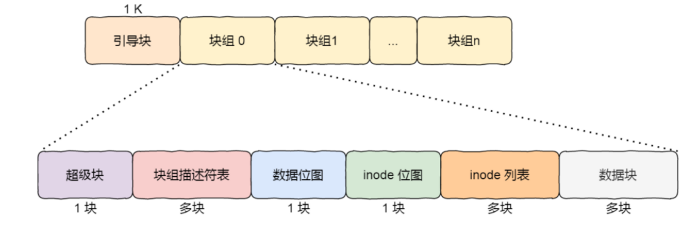

    

18. 文件的存储过程

    - 通过检查索引节点的位图，找到一个空闲的索引节点块，并将位图中的对应位置设置成1
    - 把对应的文件属性写入到找到的索引节点中
    - 在写入文件数据之前，先通过数据节点的位图找到空闲的数据节点，并将位图中的对应位置设置成1
    - 写入数据，并把这个数据节点的地址写入到索引节点中
    - 最后，把文件名和inode地址之间的映射关系写入到目录文件中

    

19. 说一下虚拟文件系统

    首先，根据存储位置，文件系统大致上能够分成磁盘的文件系统、内存的文件系统和网络的文件系统，为了屏蔽掉这些不同文件系统之间的差异，操作系统在用户层和文件系统之间加了一层中间层，也就是虚拟文件系统，用来提供统一的接口

    

20. 文件打开的流程

    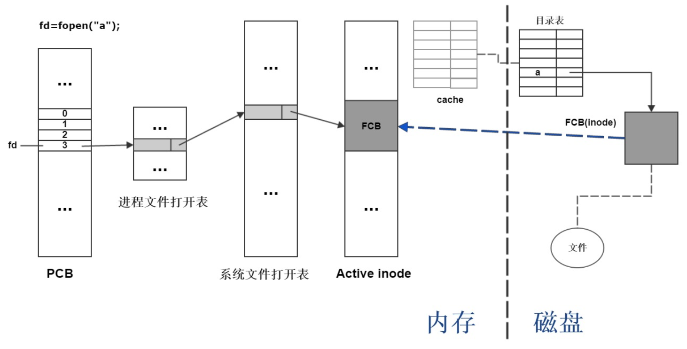

    当进程通过系统调用想要打开某个文件的时候，操作系统首先会通过文件名称在系统文件打开表中查找

    - 如果存在于系统文件打开表中，则表示这个文件已经被打开过了，这种情况下进程会先在他自己的文件打开表中为该文件添加一个表项，该表项指针指向系统文件打开表中该文件的表项，然后在PCB中为该文件分配一个文件描述符fd，指向进程文件打开表的相应表项
    - 如果不存在于系统的文件打开表中，首先会通过文件名查找内存中的目录项，如果还没有，那么只能够去磁盘中的目录中进行查找，找到之后加载到内存中，根据该目录项中的索引节点指针，找到磁盘中inode的相应位置，然后将这个inode加载进内存的Active inode中，然后再系统文件打开表中添加表项，将该表项的指针指向Active Inode中的inode，然后在进程打开表中添加表项，将该表项的指针指向系统文件打开表中的相应位置，最后在PCB中为该文件分配一个文件描述符，指向进程打开表中的相应表项

    > 从上面的过程中，也可以看出，当进程关闭文件的时候，会删除进程文件打开表中的对应表项，但是只有当所有打开该文件的进程都关闭这个文件，系统文件打开表才会把它给删除了

    

21. 文件的存储方式

    文件的存储方式从大方向上分成了两种：连续存储和非连续存储，非连续存储又分成了链式存储和索引存储

    连续存储就是将文件的数据都存放到一段连续的磁盘空间中，这种模式下，文件的数据是紧密相连的，因此文件的读写效率较高，文件头中也只需要给出文件数据的起始位置和长度，但是这种方式也存在缺点：比如容易产生内存碎片，文件大小不易扩展

    针对这上述缺点，又出现了链式存储，也就是每个节点中开辟出一小部分内存来存放指向下一个节点的指针，这样文件头中只需要给出文件数据的起始位置和结束位置即可，但是对于文件的读写必须要从头开始，而且稳定性较差，如果某个节点上的指针损坏，后面的文件数据将无法读取

    最后，是索引存储方式，实现方式是为每个文件创建一个索引数据块，里面存放的是指向文件数据块的指针，那么文件头中只需要存放这个索引数据块的地址即可，如果文件很大，一个索引数据块放不下，我们还可以使用多级索引，即通过一个索引数据块来存放多个索引数据块的地址

    Unix就是使用的是索引存储方式，对于每个文件的文件头他会分配13个指针，前十个直接指向数据块，也就是对于小文件来说，能够通过直接查找的方式来减少开销。剩下的三个指针分别指向一级索引数据块、二级索引数据块和三级索引数据块

    

22. 文件系统对于（空闲）空间的管理

    大致上有三种方式，分别是空闲表法、空闲链表法以及位图法

    空闲表法和空闲链表法不适合大型文件系统，因为会使他们变得很大，因此现在一般是使用位图法

    也就是利用二进制的一个位来表示一个盘块的使用情况，1表示用过了，0表示空闲

    

23. 软链接和硬链接

    - 软链接是创建了一个新文件，但是新文件的内容确实另一个文件的地址，因此软链接可以跨文件系统

      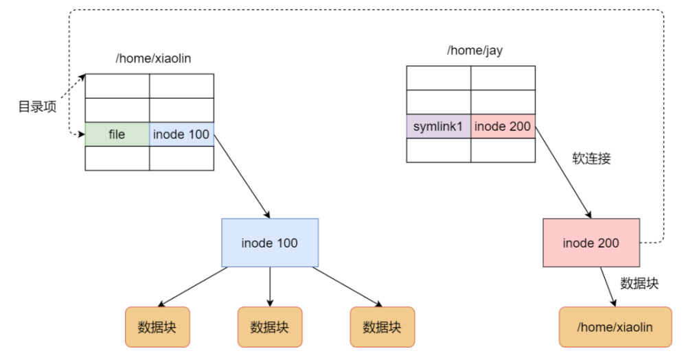

    - 硬链接指的是多个目录项中的索引节点指向同一个文件（inode），因为inode不能跨文件系统，所以，硬链接不能跨文件系统，由于是多个目录项同时指向一个inode，因此只有删除了全部的硬链接和源文件，才算是彻底删除

    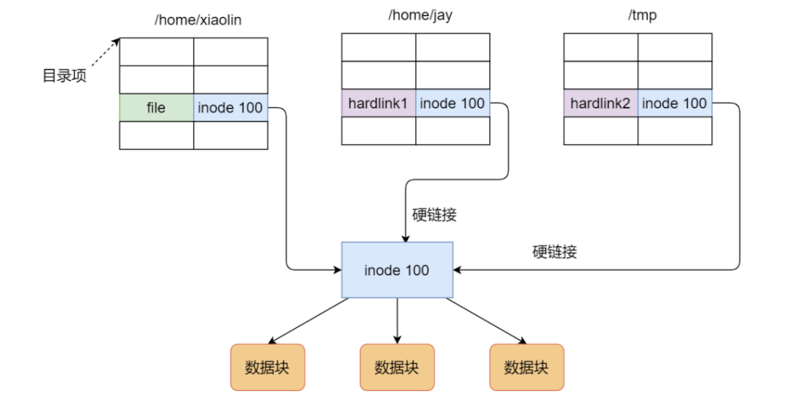

24. 说一下文件IO

    文件IO能够分为直接IO和非直接IO，缓冲IO和非缓冲IO，阻塞IO和非阻塞IO，同步IO和异步IO

    直接IO和非直接IO指的是是否使用内核缓冲区，也就是说直接IO就是文件系统直接和磁盘进行交互，不会将目录项等数据结构存入到内核缓冲区

    缓冲IO和非缓冲IO指的是是否使用标准库实现的缓存，也就是说缓冲IO的数据流向路径是应用 -> 流缓冲区 -> 内核缓冲区 -> 磁盘

    阻塞IO和非阻塞IO也就是我们常说的BIO和NIO，阻塞IO指的是当应用程序执行操作之后，如果没有收到响应，那么应用程序将会进入阻塞状态，自然也就不能够执行其他任务，阻塞过程主要是等待两个过程的完成，分别是数据准备好，和数据从内核缓冲区拷贝到了应用程序缓冲区，等这两个过程都完成之后，结束阻塞，系统调用返回，应用程序处理数据

    对于非阻塞IO，主要是当进程等待数据准备和数据拷贝两个过程的时候，不会阻塞当前进程，可以去执行其他任务，随后通过轮询或者事件通知的方式来获取系统调用的结果，轮询的时候会一直占用CPU，不断询问内核数据是否准备好，目前常用的NIO模型是基于事件通知的，当数据准备好之后，内核会通知应用程序，随后应用程序会通过系统调用将数据从内核缓冲区复制到自己的应用程序缓冲区，在数据准备的过程中，也就是内核通知之前，CPU可以被其他进程占用，去执行其他任务，比如多路复用的非阻塞IO，select、poll、epoll

    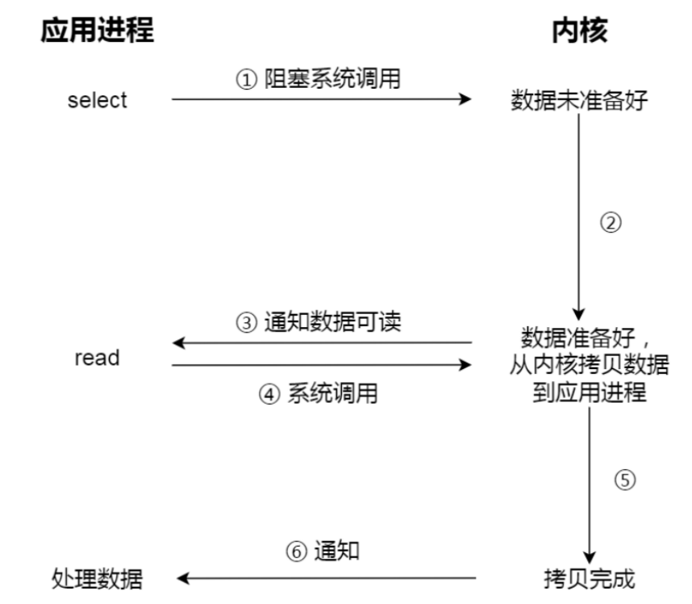

    上面所说的都是同步IO，异步IO也就是AIO，数据准备和数据拷贝这两个过程都是不用等待的，应用程序发起系统调用之后，CPU可以让给其他进程使用，直到这两个过程都完成了，内核才会通知应用程序，这时应用程序直接处理数据即可

    

25. 说一下select、poll、epoll

    select和poll没有本质区别，内部都是使用线性结构来存储进程关注的socket集合，select使用的是位图，poll使用的是链表，在使用的时候，首先需要通过select/poll系统调用将进程关注的socket集合从用户态拷贝到内核态，然后由内核检测事件，当有事件发生时，内核需要遍历这个socket集合，找到对应的socket，将其标记为可读/可写状态。之后再将整个的socket集合从内核态拷贝到用户态，应用程序再去遍历这个socket集合找到发生事件的socket，做进一步处理。可以看出，select和poll都会发生两次的集合拷贝和遍历，客户端越多，socket集合就越大，复制和遍历的代价就越大。

    而epoll底层使用的是红黑树和链表，通过红黑树来保存全部的socket集合，遍历红黑树的时间复杂度是O(logN)，链表中保存的是就绪事件，当有事件发生时，内核会找到这个socket，并将其复制到链表中，然后通过将这个链表从内核态复制到用户态即可，而不必复制全部的socket集合并遍历他

    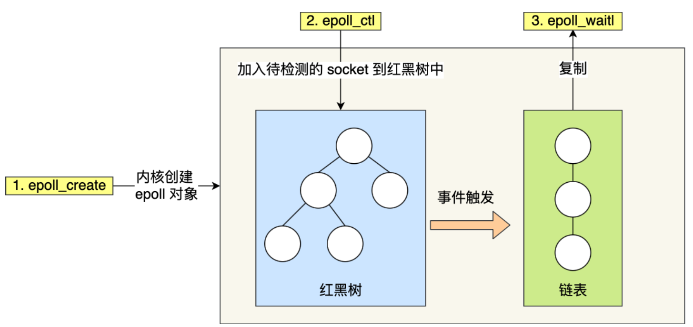

    

26. 说一下ET和LT

    ET指的是边缘触发，LT指的是水平触发，select和poll只支持LT，epoll还支持ET

    - 如果使用边缘触发模式，当被监控的socket集合中有事件发生时，服务端只会从epoll_wait中苏醒一次，如果此后一直没有新事件发生，那么将不会苏醒，因此在这种模式下，要尽可能的一次性多读取数据
    - 如果使用水平触发模式，当被监控的socket集合中有事件发生时，服务端会从epoll_wait中苏醒多次，直到内核缓冲区中的数据被读完

    > 你的快递被放到了一个快递箱里，如果快递箱只会通过短信通知你一次，即使你一直没有去取，它也不会再发送第二条短信提醒你，这个方式就是边缘触发；如果快递箱发现你的快递没有被取出，它就会不停地发短信通知你，直到你取出了快递，它才消停，这个就是水平触发的方式。
    
    
    
27. `++i,i++`这种操作是不是线程安全的

    不是，因为`i++`不是原子操作，它实际上分成了三个步骤：

    - 读值，将变量的值从内存读取到寄存器中
    - +1，寄存器自增
    - 将值写回到内存中

    上面的这三个步骤中，任何一个阶段发生CPU调度，造成变量的值被修改都有可能导致脏读、脏写

    但是需要注意的是，如果变量`i`在方法中，那么他是线程安全的，因为每个方法栈都是线程私有的，如果是类的静态成员变量，那么i++则不是线程安全的，因为类成员变量位于方法区中，而方法区是线程共享的

    如果想让`i++`线程安全，那么可以使用`synchronzied`关键字和`AtomicInteger`关键字来保证这条命令的原子性，使用volatile不管用，因为volatile这个关键字是用来保证可见性的
    
    
    
28. 分别说一下kill、kill -9、kill -2

    kill命令用于终止Linux进程，默认情况下，如果不指定信号，kill等价于kill -15，kill -15执行的时候，系统会向对应的程序发送SIGTERM信号，该信号是可以被执行、阻塞和忽略的，所以应用程序接收到信号后，可以选择立即停止程序、释放相应资源之后停止程序、忽略掉这个信号继续执行该程序，因此kill -15只是来通知进程“安全、干净的”退出。

    而kill -9就比较强硬了，系统会发出SIGKILL信号，他要求接收到该信号程序应该立即结束运行，不能被阻塞或者忽略，所以相较于kill -15，kill -9在执行时，应用程序是没有时间进行“准备工作”的，所以这通常会带来一些副作用，比如数据丢失或者进程无法恢复到之前的状态等

    kill -2其实就相当于CTRL C，即结束前台进程
    
    
    
29. 介绍一下CAS锁

    CAS锁实际上是乐观锁的一种实现，所谓乐观锁就是每次不加锁,假设完成某项操作不会发生冲突，如果发生冲突了那就去重试，直到成功为止

    CAS锁的实现主要是由三个操作数来完成的，这三个操作数分别是内存地址V，旧的预期值A，要修改的新值B

    CAS锁就是Compare And Swap，compare比较的是内存地址V处的值和A进行对比，如果相等的话，那么就将B的值swap到V处，如果不相等的话，就需要重新获取V处的值、得到旧的预期值以及计算要修改的新值B，一直不相等的话，就一直比较，这个重新尝试的过程叫做自旋

    通过上面的过程可以看出，CAS锁的缺点是CPU开销大（因为有可能一直自旋），不能够保证代码块的原子性，只能够作用于变量，最严重的缺点是存在ABA问题，比如有三个线程，比如最开始A将值修改为100，B再修改成50，随后C又修改成100，解决ABA问题的办法就是给变量添加版本号
    
    > 对于自旋锁和互斥锁，我们上面说了自旋锁会一直占用着CPU，不断尝试
    >
    > 对于互斥锁，如果线程加锁失败，那么内核会设置线程为睡眠状态，即陷入内核态，也就是从用户态切换到内核态，直到锁被释放，内核会在合适的时机唤醒该线程，然后该线程再从内核态切换回用户态。用户态和内核态的来回切换是互斥锁性能开销的主要原因。
    >
    > 因此当能够确定被锁住代码执行时间较短时，可以使用自旋锁，反之，使用互斥锁


### 网络

1. TCP和UDP的区别

   - TCP是面向连接的协议，UDP是无连接的协议，所以TCP必须是一对一的协议，而UDP支持一对一、一对多、多对多

   - TCP中通过确认序列号、三次握手等机制来保证数据的有序可靠传输，同时TCP中还有流量控制和阻塞控制让发送发根据接收方和网络的能力来发送数据，而UDP中没有这些机制，UDP协议会尽自己最大的努力去尽可能多的发送包，不管接收方的能力以及网络是否拥堵
   - TCP是基于字节流的传输层协议，而UDP是基于数据报的传输层协议
   - TCP中有自己特有的分片机制，当TCP报文超过MSS时，需要进行分片，当TCP中的分片丢失之后，只需要重传这个丢失的分片即可，而UDP则是根据数据链路的MTU进行分片，当某个分片丢失之后，需要重传整个报文
   - TCP的包头长度至少要20字节，UDP包头长度是固定的8字节

   > 通常，TCP的应用主要使用的是它的可靠性，比如http/https，FTP文件传输，UDP的应用主要是使用它发送快，对可靠性要求不高的特性，比如视频、音频等媒体传输，广播通信，DNS等包总量较少的通信

   

2. TCP三次握手的过程，两次有什么问题

   假设客户端是发起连接方，服务器是被动连接方

   - 客户端向服务器发送SYN请求连接报文，假设报文中的序列号seq=x，此时客户端处于SYN_SENT状态
   - 服务端收到这个SYN报文之后，会向客户端返回一个SYN+ACK报文，其中序列号seq=y，确认序列号ack=x+1，表示已经收到了客户端的SYN请求报文，此时服务器处于SYN_RECV状态
   - 客户端收到来自服务器的SYN+ACK报文之后，会处于Established状态，然后会向服务器响应一个ACK报文，其中确认序列号ack=y+1，表示已经收到了服务器发送过来的报文，服务器收到之后，变为Established状态

   因为TCP是全双工的通信协议，如果只有两次握手，那么就不能够保证TCP的可靠连接，因为无法确定服务器发送的SYN请求报文是否被客户端接收到，也就是两次握手无法保证序列号被同步，而且两次握手也不能够阻止历史连接

   至于为什么不使用四次握手，那就是可以但没必要了，四次握手也就是把SYN+ACK这个报文分成两次发送，没有必要，多发送一次就会造成更多的资源浪费

   

3. TCP四次挥手的过程，为什么要四次，为什么要有TIME_WAIT状态

   假设客户端是主动断开方，服务器是被动断开方

   - 客户端向服务器发送FIN报文，表示想要断开连接，此时客户端处于FIN_WAIT1状态
   - 服务器收到客户端的FIN报文之后，向客户端响应ACK报文，表示同意断开连接，进入CLOSE_WAIT状态
   - 服务器同意断开连接之后，他可能还有数据没有发送完，所以当数据发送完了之后，才会给客户端发送FIN报文，表示服务器没有数据要发送了，随后服务端进入LAST_ACK状态
   - 客户端收到这个FIN报文之后，向服务器回复ACK报文，表示同意断开连接，随后客户端进入TIME_WAIT状态，经过2MSL之后连接关闭，服务器收到ACK之后关闭连接。

   有TIME_WAIT状态的原因有两个：一个是为了让被动断开方的连接能够正常关闭（比如最后一次的ACK丢失了，那么FIN报文会重发），第二个原因是为了让所有旧连接的数据包都过期，也就是能够避免旧连接上的数据包被新连接接收到

   

4. 服务器中存在大量TIME_WAIT状态的连接的危害是什么

   服务器中存在大量的TIME_WAIT状态的连接就表示这连接还未完全断开，连接所占用的资源比如文件描述符等还没有释放，所以会造成服务器的资源紧张，具体表现在：当时高并发的场景时，会导致服务器的大量端口被占用，新的连接请求失败，而且服务器上是使用线程池来处理连接请求的，这也会导致线程池的资源释放不出来，同样不能处理其他的连接请求

   

4. HTTP的状态码有哪几类

   - 1xx，表示的是中间状态，很少使用，表示还没有处理完，需要继续进行处理
   - 2xx，表示成功状态，200表示的是ok，返回的响应信息中包含了包体的数据，204表示返回的响应信息中只有头部信息，206表示返回的响应信息中有部分的包体数据
   - 3xx，表示重定向，比如301表示的是永久重定向，302表示的是临时重定向，304表示缓存重定向
   - 4xx，表示客户端出现错误，400表示的是bad request，是一个比较笼统的错误，403表示的是客户端权限不够，服务器禁止访问，404表示资源找不到了
   - 5xx，表示服务器出现错误，500也是一个比较笼统的错误，501 表示请求的功能尚未提供，有点敬请期待的意思，502 Bad Gateway，通常是服务器作为网关或者时发生的错误，发生这个错误时表示的是服务器本身没有问题，而是后台程序出现了问题，503 service unavailable，表示服务器繁忙，暂时不能提供服务
   
6. 访问url的过程

   1. 首先，用户在浏览器中输入url，会先对url进行地址解析
   2. 解析成功之后，客户端会生成请求信息，即HTTP请求报文
   3. 在数据包发送之前，根据域名去寻找ip地址，这里依次向浏览器缓存、操作系统缓存、HOSTS文件、本地DNS服务器缓存中查找，如果都没有，才会使用DNS协议依次访问根域名服务器、顶级域名服务器、权威域名服务器，从而得到IP地址
   4. 得到IP地址之后，会向服务器发起连接，即TCP三次握手
   5. 连接成功之后，发送请求数据，服务器响应请求，客户端收到响应数据之后，在浏览器中将数据渲染出来
   6. 通过四次挥手关闭连接

   

7. 单工指的是单向通信，半双工指的是两边都能通信，但是不能同时通信；全双工则是两边可以同时通信，也就是可以一边发送一边接受；所以说HTTP/1.1是半双工的，HTTP/2才是全双工的

   

8. HTTP/1.1和HTTP/2的区别

   HTTP/1.1的特点就是默认了长连接，以及使用管道网络传输，因此这也使得HTTP/1.1存在队头阻塞的问题，当前一个请求需要的时间比较长，那么后面的请求就迟迟得不到响应，此外，HTTP/1.1还有以下缺点，比如头部存在大量的冗余字段，没有对头部进行压缩，然后HTTP/1.1中的请求只能从客户端发起，服务器被动响应

   上面的这些问题在HTTP/2中均得到了解决，HTTP/1中将HTTP数据包分成了头信息帧和数据帧，也就是将数据通过二进制帧的形式来进行传输，这样更有利于提高计算机的处理效率，而且HTTP/2中引入了Stream，通过并发不同的Stream来解决HTTP/1.1中的队头阻塞问题，请求不是按照顺序进行发送的了；此外，HTTP/2中使用HPACK算法来对头部信息进行压缩，具体是使用静态表、动态表和哈发曼编码来进行压缩；最后HTTP/2中添加了服务器主动推送功能，比如当客户端请求HTML页面的时候，服务器可能会把css、js文件一并发送过去

   

9. 如果优雅的关闭TCP连接？

   shutdown和close的区别，使用shutdown
   
   - shutdown是一种优雅的单方向或者双方向关闭socket的方法，而close则是立即双方向强制关闭socket并释放相关资源
   - 如果多个进程共用一个socket，shutdown会影响所有的进程，而close只影响本进程
   
   shutdown可以分别关闭读写或者同时关闭读写
   
   如果关闭读，则接收缓冲区中未读出的所有数据都将丢失，以后不再接受任何数据
   
   如果关闭写，则输出缓冲区内中的数据，则所有数据发送出去之后将发送一个FIN信号
   
   而close则是直接关闭该socket，马上发送FIN信号，所有未完成发送或者接收的数据都将被丢弃
   
   对于慢速网络应该先进行shutdown，然后一定的时间延迟，在close该socket
   
   
   
10. 说一说什么是cookie和session，以及他们两个之间的区别

   两者都是用来跟踪浏览器用户身份的会话方式，但是两者的应用场景不太一样

   Cookie一般用来保存用户信息，存储在客户端，比如我们如果在cookie中保存了已经登陆过的用户信息，在cookie有效期内再次访问该页面的时候不需要再次填写相应的信息，这是因为用户在登录的时候存放了一个token在cookie中，下次登陆的时候只需要根据token值来查找用户即可

   Session的主要作用是用来记录用户的状态，存储在服务器端，当用户发起请求时，通过cookie中保存的session ID可以向服务器查询当前用户的Session，从而获取当前用户的状态。

   > 如果浏览器禁用cookie，怎么办呢？
   >
   > 常见的方式是通过url重写把session ID附到URL路径的后面

   

11. URL和URI的区别

    URI叫做统一资源标识符，可以唯一标识一个资源

    URL叫做统一资源定位符，可以提供该资源的路径，它是一种具体的URI，即URL可以用来标识一种资源，还指明了如何定位这个资源

    URI更像是身份证号，而URL像是家庭住址。URL是一种具体的URI，因为它不仅可以标识资源，还能够定位资源
    
    
    
12. 公钥加密、私钥解密；私钥签名，公钥验签

    

13. 发生OOM怎么排查，CPU占用率100%怎么排查

    


### 数据库

1. 事务是什么

   事务是逻辑上的一组操作，要么不做，要么全做，最经典的一个案例就是银行转账了，小明给小红转账300块，如果成功，小明账户上要减少300，小红账户上要增加300，如果失败，那么不能出现小明账户减少而小红增加等其他情况，也就是要么全成功，要么全失败

2. MySQL中的事务隔离级别，默认是哪个

   共有四个隔离级别，分别是：Read Uncommited（读未提交）、Read Commited（读已提交）、Repeated Read（可重复读）、Serialiable（串行化），默认隔离级别是可重复读

   在可重复读级别下，能够通过加上Next-Key Lock来解决幻读问题

3. 说一下说一下数据库的索引

   首先，从总体上说索引分成了主键索引和辅助索引，而对于这两种索引是不是聚簇索引还需要看看是不是InnoDB引擎，在InnoDB引擎中，主键索引就是聚簇索引，所谓的聚簇索引就是key和记录放在了一起，即B+树的叶子节点中存放的是整条记录，因此InnoDB中的主键索引很快，但是InnoDB中的辅助索引叶子节点中存放的是主键，因此需要再次进行查询，这也就是我们说的回表，因此在InnoDB引擎中我们需要看看能不能使用覆盖索引。至于MyISAM引擎，主键索引和辅助索引并没有什么特别大的不同，唯一的不同之处就是主键索引必须是唯一且不能为null，他们都是非聚簇索引，也就是说叶子节点中存放的是记录的地址，而不是记录本身

4. InnoDB的索引结构为什么使用B+树，不使用其他的数据结构

   首先，对于哈希表，能够利用哈希函数的特性将key随机散列到表中，这样就能够保证在O(1)的时间复杂度下找到相应的key，但是由于hash函数存在hash冲突，我们还需要使用开放地址法、链地址法等来解决这个问题，但是这还不是MySQL不使用哈希表作为索引的最主要原因，最主要原因是因为哈希表中无法做到顺序和范围查询

   然后，对于二叉搜索树、红黑树、SB树等二叉树结构，不使用他们的最重要原因是当数据量很大时，树的高度也会变得很高，这也直接导致了搜索效率的下降，因为IO次数会变多，不利于MySQL的磁盘寻址，而且对于BST这种类型，当数据是顺序递增或者递减的时候，二叉树还会退化成一个链表，这样的效率更低了

   最后，为什么不使用B树，对于这个问题我们需要知道B树和B+树的区别是什么？首先B树能够完成的工作，B+树能够更好更快的完成，第二B+树的扫表、扫库能力更加强，如果根据索引进行全表扫描，B树需要遍历整棵树上的全部节点，B+树只需要遍历树中的叶子节点，第三B+树的查询效率更加稳定，因为B+树中只有叶子节点才有数据，所以每次查询的IO次数都是稳定的，同样是由于只有叶子节点有数据这个特性，我们能够知道B+树读写磁盘的能力更强，所以B+树一次磁盘读写能够加载的数据更多，最后B+树天然上还具有排序功能

5. 联合索引底层原理+最左匹配原则？为什么会有最左匹配原则

   我们知道如果创建的是单列索引，MySQL底层会创建一棵B+树，B+树的叶子节点中的数据是按照该列排序的

   而如果我们创建的是联合索引，MySQL底层仍然是只创建一棵B+树，不同的是叶子节点中数据的排列顺序，比如说我在某个表上对A字段和B字段加上了索引，A在前B在后，那么叶子节点中数据的排序会先按照A排序，如果A相同，那么就按照B排序，比如（1,1） （2,2） （2,1） （1,2），那在索引中的叶子节点的数据顺序就是（1,1）（1,2）（2,1）（2,2）

   这也是为什么联合索引的前缀能够使用到索引的原因（最左匹配原则）

   

   联合索引叶子节点中放的也是主键值（再根据主键值去主键索引的B+树中找到对应的完整的数据行---回表）

   

4. 什么是WAL技术，好处是什么？

   WAL中文全称是Write-Ahead Logging，他的关键点就是日志先写内存，再写磁盘。MySQL执行更新操作后，在真正把数据写入到磁盘前，先记录日志
   
   好处就是不用每一次操作都实时把数据写盘，就算crash后也可以通过redo log回复，所以能够实现快速影响SQL语句
   
   
   
4. 介绍一下redo log，为什么需要redo log

   redo log是重做日志，记录的是在某个数据页上的修改，redo log的写入时机是在事务的执行过程，它的作用就是当数据库服务器发生宕机、或者脏页未写入磁盘时，可以通过redo log恢复，需要注意的是redo log是InnoDB存储引擎所特有的
   
   使用redo log的目的就是为了配合MySQL的WAL机制。因为MySQL进行更新操作，为了能够快速响应，所以采用了异步写入磁盘技术，写入内存后返回。但是这样，会存在crash后内存数据丢失的隐患，而redo log具有crash safe的能力
   
   > 为什么redo log可以保证crash safe机制
   >
   > 因为InnoDB引擎中对于redo log的默认写入机制是实时写，实时刷，即每当事务提交之后，MySQL就会把redo log buffer写入到redo log file中，也就是说，每次完成操作之后，在redo log file中肯定有记录，如果写入失败，则表示此次操作失败，事务也不可能提交；此外，由于redo log内部结构是基于页的，记录了这个页的字段值变化，只要crash后读取redo log进行重放，就可以恢复机制
   
8. redo log的写入方式

   redo log包括两部分内存，分别是内存中的日志缓冲（redo log buffer）和磁盘上的日志文件（redo log file）

   MySQL每执行一个DML语句，会先把记录写入到redo log buffer，后续某个时间点再一次性将多条操作记录写入到redo log file中，这种先写日志，再写磁盘的技术，就是WAL

   在计算机操作系统中，用户空间下（user space）的缓冲区数据，一般是无法直接写入磁盘的，必须经过操作系统内核空间缓冲区（即OS Buffer）

   - 日志最开始会写入存储引擎InnoDB的redo log buffer，这个是在用户空间内完成的
   - 然后再将日志保存到操作系统内核空间的缓冲区（OS Buffer）中
   - 最后，通过系统调用`fsync`，从OS buffer写入磁盘上的redo log file中，完成写入操作，这个写入磁盘的操作，就叫做刷盘

   从上面的过程中我们可以发现，redo log buffer写入到redo log file，是需要经过OS buffer中转的，其实是可以通过参数`innodb_flush_log_at_trx_commit`进行配置，参数值的含义如下：

   - 0：称为延迟写，事务提交时不会将redo log buffer中的内容写入到OS buffer中，而是等待后台线程一秒一次的轮询使用（也就是每隔一秒将redo log buffer中的内容写入到OS buffer中，然后调用fsync进行刷盘），所以这种刷盘机制下，如果在此期间数据库失效或者宕机，有可能导致丢失这一秒内的操作
   - 1：称为“实时写，实时刷”，事务每次提交都会将redo log buffer中的日志写入到OS buffer并刷盘，即保存到redo log file中（默认），这种情况下即使发生数据库失效或者宕机，也不会丢失事务，因为redo log中没有的就是没有执行过/完的事务
   - 2：称为“实时写，延迟刷”，事务每次提交都会将redo log buffer中的日志写入到OS buffer，然后等待1秒1次的刷盘操作；这种情况下如果宕机，则会丢失掉多次事务

9. redo log的执行流程

   - MySQL客户端将请求语句`update T set a = 1 where id = 666`发送到MySQL Server层
   - MySQL Server收到请求之后，会对SQL语句进行分析、优化、执行等处理工作，将生成的SQL执行计划发到InnoDB存储引擎层执行
   - InnoDB存储引擎层将 a修改为1 这个操作记录到内存中
   - 记录到内存以后会修改redo log的记录，会在添加一行记录，其内容是需要在哪个数据页上做什么修改
   - 此后，将事务的状态设置为prepare状态，说明已经准备好提交事务了
   - 等到MySQL Server层处理完事务之后，会将事务的状态设置为commit，也就是提交该事务
   - 在收到事务提交的请求之后，redo log会把刚才写入内存中的操作记录写入到磁盘中，从而完成整个日志的记录过程

10. 说一下binlog，binlog能否实现crash safe机制

    与redo log这种物理日志不同的是，binlog是逻辑日志，他也叫做归档日志，属于MySQL Server层的日志，所以任何的数据引擎，只要发生了表数据更新，都会产生binlog，它作用是实现主从复制和数据恢复两种，当需要恢复数据时，可以取出某个时间段的binlog 进行重放恢复，binlog的记录方式有三种：

    - statement，基于SQL语句的复制，每一条会修改数据的sql语句都会被记录到log中，但是这种存在一个问题，比如`update_time=now() `，再次执行这条sql语句的时候，`now()`所代表的时间肯定是不同的，这样就造成了数据不一致问题，为了解决这个问题，我们需要将binlog的格式设置成row
    - row，通常情况下都是指定为row，这种情况下，保存的就不是简单的SQL语句了，还包含操作的具体数据，所以这种情况下就不会在产生数据不一致的问题，但是确定也很明显，那就是需要更大的容量来记录，比较占用空间
    - mixed，就是前两者的混合，MySQL会判断这条语句是否会引起数据的不一致性，如果不会那么就使用statement，如果会产生数据不一致，那么就使用row

    binlog不能实现crash safe机制，首先binlog的写入时机非常简单，在事务执行过程中，先把日志写到binlog cache中，当事务提交之后，再把binlog cache中的内容持久化到binlog file中。因为一个事务的binlog不能被拆开，无论这个事务多大，也要确保一次性写入，所以系统会为每个线程分配一个binlog cache。当线程出现问题或者数据库失效、宕机等，会导致binlog cache中的内容丢失，因此无法实现crash safe机制

11. 如果数据库误操作，如何执行数据恢复

    数据库在某个时间点误操作，就可以找到距离误操作最近的时间节点的binlog，重放到临时数据库中，然后选择误删的数据节点，恢复到线上数据库

12. binlog的刷盘时机

    所有未提交的事务产生的binlog，都会被先记录到binlog的缓存中，等该事务提交时，再将缓存中的数据写入binlog日志文件中，缓存的大小由参数`binlog_cached_size`控制，

    binlog什么时候刷盘到磁盘中呢？binlog的写入也分成了两个部分，write是把日志写入到OS cache中，fsync是把cache中的内容刷盘到磁盘中

    - 当`sync_binlog`为0时，每次提交事务都只是把binlog cache中的内容写入到OS cache中，也就是只执行write，fsync的执行则会由系统自行判断
    - 当`sync_binlog`为1时，每次提交事务都会执行write和fsync两个部分，也就是每次一提交，就会执行刷盘
    - 当`sync_binlog`为N时，每提交N个事务，才会执行刷盘操作

13. binlog和redo log的区别

    首先两者的作用不同，redo log主要用于容灾恢复和系统崩溃后恢复，binlog主要用于主从复制和数据恢复，redo log实现了crash-safe机制，binlog没有实现crash safe机制

    第二两者的内容不同，redo log中存储的是某个数据页上的修改，又称作物理日志，binlog中存储的是逻辑操作，比如SQL语句等，又称作逻辑日志

    第三两者的实现方式不同，redo log只有在InnoDB引擎中才会产生，而binlog是在MySQL Server层实现的，只要是数据表发生变化，就会产生binlog，与引擎无关

    第四两者的存储方式不同，redo log的存储空间是固定的，可以循环使用的，使用日志文件组来存储，新的日志内容会覆盖掉旧的日志内容，binlog就是持久化到磁盘中的一个文件，它的记录方式是追加到新的文件上，即redo log是循环写，binlog是追加写

14. MySQL的两阶段提交，为什么要使用两阶段提交

    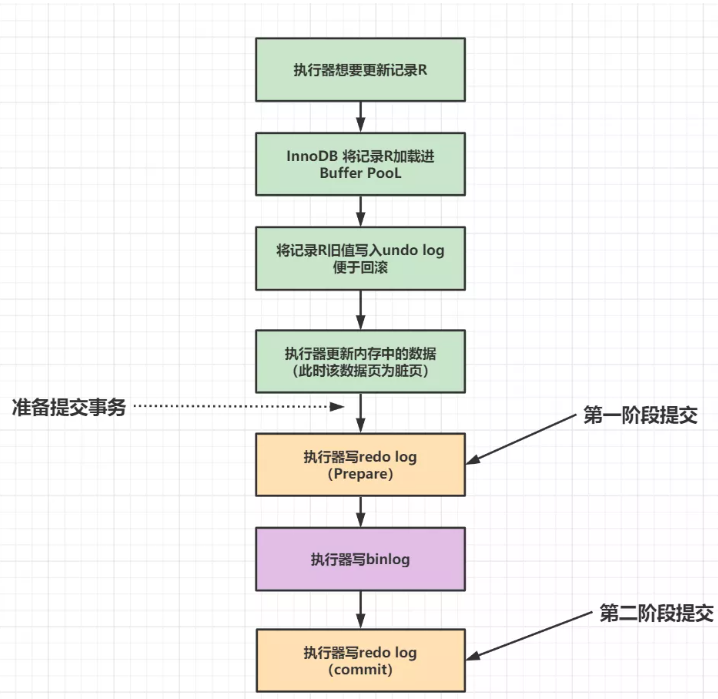

    两阶段主要指的是prepare阶段和commit阶段，两阶段主要有三个步骤：redo log在写入后，进入prepare阶段；第二步是执行器写入binlog；第三步是进入commit阶段，事务可以提交

    为什么要使用两阶段提交？

    使用两阶段提交的原因就是保证binlog和redo log中数据的一致性，只有这两个日志文件逻辑上高度一致了，才能够使用redo log将数据库恢复到crash之前的状态，使用binlog实现主从复制、数据恢复等，具体的：当redo log处于prepare状态但是binlog中却没有相应记录时，数据恢复使会回滚这个事务；当redo log处于prepare状态，但是binlog中有相应记录，这两个日志能够正常使用；当redo log处于commit状态，binlog中的记录肯定是完整的，也能够正常使用

    如果不使用两阶段提交，可能会遇到的问题：

    - 先写redo log，但是binlog在刷盘前发生了crash，这导致binlog中少了一条记录，在进行主从复制的时候，会导致其他从数据库和当前数据库中的内容不一致
    - 先写binlog，crash后，由于redo log未写入，事务无效，所以后续binlog备份恢复时，数据不一致

15. 介绍一下undo log

    undo log叫做回滚日志，用于记录数据被修改前的信息

    他跟redo log重做日志记录的内容恰好相反，重做日志记录数据被修改后的信息，undo log主要记录的是数据的逻辑变化，为了在发生错误时回滚之前的操作，需要将之前的操作记录下来，这样发生错误时才可能回滚


### Java基础

1. 说一下什么是反射

   反射就是在运行状态中，对于任意一个类都能够知道这个类的所有属性和方法；对于任意一个对象，都能够调用它的任意属性和方法；并且能改变它的属性，而这也是Java被视为动态语言的一个关键性质

   反射机制允许程序在运行的时候取得任意一个已知名称的class的内部信息，但是反射使用不当会造成很高的性能损耗

   ```java
   Class class1 = Class.forName("package_name.className");
   Object o1 = class1.newInstance();   // 通过反射创建一个实例
   
   // 除此之外，还有其余两种用于获取class对象的方法
   Person p1 = new Person();
   Class c1 = p1.getClass();
   // 第三种方法
   Class c2 = Person.class;
   ```

2. 说一下JDK动态代理

   JDK动态代理是面向接口的实现模式，通过反射机制得到动态代理类的构造函数，其唯一的参数类型就是调用处理器接口类型，

   cglib动态代理是面向字节码的，将代理对象类的class文件加载进来，通过修改其字节码文件生成子类来处理

   

2. HashMap中是如何解决hash冲突的

   HashMap解决hash冲突主要有四种方法，分别是开放地址法、单独链表法、再散列、建立公共溢出区

   开放地址法主要就是对计算出来冲突的hash值在进行计算，开放地址法会根据当前的位置计算出下一个位置，将这个冲突的元素挪进来。如果这下一个位置也被占用了，那么就再计算下一个位置，直到找到一个空的位置。而对于探测函数又分为线性探测、二次探测和伪随机数探测

   单独链表法就是对于相同hash值的key使用链表来存储，Java中的HashMap就是使用这种方式，但是在JAVA8之后，当链表长度达到阈值的时候链表就会树化成一棵红黑树

   再散列指的是提供了多个函数，冲突时使用其他hash函数再次运算

   建立公共溢出区指的是建立一个溢出表，当hash冲突时，把这个key放入到溢出表中

   > 至于为什么HashMap使用红黑树，而不使用其他的AVL树，答案如下：
   >
   > 我认为最主要的原因就是红黑树相较于其他的AVL树，红黑树需要较少的旋转次数就能够正确地重新平衡数据结构，红黑树最多需要两次旋转就能够平衡，而AVL树可能需要log N次
   >
   > 而且如果使用B+树的话，B+树是“矮胖”的，当节点比较少的时候，B+树也是会退化成一个链表的

   

2. 为什么HashMap的长度要是2的幂次方呢？

   首先我们知道HashMap首先需要对key计算一次hash，然后将这个hash值映射到桶的相应位置，最容易想到的方法是hash%size，但是这样计算的效率是比较慢的，所以在源码中使用的方式是位运算，`(n-1) & hash`，只有当n等于2的幂次方的时候，这两个等式才是相等的

   

5. **<font color=red>ConcurrentHashMap</font>**

   ConcurrentHashMap本质上是一个线程安全且高效的HashMap实现

   > ConsurrentHashMap不允许key和value为null

   > JDK7中的HashMap是线程不安全的，当HashMap在put的时候，插入的元素超过了容量的范围就会引发扩容操作，因此会重新将原数组的内容hash到新的扩容数组中，在多线程的环境下，存在同时其他的元素也在进行put操作，如果hash值相同，可能出现同时在同一数组下用链表表示，因为JDK7中的HashMap插入元素使用的是头插法，所以可能造成闭环，在get的时候会出现死循环，所以HashMap是线程不安全的
   >
   > 关于hashmap扩容时造成闭环的讲解：[JDK7的HashMap头插法循环的问题，这么难理解吗？_哔哩哔哩_bilibili](https://www.bilibili.com/video/BV1n541177Ea/?spm_id_from=333.337.search-card.all.click&vd_source=a1e2c70ef5d0daa4d236df0d7d742588)
   >
   > 
   >
   > JDK8中的HashMap不再使用头插法，而是使用尾插法，虽然解决了头插法带来的环状链表问题，但在多线程下仍然会存在数据覆盖的问题

   此外，HashTable的实现和HashMap几乎完全相似，不同之处有两点：一是HashTable中不允许key和value为null，二是HashTable是线程安全的，但是他保证线程安全的代价太大了，他就是把put、get等操作加上了synchronized关键字，这相当于给整个的哈希表加上了一把大锁，只要有一个线程访问这个哈希表，其他的线程都会进入阻塞状态，也就是操作串行化，所以HashTable的性能很差，现在基本上不会使用到了

   可以看到HashTable性能差的原因就是所有的线程都去竞争同一把锁，而如果容器中有多把锁，每一把锁锁一段数据，这样在多线程访问不同段数据时就不会存在锁竞争了，这种**“分段锁”的思想就被用在了JDK7中的ConcurrentHashMap中了**。ConcurrentHashMap的主干是一个Segment数组，每一个Segment了类似于一个HashMap，对于不同Segment的操作无需考虑线程同步，因为他们锁住的是不同的数据，对于同一个Segment进行操作才需要考虑线程同步问题。因为一个Segment里面包含了一个HashEntry数组，每当需要对HashEntry数组中的数据进行修改时，必须首先获得对应Segment的锁

   **ConcurrentHashMap中的get方法不需要加锁，因为其中涉及到的共享变量都是用volatile修饰，volatile可以保证内存的可见性，所以不会读取到过期的数据；**ConcurrentHashMap中的put方法需要加锁了，只是加锁的力度变小了，put方法的主要逻辑也就两步：一是定位Segment并确保定位的Segment已经初始化了，二是调用Segment的put方法

   而在JDK8中抛弃了上一个版本中的Segment分段锁，而是使用Node+CAS+Synchronized来保证并发安全性，具体如下：

   - 当计算出当前节点在数组中的位置时，如果该位置为空，直接使用CAS操作插入，这种情况下是不需要上锁的
   - 如果数组中的位置已经存在节点了，说明发生了哈希冲突，这时才会**使用Synchronized对该节点加锁**，进入锁之后会先判断这是链表结构还是树结构，如果是树结构，直接调用插入方法插入，如果是链表，则遍历到最后插入，此外，ConcurrentHashMap还会判断插入之后的节点数是否大于等于8，如果是，则链表树化

   > [为什么HashMap线程不安全？以及实现HashMap线程安全的解决方案_gougege0514的博客-CSDN博客](https://blog.csdn.net/qq_46074155/article/details/120072178)
   >
   > [了解ConcurrentHashMap_concurrenthashmap在哪个包下_卑微小小羊的博客-CSDN博客](https://blog.csdn.net/a531878891/article/details/119792852)

2. int和Integer的区别

   - Integer是int的包装类，int是基本数据类型
   - Integer变量必须经过实例化后才能够使用，而int变量不需要
   - Integer实际上是对象的引用，当new一个Integer时，实际上是生成一个指针指向此对象，而int则是直接存储数据值
   - Integer的默认值是null，int的默认值是0
   
   > 所谓的装箱就是自动将基本数据类型转化成包装器类型，拆箱就是自动将包装器类型转换为基本数据类型
   >
   > 装箱的基本过程就是通过包装器的valueOf()方法实现的，而拆箱过程是通过调用包装器类型的xxxValue()方法实现的
   >
   > Integer a = 200; // 这其实就是一个装箱过程，即Integer a = new Integer(200);
   >
   > int b = a;             // 这是一个拆箱过程，即int b = Integer.intValue(a);
   >
   > 需要注意的是，在Integer、Character、Short、Byte中都有缓存机制，Double、Float中没有，浮点类型都是直接返回对象
   >
   > 对于Integer类型，其缓存范围是[-127,128]，也就是说在这个范围内进行赋值，变量的引用都是一样的
   >
   > ```java
   > Integer a = 100;
   > Integer b = 100;
   > sout(a == b);   // true,a和b指向的都是缓存中的对象
   > Integer c = 200;
   > Integer d = 200;
   > sout(c == d);   // false，因为new Integer(200)分别执行两次，这两个对象在堆内存中间中有不同的地址
   > 				// Integer中已经重写过equals了，所以可以使用equals来比较两者的大小
   > ```
   
   
   
7. 单例模式

   ```java
   // 懒汉式，所谓懒汉，就是延迟加载，当对象被使用到的时候才开始加载，但是他是线程不安全的
   public class Singleton {
       private static Singleton instance;
       private Singleton(){}
       
       public static Singleton getInstance() {
           if (instance == null) {
               instance = new Singleton();
           }
           return instance;
       }
   }
   
   // 饿汉式，类加载的时候，instance对象就会被实例化，因此饿汉式天然上就是线程安全的
   public class Singleton {
       private static Singleton instance = new Singleton();
       private Singleton(){}
       
       public static Singleton getInstance() {
           return instance;
       }
   }
   // 饿汉式这种方式很容易产生垃圾对象，当instance对象没有被使用到的时候，他仍然会被实例化出来
   
   // 因此为了改进懒汉式，使之变成线程安全的，主要有两种方法，第一种方法就是给getInstance方法加上synchronized关键字
   // 第二种方法是双重校验，如下
   public class Singleton {
       private static volatile Singleton instance;  // 使用volatile的作用就是为了避免指令重排，不然双检锁可能失效
       private Singleton(){}
       // 程序运行时创建一个静态只读的进程辅助对象
       private static final Object lock = new Object();  
       
       public static Singleton getInstance() {
           if (instance == null) {
               // 确保只有一个线程能够进入
               synchronized(lock) {
                   if (instance == null) {
                       instance = new Singleton();
                   }
               }
           }
           return instance;
       }
   }
   ```

8. 工厂模式

   ```java
   public interface Food {
       public void desc();
   }
   
   public class Meet implements Food {
       @Override
       public void desc(){
           sout("我是肉");
       }
   }
   
   public class Fish implements Food {
       @Override
       public void desc(){
           sout("我是🐟");
       }
   }
   
   public class FoodFactory {
       public static Food createMeet() {
           return new Meet();
       }
       
       pubic static Food createFish() {
           return new Fish();
       }
   }
   ```

   

6. 虚拟机是如何判断一个对象是否死亡的？

   虚拟机判断一个对象是否死亡共有两种方法：一种是引用计数法，给对象添加一个引用计数器，每当增加一个地方引用这个数据，计数器就加1，当引用失效，计数器减1，任何时候计数器为0的对象就是不可能再被使用的对象；第二种方法是可达性分析算法，这个算法的大致思路就是通过一系列被称作GC Root的对象为起点，从这些节点开始向下搜索，节点所走过的路径叫做引用链，当一个对象到GC Roots没有引用链的时候，就称作这个对象是不可达的，不可达的对象可以被GC掉

   

4. Java中可以作为GC Roots的有哪些？

   - **虚拟机栈中引用的对象**
   
     ```java
     public class Test {
         public static void main(String[] args) {
             Test a = new Test();
             a = null;
         }
     }
     ```
   
     a是栈中的本地变量，当a=null时，由于此时a充当了GC ROOT的作用，a与原来指向的实例new Test()断开了连接，所以对象会被回收
   
     
   
   - **方法区中类静态变量引用的对象**
   
     ```java
     public class Test {
         public static Test s;
         public static  void main(String[] args) {
             Test a = new Test();
             Test.s = new Test();
             a = null;
         }
     }
     ```
   
     当栈帧中的本地变量 a = null 时，由于 a 原来指向的对象与 GC Root (变量 a) 断开了连接，所以 a 原来指向的对象会被回收，而由于我们给 s 赋值了变量的引用，s 在此时是类静态属性引用，充当了 GC Root 的作用，它指向的对象依然存活!
   
     
   
   - **方法区中常量引用的对象**
   
     ```java
     public class Test {
         public static final Test s = new Test();
         public static  void main(String[] args) {
             Test a = new Test();
             a = null;
         }
     }
     ```
   
     常量s指向的对象并不会因为a指向的对象被回收而回收
     
   - **本地方法栈中JNI引用的对象（即一般说的Native方法）**
   
     当调用Java方法时，虚拟机会创建一个栈帧并将方法压入Java栈，而当它调用的是本地方法时，虚拟机会保持Java栈不变，不会在Java栈帧中压入新的帧，虚拟机只是简单地动态连接并直接调用指定的本地方法
   
     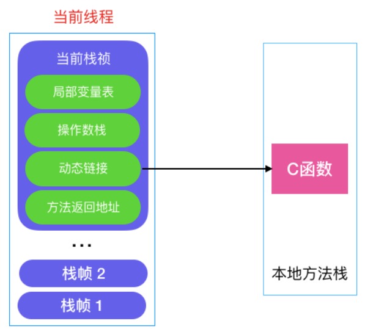
   
     > 所谓本地方法就是一个Java调用非Java代码的接口，该方法并非Java实现，可以是由C或者Python等其它语言实现的，**Java是通过JNI调用本地方法**，而本地方法是以库文件的形式存放的（在Windows平台中是DLL文件的形式，Unix平台上是SO文件形式）。通过调用本地的库文件的内部方法，使Java可以实现和本地机器的紧密联系，调用系统级的各接口方法
     
     
   
4. 简单地介绍一下引用

   首先，无论我们使用引用计数法还是可达性分析算法来判断对象是否死亡，都用到了引用的概念，传统意义上，引用就是指的reference中存储的数值代表另一块内存的地址，这被叫做一个引用；而现在引用通常是分成了四类：强引用、软引用、弱引用、虚引用。
   
   如果一个对象具有强引用，那么垃圾回收器绝对不会回收这个对象，他可以类比成“生活中必不可少的生活用品”，当内存空间不足时，虚拟机宁愿抛出OutOfMemoryError的错误，使得程序异常中止，也不会随意回收有强引用的对象来释放空间
   
   如果一个对象具有软引用，有软引用的对象相当于可有可无的生活用品，当内存不足时，垃圾收集器可以回收具有软引用的对象来释放空间，但是只要垃圾收集器没有回收他，该对象就能够被程序继续使用，软引用可用来实现内存敏感的高速缓存
   
   弱引用也可以类比成可有可无的生活用品，他和软引用的区别在于只有弱引用的对象具有更短的生命周期，因为只要是垃圾收集器扫描到了只具有弱引用的对象，不管内存空间充足与否，都会把它回收掉。但是由于垃圾收集器具有较低的优先级，所以只具有弱引用的对象不一定很快就会被清理掉
   
   如果一个对象只有虚引用，那么它就相当于没有引用，虚引用主要用来跟踪对象被垃圾回收的活动，与软引用和弱引用不同的是，虚引用必须要和引用队列（ReferenceQueue）联合使用，当垃圾收集器准备回收一个对象的时候，如果发现他还有虚引用，那么就会在垃圾回收之前，把这个对象放到与之关联的引用队列中，程序如果发现某个虚引用在引用队列中，就可以在垃圾回收之前采取必要的行动
   
   
   
4. ThreadLocal的简单描述

   ThreadLocal类的目的就是想为每一个线程都可以拥有自己的专属本地变量，如果创建了一个ThreadLocal变量，那么访问这个变量的每个线程都会保存有这个变量的本地副本，他们可以使用get和set方法来获取默认值或将其值更改为当前线程所存的副本的值，从而避免了线程安全问题。ThreadLocal内部维护了一个ThreadLocalMap的数据结构，它的key就是ThreadLocal对象，value就是ThreadLocal对象调用set方法设置的值，但是由于ThreadLocalMap中使用的key为ThreadLocal的弱引用，而value是强引用，所以ThreadLocal在没有外部强引用的情况下，在垃圾回收的时候key会被清理掉，而value不会被清理掉，这样一来ThreadLocalMap中就会出现key为null的Entry，如果没有任何措施，那么value将永远不会被GC掉，所以也就产生了内存泄漏。ThreadLocalMap实现中已经考虑了这种情况，在调用 set() 、 get() 、 remove() 方法的时候，会清理掉 key 为 null 的记录。使用完 ThreadLocal 方法后 最好手动调用 remove() 方法
   
   
   
5. 面向对象的几大特性，在Java语言下多态怎么实现

   面向对象的三个基本特征是：封装、继承、多态

   封装和继承的目的都是为了代码重用，多态的目的是为了实现接口重用

   - 封装是指把客观事物抽象成类，并且类可以让自己的属性和方法只让可信的类和对象操作，对不可信的类和对象进行信息隐藏

     在Java中类中成员的属性有public，protected，default，private，访问权限依次降低

   - 继承是指可以使用现有类的所有功能，并在无需重新编写原来的类的情况下对这些功能进行扩展，继承的实现分成了两类：

     - 实现继承，指的是直接使用父类的属性和方法而无需额外的编码
     - 接口继承，指的是只使用父类的属性和方法的名称，子类必须提供对于方法的实现的代码

     > 接口和抽象类的区别
     >
     > 1. 从设计层面上来看，抽象是对类的抽象，是一种模板设计，而接口是对行为的抽象，是一种行为规范
     > 2. 接口中除了static和final类型的变量以外，不能够有其他变量，但是抽象类中不一定
     > 3. 一个类可以实现多个接口，但是只能继承一个抽象类
     > 4. 接口方法的默认修饰符是public，抽象方法可以有public，protected和default这些修饰符（抽象方法就是为了被重写所以不能够用private修饰）
     > 5. 所有的方法在接口中不能够被实现，都是抽象方法，但是抽象类中就可以有普通方法
   
   - 多态是指虽然针对不同对象的具体操作不同，但是通过一个公共的类，他们可以通过相同的方式予以调用，实现多态有两种方式：覆盖（重写）和重载
   
     - 覆盖指的是子类重新定义父类的函数的做法
     - 重载指的是允许存在多个同名函数，而这些函数的参数列表不同（比如参数个数不同、参数类型不同等）
     
     > 重写和重载的区别
     >
     > 1. 重载是类中的同一个方法根据不同的输入参数做出不同的处理
     >
     > 2. 重写是子类继承自父类的相同方法，输入数据一样，但要做出有别于父类的响应时，你就需要覆盖父类方法
     >
     > 被final，static，private修饰的方法不能够被重写
   
   
   
11. 异常（Error和Exception）

    Error和Exception都是继承于Throwable类，在Java中只有Throwable类型的实例才可以被抛出（throw）和捕获（catch），他是异常处理机制的基本组成类型

    Error和Exception体现了Java设计者对于不同异常情况的分类：

    - Exception是指程序在正常运行过程中，可以预料到的出现的异常情况，可以并且应该被捕获，并进行相应的处理
    - Error是指在正常情况下，不可能出现的情况，绝大部分的Error都会导致程序处于非正常状态，不可恢复状态，既然是非正常情况，所以不便于也不需要捕获，常见的比如OutOfMemoryError之类的，都是Error的子类

    

12. ==和equals的区别

       ==的作用是判断两个对象的地址是不是相等，即判断两个对象是不是同一个对象（基本数据类型`==`比较的是值，引用数据类型`==`比较的是内存地址）

       `equals()`的作用是判断两个对象是否相等，他一般有两种使用情况：

       - 如果类没有覆盖（重写）equals方法，则通过equals比较两个类的对象时，等价于通过`==`来比较两个对象的地址
       - 如果类覆盖（重写）了equals方法，一般都是重写equals方法让他来比较两个对象的内容是否相等，如果两个对象的内容相等，那么就返回true


11. 面试官问题：你重写过hashCode方法吗，为什么重写equals方法必须要先重写hashCode方法

    ```java
    package chaptor04;
    
    public class Person {
        String name;
        int age;
        public static Person husband;
    
        public Person(String name, int age) {
            this.name = name;
            this.age = age;
        }
    
        public String toString() {
            return "Person{name=" + name + ", age = " + age + "}";
        }
    
        @Override
        public boolean equals(Object obj) {
            if (obj == null) {
                return false;
            }
            if (this == obj) {
                return true;
            }
            if (this.getClass() != obj.getClass()) {
                return false;
            }
            Person p = (Person) obj;
            // 注意String类型要用equals来比较是否相等
            // String类中重写了equals方法
            return this.name.equals(((Person) obj).name) && this.age == ((Person) obj).age;
        }
    
        public static void main(String[] args) {
            Person one = new Person("张三", 11);
            Person two = new Person("张三", 11);
            System.out.println(one.hashCode());	    // 1163157884
            System.out.println(two.hashCode());     // 1956725890
            System.out.println(one.equals(two));   // 没有重写equals前，是false
        }
    }
    ```

    从上面的例子中我们就可以分成两种情况：

    - 第一种情况是不会创建类对象的散列表，我们不会在HashSet, Hashtable, HashMap等等这些本质是散列表的数据结构中，用到该类。例如，**不会创建该类的HashSet集合。**

      这种情况下，判断两个对象是否相等和hashCode()没有任何关系，如上例，所以这种情况下判断两个对象是否相同只需要重写equals方法，而**不需要重写hashCode方法**

    - 第二种情况是会创建类对象的散列表，我们会在HashSet, Hashtable, HashMap等等这些本质是散列表的数据结构中，用到该类。例如，**会创建该类的HashSet集合。**

      在这种情况下，该类的hashCode和equals是有关系的：

      - 如果两个对象相等，那么它们的hashCode值一定是相等的，这里的相等指的是通过equals比较两个对象时返回的值为true

      - 如果两个对象的hashCode值相等，他们并不一定相等，因为在散列表中hashCode相等，就表示着两个键值对的哈希值相等，也就是我们所说的哈希冲突，因此，判断两个对象相等，除了要重写equals方法，还需要重写hashCode方法，如下例子：

        ```java
            public static void main(String[] args) {
                HashSet<Person> hs = new HashSet<>();
                Person one = new Person("张三", 11);
                Person two = new Person("张三", 11);
                Person three = new Person("里斯", 22);
        
                System.out.printf("one's hash:" + one.hashCode() + "; " + "two's hash" + two.hashCode() + "; " + "three's hash" + three.hashCode() + "\n");
        
                hs.add(one);
                hs.add(two);
                hs.add(three);
        
                System.out.printf("set: %s\n", hs);
            }
        
        // 输出结果
        one's hash:1163157884; two's hash1956725890; three's hash356573597
        set: [Person{name=张三, age = 11}, Person{name=张三, age = 11}, Person{name=里斯, age = 22}]
        ```

        可以看到结果，HashSet中有两个相同的数据，`name=张三, age = 11`，他们的hash值是不同的，所以都能够存放到HashSet中，但是这样是和HashSet的设计理念不符合的，因此我们还需要重写hashCode()方法，使得相同的对象的hashCode是相同的，比如我们可以如下重写

        ```java
        @Override
        public int hashCode() {
            int hash = name.toUpperCase().hashCode();
            return hash ^ age;
        }
        ```
        
        `hashCode()`的默认行为是对堆上的对象生成独特值，如果没有重写`hashCode()`，则class的两个对象无论如何也不会相等（即使这两个对象指向相同的数据）
        
        

12. **<font color=red>说一下JMM</font>**

    JMM全称是Java内存模型，JMM是一种虚拟机规范，**规定了Java虚拟机和计算机内存之间如何协同工作，**JMM能够屏蔽掉各种硬件和操作系统的内存访问差异，以实现让Java程序在各种平台下都能够达到一致的并发效果。其实我们可以这样理解，Java虚拟机是一个完整的计算机系统，在这个系统中的内存管理就是JMM。**JMM内存模型分成了主内存和工作内存，**主内存就是硬件内存，JMM规定了所有变量（除了局部变量和方法参数）都存储到主内存中，工作内存本质上是线程内部对于主内存的一个缓存，即**线程的工作内存中保存的是线程使用到的变量的主内存副本拷贝，线程不可以直接读写主内存中的变量**，线程对变量的所有操作都是在工作内存中进行的，不同线程之间也无法访问对方工作内存的变量，**线程之间的通信是通过主内存来完成的**。

    

    **JMM定义了什么？**JMM的实现就是为了保证在并发情况下保证线程的原子性、可见性和有序性，JMM提供了一系列的关键字来保证这三种特性，比如synchronized，volatile，final等

    - **原子性**指的是操作要么全执行，要么全不执行，JMM只能够保证基本的原子性，比如赋值操作（x=1），（对于运算y=x+1这就不是原子操作，因为分成了三步：获取x的值，计算值，将计算值赋给y）如果要保证一个代码块的原子性，提供了`monitorenter`和`monitorexit`两个字节码指令，也就是synchronized关键字，因此通过synchronized关键字能够实现原子性

    - **可见性**指的是线程能够感知到其他线程对共享变量的修改，synchronzied、volatile、final都能够实现可见性
      - Java中是通过volatile关键字来实现可见性的，该关键字的作用是将当线程中的变量的值修改，会立刻将修改写回到主内存中，这样其他变量也能够感知到这个变量的修改，而且volatile还会禁止指令重排
      - synchronized也能够实现可见性，因为他相当于对一个代码块进行lock操作，进行lock的时候会先把工作内存中的值清空，然后去主内存中读取，在unlock之前，会把变量的值更新会主内存中
      - final的作用就是一旦变量实例化之后，他将进入常量池，不会再变化了，因此对所有线程都是可见的，能够实现可见性

    - **有序性**指的是一个线程中指令的执行是串行的，而多线程情况下，JVM的重排策略会导致指令的执行无序，volatile关键字有禁止重排策略的含义，synchronized指的是在同步块中只有获得锁的线程才能够执行，也就是保证线程的串行化执行，因此他们两个都能保证有序性（一个是保证指令的有序性，一个是保证线程执行的有序性）

      > 在单线程下，无论指令怎么重排，最终结果都是一致的

13. **<font color=red>详解volatile关键字</font>**

    volatile关键字主要有两个作用，一是保证线程间变量的可见性，二是禁止CPU进行指令重排序

    当一个线程改变了由volatile修饰的变量的值，对其他线程都是立即可见的，普通变量则需要重新读取才能够获取到新的值

    但是需要注意的是**volatile关键字并不能够保证线程安全**，这是因为**volatile关键字并不能保证原子性**，比如即使一个变量count被volatile修饰，但多线程执行`count++`时的结果很可能不符合预期

    禁止指令重排序实际上指的是在指令优化时，被volatile修饰的变量的执行位置不能改变，但他不能保证前面的指令是否发生重排，也不能保证后面的指令是否发生重排

    ```java
    private static int a;//非volatile修饰变量
    private static int b;//非volatile修饰变量
    private static volatile int k;//volatile修饰变量
    
    private void hello() {
        a = 1;  //语句1
        b = 2;  //语句2
        k = 3;  //语句3
        a = 4;  //语句4
        b = 5;  //语句5
        //以下省略...
    }
    
    // k被volatile关键字修饰，所以语句3不能放在语句1，2之前，也不能放在语句4，5之后，但是语句1和语句2的顺序可能会被重排序，同理语句4语句5的顺序也可能会被重排序
    ```

    禁止指令重排的原理是基于**内存屏障**，内存屏障可以分为4类：

    - **LoadLoad屏障：**比如有一个语句：load1，loadload，load2，在load2以及其后续的操作要读取的数据之前，需要保证load1要读取的数据被读取完毕
    - **StoreStore屏障：**比如有一个语句：store1，storestore，store2，在store2及后续写入执行之前，需要保证store1的写入操作对其他处理器可见
    - **LoadStore屏障：**比如有一个语句：load1，loadstore，store2，在store2及后续写入操作执行之前，需要保证load1要读取的数据被读取完毕
    - **StoreLoad屏障：**比如有一个语句：store1，storeload，load2，在load2及后续读取操作执行之前，需要先保证store1的写入操作对所有处理器可见

    所以对于volatile读操作，需要在该操作后面加上LoadLoad和LoadStore；

    

    对于volatile写操作，需要在该操作之前加上StoreStore，在该操作之后加入StoreLoad

    

14. synchronized和volatile的区别

    - volatile是线程同步的轻量级实现，只能用于变量，而synchronized可以用于修饰方法和代码块，所以volatile的性能是要比synchronized要好的
    - 多线程访问volatile不会发生阻塞，而synchronized关键字可能会产生阻塞
    - volatile关键字能够保证线程的可见性，但是保证不了线程的原子性，synchronized能够保证线程的原子性和可见性
    - volatile关键字主要用于解决变量在多个线程之间的可见性，而synchronized关键字主要用于解决多个线程对于变量的同步访问

    > volatile的作用
    >
    > 1. 多线程下的可见性保证
    > 2. 避免指令重排

    

15. 说一下Java内存区域

    JVM在Java程序执行的过程中会把它管理的内存划分成几个数据区域，其中线程私有的是程序计数器，虚拟机栈和本地方法栈，线程共享的有直接内存，方法区和堆，其中常量池在方法区中，方法区在Java1.8及之后变成了元空间，也使用直接内存

    其中，程序计数器有两个作用：一个是用来标记线程下一条将要执行的指令，第二个是用来保存线程的执行状态

    我们所说的Java内存可以粗糙的被分成堆内存和栈内存，其中的栈就是指的虚拟机栈，其中存放的是编译器已知的数据类型（8大基本数据类型），对象引用类型等，虚拟机栈会发生两个错误，分别是StackOverFlowError和OutOfMemeoryError，实际上Java虚拟机栈可以类比成数据结构中的栈，Java虚拟机栈中保存的内容是栈帧，每一次函数调用都会有一个对应的栈帧被压入Java栈，每一个函数调用结束后，都会有一个栈帧被弹出，我们知道Java方法总共有两种返回方式，一种是return，另一种是抛出异常，不管是哪种返回方式都会导致栈帧被弹出

    > StackOverFlowError和OutOfMemoryError的区别
    >
    > 当虚拟机的内存大小不允许动态扩展的时候，当线程请求栈的深度超过Java虚拟机栈的最大深度的时候，就会抛出StackOverFlowError异常
    >
    > 当Java虚拟机的内存大小允许动态扩展，且当线程请求栈时内存用完了，无法再动态扩展了，此时会抛出OutOfMemoryError异常

    本地方法栈和虚拟机栈的不同之处在于虚拟机栈是为虚拟机执行Java方法（字节码）服务，本地方法栈则是为虚拟机执行Native方法服务，在HotPot虚拟机中将虚拟机栈和本地方法栈合二为一了

    接着就是线程共享的三个部分了，分别是堆、直接内存、方法区

    堆的作用就是用来存放对象的实例，我们所说的垃圾回收就是来回收这部分的内存空间，因此这部分又叫做GC堆，现在的收集器基本上都是使用分代垃圾收集算法，因为堆被分成了新生代和老年代，新生代又细化成了Eden区，From Survivor，To Survivor空间，对堆进一步划分的目的就是为了能够更好的回收内存。一般情况下，对象都会首先进入Eden区域分配，在一次新生代垃圾回收之后，如果对象仍然存活，则他会进入s0或者s1区域，并且对象的年龄会加1，当达到阈值之后，对象进入老年代。此外，大对象和长期存活的对象直接进入老年代

    方法区和堆一样，都是线程共享的一个内存空间，方法区中存储的是已被虚拟机加载的类信息、常量、静态变量、即时编译器编译后的代码等数据，它的另一个名字叫做Non-heap，目的就是为了和堆区分开

    > 方法区也被称作永久代，其实二者的关系是永久代是Hotspot虚拟机对方法区的一种实现方式，因为方法区是Java虚拟机规范中的一种定义，一种规范，而永久代是一种实现

    在Java1.7以及之前版本中，常量池被放在方法区中（HotSpot的永久代）,常量池中存放的是编译器生成的各种字面量和符号引用，但在Java1.8中将方法区移除，取而代之的是元空间，常量池也被移动到堆空间中，也就是在堆空间中开辟了一块区域用来存放运行时常量池

    直接内存不受Java堆的限制，因为他是硬件内存，不是虚拟机规范中定义的内存区域，但是这部分内存也被频繁的使用，在Java1.4之后新引入了NIO机制，它是一种基于通道与缓冲区的新I/O方式，可以直接从操作系统中分配内存，即在堆外分配内存，这样能够在一些场景中提高性能，因此避免了在Java堆和Native堆中来回复制数据

    

16. 堆内存中对象常见的分配策略

    对象优先在Eden区分配，当Eden区没有足够的空间的时候，虚拟机将发起一次Minor GC，一次Minor GC之后，如果对象仍然存活，那么Eden区中的对象将进入Survivor区，但是如果Survivor区的空间不足呢？这时候虚拟机会通过分配担保机制将对象转移到老年区，如果老年区的空间足够存放这些对象，那么就不会发生Full GC

    除此之外，大对象和长期存活的对象将进入老年代，大对象直接进入老年代的原因也是为了避免大对象分配内存时由于分配担保机制带来的复制而降低效率

    > 分配担保机制就是为了确保Minor GC之前老年代本身还有容纳新生代所有对象的剩余空间

17. 说一下Java对象的创建过程

    - 类加载检查，当虚拟机遇到了一个new指令的时候，首先会去检查这个指令的参数能否在常量池中定位到这个类的符号引用，然后去检查这个符号引用所代表的类是否被加载过、解析和初始化过，如果没有，那么必须执行相应的**类加载过程**
    - 分配内存，在类加载检查通过之后，接下来虚拟机将为新生对象分配内存，对象所需的内存大小在类加载过程中就已经确定了，为对象分配空间的任务等同于把一块确定大小的内存从Java堆里面划分出来。分配内存有两种方法：指针碰撞和空闲列表，选择哪种分配方式由Java堆空间是否规整决定，而Java堆空间是否规整又是由垃圾收集器的算法决定，是否带有空间压缩功能
    - 初始化默认值，内存分配完成之后，虚拟机需要将分配到的内存空间都初始化成默认值（不包括对象头）
    - 设置对象头，初始化默认值之后，需要对对象头进行设置，例如这个对象是哪个类的实例、如何才能找到类的元数据信息、对象的哈希码、对象的GC分代年龄等，这些信息都是需要放到对象头中的
    - 执行init方法，上面的工作完成之后，从虚拟机的视角看，一个新的对象已经产生了，但是Java程序的视角来看，对象的创建才刚刚开始，`<init>`方法还没有执行，所有实例的值都还是默认值，所以一般情况下new指令之后还要执行`<init>`方法，把对象按照程序员的意愿初始化

    

    >（1）分配内存的两种方法
    >
    >​			指针碰撞：适用于堆空间规整的情况下，即没有内存碎片，原理就是将用过的内存全部整合到一边，没有用过的内存放到								另一边，中间有一个分界值指针，只需要向着没用过的内存方向将该指针移动对象内存大小即可，代表垃圾								收集器有Serial，ParNew
    >
    >​			空闲列表：适用于堆内存不规整的情况下，虚拟机会维护一个列表，其中记录着哪些内存块是可用的，在分配的时候，找								一块够大的内存块来划分给对象实例，最后更新列表记录，代表的垃圾收集器是CMS

    

    > （2）内存分配的并发问题
    >
    > ​			问题是，为对象分配空间的时候，两个线程可能同时抢占同一块内存空间
    >
    > ​				解决方法1：**CAS + 失败重试，**CAS其实是一种乐观锁，Compare and Set，内存分配实际上分成了三个步骤，首先										是读取当前值，记为old，然后预处理，最后再次读取当前位置的值，与old进行比较，如果两个值相										等，那么将当前位置分配出去，如果两个值不相等，那么再次读取一遍当前位置的值，如果这时内存空										间中有值了，那么说明这块空间已经被抢占了，此时线程会一直重试，直到成功。虚拟机使用CAS+失败										重试保证了更新操作的原子性
    >
    > ​				解决方法2：**TLAB（**Thread Local Allocation Buffer），为每一个线程在Eden区域分配一块内存，JVM在给线程中的										对象分配内存时，首先在TLAB分配，当对象大于TLAB剩余内存或者TLAB内存已经耗尽，在使用上面的										CAS+失败重试来分配内存

    

18. 对象有哪些定位（访问）方式？

    建立对象就是为了使用对象，我们的Java程序通过栈上的reference数据来操作堆上的具体对象，对象的访问（定位）方式由虚拟机实现而定，目前主流的访问方式有两种：一是使用句柄，二是使用直接指针

    - 如果使用句柄的话，就是在堆空间中划分出一片内存当作句柄池，reference中存储的是对象的句柄地址，而句柄中包含了对象实例数据和对象类型数据各自的具体地址

      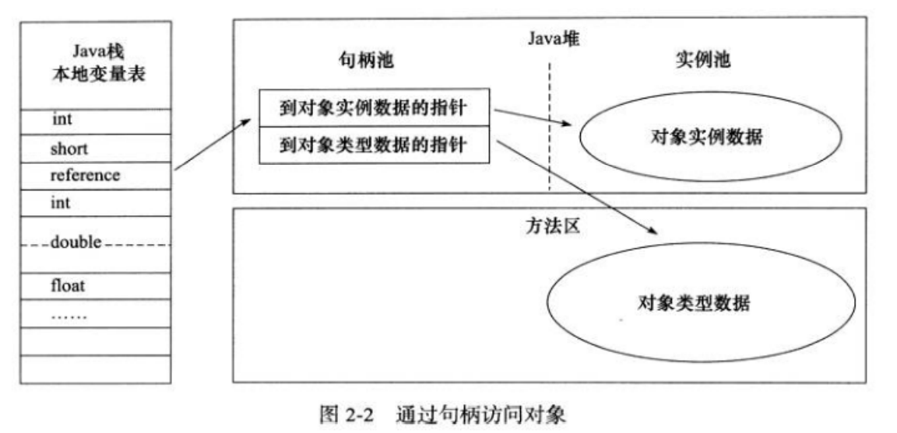

    - 如果使用直接指针的话，Java堆对象的布局中就必须考虑如何放置访问类型数据的相关信息，而reference中存储的直接就是对象的地址

      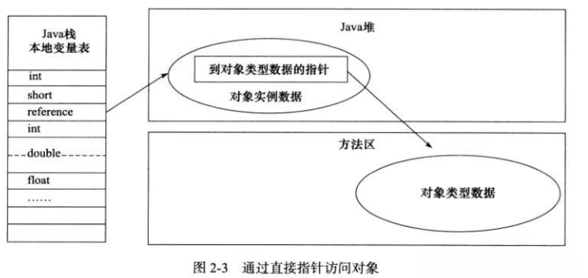

      > 对象实例数据：在堆中，对象中各个实例字段的数据
      >
      > 对象类型数据：在方法区中，对象的类型、父类、实现的接口、方法等信息

      从上面可以看出，两种方法各有优势，使用句柄来访问对象，最大的优点就在于他是稳定的，当对象地址发生变化是，只需要修改句柄池中实例数据的指针，而不需要变动reference中的数据；直接指针的优势就在于他速度快，因为相较于句柄他少了一次指针定位的时间开销

      

19. 如何判断一个常量是废弃常量

    没人任何对象引用这个常量，该常量就变成了废弃常量

    

20. 如何判断一个类是无用的类

    第一个条件是：该类所有的实例都已经被回收，也就是Java堆中不存在该类的任何实例

    第二个条件是：加载该类的ClassLoader已经被回收

    第三个条件是：该类对应的Java.lang.Class对象没有在任何地方被引用，无法在任何地方通过反射访问该类的方法

    只有满足了上述的三个条件，类才能叫做是一个无用的类，才有可能被回收

    

21. 有哪些垃圾收集算法

    第一个算法是标记清除算法，首先标记出所有需要回收的对象，在标记完成后统一回收所有被标记的对象，这个算法是最基础的算法，后续的算法都是对其不足进行改进得到的，首先这个算法的效率存在问题，而且标记清除之后会产生大量不连续的碎片

    第二个算法是复制算法，将内存分成大小相同的两块，每次使用其中的一块，当这一块的内存使用完后，就将还存活的对象复制到另一块去，然后再把使用的空间一次清理掉，这样就使每次的内存回收都会对内存区间的一半进行回收

    第三个算法是标记整理算法，标记过程仍然和标记清除算法一样，但是后续的步骤不是直接对可回收对象回收，而是让所有可存活的对象向一端移动，然后直接清理掉端边界以外的内存

    第四个算法是分代收集算法，目前虚拟机的垃圾收集算法都是分代收集算法，这个算法就是根据各个年代的特点选择合适的垃圾收集算法，比如在新生代中，每次收集都会有大量的对象死去，所以可以选择复制算法，只需要付出少量对象的复制成本就可以完成每次垃圾收集，而老年代的对象存活几率是比较大的，而且没有额外的空间对他进行分配担保，所以我们必须选择“标记清除”或“标记整理”算法进行垃圾收集

    

22. 有哪些常见的垃圾收集器

    如果说收集算法是内存回收的方法论，那么垃圾收集器就是对内存回收的具体实现

    首先第一个就是Serial（串行）收集器，这个收集器是最基本的，单线程的意义意味着他只会使用一条垃圾收集线程去完成垃圾收集工作，更重要的是他在进行垃圾收集工作的时候必须暂停其他所有的工作线程（Stop The World，STW），直到他收集结束。在Serial收集器中，对于新生代使用复制算法，对于老年代使用标记-整理算法。

    > Serial收集器对于运行在Client模式下的虚拟机来说是一个不错的选择

    第二个是Parallerl Scavenge收集器，这个收集器其实就是Serial的多线程版本，Serial收集器中是单线程来进行垃圾回收，Parallel收集器是多线程来进行垃圾回收，所以Parallel的效率肯定是比Serial要高的。除了多线程进行垃圾收集之外，其余行为和Serial收集器完全一致，新生代使用复制算法，老年代使用标记-整理算法

    第三个是ParNew收集器，ParNew收集流程和Parallel Scavenge一样 ,同样是先停止应用程序线程，再进行多线程同时收集，整个收集过程都会暂停用户线程(Stop the Word)，直到垃圾收集完毕。

    ParNew之所以出名，还是因为他能够和CMS搭配使用，他是新生代中唯一一个能够和CMS搭配使用的

    第四个是CMS收集器，它最大的特点就是使用了全新的策略使得在垃圾回收过程中的某些阶段用户线程和垃圾回收线程共同工作，这样做的好处就是用户体验变好了，因为垃圾回收过程和用户过程可以同时执行了，但是也会使得垃圾回收过程变长了

    第五个是G1收集器，该收集器在后台维护了一个优先列表，每次根据允许的收集时间，优先选择回收价值最大的Region

    

    **新生代收集器：**Serial、ParNew、Parallel Scavenge；

    **老年代收集器：**Serial Old、CMS、Parallel Old；

    **通用收集器：** G1；

    **常用组合：**Serial+Serial Old， Parallel Scavenge+Parallel Old，ParNew+CMS，G1（不需要组合其他收集器）。

    

23. 介绍一下CMS垃圾收集器

    CMS全称是Concurrent Mark Sweep，其诞生的初衷就是为了解决Serial、ParaNew等垃圾收集器垃圾回收过程中需要暂停用户线程的弊端，注重的是用户体验，这也是第一个真正意义上的并发垃圾收集器，它实现了让垃圾收集器线程与用户线程基本上同时工作。因此，CMS也是按照这个逻辑把垃圾收集过程划分成了四个部分，分别是初始标记、并发标记、重新标记、并发清理四个阶段，然后CMS会根据每个阶段不同的特性来决定是否停顿用户线程

    - 初始阶段的目的就是将所有GC Root直接引用的对象进行标记，为了避免在这个过程中程序继续产生GC Root对象，所以这一阶段需要停止用户线程，但是这个阶段只是去找到GC Root直接引用的对象，所以这个阶段的速度是非常快的
    - 并发标记这一阶段的目的就是对初始阶段找到的GC Root对象进行深度遍历，找到所有与GC Root关联的对象并进行标记，这个阶段使用多线程进行标记，这个阶段是最耗时的，但是不会停止用户线程
    - 重新标记阶段是为了找到并发标记阶段中新产生的垃圾，因为在第二阶段并不会停止用户线程，当然为了避免这一阶段在产生新的垃圾，所以会停止用户线程，而由于第二阶段中产生的新的垃圾是比较少的，所以速度也是很快的
    - 并发清理阶段就是清理前三个阶段中被标记成可回收的对象，一般情况下使用的清理算法是标记-清除法，由于这个阶段是不停止用户线程的，所以会产生浮动垃圾。

    除了会产生浮动垃圾这一缺点之外，由于使用的垃圾回收算法是标记清除法，所以CMS垃圾收集器的第二个缺点就是会产生空间碎片

    

24. 介绍一下G1垃圾收集器

    G1（Garbage-first）收集器主要针对配备多颗处理器以及大容量内存的机器，以极高概率满足GC停顿时间要求的同时，还具备高吞吐量性能特征，他是一个通用收集器，也就是G1不需要搭配其他收集器就能独立管理整个GC堆，但是G1还是保留了分代的概念，除此之外，G1收集器还有以下特点：并行与并发，即G1收集器能够充分利用CPU，多核环境来缩短Stop the world的时间，G1收集器能够通过并行和并发的方式让Java程序继续执行；第三与CMS收集器不同的是，G1收集器使用了标记-整理算法，因此不会产生空间碎皮，最后，G1相较于CMS，还有一个明显的优势，就是G1收集器能够实现可预测的停顿模型，让使用者能够明确一个时间片段

    > G1仅仅是保留了分代的概念，实际上他是把内存划分成了一块块的逻辑区域，叫Region，可以认为Region可以随时扮演任何一个分代区域的内存

    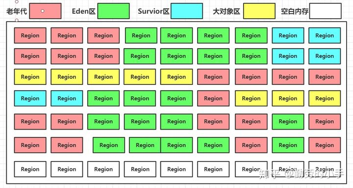

    G1收集器的运作大致上分成了下面的四个步骤：初始标记、并发标记、最终标记、筛选回收

25. GC的分类（很多问题都是问Minor GC和FULL GC）

    针对HotSpot VM的实现，它里面的GC其实准确分类只有两大种：

    **部分收集（Partial GC）**

    - 新生代收集（Young GC/Minor GC）：只对新生代进行垃圾收集
    - 老年代收集（Old GC/Major GC）：只对老年代进行垃圾收集，需要注意的是Major GC在某些语境下，还可能指的是Full GC
    - 混合收集（Mix GC）：对整个新生代和部分老年代进行垃圾收集

    **整堆收集（Full GC）**：收集整个Java堆内存和方法区

    

26. **双亲委派模型**

    每一个类都有一个对应它的类加载器，系统中的ClassLoader在协同工作时会默认使用双亲委派模型，即在类加载的时候会首先判断当前类是否被加载过，已经被加载的类会直接返回，否则才会尝试加载。加载的时候，首先会把请求委派给该父类加载器，依次递归，如果父类加载器可以完成类加载任务就成功返回；当父类加载器无法处理时，子加载器才会尝试自己去加载。

    **类加载器介绍**

    

    - 引导类加载器是用C++实现的，是虚拟机自身的一部分，主要负责加载核心的类库
    - 扩展类加载器和应用类加载器是独立于虚拟机外部的，为Java语言实现，均继承自java.lang.ClassLoader，开发者直接使用这两个类加载器
    - 应用类加载器对象可以由`ClassLoader.getSystemClassLoader()`方法返回，所以一般也被称作系统类加载器，它负责加载用户类路径上所指定的类库，如果应用程序没有自己定义过类加载器，一般情况下这个就是程序中默认的类加载器
    - 用户自定义类加载器：可加载指定路径下的class文件

    

27. 双亲委派模型的好处

    双亲委派模型保证了Java程序的稳定运行，**可以避免类的重复加载**（JVM区分不同类的方式不仅仅根据类名，相同的类文件被不同的类加载器加载产生的是两个不同的类），**也保证了Java的核心API库不会被篡改**。如果不使用双亲委派模型，而是每个类加载器加载自己的话就会出现一些问题，比如我们编写一个类称为`java.lang.UserDefinedClass`类的话，那么程序运行的时候，该类会一层层的上传到启动类，启动类中的加载路径下没有这个包又会往下走，一直到系统类加载器（因为java.lang这个路径在系统类的加载路径下），但这样做是不允许的，因为java.lang是核心API包，需要访问权限，强制加载会报出如下异常：`java.lang.SecurityException: Prohibited package name: java.lang`

    

28. 如果我们不想使用双亲委派模型怎么办

    为了避免双亲委派机制，我们可以定义一个类加载器，然后重载`loadClass()`即可，因为双亲委派机制的逻辑写在了`loadclass`中。

    

29. 如何自定义类加载器？

    除了`BootstrapClassLoader`，其它类加载器均由Java实现且全部继承自`java.lang.ClassLoader`，如果我们要自定义自己的类加载器，很明显需要继承`ClassLoader`

    

30. 类加载过程

    类加载的过程分成了三步：加载，连接，初始化。连接的过程又可以分成三步：验证，准备，解析

    第一步的加载过程主要完成三件事：通过全类名获取定义此类的二进制字节流；将字节流所代表的静态存储结构转换为方法区的运行时数据结构；在内存中生成一个代表该类的Class对象，作为方法区这些数据的访问入口

    连接-验证阶段主要是用来验证文件格式、字节码、符号引用和元数据是否符合虚拟机的要求

    连接-准备阶段正式为类变量分配内存和设置变量初始值（默认值）

    连接-解析阶段是虚拟机将常量池内的符号引用替换为直接引用的过程，也就是得到类或者字段、方法在内存中的指针或者偏移量

    > 需要注意的是，加载和连接阶段不是完全分开的，有可能在加载阶段，连接就开始了

    最后一步是初始化，在这一步中JVM才开始真正地执行类中定义的Java程序代码（字节码）

    > 反射的原理就是在加载这一步加载进去的是.class文件，也就是类编译后产生的字节码文件，.class文件中包含了Java类的全部信息，反射就是获取这个.class文件，然后再去进行各种操作

    

31. StringBuilder，StringBuffer，String的区别

    首先，从可变性角度来看，String，StringBuilder，StringBuffer这三者之间的底层都是一个`char`类型的数组，不同的是，String的底层数组使用final修饰了，所以String可以看成一个常量，而另外两个没有经过final修饰，所以他们是变量。

    第二， 从线程安全性角度来看，StringBuffer对方法加上了同步锁，所以StringBuffer是线程安全的，而StringBuilder中的方法没加锁，所以StringBuilder是线程不安全的。

    第三，从性能角度来看，每次对String对象进行修改，实际上都会生成一个新的String对象，然后将指针指向新的String对象。而StringBuffer和StringBuilder都是在现有对象的基础上进行修改，但是由于StringBuffer上有锁，所以性能比StringBuilder低

    

32. 字符常量和字符串常量的区别

    1. 从形式上，字符常量是用单引号引起来的一个字符，字符串常量是用双引号引起来的若干个字符

    2. 从含义上，字符常量相当于一个整型值（ASCII码），字符串常量代表一个地址值（该字符串在内存中存放的位置）

    3. 从内存角度来看，字符常量只占2个字节，而字符串常量通常占若干个字节

       

33. 成员变量和局部变量的区别

    - 从语法形式上看，成员变量被static以及访问控制修饰符修饰，而局部变量不能够被static修饰以及访问控制修饰符修饰
    - 从变量在内存中的存储方式来看:如果成员变量是使用static 修饰的，那么这个成员变量是属于类的，如果没有使用static 修饰，这个成员变量是属于实例的。对象存于堆内存，如果局部 变量类型为基本数据类型，那么存储在栈内存，如果为引用数据类型，那存放的是指向堆内存对象的引用或者是指向常量池中的地址
    - 从变量在内存中的生存时间来看，成员变量是对象的一部分，它随着对象的创建而创建，而局部变量是随着方法的调用而自动消失
    - 成员变量如果没有被附初值，则会自动以类型的默认值赋值，当然如果被final修饰了，那么必须赋初值，局部变量不会自动赋值

    

34. Java中的IO流

    > IO流分为了几种？

    - 按照流的流向分，可以分为输入流和输出流
    - 按照流的操作单元分，可以分为字符流和字节流
    - 按照流的角色分可以分为节点流和处理流

    Java中的IO流涉及到了40多个类，但是这40多个类都是从下面四个抽象类基类中派生出来的

    - InputStream/Reader：所有的输入流的基类，前者是字节输入流，后者是字符输入流
    - OutputStream/Writer：所有输出流的基类，前者是字节输出流，后者是字符输出流

    

    >既然有了字节流，为什么还要有字符流

    问题的本质想问：无论是文件读写还是网络发送接收，信息的最小存储单元都是字节，那为什么IO流操作要分为字节流操作和字符流操作呢？字符流是由Java虚拟机将字节转换得到的，问题就出在这个过程还算是比较耗时的，并且，如果我们不知道编码类型就很容易出现乱码问题，所以I/O流就干脆提供了一个直接操作字符的接口，方便我们平时对字符进行流操作，音频文件、图片等媒体文件使用字节流比较好，涉及到字符使用字符流比较好

    

35. **什么是深拷贝和浅拷贝？**

    针对基本数据类型，深拷贝和浅拷贝都是会直接进行值传递，也就是将该属性值复制一份给新的对象。因为是两份不同的数据，所以对其中一个对象的修改不会影响到另一个对象

    对于引用数据类型，浅拷贝指的是对引用的拷贝，也就是说传递的是地址指向，两个变量指向的是同一个对象，新的对象并没有对引用数据类型创建内存空间。深拷贝则是对引用数据类型创建一个新对象，并复制其内容，两个对象之间不会相互影响

    ```java
    // 浅拷贝的两种方式
    // 1. 通过构造函数进行浅拷贝
    Person p1 = new Person("张三",23);
    Person p2 = new Person(p1);
    // 2. 通过调用重写clone方法进行浅拷贝
    Student stu2=(Student)stu1.clone();
    
    public Object clone() {
        Object obj=null;
        //调用Object类的clone方法，返回一个Object实例
        try {
           obj= super.clone();
        } catch (CloneNotSupportedException e) {
           e.printStackTrace();
        }
        return obj;
    }
    
    // 深拷贝的两种方式
    // 1. 通过调用重写后的clone方法进行深拷贝：对每一层的每个对象都进行浅拷贝等于深拷贝
        public Object clone() {
            Object obj=null;
            //调用Object类的clone方法——浅拷贝
            try {
                obj= super.clone();
            } catch (CloneNotSupportedException e) {
                e.printStackTrace();
            }
            //调用Age类的clone方法进行深拷贝
            //先将obj转化为学生类实例
            Student stu=(Student)obj;
            //学生类实例的Age对象属性，调用其clone方法进行拷贝
            stu.age=(Age)stu.getaAge().clone();
            return obj;
        }
    // 2. 通过对象序列化实现深拷贝
        public String toString() {
            return "姓名是： "+this.getName()+"， 年龄为： "+this.getaAge().toString()+", 长度是： "+this.getLength();
        }
    // 不想被序列化的变量通过transient修饰
    ```

    

36. 使用线程池的好处

    - 降低资源消耗：通过重复利用已创建的线程降低线程创建和销毁造成的损耗
    - 提高响应速度：当任务到达后，任务可以不需要等待线程创建就能立即执行
    - 提高线程的可管理性：使用线程池能够统一地进行分配、调优和监控

    

37. 为什么ArrayList是线程不安全的

    对于ArrayList中，其中有两个全局变量elementData和size，在增加一个元素的代码是`elementData[size++]`，需要两个过程，首先是在elementData[size]处赋值，然后size++，在多线程的环境下，这两个过程之间可能发生线程切换，有可能已经赋好了值但是size却未变化，而且size++也不是原子操作，如果想要使用线程安全的线性表，可以使用Collections.synchronizedList(new ArrayList<Object>())，或者是使用CopyOnWriteArrayList

    

38. **对CopyOnWrite的理解**

    Copy-On-Write简称COW，其核心思想是：多个调用者共同访问相同的资源，他们会共同获取相同的指针指向相同的资源，直到某个调用者修改资源内容时，系统才会真正复制一块专用副本给该调用者，而其他调用者能够见到的资源仍然保持不变，当更新操作完成之后，会使用这个副本来替换源数据。

    写时复制思想的优点在于读没有加锁，所以它适合读多写少的场景

    缺点在于数据一致性问题，对于没有修改操作的线程而言，在其他线程更新操作结束之前，他们读到的数据仍然是旧数据，而且当面对比较大的对象的修改，频繁的复制和替换会消耗内存，引起GC，影响性能。


39. 构造函数、析构函数、拷贝构造函数等函数的作用

    构造函数在创建一个对象时会被自动调用，如果用户没有自定义构造函数，系统会默认使用无参构造函数，该函数会把对象中的数据成员全部初始化为默认值；构造函数没有返回值

    与构造函数相反，当对象结束其生命周期的时候，系统会自动调用析构函数，一个类中只能有一个析构函数，析构函数没有参数，也没有返回值，如果用户没有定义，则系统会默认一个析构函数；析构函数的调用条件：（1）在函数中定义一个对象，在函数调用结束后，则会自动调用析构函数来删除这个函数体内创建的对象（2）使用new创建的对象，使用delete运算符删除它的时候

    > 析构函数之所以被定义成虚函数，是为了避免内存泄漏，因为当基类的引用或指针指向到派生类的对象时，如果没有将基类的析构函数定义成虚函数，只会调用基类的析构函数，那么此时只能够清理到基类中的成员，而派生类所占有的空间得不到释放从而造成内存泄漏，如果将基类函数定义成虚函数，在执行析构时，则根据对象的类型来执行析构函数，此时派生类占用的资源也能够得到释放

    拷贝构造函数实际上也是构造函数，具有一般构造函数的所有特性，其名字也与所属类名相同，拷贝构造函数中只有一个参数，这个参数是对同类对象的引用

    拷贝构造函数的目的是用一个已有的对象创建一个新的对象，这种情况属于浅拷贝

    


### 数据结构

1. 介绍一下红黑树

   首先，红黑树又叫做自平衡二叉搜索树，它的出现就是为了解决二叉搜索树当面对顺序数据插入时会退化成链表的情况，他一共需要满足以下条件：

   - 首先是，红黑树中的节点只能是黑色或者红色
   - 然后红黑树的根节点和叶子节点都要是黑色的
   - 每个红色节点的子节点都要是黑色的，这是为了避免两个红色节点相邻
   - 从任意节点到每个叶子节点的所有路径上都包含有相同数目的黑色节点

   > 调整红黑树的策略有：变色、左旋、右旋


2. 排序算法

   ```java
   // 冒泡排序
   public void bubbleSort(int[] arr) {
       if (arr.length <= 1) {
           return;
       }
       int n = arr.length;
       for (int i = arr.length - 1; i > 0; i--) {
           for (int j = 0; j < i; j++) {
               if (arr[j] > arr[j + 1]) {
                   swap(arr, j, j + 1);
               }
           }
       }
   }
   // 时间复杂度O(n^2)，稳定排序
   
   // 选择排序
   // 思路就是每一次都是只能够选择出一个最小的，把它放到相应的位置
   public void selectSort(int[] arr) {
       if (arr.length <= 1) {
           return;
       }
       
   
       for (int i = 0; i < arr.length; i++) {
           int minIndex = i; // 最小的数的下标
           for (int j = i + 1; j < arr.length; j++) {
               minIndex = arr[minIndex] > arr[j] ? j : minIndex;
           }
           swap(arr, minIndex, i);
       }
   
   }
   // 时间复杂度是O(n^2)，不稳定的排序，比如数组[66,72,66,1,2,5]，第一次排序就会变成[1,72,66,66,2,5]，因此他是一个不稳定的排序
   
   // 插入排序 假设我想要知道第i个元素放到哪里，那么我就假设[0,i-1]位置上是顺序的
   public void insert(int[] arr) {
       if (arr.length <= 1) {
           return;
       }
       for (int i = 1; i < arr.length; i++) {
           for (int j = 0; j <= i - 1; j++) {
               if (arr[i] < arr[j]) {
                   swap(arr, i, j);
               }
           }
       }
   }
   // 时间复杂度O(n^2)，稳定排序
   
   
   shuffle(arr); // 打乱数组中的顺序
   public void quickSort(int[] arr, int L, int R) {
       if (L < R) {
           // swap(arr, L + (int)(Math.random() * ((R - L) >> 1)), R);
           // 不随机的话，最坏时间复杂度就是O(n^2)
           int pos = partition(arr, L, R);
           quickSort(arr, L, pos - 1);
           quickSort(arr, pos + 1, R);
       }
   }
   
   // 以arr[L]为基准，比他小的放到左边，比它大的放到右边，和他相等的放到中间
   // 函数返回小于区域的右边界，大于区域的左边界
   public int partition(int[] arr, int L, int R) {
       int pivot = arr[L];
       int left = L + 1, right = R;
       while (left <= right) {
           while (left <= right && arr[left] <= pivot) {
               left++;
           }
           
           while (left <= right && arr[right] > pivot) {
               right--;
           }
           
           if (left >= right) {
               break;
           }
           
           swap(arr, left, right);
       }
       swap(arr, L, right);
       
       return right;
   }
   // 时间复杂度为O(NlogN)，不稳定
   // https://blog.csdn.net/qq_36523667/article/details/79737648
   
   
   // 归并排序
   public void merge(int[] arr) {
       int n = arr.length;
       int[] helper = new int[n];
       
       mergeSort(arr, 0, n - 1);
   }
   public void mergeSort(int[] arr, int L, int R) {
       if (arr.length <= 1) {
           return;
       }
       if (L == R) {
           return;
       }
       int mid = L + (R - L) >> 1;
       mergeSort(arr, L, mid);
       mergeSort(arr, mid + 1, R);
       merge(arr, L, mid, R);
   }
   
   public void merge(int[] arr, int L, int mid, int R) {
       for (int i = L; i <= R; i++) {
           helper[i] = arr[i];
       }
       int leftIdx = L;
       int rightIdx = mid + 1;
       
       for (int p = L; p <= R; p++) {
           if (leftIdx == mid + 1) {
               arr[p] = helper[rightIdx++];
           } else if (rightIdx == R + 1) {
               arr[p] = helper[leftIdx++];
           } else if (arr[leftIdx] < arr[rightIdx]) {
               arr[p] = helper[leftIdx++];
           } else if (arr[leftIdx] > arr[rightIdx]) {
               arr[p] = helper[rightIdx++];
           }
       }
   }
   
   // 时间复杂度O(NlogN)，稳定排序
   ```

3. 适合做索引的数据结构

   hash、B+树、跳表，分别对应了HashMap、MySQL、Redis


### 智力题

1. 一架飞机有n个座位，n个乘客正在依次登机。第一个上飞机的乘客忘记自己的座位号了，就随便找了座位坐下来。后面n-1个乘客知道自己的座位号，除非他们看到自己的座位被人坐了，否则，他们都会坐到自己的座位。问，最后一个乘客坐到自己的座位的概率是多少？

   因为第一个乘客可以随机坐，所以它能够做到任何一个位置上的概率是$\frac{1}{n}$

   假设第一个乘客做到了第x个位置上，那么第二个乘客到第x-1个乘客都可以正确做到正确位置上，那么第x个乘客能够做的座位就可以在第1个座位和第x+1到第n个座位上选择，这就相当于问题的规模变成了n-x+1

   所以我们就能够看出规律了

   - 当x=1的时候，也就是第一个乘客做到了第一个位置上，做到了自己的位置上，此时最后一个乘客做到自己位置上的概率是1，$f(1) = 1$

   - 当x=n的时候，也就是第一个乘客做到了最后一个位置上，此时最后一个乘客做不到自己的位置上，$f(n)=0$

   - 当x在(2,n-1)这个范围的时候，可以总结公式如下

     $ f(n) = \frac{( 1+f(n-1)+f(n-2)+f(n-3)+...+f(2) )}{n}$

     根据$f(1) = 1$和$f(n)=0$可以得到，$f(2)=50%,f(3)=50%,...f(n)=50%$

   
   
2. 有64匹马，8个赛道，想要找出跑的最快的4匹马，要多少轮

   - 第一种想法就是每次赛8匹马，每一轮都留下最快的4匹马，这样需要8+4+2+1=15轮

   - 第二种想法

     - 每8匹马为一组，进行8轮，每一轮都去除每一组中的后四名，这样马匹的总个数从64变成了32
     
     - 选出这8组中最快的马匹，让他们跑一圈，去掉后四名所在的组，这样马匹的个数从32变成了16
     
     - 假设这时候剩下的是这16匹马，如下表
     
            | A1   | B1   | C1   | D1   |
            | A2   | B2   | C2   | D2   |
            | A3   | B3   | C3   | D3   |
            | A4   | B4   | C4   | D4   |
     
       因为我们在第二步中对8匹马进行了排序，所以我们能够知道这四组中最快的马的顺序，这里假设A1>B2>C1>D1
     
       但是有可能A2-A4都比B1快，也就是说不同组之间马的速度是不知道的，同一组之间马匹的速度是知道的，在第一步中就知道了
     
       所以，至此我们知道了最快的马肯定就是A1，而且最快的四匹马肯定是出现在这些马匹中的
     
       ```
        | A1   | B1   | C1   | D1   |
        | A2   | B2   | C2   |      |
        | A3   | B3   |      |      |
        | A4   |      |      |      |
       ```
     
       除了A1，还剩下9匹马，我们把B1去掉，让剩下的8匹马跑，因为B1的速度>C1>D1，如果在比较过程中B2,B3,C3,D1中的任意一个出现在了前三名中，那么使用B1替换掉这个第三名就好了	
     
       所以，第10轮就让A2,A3,A4,B2,B3,C1,C2,D1跑一轮，只要这一轮的前三名不是A2,A3,A4，我们就能够结束比较了
     
     - 如果第三步的比较中前三名是A2,A3,A4，这时还需要让A4和B1进行比较，所以这种情况下，需要11轮比较

   >[64匹马，8个赛道，最少多少次比赛找出最快的 4 匹马，以及对所有马进行排序_Jiewang的博客-CSDN博客_64匹马](https://blog.csdn.net/u013095333/article/details/99718233)
   
3. 共有15张牌，2~10分别表示他们本身，A是1，JQK分别是11，12，13，判断5张扑克牌是不是顺子，大小王可以当作任意数字

   ```java
   public boolean check(int[] nums) {  // nums中有5个数字,0表示大小王，可以代表任意数字
   //    Arrays.sort(nums);
       // 用来记录出现的牌
       int[] helper = new int[14];
       for (int n : nums) {
           helper[n]++;
       }
       
       int max = -1;
       int min = 14;
       for (int i = 0; i < nums.length; i++) {
           if (nums[i] == 0) {
               continue;
           }
           if (helper[nums[i]] > 1) return false;
           if (max < nums[i]) max = nums[i];
           if (min > nums[i]) min = nums[i];
       }
       return max - min < 5;
   }
   ```
   
   
   
4. 走廊上有100个已关闭的抽屉。有个人先是将100个抽屉全都打开。接着，这个人从头开始每数2个抽屉就关上第2个抽屉。 然后，在第三轮的时候，再从头开始每数3个就切换第3个抽屉的开关状态（也就是将关上的抽屉打开，将打开的抽屉关上）。照此规律反复操作100次，在第i轮，这个人会每数i个抽屉就切换第i个抽屉的状态。当第100轮经过走廊时，只切换第100个抽屉的开关状态，问此时有几个抽屉是开着的？

   
   
5. hash函数碰撞的概率推导

   通过**生日问题**来理解哈希函数碰撞的概率推导，生日问题指的是一个班级需要多少人，才能够保证每个同学的生日不一样？

   假设一个班级中有n人（n<365），那么这n个人生日都不相同的概率为
   $$
   p=\frac{365}{365}*\frac{364}{365}*\frac{363}{365}*\cdots*\frac{365-n+1}{365}
   $$
   那么至少有两个人生日相同的概率是$1-p$

   根据泰勒公式，指数函数$e^x=1+x+x^2+x^3+\cdots$，当x非常小的时候，$e^x \approx 1 + x$

   $\frac{364}{365}=1-\frac{1}{365} \approx e^{-\frac{1}{365}}$

   所以，上面的公式又能够变成
   $$
   p=1 \times e^{-\frac{1}{365}} \times e^{-\frac{2}{365}} \times e^{-\frac{3}{365}} \times \cdots \times e^{-\frac{n-1}{365}} = e^{-\frac{n(n-1)}{730}}
   $$
   所以整理一下，将365换成哈希表中数组的长度d，上面的公式就变成了（n是计算次数）
   $$
   p=e^{-\frac{n(n-1)}{2d}}
   $$
   所以哈希碰撞的概率为
   $$
   1-e^{-\frac{n(n-1)}{2d}} \approx \frac{n(n-1)}{2d}
   $$

   > 当d远远大于n时，上面公式又可以化简成 $\frac{n^2}{2d}$

   > [BlockChain学习——Hash函数碰撞概率公式及其推导_No_Game_No_Life_的博客-CSDN博客](https://blog.csdn.net/no_game_no_life_/article/details/102831174)


### 大数据题目

**<font color=red size=4pt>大数据题目的解题技巧</font>**

- 哈希函数可以把数据按照种类均匀分流
- 布隆过滤器用于集合的建立和查询，并可以节省大量空间
- 一致性哈希解决数据服务器的负载管理问题
- 利用并查集结构做岛问题的并行计算
- 位图解决某一范围上数字的出现情况，并可以节省大量空间
- 利用分段统计思想，并进一步节省大量空间
- 利用堆、外排序来做多个处理单元的结果合并


1. 有一个包含100亿个URL的大文件，假设每个URL占64B，找出其中所有重复的URL

   > （注意：B是字节，b是位）

   - 首先，如果能够允许有一定的失误率，那么可以使用布隆过滤器，遍历一遍这个URL文件就能够知道有哪些重复的URL

     布隆过滤器的失误率体现在他说这个URL不重复，那么他就一定不重复，如果说他重复，那么可能由于哈希冲突的原因并不重复

   - 第二，我们可以使用哈希分流的方法，根据给定内存的大小来确定划分成的文件的数量，（因为文件是会被放到磁盘中的，每个文件的大小其实就是代码中用到的HashMap的大小），假设给定的内存大小是1G，100亿个URL的总大小大约是596G，所以我们可以通过Hash函数把这些URL划分到600个小文件中，重复的URL肯定会在同一个小文件中，所以我们只需要通过一个HashMap来依次遍历这600个小文件，统计每个URL出现的次数即可


2. 某搜索公司一天的用户搜索词汇是百亿数据量，请设计一种求出每天热门Top100词汇的可行办法

   我们可以把这百亿数据通过哈希分流的方式，分到100个文件中，在分流的过程中，统计出搜索词的频次，即这100个小文件的格式是

   `行数 + 搜索词 + 频次`，从大到小排列，随后，我们创建一个大根堆，堆的大小为100，然后我们把每个文件中的第一行数据（也就是每个文件中频次最多的）放入到大根堆中，这里需要注意，大根堆中的数据的格式是`行数 + 搜索词 + 频次 + 文件索引`，通过频次来排序，第i次弹出的就是第i热门的词汇，每当弹出一个词汇时，通过文件索引和行数就能够得到对应文件的下一行的数据，这样循环进行100次之后，就能够得到Top100的词汇数据 

   **如果涉及到了局部小排名，合并成全局大排名，那么可以使用堆**


3. 32位无符号整数的范围是0~4294967295，现在有40亿个无符号整数，可以使用最多1GB的内存，找出所有出现了两次的数

   - 42亿大约是$2^{32}$，所以这40亿个无符号整数的大小是不到16G的，因此同样可以使用哈希分流的方式将他们分成多个小文件，然后使用HashMap来统计每个整数出现的次数

     > 在多数的情况下，哈希分流都能够使用，但是在这个场景下，哈希分流却不是最好的方法

   - 对于这个问题，我们可以使用位图来解决，我们知道位图使用一位来表示这个数据是否出现，那么如果我们对于每个数使用两个位呢？这样的话就能够表示整数出现的次数了，00表示出现0次，01表示出现1次，10表示出现2次，11表示出现2次以上

     这样的话，用两个位表示1个数，40亿个数最多需要多少的内存？

     共需要位数$2^{32}×2$，所以40亿个数肯定不会超过1G


4. 更进一步，如果只给定了10M的内存，怎么找到这40亿个数的中位数呢？

   这种题目就用到了范围区间统计的思想，首先，我们先来看一下10M的内存能够申请到多大的无符号整型数组

   $\frac{10M}{4字节}=10×2^{18}$个数，也就是整形数组中可以有$10×2^{18}$个数，`int[] helper = new helper[10×2^{18}]`

   我们通过这些数来划分一下这40亿个数的范围$2^{32}$

   $\frac{2^{32}}{10×2^{18}}=\frac{2^{11}}{1.25}$，也就是说整型数组中的每个数可以表示2048大小的范围，这样内存也不会溢出，因此我们就可以通过遍历这40亿个数，比如当数的大小在0-2048之间的时候，`helper[0]++`，当遍历一遍之后，这40个数在各自区间的个数就会被统计出来

   那么我们就从`helper[0]`开始，逐渐向后累加，直到`helper[0] + ... +helper[i] >= 20亿`的时候，我们就能够知道中位数肯定是在`i*2048 - (i + 1)*2048-1`这个范围内，这时候记录下`helper[0] + ... + helper[i - 1]`的大小，假设为x

   然后再去遍历这40亿个数，这一次遍历只保留`i*2048 - (i + 1)*2048-1`这个范围内的数据，`helper`中每个元素能够表示的范围也要做出相应变化，然后再去找满足`helper[0] + ... + helper[i] >= 20 - x`的i值，这时候又能进一步缩小中位数所在的范围，这样一步步的往下进行，经过多轮迭代就能够找到中位数了

   

5. 给定一个10G的文件，其中是无序的有符号整数，如果只给定5G内存，怎么样能够输出一个新文件，文件内容是排好序的

   这个问题也是需要借助堆来解决

   堆中存放的数据格式是`数值 + 频次`，因为是一个有符号整数，所以每个数占4个字节，在使用4个字节来表示频次，因此一个数据占8个字节，又考虑到堆内部可能会有索引等空间消耗，因此我们可以让每个数据占的空间大一些，不妨设一个数据节点占16个字节

   那么这5G的内存总共能够保存$\frac{5G}{16字节}=5×2^{26}$，可以约等于$2^{28}$

   对于有符号整数，它的取值范围是$-2^{31}-2^{31} - 1$，因此，通过小根堆能够将其划分成$\frac{2^{32}}{2^{28}}=16$部分

   第一部分是$-2^{31} - 2^{31} + 2^{28} - 1$，依此类推

   因此，第一次遍历文件的时候，只往小根堆里面存放$-2^{31} - 2^{31} + 2^{28} - 1$内的数据，遍历结束之后，小根堆依次弹出，根据频次写入新的文件

   总共循环16次之后便可以生成一个排好序的文件

   

   上面的使用的是小根堆，我们还可以使用大根堆，上面我们已经算出来了堆中总共能够存放大约$2^{28}$个数据（数据的格式仍然是数值+频次），$2^{28}$大约是2.5亿个数，那么我每次让大根堆里面放1亿个数，遍历文件的时候，首先需要比较当前的数字和队顶元素的大小，如果当前数字小于堆顶元素，那么就把当前元素入堆，堆顶元素弹出，这样，经过一次遍历之后，我们就能够得到最小的1亿个数，此时我们再通过一个变量，将这个变量标记为堆顶元素的值，在下次遍历文件的时候只将比这个值大的数加入堆中。还需要注意的是，当我们把大根堆里面的数据输出的时候，还需要根据数值进行一下排序，因为如果按照大根堆弹出顺序，最后不会是升序的。所以这也是为什么大根堆最多能放2.5亿个数，我们却只放1亿个数


### 位运算

> 给定两个有符号32位整数a和b，返回a和b中较大的，不能用比较符号

```java
// 0 --> 1
// 1 --> 0
public int flip(int n) {
    return n ^ 1;
}

public int sign(int n) {
    return flip((n >> 31) & 1);   // 判断这个n的符号位，1是正数，0是负数
}

public int getMax(int a, int b) {
    int c = a - b;
    int scA = sign(c);    // 如果scA=0，那么就说明a-b小于0，返回b
    int scB = flip(scA);  // scA=0,那么scB=1，也就是说scA和scB是互斥的
    return a * scA + b * scB;
}

// 但是上面这个解法会有一个问题，那就是c有可能会出现内存溢出的现在
// 比如a=Integer.MAX_VALUE,b=Integer.MIN_VALUE
public int getMax2(int a, int b) {
    int c = a - b;
    int sa = sign(a);
    int sb = sign(b);
    int sc = sign(c);
    int diffSab = sa ^ sb;    		// a和b是不是相同符号,0是相同符号，1不是相同符号
    int sameSab = flip(diffsab);	// 互斥
    int returnA = diffsab * sa + sameSab * sc;
    int returnB = flip(returnA);
    return a * scA + b * scB;
}
```


